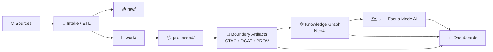

# 📊 Traceability Dashboard Query Library (MCP)

🧩 **Path:** `mcp/traceability/dashboards/queries/`  
🟨 **Status:** Draft (living spec)  
🧠 **Core promise:** every dashboard panel is reproducible from **versioned query files + immutable evidence artifacts** (not “someone’s saved query in a UI”).

---

## Why this folder exists 🧭

The MCP docs and KFM design audits repeatedly call out the need for **end-to-end traceability** (traceability matrix, experiment logs, auditability) — and also note the risk of leaving these as “implicit” instead of operationalized in code and dashboards. [oai_citation:0‡Scientific Method _ Research _ Master Coder Protocol Documentation.pdf](file-service://file-HTpax4QbDgguDwxwwyiS32) [oai_citation:1‡Scientific Method _ Research _ Master Coder Protocol Documentation.pdf](file-service://file-HTpax4QbDgguDwxwwyiS32)

This folder is the operational layer:
- ✅ **Queries are the “contract”** between the system and its dashboards (Grafana/Metabase/Superset/custom UI panels).
- ✅ **Queries generate artifacts** (JSON/CSV/Markdown summaries) so audits are reproducible and reviewable.
- ✅ **Dashboards become evidence-first**: every trend line can point back to a query + run_id + input manifests.

---

## Traceability flow (at a glance) 🧬



KFM’s pipeline philosophy explicitly treats **STAC/DCAT/PROV** as boundary artifacts produced before publish/serve, and this library provides the queries that continuously verify that promise. [oai_citation:2‡MARKDOWN_GUIDE_v13.md.gdoc](file-service://file-UYVruFXfueR8veHMUKeugU) [oai_citation:3‡📚 Kansas Frontier Matrix (KFM) Data Intake – Technical & Design Guide.pdf](file-service://file-EbUCdsJMbu5KwpoKMrLrgj)

---

## Design inputs pulled from project docs 🧠📚

These are the “requirements” this query library implements:

1) **Provenance-first + trust boundaries**  
KFM data intake emphasizes a provenance-first pipeline, with immutability and trust boundaries, governance logs, and metadata that can be inspected and audited. [oai_citation:4‡📚 Kansas Frontier Matrix (KFM) Data Intake – Technical & Design Guide.pdf](file-service://file-EbUCdsJMbu5KwpoKMrLrgj)

2) **Run telemetry / observability is first-class**  
The architecture specifies structured run telemetry (run_id, pipeline_id, stage, status, duration_ms, artifact_count, error_count, timestamps). Dashboards must be derived from these logs, not vibes. [oai_citation:5‡Additional Project Ideas.pdf](file-service://file-Pc2GNivcrHBeKjBQksLC3T)

3) **Graph integrity health checks should be automated + trended**  
“Graph Integrity Health Checks” are described as a scheduled CI job producing summaries (including `summary.md`, `index.csv`) and trending “metadata about metadata” over time. [oai_citation:6‡Additional Project Ideas.pdf](file-service://file-Pc2GNivcrHBeKjBQksLC3T) [oai_citation:7‡Additional Project Ideas.pdf](file-service://file-Pc2GNivcrHBeKjBQksLC3T)

4) **UI must surface provenance + citations (“why the map looks the way it does”)**  
The architecture/UI plan includes layer info dialogs and a “Layer Provenance” style panel listing citations/metadata for active layers. [oai_citation:8‡Kansas Frontier Matrix (KFM) – Comprehensive Architecture, Features, and Design.pdf](file-service://file-4Umt1yHoGKicdmLWzFJ9sC)

5) **Focus Mode AI requires citations + explainability + monitoring**  
The UI describes a Focus Mode explainability panel, while the AI overview calls for metrics like citation coverage, drift monitoring, and governance-aware behavior. [oai_citation:9‡KFM- python-geospatial-analysis-cookbook-over-60-recipes-to-work-with-topology-overlays-indoor-routing-and-web-application-analysis-with-python.pdf](file-service://file-2gpiGDZS8iw6EdxGswEdHp) [oai_citation:10‡📚 Kansas Frontier Matrix (KFM) Data Intake – Technical & Design Guide.pdf](file-service://file-EbUCdsJMbu5KwpoKMrLrgj)

6) **Environmental + live sensor layers need real queries (PostGIS/time-series)**  
Future proposals include Live Sensor & IoT layers and real-time layer queries (e.g., “latest river gauges”). [oai_citation:11‡🌟 Kansas Frontier Matrix – Latest Ideas & Future Proposals.docx.pdf](file-service://file-SQ3f7ve8SGiusT6ThZEuCe)

7) **Sensitive data controls + privacy-aware querying are mandatory**  
The technical docs emphasize sensitivity tagging and coordinate generalization; data mining references highlight query auditing/inference control concepts (useful for dashboard guardrails). [oai_citation:12‡Kansas Frontier Matrix (KFM) – Comprehensive Technical Documentation.pdf](file-service://file-AkqwUuYPp5zePf7pv5SMxi) [oai_citation:13‡Data Mining Concepts & applictions.pdf](file-service://file-2uwEbQAFVKpXaTtWgUirAH)

8) **Artifact integrity + supply-chain evidence**  
KFM describes embedding checksums/hashes in manifests and auditing artifacts; proposed ideas include OCI/ORAS/Cosign style artifact provenance and signatures. [oai_citation:14‡Additional Project Ideas.pdf](file-service://file-Pc2GNivcrHBeKjBQksLC3T) [oai_citation:15‡Additional Project Ideas.pdf](file-service://file-Pc2GNivcrHBeKjBQksLC3T)

---

## Directory layout 📁

> This README documents the query *library*. The actual structure can evolve, but keep it boring + consistent.

```text
mcp/traceability/dashboards/queries/
├── README.md  👈 you are here
├── catalog.yml                # registry of all queries + metadata
├── _spec/
│   ├── query_spec.schema.json # optional JSON Schema for validation
│   └── result_contracts/      # expected outputs per pack (for tests)
├── neo4j/        🕸️ Cypher queries (graph + provenance)
├── postgis/      🗺️ SQL queries (layers, geospatial, time-series)
├── duckdb/       🦆 local analytics over Parquet/GeoParquet/CSV
├── promql/       📈 optional metrics queries if Prometheus exists
├── opensearch/   🔎 optional search/error-log queries
└── runs/
    └── YYYY-MM-DD/            # generated artifacts (JSON/CSV/MD)
        ├── graph_health/
        ├── provenance/
        ├── ai_traceability/
        └── pipeline_telemetry/
```

---

## Query spec (recommended) 🧾

Each query file should start with a small metadata header (YAML or JSON) so we can:
- auto-generate dashboards,
- validate result shapes,
- and enforce “no ad-hoc” in UI.

Example (YAML header + query body):

```yaml
# --- kfm_query_spec:v1 ---
id: graph_health__orphaned_nodes
title: Orphaned Nodes (Graph Integrity)
engine: neo4j
dialect: cypher
pack: graph_health
schedule: weekly_ci
severity: high
params:
  - name: as_of
    type: datetime
    required: true
outputs:
  format: json
  schema:
    orphan_count: integer
    sample_ids: array[string]
tags: [traceability, integrity, neo4j]
notes:
  - "Trend this over time; spikes usually mean ingestion broke relationships."
# --- /kfm_query_spec:v1 ---
```

---

## Query packs 📦 (what dashboards should be built from)

### 1) 🧬 Graph Integrity Health Checks (Neo4j/Cypher)

**Goal:** treat the knowledge graph like production infrastructure: validate it, trend it, and fail the pipeline when integrity degrades.  
This pack is explicitly proposed as weekly CI + artifact output (`summary.md`, `index.csv`) with checks such as: node/relationship deltas, constraints/index status, orphaned metadata nodes, ingestion lag, high-degree node anomalies, and property schema drift. [oai_citation:16‡Additional Project Ideas.pdf](file-service://file-Pc2GNivcrHBeKjBQksLC3T) [oai_citation:17‡Additional Project Ideas.pdf](file-service://file-Pc2GNivcrHBeKjBQksLC3T)

**Suggested queries (minimum set):**
- `graph_health__node_rel_counts.cypher`
- `graph_health__constraints_indexes.cypher`
- `graph_health__orphaned_metadata.cypher`
- `graph_health__ingestion_lag.cypher`
- `graph_health__top_degree_nodes.cypher`
- `graph_health__property_schema_drift.cypher`

Example Cypher snippets (illustrative):

```cypher
// Orphaned data assets (no provenance edges)
MATCH (n:DataAsset)
WHERE NOT (n)--()
RETURN count(n) AS orphan_count, collect(id(n))[0..25] AS sample_ids;
```

```cypher
// Constraints + indexes snapshot (Neo4j built-ins)
CALL db.constraints() YIELD name, type, entityType, labelsOrTypes, properties
RETURN name, type, entityType, labelsOrTypes, properties;

CALL db.indexes() YIELD name, type, entityType, labelsOrTypes, properties, state
RETURN name, type, entityType, labelsOrTypes, properties, state;
```

**Outputs (recommended):**
- `runs/YYYY-MM-DD/graph_health/summary.md` (human-readable)
- `runs/YYYY-MM-DD/graph_health/index.csv` (one-row-per-check; great for plotting)
- `runs/YYYY-MM-DD/graph_health/*.json` (raw metrics) [oai_citation:18‡Additional Project Ideas.pdf](file-service://file-Pc2GNivcrHBeKjBQksLC3T)

---

### 2) 🧾 Provenance Completeness (STAC/DCAT/PROV + Graph)

**Goal:** prove that everything served has provenance, licenses, and transformations documented.

KFM documentation explicitly frames **STAC/DCAT/PROV** as publish boundaries and a provenance-first discipline. [oai_citation:19‡MARKDOWN_GUIDE_v13.md.gdoc](file-service://file-UYVruFXfueR8veHMUKeugU) [oai_citation:20‡📚 Kansas Frontier Matrix (KFM) Data Intake – Technical & Design Guide.pdf](file-service://file-EbUCdsJMbu5KwpoKMrLrgj)

**Suggested queries:**
- `% processed assets missing STAC item`
- `% processed assets missing DCAT dataset record`
- `% assets missing PROV lineage (wasDerivedFrom / activity / agent)`
- `license coverage` and `sensitivity tag coverage`
- `story nodes missing evidence manifests / citations`

Example (DuckDB pseudo-query over a manifest table):

```sql
-- count processed assets missing a provenance record
SELECT
  COUNT(*) AS total_assets,
  SUM(CASE WHEN prov_path IS NULL THEN 1 ELSE 0 END) AS missing_prov,
  ROUND(100.0 * SUM(CASE WHEN prov_path IS NULL THEN 1 ELSE 0 END) / COUNT(*), 2) AS missing_prov_pct
FROM kfm_asset_index
WHERE stage = 'processed';
```

---

### 3) 🔭 Pipeline Telemetry + Sustainability (run_id dashboards)

**Goal:** dashboards should answer:
- “What ran?”
- “What changed?”
- “What failed?”
- “What did it cost (time/compute/energy)?”  

The architecture specifies structured run telemetry keys that should drive these dashboards. [oai_citation:21‡Additional Project Ideas.pdf](file-service://file-Pc2GNivcrHBeKjBQksLC3T)

**Suggested queries:**
- runs per day / per pipeline_id
- duration distributions per stage
- error counts and top failing stages
- artifact_count deltas
- ingestion lag per source
- (optional) energy/carbon per run if logged (design mentions energy/carbon tracking as part of monitoring/UI) [oai_citation:22‡KFM- python-geospatial-analysis-cookbook-over-60-recipes-to-work-with-topology-overlays-indoor-routing-and-web-application-analysis-with-python.pdf](file-service://file-2gpiGDZS8iw6EdxGswEdHp)

---

### 4) 🤖 AI Traceability (Focus Mode monitoring)

**Goal:** make “responsible AI” measurable.

The AI and UI docs reference:
- citations/explainability panels,
- drift monitoring,
- citation coverage,
- and safety/governance behaviors. [oai_citation:23‡KFM- python-geospatial-analysis-cookbook-over-60-recipes-to-work-with-topology-overlays-indoor-routing-and-web-application-analysis-with-python.pdf](file-service://file-2gpiGDZS8iw6EdxGswEdHp) [oai_citation:24‡📚 Kansas Frontier Matrix (KFM) Data Intake – Technical & Design Guide.pdf](file-service://file-EbUCdsJMbu5KwpoKMrLrgj)

**Suggested queries:**
- citation coverage by answer type (avg citations/response; % uncited responses)
- retrieval failures (vector/graph) + top error reasons
- drift indicators (embedding drift / topic drift / data freshness flags)
- user feedback loops (thumbs down + reason categories)
- “no-answer” rate vs hallucination guardrail triggers

---

### 5) 🌎 Environmental + Real-Time Dashboards (PostGIS)

Future proposals include **Live Sensor & IoT** layers and a “layer provenance panel” concept to inspect sources and how layers were prepared. [oai_citation:25‡🌟 Kansas Frontier Matrix – Latest Ideas & Future Proposals.docx.pdf](file-service://file-SQ3f7ve8SGiusT6ThZEuCe) [oai_citation:26‡Kansas Frontier Matrix (KFM) – Comprehensive Architecture, Features, and Design.pdf](file-service://file-4Umt1yHoGKicdmLWzFJ9sC)

**Suggested SQL queries:**
- latest N minutes/hours by sensor type
- freshness (max(timestamp) per station)
- anomaly counts (z-score / MAD) per time window
- spatial coverage (stations per county / watershed)

Example:

```sql
-- latest river gauges in the last hour
SELECT *
FROM river_gauges
WHERE timestamp > NOW() - INTERVAL '1 hour'
ORDER BY timestamp DESC;
```

(Use geospatial cookbook patterns for GeoJSON output when feeding map layers via API.) [oai_citation:27‡KFM- python-geospatial-analysis-cookbook-over-60-recipes-to-work-with-topology-overlays-indoor-routing-and-web-application-analysis-with-python.pdf](file-service://file-2gpiGDZS8iw6EdxGswEdHp)

---

### 6) 🧹 Data Quality & Cleaning (validation dashboards)

Data mining references emphasize preprocessing stages and the need to protect privacy in query outputs (query auditing/inference control). [oai_citation:28‡Innovative Concepts to Evolve the Kansas Frontier Matrix (KFM).pdf](file-service://file-G71zNoWKxsoSW44iwZaaCC) [oai_citation:29‡Data Mining Concepts & applictions.pdf](file-service://file-2uwEbQAFVKpXaTtWgUirAH)

**Suggested quality queries:**
- null-rate by column (per dataset)
- duplicate keys
- geometry validity (`ST_IsValid`)
- outlier counts (time-series spikes)
- schema drift vs contract

**Privacy guardrails (dashboard-safe defaults):**
- aggregate at safe grain (e.g., county instead of address point)
- suppress/sanitize sensitive fields in dashboard outputs
- enforce “deny” on queries that would reveal protected details (aligns with sensitivity tagging + generalization described in KFM docs). [oai_citation:30‡Kansas Frontier Matrix (KFM) – Comprehensive Technical Documentation.pdf](file-service://file-AkqwUuYPp5zePf7pv5SMxi)

---

### 7) 🛡️ Artifact Integrity + Supply Chain Evidence

The system describes embedding checksums/hashes in manifests and auditing artifacts; ideas propose signed artifacts + registry-based provenance. [oai_citation:31‡Additional Project Ideas.pdf](file-service://file-Pc2GNivcrHBeKjBQksLC3T) [oai_citation:32‡Additional Project Ideas.pdf](file-service://file-Pc2GNivcrHBeKjBQksLC3T)

**Suggested queries:**
- missing checksum fields
- checksum mismatch vs stored manifest
- unsigned artifact count (if signatures used)
- reproducibility: same inputs/config ⇒ same canonical digest (where applicable)

---

## Running queries 🏃‍♂️💨

> Keep runners thin. The “source of truth” is the query file + spec header.

### Neo4j (Cypher)
```bash
export NEO4J_URI="bolt://localhost:7687"
export NEO4J_USER="neo4j"
export NEO4J_PASSWORD="..."
cypher-shell -a "$NEO4J_URI" -u "$NEO4J_USER" -p "$NEO4J_PASSWORD" < neo4j/graph_health__orphaned_nodes.cypher
```

### PostGIS (SQL)
```bash
export PGHOST="localhost"
export PGDATABASE="kfm"
export PGUSER="kfm"
export PGPASSWORD="..."
psql -f postgis/realtime__river_gauges_last_hour.sql
```

### DuckDB (local analytics)
```bash
duckdb :memory: < duckdb/provenance__missing_prov.sql
```

---

## “No ad-hoc dashboards” policy ✅

**Rule:** if a dashboard panel needs a query, it must exist here first.

Why:
- aligns with MCP traceability matrix and experiment logging discipline [oai_citation:33‡Scientific Method _ Research _ Master Coder Protocol Documentation.pdf](file-service://file-HTpax4QbDgguDwxwwyiS32)
- enables reproducibility + audit artifacts
- prevents silent logic drift in dashboards

---

## Adding a new query 🧩

1) Create query file under the correct engine folder.
2) Add the `kfm_query_spec:v1` header.
3) Register it in `catalog.yml` (id, pack, schedule, dashboard panels).
4) Add a small “result contract” (example output JSON) under `_spec/result_contracts/`.
5) Ensure the query output is **dashboard-safe** (aggregation, sensitivity rules, no leaking protected locations). [oai_citation:34‡Kansas Frontier Matrix (KFM) – Comprehensive Technical Documentation.pdf](file-service://file-AkqwUuYPp5zePf7pv5SMxi)
6) If it’s a health check, ensure it’s trendable and can produce `index.csv` rows (one per check). [oai_citation:35‡Additional Project Ideas.pdf](file-service://file-Pc2GNivcrHBeKjBQksLC3T)

---

## Source map 🗺️ (all project files used)

### Core KFM docs (design + requirements)
- **📚 KFM Data Intake – Technical & Design Guide**  [oai_citation:36‡📚 Kansas Frontier Matrix (KFM) Data Intake – Technical & Design Guide.pdf](file-service://file-EbUCdsJMbu5KwpoKMrLrgj)  
  Provenance-first intake, governance logs, trust boundaries. [oai_citation:37‡📚 Kansas Frontier Matrix (KFM) Data Intake – Technical & Design Guide.pdf](file-service://file-EbUCdsJMbu5KwpoKMrLrgj)

- **🏗️ KFM – Comprehensive Architecture, Features, and Design**  [oai_citation:38‡Kansas Frontier Matrix (KFM) – Comprehensive Architecture, Features, and Design.pdf](file-service://file-4Umt1yHoGKicdmLWzFJ9sC)  
  Observability/run telemetry + layer provenance panels in UI architecture. [oai_citation:39‡Additional Project Ideas.pdf](file-service://file-Pc2GNivcrHBeKjBQksLC3T) [oai_citation:40‡Kansas Frontier Matrix (KFM) – Comprehensive Architecture, Features, and Design.pdf](file-service://file-4Umt1yHoGKicdmLWzFJ9sC)

- **🧭 KFM – AI System Overview 🧭🤖**  [oai_citation:41‡Kansas Frontier Matrix (KFM) – AI System Overview 🧭🤖.pdf](file-service://file-Pv8eev6RWvCKrGCXyzY7zg)  
  Drift monitoring + citation coverage expectations for AI traceability dashboards. [oai_citation:42‡📚 Kansas Frontier Matrix (KFM) Data Intake – Technical & Design Guide.pdf](file-service://file-EbUCdsJMbu5KwpoKMrLrgj)

- **🖥️ KFM – Comprehensive UI System Overview**  [oai_citation:43‡Kansas Frontier Matrix – Comprehensive UI System Overview.pdf](file-service://file-KcBQruYcoFVDEixzzRHTwt)  
  Focus Mode explainability panel + citation-first UX patterns that dashboards should reflect. [oai_citation:44‡KFM- python-geospatial-analysis-cookbook-over-60-recipes-to-work-with-topology-overlays-indoor-routing-and-web-application-analysis-with-python.pdf](file-service://file-2gpiGDZS8iw6EdxGswEdHp)

- **🌟 KFM – Latest Ideas & Future Proposals**  [oai_citation:45‡🌟 Kansas Frontier Matrix – Latest Ideas & Future Proposals.docx.pdf](file-service://file-SQ3f7ve8SGiusT6ThZEuCe)  
  Environmental dashboard direction + Live Sensor/IoT layers (PostGIS/time-series). [oai_citation:46‡🌟 Kansas Frontier Matrix – Latest Ideas & Future Proposals.docx.pdf](file-service://file-SQ3f7ve8SGiusT6ThZEuCe)

- **💡 Innovative Concepts to Evolve KFM**  [oai_citation:47‡Innovative Concepts to Evolve the Kansas Frontier Matrix (KFM).pdf](file-service://file-G71zNoWKxsoSW44iwZaaCC)  
  Forward-looking dashboard concepts and evolution ideas feeding future query packs. [oai_citation:48‡Additional Project Ideas.pdf](file-service://file-Pc2GNivcrHBeKjBQksLC3T)

- **🧰 Additional Project Ideas**  [oai_citation:49‡Additional Project Ideas.pdf](file-service://file-Pc2GNivcrHBeKjBQksLC3T)  
  Graph integrity health checks (weekly CI, `summary.md`, `index.csv`) + artifact provenance ideas. [oai_citation:50‡Additional Project Ideas.pdf](file-service://file-Pc2GNivcrHBeKjBQksLC3T) [oai_citation:51‡Additional Project Ideas.pdf](file-service://file-Pc2GNivcrHBeKjBQksLC3T)

- **🧾 KFM – Comprehensive Technical Documentation**  [oai_citation:52‡Kansas Frontier Matrix (KFM) – Comprehensive Technical Documentation.pdf](file-service://file-AkqwUuYPp5zePf7pv5SMxi)  
  Sensitive data handling + governance practices; artifact checksum/audit patterns. [oai_citation:53‡Kansas Frontier Matrix (KFM) – Comprehensive Technical Documentation.pdf](file-service://file-AkqwUuYPp5zePf7pv5SMxi) [oai_citation:54‡Additional Project Ideas.pdf](file-service://file-Pc2GNivcrHBeKjBQksLC3T)

### Supporting MCP / repo guidance
- **🧪 Scientific Method / Research / Master Coder Protocol Documentation**  
  Experiment management + traceability matrix expectations (why queries must be versioned). [oai_citation:55‡Scientific Method _ Research _ Master Coder Protocol Documentation.pdf](file-service://file-HTpax4QbDgguDwxwwyiS32)

- **🧩 KFM Design Audit – Gaps and Enhancement Opportunities**  
  Highlights missing traceability modules/gaps; motivates this query library as a concrete fix. [oai_citation:56‡Scientific Method _ Research _ Master Coder Protocol Documentation.pdf](file-service://file-HTpax4QbDgguDwxwwyiS32)

- **🗂️ MARKDOWN_GUIDE_v13 (repo conventions + pipeline staging)**  
  Clarifies raw/work/processed and boundary artifacts (STAC/DCAT/PROV). [oai_citation:57‡MARKDOWN_GUIDE_v13.md.gdoc](file-service://file-UYVruFXfueR8veHMUKeugU)

### Geospatial + data science references used for query patterns
- **🗺️ Python Geospatial Analysis Cookbook (KFM)**  [oai_citation:58‡KFM- python-geospatial-analysis-cookbook-over-60-recipes-to-work-with-topology-overlays-indoor-routing-and-web-application-analysis-with-python.pdf](file-service://file-2gpiGDZS8iw6EdxGswEdHp)  
  Practical PostGIS query + GeoJSON output patterns helpful for dashboard layer queries. [oai_citation:59‡KFM- python-geospatial-analysis-cookbook-over-60-recipes-to-work-with-topology-overlays-indoor-routing-and-web-application-analysis-with-python.pdf](file-service://file-2gpiGDZS8iw6EdxGswEdHp) [oai_citation:60‡KFM- python-geospatial-analysis-cookbook-over-60-recipes-to-work-with-topology-overlays-indoor-routing-and-web-application-analysis-with-python.pdf](file-service://file-2gpiGDZS8iw6EdxGswEdHp)

- **📉 Data Mining Concepts & Applications**  [oai_citation:61‡Data Mining Concepts & applictions.pdf](file-service://file-2uwEbQAFVKpXaTtWgUirAH)  
  Data preprocessing + query auditing / inference control concepts for dashboard-safe querying. [oai_citation:62‡Innovative Concepts to Evolve the Kansas Frontier Matrix (KFM).pdf](file-service://file-G71zNoWKxsoSW44iwZaaCC) [oai_citation:63‡Data Mining Concepts & applictions.pdf](file-service://file-2uwEbQAFVKpXaTtWgUirAH)

### Project “resource bundles” (PDF portfolios)
> These files are PDF portfolios (best opened in Acrobat). They’re included as reference libraries for future expansion of query packs.

- **🧠 AI Concepts & more**  [oai_citation:64‡AI Concepts & more.pdf](file-service://file-K6BctJjeUwvyCahLf9qdwr) [oai_citation:65‡AI Concepts & more.pdf](file-service://file-K6BctJjeUwvyCahLf9qdwr)
- **🧑‍💻 Various programming languages & resources**  [oai_citation:66‡Various programming langurages & resources 1.pdf](file-service://file-4wp3wSSZs7gk5qHWaJVudi) [oai_citation:67‡Various programming langurages & resources 1.pdf](file-service://file-4wp3wSSZs7gk5qHWaJVudi)
- **🗺️ Maps / GoogleMaps / Virtual Worlds / Archaeology / WebGL**  [oai_citation:68‡Maps-GoogleMaps-VirtualWorlds-Archaeological-Computer Graphics-Geospatial-webgl.pdf](file-service://file-RshcX5sNY2wpiNjRfoP6z6) [oai_citation:69‡Maps-GoogleMaps-VirtualWorlds-Archaeological-Computer Graphics-Geospatial-webgl.pdf](file-service://file-RshcX5sNY2wpiNjRfoP6z6)
- **🗃️ Data Management / Architectures / Data Science / Bayesian ideas**  [oai_citation:70‡Data Managment-Theories-Architures-Data Science-Baysian Methods-Some Programming Ideas.pdf](file-service://file-RrXMFY7cP925exsQYermf2) [oai_citation:71‡Data Managment-Theories-Architures-Data Science-Baysian Methods-Some Programming Ideas.pdf](file-service://file-RrXMFY7cP925exsQYermf2)

---

## Next up (recommended) 🚀

- [ ] Create `catalog.yml` + `_spec/query_spec.schema.json`
- [ ] Implement a tiny `query_runner` that:
  - reads spec headers,
  - executes queries,
  - writes `runs/YYYY-MM-DD/...` artifacts,
  - emits `index.csv` rows for trending.
- [ ] Stand up baseline dashboards:
  - Graph Integrity 🧬
  - Provenance Completeness 🧾
  - Pipeline Telemetry 🔭
  - AI Traceability 🤖
  - Live Data Freshness 🌎
