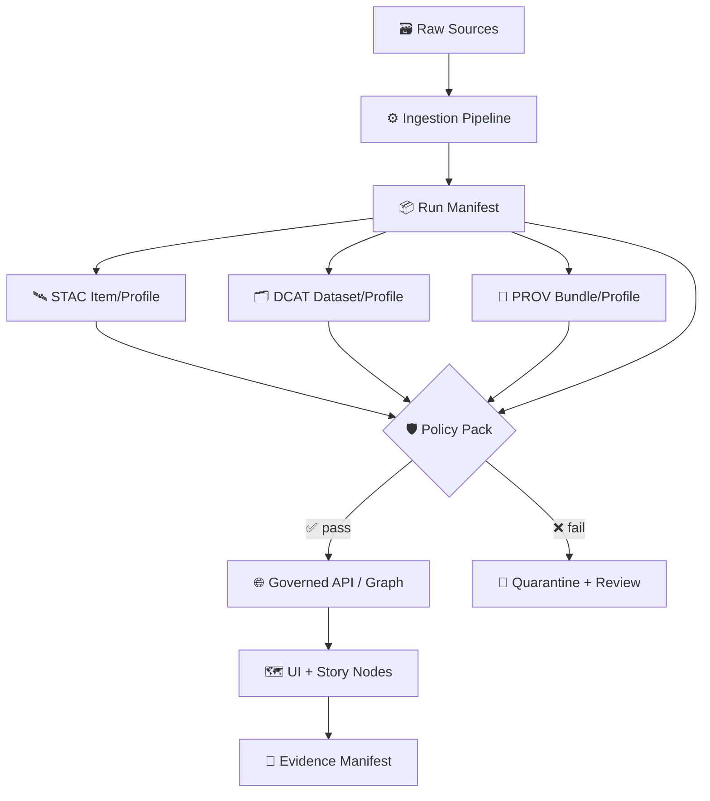

# 🧾 MCP Traceability · Policy Schemas


> [!IMPORTANT]
> This folder is the **schema registry** that makes KFM *auditable*, *reproducible*, and *trustworthy*.
> If an artifact can’t be validated, it can’t be promoted. ✅➡️🚫

---

## 🧠 MCP in this repo

**MCP = Master Coder Protocol** — a discipline for **reproducible**, **evidence-backed** engineering:
- contracts for artifacts 📜  
- traceable runs 🧬  
- policy gates 🛡️  
- documented decisions 🗂️  

This directory exists so MCP traceability can be enforced automatically (not “by vibes”). 😄

---

## 🎯 What this folder is for

This directory defines **schemas** (mostly JSON Schema, optionally SHACL/JSON-LD contexts) for:

- 📦 **Run Manifests** (what ran, with what inputs, producing what outputs)
- 🧾 **Evidence Manifests** (citations + transforms + digests attached to stories/AI outputs)
- 🛰️ **STAC / DCAT / PROV profiles** (KFM-shaped, stricter than baseline standards)
- 🛡️ **Policy Inputs / Decision Logs** (what policy pack was used and why it allowed/denied)
- 🧱 **Governance Labels** (license, sensitivity, CARE/FAIR flags, geo-obfuscation intent)
- 📦 **OCI Distribution References** (where artifacts are stored, plus optional attestations)
- 🩺 **Graph Health Reports** (drift, integrity checks, coverage)

> [!TIP]
> Think of schemas as **“contracts”** and Rego as **“rules.”**  
> Schemas validate *shape*. Policies validate *meaning*.

---

## 🧭 Where schemas sit in the KFM flow



---

## 🗂️ Folder layout

> Adjust the subfolders if your repo already has conventions — but keep the intent consistent.

```text
mcp/traceability/policies/
  schemas/
    README.md
    jsonschema/           # ✅ JSON Schema drafts + shared defs
      kfm.*.schema.json
      defs/
    shacl/                # 🧪 SHACL shapes (DCAT/PROV profiles)
      kfm-*.shacl.ttl
    contexts/             # 🧪 JSON-LD contexts (stable IRIs + compaction rules)
      kfm-*.context.json
    examples/             # ✅ “known-good” + “known-bad” test fixtures
      run_manifest/
      evidence_manifest/
      stac/
      dcat/
      prov/
```

---

## 🧩 Recommended schema set

> [!NOTE]
> These are the **expected contracts** for KFM’s traceability + policy gates.  
> If you don’t have these files yet, treat this table as the build plan. 🧱✨

| Status | Schema ID | Suggested file | What it validates |
|---:|---|---|---|
| 🧱 | `kfm.run_manifest.v1` | `jsonschema/kfm.run_manifest.v1.schema.json` | One pipeline run: inputs/outputs, tool versions, commit refs, digests |
| 🧱 | `kfm.evidence_manifest.v1` | `jsonschema/kfm.evidence_manifest.v1.schema.json` | Sources + citations + transforms + checksums for a story/AI output |
| 🧱 | `kfm.policy_decision.v1` | `jsonschema/kfm.policy_decision.v1.schema.json` | Allow/deny decision log + reasons + rule IDs + policy pack reference |
| 🧱 | `kfm.governance_label.v1` | `jsonschema/kfm.governance_label.v1.schema.json` | Sensitivity, license, CARE/FAIR, redaction/obfuscation intent |
| 🧱 | `kfm.distribution_oci.v1` | `jsonschema/kfm.distribution_oci.v1.schema.json` | OCI artifact refs, media types, digests, optional attestation refs |
| 🧱 | `kfm.telemetry_event.v1` | `jsonschema/kfm.telemetry_event.v1.schema.json` | NDJSON ledger events for ingest + promotion audit trail |
| 🧱 | `kfm.story_node_config.v1` | `jsonschema/kfm.story_node_config.v1.schema.json` | Story node JSON config contract (layers, camera, timeline, etc.) |
| 🧪 | `kfm.prov_profile.v1` | `shacl/kfm-prov.v1.shacl.ttl` | PROV constraints (required links between entities/activities/agents) |
| 🧪 | `kfm.dcat_profile.v1` | `shacl/kfm-dcat.v1.shacl.ttl` | DCAT constraints (license, distribution, access, provenance pointers) |
| 🧪 | `kfm.stac_profile.v1` | `jsonschema/kfm-stac-profile.v1.schema.json` | STAC constraints (bbox/time/source/digests + KFM required fields) |
| 🧪 | `kfm.graph_health_report.v1` | `jsonschema/kfm.graph_health_report.v1.schema.json` | Drift + integrity checks + coverage summaries |

Legend: ✅ implemented · 🧪 experimental · 🧱 planned

---

## 🧷 “Golden Fields” (required across most artifacts)

To make cross-linking reliable across **STAC/DCAT/PROV**, logs, and UI:

- `schema_id` + `schema_version` 🏷️
- `id` (stable document ID) 🆔
- `created_at` / `updated_at` ⏱️
- `run_id` (stable execution ID) 🧬
- `digests[]` or `{ algo, value }` (sha256 preferred) 🔐
- `source_refs[]` (URIs + access dates + licensing notes) 🔗
- `policy.pack_ref` (versioned policy pack / digest) 🛡️
- `provenance_refs` (STAC/DCAT/PROV pointers) 🧭

> [!TIP]
> If a user can’t answer “where did this come from?” in **two clicks**… we’re not done. 🖱️🖱️

---

## ✅ Validation (local + CI)

### 1) JSON Schema validation (examples)

**Node (Ajv):**
```bash
# Example: validate a run manifest
ajv validate \
  -s jsonschema/kfm.run_manifest.v1.schema.json \
  -d examples/run_manifest/good.json
```

**Python (jsonschema):**
```bash
python -m jsonschema \
  -i examples/run_manifest/good.json \
  jsonschema/kfm.run_manifest.v1.schema.json
```

### 2) Policy validation (Conftest + OPA/Rego)

```bash
# Validate semantics after shape validation passes
conftest test examples/run_manifest/good.json -p ../rego
```

### 3) SHACL validation (if using RDF for DCAT/PROV)

```bash
# Example (pyshacl)
pyshacl -s shacl/kfm-dcat.v1.shacl.ttl -d examples/dcat/good.ttl
```

---

## 🧾 Minimal examples (copy/paste starters)

### 📦 Run Manifest (minimal shape)

```json
{
  "schema_id": "kfm.run_manifest.v1",
  "schema_version": "1.0.0",
  "run_id": "01J00000000000000000000000",
  "created_at": "2026-01-23T00:00:00Z",
  "pipeline": {
    "name": "ingest.example_dataset",
    "version": "0.1.0",
    "git": { "commit": "abcdef1234567890", "repo": "origin" }
  },
  "inputs": [
    { "uri": "https://example.org/source.csv", "sha256": "…", "byte_length": 12345 }
  ],
  "outputs": [
    { "uri": "oci://registry/kfm/datasets:example@sha256:…", "sha256": "…", "byte_length": 67890 }
  ],
  "provenance_refs": {
    "stac": "stac://kfm/items/example",
    "dcat": "dcat://kfm/datasets/example",
    "prov": "prov://kfm/bundles/run/01J…"
  }
}
```

### 🧾 Evidence Manifest (minimal shape)

```json
{
  "schema_id": "kfm.evidence_manifest.v1",
  "schema_version": "1.0.0",
  "subject": { "type": "story_node", "id": "stories/railroads/node-03" },
  "sources": [
    {
      "type": "dataset",
      "id": "kfm.dataset.ks.railroads.1880",
      "uri": "oci://registry/kfm/datasets/railroads:1880@sha256:…",
      "sha256": "…"
    }
  ],
  "transforms": [
    { "tool": "gdalwarp", "version": "3.x", "params": { "t_srs": "EPSG:4326" } }
  ],
  "citations": [
    { "label": "Primary source title", "uri": "https://example.org/archive", "accessed_at": "2026-01-23" }
  ]
}
```

### 🛡️ Governance Label (sensitivity + ethics)

```json
{
  "schema_id": "kfm.governance_label.v1",
  "schema_version": "1.0.0",
  "license": "CC-BY-4.0",
  "sensitivity": "public",
  "care": {
    "collective_benefit": true,
    "authority_to_control": false,
    "responsibility": true,
    "ethics": true
  },
  "geo_obfuscation": { "enabled": false }
}
```

---

## 🧰 Schema design rules (please don’t skip 💀)

### ✅ Versioning
- Use **SemVer** for schema changes.
- Backward-compatible additions: bump **minor**.
- Breaking changes: bump **major** and keep the old schema around for migrations.

### ✅ Namespacing
- Prefer `kfm.*` IDs.
- Put reusable bits in `jsonschema/defs/` and `$ref` them.

### ✅ Extensibility
- Prefer explicit extension blocks:
  - `extensions: { "x-kfm-*": ... }`
- Avoid “mystery fields” unless clearly namespaced.

### ✅ Determinism
- If an artifact can be hashed, define how:
  - canonicalization rules
  - digest algorithm
  - byte-for-byte source refs

---

## ✅ Adding or changing a schema (Definition of Done)

- [ ] Add/modify schema file in `jsonschema/` (or `shacl/`)
- [ ] Add **at least one** “good” example fixture ✅
- [ ] Add **at least one** “bad” example fixture ❌
- [ ] Update the **Schema Index** table above
- [ ] Add/adjust a Rego rule if semantics changed
- [ ] Run validation locally (schema + policy)
- [ ] Document migration notes if it’s a breaking change

---

## 🧩 Relationship to the UI + Storytelling

Schemas here are what make the UI capable of:
- showing **source tooltips** / “map behind the map” 🗺️🔎
- attaching citations to narrative Story Nodes 📚
- tracing AI outputs back to datasets + transformations 🤖🧾

---

## 📚 Glossary (tiny but mighty)

- **Run Manifest**: structured record of a pipeline execution (inputs, transforms, outputs, digests).
- **Evidence Manifest**: structured citations + transform chain for a narrative/AI output.
- **Policy Pack**: versioned bundle of OPA/Rego rules (and supporting schemas) used to gate promotion.
- **Evidence Triplet**: the trio used for provenance: **STAC + DCAT + PROV**.
- **Fail-closed**: invalid/missing provenance means “deny by default”.

---

## 🔗 Related MCP folders (recommended)

- `mcp/sops/` → Standard Operating Procedures 🧑‍🍳📋  
- `mcp/traceability/trace_matrix.md` → features → artifacts → tests mapping 🧭  
- `mcp/traceability/policies/rego/` → OPA/Rego policies 🛡️  
- `mcp/traceability/policies/schemas/examples/` → fixtures for CI ✅  

---

🧠 If you’re building a new subsystem: **start by adding a schema + examples**, then write policies, then wire the UI.  
Contracts first. Always. 🔥
