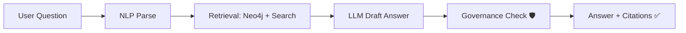

# 🧪 MCP Traceability Policy Tests (KFM) 🔎🛡️


> [!IMPORTANT]
> This folder is the **quality gate** for Kansas Frontier Matrix (KFM): we test the **policy-as-code** + **traceability** invariants that keep the platform *auditable, reproducible, and ethically governed*.

---

## 📌 Table of Contents
- [🎯 Purpose](#-purpose)
- [🧭 What we enforce](#-what-we-enforce)
- [🧪 Test tiers](#-test-tiers)
- [🗂️ Suggested layout](#️-suggested-layout)
- [▶️ Running the suite](#️-running-the-suite)
- [➕ Adding a policy or test](#-adding-a-policy-or-test)
- [🧾 Policy ID conventions](#-policy-id-conventions)
- [📊 Traceability coverage matrix](#-traceability-coverage-matrix)
- [📚 Reference library](#-reference-library)
- [🔎 Evidence anchors](#-evidence-anchors)

---

## 🎯 Purpose

KFM’s architecture is built around:
- **Provenance-first / evidence-first intake** (no “mystery layers”)
- **Contract-first metadata** (data contracts validated before acceptance)
- **Deterministic pipelines + immutability boundaries**
- **FAIR + CARE governance** (ethical & community-aware controls)
- **Explainable AI that always cites sources** (and fails safe)
- **Machine-enforceable rules via OPA/Rego + Conftest** in CI (and optionally runtime)

This folder exists so those promises don’t drift as the repo grows. ✅

---

## 🧭 What we enforce

### 1) 📦 Metadata is a contract (not “best effort”)
- Every dataset must satisfy required metadata (“data contract”) fields like **source, license, spatial/temporal extent, processing steps**, etc.
- Validators/policy gates should **block merges** when contracts are incomplete.

### 2) 🧬 Traceability is end-to-end
- **Everything that ships to UI / exports / AI answers** must trace back to cataloged sources.
- Canonical chain: **STAC (asset-level)** ↔ **DCAT (catalog-level)** ↔ **PROV (lineage)**.

### 3) 🔒 Fail-closed governance
If a check can’t be performed (or provenance is missing), we block by default. No silent “pass.” 🧯

### 4) 🤖 Focus Mode must be governed + cited
- AI answers must include citations.
- Governance checks run **before** returning an answer.

### 5) 🧑‍⚖️ FAIR + CARE + sensitivity rules are enforceable
- Sensitive or culturally restricted datasets require explicit flags and workflows.
- Differential access (obfuscation/role-based access) is treated as a **policy obligation**, not a UI feature.

### 6) 🔁 Reproducibility + DevOps provenance
- Pipeline runs and PRs should generate provenance records (including PR → PROV graph linkages).
- Where applicable, CI enforces invariants (e.g., “missing provenance node” is a hard fail).

### 7) 🧾 Supply chain integrity for artifacts
- If artifacts are distributed via OCI registries, they should be **content-addressed** and **signature-verified** (Cosign).

### 8) 🕸️ Graph integrity doesn’t get to “silently rot”
- Scheduled health checks catch drift (counts deltas, constraints/index status, orphan lineage, etc.).

---

## 🧪 Test tiers

> [!NOTE]
> We separate tests by **speed + cost** so CI stays fast, while deeper integrity checks still run regularly.

- **⚡ Tier 1 — Fast (PR-blocking):**  
  Conftest / JSON schema / policy gates / static traceability checks.
- **🔗 Tier 2 — Integration (PR or nightly):**  
  Spin up local Neo4j/PostGIS, load fixtures, run graph + query tests.
- **🌙 Tier 3 — Scheduled (nightly/weekly):**  
  Graph health checks, “deep” provenance audits, telemetry/sustainability checks, larger fixture replays.

---

## 🗂️ Suggested layout

```text
📦 mcp/
  └─ 🧭 traceability/
     └─ 🛡️ policies/
        ├─ 📜 rego/                 # Policy definitions (Rego)
        └─ 🧪 tests/                # ✅ you are here
           ├─ 🧷 fixtures/          # Positive/negative examples (json/geojson/yaml)
           ├─ 🧪 conftest/          # Conftest-focused tests
           ├─ 🐍 pytest/            # Python-based checks (optional)
           ├─ 🕸️ graph/             # Neo4j/PostGIS integration tests (optional)
           └─ 🧰 scripts/           # Helpers (lint, extract, validate)
```

> [!TIP]
> Policies may also live in other KFM locations (e.g., `api/scripts/policy/` or `tools/validation/policy/`). The key is: **tests live here, policy execution is wired into CI.**

---

## ▶️ Running the suite

### ✅ Quick local smoke test (recommended before PR)
```bash
# 1) Policy-as-code checks (Conftest)
conftest test mcp/traceability/policies/tests/fixtures --policy mcp/traceability/policies/rego

# 2) Optional Python tests (if present)
pytest -q mcp/traceability/policies/tests/pytest
```

### 🔗 Integration run (graph + DB)
```bash
# Example (adapt to your repo tooling):
docker compose up -d neo4j postgis

pytest -q mcp/traceability/policies/tests/graph
```

### 🧪 CI expectations
CI should:
- run Conftest policy gates on changed metadata/catalog/provenance files
- run schema validation
- run secrets scan + dependency scan
- (optionally) run a smaller integration dataset replay

---

## ➕ Adding a policy or test

### 1) Choose the policy family
Pick one of the ID namespaces below (e.g., `KFM-PROV`, `KFM-META`, `KFM-AI`, etc.). Keep scope tight.

### 2) Write/extend the Rego policy
- Add a rule in `mcp/traceability/policies/rego/*.rego` (or the repo’s canonical policy pack directory).
- Ensure it supports both:
  - **deny reasons** (human readable)
  - **machine readable IDs** (for tooling + dashboards)

### 3) Add fixtures
Create at least:
- ✅ **pass** fixture (valid)
- ❌ **fail** fixture (invalid) with the *minimum* change needed to trigger the rule

### 4) Add the test
- Conftest tests should assert:
  - expected denies
  - correct policy ID output (e.g., `KFM-PROV-001`)
- Python tests should assert:
  - cross-file invariants (e.g., “STAC item links to PROV record and DCAT entry”)

### 5) Update docs
If a policy changes contributor behavior, update:
- SOPs
- templates/checklists
- model cards/datasheets (if AI-related)

---

## 🧾 Policy ID conventions

These IDs should appear in:
- Conftest output
- CI logs
- Governance ledger entries (where applicable)

Suggested prefixes:
- `KFM-META-###` — metadata contract / required fields
- `KFM-STAC-###` — STAC structure and link integrity
- `KFM-DCAT-###` — DCAT catalog constraints
- `KFM-PROV-###` — provenance completeness + lineage integrity
- `KFM-AI-###` — Focus Mode governance, citations, refusal behavior
- `KFM-CARE-###` — sensitivity & ethical controls (CARE/sovereignty)
- `KFM-SUPPLY-###` — artifact signing & chain-of-custody checks
- `KFM-GRAPH-###` — Neo4j graph integrity checks
- `KFM-DEVPROV-###` — PR/CI → PROV dev lineage checks

---

## 📊 Traceability coverage matrix

| Guarantee ✅ | What it means | Where enforced | Example tests |
|---|---|---|---|
| Provenance-first publishing | nothing appears in UI/AI without provenance | CI + runtime checks | `KFM-PROV-*`, `KFM-AI-*` |
| Contract-first metadata | data contracts must validate | CI gates | `KFM-META-*` |
| STAC/DCAT/PROV linkage | catalogs cross-reference each other | CI | `KFM-STAC-*`, `KFM-DCAT-*`, `KFM-PROV-*` |
| Fail-closed | missing checks block merges | CI | “missing provenance triggers fail” |
| Sensitive data handling | tags + obfuscation + access rules | CI + API/runtime | `KFM-CARE-*` |
| DevOps → PROV lineage | PR/merge history becomes provenance | CI | `KFM-DEVPROV-*` |
| Signed artifacts | verify OCI digest + signature | CI + runtime | `KFM-SUPPLY-*` |
| Graph health | drift detection + integrity checks | scheduled | `KFM-GRAPH-*` |

---

## 📚 Reference library

### Core KFM design docs (directly shape these tests)
- 📚 **Data Intake – Technical & Design Guide** (policy pack, fail-closed, provenance-first)  
- 🧱 **Comprehensive Architecture, Features, and Design** (OPA/Conftest governance, STAC/DCAT/PROV backbone)  
- 🧭 **AI System Overview** (governed answers + citations + traceability)  
- 🖥️ **UI System Overview** (surface provenance; API boundaries; “map behind the map”)  
- 🧾 **Comprehensive Technical Documentation** (contract-first metadata; provenance used at runtime)  
- 💡 **Innovative Concepts** (cultural protocols; sensitivity-aware access controls)  
- 🧠 **Additional Project Ideas** (run manifests; deterministic ingest; OCI + Cosign; graph health checks)  
- 🌟 **Latest Ideas & Future Proposals** (PR → PROV lineage integration)

### Large “portfolio” PDFs (reference shelves 📚)
Some project files are distributed as **PDF portfolios**, which may require extraction to access embedded books/guides:
- `AI Concepts & more.pdf`
- `Maps-GoogleMaps-VirtualWorlds-Archaeological-Computer Graphics-Geospatial-webgl.pdf`
- `Data Managment-Theories-Architures-Data Science-Baysian Methods-Some Programming Ideas.pdf`
- `Various programming langurages & resources 1.pdf`

> [!TIP]
> If you want these to be **traceable + searchable** like the rest of KFM, treat them as artifacts:
> - extract embedded files
> - store hashes
> - record provenance for “knowledge base assets” the same way we do datasets

---

## 🔎 Evidence anchors

<details>
<summary>📎 Click to expand internal grounding (project-doc citations)</summary>

### Policy-as-code (OPA/Rego + Conftest)
- KFM policy pack built with **OPA + Conftest**, encoding rules like license required, citations required, sensitive-data flags, and CI enforcement. [oai_citation:0‡Kansas Frontier Matrix (KFM) – Comprehensive Architecture, Features, and Design.pdf](file-service://file-4Umt1yHoGKicdmLWzFJ9sC)

### Provenance-first / fail-closed / deterministic pipelines
- Data intake is **provenance-first**; raw is immutable; deterministic config-driven ETL; manual tweaks disallowed. [oai_citation:1‡📚 Kansas Frontier Matrix (KFM) Data Intake – Technical & Design Guide.pdf](file-service://file-EbUCdsJMbu5KwpoKMrLrgj)
- **Fail-closed** posture: missing provenance triggers rejection / CI failure; policy pack enforced via OPA/Rego/Conftest. [oai_citation:2‡📚 Kansas Frontier Matrix (KFM) Data Intake – Technical & Design Guide.pdf](file-service://file-EbUCdsJMbu5KwpoKMrLrgj)

### Contract-first metadata
- “Data contract” metadata JSON must be satisfied before acceptance; no unsourced “mystery layers.” [oai_citation:3‡Kansas Frontier Matrix (KFM) – Comprehensive Technical Documentation.pdf](file-service://file-AkqwUuYPp5zePf7pv5SMxi)

### STAC / DCAT / PROV backbone
- KFM catalog + lineage use open standards (STAC/DCAT/PROV) and store provenance alongside catalog artifacts. [oai_citation:4‡Kansas Frontier Matrix (KFM) – Comprehensive Architecture, Features, and Design.pdf](file-service://file-4Umt1yHoGKicdmLWzFJ9sC)

### Focus Mode governance + citations
- Focus Mode: pipeline includes **Governance Check → AnswerWithCitations**; delivers footnote-style citations. [oai_citation:5‡Kansas Frontier Matrix (KFM) – AI System Overview 🧭🤖.pdf](file-service://file-Pv8eev6RWvCKrGCXyzY7zg)
- AI always cites sources; refuses/indicates uncertainty rather than fabricate; supports explainability/audit panels. [oai_citation:6‡Kansas Frontier Matrix (KFM) – AI System Overview 🧭🤖.pdf](file-service://file-Pv8eev6RWvCKrGCXyzY7zg)

### UI provenance surfaces + API boundaries
- UI links every visualization to source data/metadata (“map behind the map”); decoupled via APIs; AI answers include citations. [oai_citation:7‡Kansas Frontier Matrix – Comprehensive UI System Overview.pdf](file-service://file-KcBQruYcoFVDEixzzRHTwt)

### FAIR+CARE + governance ledger
- Council workflow stages (Intake → Ethical Screening → FAIR compliance → … → Council approval) with governance ledger/audit trail. [oai_citation:8‡📚 Kansas Frontier Matrix (KFM) Data Intake – Technical & Design Guide.pdf](file-service://file-EbUCdsJMbu5KwpoKMrLrgj)
- Metadata includes FAIR+CARE fields and provenance records are used at runtime for credibility/debugging. [oai_citation:9‡Kansas Frontier Matrix (KFM) – Comprehensive Technical Documentation.pdf](file-service://file-AkqwUuYPp5zePf7pv5SMxi)

### Cultural protocols / sensitivity-aware access
- Cultural protocols + TK labels inspire fine-grained access controls; differential access model for sensitive geospatial content. [oai_citation:10‡Innovative Concepts to Evolve the Kansas Frontier Matrix (KFM).pdf](file-service://file-G71zNoWKxsoSW44iwZaaCC)
- Sensitivity-aware handling (obfuscation/role-based access) and policy engine with tags like Public/Sensitive/Restricted. [oai_citation:11‡Innovative Concepts to Evolve the Kansas Frontier Matrix (KFM).pdf](file-service://file-G71zNoWKxsoSW44iwZaaCC)

### DevOps → PROV lineage
- PR → PROV graph integration: PR as PROV Activity; commits as Entities; authors/reviewers as Agents; CI can enforce invariants. [oai_citation:12‡🌟 Kansas Frontier Matrix – Latest Ideas & Future Proposals.docx.pdf](file-service://file-SQ3f7ve8SGiusT6ThZEuCe)

### Run manifests / OCI artifacts / Cosign / policy gates
- Run manifest, deterministic pipelines, exactly-once ingest, OCI artifact distribution, Cosign signatures, and policy gates described as governance mechanisms. [oai_citation:13‡Additional Project Ideas.pdf](file-service://file-Pc2GNivcrHBeKjBQksLC3T)

### Graph health checks
- Weekly Graph Health Check: counts deltas, constraint/index integrity, orphan lineage checks, etc. [oai_citation:14‡Additional Project Ideas.pdf](file-service://file-Pc2GNivcrHBeKjBQksLC3T)

### PDF portfolios (reference shelves)
- Some project resources are shipped as **PDF portfolios** and may require Acrobat/extraction to access embedded items. [oai_citation:15‡AI Concepts & more.pdf](file-service://file-K6BctJjeUwvyCahLf9qdwr) [oai_citation:16‡Maps-GoogleMaps-VirtualWorlds-Archaeological-Computer Graphics-Geospatial-webgl.pdf](file-service://file-RshcX5sNY2wpiNjRfoP6z6) [oai_citation:17‡Data Managment-Theories-Architures-Data Science-Baysian Methods-Some Programming Ideas.pdf](file-service://file-RrXMFY7cP925exsQYermf2) [oai_citation:18‡Various programming langurages & resources 1.pdf](file-service://file-4wp3wSSZs7gk5qHWaJVudi)

</details>

---

✅ If you’re adding a new rule and you’re unsure where it belongs: **default to “block unsafe, allow safe”** and keep the policy small + testable.


