# 🧬 Traceability Schemas (MCP) — `mcp/traceability/schemas/`


> **Goal:** make every dataset, story, AI answer, and automated change *auditable* — “the map behind the map.” :contentReference[oaicite:0]{index=0}  
> KFM’s platform stance is **provenance-first / evidence-first**: outputs must remain traceable back to sources + processing steps, and policy gates prevent unvalidated metadata from shipping. :contentReference[oaicite:1]{index=1} :contentReference[oaicite:2]{index=2}

---

## 🧭 Why this folder exists

KFM treats **metadata as code**: each published artifact is accompanied by standardized catalog + provenance records (STAC/DCAT/PROV), validated in CI (JSON Schema and/or SHACL), and rejected if invalid. :contentReference[oaicite:3]{index=3}

This schema registry is the **MCP contract layer** that makes that possible, especially for:
- 🗂 **Catalogs**: STAC / DCAT / PROV (and KFM profile overlays) :contentReference[oaicite:4]{index=4}  
- 🧾 **Run traceability**: deterministic run manifests, hashes, idempotency keys, receipts :contentReference[oaicite:5]{index=5}  
- 🤖 **Automation trace**: Watcher → Planner → Executor event/plan/receipt chains (auditable, signed) :contentReference[oaicite:6]{index=6}  
- 📖 **Narratives**: Story Nodes + future “Pulse Threads” carry evidence manifests and provenance links :contentReference[oaicite:7]{index=7} :contentReference[oaicite:8]{index=8}  
- 📦 **Artifact distribution**: OCI/ORAS/Cosign patterns so big artifacts can be fetched by digest and verified :contentReference[oaicite:9]{index=9}

---

## 🧱 Contract model (how schemas fit the stack)

```mermaid
flowchart LR
  A[📥 Ingest / Pipelines] --> B[🧾 Run Manifest + Receipts]
  A --> C[🗂️ STAC / DCAT]
  A --> D[⛓️ PROV - Entity / Activity / Agent]
  C --> E[🕸️ Knowledge Graph]
  D --> E
  E --> F[🧩 API - OpenAPI / GraphQL]
  F --> G[🗺️ UI - map behind the map - provenance panels + citations]
```



- Catalogs are the “evidence triplet” required before publishing (DCAT + STAC + PROV). :contentReference[oaicite:10]{index=10}  
- Graph ingestion forbids “mystery nodes”: nothing in Neo4j without catalog/provenance references. :contentReference[oaicite:11]{index=11}  
- The UI surfaces provenance continuously (layer attributions, citations, export credits). :contentReference[oaicite:12]{index=12} :contentReference[oaicite:13]{index=13}

---

## 🗂 What lives here (schema families)

### 1) 📚 Catalog schemas: STAC / DCAT / PROV (with KFM profiles)
KFM anchors metadata on these standards and **links them together** (STAC links to PROV, DCAT points to STAC and PROV, etc.). :contentReference[oaicite:14]{index=14} :contentReference[oaicite:15]{index=15}

- **STAC** answers: *what asset is this, where/when, and where are the files?* :contentReference[oaicite:16]{index=16}  
- **DCAT** answers: *how do we discover/cite this dataset as a catalog entry?* :contentReference[oaicite:17]{index=17}  
- **PROV** answers: *how was it produced (inputs, steps, agents)?* :contentReference[oaicite:18]{index=18}  

KFM also version-controls profile overlays (e.g., **KFM-STAC / KFM-DCAT / KFM-PROV** versions) to keep the ecosystem stable as it evolves. :contentReference[oaicite:19]{index=19} :contentReference[oaicite:20]{index=20}

### 2) 🧾 Run traceability schemas (audit trails)
Pipelines (batch + streaming) generate run-level evidence:
- **Run Manifest** capturing run_id, run_time, idempotency_key, canonical_digest, tool versions, source URLs, summaries. :contentReference[oaicite:21]{index=21}  
- Hashing uses **RFC 8785 JSON Canonicalization Scheme** to make digests stable. :contentReference[oaicite:22]{index=22}  
- Streaming pipelines still record provenance (each fetch can be an Activity linked to Agent and Observation Entity). :contentReference[oaicite:23]{index=23}  

### 3) 🤖 Automation trace schemas (Watcher → Planner → Executor)
The W–P–E automation chain is explicitly designed to be immutable, auditable, and tied to triggering events; planner outputs are reviewed and executor actions are logged (with proof like test results/provenance). :contentReference[oaicite:24]{index=24}  
FAIR/CARE governance constraints are enforced at planning and execution time (plans that violate policy must not proceed). :contentReference[oaicite:25]{index=25} :contentReference[oaicite:26]{index=26}

### 4) 📖 Narrative schemas (Story Nodes + Pulse Threads)
- Story Nodes are file-based content (Markdown + JSON config), reviewed/validated so referenced layer IDs match catalog IDs and claims are cited. :contentReference[oaicite:27]{index=27} :contentReference[oaicite:28]{index=28}  
- “Pulse Threads” (new content type) attach provenance metadata and an **evidence manifest** (dataset IDs, query params, timestamps) so even fast updates remain evidence-first. :contentReference[oaicite:29]{index=29}

### 5) 📦 Artifact distribution + integrity schemas (OCI / ORAS / Cosign)
For large artifacts (PMTiles, GeoParquet, COGs), KFM explores OCI registries with ORAS and Cosign signatures:
- Artifacts are **content-addressed** (digest) so catalogs can reference exact bits; signatures attest origin and integrity. :contentReference[oaicite:30]{index=30} :contentReference[oaicite:31]{index=31}  
- Catalog metadata can include an OCI distribution entry listing registry/repo/tag/digest and media types. :contentReference[oaicite:32]{index=32}  
- This supports FAIR (interoperable/reusable) and CARE controls (restricted registries for sensitive artifacts). :contentReference[oaicite:33]{index=33}

### 6) 🔐 Sensitivity, privacy, and “no leakage” contracts
- UI must not bypass redaction rules; the broader contract system expects audit logs and governance alignment across subsystems. :contentReference[oaicite:34]{index=34}  
- Data mining practice emphasizes **query auditing** to deny requests that could disclose confidential data; this parallels KFM’s policy-gate mindset for sensitive outputs. :contentReference[oaicite:35]{index=35}  

---

## 🗺️ Suggested folder layout (schema registry pattern)

> This is the **recommended** structure inside `mcp/traceability/schemas/` (adjust names to match your repo conventions).

```text
mcp/traceability/schemas/
├── ✅📄 README.md                     # ✅ (this file) 📌 How schemas are versioned, referenced, and validated in CI
├── 🧾🗂️ registry.yml                  # Schema registry: id → version → file path → owner → status (active/deprecated)
├── 🧱 core/                           # Shared primitives used everywhere (compose into higher-level contracts)
│   ├── 🆔📐🧾 ids.schema.json          # ID conventions: dataset_id, run_id, graph ids, slug rules, UUID patterns
│   ├── ⏱️📐🧾 time.schema.json         # Time primitives: timestamps, intervals, ranges, precision + timezone policy
│   ├── 🗺️📐🧾 geojson.schema.json      # Geo primitives: GeoJSON geometry/feature patterns + bbox constraints
│   ├── ⚖️📐🧾 license.schema.json      # License policy: allowed strings/identifiers + validation rules
│   └── 🔒📐🧾 classification.schema.json # Classification labels (public/internal/restricted) + propagation rules
├── 🗂️ catalogs/                       # Discovery + lineage schemas for published metadata layers
│   ├── 🛰️ stac/                        # STAC + KFM-STAC profile overlays (Collections/Items/Assets constraints)
│   ├── 🗂️ dcat/                        # DCAT + KFM-DCAT profile overlays (datasets/distributions + contact/license)
│   └── 🧬 prov/                        # PROV-O + KFM-PROV profile overlays (entities/activities/agents + links)
├── 🧪 runs/                            # Operational schemas for pipeline execution + agent workflow traceability
│   ├── 🧾📐 run-manifest.schema.json    # Pipeline ledger: who/what/when + inputs/outputs + params + checksums
│   ├── 🚨📐 watcher-event.schema.json   # Immutable watcher event/alert record (trigger, context, severity, pointers)
│   ├── 🧭📐 planner-plan.schema.json    # Structured planning output (reviewable steps, constraints, expected proofs)
│   └── 🧾📐 executor-receipt.schema.json # Execution receipt: what ran + artifacts produced + proofs/links/hashes
├── 📚 narratives/                      # Governed narrative objects that must carry evidence + provenance
│   ├── 🎬📐 story-node.schema.json      # Story Node config contract (steps, actions, layers, citations pointers)
│   └── 🧵📐 pulse-thread.schema.json    # Short-form “pulse” narrative + evidence bundle (updates, findings, deltas)
└── 📦 artifacts/                       # Distribution/attestation schemas for supply-chain + publication proofs
    ├── 📦📐 oci-distribution.schema.json # OCI distribution payload contract (what was shipped + where)
    └── 🔏📐 attestation.schema.json     # Signatures/provenance attestations (SLSA-ish claims, digests, signers)
```

---

## ✅ Validation rules (what CI should enforce)

### “Do not break” invariants 🧷
- **Catalog outputs must be machine-validated** (schemas + profiles), or the dataset is rejected. :contentReference[oaicite:36]{index=36}  
- CI should block merges if validation fails (this is part of maintainer workflow). :contentReference[oaicite:37]{index=37}  
- Provenance-first publishing applies even to streaming/live data (at least stub provenance before UI use). :contentReference[oaicite:38]{index=38}  

### Suggested CI checks 🧪
- 🧩 JSON Schema validation (STAC/DCAT/PROV + run manifests + narrative configs) :contentReference[oaicite:39]{index=39}  
- 🪢 SHACL validation for RDF/JSON-LD shapes where applicable (DCAT/PROV) :contentReference[oaicite:40]{index=40}  
- 🏷 License + classification required and policy-gated (FAIR/CARE + security) :contentReference[oaicite:41]{index=41}  
- 🔏 Optional: digest/signature verification for OCI-stored artifacts before they’re referenced in catalogs :contentReference[oaicite:42]{index=42}  

---

## 🔁 Versioning & compatibility

- KFM profile overlays are explicitly versioned (e.g., KFM-STAC / KFM-DCAT / KFM-PROV), and schema changes should follow semantic versioning rules. :contentReference[oaicite:43]{index=43} :contentReference[oaicite:44]{index=44}  
- Breaking changes require coordination across Graph/API/UI contracts; “breaking a contract triggers governance review or version increment.” :contentReference[oaicite:45]{index=45}  

---

## 🧾 Minimal traceability contract (MVP)

For anything that becomes “official” in KFM (dataset, layer, story, pulse, model output), we want:

1. **A canonical ID** (dataset_id / story_id / run_id)  
2. **A catalog record** (STAC + DCAT) that points to artifacts (files, tiles, distributions) :contentReference[oaicite:46]{index=46}  
3. **A provenance record** (PROV) linking *inputs → activity/run → outputs* (Entity/Activity/Agent) :contentReference[oaicite:47]{index=47}  
4. **A run manifest** to make replays/audits practical (hashes, tool versions, sources) :contentReference[oaicite:48]{index=48}  
5. **UI-facing provenance** (layer provenance panel, citations in answers/exports) :contentReference[oaicite:49]{index=49}  

---

## 🧩 Example payloads (illustrative)

### 🧾 Run Manifest (illustrative)
```json
{
  "run_id": "run_2026-01-21T12:34:56Z__kfm.ks.surficial_geology.v1",
  "run_time": "2026-01-21T12:34:56Z",
  "idempotency_key": "sha256:…",
  "canonical_digest": "sha256:…",
  "source_urls": ["https://example.gov/dataset.zip"],
  "tool_versions": {"gdal": "3.x", "python": "3.x"},
  "outputs": {
    "stac_collection_id": "kfm.ks.surficial_geology",
    "dcat_dataset_id": "kfm.ks.surficial_geology",
    "prov_bundle_id": "prov:kfm:run:…"
  },
  "summary_counts": {"records_in": 12345, "records_out": 12345, "errors": 0}
}
```
Fields like `run_id`, `idempotency_key`, and `canonical_digest` are directly motivated by the run-manifest + canonicalization approach described in Pulse Ideas. :contentReference[oaicite:50]{index=50}

### 🛰️ Packaged artifacts (GeoParquet + PMTiles) should still be cataloged
The “dual-format packaging” approach (GeoParquet for analytics + PMTiles for visualization) is paired with STAC/DCAT records, and traceability can be enforced via hashes/digests. :contentReference[oaicite:51]{index=51}

---

## 🛠️ Adding or changing schemas (PR checklist)

- [ ] 🧾 Update schema file(s) + bump schema/profile version if needed :contentReference[oaicite:52]{index=52}  
- [ ] 🧪 Add/refresh example fixtures (valid + invalid)  
- [ ] 🔁 Ensure validators run in CI and fail loudly on contract breaks :contentReference[oaicite:53]{index=53}  
- [ ] 🔐 Confirm FAIR/CARE + classification rules are satisfied (Planner/Executor policy gates) :contentReference[oaicite:54]{index=54}  
- [ ] 🗺️ Confirm UI implications (provenance panel, attributions, export credits) :contentReference[oaicite:55]{index=55}  

---

## 🧾 Notes on documentation & MCP style

MCP expects reproducibility artifacts (templates, reports, provenance logs) to be consistent and evidence-first. :contentReference[oaicite:56]{index=56}  
Markdown is explicitly treated as a first-class medium for provenance logs/runbooks with citations, plus license + sensitivity metadata practices. :contentReference[oaicite:57]{index=57}

---

## 📎 Project sources used (traceability)

Core KFM docs that motivate these schema contracts:
- Evidence-first intake + schema validation + standard linking (STAC/DCAT/PROV) :contentReference[oaicite:58]{index=58} :contentReference[oaicite:59]{index=59}  
- W–P–E automation, immutable events, and auditable actions :contentReference[oaicite:60]{index=60}  
- UI transparency (“map behind the map”), provenance surfacing, citations :contentReference[oaicite:61]{index=61} :contentReference[oaicite:62]{index=62}  
- Pulse Threads + evidence manifests (future narrative schema) :contentReference[oaicite:63]{index=63}  
- Run manifests + JSON canonicalization/hashing (future run schema) :contentReference[oaicite:64]{index=64}  
- OCI/ORAS/Cosign artifact provenance patterns (future distribution schema) :contentReference[oaicite:65]{index=65} :contentReference[oaicite:66]{index=66}  
- Geospatial open formats (GeoJSON/COG/GeoParquet/PMTiles) motivating schema constraints :contentReference[oaicite:67]{index=67} :contentReference[oaicite:68]{index=68}  

Also referenced “idea/roadmap” docs and concept packs:
- Innovative Concepts to Evolve KFM (future 4D/AR + provenance & credit governance) :contentReference[oaicite:69]{index=69} :contentReference[oaicite:70]{index=70}  
- Latest Ideas & Future Proposals (packaging, roles, provenance logs) :contentReference[oaicite:71]{index=71} :contentReference[oaicite:72]{index=72}  

📦 **Note on PDF portfolios** (inputs still to be extracted/indexed into schemas as needed):  
- `AI Concepts & more.pdf` (portfolio) :contentReference[oaicite:73]{index=73}  
- `Various programming langurages & resources 1.pdf` (portfolio) :contentReference[oaicite:74]{index=74}  
- `Maps-GoogleMaps-VirtualWorlds-Archaeological-Computer Graphics-Geospatial-webgl.pdf` (portfolio) :contentReference[oaicite:75]{index=75}  
- `Data Managment-Theories-Architures-Data Science-Baysian Methods-Some Programming Ideas.pdf` (portfolio) :contentReference[oaicite:76]{index=76}  

---
🧠 **TL;DR:** This directory is the **schema spine** of KFM’s trust model — validate everything, preserve provenance everywhere, and never let info lose its chain-of-custody. :contentReference[oaicite:77]{index=77}

