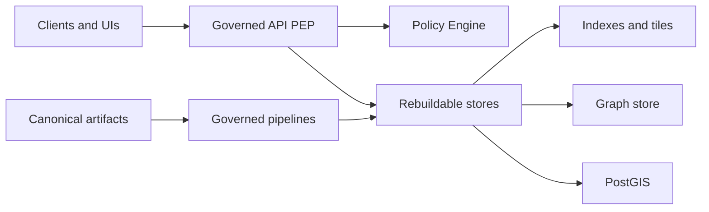
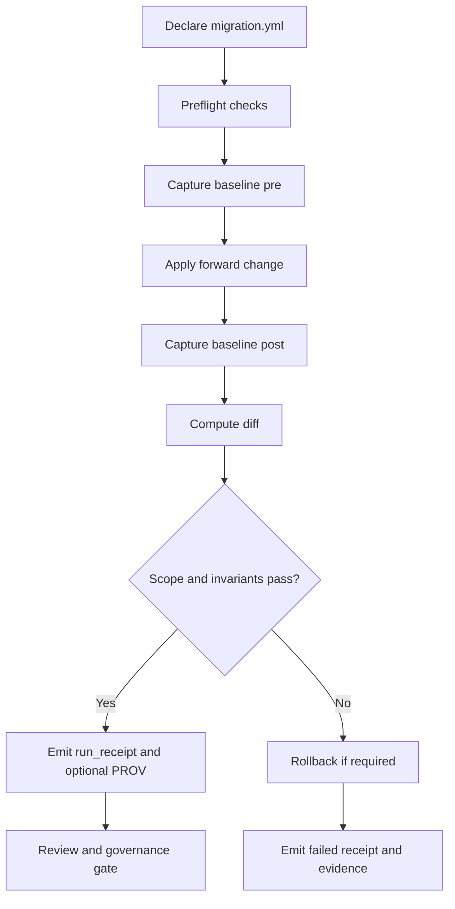

<!-- [KFM_META_BLOCK_V2]
doc_id: kfm://doc/46a7276e-762c-48b6-9731-f13d3f0db4fb
title: migrations/README — Governed migrations (schema, projections, graph)
type: standard
version: v2
status: draft
owners: TBD (set via CODEOWNERS)
created: 2026-02-22
updated: 2026-03-01
policy_label: public
related:
  - ../README.md
  - ../docs/
  - ../contracts/
  - ../configs/
  - ../data/
tags:
  - kfm
  - migrations
  - governance
  - rollback
  - receipts
  - prov
notes:
  - Defines how migrations are declared, reviewed, executed, validated, and rolled back.
  - Aligns migrations to KFM invariants: trust membrane, fail-closed promotion posture, canonical vs rebuildable, deterministic receipts.
  - If uncertain: fail closed, emit receipts, and require governance review.
[/KFM_META_BLOCK_V2] -->

<a id="top"></a>

# migrations/
Governed, reversible changes to **rebuildable stores** (schemas, constraints, indexes, projections, graph shape) with **scope control**, **baselines**, **diffs**, **run receipts**, and **rollback artifacts**.


**Owners:** TBD (enforced by `CODEOWNERS`, if configured)  
**Status:** Draft (this doc is a contract—tighten as the repo hardens)  
**Principles:** map-first • time-aware • governed • evidence-first • cite-or-abstain

> [!IMPORTANT]
> This directory exists to make “high-impact mutations” **reviewable, auditable, and reversible**.
> If any required contract artifact is missing or invalid → **fail closed**.

> [!NOTE]
> This README is **normative about guarantees** (scope limits, baselines+diffs, receipts, rollback).
> Path layouts and tooling names are **illustrative** unless verified in the live repo—adapt them without weakening guarantees.

---

## Quick navigation
- [Directory contract](#directory-contract)
- [Where migrations fit in KFM](#where-migrations-fit-in-kfm)
- [When to use a migration](#when-to-use-a-migration)
- [Non-negotiables](#non-negotiables)
- [Directory layout](#directory-layout)
- [Migration declaration contract](#migration-declaration-contract)
- [Baselines, diffs, and blast radius](#baselines-diffs-and-blast-radius)
- [Invariant checks](#invariant-checks)
- [CI and automation gates](#ci-and-automation-gates)
- [Rollback artifacts](#rollback-artifacts)
- [Run receipts and PROV](#run-receipts-and-prov)
- [Migration types](#migration-types)
  - [PostGIS migrations](#postgis-migrations)
  - [Search/index migrations](#searchindex-migrations)
  - [Graph migrations](#graph-migrations)
- [How to add a migration](#how-to-add-a-migration)
- [Definition of Done](#definition-of-done)
- [PR checklist](#pr-checklist)
- [Troubleshooting](#troubleshooting)
- [Glossary](#glossary)
- [Appendix](#appendix)

---

## Directory contract

### Purpose
`migrations/` defines how we perform **governed mutations** to rebuildable stores—especially when:
- sequencing matters,
- rollback must be possible,
- blast radius must be bounded,
- policy or invariants must be enforced.

A migration is any controlled change that intentionally mutates:
- schemas/constraints/indexes in a relational store (e.g., PostGIS)
- search/index structures (mappings, analyzers, vector schema, reindex flows)
- graph shape (labels, relationships, constraints, ontology) **when a graph is used**
- backfills that are not simply “re-run the deterministic pipeline”

### Where this fits in the repo
- This directory **does not** define canonical truth. Canonical truth is produced through governed pipelines and promotion gates.
- This directory defines controlled mutations to **projections** and **runtime-facing rebuildable stores**.

### What belongs here
✅ Machine-declared migrations with:
- **declared scope**
- **pre/post baselines**
- **diff outputs**
- **validation + invariant checks**
- **rollback artifacts** (or explicit, approved irreversibility)
- **run receipts** and optional **PROV** bundles

✅ Deterministic helpers that support migration safety (render/plan/diff/check), if repo-standard.

### What must not go here
❌ Secrets, credentials, tokens, kubeconfigs  
❌ Raw or sensitive dataset payloads  
❌ One-off “operator scripts” without declarations, receipts, and rollback  
❌ Mutations to **canonical truth** zones (RAW/WORK/PROCESSED/CATALOG) — those must be done by governed pipelines and promotion gates

> [!IMPORTANT]
> In KFM, PostGIS/search/graph/tiles are **rebuildable projections**.
> Migrations must preserve the ability to reconstruct from canonical artifacts.

[Back to top](#top)

---

## Where migrations fit in KFM

Migrations exist inside the “trust membrane” posture: clients never talk directly to storage/indexes; access goes through governed APIs and policy enforcement.



**Practical implications**
- Migrations are allowed to mutate **rebuildable stores** only.
- Migrations MUST NOT:
  - bypass policy boundaries,
  - mutate protected governance domains without explicit approval,
  - break deterministic rebuildability from canonical artifacts.

[Back to top](#top)

---

## When to use a migration

Prefer pipelines over migrations when possible.

Use a migration when:
- the change must mutate a rebuildable store in-place (schema/index/constraint)
- the change requires controlled sequencing and rollback
- the change has non-trivial blast radius that must be declared and reviewed
- the change is needed to restore invariant correctness

Do **not** use a migration when:
- you can re-derive the projection by replaying canonical artifacts (recommended)
- you can roll out a new versioned projection side-by-side and flip consumers safely

> [!RULE]
> If you can re-run deterministically from immutable inputs, **do that**.
> Migrations are for what cannot be safely re-derived without an explicit change plan.

[Back to top](#top)

---

## Non-negotiables

1. **Fail closed.** If validation, policy, invariant checks, or receipts fail → do not proceed; rollback if needed.
2. **Contract-first.** Declarations, baselines, diffs, and receipts MUST validate against versioned schemas.
3. **Scope is declared upfront.** Every migration declares what it is allowed to touch and what is forbidden.
4. **Baseline + diff required.** Capture pre/post state and compute deltas; reviewers must see blast radius.
5. **Rollback artifacts required.** Reversible by default. Irreversible changes require explicit governance approval.
6. **Receipts always.** Every execution emits a run receipt (and optionally PROV) for attribution and auditability.
7. **Protected domains are hard stop.** Governance-protected schemas/namespaces/labels must not change without explicit approval.
8. **Policy-safe outputs.** Diffs/receipts/logs must not leak secrets, PII, or restricted location details.
9. **Deterministic identity.** Artifacts MUST be content-addressed (digests) so receipts can be independently verified.

[Back to top](#top)

---

## Directory layout

> [!NOTE]
> This is a **recommended contract layout** aligned to the repo-wide “registry + schemas + fixtures” pattern.
> If your repo differs, update this section to match reality **while preserving the guarantees**.
>
> Some repos keep store-specific migrations close to the store module (e.g., `graph/migrations/<id>/...`).
> If so, this directory can remain the **registry + schemas + fixtures** home, and registry entries should
> point to the store-local bundle path.

```text
migrations/                                                   # Governed migrations (schema, projections, graph) + receipts
├─ README.md                                                  # This file (rules, ordering, rollback posture, CI gates)
│
├─ registry/                                                  # Machine-readable registries + schemas + fixtures (small, CI-friendly)
│  ├─ migrations.v1.json                                      # Canonical migration registry (ids, types, owners, status)
│  ├─ schemas/                                                # Schemas that validate declarations + artifacts
│  │  ├─ migration_declaration.v1.schema.json                 # Schema for migration.yml (scope, owners, risk, rollback)
│  │  ├─ run_receipt.v1.schema.json                           # Schema for receipts/run_receipt.json (execution receipt)
│  │  ├─ baseline.v1.schema.json                              # Schema for baselines/*.json (before/after snapshots)
│  │  ├─ diff_summary.v1.schema.json                          # Schema for diffs/summary.json (declared-vs-observed deltas)
│  │  └─ receipt_ref.v1.schema.json                           # Pointer record if receipts stored outside git (prod preference)
│  └─ fixtures/                                               # Fixture declarations for CI (valid/invalid; deterministic)
│     ├─ valid/                                               # Valid declaration examples (should pass)
│     └─ invalid/                                             # Invalid declaration examples (must fail CI)
│
├─ postgis/                                                   # Relational schema migrations (optional; if PostGIS is used)
│  ├─ README.md                                               # Tooling + ordering rules + rollback posture
│  ├─ PG-MIG-YYYY-MM-DD-01/                                   # Single migration bundle (ID is canonical)
│  │  ├─ migration.yml                                        # Declaration (scope, owners, limits, approvals)
│  │  ├─ forward.sql                                          # Forward change (idempotent preferred)
│  │  ├─ rollback.sql                                         # Rollback plan (required if requires_rollback=true)
│  │  ├─ baselines/                                           # Baseline snapshots (before/after)
│  │  │  ├─ pre.json                                          # Baseline BEFORE
│  │  │  └─ post.json                                         # Baseline AFTER
│  │  ├─ diffs/                                               # Observed changes vs declared scope
│  │  │  ├─ summary.json                                      # Declared-vs-observed delta summary
│  │  │  └─ touched.csv                                       # Optional reviewer-friendly list of touched objects
│  │  ├─ receipts/                                            # Execution receipts (audit/prov; may be pointers in prod)
│  │  │  ├─ run_receipt.json                                  # Execution receipt (who/what/when + validation)
│  │  │  ├─ prov.jsonld                                       # Optional PROV bundle for migration run
│  │  │  └─ receipt_ref.json                                  # Optional pointer record (preferred for prod)
│  │  └─ notes.md                                             # Human context (risks, rollout/rollback notes, review guidance)
│  └─ ...                                                     # More PostGIS migration bundles
│
├─ search/                                                    # Search/index migrations (optional; if search is used)
│  ├─ README.md                                               # Tooling + ordering rules + rollback posture
│  ├─ SEARCH-MIG-YYYY-MM-DD-01/                               # Single migration bundle (ID is canonical)
│  │  ├─ migration.yml                                        # Declaration (scope, owners, risk, approvals)
│  │  ├─ forward.json                                         # Mapping/settings update OR reindex plan
│  │  ├─ rollback.json                                        # Rollback/restore plan OR “not possible” + approval
│  │  ├─ baselines/                                           # Baseline snapshots (before/after)
│  │  ├─ diffs/                                               # Observed vs declared deltas
│  │  ├─ receipts/                                            # Execution receipts (or pointers)
│  │  └─ notes.md                                             # Human context + risks + review notes
│  └─ ...                                                     # More search migration bundles
│
└─ graph/                                                     # Graph migrations (optional; if graph DB is used)
   ├─ README.md                                               # Tooling + ordering rules + rollback posture
   ├─ GRAPH-MIG-YYYY-MM-DD-01/                                # Single migration bundle (ID is canonical)
   │  ├─ migration.yml                                        # Declaration (scope, owners, risk, approvals)
   │  ├─ forward.cypher                                       # Forward change (idempotent preferred)
   │  ├─ rollback.cypher                                      # Rollback plan (or “not possible” + approval)
   │  ├─ baselines/                                           # Baseline snapshots (before/after)
   │  ├─ diffs/                                               # Observed vs declared deltas (include temporal diffs where relevant)
   │  ├─ receipts/                                            # Execution receipts (or pointers)
   │  └─ notes.md                                             # Human context + risks + review notes
   └─ ...                                                     # More graph migration bundles
```

> [!TIP]
> Keep git-committed artifacts small and policy-safe. For production runs, prefer storing receipts and baseline blobs in an immutable artifact store and committing only `receipt_ref.json` pointers.

[Back to top](#top)

---

## Migration declaration contract

Each migration directory **must** include a machine-readable `migration.yml`.

### Normative language
- **MUST** = required to merge/run
- **SHOULD** = strongly recommended; requires justification if not followed
- **MAY** = optional

### Minimum fields (v1; extend as needed)
- `migration_id` (stable, unique, never reused)
- `type` (`postgis` | `search` | `graph` | `other`)
- `intent` (plain-language)
- `scope` (allowed + forbidden)
- `limits` (blast-radius caps)
- `requires_rollback` (boolean)
- `approvals` (routing rules or labels)
- `runner` (how it is executed; command or tool reference)
- `artifacts` (forward/rollback script names, baseline/diff expectations)

> [!TIP]
> If your repo uses a single, global run-receipt format, set the receipt’s `run_type` to `migration`
> and include `migration_id` as a first-class field (do not bury it in free-text).

### Example `migration.yml`

```yaml
migration_id: PG-MIG-2026-02-28-01
type: postgis
intent: "Add spatial index to parcels table to improve map query performance"

scope:
  allowed_schemas:
    - public
  allowed_tables:
    - parcels
  forbidden_schemas:
    - governance
    - audit
  forbidden_tables:
    - authority_sites

limits:
  max_table_count_touched: 1
  max_index_count_delta: 2
  max_row_backfill: 0

requires_rollback: true

approvals:
  required_reviewers:
    - kfm-platform
    - kfm-governance
  change_class: governance-critical

runner:
  tool: "psql"                   # or alembic/flyway/etc.
  command: "scripts/migrate.sh"  # repo-standard wrapper, if present
  environment:
    - KFM_DB_DSN_REF             # secret reference name; not the secret value

artifacts:
  forward:
    - forward.sql
  rollback:
    - rollback.sql
  baselines:
    pre: baselines/pre.json
    post: baselines/post.json
  diffs:
    summary: diffs/summary.json
```

> [!IMPORTANT]
> “Scope” is not documentation — it is a **limit** enforced by CI and/or the migration runner.
> If scope can’t be enforced, treat it as incomplete and fail closed.

[Back to top](#top)

---

## Baselines, diffs, and blast radius

Every migration must capture **pre** and **post** baselines and produce a diff.

Baseline goals:
- detect unintended mutations even when “it seems fine”
- provide reviewers a predictable blast-radius summary
- make rollback verification possible
- enable receipts to be independently verified via digests

### Minimum baseline fields (recommended)
- object counts (tables/indexes/constraints OR nodes/rels)
- schema fingerprint (constraints/index definitions digest)
- “protected domain” fingerprint (hash of protected objects)
- policy-safe performance-relevant stats where safe (optional)

> [!TIP]
> For graph migrations, consider including additional structural fingerprints such as degree distributions
> and hashes over protected node sets to catch unintended rewrites.

### Diff outputs (required)
- `diffs/summary.json` (machine-readable, CI-enforced)
- `diffs/touched.csv` (optional reviewer-friendly list)
- (graph) optional `diffs/temporal.json` (recommended) — before/after structural deltas that help reviewers reason about blast radius

> [!RULE]
> If observed diffs exceed declared limits → **fail** and require rollback or explicit approved exception.

[Back to top](#top)

---

## Invariant checks

Migrations must not violate KFM invariants. CI (and preflight locally) should enforce:

### Global invariants
- no secret leakage in artifacts/receipts
- no policy bypass (trust membrane intact)
- no mutation of protected domains without explicit approval
- artifacts are deterministic and content-addressable (digests match)

### Store-specific invariants (examples)
**PostGIS**
- required constraints exist
- spatial indexes present where required
- migrations are ordered and idempotent (where possible)
- backfills are bounded and observable (rows affected must be within declared limits)

**Search**
- mapping changes are versioned
- reindex plan is explicit (source index, destination index, alias plan)
- alias flips are audited
- rollback strategy exists (old index retained) unless explicitly approved

**Graph**
- no orphaned provenance nodes
- ontology constraints preserved (exclusive labels, required relationships)
- protected/authority nodes unchanged unless explicitly approved
- blast radius is enforced against declared label/relationship limits (and temporal diffs are reviewed)

> [!TIP]
> Treat invariant checks as contract tests: deterministic, CI-enforced, and fail-closed.

[Back to top](#top)

---

## CI and automation gates

Migrations are high-impact changes. CI should block merges when any required artifact is missing or any contract check fails.

### Minimum CI gates (must be blocking)
1. **Declaration schema validation**
   - Validate `migration.yml` against `migration_declaration.*.schema.json`.
2. **Secrets and policy-safe artifact scan**
   - Fail on secrets, credentials, raw DSNs, or restricted coordinates in any committed artifact.
3. **Scope + limits enforcement**
   - Compare `diffs/summary.json` (observed) to `migration.yml` (declared) and fail on mismatch.
4. **Invariant checks**
   - Run store-specific checks (constraints/indexes/ontology rules).
5. **Rollback posture**
   - If `requires_rollback: true`, fail if rollback script is missing.
   - If irreversible, require explicit approval reference and documented safety strategy.
6. **Receipt schema validation (when receipts are present)**
   - Validate `receipts/run_receipt.json` (or `receipt_ref.json`) against schema.

### Recommended CI additions (strongly preferred)
- **Dry-run plan** (`plan.json` or equivalent) produced by the runner and reviewed in PR
- **Fixture tests** that demonstrate allow/deny behavior for scope and policy checks
- **Deterministic runner pinning** (e.g., container digest) so “same inputs → same outputs” is auditable

> [!RULE]
> If CI cannot enforce a guarantee described in this README, either (a) add enforcement, or (b) downgrade the text from MUST → SHOULD with an explicit justification.

[Back to top](#top)

---

## Rollback artifacts

Reversible by default.

If `requires_rollback: true`, the migration directory must include:
- rollback script (`rollback.sql`, `rollback.json`, `rollback.cypher`, etc.)
- rollback verification notes (what to check after rollback)
- baseline/diff artifacts sufficient to confirm rollback correctness

If a migration is **not** reversible:
- set `requires_rollback: false`
- document why in `notes.md`
- include the governance approval reference (issue/ADR/decision record)
- include an alternative safety strategy (e.g., dual-write, shadow index, alias flip, blue/green)

> [!WARNING]
> “We can’t roll this back” is a governance event, not a casual decision.

[Back to top](#top)

---

## Run receipts and PROV

Every migration execution must emit:
- a **run receipt** (`receipts/run_receipt.json` OR `receipts/receipt_ref.json`)
- optionally a **PROV bundle** (`receipts/prov.jsonld`) for richer lineage

### Receipt minimum fields (KFM-aligned; adapt to your global receipt schema)
- `kfm_run_receipt_version`
- `run_id`
- `run_type` (use `migration`)
- `migration_id`
- `actor` (service principal or operator identity; no personal secrets)
- `started_at`, `finished_at`
- `environment` (dev/stage/prod) + execution fingerprints (e.g., git commit, container digest)
- `inputs` (scripts/config versions; digests)
- `outputs` (baseline/diff digests; any created artifacts)
- `validation` results (pass/fail + invariant check outputs)
- `policy` notes (policy-safe; avoid restricted detail)
- optional `attestation` / `signature` references (if your platform supports it)

> [!IMPORTANT]
> Receipts must be **policy-safe**. Never store credentials, raw DSNs, or restricted coordinates in receipts.

### Example `run_receipt.json` (migration run)

```json
{
  "kfm_run_receipt_version": "v1",
  "run_id": "kfm://run/2026-03-01T18:30:00Z.migration.PG-MIG-2026-03-01-01.abcd1234",
  "run_type": "migration",
  "migration_id": "PG-MIG-2026-03-01-01",

  "actor": { "principal": "svc:migrations-runner", "role": "pipeline" },

  "environment": {
    "name": "stage",
    "git_commit": "<commit-sha>",
    "container_digest": "sha256:<image-digest>",
    "params_digest": "sha256:<params-digest>"
  },

  "inputs": [
    { "path": "forward.sql", "digest": "sha256:<...>" },
    { "path": "rollback.sql", "digest": "sha256:<...>" }
  ],

  "outputs": [
    { "path": "baselines/pre.json", "digest": "sha256:<...>" },
    { "path": "baselines/post.json", "digest": "sha256:<...>" },
    { "path": "diffs/summary.json", "digest": "sha256:<...>" }
  ],

  "validation": {
    "status": "pass",
    "checks": [
      { "name": "scope_enforcement", "status": "pass" },
      { "name": "protected_domain_fingerprint", "status": "pass" }
    ]
  },

  "policy": { "decision_id": "kfm://policy_decision/<id>", "policy_label": "public" },

  "started_at": "2026-03-01T18:30:00Z",
  "finished_at": "2026-03-01T18:31:12Z"
}
```

### Lifecycle sketch



[Back to top](#top)

---

## Migration types

### PostGIS migrations
Use for:
- schema changes (tables/columns/types)
- index/constraint changes
- controlled backfills

Recommended safety posture:
- prefer additive changes (add column, backfill, then enforce constraints)
- large backfills MUST be explicitly bounded and staged
- never run ad hoc in prod; always through the governed runner

### Search/index migrations
Use for:
- mapping/settings changes
- analyzer changes
- vector field changes
- reindex flows, alias swaps, shard strategy

Recommended safety posture:
- plan for dual-index + alias flip where possible
- keep old index around for rollback window (time-bounded)
- treat “index rebuild” as a controlled operation with receipts

### Graph migrations
Use for:
- ontology changes (labels/rel-types)
- constraints and indexes in a graph store
- controlled rewrites/backfills that cannot be safely rederived

Recommended safety posture:
- declare protected labels/namespaces and fail on mutation
- compute structural fingerprints (counts + constraint digests + **degree distributions** + **protected-node hashes**)
- prefer idempotent forward scripts
- include **temporal diff reports** where helpful for reviewers (label/relationship deltas across pre/post)

[Back to top](#top)

---

## How to add a migration

1. Pick a type: `postgis/`, `search/`, or `graph/`.
2. Create a new folder:
   - `migrations/<type>/<TYPE>-MIG-YYYY-MM-DD-01/`
3. Add:
   - `migration.yml`
   - forward script
   - rollback script (or approved irreversibility notes)
4. Wire baselines/diffs:
   - `baselines/pre.json`, `baselines/post.json`
   - `diffs/summary.json`
5. Ensure CI coverage:
   - declaration schema validation
   - invariant checks
   - scope enforcement
   - secrets scan
6. Run in a safe environment and emit a receipt:
   - store under `receipts/` (or commit a `receipt_ref.json` pointer)
7. Open PR with declared scope + blast radius summary.

> [!NOTE]
> If your repo has a migration runner (CLI/workflow), link it from each `migrations/<type>/README.md` and keep commands consistent.

[Back to top](#top)

---

## Definition of Done

A migration is “done” only when all of the following are true:

- **Contracts are enforced**
  - Declarations, baselines, diffs, and receipts validate against versioned schemas.
- **Policy gate exists and is exercised**
  - CI includes allow/deny fixtures for policy/scope gates; default posture is deny.
- **Receipt and provenance are immutable**
  - A run receipt exists for each execution and is stored immutably (git pointer or artifact store).
- **Rollback is real**
  - Rollback procedure is documented and tested (automated where possible).
- **Evidence view exists**
  - Reviewers can see: what changed, what inputs were used, what outputs were produced, and why the change is acceptable.

[Back to top](#top)

---

## PR checklist

- [ ] `migration.yml` present and passes schema validation
- [ ] Scope (allowed/forbidden) is explicit and tight
- [ ] Limits are realistic and enforceable
- [ ] Forward script present (idempotent preferred)
- [ ] Rollback script present **or** approved irreversibility documented
- [ ] Baseline capture defined (pre + post)
- [ ] Diff output defined and reviewable
- [ ] Invariant checks pass locally and in CI
- [ ] Run receipt + (optional) PROV generation is wired (or receipt pointer is wired)
- [ ] Governance review requested if protected domains may be touched
- [ ] No secrets, PII, or restricted coordinates in any artifacts

[Back to top](#top)

---

## Troubleshooting

**Hard fail (must fix; do not merge/run):**
- Scope violation (touched forbidden schema/table/label)
- Observed diffs exceed declared limits
- Protected domain fingerprint changed
- Missing rollback when `requires_rollback: true`
- Receipt generation missing or invalid
- Secrets scan failure

**Review-required (manual approval needed):**
- Performance-impacting index rebuilds beyond typical thresholds
- Large but declared backfills (must include staged plan and monitoring)
- Any change that would reduce policy enforcement posture
- Graph changes with high blast radius (require temporal diffs + protected-node hard stops)

**Informational (expected changes):**
- New indexes/constraints exactly as declared
- Schema fingerprint change consistent with forward script

[Back to top](#top)

---

## Glossary

- **Migration:** Controlled mutation of a rebuildable store (schema/index/graph shape) with receipts + rollback.
- **Baseline:** Pre/post snapshot used to detect and summarize blast radius.
- **Diff:** Declared-vs-observed change summary; must be bounded and reviewable.
- **Run receipt:** Audit record of who/what/when/why + inputs/outputs + validation results.
- **PROV:** W3C provenance model representation (optional but recommended for deep lineage).
- **Protected domain:** Governance-sensitive schemas/labels/namespaces that require explicit approval to mutate.
- **Rebuildable store:** A projection that can be reconstructed from canonical artifacts (e.g., PostGIS indexes, search indexes, graph projections).

---

## Appendix

<details>
<summary>Appendix A: “Do not do this” guardrails</summary>

- Do not delete or rewrite already-merged migrations.
- Do not run migrations manually against production.
- Do not weaken scope limits “to get CI green.”
- Do not log secrets, raw DSNs, PII, or restricted coordinates into baselines/diffs/receipts.
- Do not mutate canonical truth zones (RAW/WORK/PROCESSED/CATALOG) via migrations.

</details>

<details>
<summary>Appendix B: Suggested migration status model (registry field)</summary>

Suggested `status` values for `registry/migrations.v1.json`:
- `draft` — proposed, not approved
- `approved` — governance/owners approved for merge
- `merged` — code merged
- `executed_dev` — executed in dev with receipt
- `executed_stage` — executed in stage with receipt
- `executed_prod` — executed in prod with receipt
- `rolled_back` — rollback executed (with receipt)
- `superseded` — replaced by later migration (never delete original)

> Keep status updates auditable; prefer appending receipts and pointer records rather than rewriting history.

</details>

<details>
<summary>Appendix C: Minimum verification steps (to turn “illustrative” into “confirmed in repo”)</summary>

Attach these outputs to the next revision of this README so future contributors don’t guess:

- Capture commit hash + root tree:
  - `git rev-parse HEAD`
  - `tree -L 3`
- Confirm which stores exist (PostGIS, search, graph) and where migrations live.
- Extract CI gate list from `.github/workflows/` and document which checks are merge-blocking.
- Confirm which policy packs and validators exist (schemas, secrets scan, OPA/rego, invariant checks).
- Confirm where receipts are stored in each environment (git vs artifact store) and what the immutable retention policy is.

</details>

<p align="right"><a href="#top">Back to top ↑</a></p>
