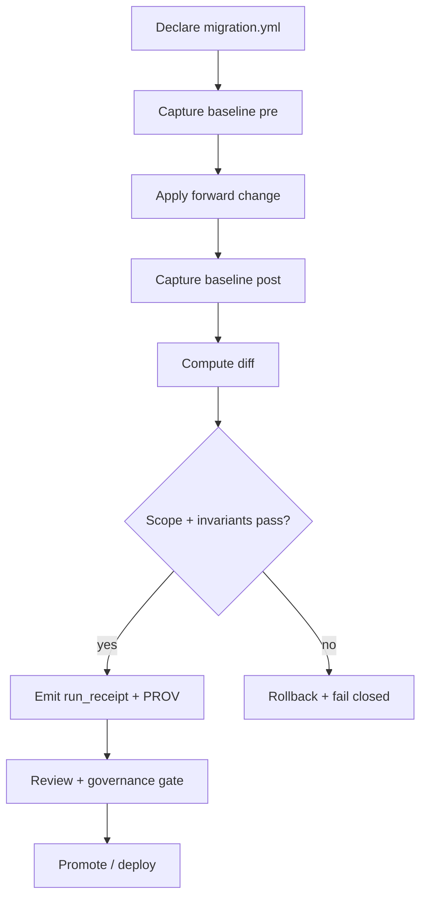

<!-- [KFM_META_BLOCK_V2]
doc_id: kfm://doc/46a7276e-762c-48b6-9731-f13d3f0db4fb
title: Migrations
type: standard
version: v1
status: draft
owners: TBD
created: 2026-02-22
updated: 2026-02-22
policy_label: public
related:
  - ../README.md
tags: [kfm, migrations, governance, prov, rollback]
notes:
  - This README defines how migrations are declared, reviewed, executed, validated, and rolled back.
  - When in doubt: fail closed, emit receipts, and require governance review.
[/KFM_META_BLOCK_V2] -->

# Migrations
**Purpose:** Governed, reversible changes to KFM storage + graph shape (schema, ontology, constraints, and backfills) with **scope control**, **baseline snapshots**, **receipts**, and **rollback artifacts**.


---

## Quick navigation
- [What belongs here](#what-belongs-here)
- [Directory layout](#directory-layout)
- [Non-negotiables](#non-negotiables)
- [Graph migrations](#graph-migrations)
  - [Migration declaration contract](#migration-declaration-contract)
  - [Baselines](#baselines)
  - [Invariant checks](#invariant-checks)
  - [Diffs and blast-radius control](#diffs-and-blast-radius-control)
  - [Rollback artifacts](#rollback-artifacts)
  - [PROV + run receipts](#prov--run-receipts)
- [Relational or service migrations](#relational-or-service-migrations)
- [How to add a migration](#how-to-add-a-migration)
- [PR checklist](#pr-checklist)
- [Troubleshooting](#troubleshooting)

---

## What belongs here
A **migration** is any change that intentionally mutates:
- **Graph shape** (labels, relationships, constraints, ontology / semantics).
- **Schema / constraints** in a relational store (tables, indexes, constraints).
- **Derived caches / indexes** when they are considered “runtime surfaces” and must be rebuilt in a controlled way.
- **Data backfills** that must be recorded and are not simply re-running a deterministic pipeline.

If the change can be achieved by re-running deterministic ingestion/normalization from immutable inputs, prefer pipelines over migrations.

---

## Directory layout
> This repo’s exact tools/commands may differ. The layout below is the **recommended contract**. If the repo already uses a different structure, update this tree to match reality and keep the contract guarantees.

```text
migrations/
├─ README.md
├─ graph/
│  ├─ GRAPH-MIG-YYYY-MM-DD-01/
│  │  ├─ migration.yml              # machine-readable declaration (scope + limits)
│  │  ├─ forward.cypher             # forward change (idempotent preferred)
│  │  ├─ rollback.cypher            # rollback plan (required if requires_rollback=true)
│  │  ├─ baselines/
│  │  │  ├─ pre.json                # baseline snapshot BEFORE
│  │  │  └─ post.json               # baseline snapshot AFTER
│  │  ├─ diffs/
│  │  │  ├─ summary.json            # declared-vs-observed delta summary
│  │  │  └─ touched.csv             # optional: labels/rel-types/actors touched
│  │  ├─ receipts/
│  │  │  ├─ run_receipt.json        # run receipt for this execution
│  │  │  └─ prov.jsonld             # PROV activity/entity/agent bundle
│  │  └─ notes.md                   # human context, risks, review notes
│  └─ _schemas/
│     └─ migration_declaration.schema.json
├─ db/                               # optional (if this repo uses DB schema migrations)
│  └─ ...
└─ _fixtures/
   ├─ valid/
   └─ invalid/
```

---

## Non-negotiables
These rules exist to protect the **trust membrane** and keep changes reversible.

1. **Fail closed:** if validation, policy, or invariant checks fail → do not proceed; rollback if needed.
2. **Scope declared upfront:** every migration declares what it is allowed to touch.
3. **Baseline + diff required:** capture pre/post state and compute deltas; reviewers must see blast radius.
4. **Rollback artifacts required:** migrations must be reversible unless explicitly documented and approved.
5. **Receipts always:** each run emits a **run receipt** and a **PROV record** so changes are attributable and auditable.
6. **Governance-sensitive nodes are “hard stop”:** protected nodes / authority nodes must not change without explicit governance approval.

---

## Graph migrations
Graph migrations are the default “high-risk / high-governance” migration type because graph shape drift can silently break downstream analytics and narratives.

### Migration declaration contract
Each graph migration must include a machine-readable `migration.yml` with:
- Stable `migration_id`
- A plain-language `intent`
- Explicit scope constraints (allowed/forbidden labels, deltas, etc.)
- Governance review routing

Example:

```yaml
migration_id: GRAPH-MIG-YYYY-MM-DD-##
intent: "Short natural-language statement of what should change"
allowed_labels:
  - Feature
  - Provenance
forbidden_labels:
  - Authority
  - Treaty
max_node_delta: 12000
max_rel_delta: 30000
requires_rollback: true
governance_review: "FAIR+CARE Council"
```

> **Naming:** use `GRAPH-MIG-YYYY-MM-DD-##` and keep it stable. Never reuse a migration_id.

### Baselines
Each migration must capture a **pre-migration baseline** and **post-migration baseline**. At minimum, baseline capture should detect graph-shape damage even when raw counts are stable.

Recommended baseline fields:
- Node count and relationship count (coarse drift)
- Schema/constraint fingerprint (constraint/index drift)
- Label entropy (ontology reshaping)
- Degree distribution fingerprints (fan-out explosions)
- Protected/authority node hash (“sacred node” mutation detection)

Store baselines under `baselines/pre.json` and `baselines/post.json`.

### Invariant checks
CI (and local preflight) must enforce invariant classes such as:
- **Structural:** no unlabeled nodes; no relationship without type; no orphaned provenance
- **Ontological:** mutually exclusive labels remain exclusive; required acyclicity constraints hold
- **Cardinality:** required relationships exist; min/max fan-out constraints hold where defined
- **Governance hard stop:** protected nodes must never change

### Diffs and blast-radius control
Every migration run must compute declared-vs-observed deltas:
- Label-scoped and relationship-scoped diffs
- Temporal diffing (stamp changes with `updatedAt` and report actors/labels touched during the window)
- CI must fail if unexpected labels or relationship types appear outside the declared plan

Suggested outputs:
- `diffs/summary.json` (machine-readable)
- `diffs/touched.csv` (reviewer-friendly)

### Rollback artifacts
If `requires_rollback: true`, every migration must produce:
- Pre-state checksum
- Mutation log (what was mutated)
- Deterministic ID map (so rollback is correct)
- Tested rollback Cypher (`rollback.cypher`)

Store immutable mutation captures under a stable path (recommended pattern):
- `data/work/logs/graph/migrations/<migration_id>/<run_id>/...` *(path may vary by repo; the key requirement is “immutable + stable”)*

### PROV + run receipts
Each migration run must emit:
- A **run receipt** capturing who/what/when, inputs/outputs, environment, validation status, and policy decisions
- A **PROV record** representing the migration as a PROV Activity with pre/post Entities and a Runner/commit Agent

Store under `receipts/` next to the migration.

Mermaid view of the expected lifecycle:



---

## Relational or service migrations
If this repo has DB schema migrations (SQL migrations, ORM migrations, index rebuild scripts, etc.), place them under `migrations/db/` and apply the same governance posture:

- Every migration is immutable once merged.
- Every migration has a declared intent and a rollback strategy.
- Every run emits receipts and attaches validation evidence.
- Do not apply directly to production without the governed pipeline/runner.

If you introduce a DB-migration tool (e.g., Alembic/Flyway/etc.), add:
- A `migrations/db/README.md` describing the exact commands and environment variables
- CI checks ensuring migrations are ordered, reproducible, and reversible

---

## How to add a migration
1. **Pick the migration type** (`graph/` vs `db/`).
2. **Create a new folder**:
   - `migrations/graph/GRAPH-MIG-YYYY-MM-DD-01/`
3. **Write `migration.yml`** (scope + limits + governance routing).
4. **Implement forward and rollback scripts** (idempotent forward preferred).
5. **Add fixtures**:
   - Valid/invalid declaration fixtures under `migrations/_fixtures/` (for schema validator tests).
6. **Run locally in a safe environment**:
   - Capture baselines, apply forward, compute diff, validate invariants, test rollback.
7. **Commit artifacts required for review**:
   - `migration.yml`, scripts, and any validator/schema changes
   - (Optionally) a small, non-sensitive sample diff output if it helps reviewers

---

## PR checklist
- [ ] `migration.yml` present and validated
- [ ] Allowed/forbidden scope is explicit and tight
- [ ] Baseline capture implemented (pre + post)
- [ ] Diff output is produced and reviewable
- [ ] Invariant checks pass locally and in CI
- [ ] Rollback strategy exists and is tested (or governance-approved exception)
- [ ] Run receipt + PROV generation is wired (or the runner tooling is updated accordingly)
- [ ] Governance review requested if the migration could touch protected/authority nodes or sensitive domains

---

## Troubleshooting
**CI hard fails** (must fix; do not merge):
- Protected node mutation detected
- Schema fingerprint mismatch (unexpected constraint/index drift)
- Orphaned provenance detected
- Unexpected labels/relationship types outside declared scope

**Soft fails** (manual review required):
- Bounded cardinality drift
- Performance index rebuild

**Informational**:
- New labels introduced *and declared*

---

<details>
<summary>Appendix: Guardrails for “do not do this”</summary>

- Do not delete or rewrite already-merged migrations.
- Do not run migrations manually against production.
- Do not weaken scope limits “to get CI green.”
- Do not log sensitive fields into receipts/baselines/diffs without redaction/generalization.

</details>

---

_“Documentation is production.” If you add a new migration type or runner, update this README and include validator tests to enforce the new contract._
