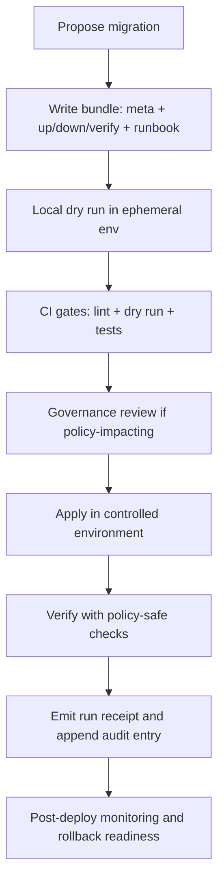

# Migrations
Governed, reversible changes to **rebuildable runtime stores** (projection schemas, indexes, and derived caches) without mutating canonical truth.

**Status:** Draft (vNext)  
**Owners:** Platform Engineering • Governance Stewards  
**Badges:** 🧾 run-receipts • 🛡️ policy-gated • ♻️ reversible • 🧱 rebuildable-projections

**Quick links:**  
- [Purpose](#purpose)  
- [Scope and non-goals](#scope-and-non-goals)  
- [Repository layout](#repository-layout)  
- [Migration contract](#migration-contract)  
- [Lifecycle](#lifecycle)  
- [How to add a migration](#how-to-add-a-migration)  
- [How to apply migrations safely](#how-to-apply-migrations-safely)  
- [CI gates](#ci-gates)  
- [Audit and run receipts](#audit-and-run-receipts)  
- [Definition of done](#definition-of-done)  
- [Templates](#templates)

---

## Purpose

This directory holds **versioned migration bundles** used to evolve:

- **Projection schemas** (e.g., PostGIS tables derived from promoted artifacts)
- **Search / graph / tile projections** (rebuildable indexes/caches)
- **Runtime metadata structures** that support evidence resolution (e.g., adding `dataset_version_id`, `evidence_ref`, policy-safe fields)

Migrations are **governed artifacts**: they can affect policy enforcement, evidence traceability, and what the UI/API can safely expose.

---

## Scope and non-goals

### In scope
- Schema changes to **rebuildable projection stores**.
- Reindex/rebuild routines for derived stores (search, graph edges, tiles) **as repeatable jobs**.
- Compatibility migrations when API/UI contracts require new fields in projections.

### Non-goals
- **Do not** “edit history” in canonical truth-path zones (RAW/WORK/PROCESSED/CATALOG).
- **Do not** patch/repair promoted artifacts in place.
- **Do not** use migrations as an ad-hoc data wrangling tool; if data needs changing, create a new DatasetVersion via pipelines and rebuild projections.

> [!IMPORTANT]
> Canonical artifacts are immutable once promoted. If a canonical representation is wrong, the fix is a **new version + rebuild**, not a mutation.

> [!WARNING]
> Never bypass the policy boundary during verification. A migration that logs or exports sensitive fields can create an accidental disclosure.

---

## Repository layout

Recommended structure:

```text
migrations/
  README.md

  2026-02-22T000000Z_add_evidence_ref_to_projection/
    meta.json
    up.sql
    down.sql
    verify.sql
    runbook.md
    receipt.example.json
```

**Naming convention:**  
`<UTC_ISO8601>_<short_slug>/`  
Example: `2026-02-22T153000Z_add_policy_label_column/`

**Immutability rule:** once merged, migration bundles are treated as immutable. To change behavior, create a new migration.

---

## Migration contract

Every migration bundle **MUST** include the following artifacts:

| Path | Required | Purpose |
|---|---:|---|
| `meta.json` | ✅ | Machine-readable metadata: target, risk, approvals needed, policy impact |
| `up.sql` / `up.*` | ✅ | Forward migration (schema or rebuild trigger) |
| `down.sql` / `down.*` | ✅ | Rollback path (or explicit “no rollback” rationale) |
| `verify.sql` / `verify.*` | ✅ | Post-apply checks that are policy-safe and deterministic |
| `runbook.md` | ✅ | Human procedure: prerequisites, execution steps, failure handling |
| `receipt.example.json` | ✅ | Expected run receipt shape (for CI validation + audits) |

> [!NOTE]
> The `up.* / down.* / verify.*` file extension can be SQL, TypeScript, Python, etc. The **runner** defines what’s supported. The contract is about **behavior + receipts**, not language.

### `meta.json` minimum fields

```json
{
  "migration_id": "2026-02-22T153000Z_add_policy_label_column",
  "title": "Add policy_label column to projection tables",
  "type": "projection_schema",
  "targets": ["postgis"],
  "owners": ["platform-eng"],
  "risk": "medium",
  "backwards_compatible": true,
  "policy_impact": "yes",
  "requires_steward_approval": true,
  "notes": "Adds a policy-safe label column used by API responses."
}
```

---

## Lifecycle



---

## How to add a migration

1. **Create a new bundle folder** using the naming convention.
2. Write `meta.json` with **explicit** scope and risk.
3. Implement `up.*`:
   - Prefer additive changes (new columns, new tables) over destructive changes.
   - Make it **idempotent** where possible.
4. Implement `down.*`:
   - If rollback is unsafe or impossible, document *why* in `runbook.md` and mark `down.sql` as a no-op with explicit rationale.
5. Implement `verify.*`:
   - Must be deterministic.
   - Must avoid printing sensitive values; prefer counts, schema checks, and sampling with redaction.
6. Write `runbook.md`:
   - Preconditions (what versions, what environment)
   - Execution steps
   - Failure modes and mitigations
   - Rollback steps (or explicit no-rollback plan)
7. Add `receipt.example.json`:
   - A “golden” receipt example used to validate the runner output format.

---

## How to apply migrations safely

The migration runner (CI/CD job, ops tool, or service) **MUST** enforce:

- **Fail-closed semantics**: no partial promote or “best effort” application.
- **Transactional behavior** where supported (DB migrations).
- **Idempotency**: rerunning a completed migration should be a no-op.
- **Explicit environment binding**: receipts include environment + runner identity.
- **No silent drift**: inputs/outputs recorded by digest or stable IDs.

> [!TIP]
> Because projection stores are rebuildable, prefer **rebuild pipelines** for large refactors instead of multi-step in-place migrations.

---

## CI gates

CI must block merges unless, at minimum:

1. `meta.json` validates against a schema (required fields present).
2. `up/down/verify` scripts lint and parse (language-appropriate).
3. Migration applies successfully in an **ephemeral environment**.
4. `verify.*` passes.
5. If `policy_impact = "yes"`:
   - Policy fixtures/tests still pass.
   - Contract tests still pass (e.g., evidence resolution doesn’t break).

---

## Audit and run receipts

Every applied migration **MUST** emit a run receipt capturing:

- inputs (migration bundle digest / script digests)
- outputs (schema version, index versions, resulting digests where applicable)
- environment (runner version, container digest if used)
- validation results (verify checks, counts)
- policy decisions (if the runner queries policy for safety checks)

### Receipt shape (minimum)

```json
{
  "receipt_version": "v1",
  "migration_id": "2026-02-22T153000Z_add_policy_label_column",
  "status": "success",
  "started_at": "2026-02-22T15:30:12Z",
  "ended_at": "2026-02-22T15:31:05Z",
  "actor": { "kind": "ci", "id": "github-actions" },
  "environment": {
    "name": "staging",
    "runner_version": "migrate-runner@sha256:...",
    "container_image_digest": "sha256:..."
  },
  "inputs": [
    { "kind": "migration_bundle", "path": "migrations/2026-02-22T153000Z_add_policy_label_column", "digest": "sha256:..." }
  ],
  "outputs": [
    { "kind": "db_schema_version", "value": "2026-02-22T153000Z_add_policy_label_column" }
  ],
  "validations": [
    { "check": "verify.sql", "status": "pass" }
  ],
  "policy": {
    "decision": "allow",
    "policy_label": "internal",
    "obligations": []
  }
}
```

> [!IMPORTANT]
> Receipts are audit artifacts. Store them in the canonical audit path and reference them from deployment logs/issues.

---

## Definition of done

A migration is “done” when:

- [ ] Bundle exists with all required files (`meta`, `up`, `down`, `verify`, `runbook`, `receipt.example`)
- [ ] CI applies + verifies in an ephemeral environment
- [ ] Rollback plan is documented and realistic
- [ ] Any policy impact is reviewed and approved by a steward
- [ ] Receipt is emitted and audit ledger entry is append-only
- [ ] No canonical artifacts are mutated; projections remain rebuildable

---

## Templates

<details>
<summary><strong>runbook.md template</strong></summary>

```markdown
# Migration Runbook — <migration_id>

## Purpose
- What changes and why

## Targets
- postgis / search / graph / tiles

## Preconditions
- Required runtime version(s)
- Required policy bundle version(s)
- Backup / snapshot requirements (if any)

## Execution
1. Dry run
2. Apply
3. Verify

## Verification
- Expected results (policy-safe)
- How to detect failure

## Rollback
- Steps to rollback
- If rollback is not possible: mitigation + rebuild plan

## Risks
- Performance risks
- Policy leakage risks
- Data correctness risks

## Audit
- Where the run receipt is stored
- Audit ledger reference format
```

</details>

<details>
<summary><strong>meta.json schema notes</strong></summary>

- `risk`: `low | medium | high`
- `type`: `projection_schema | projection_rebuild | search_reindex | graph_rebuild | tiles_rebuild | other`
- `policy_impact`: `yes | no`
- `requires_steward_approval`: must be `true` when `policy_impact = yes`

</details>
