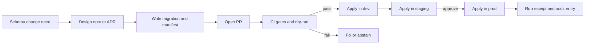

<!-- [KFM_META_BLOCK_V2]
doc_id: kfm://doc/6f9c4f1a-9fe7-4f3a-a0ee-0f8b8e2b9b5f
title: KFM Database Migrations
type: standard
version: v1
status: draft
owners: kfm-platform-team
created: 2026-03-03
updated: 2026-03-03
policy_label: restricted
related:
  - docs/governance/ROOT_GOVERNANCE_CHARTER.md
  - docs/standards/promotion-contract.md
  - apps/cli/README.md
tags: [kfm, migrations, postgres, postgis, governance]
notes:
  - This README is governance-first. It documents *how* we change schema without bypassing policy boundaries.
  - Where repo-specific details are unknown, this file labels them as UNKNOWN and provides minimal verification steps.
[/KFM_META_BLOCK_V2] -->

# migrations — Postgres/PostGIS schema change log (Governed)

**Purpose:** Versioned database schema migrations for KFM (PostgreSQL + PostGIS), executed via governed workflows and never by UI clients.  
**Status:** draft • **Owners:** `kfm-platform-team` • **Policy:** restricted


**Quick nav**
- [What belongs here](#what-belongs-here)
- [Where this fits](#where-this-fits)
- [Evidence tags](#evidence-tags)
- [Workflow](#workflow)
- [Layout and naming](#layout-and-naming)
- [Authoring rules](#authoring-rules)
- [How to run](#how-to-run)
- [Verification gates](#verification-gates)
- [Rollback and recovery](#rollback-and-recovery)
- [FAQ](#faq)

---

## What belongs here

### ✅ Acceptable inputs
- **[CONFIRMED]** SQL migration scripts that change schema objects in Postgres/PostGIS (tables, indexes, views, functions, extensions), plus any migration metadata/manifest files used to make execution auditable.
- **[PROPOSED]** Deterministic migration manifests (YAML/JSON) that record: migration id, description, checksum, dependencies, forward/rollback pointers, and required locks/downtime notes.

### ❌ Exclusions
- **[CONFIRMED]** No application code changes (those live in `apps/` and `packages/`).
- **[CONFIRMED]** No raw dataset payloads or data dumps.
- **[CONFIRMED]** No secrets, credentials, connection strings, or production hostnames.
- **[PROPOSED]** No “manual hotfix SQL” that is not also captured as a migration with a PR + receipt.

Back to top: [↑](#migrations--postgispostgresql-schema-change-log-governed)

---

## Where this fits

**[CONFIRMED]** KFM uses a layered architecture with a governed API boundary: clients/UI must not talk to databases directly. Migrations are an operator/developer concern, executed in controlled environments (dev/stage/prod) with auditability and policy gates.

**[CONFIRMED]** This directory exists to support the repo’s “schema/DB migration scripts” layer and keep schema evolution reviewable and reproducible.

Back to top: [↑](#migrations--postgispostgresql-schema-change-log-governed)

---

## Evidence tags

KFM docs require evidence discipline. This README uses:

- **[CONFIRMED]** Supported by an authoritative KFM source.
- **[PROPOSED]** A recommended design/implementation choice (safe default).
- **[UNKNOWN]** Not verified in this repo snapshot.

**If something is [UNKNOWN], include the smallest verification step to make it [CONFIRMED].**  
Example: “Which migration runner do we use?” → check `apps/cli`, CI workflows, and `docker-compose` (if present).

Back to top: [↑](#migrations--postgispostgresql-schema-change-log-governed)

---

## Workflow

**[CONFIRMED]** Schema changes follow the same governance posture as the rest of KFM: PR-first, fail-closed, auditable.


```mermaid
flowchart LR
  A[Schema change need] --> B[Design note or ADR]
  B --> C[Write migration and manifest]
  C --> D[Open PR]
  D --> E[CI gates and dry-run]
  E -->|pass| F[Apply in dev]
  F --> G[Apply in staging]
  G -->|approve| H[Apply in prod]
  E -->|fail| X[Fix or abstain]
  H --> I[Run receipt and audit entry]
```

### Minimal Definition of Done
- **[PROPOSED]** Migration has a unique id, clear intent, and **reversible** plan (either explicit down migration or documented rollback procedure).
- **[PROPOSED]** CI proves: “apply from scratch” + “upgrade from previous release” on an ephemeral DB.
- **[PROPOSED]** A run receipt is produced (who/what/when/why + checksums) and stored under an auditable path (see [Verification gates](#verification-gates)).

Back to top: [↑](#migrations--postgispostgresql-schema-change-log-governed)

---

## Layout and naming

### Current repo layout
- **[UNKNOWN]** The exact on-disk structure under `migrations/` in this repository.
  - **Verification (smallest):** list directory contents and check for a migration runner config (e.g., `migrate`, `sqitch`, `flyway`, `alembic`, custom `apps/cli` command).

### Recommended layout (additive)
**[PROPOSED]** Keep migrations append-only and grouped by target (postgres core vs postgis/geo).

```text
migrations/
  README.md
  postgres/
    20260303_0001_init_schema.up.sql
    20260303_0001_init_schema.down.sql
    20260310_0002_add_dataset_versions_table.up.sql
    20260310_0002_add_dataset_versions_table.down.sql
  postgis/
    20260303_0100_enable_postgis_extension.up.sql
    20260303_0100_enable_postgis_extension.down.sql
  manifests/
    20260310_0002_add_dataset_versions_table.migration.yml
```

### Naming conventions
- **[PROPOSED]** `YYYYMMDD_NNNN_<short_slug>.(up|down).sql`
- **[PROPOSED]** Slug should describe intent, not implementation detail (e.g., `add_spatial_index_parcels`, not `create_gist_idx_3`).

Back to top: [↑](#migrations--postgispostgresql-schema-change-log-governed)

---

## Authoring rules

### Safety and governance invariants
- **[CONFIRMED]** Do not bypass the policy boundary: schema migrations are run by operators/CI, never by UI clients.
- **[PROPOSED]** Use least-privilege DB roles:
  - `kfm_migrator` can run migrations (DDL).
  - `kfm_app` can read/write only what the governed APIs need at runtime.
- **[PROPOSED]** Migrations must be deterministic and environment-agnostic:
  - No references to machine-local paths.
  - No assumptions about nonstandard extensions beyond those explicitly enabled in migrations.

### SQL guidance (Postgres)
- **[PROPOSED]** Make migrations idempotent where safe (`CREATE TABLE IF NOT EXISTS` only when semantics are clear).
- **[PROPOSED]** Prefer explicit schema (`kfm.`) instead of `public`.
- **[PROPOSED]** Avoid long exclusive locks in production:
  - Use `CREATE INDEX CONCURRENTLY` where appropriate (note: cannot run inside a transaction).
  - Split heavyweight operations into separate steps and document expected impact.

### PostGIS guidance
- **[PROPOSED]** Treat CRS explicitly:
  - Declare SRIDs for geometry columns.
  - Add constraints or checks if CRS must be enforced.
- **[PROPOSED]** Spatial indexes are required for interactive map queries:
  - Use `GIST` indexes for geometry columns when appropriate.

### Data backfills
- **[PROPOSED]** If a schema change requires data backfill, separate it:
  1) schema migration (safe, fast)
  2) backfill job (governed pipeline with receipts)
  3) constraint enforcement (final migration)
- **[CONFIRMED]** Do not embed sensitive coordinates or restricted data in migration SQL.

Back to top: [↑](#migrations--postgispostgresql-schema-change-log-governed)

---

## How to run

### Migration runner
- **[UNKNOWN]** Which tool is used to apply migrations in this repo (custom CLI, a standard migration framework, or plain `psql`).
  - **Verification (smallest):**
    1) search `apps/cli` for “migrate” commands
    2) check `.github/workflows/*` for migration steps
    3) check `docker-compose*` or `infra/` for an init container that applies migrations

### Safe local execution (generic)
**[PROPOSED]** For local/dev only, using `psql` directly:

```bash
# Apply (example)
psql "$DATABASE_URL" -v ON_ERROR_STOP=1 -f migrations/postgres/20260310_0002_add_dataset_versions_table.up.sql

# Rollback (example)
psql "$DATABASE_URL" -v ON_ERROR_STOP=1 -f migrations/postgres/20260310_0002_add_dataset_versions_table.down.sql
```

> NOTE  
> If your migration uses `CREATE INDEX CONCURRENTLY`, it must run outside a transaction. Your runner (or script) must support that.

Back to top: [↑](#migrations--postgispostgresql-schema-change-log-governed)

---

## Verification gates

KFM is “fail-closed.” Schema changes must prove safety before promotion.

### Required gates (recommended baseline)
- **[PROPOSED]** **Dry-run apply** against a clean ephemeral database.
- **[PROPOSED]** **Upgrade test** from the previous release schema.
- **[PROPOSED]** **Contract/integration tests**: governed API still starts and passes smoke tests.
- **[PROPOSED]** **Policy checks** (if present): verify any access-control implications (new tables, new fields) have policy coverage.

### Receipt and audit
- **[PROPOSED]** Emit a minimal run receipt after applying migrations in CI/staging/prod:
  - migration ids applied
  - git sha of repo
  - runner version
  - DB engine version (Postgres/PostGIS)
  - start/end timestamps
  - checksum of each migration file (sha256)

**Suggested receipt shape (example)**
```json
{
  "type": "kfm.db_migration_receipt.v1",
  "run_id": "2026-03-03T18:22:11Z-abc123",
  "git_sha": "<sha>",
  "db": { "postgres": "16.x", "postgis": "3.x" },
  "applied": [
    { "id": "20260310_0002_add_dataset_versions_table", "sha256": "<...>" }
  ],
  "status": "success"
}
```

Back to top: [↑](#migrations--postgispostgresql-schema-change-log-governed)

---

## Rollback and recovery

### Rollback posture
- **[PROPOSED]** Prefer reversible migrations with explicit `down.sql` where feasible.
- **[PROPOSED]** If a true rollback is unsafe (e.g., destructive column drop), require:
  - pre-migration backup/restore plan
  - a compatibility window (deploy app code that can handle both schemas)
  - a “forward fix” migration strategy

### Backups
- **[PROPOSED]** Before production migrations:
  - schema-only snapshot (`pg_dump --schema-only`)
  - full backup if destructive operations are present

Back to top: [↑](#migrations--postgispostgresql-schema-change-log-governed)

---

## FAQ

### Why is this directory governed so strictly?
- **[CONFIRMED]** Schema is part of the platform’s system-of-record. A bad migration can break the governed API boundary, invalidate provenance guarantees, or cause downtime.

### Can the UI trigger migrations?
- **[CONFIRMED]** No. Clients/UI must not access databases directly; all runtime access goes through governed APIs.

### Can I hotfix production with manual SQL?
- **[PROPOSED]** Treat “manual SQL” as an incident response measure only, and immediately backfill it into an auditable migration PR with receipts.

Back to top: [↑](#migrations--postgispostgresql-schema-change-log-governed)

---

## Appendix: templates

### Migration manifest template (recommended)
```yaml
# migrations/manifests/20260310_0002_add_dataset_versions_table.migration.yml
migration_id: "20260310_0002_add_dataset_versions_table"
status: "proposed"
owner: "kfm-platform-team"
created: "2026-03-10"
applies_to:
  engine: "postgres"
  extensions: ["postgis"]
requires:
  - "20260303_0001_init_schema"
files:
  up: "migrations/postgres/20260310_0002_add_dataset_versions_table.up.sql"
  down: "migrations/postgres/20260310_0002_add_dataset_versions_table.down.sql"
checks:
  - name: "ephemeral_db_apply"
    must_pass: true
  - name: "upgrade_from_previous_release"
    must_pass: true
notes:
  lock_impact: "low"
  downtime_required: false
```
