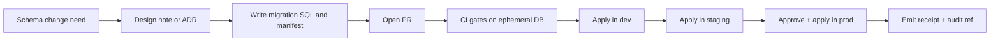

<!-- [KFM_META_BLOCK_V2]
doc_id: kfm://doc/6f9c4f1a-9fe7-4f3a-a0ee-0f8b8e2b9b5f
title: KFM Database Migrations
type: standard
version: v1.1
status: draft
owners: kfm-platform-team
created: 2026-03-03
updated: 2026-03-03
policy_label: restricted
related:
  - docs/governance/ROOT_GOVERNANCE_CHARTER.md
  - docs/standards/promotion-contract.md
  - apps/cli/README.md
tags: [kfm, migrations, postgres, postgis, governance]
notes:
  - This README is governance-first. It documents *how* we change schema without bypassing policy boundaries.
  - Where repo-specific details are unknown, this file labels them as UNKNOWN and provides minimal verification steps.
[/KFM_META_BLOCK_V2] -->

# migrations — Postgres/PostGIS schema changes

**Purpose:** Versioned Postgres/PostGIS schema migrations for KFM, executed via **governed workflows** and never by UI clients.

> **IMPACT**
> - **Risk:** High (schema changes can break the governed API, invalidate projections, or cause downtime).
> - **Audience:** Platform/DB operators, API maintainers, reviewers.
> - **Hard invariant:** Clients/UI never run migrations and never access DB/storage directly.
> - **Fail‑closed:** If a required gate/receipt is missing, promotion stops.

**Status:** draft • **Owners:** `kfm-platform-team` • **Policy:** restricted


**Quick nav**
- [Scope](#scope)
- [Where this fits in KFM](#where-this-fits-in-kfm)
- [Evidence tags](#evidence-tags)
- [Directory tree](#directory-tree)
- [Workflow](#workflow)
- [Authoring rules](#authoring-rules)
- [How to run](#how-to-run)
- [Verification gates](#verification-gates)
- [Rollback and recovery](#rollback-and-recovery)
- [FAQ](#faq)
- [Appendix templates](#appendix-templates)

---

## Scope

### ✅ Acceptable inputs
- **[CONFIRMED]** Postgres/PostGIS **migration SQL** (`*.sql`) and any runner metadata needed to apply them deterministically.
- **[PROPOSED]** Machine‑readable **migration declarations** (YAML/JSON) that record intent, checksums, prerequisites, and rollback posture.
- **[PROPOSED]** Test fixtures for ephemeral DB validation (seed schema snapshots, smoke queries).

### ❌ Exclusions
- **[CONFIRMED]** No application code changes (those live under `apps/` and `packages/`).
- **[CONFIRMED]** No raw dataset payloads or bulk data dumps.
- **[CONFIRMED]** No secrets (credentials, DSNs with passwords, production hostnames, API keys).
- **[PROPOSED]** No “manual hotfix SQL” without an incident record **and** a follow‑up migration PR + receipt.

Back to top: [↑](#migrations--postgrespostgis-schema-changes)

---

## Where this fits in KFM

### Architecture boundary (trust membrane)
- **[CONFIRMED]** KFM enforces a **trust membrane**: clients never access storage/DB directly; access is policy‑evaluated at the governed API boundary (PEP + policy engine).  
- **[CONFIRMED]** Migrations are therefore **operator/CI concerns**, not UI features.

### Truth path context (why migrations are governed)
- **[CONFIRMED]** KFM’s “truth path” lifecycle is enforced by **promotion gates** and an auditable chain of artifacts (RAW → WORK/QUARANTINE → PROCESSED → CATALOG/TRIPLET → PUBLISHED).  
- **[PROPOSED]** PostGIS is treated as a **runtime store / projection**: schema evolution must not weaken provenance, policy enforcement, or rebuildability.

### Repo placement
- **[CONFIRMED]** `migrations/` exists as a top‑level concern in the KFM repo inventory, alongside `apps/` and other governed modules.
- **[UNKNOWN]** The exact runner, config files, and folder layout used by this repository snapshot.
  - **Verification (smallest):**
    1) `ls migrations/`
    2) search for runner config (`flyway.conf`, `sqitch.conf`, `alembic.ini`, `*.yaml`, `*.json`)
    3) search for CLI entrypoints under `apps/cli` for `migrate`, `db`, `schema`

Back to top: [↑](#migrations--postgrespostgis-schema-changes)

---

## Evidence tags

KFM docs require evidence discipline. This README uses:

- **[CONFIRMED]** Supported by an authoritative KFM source or repo‑inventory evidence.
- **[PROPOSED]** A recommended default pattern (safe and reversible).
- **[UNKNOWN]** Not verified in this repo snapshot.

**Rule:** If something is **[UNKNOWN]**, include the smallest verification step to make it **[CONFIRMED]**.

Back to top: [↑](#migrations--postgrespostgis-schema-changes)

---

## Directory tree

### Current tree (repo-specific)
- **[UNKNOWN]** The current on‑disk layout under `migrations/`.
  - **Verification (smallest):** `tree migrations -L 4` and check runner config.

### Recommended baseline layout (additive)
**[PROPOSED]** Keep migrations **append‑only** and split by engine target.

```text
migrations/
  README.md
  postgres/
    20260303_0001_init_schema.up.sql
    20260303_0001_init_schema.down.sql
    20260310_0002_add_dataset_versions_table.up.sql
    20260310_0002_add_dataset_versions_table.down.sql
  postgis/
    20260303_0100_enable_postgis_extension.up.sql
    20260303_0100_enable_postgis_extension.down.sql
  manifests/
    20260310_0002_add_dataset_versions_table.migration.yml
  fixtures/
    smoke_queries.sql
    schema_fingerprint.sql
```

### Naming conventions
- **[PROPOSED]** `YYYYMMDD_NNNN_<short_slug>.(up|down).sql`
- **[PROPOSED]** Slugs describe *intent*, not implementation detail.

### Migration artifact matrix
**[PROPOSED]** Keep these artifacts together per migration:

| Artifact | Required | Purpose |
|---|---:|---|
| `*.up.sql` | ✅ | Forward change |
| `*.down.sql` | ⚠️ | Reversal when safe; if unsafe, document forward-fix plan |
| `*.migration.yml` | ✅ | Declared intent, prerequisites, risk/lock profile, checksums |
| Receipt (run output) | ✅ in CI/stage/prod | Audit trail: who/what/when/why + digests |

Back to top: [↑](#migrations--postgrespostgis-schema-changes)

---

## Workflow

**[CONFIRMED]** KFM changes are PR‑first and fail‑closed. Schema changes follow the same posture.


```mermaid
flowchart LR
  A[Schema change need] --> B[Design note or ADR]
  B --> C[Write migration SQL and manifest]
  C --> D[Open PR]
  D --> E[CI gates on ephemeral DB]
  E --> F[Apply in dev]
  F --> G[Apply in staging]
  G --> H[Approve + apply in prod]
  H --> I[Emit receipt + audit ref]
```

### Minimal Definition of Done
- **[PROPOSED]** Unique migration id + clear intent in manifest.
- **[PROPOSED]** Safe rollback posture:
  - either `down.sql`, or
  - explicit “forward fix” plan + backup requirement.
- **[PROPOSED]** CI proves:
  - apply from scratch on ephemeral DB
  - upgrade from previous schema (or previous release tag)
- **[PROPOSED]** Receipt emitted and stored at an auditable path (see [Verification gates](#verification-gates)).

Back to top: [↑](#migrations--postgrespostgis-schema-changes)

---

## Authoring rules

### Non-negotiable invariants (KFM alignment)
- **[CONFIRMED]** UI/clients must not access DB/storage directly.
- **[CONFIRMED]** All runtime reads/writes must cross governed APIs + policy enforcement.
- **[PROPOSED]** New schema objects require:
  - repository/adapter support (no direct store calls from core logic)
  - policy coverage for any new fields that can affect access control, sensitivity, or redaction logic

### Least-privilege roles (recommended)
- **[PROPOSED]** Use separate roles:
  - `kfm_migrator`: DDL privileges required for migrations
  - `kfm_app`: runtime role (least privilege)
  - `kfm_readonly`: analytics/debug where allowed
- **[PROPOSED]** CI must prove the runtime service can start using `kfm_app` without extra privileges.

### SQL guidance (Postgres)
- **[PROPOSED]** Prefer explicit schema (`kfm.`) rather than `public`.
- **[PROPOSED]** Be deterministic:
  - no host-specific paths
  - no “depends on existing extension” assumptions unless enabled in migration
- **[PROPOSED]** Lock discipline:
  - avoid long exclusive locks
  - use `CREATE INDEX CONCURRENTLY` when appropriate (note: not allowed inside a transaction)
- **[PROPOSED]** Use advisory locks (or equivalent runner locks) to prevent concurrent deploy/migrate collisions.

### PostGIS guidance
- **[PROPOSED]** Treat CRS explicitly:
  - declare SRIDs for geometry columns
  - add constraints/checks when CRS must be enforced
- **[PROPOSED]** Add spatial indexes for interactive queries (typically `GIST`).

### Data backfills (separate from schema)
- **[PROPOSED]** Split heavy changes:
  1) schema migration (fast, safe)
  2) backfill job (governed pipeline + receipts)
  3) constraint enforcement (final migration)
- **[CONFIRMED]** Do not embed sensitive coordinates or restricted data in migration SQL.

Back to top: [↑](#migrations--postgrespostgis-schema-changes)

---

## How to run

### Migration runner
- **[UNKNOWN]** Which runner is used in this repo (custom `apps/cli`, `flyway`, `sqitch`, `alembic`, or `psql` scripts).
  - **Verification (smallest):**
    1) search `apps/cli` for “migrate”, “db”, “schema”
    2) check `.github/workflows/*` for migration steps
    3) check `infra/` or `docker-compose*` for init containers that apply migrations

### Safe local execution (generic, dev-only)
**[PROPOSED]** Use direct `psql` only for local/dev, never for production:

```bash
# Apply (example)
psql "$DATABASE_URL" -v ON_ERROR_STOP=1 \
  -f migrations/postgres/20260310_0002_add_dataset_versions_table.up.sql

# Rollback (example)
psql "$DATABASE_URL" -v ON_ERROR_STOP=1 \
  -f migrations/postgres/20260310_0002_add_dataset_versions_table.down.sql
```

> IMPORTANT  
> If your migration uses `CREATE INDEX CONCURRENTLY`, it must run outside a transaction. Your runner must support that.

Back to top: [↑](#migrations--postgrespostgis-schema-changes)

---

## Verification gates

KFM is “default‑deny / fail‑closed.” Schema changes must prove safety before promotion.

### Gate matrix (recommended baseline)
**[PROPOSED]**

| Gate | What it proves | Fail condition |
|---|---|---|
| Ephemeral apply | Fresh DB can apply all migrations | any error / non-determinism |
| Upgrade path | Prior schema can upgrade cleanly | upgrade fails / drift detected |
| Smoke queries | Critical views/functions/indexes exist | missing objects / invalid grants |
| API contract smoke | Governed API starts + passes minimal tests | service fails / tests fail |
| Policy coverage check | New tables/fields are covered by policy | missing policy mapping |
| Receipt emission | Audit trail exists and is linkable | missing receipt / missing digests |

### Receipt and audit (recommended)
- **[PROPOSED]** Emit a minimal receipt after applying migrations in CI/staging/prod.
- **[PROPOSED]** Store receipts append‑only under a governed path (example):

```text
mcp/run_receipts/db_migrations/<env>/<timestamp>_<git_sha>.json
```

**Receipt shape (example)**
```json
{
  "type": "kfm.db_migration_receipt.v1",
  "run_id": "2026-03-03T18:22:11Z-abc123",
  "env": "staging",
  "git_sha": "<sha>",
  "runner": { "name": "<unknown>", "version": "<unknown>" },
  "db": { "postgres": "16.x", "postgis": "3.x" },
  "applied": [
    { "id": "20260310_0002_add_dataset_versions_table", "sha256": "<...>" }
  ],
  "status": "success"
}
```

Back to top: [↑](#migrations--postgrespostgis-schema-changes)

---

## Rollback and recovery

### Rollback posture
- **[PROPOSED]** Prefer reversible migrations with explicit `down.sql` where feasible.
- **[PROPOSED]** If rollback is unsafe (destructive change):
  - require pre‑migration backup plan
  - require compatibility window (app can run on both schemas temporarily)
  - require “forward fix” migration strategy

### Backups (production)
- **[PROPOSED]** Before production migrations:
  - schema-only snapshot (`pg_dump --schema-only`)
  - full backup if destructive operations exist

### Emergency changes (“hotfix SQL”)
- **[PROPOSED]** Allowed only as incident response.
- **[PROPOSED]** Must be backfilled immediately into:
  - a migration PR
  - a receipt + incident reference
  - post‑incident review notes (why governance was bypassed and how recurrence is prevented)

Back to top: [↑](#migrations--postgrespostgis-schema-changes)

---

## FAQ

### Why is this directory governed so strictly?
- **[CONFIRMED]** Schema is part of the platform’s system‑of‑record for runtime behavior. A bad migration can break governed APIs, cause downtime, or undermine provenance/policy assurances.

### Can the UI trigger migrations?
- **[CONFIRMED]** No. Clients/UI must not access databases directly; all runtime access goes through governed APIs.

### Can I run migrations from my laptop against prod?
- **[PROPOSED]** Default deny. Use approved operator workflows only, with receipts and approvals.

Back to top: [↑](#migrations--postgrespostgis-schema-changes)

---

## Appendix templates

<details>
<summary><strong>Migration manifest template (PROPOSED)</strong></summary>

```yaml
# migrations/manifests/20260310_0002_add_dataset_versions_table.migration.yml
migration_id: "20260310_0002_add_dataset_versions_table"
status: "proposed"  # proposed|approved|applied
owner: "kfm-platform-team"
created: "2026-03-10"
applies_to:
  engine: "postgres"
  extensions: ["postgis"]
requires:
  - "20260303_0001_init_schema"
files:
  up: "migrations/postgres/20260310_0002_add_dataset_versions_table.up.sql"
  down: "migrations/postgres/20260310_0002_add_dataset_versions_table.down.sql"
risk:
  lock_impact: "low"       # low|medium|high
  downtime_required: false
checks:
  - name: "ephemeral_db_apply"
    must_pass: true
  - name: "upgrade_from_previous_release"
    must_pass: true
policy:
  introduces_new_tables: ["kfm.dataset_versions"]
  requires_policy_mapping: true
notes:
  intent: "Add dataset_versions table used by catalogs and evidence resolver to pin dataset_version_id."
```

</details>

<details>
<summary><strong>CI job skeleton (PROPOSED, pseudocode)</strong></summary>

```yaml
# .github/workflows/db-migrations.yml
name: DB Migrations Gate

on:
  pull_request:
    paths:
      - "migrations/**"
      - "contracts/**"
      - "policy/**"

jobs:
  gate:
    runs-on: ubuntu-latest
    steps:
      - uses: actions/checkout@v4

      # 1) Start ephemeral Postgres+PostGIS
      - name: Start DB
        run: ./scripts/dev/start_ephemeral_db.sh

      # 2) Apply migrations (runner TBD)
      - name: Apply migrations
        run: ./scripts/db/apply_migrations.sh

      # 3) Smoke queries
      - name: Smoke queries
        run: psql "$DATABASE_URL" -v ON_ERROR_STOP=1 -f migrations/fixtures/smoke_queries.sql

      # 4) Emit receipt
      - name: Emit receipt
        run: ./scripts/db/emit_migration_receipt.sh
```

</details>
