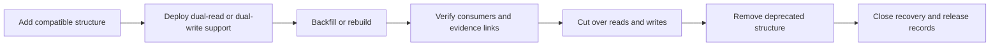

<!-- [KFM_META_BLOCK_V2]
doc_id: kfm://doc/migrations-readme
title: migrations/ — Governed Database, Schema, Data, Graph, and Recovery Change Root
type: README; directory-readme; canonical-migrations-root; change-control-index
version: v1.1
status: draft; repository-grounded; canonical-root; documentation-heavy; executable-runner-unestablished; rollback-pairing-unverified; non-release; non-publication
owner: NEEDS VERIFICATION — CODEOWNERS routes /migrations/ to @bartytime4life; accepted migration, database, schema, data, graph, and release stewardship plus required independent approval were not established
created: 2026-07-03
updated: 2026-07-23
supersedes: v1 documentation at the same path; no migration payload, database state, schema, data, graph, runtime, release, or publication behavior is superseded
prepared_under_prompt: KFM Markdown Modernization & GitHub Documentation Implementation Agent v4.0.0
policy_label: repository-facing; migrations; change-control; rollback-aware; forward-fix-aware; evidence-first; fail-closed; non-publisher
current_path: migrations/README.md
owning_root: migrations/
responsibility: own governed migration plans, executable migration payloads, adoption sequencing, validation evidence, and paired recovery posture without becoming schema, contract, policy, lifecycle-data, release, or publication authority
truth_posture: >
  CONFIRMED same-path target; Directory Rules assignment of migrations/ to database, schema, data, graph, and rollback change control;
  five directly observed child README lanes; CODEOWNERS routing; current root README; current child-lane documentation; and absence of
  migration payloads in bounded repository search / PROPOSED migration record contract, applicability-aware state model, execution packet,
  compatibility matrix, deterministic identity rules, validation orchestration, and future machine register / UNKNOWN exhaustive recursive
  migration inventory, live database or graph engines, migration runner, environment state, backups, applied versions, production history,
  execution receipts, rollback drills, and consumer adoption / NEEDS VERIFICATION paired rollback coverage, same-PR enforcement, ordering
  convention, branch/ruleset enforcement, dedicated migration CI, steward assignments, and release integration
evidence_snapshot:
  repository: bartytime4life/Kansas-Frontier-Matrix
  base_ref: main
  base_commit: 936eac6d5b30471dd5d663ba61d34933dc2cbe8b
  target_prior_blob: 0485947aa72726bdde043a2570c2e28d2714f420
  directory_rules_source: attached Directory Rules and current repository doctrine
  codeowners_status: /migrations/ routes through repository default ownership to @bartytime4life
  child_lanes:
    - database
    - schema
    - data
    - graph
    - rollback
  inspection_method: exact GitHub file reads, bounded repository search, PR overlap search, and current commit inspection; no live database, graph store, migration runner, backup system, deployment environment, or recursive Git tree was inspected
related:
  - ../docs/doctrine/directory-rules.md
  - ../docs/runbooks/ROLLBACK_RUNBOOK.md
  - ../docs/runbooks/
  - ../docs/governance/SEPARATION_OF_DUTIES.md
  - ../docs/registers/DRIFT_REGISTER.md
  - ../contracts/README.md
  - ../schemas/README.md
  - ../schemas/contracts/v1/
  - ../policy/README.md
  - ../tests/README.md
  - ../tools/validators/README.md
  - ../data/README.md
  - ../data/receipts/
  - ../data/proofs/
  - ../release/README.md
  - ../apps/governed-api/
  - ../apps/explorer-web/
  - ../packages/
  - ./database/README.md
  - ./schema/README.md
  - ./data/README.md
  - ./graph/README.md
  - ./rollback/README.md
  - ../.github/CODEOWNERS
notes:
  - "v1.1 is a same-path documentation-only modernization grounded in the current repository."
  - "The first twelve H2 sections follow the Directory Rules folder-README contract."
  - "Five migration README lanes are confirmed, but an executable migration runner, dedicated migration workflow, applied-version ledger, and verified rollback pairing were not established."
  - "Static badges summarize inspected repository state only; they are not migration execution, approval, rollback, release, or publication proof."
[/KFM_META_BLOCK_V2] -->

<a id="top"></a>

# `migrations/` — Governed Database, Schema, Data, Graph, and Recovery Change Root

> **One-line purpose.** `migrations/` governs deliberate changes to persisted structure, machine compatibility, data state, graph topology, and recovery posture so every consequential migration is reviewable, validated, auditable, and paired with rollback or a documented forward fix.

[](#status)
[](#authority-level)
[](#current-bounded-topology)
[](#validation)
[](#recovery-and-forward-fix-contract)
[](#authority-level)
[](#last-reviewed)

> [!IMPORTANT]
> **Safe current conclusion:** `migrations/` and its five documented lanes exist. The repository currently provides detailed migration and rollback guidance, but bounded inspection did **not** establish concrete migration payloads, a selected migration runner, a dedicated migration CI gate, an applied-version ledger, verified one-to-one rollback coverage, or production execution history.

> [!CAUTION]
> A migration README, SQL example, branch, pull request, successful parse, or green unrelated workflow does not prove that a migration is safe, approved, applied, reversible, release-compatible, or reflected in a live environment. Execution claims require the payload, target state, preflight, observed run evidence, post-checks, and recovery evidence.

> [!WARNING]
> `migrations/rollback/` is an engineering recovery lane. It does not replace `release/rollback_cards/`, correction notices, withdrawal records, database backups, snapshots, or incident-response records. These artifacts may refer to one another, but they remain distinct authorities.

**Quick navigation:** [Purpose](#purpose) · [Authority](#authority-level) · [Status](#status) · [Belongs](#what-belongs-here) · [Exclusions](#what-does-not-belong-here) · [Inputs](#inputs) · [Outputs](#outputs) · [Validation](#validation) · [Review](#review-burden) · [Related](#related-folders) · [ADRs](#adrs) · [Last reviewed](#last-reviewed) · [Topology](#current-bounded-topology) · [Classification](#migration-classification) · [Packet](#minimum-migration-packet) · [States](#migration-work-state-model) · [Compatibility](#compatibility-and-adoption) · [Recovery](#recovery-and-forward-fix-contract) · [Done](#definition-of-done) · [Open verification](#open-verification-register)

---

<a id="root-contract"></a>
<a id="migration-lifecycle"></a>
<a id="lane-contracts"></a>
<a id="inputs-and-outputs"></a>
<a id="open-verification"></a>

## Purpose

`migrations/` is KFM's canonical responsibility root for **governed state-change mechanics** affecting:

- database structure and database-managed behavior;
- schema and contract compatibility transitions;
- data backfills, repairs, remaps, and rebuilds;
- graph or triplet topology and identity changes;
- rollback, reversal, disablement, and forward-fix planning.

The root exists because durable system change can alter identity, meaning, evidence links, lifecycle state, public behavior, or recovery options even when only a small script changes.

Every migration must answer:

1. What exact state changes?
2. Why is the change necessary?
3. Which authority defines the intended meaning or shape?
4. Which systems, producers, consumers, and releases are affected?
5. Which preconditions and invariants must hold?
6. How can the change be previewed or dry-run?
7. Which evidence proves the result?
8. How can the system recover safely?
9. Which residual risks remain?
10. Who reviewed, executed, and verified it?

The lifecycle remains:

```text
RAW -> WORK / QUARANTINE -> PROCESSED -> CATALOG / TRIPLET -> PUBLISHED
```

A migration may support a governed transition. It is not itself lifecycle promotion, release approval, publication, correction approval, or evidence of external truth.

## Authority level

**Canonical responsibility root for migration mechanics and recovery planning; subordinate to the authorities that define meaning, shape, admissibility, evidence, lifecycle state, and release.**

| Question | Controlling authority |
|---|---|
| Where migration materials belong | Directory Rules, accepted placement ADRs, then this README |
| What an object means | `contracts/` |
| What machine shape is valid | `schemas/` |
| What policy permits | `policy/` |
| What source or evidence supports a change | source registry, `EvidenceRef`, `EvidenceBundle`, receipts, proofs |
| What data phase owns the payload | `data/<phase>/` |
| Whether a release is approved | `release/` and applicable promotion/review records |
| How a migration is executed | selected runner, migration payload, environment controls, and runbook |
| How engineering recovery works | `migrations/rollback/` plus applicable backup/runbook evidence |
| How public release rollback or correction works | `release/rollback_cards/`, correction and withdrawal records |

`migrations/` may carry scripts, plans, compatibility matrices, validation summaries, and recovery instructions. It must not independently redefine any stronger authority above.

## Status

| Surface | Current evidence | Status |
|---|---|---|
| Root README | Present and updated in place | **CONFIRMED** |
| `database/` lane README | Present | **CONFIRMED — documentation** |
| `schema/` lane README | Present | **CONFIRMED — documentation** |
| `data/` lane README | Present | **CONFIRMED — documentation** |
| `graph/` lane README | Present | **CONFIRMED — documentation** |
| `rollback/` lane README | Present | **CONFIRMED — documentation** |
| Concrete migration payloads | Not established in bounded search | **UNKNOWN / NEEDS VERIFICATION** |
| Selected database migration runner | Not established | **UNKNOWN** |
| Selected schema/data/graph migration executors | Not established | **UNKNOWN** |
| Dedicated migration validation workflow | Not established | **NEEDS VERIFICATION** |
| Applied migration/version ledger | Not established | **NEEDS VERIFICATION** |
| One-to-one rollback or forward-fix pairing | Required by doctrine; coverage not recursively verified | **NEEDS VERIFICATION** |
| Live database, graph store, or deployment environment | Not inspected | **UNKNOWN** |
| Production execution and rollback history | Not inspected | **UNKNOWN** |
| GitHub ownership routing | Repository defaults route to `@bartytime4life` | **CONFIRMED routing; stewardship unverified** |
| Release or publication authority | Not owned by this root | **DENIED by boundary** |

The root is therefore **documentation-heavy and implementation-unverified**. Treat lane examples as contract guidance, not as evidence that a corresponding executor or payload exists.

## What belongs here

Use `migrations/` when the primary responsibility is a governed transformation of persisted structure or state.

Accepted material includes:

- migration README files and lane contracts;
- SQL or engine-native migration files;
- safe, reviewable migration scripts or query fragments;
- schema/contract compatibility plans;
- producer and consumer adoption matrices;
- data backfill, repair, normalization, remap, or rebuild plans;
- graph/triplet topology and identity migration plans;
- preflight, dry-run, canary, validation, and post-check definitions;
- sanitized execution summaries and migration receipts;
- dependency and rollout sequencing;
- rollback, disablement, restore, or forward-fix records;
- migration manifests that bind payloads, checksums, target state, dependencies, and recovery references;
- drift and correction follow-up notes.

A file belongs here only when **migration mechanics are its primary responsibility**. A schema remains under `schemas/`; a release rollback card remains under `release/`; lifecycle data remains under `data/`.

## What does not belong here

Do not use `migrations/` as a parallel authority, data store, backup system, release root, or secrets store.

The following do not belong here:

- canonical JSON Schemas or machine contracts;
- human semantic contract authority;
- policy bundles or admissibility decisions;
- source descriptors, canonical evidence, or source payloads;
- RAW, WORK, QUARANTINE, PROCESSED, CATALOG, TRIPLET, or PUBLISHED datasets;
- database or graph dumps, bulk exports, backups, snapshots, WAL archives, or restore images;
- release manifests, promotion decisions, release rollback cards, correction notices, or withdrawal notices;
- production credentials, DSNs, connection strings, tokens, private keys, certificates, kubeconfigs, or `.env` files;
- unredacted row samples, private topology, sensitive logs, or incident working material;
- generated public artifacts such as PMTiles, COGs, GeoParquet, tiles, reports, or API payloads;
- destructive scripts lacking scope, preconditions, validation, recovery, review, and audit fields;
- one-off manual commands represented as authoritative migration history;
- AI-generated remaps, inferred graph edges, or transformations promoted without evidence and review.

When restricted data, a secret, dump, or backup lands here, stop normal work, isolate the material, rotate or revoke access where necessary, and follow the appropriate incident and correction process.

## Inputs

A migration packet may consume:

| Input | Why it is needed |
|---|---|
| Accepted ADR or explicit scoped decision | Establishes why the architecture or compatibility transition is allowed |
| Semantic contract | Defines intended meaning |
| Machine schema | Defines intended shape |
| Policy decision or sensitivity review | Constrains handling and exposure |
| Issue, defect, validation failure, or correction request | Establishes reason and scope |
| Evidence or receipt references | Grounds consequential remaps or repairs |
| Current state inventory | Defines what will change |
| Producer/consumer inventory | Defines adoption order |
| Release and rollback context | Defines public impact and recovery |
| Backup/snapshot capability | Supports recovery where applicable |
| Test fixtures and invariant checks | Defines expected success and failure states |
| Environment and runner contract | Defines how execution is performed safely |

Inputs must be commit-, version-, hash-, release-, or environment-identified where material. “Latest,” “current database,” or “all records” is not sufficiently precise for a consequential migration.

## Outputs

A migration packet may produce:

- reviewed migration plans;
- migration payloads and checksums;
- compatibility and dependency matrices;
- preflight and dry-run reports;
- target-state and invariant reports;
- execution or adoption receipts;
- post-run verification reports;
- rollback or forward-fix records;
- drift, correction, and documentation updates;
- references to release-impact review.

These outputs remain bounded:

| Output | What it proves | What it does not prove |
|---|---|---|
| Migration plan | Intended change and review surface exist | Execution occurred |
| Parsed SQL/script | Syntax may be acceptable to a parser | Target compatibility or safety |
| Dry run | Preview completed in a named context | Production outcome |
| Execution receipt | A named action was attempted or completed | External truth or release approval |
| Post-check report | Named invariants passed in a named context | Universal correctness |
| Rollback record | Recovery instructions exist | Rollback was rehearsed or will work |
| Git commit / PR | Repository bytes changed | Migration was applied, approved, released, or published |

`migrations/` never publishes KFM data by itself.

## Validation

Validation is **migration-class-specific**. A single generic green check is insufficient.

### Required source checks

Every migration change should verify:

- target path and lane;
- migration and recovery record pairing;
- stable identifier and ordering;
- affected object inventory;
- evidence and authority basis;
- dependency and rollout order;
- compatibility class;
- rights, sensitivity, and public-impact posture;
- preflight and post-check definitions;
- secret and restricted-content absence;
- rollback or forward-fix plan;
- documentation and release impact.

### Executable checks by class

| Migration class | Minimum executable evidence |
|---|---|
| Database | Engine parse or validation, transaction/preflight where supported, lock/downtime assessment, before/after object checks |
| Schema | Valid and invalid fixtures, producer/consumer compatibility tests, enum/field crosswalk checks |
| Data | Deterministic input selection, row/feature counts, identity and provenance checks, dry-run diff, sensitivity checks |
| Graph/triplet | Node/edge counts, referential closure, evidence-link preservation, duplicate/cycle/orphan checks, projection rebuild proof |
| Recovery | Preconditions, reversal/disablement logic, restore or forward-fix validation, post-recovery invariant checks |

### Current repository boundary

No repository-native migration target such as `make migrations-validate`, dedicated migration workflow, selected runner, or applied-version register was established in the bounded inspection. Until such a surface exists and is verified:

- do not advertise a canonical migration command;
- do not use unrelated schema, contract, policy, or release checks as migration proof;
- record lane-specific commands in the migration packet;
- mark unexecuted checks `NOT RUN`;
- keep shared or release-relevant execution blocked until the necessary evidence exists.

## Review burden

Review scales with consequence, not file extension.

| Change class | Minimum review burden |
|---|---|
| README-only wording with no behavior change | Docs steward or migration steward |
| Database structure, index, constraint, view, function, role, or permission | Database owner + migration reviewer |
| Schema or semantic compatibility transition | Schema owner + contract owner + affected producer/consumer owners |
| Data backfill, repair, remap, or rebuild | Data owner + affected domain owner + migration reviewer |
| Graph/triplet identity or topology change | Graph owner + evidence owner + affected domain owner |
| Recovery record | Affected lane owner + independent recovery reviewer where practical |
| Public API, map, tile, export, or release impact | Governed API/UI owner + release reviewer + affected domain owner |
| Rights, living-person, DNA, archaeology, rare-species, infrastructure, or restricted geometry | Policy/sensitivity reviewer + domain steward |
| Credentials, access, or incident recovery | Security reviewer + affected system owner |
| Destructive, irreversible, or forward-fix-only change | Migration owner + affected owners + explicit risk acceptance |
| Cross-lane or multi-environment change | Owners for every affected responsibility and environment |

CODEOWNERS routing is not proof that the required review occurred. Approval, execution, and verification should be separated for high-impact migrations when repository maturity supports it.

## Related folders

| Location | Relationship |
|---|---|
| [`database/`](./database/README.md) | Database structure and database-managed behavior |
| [`schema/`](./schema/README.md) | Machine-shape and semantic compatibility transitions |
| [`data/`](./data/README.md) | Data-state backfills, repairs, remaps, and rebuilds |
| [`graph/`](./graph/README.md) | Graph/triplet topology, identity, and evidence-link changes |
| [`rollback/`](./rollback/README.md) | Engineering recovery, disablement, and forward-fix records |
| [`../contracts/`](../contracts/README.md) | Semantic meaning |
| [`../schemas/`](../schemas/README.md) | Machine shape |
| [`../policy/`](../policy/README.md) | Admissibility, rights, sensitivity, and obligations |
| [`../data/`](../data/README.md) | Lifecycle payloads and records |
| [`../tests/`](../tests/README.md) | Representative enforceability and regression proof |
| [`../tools/validators/`](../tools/validators/README.md) | Repository-wide validation tooling |
| [`../release/`](../release/README.md) | Release decisions, correction, withdrawal, and public rollback |
| [`../docs/runbooks/`](../docs/runbooks/README.md) | Operator procedures and recovery drills |
| [`../docs/governance/SEPARATION_OF_DUTIES.md`](../docs/governance/SEPARATION_OF_DUTIES.md) | Review and duty-separation guidance |

## ADRs

A migration does not always require an ADR. An ADR is required when the migration:

- adds, removes, or renames a canonical root;
- creates a parallel schema, contract, policy, source, registry, receipt, proof, release, or lifecycle authority;
- changes the canonical schema-home or responsibility split;
- changes a public contract or trust-membrane boundary materially;
- splits, merges, or redefines a lifecycle phase;
- standardizes a cross-repository migration state or identity contract;
- introduces a non-reversible architectural decision whose tradeoffs must persist;
- intentionally bends a KFM invariant.

A migration record can implement an accepted decision. It cannot make its own proposed ADR accepted.

## Last reviewed

| Field | Value |
|---|---|
| Last reviewed | 2026-07-23 |
| Review status | Repository-grounded v1.1 documentation update |
| Current maturity | Five documented lanes; executable runner, CI gate, payload inventory, applied ledger, and recovery coverage unverified |
| Next review trigger | First concrete migration payload, selected runner, dedicated migration workflow, applied-version ledger, rollback rehearsal, destructive change, or public-impacting migration |

---

## Current bounded topology

The confirmed documentation topology is:

```text
migrations/
├── README.md
├── database/
│   └── README.md
├── schema/
│   └── README.md
├── data/
│   └── README.md
├── graph/
│   └── README.md
└── rollback/
    └── README.md
```

This is a **bounded named-path inventory**, not a recursive tree attestation. Bounded repository search did not establish executable payloads beneath these lanes.

### Lane index

| Lane | Primary responsibility | Must preserve |
|---|---|---|
| `database/` | DDL, indexes, constraints, views, functions, permissions, storage behavior | Lock analysis, least privilege, compatibility, recovery |
| `schema/` | Schema/contract version transitions and producer/consumer adoption | Meaning/shape authority split, fixtures, compatibility |
| `data/` | Backfill, repair, normalization, remap, rebuild | Stable identity, provenance, lifecycle phase, sensitivity |
| `graph/` | Node/edge/triplet topology, identity, relationship and projection changes | Evidence links, referential closure, non-sovereign projection |
| `rollback/` | Reversal, disablement, restore coordination, or forward-fix planning | Paired migration identity, preconditions, post-recovery checks |

## Migration classification

Classify before selecting a lane.

| Primary change | Lane | Common adjacent changes |
|---|---|---|
| Table, index, constraint, function, role, extension, storage engine | `database/` | Schema, app, data, release |
| JSON/DTO field, enum, requiredness, semantic compatibility | `schema/` | Contracts, validators, fixtures, producers/consumers |
| Record values, IDs, crosswalks, lifecycle placement, derived rebuild | `data/` | Database, schema, evidence, release |
| Node/edge/triplet identity, topology, projection, graph index | `graph/` | Data, evidence, catalog, API |
| Reversal, disablement, restore, compensating change | `rollback/` | Paired primary migration and runbook |
| Multiple equally primary responsibilities | Split into coordinated lane records | One umbrella coordination section may link them |

Do not choose a lane merely because a file uses SQL or Python. Choose it by the **primary state transition**.

## Minimum migration packet

A shared-state or release-relevant migration should have a complete packet before execution.

```yaml
migration_id: mig-<stable-id>
title: <short purpose>
status: PROPOSED
class: database | schema | data | graph | recovery | coordinated
owner: NEEDS VERIFICATION
authority_refs: []
reason_refs: []
base_state:
  revision: <commit-or-release>
  environment: <named-environment>
  state_id: <version-or-ledger-ref>
target_state:
  description: <intended state>
  state_id: <version-or-ledger-ref>
payloads:
  - path: <migration payload>
    sha256: <digest>
dependencies: []
affected:
  producers: []
  consumers: []
  schemas: []
  contracts: []
  policies: []
  datasets: []
  graph_families: []
preconditions: []
dry_run:
  command_or_workflow: NEEDS VERIFICATION
  evidence_ref: null
validation:
  pre_checks: []
  post_checks: []
compatibility:
  class: backward-compatible | staged | breaking | forward-fix-only
  window: null
recovery_ref: migrations/rollback/<paired-id>.md
release_impact: none | internal | candidate | public
sensitivity_impact: none | reviewed | hold
execution:
  runner: NEEDS VERIFICATION
  receipt_ref: null
review:
  required_roles: []
  records: []
```

This is a **PROPOSED documentation contract**, not a verified repository schema. Standardizing it as machine shape requires placement under `schemas/` and appropriate tests.

## Migration work-state model

Keep work state separate from runtime, policy, release, and truth labels.

| Work state | Meaning |
|---|---|
| `PROPOSED` | Packet exists; execution is not authorized |
| `REVIEW_READY` | Scope, dependencies, checks, and recovery packet are complete |
| `APPROVED_FOR_TARGET` | Required review exists for a named target environment |
| `PRECHECKED` | Preconditions and dry-run evidence passed |
| `EXECUTING` | Runner is applying the migration |
| `APPLIED` | Payload completed; post-checks still pending |
| `VERIFIED` | Named post-checks passed |
| `COMPLETED` | Adoption, docs, receipts, and follow-up are closed |
| `BLOCKED` | Named prerequisite is unresolved |
| `FAILED` | Execution or post-check failed |
| `ROLLED_BACK` | Prior safe state was restored or migration disabled |
| `FORWARD_FIXED` | A compensating migration restored safety because reversal was unsafe |
| `SUPERSEDED` | A later governed migration replaces this packet |

These states are **PROPOSED** until standardized by an accepted contract. Do not confuse them with `ANSWER / ABSTAIN / DENY / ERROR`, policy outcomes, or release states.

## Compatibility and adoption

Migration safety often depends more on adoption order than on payload syntax.

### Compatibility classes

| Class | Requirement |
|---|---|
| Backward-compatible | Old and new producers/consumers can coexist |
| Expand-and-contract | Add compatible shape, migrate usage, then remove old shape |
| Staged breaking | Explicit compatibility window and coordinated cutover |
| Rebuildable derivative | Canonical inputs remain; derived output can be deterministically rebuilt |
| Destructive | Data or meaning may be lost; heightened review and recovery evidence required |
| Forward-fix-only | Reversal would be less safe than a compensating migration; reason and guardrails required |

### Expand-and-contract sequence


```mermaid
flowchart LR
    A[Add compatible structure] --> B[Deploy dual-read or dual-write support]
    B --> C[Backfill or rebuild]
    C --> D[Verify consumers and evidence links]
    D --> E[Cut over reads and writes]
    E --> F[Remove deprecated structure]
    F --> G[Close recovery and release records]
```

Every step must name its target revision or environment and its failure behavior.

## Recovery and forward-fix contract

Every consequential migration must identify one of these recovery classes:

| Recovery class | Meaning |
|---|---|
| `REVERSIBLE` | A tested reversal can restore the prior approved state |
| `DISABLEABLE` | New behavior can be turned off while state remains |
| `RESTORABLE` | Backup or snapshot restoration is the recovery path |
| `COMPENSATING` | A governed corrective migration repairs state |
| `FORWARD_FIX_ONLY` | Reversal is unsafe; an explicit compensating path is the only approved option |
| `NON_RECOVERABLE` | Not acceptable for shared or release-relevant state absent exceptional documented governance |

A recovery record should include:

- paired migration ID and digest;
- recovery class and reason;
- target environment and base state;
- activation conditions;
- required backup or snapshot references;
- reversal, disablement, restore, or compensation steps;
- irreversible effects;
- release and public-cache impact;
- pre- and post-recovery checks;
- operator and reviewer requirements;
- rehearsal evidence or `NOT RUN`;
- correction, incident, or release references where applicable.

A rollback file existing in Git is not proof that recovery works.

## Definition of done

A migration is complete only when all applicable items are closed:

- [ ] Stable migration identity and ordering are recorded.
- [ ] Primary lane and Directory Rules basis are correct.
- [ ] Intended meaning and machine shape point to controlling authorities.
- [ ] Base and target state are pinned.
- [ ] Payloads and checksums are recorded.
- [ ] Producers, consumers, data, graph, API, UI, and release impacts are inventoried.
- [ ] Compatibility and rollout order are explicit.
- [ ] Rights, sensitivity, and public impact are reviewed.
- [ ] Recovery class and paired record exist.
- [ ] Preflight or dry run completed, or `NOT RUN` is justified.
- [ ] Required reviews are recorded.
- [ ] Execution receipt identifies target, runner, revision, and outcome.
- [ ] Post-migration invariants passed.
- [ ] Recovery was rehearsed where risk requires it, or the gap remains visible.
- [ ] Documentation, deprecation, correction, and release follow-up are complete.
- [ ] Rollback target or forward-fix lineage is retained.
- [ ] No migration output is misrepresented as publication authority.

## No-loss ledger

| v1 material | v1.1 disposition |
|---|---|
| Canonical migration-root purpose | Preserved and sharpened |
| Lifecycle invariant | Preserved |
| Five migration lanes | Preserved and directly indexed |
| Rollback-entry requirement | Preserved; coverage now explicitly unverified |
| Database/schema/data/graph lane distinctions | Preserved and expanded |
| Sensitive-domain fail-closed posture | Preserved |
| Inputs and outputs | Preserved with authority boundaries |
| Validation checklist | Expanded by migration class |
| Review burden | Expanded by consequence and separation of duties |
| Open verification questions | Preserved and extended |
| Original migration lifecycle states | Reframed as proposed work-state model to avoid false standardization |
| Owner placeholders | Replaced with verified routing plus stewardship uncertainty |
| Publication boundary | Preserved and clarified |
| Rollback versus release rollback | Clarified as separate object families |

## Open verification register

- [ ] Obtain a recursive tracked inventory of `migrations/`.
- [ ] Confirm whether any executable migration payloads exist beyond the five README lanes.
- [ ] Select and document database migration runner or explicitly declare no database runner.
- [ ] Confirm schema, data, and graph migration executor conventions.
- [ ] Define canonical stable migration ID and filename ordering.
- [ ] Verify one-to-one migration-to-recovery pairing.
- [ ] Decide whether paired recovery records must land in the same pull request.
- [ ] Define a machine-readable migration packet schema if justified.
- [ ] Define an applied-version or migration-state ledger and owning root.
- [ ] Add dedicated migration validation orchestration only after runner and fixtures are selected.
- [ ] Define no-network valid and invalid fixtures for each migration class.
- [ ] Verify backup, snapshot, restore, and retention capabilities by environment.
- [ ] Define lock, downtime, and maintenance-window classes.
- [ ] Define expand-and-contract compatibility policy.
- [ ] Define producer/consumer adoption evidence and deprecation windows.
- [ ] Define graph/triplet invariant and evidence-link checks.
- [ ] Define data-remap identity, provenance, and sensitivity checks.
- [ ] Define migration execution receipt placement and schema.
- [ ] Define recovery rehearsal expectations by risk class.
- [ ] Confirm release-review triggers for public API, map, tile, export, and published-artifact impact.
- [ ] Confirm security/incident handoff for failed or exposure-relevant migrations.
- [ ] Confirm accountable stewards and independent approval requirements.
- [ ] Verify branch protection or ruleset requirements for migration paths.
- [ ] Formalize host-render validation for this README.
- [ ] Revisit this README after the first concrete migration packet is implemented.

## Changelog

### v1.1 — 2026-07-23

- Reorganized the root README to the Directory Rules folder contract.
- Grounded status in five confirmed child README lanes.
- Removed unsupported owner certainty.
- Distinguished documentation, payload, runner, applied state, and release authority.
- Added migration classification, packet, work-state, compatibility, recovery, and definition-of-done models.
- Marked executable tooling, payload depth, rollback coverage, and production history as unverified.
- Preserved legacy anchors and the v1 rollback identity.

### v1 — 2026-07-03

- Established the database, schema, data, graph, and rollback migration root contract.
