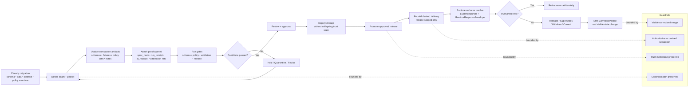

<!-- [KFM_META_BLOCK_V2]
doc_id: kfm://doc/NEEDS-VERIFICATION
title: migrations
type: standard
version: v1
status: draft
owners: NEEDS VERIFICATION
created: YYYY-MM-DD
updated: YYYY-MM-DD
policy_label: public
related: [../README.md, ../contracts/README.md, ../schemas/README.md, ../scripts/README.md, ../tests/README.md, ../policy/README.md, ../.github/workflows/README.md, NEEDS-VERIFICATION:../configs/, NEEDS-VERIFICATION:../infra/]
tags: [kfm, migrations, storage-evolution, proof-objects]
notes: [target path inferred from the supplied draft as migrations/README.md; strongest current-session support is attached doctrine plus document-reported repo-root evidence that includes a migrations surface, but no mounted checkout or live branch inventory was directly reverified]
[/KFM_META_BLOCK_V2] -->

# migrations

Governed change control for durable KFM state, contracts, release seams, and correction lineage.

> **Status:** experimental  
> **Document lifecycle:** draft  
> **Authority posture:** supporting directory contract  
> **Owners:** **NEEDS VERIFICATION**  
>        
> **Quick jump:** [Scope](#scope) · [Repo fit](#repo-fit) · [Accepted inputs](#accepted-inputs) · [Exclusions](#exclusions) · [Directory tree](#directory-tree) · [Quickstart](#quickstart) · [Usage](#usage) · [Migration posture](#migration-posture) · [Contracts & proof objects](#contracts--proof-objects) · [Diagram](#diagram) · [Tables](#tables) · [Task list](#task-list--definition-of-done) · [FAQ](#faq) · [Appendix](#appendix--verification-notes)

> [!IMPORTANT]
> This README stays **evidence-bounded**. The current session exposed a PDF-rich corpus, not a mounted branch checkout, schema registry, workflow YAML inventory, test run, deployment manifest set, dashboard, or runtime trace. Where this file names repo structure or operational machinery, it does so only at the strongest truthful level.

> [!WARNING]
> In KFM, migration is not merely “run the database script.” A migration can change storage, contracts, policy behavior, release state, derived rebuild obligations, runtime trust behavior, rollback posture, or visible correction lineage.

> [!NOTE]
> **Baseline determination.** This README keeps the supplied draft’s role and structure, but tightens it against the freshest directly attached whole-system KFM manuals: the 11 April 2026 successor working edition as the main doctrinal spine, with the March 2026 canonical master reference and architecture/governance/delivery compendium used to sharpen contract language, truth posture, and document-reported repo-root signals.

## Scope

`migrations/` is the directory contract for **governed change** to durable KFM structures and trust-bearing artifacts.

That includes schema and storage work, but it is intentionally broader. In the strongest attached KFM doctrine, migration spans schema evolution, data repair and replay, contract and envelope changes, policy and registry changes, release and promotion consequences, projection rebuild obligations tied to released scope, rollback, supersession, withdrawal, and visible correction.

### Truth markers used in this guide

| Marker | Meaning here |
|---|---|
| **CONFIRMED** | Directly supported by the attached KFM corpus or by current-session document evidence |
| **INFERRED** | Strongly implied by the corpus, but not directly reverified as mounted branch or runtime fact |
| **PROPOSED** | Recommended target-state shape or workflow consistent with doctrine, but not verified as current implementation |
| **UNKNOWN** | Not supported strongly enough in the current session to present as settled fact |
| **NEEDS VERIFICATION** | Explicit placeholder or branch-specific fact that should be checked before merge |

### What this directory is for

This surface should make migration work:

- reviewable
- staged and reversible
- explicit about compatibility seams
- linked to proof objects
- honest about rollback, supersession, withdrawal, and correction
- traceable across schema, data, contracts, policy, release, and runtime consequences

### What migration must preserve

| Invariant | Why it matters here |
|---|---|
| `Source -> RAW -> WORK / QUARANTINE -> PROCESSED -> CATALOG -> PUBLISHED` | Migration must not shortcut the canonical truth path. |
| Trust membrane | Public and normal UI surfaces still go through governed APIs, policy evaluation, and evidence resolution. |
| Authoritative vs derived split | Search, graph, vector, tile, scene, cache, and summary layers stay rebuildable unless explicitly promoted. |
| Promotion as governed state change | Deployment success is not enough; publication requires release and proof state. |
| Visible correction lineage | Rollback, supersession, withdrawal, narrowing, and replacement must remain inspectable. |

[Back to top](#migrations)

## Repo fit

**Path:** `migrations/README.md`  
**Role in repo:** README-like directory contract for migration-bearing change.

### Repo fit summary

| Aspect | Guidance |
|---|---|
| **Path** | `migrations/README.md` *(target path inferred from the supplied draft; document-reported repo-root `migrations/` surface exists, but current branch inventory is not mounted here)* |
| **Primary audience** | Maintainers, platform engineers, data engineers, reviewers, and stewards |
| **Repo fit** | This README governs how migration-bearing work should be packaged, reviewed, and verified without overclaiming mounted automation |
| **Upstream dependencies** | contracts, schemas, policy bundles, fixtures, review logic, release state, and proof-object conventions |
| **Downstream consequences** | release manifests, projection rebuilds, exports, `EvidenceBundle` resolution, `RuntimeResponseEnvelope` behavior, and correction visibility |
| **Update trigger** | Any change to authoritative storage, contracts, policy meaning, proof objects, promotion rules, or correction behavior |
| **Adjacent links** | [repo root][repo-root] · [contracts][contracts-readme] · [schemas][schemas-readme] · [scripts][scripts-readme] · [tests][tests-readme] · [policy][policy-readme] · [workflow docs][workflows-readme] |
| **Current evidence limit** | No mounted checkout, workflow inventory, validator output, or emitted proof objects were directly surfaced in this session |

### Why this directory matters in KFM

Migration in KFM is constrained by earlier law:

- the canonical path must remain intact
- the trust membrane must remain intact
- authoritative truth must remain stronger than derived layers
- public-safe release must remain proof-bearing
- users must see honest states when a cutover fails, narrows scope, becomes stale, is generalized, or is superseded later

That makes `migrations/` more than a convenience folder. It is where change seams become inspectable.

### Current document-reported repo signal

The strongest current-session repo-structure evidence is still **document-reported**, not mounted. That distinction matters.

| Signal | Current status | Practical consequence |
|---|---|---|
| `migrations/` appears in document-reported repo-root inventory | **CONFIRMED** *(document-reported root signal)* | Treat `migrations/` as a plausible top-level surface for this README, but verify actual branch contents before merge. |
| `configs/`, `scripts/`, and `examples/` are shown adjacent to `migrations/` in the same document-reported root inventory | **CONFIRMED** *(document-reported root signal)* | Relative references to nearby repo surfaces are reasonable, but should still be rechecked against the branch under review. |
| Broader repo-root surfaces such as `apps/`, `packages/`, `contracts/`, `policy/`, `data/`, `infra/`, `docs/`, `tools/`, and `tests/` are document-reported | **CONFIRMED** *(document-reported root signal)* | This README can speak about migration consequences across those surfaces without claiming specific subpaths or implementations. |
| Exact files inside `migrations/` on the current branch | **NEEDS VERIFICATION** | Do not imply packet directories, SQL inventory, or helper scripts exist until branch inspection proves them. |
| Live workflow YAML inventory, merge-blocking checks, starter schema registry, emitted proof packs, and runtime enforcement behavior | **UNKNOWN** | Keep behavior-significant claims proportional and verify before merge. |
| Single authoritative schema home between `contracts/` and `schemas/` | **NEEDS VERIFICATION** | Avoid amplifying a parallel schema universe until the branch names the authoritative home. |

> [!IMPORTANT]
> This is the most important repo-fit distinction in the file: **document-reported root signal is not the same as mounted branch proof**.

[Back to top](#migrations)

## Accepted inputs

The following belong here when they are part of **reviewable, governed migration work**.

| Input class | Examples | Why it belongs here | Minimum companion context |
|---|---|---|---|
| Schema and storage evolution | DDL, indexes, constraints, partition changes, canonical table/view changes | Durable structure changed | plan, verify path, rollback posture |
| Data repair and backfill | ID remaps, canonical field repair, temporal correction, replay, reconciliation | Existing governed state is transformed | source basis, validation, correction implications |
| Contract or envelope migration | object shape changes, additive fields, runtime envelope shifts, deprecation bridges | Public/runtime meaning changes | contract delta, compatibility window, fixture updates |
| Policy or registry migration | reason-code additions, obligation-code changes, publication-class shifts | Runtime and release outcomes can change | policy diff, tests, steward review path |
| Release and cutover notes | promotion effects, projection rebuild expectations, stale-state handling | Deployment and publication must stay distinct | release notes, post-deploy verify, rollback/correction note |
| Compatibility seams | dual-read, dual-write, adapters, bridge layers, temporary facades | Temporary ambiguity must be bounded and retired | stop rule, parity note, removal plan |
| Correction packets | rollback, supersession, withdrawal, narrowing, replacement notices | KFM requires visible recovery, not silent overwrite | affected surfaces, public note, rebuild refs |
| Migration-local documentation | packet README, plan, verify steps, rollback runbook | Reviewers need intent and operator guidance | concise purpose, scope, gates, and open unknowns |

### Minimum bar for anything added here

A migration packet should make all of the following obvious:

1. what changed
2. whether the change touches authoritative state, derived state, or both
3. which proof objects or fixtures changed with it
4. what the compatibility window is
5. what the rollback or correction path is
6. what users would see if the change fails, narrows scope, or is superseded later

## Exclusions

The following do **not** belong in `migrations/`.

| Exclusion | Why it stays out | Where it goes instead |
|---|---|---|
| Ad hoc analyst SQL | Not durable governed migration history | notebooks, scratch analysis, issue discussion |
| Free-standing helper scripts | Not every automation change is migration-bearing | [scripts][scripts-readme], tooling docs |
| UI-only work with no trust-state seam | Product work is not automatically migration work | app or surface docs |
| Standalone policy prose with no executable consequence | KFM policy must stay machine-checkable and testable | [policy][policy-readme], registries, or contract/schema surfaces |
| Duplicate copies of canonical schemas | `migrations/` should reference the authoritative schema home, not create a shadow schema tree | chosen schema home (`contracts/`, `schemas/`, or ADR-backed replacement) |
| Emitted receipts or proof bundles copied for convenience | Review packets may link proofs, but canonical emitted artifacts should stay in their governed storage location | receipt/provenance storage or release artifact location |
| Secrets, DSNs, credentials | Never commit secret-bearing material | secret manager or local operator config |
| Generated dumps, backups, exports | Recovery assets are not migration source | recovery or release artifact storage |
| Projection rebuilds with no release seam | Rebuildable delivery is not canonical migration by default | projection/build surfaces |
| Silent overwrite utilities | KFM rejects mutation without lineage as a success condition | explicit correction or governed repair path |

## Directory tree

### Repo-root context visible in document evidence

```text
.
├── apps/
├── packages/
├── contracts/
├── policy/
├── data/
├── infra/
├── docs/
├── tools/
├── tests/
├── configs/
├── scripts/
├── migrations/
└── examples/
```

### Safest current-session local shape

```text
migrations/
└── README.md   # this document; draft until merged
```

<details>
<summary><strong>Illustrative future shape (PROPOSED, not current-session fact)</strong></summary>

```text
migrations/
├── README.md
├── packets/
│   └── 2026-03-05_<slug>/
│       ├── README.md
│       ├── plan.md
│       ├── verify.md
│       ├── rollback.md
│       ├── correction.md
│       ├── fixtures/
│       └── artifacts/
├── drills/
│   └── 2026-03-05_<slug>/
│       ├── post-deploy-verification.md
│       └── correction-visibility.md
└── templates/
    └── migration-packet.md
```

Adopt a shape like this only if it matches the mounted repo’s actual execution model. The attached corpus strongly supports packetized, reviewable migration work, but it does **not** by itself prove a checked-in `migrations/` packet hierarchy.
</details>

## Quickstart

Before documenting branch reality as fact, verify the branch.

```bash
# identify the exact revision under review
git rev-parse HEAD

# inspect whether migrations/ exists and what it contains
git ls-files 'migrations/**' 2>/dev/null || true
find migrations -maxdepth 4 -type f 2>/dev/null | sort
find migrations -maxdepth 4 -type d 2>/dev/null | sort

# inspect visible root surfaces called out by document-reported repo evidence
git ls-files 'apps/**' 'packages/**' 'contracts/**' 'policy/**' 'data/**' \
  'infra/**' 'docs/**' 'tools/**' 'tests/**' 'configs/**' \
  'scripts/**' 'migrations/**' 'examples/**' | sed -n '1,240p'

# find contract and proof-object language
git grep -nE 'SourceDescriptor|IngestReceipt|ValidationReport|DatasetVersion|CatalogClosure|DecisionEnvelope|ReviewRecord|ReleaseManifest|ReleaseProofPack|ProjectionBuildReceipt|EvidenceBundle|RuntimeResponseEnvelope|CorrectionNotice|spec_hash|run_receipt|ai_receipt|attestation' -- . 2>/dev/null

# find migration, rollback, correction, and compatibility-seam language
git grep -nE 'migrat|rollback|supersed|withdraw|compatibility|dual-read|dual-write|deprecat|correction' -- . 2>/dev/null
```

### Review-first branch audit

```bash
# choose the review base explicitly
BASE_REF=origin/main

# see what the branch actually touches
git diff --name-only "$BASE_REF"...HEAD | sort

# narrow to likely migration-bearing surfaces
git diff --name-only "$BASE_REF"...HEAD \
  | grep -E '^(migrations|contracts|schemas|policy|scripts|tests|docs|\.github)/' || true
```

### Verify these before calling the branch “done”

1. Does `migrations/` already exist on the branch, or is this PR introducing it?
2. Which schema home is authoritative for this change: `contracts/`, `schemas/`, or an ADR-backed replacement?
3. Are valid and invalid fixtures present for the changed contract families?
4. What proof objects are emitted before and after promotion?
5. Are `spec_hash`, `run_receipt`, `ai_receipt`, and attestation refs applicable here, and if so where are they stored canonically?
6. What post-deploy checks exist for rollback or correction?
7. Which public-safe surface shows release and correction state after cutover?

## Usage

Treat this directory as a **review surface**, not merely as a script bucket.

1. **Classify the change.** Name it: schema, storage, data, contract, policy, release, projection, runtime, or correction-bearing.
2. **Declare the seam.** State the compatibility window, bridge strategy, and stop rule.
3. **Assemble the packet.** Pair the migration mechanism with notes, fixtures, and proof-object expectations.
4. **Run the gates.** Record schema, policy, validation, release, and post-deploy checks honestly.
5. **Close the loop.** Retire the seam deliberately or emit rollback, supersession, withdrawal, or correction artifacts.

> [!NOTE]
> A migration PR that cannot identify its proof objects, stop rule, and correction path is not ready, even if the underlying script is short.

> [!TIP]
> Where automation authors or updates migration-bearing work, prefer a reviewable path: draft PRs, receipts, attestations, and policy gates are a better KFM fit than direct protected-branch writes.

[Back to top](#migrations)

## Migration posture

### Core doctrine

| Rule | Practical consequence |
|---|---|
| Migration is broader than schema change | Storage, data, contracts, policy, release, runtime, and correction can all be migration-bearing. |
| Preserve the canonical path | `RAW -> WORK / QUARANTINE -> PROCESSED -> CATALOG -> PUBLISHED` remains load-bearing. |
| Preserve the trust membrane | Public clients and normal UI surfaces do not receive temporary bypasses that outlive the cutover. |
| Separate build, deploy, and promote | Deployment changes runtime placement; promotion changes public trust state. |
| Prefer staged, reversible change | Expand, compare, cut over, verify, then retire old seams deliberately. |
| Keep correction first-class | Rollback, supersession, withdrawal, and visible narrowing belong in migration design, not incident afterthoughts. |
| Do not let temporary seams fossilize | Dual-read, dual-write, adapters need explicit stop rules. |
| Never let derived layers back-write authority | Projection and packaging workers rebuild from promoted scope only. |

### Proof quartet expectations

Pass 13 and the successor working edition make one cross-cutting point unusually clear: migration-bearing work is easier to govern when it carries a **minimal proof quartet**.

| Proof object | Minimum interpretation | Why it matters in migration |
|---|---|---|
| `spec_hash` | Stable digest over a canonicalized input/spec or other explicitly defined carrier | Prevents invisible input drift and gives later receipts a stable anchor |
| `run_receipt` | Typed record of what one concrete run fetched, transformed, validated, and emitted | Turns migration behavior into a machine-checkable audit object |
| `ai_receipt` | Typed record of model-mediated proposal or synthesis work when AI materially affected the output | Prevents model involvement from disappearing into fluent prose |
| Attestation references | Verifiable references that bind artifacts or receipts to origin/integrity checks | Move provenance from descriptive language toward checkable trust support |

> [!IMPORTANT]
> Do not treat the proof quartet as paperwork theater. Where a release path or policy bundle requires these carriers, missing or malformed members should be treated as deterministic deny reasons.

### Compatibility and deprecation rules

| Rule | Migration consequence |
|---|---|
| Outward-published contracts evolve additively by default | Breaking changes require explicit versioning, fixture updates, and runbook changes. |
| Registries expand more safely than they mutate | Additive reason or obligation changes are usually safer than redefining existing meanings. |
| Trust objects stay stable and inspectable | `EvidenceBundle` and `RuntimeResponseEnvelope` semantics should not drift casually. |
| Deprecation needs a visible end state | Name the replacement path, compatibility window, and final retirement condition. |
| Proof objects should converge, not proliferate | Normalize receipt and evidence shapes early instead of allowing local packet variants to drift apart. |

### What migration authors must preserve at trust surfaces

A migration is not finished when the mechanism succeeds. It is finished when the system can still explain:

- what changed
- why it changed
- what release and policy state allowed it
- what users would see during stale, generalized, withdrawn, superseded, denied, or abstained outcomes
- how correction propagates afterward

[Back to top](#migrations)

## Contracts & proof objects

The KFM corpus is unusually explicit about the object families that make governed change inspectable.

> [!NOTE]
> The object families below are **CONFIRMED doctrinally**. Concrete schema files, emitted examples, registries, and resolver traces remain **UNKNOWN** or **NEEDS VERIFICATION** until surfaced from the branch or runtime directly.

### Core proof-object families

| Object family | Why it matters in migration |
|---|---|
| `SourceDescriptor` | Declares the intake contract for a source, endpoint, or file family touched by migration-bearing work. |
| `IngestReceipt` | Proves that a fetch and landing event occurred during replay, backfill, or rebuild. |
| `ValidationReport` | Records what checks passed, failed, or quarantined during the change. |
| `DatasetVersion` | Carries the authoritative candidate or promoted subject set after change. |
| `CatalogClosure` | Preserves outward STAC/DCAT/PROV closure and release linkage. |
| `DecisionEnvelope` | Records machine-readable policy outcomes, reasons, and obligations. |
| `ReviewRecord` | Preserves human approval, denial, escalation, or steward note. |
| `ReleaseManifest / ReleaseProofPack` | Assembles the public-safe release and its proof-bearing context. |
| `ProjectionBuildReceipt` | Proves that maps, tiles, exports, search, graph, or scene derivatives were rebuilt from known release scope. |
| `EvidenceBundle` | Packages support for a claim, feature, story node, export preview, or answer after change. |
| `RuntimeResponseEnvelope` | Makes runtime outcomes accountable: `ANSWER`, `ABSTAIN`, `DENY`, `ERROR`, plus stale or correction-bearing state. |
| `CorrectionNotice` | Preserves visible lineage under rollback, supersession, withdrawal, or narrowing. |

### Starter schema wave worth making explicit

The attached doctrine keeps converging on a deliberately small first schema wave. The point is **not** literal filename dogma. The point is that the contract becomes explicit enough to validate, diff, fixture-test, and review.

```text
source_descriptor.schema.json
validation_report.schema.json
dataset_version.schema.json
decision_envelope.schema.json
release_manifest.schema.json
evidence_bundle.schema.json
runtime_response_envelope.schema.json
correction_notice.schema.json
run_receipt.schema.json
ai_receipt.schema.json
```

### Why these objects belong in a migrations README

A migration in KFM is done only when later readers can reconstruct:

- what changed
- what was promoted
- what was rebuilt
- what policy or review path allowed it
- what users saw at the trust surface
- what correction path exists if the release later narrows or fails

## Diagram


```mermaid
flowchart LR
    A[Classify migration<br/>schema • data • contract • policy • runtime] --> B[Define seam + packet]
    B --> C[Update companion artifacts<br/>schemas • fixtures • policy diffs • notes]
    C --> D[Attach proof quartet<br/>spec_hash • run_receipt • ai_receipt? • attestation refs]
    D --> E[Run gates<br/>schema • policy • validation • release]
    E --> F{Candidate passes?}

    F -- No --> Q[Hold / Quarantine / Revise]
    Q --> B

    F -- Yes --> G[Review + approval]
    G --> H[Deploy change<br/>without collapsing trust state]
    H --> I[Promote approved release]
    I --> J[Rebuild derived delivery<br/>release-scoped only]
    J --> K[Runtime surfaces resolve<br/>EvidenceBundle + RuntimeResponseEnvelope]
    K --> L{Trust preserved?}

    L -- Yes --> M[Retire seam deliberately]
    L -- No --> N[Rollback / Supersede / Withdraw / Correct]
    N --> O[Emit CorrectionNotice<br/>and visible state change]

    subgraph Guardrails
      P[Canonical path preserved]
      R[Trust membrane preserved]
      S[Authoritative vs derived separation]
      T[Visible correction lineage]
    end

    B -.bounded by.-> P
    I -.bounded by.-> R
    J -.bounded by.-> S
    O -.bounded by.-> T
```

Above: a governed migration flow in which change is paired with packetization, proof carriers, review, promotion, runtime accountability, and explicit correction lineage.

## Tables

### Change-class decision matrix

| Change class | Belongs here? | Review burden |
|---|---|---|
| Authoritative schema or storage evolution | **Yes** | High; verify fixtures, compatibility, rollback |
| Data repair or backfill tied to authoritative state | **Yes** | High; validate lineage and correction implications |
| Contract or envelope migration | **Yes** | High; additive evolution, versioning, negative-state review |
| Policy or registry migration affecting runtime outcomes | **Yes** | High; tests, reason/obligation stability, steward review |
| Release or cutover packet | **Yes** | High; release linkage, proof objects, post-deploy verify |
| Correction, withdrawal, or supersession packet | **Yes** | High; visible lineage and downstream rebuild implications |
| Projection-only rebuild with no trust-state seam | **Usually no** | Keep in projection/build surfaces unless part of governed cutover |
| UI-only refactor with unchanged trust behavior | **No** | Keep with app or surface docs |
| Ad hoc repair SQL | **No** | Not durable governed migration history |

### Companion artifacts by change class

| Change class | Usually review with |
|---|---|
| Schema or storage | schema diff, fixture changes, verify steps, rollback note |
| Data or backfill | source basis, reconciliation note, correction path |
| Contract or envelope | schema or OpenAPI diff, compatibility window, negative-path tests |
| Policy or registry | reason/obligation diff, fixtures, decision tests |
| Release or promotion | release notes, proof pack expectations, post-deploy verify |
| Runtime or trust surface | response-envelope diff, evidence drill-through test, stale/correction cues |

### Review questions maintainers should ask

| Question | Why it matters |
|---|---|
| Does this change authoritative truth, derived delivery, or both? | Prevents quiet authority drift |
| Which proof objects must change with it? | Migration without evidence is only half governed |
| Is the change additive, bridged, or breaking? | Determines compatibility and rollback posture |
| What is the stop rule for any seam introduced? | Prevents temporary bridges from becoming architecture |
| What visible state reaches users if cutover fails? | Public surfaces must not bluff trust |
| Is rollback enough, or is correction or supersession needed? | Some public states cannot be “undone” silently |
| Did docs, fixtures, and runbooks change with behavior? | Documentation is part of the governed system |

## Task list / Definition of done

A migration change should not be called complete until the following are true.

- [ ] Branch inventory confirms whether `migrations/` already existed or is being introduced in this PR.
- [ ] The migration class is named clearly: schema, storage, data, contract, policy, release, projection, runtime, or correction-bearing.
- [ ] Preconditions, compatibility seams, and stop rules are documented.
- [ ] The canonical path and trust membrane remain intact.
- [ ] Authoritative and derived layers remain distinct.
- [ ] Required proof objects and fixture updates are named.
- [ ] Validation gates are named and runnable, or explicitly marked manual if not yet enforced.
- [ ] If contracts, schemas, or policy meanings changed, corresponding fixtures or validator work is attached or explicitly called out as missing.
- [ ] The change does not reinforce a parallel schema universe between `contracts/` and `schemas/`.
- [ ] Rollback, supersession, withdrawal, or correction posture is explicit.
- [ ] Public-facing stale, generalized, partial, withdrawn, or superseded states are handled where relevant.
- [ ] Related contracts, schemas, scripts, tests, policy docs, and workflow notes are linked when behavior changes.
- [ ] The branch remains reviewable to a maintainer who did not author the change.

### Readiness gate before broad migration expansion

Until stronger executable evidence exists, broad migration work should also satisfy these conditions:

- [ ] The single authoritative schema home is explicitly named.
- [ ] The first merge-blocking contract or policy gate is real, not README-only scaffolding.
- [ ] One real release proof object or proof pack is surfaced.
- [ ] One positive and one negative runtime evidence or resolver trace is surfaced.
- [ ] One real `RuntimeResponseEnvelope` sample or equivalent negative-path trace is surfaced.
- [ ] If automation or AI touched the change, `spec_hash`, `run_receipt`, `ai_receipt`, and attestation expectations are explicit where applicable.
- [ ] This README does not imply mounted automation that the repo does not yet prove.

### Stronger definition of done for the first real rehearsal

The first serious rehearsal should prove at least one end-to-end governed slice:

```text
source_descriptor
-> ingest_receipt
-> validation_report
-> dataset_version
-> catalog_closure
-> decision_envelope / review_record
-> release_manifest or release_proof_pack
-> projection_build_receipt
-> evidence_bundle
-> runtime_response_envelope
-> correction_notice
```

### PR-ready review packet

A non-trivial migration PR should include, at minimum:

- purpose and scope
- evidence label summary (`CONFIRMED` / `INFERRED` / `PROPOSED` / `UNKNOWN`)
- proof objects changed or added
- compatibility window and stop rule, if any seam is introduced
- rollback or correction path
- docs updates, or explicit rationale for none
- tests or fixtures added or updated
- operational impact notes if runtime behavior changes

[Back to top](#migrations)

## FAQ

### Is `migrations/` only for database work?

No. In the strongest KFM doctrine visible in this session, migration is broader than database schema change. It includes storage evolution, data repair or replay, contract and envelope evolution, policy and registry change, release and promotion consequences, runtime trust behavior, and post-publication correction or supersession.

### Is a live `migrations/` inventory already confirmed on the current branch?

No. What is confirmed in this session is **document-reported repo-root evidence** that a `migrations/` surface exists in the broader KFM repo model. That is not the same thing as a direct branch inventory for the exact revision under review.

### Why is this README more cautious than a typical migrations guide?

Because the current session still does not expose a mounted checkout or runtime. The doctrine set is strong, and the document-reported repo-root signal is stronger than zero, but neither should be flattened into claims about current branch files, workflow enforcement, emitted proofs, or automation that were not directly surfaced here.

### Why keep rollback and correction so close together?

Because KFM treats rollback as an evidence-bearing reverse transition, not silent deletion. Some failures can revert to an earlier approved state; others require supersession, withdrawal, generalized output, or visible correction notices.

### What should the first serious migration prove?

Not only that the mechanism works, but that KFM can attach contracts, fixtures, policy decisions, release evidence, runtime trust behavior, and correction lineage to the change without bluffing maturity it does not yet have.

## Appendix — verification notes

<details>
<summary><strong>Open verification questions</strong></summary>

1. Does `migrations/` already exist in the mounted repo, or is this README introducing the directory?
2. Which directory is authoritative for machine-checkable schemas: `contracts/`, `schemas/`, or something else?
3. Which runner or mechanism is actually used for migration-bearing changes?
4. Are there any live migration packets, or only documentation and placeholders?
5. Which first-wave schemas and valid/invalid fixtures already exist on disk?
6. Which CI checks block promotion for migration-bearing PRs?
7. What emitted proof objects already exist versus only being documented?
8. Is there a mounted `EvidenceBundle` resolver and `RuntimeResponseEnvelope` path?
9. What restore, rollback, supersession, or correction drills have actually been exercised?

</details>

<details>
<summary><strong>Illustrative migration packet header (PROPOSED)</strong></summary>

```yaml
id: <migration-id>
class: schema | storage | data | contract | policy | release | projection | runtime | correction
purpose: <one-sentence statement>
authoritative_scope: <what authoritative state changes>
derived_scope: <what derived layers must rebuild or warn>
compatibility_window: <none | bounded window>
proof_objects:
  - <object-family>
proof_quartet:
  - <spec_hash | run_receipt | ai_receipt | attestation refs>
verification:
  - <tests / reports / parity checks>
rollback: <revert | fail-forward | supersede | withdraw>
correction_path: <how visible correction propagates>
affected_surfaces:
  - <map | detail | export | focus | api>
notes:
  - <assumptions / open unknowns>
```

</details>

<details>
<summary><strong>Current contradictions this directory should not amplify</strong></summary>

| Contradiction or tension | Why migration authors should care | Practical rule in this README |
|---|---|---|
| `contracts/` and `schemas/` both appear as schema-facing surfaces in the corpus | CI can validate one tree while docs or code drift in another | Name the authoritative schema home before claiming machine-safe migration gates |
| Proof-object doctrine is richer than directly surfaced emitted proof evidence | A strong manual is not the same thing as surfaced runtime or release output | Definition of done must name runnable checks and actual emitted examples, or mark the gap explicitly |
| Document-reported repo-root signals are stronger than zero, but still not a mounted checkout | Reviewers may mistake directory plausibility for branch proof | Keep repo-fit guidance specific, but keep current branch claims visibly bounded |

</details>

<details>
<summary><strong>What should be surfaced next before claiming implementation maturity</strong></summary>

- current repo tree and module inventory for the branch under review
- actual `migrations/` inventory
- current schema directories plus valid/invalid fixtures
- workflow and CI inventory plus required checks
- deployment descriptors or service manifests
- one emitted release proof object
- one `EvidenceBundle` resolver trace
- one `RuntimeResponseEnvelope` sample
- one restore drill and one visible correction drill record

</details>

## Reference links

[repo-root]: ../README.md
[contracts-readme]: ../contracts/README.md
[schemas-readme]: ../schemas/README.md
[scripts-readme]: ../scripts/README.md
[tests-readme]: ../tests/README.md
[policy-readme]: ../policy/README.md
[workflows-readme]: ../.github/workflows/README.md

[Back to top](#migrations)
