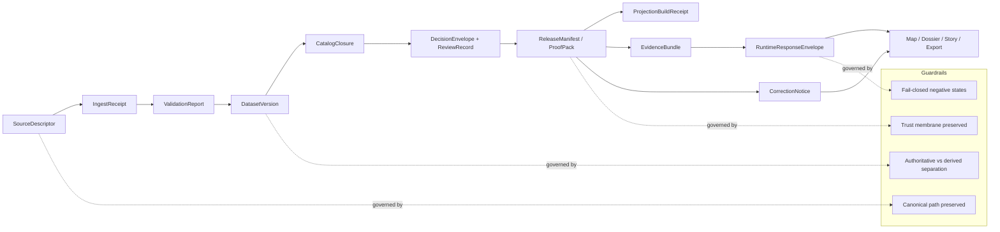

<!-- [KFM_META_BLOCK_V2]
doc_id: NEEDS-VERIFICATION
title: migrations
type: standard
version: v1
status: draft
owners: NEEDS VERIFICATION
created: YYYY-MM-DD
updated: YYYY-MM-DD
policy_label: public
related: [../README.md, ../contracts/, ../schemas/, ../configs/, ../infra/, ../scripts/]
tags: [kfm, migrations, storage-evolution]
notes: [doc_id, owners, and dates require repo-side confirmation; related links reflect documented repo-root surfaces and adjacent governance docs; current repo tree was not directly mounted in this session]
[/KFM_META_BLOCK_V2] -->

# `migrations`

Deterministic, reviewable storage and trust-state evolution for Kansas Frontier Matrix.

> **Status:** draft  
> **Owners:** **NEEDS VERIFICATION**  
>        
> **Quick jump:** [Scope](#scope) · [Repo fit](#repo-fit) · [Accepted inputs](#accepted-inputs) · [Exclusions](#exclusions) · [Current evidence boundary](#current-evidence-boundary) · [Directory tree](#directory-tree) · [Quickstart](#quickstart) · [Migration posture](#migration-posture) · [Contracts & proof objects](#contracts--proof-objects) · [Diagram](#diagram) · [Tables](#tables) · [Task list](#task-list--definition-of-done) · [FAQ](#faq) · [Appendix](#appendix--verification-notes)

> [!IMPORTANT]
> This README is **evidence-bounded**. In the current session, the visible workspace evidence was PDF-only. The attached KFM corpus strongly documents migration doctrine, contract families, verification posture, and proposed realization direction, but it does **not** directly verify a mounted repository tree, concrete migration files, schema registry contents, workflow YAML, or deployment manifests.

> [!WARNING]
> In KFM, migration is **not** just “run the database script.” It is a governed transition that can affect truth state, release state, runtime trust, public surfaces, and correction lineage. A technically successful change that bypasses evidence, policy, or visible correction is still a failed migration.

## Scope

`migrations/` is the repository-facing home for **governed change** to durable KFM structures and trust-bearing artifacts.

That includes database and schema evolution, but it is broader than that. The attached KFM migration doctrine treats migration as any controlled change that can alter authoritative data shape, metadata closure, contract families, release evidence, runtime envelopes, policy state, or public trust behavior.

### Truth markers used in this README

| Marker | Meaning here |
|---|---|
| **CONFIRMED** | Directly supported by the attached KFM corpus or by current-session evidence |
| **INFERRED** | Strongly implied by the corpus, but not directly verified as mounted implementation |
| **PROPOSED** | Repo-native target-state guidance consistent with doctrine, not verified as current implementation |
| **UNKNOWN** | Not verified strongly enough in the current session |
| **NEEDS VERIFICATION** | Placeholder value or repo fact that should be checked before merge |

### What this directory is for

At minimum, this surface should make migration work:

- inspectable in review
- bounded by clear seams
- linked to proof objects and rollback/correction posture
- honest about what is changing
- traceable across schema, data, contracts, release, and runtime consequences

### Current posture at a glance

| Status | Statement |
|---|---|
| **CONFIRMED** | KFM migration is broader than database schema change; it includes schema, data/ETL, metadata/catalog/provenance, contracts/envelopes, policy/verification objects, release/runtime changes, and correction-bearing post-publication transitions. |
| **CONFIRMED** | Migration must preserve the canonical governed path: `Source edge -> RAW -> WORK / QUARANTINE -> PROCESSED -> CATALOG -> PUBLISHED`. |
| **CONFIRMED** | The trust membrane still applies during migration: normal clients and public surfaces continue to use governed APIs and evidence resolution rather than direct canonical stores or model runtimes. |
| **CONFIRMED** | The current session did **not** directly verify a mounted repo tree, migration files, schema registry, workflows, manifests, or runtime traces. |
| **PROPOSED** | `migrations/` should become the reviewable lane for storage- and trust-state transitions that need durable, governed history. |
| **PROPOSED** | Changes here should move together with related contracts, tests, policy bundles, docs, and proof objects when behavior changes. |
| **UNKNOWN** | The active migration framework, file naming scheme, runner, and current repo-local migration inventory. |
| **UNKNOWN** | Whether the current repo already contains concrete migration files, or only the documented target-state surface. |

## Repo fit

**Path:** `migrations/README.md`  
**Role in repo:** directory contract for governed migration work.

### Path status

| Item | Status |
|---|---|
| `migrations/` as a documented repo-root surface | **CONFIRMED in attached repo-facing documentation** |
| `migrations/README.md` as the intended directory guide | **PROPOSED by this file** |
| Concrete current-session repo contents under `migrations/` | **UNKNOWN** |

### Upstream anchors

- [`../README.md`](../README.md) — repo entrypoint and top-level posture
- [`../contracts/`](../contracts/) — contract families affected by migration
- [`../schemas/`](../schemas/) — machine-checkable structure and fixtures
- [`../configs/`](../configs/) — runtime/configuration implications
- [`../infra/`](../infra/) — deployment, promotion, rollout, and rollback surfaces
- [`../scripts/`](../scripts/) — execution helpers, watchers, backfills, validators

### Downstream and adjacent consumers

- `tests/` or equivalent verification surfaces
- governed API and runtime response layers
- release / proof-object emitters
- app surfaces that must remain trust-visible after migration
- correction, rollback, and restore runbooks

### This README is for

- defining what belongs in `migrations/`
- keeping migration claims honest when repo visibility is partial
- describing KFM-specific migration doctrine in one directory-local reference
- helping reviewers distinguish **schema changes** from **governed state transitions**
- making storage evolution legible to maintainers who did not author the change

## Accepted inputs

The following belong here when they are part of **reviewable, governed migration work**.

| Input class | Examples | Why it belongs here |
|---|---|---|
| Database / schema migration files | additive DDL, index changes, constraints, sequence changes | They modify durable storage shape and must be reviewed as governed transitions. |
| Data-preserving migration steps | backfills, crosswalk generation, identifier replacement maps, temporal repairs | KFM migration must preserve history and visible correction lineage rather than silently overwrite. |
| Contract-linked migration artifacts | schema wave notes, envelope changes, compatibility bridges | Public and runtime trust depend on contracts evolving in lockstep with storage and release behavior. |
| Catalog / metadata migration material | `STAC` / `DCAT` / `PROV` closure updates, identifier repair notes | Discoverability, lineage, and EvidenceBundle drill-through must survive migration. |
| Proof-bearing migration notes | cutover steps, parity checks, rollback triggers, correction conditions | KFM treats migration as governance-and-release work, not just scripting. |
| Migration-local documentation | purpose, prerequisites, support/time assumptions, operator caveats | Reviewers need the why, not just the change artifact. |

### Minimum bar for anything added here

A migration change should, at minimum:

- name the surface it changes
- state whether it is schema, data, contract, policy, release, or runtime affecting
- define the validation path
- define rollback, supersession, withdrawal, or correction posture
- keep authoritative and derived layers distinct
- preserve the truth path and trust membrane

## Exclusions

The following do **not** belong in `migrations/`.

| Exclusion | Why it stays out | Where it goes instead |
|---|---|---|
| Ad hoc analyst SQL | Not governed migration history | scratch analysis, notebooks, or issue discussion |
| Detached ETL / watcher logic | Not every pipeline change is a migration | [`../scripts/`](../scripts/) or workflow/orchestration surfaces |
| UI-only changes with no trust-state migration | Product changes are not automatically migration work | app/package docs and feature-specific surfaces |
| Free-standing policy prose | Policy must remain executable and testable, not drift into informal notes | `policy/`, contracts, registries, or governance docs |
| Secrets, DSNs, and credentials | Never commit secret-bearing runtime material | secret manager or local environment configuration |
| Generated dumps, backups, or exported artifacts | Those are evidence or recovery assets, not migration source | release, backup, or ops surfaces |
| Derived-layer rebuild logic presented as canonical truth change | Rebuildable projections must not quietly become authoritative | projection/build or runtime surfaces |
| Silent overwrite utilities | KFM rejects mutation that erases history or correction context | explicit governed repair lane with correction-bearing artifacts |

## Current evidence boundary

The strongest current fact about this directory is **not** “what files it contains.”  
It is **what the current session could and could not verify**.

| Area | Current-session status | What is known | What remains unknown |
|---|---|---|---|
| Repo topology | **UNKNOWN** | The attached docs discuss repo-root surfaces, including `migrations/`, as documented inventory/target-state shape. | Actual mounted repo tree and module layout |
| Migration files | **UNKNOWN** | Migration families are strongly documented in doctrine. | Concrete migration files, naming conventions, runners, and current contents |
| Schema registry | **UNKNOWN** | First-wave contract and schema needs are explicit in the corpus. | Actual schema files, fixtures, and versioning on disk |
| Workflow / CI | **UNKNOWN** | CI/CD doctrine and post-deploy verification requirements are strongly documented. | Actual workflow YAML, required checks, and recent run evidence |
| Manifests / deploy descriptors | **UNKNOWN** | Deployment posture and runtime-boundary guidance are documented. | Actual Compose, systemd, Kubernetes, Helm, or GitOps descriptors |
| Proof objects | **PARTLY DOCUMENTED / UNKNOWN IMPLEMENTATION** | `ReleaseManifest`, `ReleaseProofPack`, `ProjectionBuildReceipt`, `EvidenceBundle`, `RuntimeResponseEnvelope`, and `CorrectionNotice` are all named as required families. | Actual emitted examples and generators |
| Rollback / correction drills | **PARTLY DOCUMENTED / UNKNOWN IMPLEMENTATION** | Rollback, restore, supersession, withdrawal, and correction-bearing publication are documented. | Actual drill reports and visible propagated correction states |

[Back to top](#migrations)

## Directory tree

### Current evidence-safe view

```text
migrations/
└── README.md
```

That is the **safest repo-facing minimum** this README can assert without inventing unmounted contents.

<details>
<summary>Illustrative future shape (PROPOSED, not current-session fact)</summary>

```text
migrations/
├── README.md
├── schema/
│   ├── 0001_*.sql
│   ├── 0002_*.sql
│   └── ...
├── data/
│   ├── <migration-id>/
│   │   ├── README.md
│   │   ├── backfill.sql
│   │   ├── crosswalk.json
│   │   └── verification.md
├── contracts/
│   ├── <wave-id>/
│   │   ├── schema-delta.md
│   │   ├── fixtures/
│   │   └── compatibility-notes.md
└── notes/
    ├── cutover-plan.md
    ├── rollback-matrix.md
    └── correction-propagation.md
```

This is a suggested shape only. Use it only if it matches the repo’s actual execution model once direct repo inspection is available.
</details>

## Quickstart

Before describing migration behavior as a branch fact, verify the branch.

```bash
# identify the revision under review
git rev-parse HEAD

# inspect the migration surface
find migrations -maxdepth 4 -type f | sort
find migrations -maxdepth 4 -type d | sort

# inspect adjacent contract / schema / workflow / infra surfaces
find contracts schemas tests configs infra scripts -maxdepth 4 -type f 2>/dev/null | sort

# search for migration tooling and execution paths
grep -RIn "migration\|migrate\|alembic\|dbmate\|goose\|flyway\|liquibase\|sqlmigrate\|upgrade\|downgrade" . 2>/dev/null | head -200
```

### Verify these before documenting repo reality as fact

1. What concrete migration directories and files actually exist?
2. Which migration mechanism is active, if any?
3. Are migrations schema-only, or do they include data-preserving crosswalk/backfill work?
4. What proof objects are emitted during migration?
5. What CI/CD gates block promotion?
6. Which rollback paths are exercised versus merely described?
7. Which public surfaces must show stale, narrowed, generalized, superseded, or withdrawn states after cutover?

## Migration posture

### Core doctrine

| Rule | What it means here | Why it exists |
|---|---|---|
| Migration is broader than schema change | Storage, data, contracts, policy, release, runtime, and correction can all be migration-bearing surfaces. | In KFM, trust state changes are operationally significant. |
| Preserve the canonical path | A migration may traverse and transform, but it must not bypass `RAW -> WORK / QUARANTINE -> PROCESSED -> CATALOG -> PUBLISHED`. | Truth path is load-bearing doctrine. |
| Preserve the trust membrane | Public surfaces continue to read through governed APIs and evidence resolution. | Migration must not create temporary bypasses that become permanent shortcuts. |
| Prefer additive change first | Add, backfill, compare, cut over, then retire old paths after a bounded compatibility window. | Safer review, safer rollback, less surprise. |
| Treat builds and migrations differently | Build reconstructs candidate artifacts; migration preserves or transforms existing governed state. | They need different proof and rollback logic. |
| Preserve history, not just rows | Crosswalks, supersession, withdrawal, and correction lineage matter as much as bytes and columns. | KFM rejects silent overwrite as a success condition. |
| Make negative outcomes first-class | hold, quarantine, deny, stale-visible, generalized, superseded, withdrawn, error | Honest failure is safer than bluffing continuity. |

### Recommended migration seams

| Seam type | When allowed | Stop rule |
|---|---|---|
| Schema bridge | Old and new shapes must coexist briefly | Remove when the new schema wave is the sole reviewed release path |
| Adapter / facade | Legacy store or contract cannot change simultaneously | Retire when only the governed outward contract remains |
| Dual-read | Bounded parity comparison during cutover | End when parity or intentional divergence is reviewed and recorded |
| Dual-write | Temporary compatibility period with one authoritative side | Remove at the first release where downstream consumers no longer need the old target |
| Stale-visible shield | Derived layers lag approved release truth | End when projection receipts and freshness checks prove alignment |
| Replacement chain / crosswalk | IDs, boundaries, geometry, or place mappings change | Keep as long as published history or dependent integrations require it |

> [!NOTE]
> These are migration seam patterns, not permission to keep permanent ambiguity alive. Every seam must have a stop rule.

### Practical authoring expectations

A migration proposal should let a reviewer answer:

- What exactly is changing?
- Is the change authoritative, derived, or both?
- What must remain immutable?
- What is the compatibility window?
- How is success proven?
- What becomes visibly narrower, stale, generalized, superseded, or withdrawn if the cutover fails?

## Contracts & proof objects

KFM migration doctrine is unusually explicit about the object families that make governed change inspectable.

| Object family | Why it matters to migration | Current status |
|---|---|---|
| `source_descriptor` | Intake contract for source admission and replayability | **CONFIRMED family / UNKNOWN mounted schema** |
| `ingest_receipt` | Fetch/acquisition evidence for reruns and migration backfills | **CONFIRMED family / UNKNOWN mounted schema** |
| `validation_report` | Explains pass, quarantine, or failure state before canonical change | **CONFIRMED family / UNKNOWN mounted schema** |
| `dataset_version` | Immutable authoritative anchor for canonical processed truth | **CONFIRMED family / UNKNOWN mounted schema** |
| `catalog_closure` | Preserves outward discovery, lineage, and resolvable evidence links | **CONFIRMED family / UNKNOWN mounted schema** |
| `decision_envelope` | Machine-readable policy outcome with reasons and obligations | **CONFIRMED family / UNKNOWN mounted schema** |
| `review_record` | Human review / approval / denial evidence preserving separation of duty | **CONFIRMED family / UNKNOWN mounted schema** |
| `release_manifest` / `release_proof_pack` | Defines what shipped and why it was trusted | **CONFIRMED family / UNKNOWN mounted file** |
| `projection_build_receipt` | Proves derived-layer freshness and approved-source linkage | **CONFIRMED family / UNKNOWN mounted file** |
| `EvidenceBundle` | Makes outward claims inspectable rather than rhetorical | **CONFIRMED requirement / UNKNOWN mounted resolver** |
| `runtime_response_envelope` | Makes answer / abstain / deny / error explicit at runtime | **CONFIRMED requirement / UNKNOWN mounted file** |
| `correction_notice` | Preserves supersession, withdrawal, narrowing, and visible correction lineage | **CONFIRMED family / UNKNOWN mounted file** |
| policy bundles + registries | Carry deny-by-default enforcement into CI, release, export, and runtime | **CONFIRMED need / PROPOSED realization / UNKNOWN mounted code** |

### Why these objects matter

Migrations in KFM are not complete when the script ends. They are complete when these objects let later readers reconstruct:

- what changed
- why it changed
- what policy/review state allowed it
- what released scope it affected
- what runtime users were allowed to see afterward
- how correction would propagate if the change later narrowed or failed

## Diagram


```mermaid
flowchart LR
    A[SourceDescriptor] --> B[IngestReceipt]
    B --> C[ValidationReport]
    C --> D[DatasetVersion]
    D --> E[CatalogClosure]
    E --> F[DecisionEnvelope + ReviewRecord]
    F --> G[ReleaseManifest / ProofPack]
    G --> H[ProjectionBuildReceipt]
    G --> I[EvidenceBundle]
    I --> J[RuntimeResponseEnvelope]
    G --> K[CorrectionNotice]

    J --> L[Map / Dossier / Story / Export]
    K --> L

    subgraph Guardrails
      M[Canonical path preserved]
      N[Trust membrane preserved]
      O[Authoritative vs derived separation]
      P[Fail-closed negative states]
    end

    A -.governed by.-> M
    D -.governed by.-> O
    G -.governed by.-> N
    J -.governed by.-> P
```

## Tables

### Change-class decision table

| Change class | Belongs here? | Notes |
|---|---|---|
| Authoritative schema evolution | **Yes** | Core fit for this surface |
| Data-preserving backfill inseparable from schema/version migration | **Yes** | Keep proof and rollback posture explicit |
| Metadata / catalog closure updates tied to publication behavior | **Yes** | Especially when outward identifiers or lineage change |
| Runtime envelope or trust-visible state migration | **Yes, if migration-bearing** | Particularly when user-visible trust behavior changes |
| Free-standing ETL improvements with no migration burden | **Usually no** | Keep in scripts/orchestration lanes |
| Derived-layer-only rebuilds with no trust-state change | **Usually no** | Unless they are part of a governed cutover with release linkage |
| Ad hoc repair SQL | **No** | Not durable migration history |
| Secrets / environment credentials | **Never** | Keep out of repo |

### Review matrix

| Review question | Why it matters |
|---|---|
| Does this change canonical truth, derived delivery, or both? | Prevents quiet authority drift |
| Does it preserve stable identity, time basis, and support? | KFM treats these as anti-error disciplines |
| Does it require a contract or envelope bridge? | Public/runtime trust depends on explicit compatibility seams |
| Does it require policy or review grammar changes? | Rights/sensitivity and release behavior must stay machine-checkable |
| What proof objects will this emit? | A migration without proof is only half governed |
| What happens if rollback is insufficient? | Published scope may require supersession or withdrawal instead |
| What visible state reaches users during and after cutover? | Public surfaces must not bluff trust |

## Task list / Definition of done

A migration change should not be called complete until the following are true.

- [ ] The migration class is named clearly: schema, data, metadata, contract, policy, release, runtime, or correction-bearing.
- [ ] Preconditions and compatibility seams are documented.
- [ ] The canonical path and trust membrane remain intact.
- [ ] Authoritative and derived layers stay distinct.
- [ ] Required proof objects are named.
- [ ] Validation gates are named and runnable.
- [ ] Rollback, supersession, withdrawal, or correction posture is explicit.
- [ ] Public-facing stale, narrowed, generalized, superseded, or withdrawn states are addressed if applicable.
- [ ] Related contract, schema, policy, UI, and doc changes are linked when behavior changes.
- [ ] The branch history remains understandable to someone who did not author the migration.

### Stronger definition of done for the first real slice

For the first governed migration slice, KFM’s own attached doctrine repeatedly points toward a **hydrology-first** lane. That slice is only “done” when one lane can prove, end to end:

```text
source_descriptor
-> ingest_receipt
-> validation_report
-> dataset_version
-> catalog_closure
-> decision/review
-> release_manifest
-> projection_build_receipt
-> EvidenceBundle
-> runtime_response_envelope
-> correction_notice
```

## FAQ

### Is `migrations/` only for database work?

No. In KFM, migration includes schema and database evolution, but also data reprocessing, metadata/catalog change, contract and envelope change, policy and verification-object change, release/runtime trust changes, and post-publication correction behavior.

### Why is this README more cautious than a normal migrations guide?

Because the current session did not directly expose the repo tree or migration files. This README is written to stay branch-honest rather than to invent certainty from target-state prose.

### Why not document the current migration runner?

Because it is still **UNKNOWN** in the current evidence. The attached corpus documents migration doctrine and target-state shape strongly, but it does not prove the live runner or current file inventory in this session.

### Why emphasize correction so much?

Because KFM does not treat migration as successful if it silently overwrites previously published state. Supersession, withdrawal, narrowing, stale-visible shielding, and correction notices are all first-class governed outcomes.

### Why prefer additive / expand-contract changes?

Because KFM favors reviewable seams, explicit compatibility windows, and proof-bearing cutover over surprise replacement. That is the safest way to preserve truth, release, and trust state together.

### Why keep hydrology as the first slice?

Because the attached KFM corpus repeatedly treats hydrology as the safest first governed slice: public-safe, spatially legible, temporally rich, and strong enough to exercise the full evidence/release/runtime chain without immediately escalating into higher-burden sensitive lanes.

## Appendix — verification notes

<details>
<summary>Open verification questions</summary>

1. What concrete migration files or directories actually exist in the mounted repo?
2. Which migration framework or execution path is active?
3. What first-wave schemas and fixtures already exist on disk?
4. Which CI checks block promotion for migration-bearing changes?
5. What release proof objects are currently emitted versus only documented?
6. Is there a mounted `EvidenceBundle` resolver implementation?
7. What app/API payloads change trust-visible state after migration?
8. What restore, rollback, supersession, or correction drills have actually been exercised?
9. Which lane is currently closest to a real thin-slice proof beyond doctrine?
</details>

<details>
<summary>What should be surfaced next before claiming implementation maturity</summary>

- current repo tree and top-level manifests
- migration/script inventory
- contract and schema inventory
- workflow / CI inventory
- deployment manifests or systemd/container descriptors
- one sample release proof object set
- one sample runtime verification report
- one restore drill and one correction drill report
</details>

<details>
<summary>Illustrative review header for a future migration artifact (PROPOSED)</summary>

```text
id: <migration-id>
class: schema | data | metadata | contract | policy | release | runtime
purpose: <one-sentence statement>
authoritative_scope: <what authoritative state changes>
derived_scope: <what derived layers must rebuild or warn>
compatibility_window: <none | bounded window>
proof_objects: <list>
verification: <tests / reports / parity checks>
rollback: <revert | fail-forward | supersede | withdraw>
correction_path: <how visible correction propagates>
```
</details>

[Back to top](#migrations)
