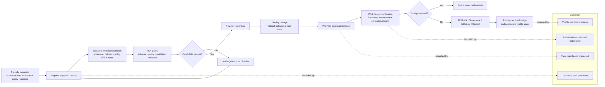

<!-- [KFM_META_BLOCK_V2]
doc_id: NEEDS-VERIFICATION
title: migrations
type: standard
version: v1
status: draft
owners: NEEDS VERIFICATION
created: YYYY-MM-DD
updated: YYYY-MM-DD
policy_label: public
related: [../README.md, ../contracts/README.md, ../schemas/README.md, ../scripts/README.md, ../tests/README.md, ../policy/README.md, ../.github/workflows/README.md, NEEDS-VERIFICATION:../configs/, NEEDS-VERIFICATION:../infra/]
tags: [kfm, migrations, storage-evolution]
notes: [freshest repo-state signal for this draft is the 2026-03-22 repo-grounded sprint; no mounted repo checkout, migrations inventory, owners, or metadata dates were directly reverified in this session]
[/KFM_META_BLOCK_V2] -->

# migrations

Deterministic, reviewable storage and trust-state evolution for Kansas Frontier Matrix.

> **Status:** experimental  
> **Document lifecycle:** draft  
> **Authority posture:** operational / supporting  
> **Owners:** **NEEDS VERIFICATION**  
>        
> **Quick jump:** [Scope](#scope) · [Repo fit](#repo-fit) · [Accepted inputs](#accepted-inputs) · [Exclusions](#exclusions) · [Current repo signal](#current-repo-signal) · [Directory tree](#directory-tree) · [Quickstart](#quickstart) · [Usage](#usage) · [Migration posture](#migration-posture) · [Contracts & proof objects](#contracts--proof-objects) · [Diagram](#diagram) · [Tables](#tables) · [Task list](#task-list--definition-of-done) · [FAQ](#faq) · [Appendix](#appendix--verification-notes)

> [!IMPORTANT]
> This README is intentionally **evidence-bounded**. The strongest repo-state signal available in the current session is a **2026-03-22 repo-grounded sprint**, not a mounted checkout. Path-level inventory claims are therefore kept proportional.

> [!WARNING]
> In KFM, migration is **not** just “run the database script.” It can affect schema, data, contracts, policy, release state, projection freshness, runtime trust behavior, rollback, supersession, withdrawal, and visible correction.

> [!NOTE]
> **Baseline determination.** This guide uses the strongest doctrinal anchors visible in the current session: the replacement-grade KFM master-reference layer and the unified geospatial architecture layer. The repo-grounded sprint is used for current repo signal, not for doctrine.

## Scope

`migrations/` is the directory contract for **governed change** to durable KFM structures and trust-bearing artifacts.

That includes storage and schema work, but it is intentionally broader. In the strongest attached KFM doctrine, migration spans schema evolution, data repair and backfill, contract and envelope changes, policy and registry updates, release and promotion consequences, projection rebuilds tied to released scope, rollback, supersession, withdrawal, and visible correction.

### Truth markers used in this guide

| Marker | Meaning here |
|---|---|
| **CONFIRMED** | Directly supported by the attached KFM corpus or by the freshest repo-grounded evidence visible in this session |
| **INFERRED** | Strongly implied by the corpus, but not directly reverified as mounted repo/runtime reality |
| **PROPOSED** | Recommended target-state shape or workflow consistent with doctrine, but not verified as current implementation |
| **UNKNOWN** | Not supported strongly enough in the current session to present as settled fact |
| **NEEDS VERIFICATION** | Explicit placeholder or repo-specific fact that should be checked before merge |

### What this directory is for

This surface should make migration work:

- reviewable
- staged and reversible
- explicit about compatibility seams
- linked to proof objects
- honest about rollback, supersession, withdrawal, and correction
- traceable across schema, data, contracts, policy, release, and runtime consequences

### What migration must preserve

| Invariant | Why it matters here |
|---|---|
| `Source -> RAW -> WORK / QUARANTINE -> PROCESSED -> CATALOG -> PUBLISHED` | Migration must not shortcut the canonical truth path. |
| Trust membrane | Public and normal UI surfaces still go through governed APIs, policy, and evidence resolution. |
| Authoritative vs derived split | Search, graph, vector, tile, scene, cache, and summary layers stay rebuildable unless explicitly promoted. |
| Promotion as governed state change | Deployment success is not enough; publication needs release and proof state. |
| Visible correction lineage | Rollback, supersession, withdrawal, narrowing, and replacement must remain inspectable. |

[Back to top](#migrations)

## Repo fit

**Path:** `migrations/README.md`  
**Role in repo:** README-like directory contract for migration-bearing change.

### Repo fit summary

| Aspect | Guidance |
|---|---|
| **Path** | `migrations/README.md` |
| **Confirmed adjacent docs** | [repo root][repo-root], [contracts][contracts-readme], [schemas][schemas-readme], [scripts][scripts-readme], [tests][tests-readme], [policy][policy-readme], [workflow docs][workflows-readme] |
| **Documented but not reverified nearby surfaces** | `../configs/`, `../infra/` |
| **Primary audience** | Maintainers, platform engineers, data engineers, reviewers, stewards |
| **Upstream dependencies** | Contracts, schemas, policy, source descriptors, review logic, release state |
| **Downstream consequences** | Releases, projections, exports, EvidenceBundle resolution, RuntimeResponseEnvelope behavior, correction visibility |
| **Update trigger** | Any change to authoritative storage, contracts, policy, proof objects, promotion rules, or correction behavior |

### Why this directory matters in KFM

Migration in KFM is constrained by earlier law:

- the canonical path must remain intact
- the trust membrane must remain intact
- authoritative truth must remain stronger than derived layers
- public-safe release must remain proof-bearing
- users must see honest states when a cutover fails, narrows scope, is generalized, becomes stale, or is superseded later

That makes `migrations/` more than a convenience folder. It is where change seams become inspectable.

## Accepted inputs

The following belong here when they are part of **reviewable, governed migration work**.

| Input class | Examples | Why it belongs here | Minimum companion context |
|---|---|---|---|
| Schema and storage evolution | DDL, indexes, constraints, partition changes, canonical table/view changes | Durable structure changed | plan, verify path, rollback posture |
| Data repair and backfill | ID remaps, canonical field repair, temporal correction, replay, reconciliation | Existing governed state is transformed | source basis, validation, correction implications |
| Contract or envelope migration | object shape changes, additive fields, runtime envelope shifts, deprecation bridges | Public/runtime meaning changes | contract delta, compatibility window, fixture updates |
| Policy or registry migration | reason-code additions, obligation-code changes, publication-class shifts | Runtime and release outcomes can change | policy diff, tests, steward review path |
| Release and cutover notes | promotion effects, projection rebuild expectations, stale-state handling | Deployment and publication must stay distinct | release notes, post-deploy verify, rollback/correction note |
| Compatibility seams | dual-read, dual-write, adapters, bridge layers, temporary facades | Temporary ambiguity must be bounded and retired | stop rule, parity note, removal plan |
| Correction packets | rollback, supersession, withdrawal, narrowing, replacement notices | KFM requires visible recovery, not silent overwrite | affected surfaces, public note, rebuild refs |
| Migration-local documentation | packet README, plan, verify steps, rollback runbook | Reviewers need intent and operator guidance | concise purpose, scope, gates, open unknowns |

### Minimum bar for anything added here

A migration packet should make all of the following obvious:

1. what changed
2. whether the change touches authoritative state, derived state, or both
3. which proof objects or fixtures changed with it
4. what the compatibility window is
5. what the rollback or correction path is
6. what users would see if the change fails, narrows scope, or is superseded later

## Exclusions

The following do **not** belong in `migrations/`.

| Exclusion | Why it stays out | Where it goes instead |
|---|---|---|
| Ad hoc analyst SQL | Not durable governed migration history | notebooks, scratch analysis, issue discussion |
| Free-standing helper scripts | Not every automation change is migration-bearing | [scripts][scripts-readme], tooling docs |
| UI-only work with no trust-state seam | Product work is not automatically migration work | app/surface docs |
| Standalone policy prose with no executable consequence | KFM policy must stay machine-checkable and testable | [policy][policy-readme], registries, contract/schema surfaces |
| Secrets, DSNs, credentials | Never commit secret-bearing material | secret manager or local operator config |
| Generated dumps, backups, exports | Recovery assets are not migration source | recovery / release artifact storage |
| Projection rebuilds with no release seam | Rebuildable delivery is not canonical migration by default | projection/build surfaces |
| Silent overwrite utilities | KFM rejects mutation without lineage as a success condition | explicit correction or governed repair path |

## Current repo signal

The freshest repo-state signal available to this draft is a **2026-03-22 repo-grounded sprint**. It is stronger than purely doctrinal PDFs for **current repo status**, but weaker than a mounted checkout because the current session did not expose the branch tree directly.

### What that means for this README

| Signal | Current status | Practical consequence |
|---|---|---|
| Adjacent documentation surfaces exist | **CONFIRMED** | This README can safely coordinate with [contracts][contracts-readme], [schemas][schemas-readme], [scripts][scripts-readme], [tests][tests-readme], [policy][policy-readme], and [workflow docs][workflows-readme]. |
| `contracts/` and `schemas/` both act as schema-facing doc surfaces | **CONFIRMED** | Migration docs should not amplify a parallel schema universe; authoritative schema home still needs explicit resolution. |
| Active workflow YAML merge gates were surfaced in reviewed repo artifacts | **CONFIRMED gap in reviewed repo artifacts** | Do not write this README as if merge-blocking automation already exists. |
| Concrete machine-readable schema inventory was surfaced | **CONFIRMED gap in reviewed repo artifacts** | Migration packets should name needed schemas and fixtures explicitly instead of assuming they already exist. |
| Runnable tests / fixtures / harnesses were surfaced | **CONFIRMED gap in reviewed repo artifacts** | Definition of done should include fixtures and runnable checks, or say clearly that they are still missing. |
| Live `migrations/` inventory | **NEEDS VERIFICATION** | Keep the directory contract, but verify branch reality before claiming presence or contents. |
| Concrete runner choice, naming convention, rollback drills, release proof emitters | **UNKNOWN** | Verify from the branch before merge or release. |

> [!IMPORTANT]
> The same repo-grounded sprint flags two current trust risks relevant to migration work: a dual schema-facing surface (`contracts/` and `schemas/`) and workflow scaffolding that can outrun actual YAML gates. This README stays explicit about both.

[Back to top](#migrations)

## Directory tree

### Safest current-session shape

```text
migrations/
└── README.md   # this document; PROPOSED until merged
```

<details>
<summary>Illustrative future shape (PROPOSED, not current-session fact)</summary>

```text
migrations/
├── README.md
├── packets/
│   └── 2026-03-05_<slug>/
│       ├── README.md
│       ├── plan.md
│       ├── verify.md
│       ├── rollback.md
│       ├── correction.md
│       ├── fixtures/
│       └── artifacts/
├── drills/
│   └── 2026-03-05_<slug>/
│       ├── post-deploy-verification.md
│       └── correction-visibility.md
└── templates/
    └── migration-packet.md
```

Adopt a shape like this only if it matches the mounted repo’s actual execution model once the repository tree is directly available.
</details>

## Quickstart

Before documenting branch reality as fact, verify the branch.

```bash
# identify the exact revision under review
git rev-parse HEAD

# inspect whether migrations/ exists and what it contains
git ls-files 'migrations/**' 2>/dev/null || true
find migrations -maxdepth 4 -type f 2>/dev/null | sort
find migrations -maxdepth 4 -type d 2>/dev/null | sort

# inspect already-confirmed adjacent doc surfaces
git ls-files '.github/workflows/**' 'contracts/**' 'schemas/**' 'scripts/**' 'tests/**' 'policy/**' | sort

# find contract and proof-object language
git grep -nE 'SourceDescriptor|IngestReceipt|ValidationReport|DatasetVersion|CatalogClosure|DecisionEnvelope|ReviewRecord|ReleaseManifest|ReleaseProofPack|ProjectionBuildReceipt|EvidenceBundle|RuntimeResponseEnvelope|CorrectionNotice' -- . 2>/dev/null

# find migration, rollback, correction, and compatibility-seam language
git grep -nE 'migrat|rollback|supersed|withdraw|compatibility|dual-read|dual-write|deprecat|correction' -- . 2>/dev/null

# inspect actual workflow YAML presence
git ls-files '.github/workflows/*.yml' '.github/workflows/*.yaml' | sort
```

### Review-first branch audit

```bash
# choose the review base explicitly
BASE_REF=origin/main

# see what the branch actually touches
git diff --name-only "$BASE_REF"...HEAD | sort

# narrow to likely migration-bearing surfaces
git diff --name-only "$BASE_REF"...HEAD \
  | grep -E '^(migrations|contracts|schemas|policy|scripts|tests|docs|\.github/workflows)/' || true
```

### Verify these before calling the branch “done”

1. Does `migrations/` already exist on the branch, or is this PR introducing it?
2. Which schema home is authoritative for this change: `contracts/`, `schemas/`, or an ADR-backed replacement?
3. Are valid and invalid fixtures present for the changed contract families?
4. What proof objects are emitted before and after promotion?
5. What post-deploy checks exist for rollback or correction?
6. Which public-safe surface shows release and correction state after cutover?

## Usage

Treat this directory as a **review surface**, not only as a script bucket.

1. **Classify the change.** Name it: schema, storage, data, contract, policy, release, projection, runtime, or correction-bearing.
2. **Assemble the packet.** Pair the migration mechanism with notes, fixtures, and proof-object expectations.
3. **Declare the seam.** State the compatibility window, bridge strategy, and stop rule.
4. **Run the gates.** Record schema, policy, validation, release, and post-deploy checks honestly.
5. **Close the loop.** Retire the seam deliberately or emit rollback, supersession, withdrawal, or correction artifacts.

> [!NOTE]
> A migration PR that cannot identify its proof objects, stop rule, and correction path is not ready, even if the underlying script is short.

## Migration posture

### Core doctrine

| Rule | Practical consequence |
|---|---|
| Migration is broader than schema change | Storage, data, contracts, policy, release, runtime, and correction can all be migration-bearing. |
| Preserve the canonical path | `RAW -> WORK / QUARANTINE -> PROCESSED -> CATALOG -> PUBLISHED` remains load-bearing. |
| Preserve the trust membrane | Public clients and normal UI surfaces do not receive temporary bypasses that outlive the cutover. |
| Separate build, deploy, and promote | Deployment changes runtime placement; promotion changes public trust state. |
| Prefer staged, reversible change | Expand, compare, cut over, verify, then retire old seams deliberately. |
| Keep correction first-class | Rollback, supersession, withdrawal, and visible narrowing belong in migration design, not incident afterthoughts. |
| Do not let temporary seams fossilize | Dual-read, dual-write, and adapters need explicit stop rules. |
| Never let derived layers back-write authority | Projection and packaging workers rebuild from promoted scope only. |

### Compatibility and deprecation rules

| Rule | Migration consequence |
|---|---|
| Outward-published contracts evolve additively by default | Breaking changes require explicit versioning, fixture updates, and runbook changes. |
| Registries expand more safely than they mutate | Additive reason/obligation changes are usually safer than redefining existing meanings. |
| Trust objects stay stable and inspectable | `EvidenceBundle` and `RuntimeResponseEnvelope` semantics should not drift casually. |
| Deprecation needs a visible end state | Name the replacement path, compatibility window, and final retirement condition. |

### What migration authors must preserve at trust surfaces

A migration is not finished when the mechanism succeeds. It is finished when the system can still explain:

- what changed
- why it changed
- what release and policy state allowed it
- what users would see during stale, generalized, withdrawn, superseded, denied, or abstained outcomes
- how correction propagates afterward

[Back to top](#migrations)

## Contracts & proof objects

The KFM corpus is unusually explicit about the object families that make governed change inspectable.

> [!NOTE]
> The object families below are **CONFIRMED doctrinally**. Concrete schema files, emitters, registries, and resolver traces remain **UNKNOWN** or **NEEDS VERIFICATION** until surfaced from the repo/runtime directly.

| Object family | Why it matters in migration |
|---|---|
| `SourceDescriptor` | Declares the intake contract for a source or endpoint touched by migration-bearing work. |
| `IngestReceipt` | Proves that a fetch and landing event occurred during replay, backfill, or rebuild. |
| `ValidationReport` | Records what passed, failed, or quarantined during the change. |
| `DatasetVersion` | Carries the authoritative candidate or promoted subject set after change. |
| `CatalogClosure` | Preserves outward STAC/DCAT/PROV closure and release linkage. |
| `DecisionEnvelope` | Records machine-readable policy outcomes, reasons, and obligations. |
| `ReviewRecord` | Preserves human approval, denial, escalation, or steward note. |
| `ReleaseManifest / ReleaseProofPack` | Assembles the public-safe release and its proof-bearing context. |
| `ProjectionBuildReceipt` | Proves that maps, tiles, exports, search, graph, or scene derivatives were rebuilt from known release scope. |
| `EvidenceBundle` | Packages support for a claim, feature, story node, export preview, or answer after change. |
| `RuntimeResponseEnvelope` | Makes runtime outcomes accountable: `ANSWER`, `ABSTAIN`, `DENY`, `ERROR`, and related surface states. |
| `CorrectionNotice` | Preserves lineage under rollback, supersession, withdrawal, or visible narrowing. |

### First machine-checkable wave

The strongest attached doctrine converges on a deliberately small first wave. The important point is **not** the literal filename; it is the existence of a machine-checkable contract set plus fixtures and validation.

```text
source_descriptor
validation_report
dataset_version
catalog_closure
decision_envelope
release_manifest
evidence_bundle
runtime_response_envelope
correction_notice
```

### Why these objects belong in a migrations README

A migration in KFM is done only when later readers can reconstruct:

- what changed
- what was promoted
- what was rebuilt
- what policy or review path allowed it
- what users saw at the trust surface
- what correction path exists if the release later narrows or fails

## Diagram


```mermaid
flowchart LR
    A[Classify migration<br/>schema • data • contract • policy • runtime] --> B[Prepare migration packet]
    B --> C[Update companion artifacts<br/>schemas • fixtures • policy diffs • notes]
    C --> D[Run gates<br/>schema • policy • validation • release]
    D --> E{Candidate passes?}

    E -- No --> Q[Hold / Quarantine / Revise]
    Q --> B

    E -- Yes --> F[Review + approval]
    F --> G[Deploy change<br/>without collapsing trust state]
    G --> H[Promote approved release]
    H --> I[Post-deploy verification<br/>freshness • trust state • correction checks]
    I --> J{Trust preserved?}

    J -- Yes --> K[Retire seam deliberately]
    J -- No --> L[Rollback / Supersede / Withdraw / Correct]
    L --> M[Emit correction lineage<br/>and propagate visible state]

    subgraph Guardrails
      N[Canonical path preserved]
      O[Trust membrane preserved]
      P[Authoritative vs derived separation]
      R[Visible correction lineage]
    end

    B -.bounded by.-> N
    H -.bounded by.-> O
    I -.bounded by.-> P
    M -.bounded by.-> R
```

Above: a governed migration flow in which change is paired with contract updates, fixtures, review, promotion, post-deploy verification, and explicit correction lineage.

## Tables

### Change-class decision matrix

| Change class | Belongs here? | Review burden |
|---|---|---|
| Authoritative schema or storage evolution | **Yes** | High; verify fixtures, compatibility, rollback |
| Data repair or backfill tied to authoritative state | **Yes** | High; validate lineage and correction implications |
| Contract / envelope migration | **Yes** | High; additive evolution, versioning, negative-state review |
| Policy / registry migration affecting runtime outcomes | **Yes** | High; tests, reason/obligation stability, steward review |
| Release / cutover / correction packet | **Yes** | High; release linkage, proof objects, post-deploy verify |
| Projection-only rebuild with no trust-state seam | **Usually no** | Keep in projection/build surfaces unless part of governed cutover |
| UI-only refactor with unchanged trust behavior | **No** | Keep with app/surface docs |
| Ad hoc repair SQL | **No** | Not durable governed migration history |

### Companion artifacts by change class

| Change class | Usually review with |
|---|---|
| Schema / storage | schema diff, fixture changes, verify steps, rollback note |
| Data / backfill | source basis, reconciliation note, correction path |
| Contract / envelope | schema or OpenAPI diff, compatibility window, negative-path tests |
| Policy / registry | reason/obligation diff, fixtures, decision tests |
| Release / promotion | release notes, proof pack expectations, post-deploy verify |
| Runtime / surface trust | response-envelope diff, evidence-drill-through test, stale/correction cues |

### Review questions maintainers should ask

| Question | Why it matters |
|---|---|
| Does this change authoritative truth, derived delivery, or both? | Prevents quiet authority drift |
| Which proof objects must change with it? | Migration without evidence is only half governed |
| Is the change additive, bridged, or breaking? | Determines compatibility and rollback posture |
| What is the stop rule for any seam introduced? | Prevents temporary bridges from becoming architecture |
| What visible state reaches users if cutover fails? | Public surfaces must not bluff trust |
| Is rollback enough, or is correction / supersession needed? | Some public states cannot be “undone” silently |
| Did docs, fixtures, and runbooks change with behavior? | Documentation is part of the governed system |

## Task list / Definition of done

A migration change should not be called complete until the following are true.

- [ ] Branch inventory confirms whether `migrations/` already existed or is being introduced in this PR.
- [ ] The migration class is named clearly: schema, storage, data, contract, policy, release, projection, runtime, or correction-bearing.
- [ ] Preconditions, compatibility seams, and stop rules are documented.
- [ ] The canonical path and trust membrane remain intact.
- [ ] Authoritative and derived layers remain distinct.
- [ ] Required proof objects and fixture updates are named.
- [ ] Validation gates are named and runnable, or explicitly marked manual if not yet enforced.
- [ ] If contracts, schemas, or policy meanings changed, corresponding fixtures or validator work is attached or explicitly called out as missing.
- [ ] The change does not reinforce a parallel schema universe between `contracts/` and `schemas/`.
- [ ] Rollback, supersession, withdrawal, or correction posture is explicit.
- [ ] Public-facing stale, generalized, partial, withdrawn, or superseded states are handled where relevant.
- [ ] Related contracts, schemas, scripts, tests, policy docs, and workflow notes are linked when behavior changes.
- [ ] The branch remains reviewable to a maintainer who did not author the change.

### Readiness gate before broad migration expansion

Until stronger executable evidence exists, broad migration work should also satisfy these conditions:

- [ ] The single authoritative schema home is explicitly named.
- [ ] The first merge-blocking contract or policy gate is real, not README-only scaffolding.
- [ ] One real release proof object or proof pack is surfaced.
- [ ] One real `RuntimeResponseEnvelope` sample or equivalent negative-path trace is surfaced.
- [ ] This README does not imply mounted automation that the repo does not yet prove.

### Stronger definition of done for the first real rehearsal

The first serious rehearsal should prove at least one end-to-end governed slice:

```text
source_descriptor
-> ingest_receipt
-> validation_report
-> dataset_version
-> catalog_closure
-> decision_envelope / review_record
-> release_manifest or release_proof_pack
-> projection_build_receipt
-> evidence_bundle
-> runtime_response_envelope
-> correction_notice
```

### PR-ready review packet

A non-trivial migration PR should include, at minimum:

- purpose and scope
- evidence label summary (`CONFIRMED` / `INFERRED` / `PROPOSED` / `UNKNOWN`)
- proof objects changed or added
- compatibility window and stop rule, if any seam is introduced
- rollback / correction path
- docs updates, or explicit rationale for none
- tests / fixtures added or updated
- operational impact notes if runtime behavior changes

[Back to top](#migrations)

## FAQ

### Is `migrations/` only for database work?

No. In the strongest KFM doctrine visible in this session, migration is broader than database schema change. It includes storage evolution, data repair/backfill, contract and envelope evolution, policy and registry change, release and promotion consequences, runtime trust behavior, and post-publication correction or supersession.

### Is a live `migrations/` inventory already confirmed in the repo?

No. Adjacent documentation surfaces are confirmed by the repo-grounded sprint, but a live `migrations/` inventory was not directly reverified in the current session. Treat the path as **NEEDS VERIFICATION** until branch inspection proves it.

### Why is this README more cautious than a typical migrations guide?

Because the current session did not expose the live repository tree directly. The doctrine set is strong; the repo-grounded sprint is helpful; but neither should be flattened into claims about files or automation that were not directly surfaced here.

### Why keep rollback and correction so close together?

Because KFM treats rollback as an evidence-bearing reverse transition, not silent deletion. Some failures can revert to an earlier approved state; others require supersession, withdrawal, generalized output, or visible correction notices.

### What should the first serious migration prove?

Not only that the underlying mechanism works, but that KFM can attach contracts, fixtures, policy decisions, release evidence, runtime trust behavior, and correction lineage to the change without bluffing maturity it does not yet have.

## Appendix — verification notes

<details>
<summary>Open verification questions</summary>

1. Does `migrations/` already exist in the mounted repo, or is this README introducing the directory?
2. Which directory is authoritative for machine-checkable schemas: `contracts/`, `schemas/`, or something else?
3. Which runner or mechanism is actually used for migration-bearing changes?
4. Are there any live migration packets, or only documentation and placeholders?
5. Which first-wave schemas and valid/invalid fixtures already exist on disk?
6. Which CI checks block promotion for migration-bearing PRs?
7. What emitted proof objects already exist versus only being documented?
8. Is there a mounted `EvidenceBundle` resolver and `RuntimeResponseEnvelope` path?
9. What restore, rollback, supersession, or correction drills have actually been exercised?

</details>

<details>
<summary>Illustrative migration packet header (PROPOSED)</summary>

```yaml
id: <migration-id>
class: schema | storage | data | contract | policy | release | projection | runtime | correction
purpose: <one-sentence statement>
authoritative_scope: <what authoritative state changes>
derived_scope: <what derived layers must rebuild or warn>
compatibility_window: <none | bounded window>
proof_objects:
  - <object-family>
verification:
  - <tests / reports / parity checks>
rollback: <revert | fail-forward | supersede | withdraw>
correction_path: <how visible correction propagates>
affected_surfaces:
  - <map | detail | export | focus | api>
notes:
  - <assumptions / open unknowns>
```

</details>

<details>
<summary>Current repo contradictions this directory should not amplify</summary>

| Contradiction | Why migration authors should care | Practical rule in this README |
|---|---|---|
| `contracts/` and `schemas/` both present as schema-facing doc surfaces | CI can validate one tree while docs or code drift in another | Name the authoritative schema home before claiming machine-safe migration gates |
| Workflow docs can outrun retrievable YAML gates | Reviewers may assume gates exist because README prose says they do | Never write migration guidance as if merge-blocking YAML already exists unless branch evidence proves it |
| Tests taxonomy can outrun runnable harnesses | A rich README is not the same thing as executable validation | Definition of done must name runnable checks or mark the gap explicitly |

</details>

<details>
<summary>What should be surfaced next before claiming implementation maturity</summary>

- current repo tree and module inventory
- actual `migrations/` inventory
- current schema directories plus valid/invalid fixtures
- workflow / CI inventory and required checks
- deployment descriptors or service manifests
- one emitted release proof object
- one `EvidenceBundle` resolver trace
- one `RuntimeResponseEnvelope` sample
- one restore drill and one visible correction drill record

</details>

## Reference links

[repo-root]: ../README.md
[contracts-readme]: ../contracts/README.md
[schemas-readme]: ../schemas/README.md
[scripts-readme]: ../scripts/README.md
[tests-readme]: ../tests/README.md
[policy-readme]: ../policy/README.md
[workflows-readme]: ../.github/workflows/README.md

[Back to top](#migrations)
