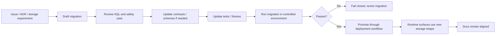

<!-- [KFM_META_BLOCK_V2]
doc_id: kfm://doc/5f7ebf78-1b7d-4e2f-9622-91f9559e2e7a
title: migrations
type: standard
version: v1
status: draft
owners: TBD; verify in ../.github/CODEOWNERS
created: 2026-03-07
updated: 2026-03-07
policy_label: public
related: [../README.md, ../contracts/, ../schemas/, ../tests/, ../scripts/, ../infra/]
tags: [kfm, migrations, postgresql, postgis]
notes: [Directory contract for deterministic schema and storage evolution.]
[/KFM_META_BLOCK_V2] -->

# `migrations`
Deterministic schema and storage evolution for KFM persistent systems.

> **Status:** draft  
> **Owners:** verify in [`../.github/CODEOWNERS`](../.github/CODEOWNERS)  
>       
> **Quick jump:** [Purpose](#purpose) · [Repo fit](#repo-fit) · [Accepted inputs](#accepted-inputs) · [Exclusions](#exclusions) · [Current snapshot](#current-snapshot) · [Quickstart](#quickstart) · [Migration posture](#migration-posture) · [Diagram](#diagram) · [Definition of done](#definition-of-done) · [FAQ](#faq)

## Purpose
This directory exists to hold reviewable migrations for durable storage surfaces used by Kansas Frontier Matrix (KFM).

For now, the safest documented interpretation is **schema / DB migration scripts**, with emphasis on **PostGIS / PostgreSQL SQL**. This means the directory should describe and carry the changes that evolve persistent storage in a way that is inspectable, reversible, and compatible with KFM’s evidence-first operating posture.

### Truth labels used here

| Label | Meaning |
|---|---|
| **CONFIRMED** | Publicly visible in the repo or directly stated in KFM source documents. |
| **PROPOSED** | Recommended operating posture for this directory. |
| **UNKNOWN** | Not yet verified on the current public branch or may be implemented elsewhere. |

### Scope

| Status | Statement |
|---|---|
| **CONFIRMED** | `migrations/` is a top-level repository path. |
| **CONFIRMED** | KFM design documents describe this directory as the home for schema / DB migration scripts. |
| **CONFIRMED** | The strongest documented storage target for this directory is PostgreSQL / PostGIS SQL. |
| **PROPOSED** | Each migration should be deterministic, code-reviewed, and tied to contract, schema, or test updates when behavior changes. |
| **PROPOSED** | The directory should prefer forward-safe, additive evolution with explicit rollback notes. |
| **UNKNOWN** | The current migration runner/orchestrator on `main` (plain SQL, CLI wrapper, Alembic-like tool, or other mechanism) is not yet proven here. |
| **UNKNOWN** | Whether graph migrations or non-SQL persistent-structure migrations belong here or live elsewhere must be verified before being documented as fact. |

## Repo fit
**Path:** `/migrations/README.md`

**Repo role:** directory guide for durable storage evolution.

**Upstream**
- repo-wide posture in [`../README.md`](../README.md)
- schema and interface contracts in [`../contracts/`](../contracts/) and [`../schemas/`](../schemas/)
- deployment/runtime wiring in [`../infra/`](../infra/) and [`../configs/`](../configs/)
- maintenance and release scripts in [`../scripts/`](../scripts/)

**Downstream**
- migration SQL files and any migration-local notes kept under `migrations/`
- validation and regression checks under [`../tests/`](../tests/)
- storage-aware code in `apps/` and `packages/` that depends on the migrated schema

### Use this README for
- directory purpose and boundaries
- what belongs in `migrations/` and what does not
- safe authoring and review expectations
- migration-to-contract/test linkage
- verification-first guidance before claiming runtime behavior

### Do not use this README for
- authoritative API schemas
- generated DB dumps or backups
- one-off data repair scripts
- ingest pipelines or historical backfills that are not schema-bound
- policy source of truth
- secrets, credentials, or environment-specific connection details

## Accepted inputs
The following belong in `migrations/` when they are part of durable, reviewable storage evolution.

| Input | Examples | Why it belongs here |
|---|---|---|
| Schema migrations | `CREATE TABLE`, `ALTER TABLE`, `DROP COLUMN` (rare), constraint changes | These evolve persistent relational structure. |
| Spatial structure migrations | geometry columns, SRID corrections, spatial indexes, extension enablement | KFM uses PostgreSQL/PostGIS for spatial storage. |
| Deterministic storage-side transforms | backfill that is inseparable from a schema change and safe to replay/document | Sometimes storage shape and a bounded transform must ship together. |
| Compatibility notes | version guards, extension requirements, engine assumptions | Storage compatibility must be reviewable. |
| Rollback guidance | paired rollback SQL, documented reversal steps, restore notes | KFM favors reversible change discipline. |
| Migration-local documentation | comments, manifests, or notes that explain order, prerequisites, or invariants | Makes the migration history auditable and maintainable. |

## Exclusions
The following do **not** belong here.

| Exclusion | Why it stays out | Where it belongs instead |
|---|---|---|
| Ad hoc analyst SQL | Not deterministic, not part of governed schema history | notebooks, local scratch, or issue discussion |
| Bulk ingest and ETL logic | Ingestion is a separate concern from storage evolution | `packages/ingest/`, `scripts/`, or data pipelines |
| Runtime business logic | Migrations shape storage, not product behavior directly | `apps/` or `packages/` |
| Policy source of truth | Policy must stay explicit and testable in governed layers | `../policy/` |
| Generated backups / dumps | Artifacts are not migration source | governed backup/release surfaces |
| Secrets and DSNs | Never commit credentials | secret manager / local env files |
| Non-deterministic repair jobs | Hard to review, replay, and audit | `scripts/` with explicit runbooks |

## Current snapshot
At the time of drafting, the public directory appears minimal.

```text
migrations/
└── README.md
```

This README is therefore intentionally a **directory contract** first. It defines the discipline that future migration files should follow as the directory grows.

[Back to top](#migrations)

## Quickstart
Use this to verify the current branch state before documenting migration behavior as fact.

```bash
# identify the exact revision under review
git rev-parse HEAD

# inspect the migration surface
find migrations -maxdepth 3 -type f | sort
find migrations -maxdepth 3 -type d | sort

# inspect storage-related wiring elsewhere in the repo
find scripts -maxdepth 3 -type f 2>/dev/null | sort
find infra -maxdepth 3 -type f 2>/dev/null | sort
find configs -maxdepth 3 -type f 2>/dev/null | sort

# inspect likely storage contracts and tests
find contracts -maxdepth 3 -type f 2>/dev/null | sort
find schemas -maxdepth 3 -type f 2>/dev/null | sort
find tests -maxdepth 4 -type f 2>/dev/null | sort

# search for migration runners or references
grep -RIn "migration\|migrate\|alembic\|postgres\|postgis" . 2>/dev/null | head -200
```

### Verify these before documenting branch behavior as fact
1. Which storage engines are actually migrated from this directory today?
2. Is execution done by raw SQL, a wrapper script, an app CLI, or CI/CD automation?
3. Are migrations run automatically in local/dev/prod, or only manually?
4. Are rollback steps tested, documented, or only assumed?
5. Do any changes here require synchronized updates to API contracts, policy fixtures, tiles, or evidence resolution?

## Migration posture
KFM should treat migrations as part of the trust path for persistent structure. A storage change that affects what the API can query, what the UI can render, or what evidence can resolve is not “just DBA work”; it is a governed change.

### Operating rules
#### 1) Keep migrations deterministic and reviewable
- Prefer SQL or migration source that is human-readable and diffable.
- Avoid hidden side effects and environment-specific behavior.
- Keep the order of application explicit.

#### 2) Prefer forward-safe, additive evolution
- Prefer adding tables, columns, indexes, and views before destructive rewrites.
- If a destructive step is unavoidable, document the safety case, backfill plan, and rollback path.
- Default to “expand, migrate, contract” rather than one-shot breaking changes.

#### 3) Separate schema evolution from one-off operational work
- Use `migrations/` for durable structure history.
- Use `scripts/` or documented runbooks for temporary or operator-driven repair tasks.
- If a backfill must ship with a migration, keep it bounded, deterministic, and clearly explained.

#### 4) Treat spatial changes as contract changes
When a migration changes geometry type, SRID, indexing, tiling assumptions, or spatial join behavior:
- update related contracts or schema docs
- update representative tests
- verify performance-sensitive queries if the change affects indexes or access paths
- verify that downstream map/timeline surfaces still behave as intended

#### 5) Link storage changes to tests and docs
A migration is incomplete if it changes durable structure but leaves tests, docs, or contracts stale.

Typical companions for a meaningful migration:
- schema or contract update under `contracts/` or `schemas/`
- tests under `tests/`
- runtime/config note under `configs/` or `infra/`
- README update when directory behavior or structure changes

#### 6) Never bypass KFM governance
This directory does **not** authorize bypassing the trust membrane, policy evaluation, or evidence posture. Storage evolution may be necessary to support product features, but public behavior remains mediated by governed services and contracts.

### Suggested filename posture
The exact naming scheme on the current branch is **UNKNOWN**. Until a repository convention is verified, prefer one of these consistent, ordered forms:

```text
YYYYMMDDHHMM__short_description.sql
0001__short_description.sql
```

If rollback files are kept separately, pair them clearly, for example:

```text
202603071030__add_place_validity.sql
202603071030__add_place_validity.rollback.sql
```

### Suggested substructure
Only adopt this after verifying that it matches the repository’s actual runner/tooling.

```text
migrations/
├── README.md
├── postgres/
│   ├── 0001__init_extensions.sql
│   └── 0002__add_dataset_version.sql
├── postgis/
│   ├── 0100__add_place_geometry.sql
│   └── 0101__create_place_geom_gist.sql
└── notes/
    └── compatibility.md
```

If graph or other non-relational migrations are added later, document that boundary explicitly before broadening this README.

## Change matrix

| Change type | Typical examples | Must update/check |
|---|---|---|
| Table / column evolution | new entity table, nullable-to-not-null, new FK | contracts or schemas, migration tests, rollback notes |
| Spatial evolution | geometry column, SRID fix, GiST/SP-GiST index, extension enablement | spatial query tests, representative API queries, map assumptions |
| Constraint evolution | unique keys, FK rules, check constraints | fixture data, tests, data-loading assumptions |
| View / materialized view evolution | search or reporting view, map-serving view | dependent queries, refresh logic, performance notes |
| Seed/reference data that is schema-bound | enum/reference table rows required for correctness | deterministic insert path, test fixtures, documentation |
| Destructive change | drop/rename, type rewrite, data rewrite | ADR or equivalent rationale, restore/rollback, rollout plan |

## Diagram


```mermaid
flowchart LR
    A[Issue / ADR / storage requirement] --> B[Draft migration]
    B --> C[Review SQL and safety case]
    C --> D[Update contracts / schemas if needed]
    D --> E[Update tests / fixtures]
    E --> F[Run migration in controlled environment]
    F --> G{Passes?}
    G -- No --> H[Fail closed; revise migration]
    G -- Yes --> I[Promote through deployment workflow]
    I --> J[Runtime surfaces use new storage shape]
    J --> K[Docs remain aligned]
```

## Definition of done
A migration change is in good shape when all of the following are true:

- [ ] The change belongs to durable storage evolution and fits the directory boundary.
- [ ] The migration is ordered, readable, and reviewable.
- [ ] The safety posture is clear: additive if possible, destructive only with justification.
- [ ] A rollback or restore path is documented.
- [ ] Spatial assumptions (geometry type, SRID, indexes, bounds) are explicit when relevant.
- [ ] Related contracts, schemas, and tests were updated together.
- [ ] No secrets or environment-specific credentials were added.
- [ ] The change does not smuggle runtime policy or business logic into migration files.
- [ ] Verification steps were run against an environment that is close enough to catch storage issues early.
- [ ] This README was updated if the migration surface or operating expectations changed.

## FAQ
### Why is this README cautious about tools?
Because the public docs confirm that `migrations/` exists and is intended for schema / DB migration scripts, but they do not yet prove the exact runner or file conventions in use on the current branch.

### Why keep storage migrations separate from ingest pipelines?
Because ingest is about acquiring and normalizing source data, while migrations are about evolving persistent storage structure. Mixing the two makes review and rollback harder.

### Can `migrations/` contain data changes?
Yes, but only when the data change is deterministic, bounded, and inseparable from a storage evolution step. General backfills, cleanup jobs, or exploratory repair tasks should live elsewhere.

### Do PostGIS-specific changes need extra care?
Yes. Geometry type, SRID, validity expectations, and index choices can change downstream query behavior and performance. Treat those changes as more than simple DDL.

### Should Neo4j or other graph migrations live here?
Unknown on the current branch. Verify the repository’s actual storage boundaries and runners before broadening this directory’s contract.

## Appendix
### Minimal migration review prompts
Use these prompts in reviews and PR descriptions:
1. What durable structure changes here?
2. Is the migration deterministic and ordered?
3. What breaks if it is partially applied?
4. How is rollback or restore performed?
5. Which contracts, schemas, and tests changed with it?
6. Does it alter geometry, indexing, or query behavior?
7. Does it require coordination with deployment or backfill steps?

### Example SQL smoke checks
Adapt to the actual schema once verified.

```sql
SELECT version();
SELECT postgis_full_version();

-- Example extension check
SELECT extname, extversion
FROM pg_extension
WHERE extname IN ('postgis');

-- Example geometry metadata check
SELECT f_table_schema, f_table_name, f_geometry_column, srid, type
FROM geometry_columns
ORDER BY 1, 2, 3;
```

[Back to top](#migrations)