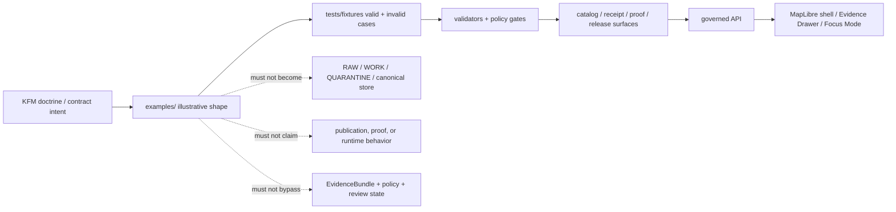

<!-- [KFM_META_BLOCK_V2]
doc_id: kfm://doc/NEEDS_VERIFICATION__examples_readme
title: Examples
type: standard
version: v1
status: draft
owners: NEEDS_VERIFICATION__owner_or_team
created: NEEDS_VERIFICATION__YYYY-MM-DD
updated: NEEDS_VERIFICATION__YYYY-MM-DD
policy_label: NEEDS_VERIFICATION__public_or_internal
related: [../README.md, ../docs/README.md, ../schemas/README.md, ../contracts/README.md, ../policy/README.md, ../tests/README.md, ../data/README.md, ../tools/README.md]
tags: [kfm, examples, documentation, fixtures, evidence, governance]
notes: [Target path requested as examples/README.md; no mounted repository tree was available in this session, so owners, dates, policy label, adjacent links, and child inventory remain NEEDS VERIFICATION before merge.]
[/KFM_META_BLOCK_V2] -->

<a id="top"></a>

# Examples

Human-readable, public-safe examples for understanding KFM object shapes, governed flows, and trust boundaries without treating examples as evidence, fixtures, source data, or release proof.

> [!IMPORTANT]
> **Status:** `experimental`  
> **Owners:** `NEEDS_VERIFICATION__owner_or_team`  
> **Path:** `examples/README.md`  
> **Authority:** README-like standard doc for the `examples/` directory; child inventory is **NEEDS VERIFICATION** in the active checkout.  
> **Quick jumps:** [Scope](#scope) · [Repo fit](#repo-fit) · [Accepted inputs](#accepted-inputs) · [Exclusions](#exclusions) · [Directory tree](#directory-tree) · [Quickstart](#quickstart) · [Usage](#usage) · [Diagram](#diagram) · [Operating tables](#operating-tables) · [Definition of done](#definition-of-done) · [FAQ](#faq) · [Appendix](#appendix)

<div align="left">


</div>

---

## Scope

`examples/` is the low-risk, human-facing place for **small illustrative artifacts** that make KFM easier to understand and review.

It should help contributors see how a `SourceDescriptor`, `EvidenceBundle`, `DecisionEnvelope`, `LayerManifest`, `FocusModePayload`, Story Node binding, MapLibre source/layer fragment, or promotion dry-run payload is expected to *look* before that shape is promoted into schemas, tests, policy, or release artifacts.

It must not become a shortcut around the KFM truth path:

```text
RAW -> WORK / QUARANTINE -> PROCESSED -> CATALOG / TRIPLET -> PUBLISHED
```

> [!WARNING]
> Examples are not canonical records. They do not prove source authority, publication readiness, policy clearance, validator coverage, runtime behavior, or release state.

[Back to top](#top)

---

## Repo fit

| Relation | Surface | Status | Why it matters |
|---|---|---:|---|
| Current path | `examples/README.md` | **PROPOSED / requested** | Defines the directory contract for examples. |
| Upstream | [`../README.md`](../README.md) | **NEEDS VERIFICATION** | Root orientation should point readers to canon, evidence posture, and repo-wide trust rules. |
| Upstream | [`../docs/README.md`](../docs/README.md) | **NEEDS VERIFICATION** | Doctrine, standards, runbooks, ADRs, and documentation control should live in docs. |
| Upstream | [`../schemas/README.md`](../schemas/README.md) | **NEEDS VERIFICATION** | Machine-readable schema authority belongs outside examples. |
| Upstream | [`../contracts/README.md`](../contracts/README.md) | **NEEDS VERIFICATION** | API/runtime/payload contracts should not be redefined here. |
| Upstream | [`../policy/README.md`](../policy/README.md) | **NEEDS VERIFICATION** | Deny, quarantine, redaction, rights, sensitivity, and publication rules belong in policy. |
| Adjacent verification | [`../tests/README.md`](../tests/README.md) | **NEEDS VERIFICATION** | Valid/invalid fixtures and regression tests belong under tests, not examples. |
| Adjacent lifecycle | [`../data/README.md`](../data/README.md) | **NEEDS VERIFICATION** | RAW, WORK, QUARANTINE, PROCESSED, CATALOG, receipts, proofs, and published artifacts belong under governed data/release homes. |
| Adjacent tooling | [`../tools/README.md`](../tools/README.md) | **NEEDS VERIFICATION** | Validators, checkers, renderers, and promotion helpers should live in tools. |

> [!NOTE]
> If the active repository uses different homes, update this README through an ADR or local documentation convention rather than silently preserving broken links.

[Back to top](#top)

---

## Accepted inputs

Examples may include small, public-safe, non-authoritative files that clarify object grammar or contributor expectations.

| Accepted input | Allowed here when… | Typical status |
|---|---|---:|
| `*.example.json` / `*.example.yaml` | The file is tiny, synthetic or redacted, and clearly illustrative. | **PROPOSED** |
| Source descriptor sketches | They show source role, access posture, rights posture, and inactive/default-safe status. | **PROPOSED** |
| Evidence object sketches | They demonstrate citation/evidence shape without claiming real EvidenceBundle resolution. | **PROPOSED** |
| Runtime envelope examples | They show finite outcomes such as `ANSWER`, `ABSTAIN`, `DENY`, or `ERROR` without calling a model. | **PROPOSED** |
| MapLibre source/layer fragments | They clarify renderer/spec boundaries and point only to safe placeholder or released artifact URIs. | **PROPOSED** |
| Story Node / Focus Mode payload sketches | They show trust-visible UI payload shape without becoming UI state. | **PROPOSED** |
| Promotion dry-run examples | They demonstrate review payload shape without creating receipts, proofs, catalogs, or release state. | **PROPOSED** |
| README-local snippets | They help humans copy a safe pattern into the correct repo surface. | **PROPOSED** |

Examples should be boringly safe: small enough to review in a diff, explicit about uncertainty, and impossible to confuse with source data.

[Back to top](#top)

---

## Exclusions

Do **not** put these in `examples/`.

| Excluded content | Goes instead | Why |
|---|---|---|
| RAW provider downloads, mirrors, scraped pages, or bulk extracts | `../data/raw/` or source-specific governed intake path | Examples are not data custody. |
| WORK or QUARANTINE candidates | `../data/work/` or `../data/quarantine/` | Examples must not bypass validation or sensitivity review. |
| Published artifacts, PMTiles, COGs, STAC items, DCAT records, PROV bundles, release manifests | Governed catalog/proof/published homes | Publication is a governed state transition, not an example copy. |
| Receipts, proofs, attestations, correction notices, rollback references | Receipt/proof/release homes | Process memory and proof objects must stay distinct. |
| Valid/invalid test fixtures | `../tests/fixtures/` | Fixtures prove behavior; examples teach shape. |
| Secrets, tokens, API keys, cookies, local credentials, private URLs | Nowhere in repo | Secrets must never enter examples. |
| Sensitive exact locations | Governed restricted lane after policy review | Archaeology, rare species, cultural, critical infrastructure, private/living-person, and similar locations fail closed. |
| Live emergency, medical, legal, or life-safety guidance | Official systems and governed contextual docs | KFM examples are not operational alerts or professional advice. |
| Generated model output as truth | Governed AI response fixtures or review artifacts | AI is interpretive; EvidenceBundle and policy outrank generated language. |
| Production pipeline scripts | `../tools/`, `../pipelines/`, or app-native homes | Examples should not become unreviewed automation. |

> [!CAUTION]
> A file that starts as an example can become evidence only after it moves through the correct contract, fixture, validation, policy, catalog, proof, review, and promotion surfaces.

[Back to top](#top)

---

## Directory tree

The child structure below is a **proposed orientation map**, not a confirmed inventory.

```text
examples/
├── README.md
├── source-descriptors/
│   └── README.md                       # PROPOSED: inactive source admission sketches
├── evidence/
│   └── README.md                       # PROPOSED: EvidenceBundle / DecisionEnvelope shape sketches
├── runtime/
│   └── README.md                       # PROPOSED: finite runtime envelope sketches
├── maplibre/
│   └── README.md                       # PROPOSED: source/layer/style fragments, no production tiles
├── promotion/
│   └── README.md                       # PROPOSED: review and dry-run examples, not receipts/proofs
├── stories/
│   └── README.md                       # PROPOSED: Story Node and Focus Mode payload examples
└── _archive/
    └── README.md                       # PROPOSED: deprecated examples retained only with successor notes
```

Start with this `README.md` only unless the active branch already contains child examples. Add child directories only when at least one example is small, reviewed, and linked to its intended downstream home.

[Back to top](#top)

---

## Quickstart

Use `examples/` first as a reading surface.

```bash
# Safe inventory only. This does not validate semantics or prove release state.
find examples -maxdepth 3 -type f | sort
```

When repo-native validators exist, prefer the project’s documented command. The placeholder below is intentionally not claimed as current implementation.

```text
NEEDS VERIFICATION:
make validate-examples
```

Before copying an example into a real contract, fixture, data lane, or release workflow, answer:

1. What KFM object family does this illustrate?
2. What schema or contract should own the machine-readable shape?
3. What test fixture should prove the valid and invalid cases?
4. What policy gate would deny or quarantine unsafe variants?
5. What receipt, proof, catalog, or release object would exist outside examples if this became real?

[Back to top](#top)

---

## Usage

### Add a new example

1. Choose the narrowest object family.
2. Use a filename that says it is an example.
3. Keep the payload small and public-safe.
4. Include a short `README.md` in the child directory when the example family needs context.
5. Link to the intended schema, contract, policy, validator, or fixture home.
6. Mark unresolved values with `NEEDS_VERIFICATION`, not plausible guesses.
7. Add a companion valid/invalid fixture under `../tests/fixtures/` only when behavior needs to be enforced.

Recommended filename pattern:

```text
<object-family>__<scenario>__example.<json|yaml|geojson|md>
```

Examples:

```text
source_descriptor__wbd_huc12__example.yaml
decision_envelope__abstain_missing_evidence__example.json
maplibre_layer__released_pmtiles_source__example.json
focus_mode_payload__answer_with_citations__example.json
promotion_review_payload__hold_for_rights__example.json
```

### Promote an example into a tested fixture

Do not edit the example into a fixture in place. Copy the smallest useful shape into the fixture home and make its role explicit.

| Step | Example home | Fixture / proof home |
|---|---|---|
| Teach shape | `examples/evidence/decision_envelope__abstain_missing_evidence__example.json` | Not authoritative |
| Prove valid behavior | `../tests/fixtures/evidence/decision_envelope__abstain_missing_evidence__valid.json` | Test fixture |
| Prove invalid behavior | `../tests/fixtures/evidence/decision_envelope__unknown_outcome__invalid.json` | Test fixture |
| Record process memory | Receipt home | Not owned here |
| Record release proof | Proof/release home | Not owned here |

[Back to top](#top)

---

## Diagram


```mermaid
flowchart LR
  A["KFM doctrine / contract intent"] --> B["examples/ illustrative shape"]
  B --> C["tests/fixtures valid + invalid cases"]
  C --> D["validators + policy gates"]
  D --> E["catalog / receipt / proof / release surfaces"]

  B -. "must not become" .-> X["RAW / WORK / QUARANTINE / canonical store"]
  B -. "must not claim" .-> Y["publication, proof, or runtime behavior"]
  B -. "must not bypass" .-> Z["EvidenceBundle + policy + review state"]

  E --> F["governed API"]
  F --> G["MapLibre shell / Evidence Drawer / Focus Mode"]
```

This flow is intentionally asymmetric. Examples can inspire fixtures and contracts, but they cannot shortcut the governed lifecycle.

[Back to top](#top)

---

## Operating tables

### Example status labels

| Label | Use in `examples/` |
|---|---|
| **CONFIRMED** | Use only for facts directly verified in the active branch or attached source being summarized. |
| **INFERRED** | Use when the branch evidence strongly suggests a relationship but does not prove it. |
| **PROPOSED** | Use for new examples, directory shapes, or naming conventions not yet enforced. |
| **UNKNOWN** | Use when the repo, source, owner, validator, rights, or runtime state is not verified. |
| **NEEDS VERIFICATION** | Use for checkable placeholders that must be resolved before merge or promotion. |

### Boundary checklist

| Question | Required answer |
|---|---|
| Does this file contain real source data? | No. |
| Does this file contain secrets or credentials? | No. |
| Does this file expose sensitive exact locations? | No. |
| Does this file claim publication or proof status? | No. |
| Does this file point directly at RAW, WORK, QUARANTINE, or canonical stores? | No. |
| Does this file have an intended schema/contract/policy/fixture destination? | Yes, or explicitly `UNKNOWN`. |
| Is every uncertainty visible in the file or README? | Yes. |

### Where common example families belong

| Example family | Recommended child path | Downstream owner |
|---|---|---|
| Source admission sketch | `examples/source-descriptors/` | `../schemas/`, `../contracts/`, `../policy/`, `../tests/fixtures/` |
| Evidence object sketch | `examples/evidence/` | Evidence schemas, citation validators, Evidence Drawer payload tests |
| Runtime response sketch | `examples/runtime/` | Runtime envelope schema, governed AI tests, API contract tests |
| Map layer/style sketch | `examples/maplibre/` | Layer manifest schema, UI trust-state tests, released artifact registry |
| Promotion review sketch | `examples/promotion/` | Review/promotion validators, receipt/proof/release homes |
| Story or Focus Mode sketch | `examples/stories/` | UI contract, Evidence Drawer, Focus Mode, policy postcheck |

[Back to top](#top)

---

## Definition of done

A change to `examples/` is ready for review when:

- [ ] The example is visibly labeled as illustrative, synthetic, redacted, or public-safe.
- [ ] The file name includes `example` or the directory README states the example-only status.
- [ ] No raw provider data, secrets, tokens, restricted identifiers, or sensitive exact coordinates are present.
- [ ] The example does not claim to be a receipt, proof, catalog object, release artifact, or canonical record.
- [ ] The intended schema, contract, policy, validator, or fixture destination is linked or marked `NEEDS VERIFICATION`.
- [ ] If the example demonstrates an outcome, the finite outcome vocabulary is explicit.
- [ ] If the example demonstrates a source, the source role and rights posture are explicit.
- [ ] If the example demonstrates a map layer, the renderer/spec/data boundary is explicit.
- [ ] If the example demonstrates AI or Focus Mode, EvidenceBundle and policy dependency are explicit.
- [ ] Any child README includes a KFM Meta Block V2, status, owner, path, quick jumps, accepted inputs, and exclusions.
- [ ] Links are checked from the active branch before merge.
- [ ] A maintainer can delete the example without changing canonical truth, data custody, release state, or public behavior.

[Back to top](#top)

---

## FAQ

### Why have `examples/` if `tests/fixtures/` already exists?

Because examples and fixtures do different jobs. Examples help humans understand shape and intent. Fixtures make validators, policies, contracts, and runtime behavior testable.

### Can an example use a real public source name?

Yes, when the source name clarifies the pattern and the file does not mirror provider data, imply activation, or bypass source-role review. Use `NEEDS_VERIFICATION` for rights, cadence, endpoint, and automation details unless they are directly verified.

### Can examples include GeoJSON?

Yes, but only tiny synthetic or generalized geometry. Do not include sensitive exact locations or real unpublished candidate features.

### Can examples be copied into docs?

Yes, but keep one canonical explanation. If a long example is needed in docs, prefer linking back to this directory or to a specific child README.

### Can examples be used by CI?

Only as documentation smoke material unless a repo-native validator explicitly treats them as example examples. Valid/invalid behavior belongs in `tests/fixtures/`.

### Does this README prove that `examples/` currently contains child directories?

No. The tree is proposed until confirmed in the active repository checkout.

[Back to top](#top)

---

## Appendix

<details>
<summary><strong>Illustrative example card template</strong></summary>

Use this card in child READMEs when adding a new example family.

```yaml
example_card:
  example_id: NEEDS_VERIFICATION__stable_example_id
  path: examples/<family>/<object-family>__<scenario>__example.yaml
  status: PROPOSED
  purpose: "Teach object shape without becoming evidence or a fixture."

  object_family:
    name: NEEDS_VERIFICATION__SourceDescriptor_or_EvidenceBundle_or_other
    intended_schema: ../schemas/NEEDS_VERIFICATION
    intended_contract: ../contracts/NEEDS_VERIFICATION

  safety:
    contains_real_source_data: false
    contains_secrets: false
    contains_sensitive_exact_location: false
    public_safe: true

  boundaries:
    not_a_fixture: true
    not_a_receipt: true
    not_a_proof: true
    not_a_catalog_record: true
    not_a_release_artifact: true
    not_canonical_truth: true

  review:
    owner: NEEDS_VERIFICATION__owner_or_team
    next_step: "Promote the smallest useful valid/invalid cases into tests/fixtures if enforcement is needed."
```

</details>

<details>
<summary><strong>Illustrative source descriptor sketch</strong></summary>

This sketch is intentionally incomplete. It demonstrates safe labeling, not a runnable source connector.

```yaml
version: v1
kind: SourceDescriptor
status: illustrative_only

identity:
  source_id: NEEDS_VERIFICATION__example_source
  title: Example Source
  provider: Example Provider

role_and_scope:
  source_role: NEEDS_VERIFICATION__source_role
  primary_lane: NEEDS_VERIFICATION__domain_lane
  publication_intent: example_only

access:
  mode: no_live_access
  auth_model: none
  notes:
    - "No network request should be made from this example."

rights_and_sensitivity:
  redistribution_posture: NEEDS_VERIFICATION
  sensitivity_posture: public_safe_synthetic
  public_use_with_citation: NEEDS_VERIFICATION

validation:
  required_checks:
    - source_identity_present
    - source_role_explicit
    - rights_posture_explicit
    - no_live_connector_claim
    - no_sensitive_geometry
```

</details>

<details>
<summary><strong>Illustrative decision envelope sketch</strong></summary>

```json
{
  "version": "v1",
  "kind": "DecisionEnvelope",
  "status": "illustrative_only",
  "outcome": "ABSTAIN",
  "reason_codes": [
    "missing_evidence_bundle",
    "source_role_not_verified"
  ],
  "evidence_refs": [],
  "policy": {
    "decision": "hold",
    "reason": "Example cannot answer without resolved evidence and policy state."
  },
  "notes": [
    "This is not runtime output.",
    "This is not a proof object.",
    "This is not a publication decision."
  ]
}
```

</details>

[Back to top](#top)
