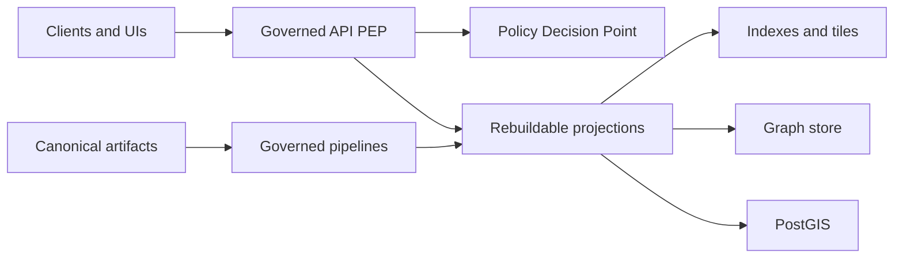
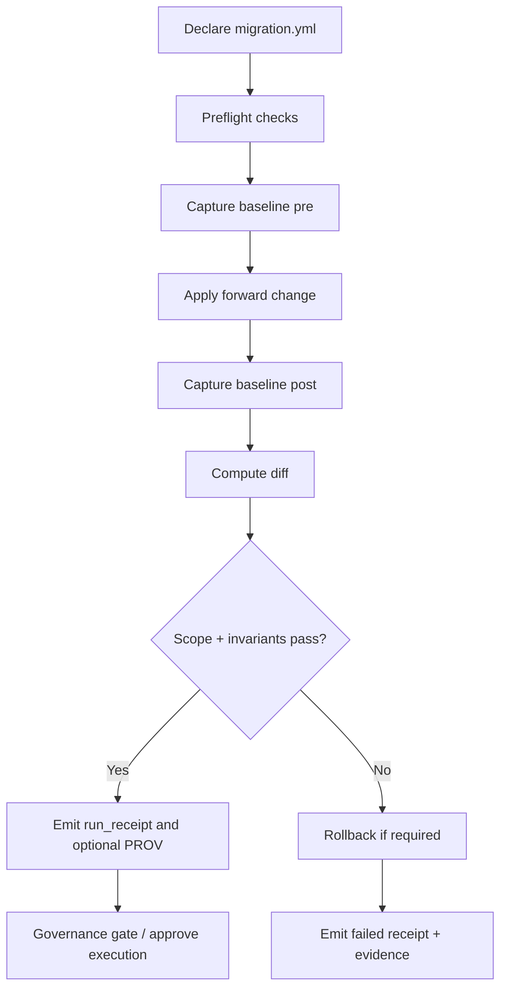

<!-- [KFM_META_BLOCK_V2]
doc_id: kfm://doc/46a7276e-762c-48b6-9731-f13d3f0db4fb
title: migrations/README — Governed migrations (schema, projections, graph)
type: standard
version: v2
status: draft
owners: TBD (set via CODEOWNERS)
created: 2026-02-22
updated: 2026-03-02
policy_label: public
related:
  - ../README.md
  - ../docs/
  - ../contracts/
  - ../configs/
  - ../data/
tags:
  - kfm
  - migrations
  - governance
  - rollback
  - receipts
  - prov
notes:
  - Defines how migrations are declared, reviewed, executed, validated, and rolled back.
  - Aligns migrations to KFM invariants: trust membrane, fail-closed promotion posture, canonical vs rebuildable, deterministic receipts.
  - If uncertain: fail closed, emit receipts, and require governance review.
[/KFM_META_BLOCK_V2] -->

<a id="top"></a>

# migrations/ — Governed migrations for rebuildable stores
Governed, reversible changes to **rebuildable projections** (schemas, constraints, indexes, search mappings, graph shape) with **declared scope**, **baselines + diffs**, **run receipts**, and **rollback artifacts**.


**Owners:** TBD (prefer enforced by `CODEOWNERS`, if configured)  
**Status:** Draft (this doc is a repo-facing contract; tighten as enforcement hardens)  
**Principles:** map-first • time-aware • governed • evidence-first • cite-or-abstain

> [!IMPORTANT]
> This directory exists to make “high-impact mutations” **reviewable, auditable, and reversible**.
> If any required contract artifact is missing/invalid → **fail closed**.

> [!WARNING]
> Migrations do **not** define canonical truth. Canonical truth lives in governed artifacts (zones + catalogs + provenance).
> Migrations may only mutate **rebuildable stores** that can be reconstructed from promoted artifacts.

> [!NOTE]
> This README is **normative about guarantees** (scope limits, baselines+diffs, receipts, rollback posture).
> Specific path layouts/tool names are **illustrative** unless verified in the live repo. Adapt paths without weakening guarantees.

---

## Quick navigation
- [Directory contract](#directory-contract)
- [Trust boundary and “rebuildable” meaning](#trust-boundary-and-rebuildable-meaning)
- [When to use a migration](#when-to-use-a-migration)
- [Non-negotiables](#non-negotiables)
- [Guarantees and enforcement map](#guarantees-and-enforcement-map)
- [Directory layout](#directory-layout)
- [Migration bundle contract](#migration-bundle-contract)
- [Migration declaration contract](#migration-declaration-contract)
- [Scope, limits, and protected domains](#scope-limits-and-protected-domains)
- [Baselines and diffs](#baselines-and-diffs)
- [Invariant checks](#invariant-checks)
- [CI and automation gates](#ci-and-automation-gates)
- [Rollback artifacts](#rollback-artifacts)
- [Run receipts and provenance](#run-receipts-and-provenance)
- [Migration types](#migration-types)
  - [PostGIS migrations](#postgis-migrations)
  - [Search/index migrations](#searchindex-migrations)
  - [Graph migrations](#graph-migrations)
- [How to add a migration](#how-to-add-a-migration)
- [Definition of Done](#definition-of-done)
- [PR checklist](#pr-checklist)
- [Troubleshooting](#troubleshooting)
- [Glossary](#glossary)
- [Appendix](#appendix)

---

## Directory contract

### Purpose
`migrations/` defines how we perform **governed mutations** to rebuildable stores—especially when:

- sequencing matters,
- rollback must be possible,
- blast radius must be bounded,
- policy + invariants must be enforced,
- we need durable receipts for audit/repro.

A “migration” is any controlled change that intentionally mutates:
- schemas/constraints/indexes in a relational store (e.g., PostGIS)
- search/index structures (mappings, analyzers, vector schema, reindex flows)
- graph shape (labels, relationships, constraints, ontology) when a graph is used
- backfills that are not safely handled by “re-run the deterministic pipeline”

### Where migrations fit in the repo
- This directory **does not** define canonical truth. Canonical truth is produced through governed pipelines and promotion gates.
- This directory defines controlled mutations to **runtime-facing projections** and **rebuildable stores**.

### What belongs here
✅ Machine-declared migration bundles with:
- **declared scope** (allowed + forbidden)
- **limits** (blast radius budgets)
- **pre/post baselines**
- **diff outputs**
- **validation + invariant checks**
- **rollback artifacts** (default) or explicit, approved irreversibility
- **run receipts** and optional **PROV** bundles

✅ Deterministic helpers that support migration safety (plan/diff/check), if repo-standard.

### What must not go here
❌ Secrets, credentials, tokens, kubeconfigs  
❌ Raw or sensitive dataset payloads  
❌ One-off “operator scripts” without declarations, receipts, and rollback posture  
❌ Mutations to **canonical truth zones** (RAW/WORK/PROCESSED/CATALOG). Those are governed by pipelines + promotion gates.

> [!IMPORTANT]
> In KFM, PostGIS/search/graph/tiles are **rebuildable projections**.
> Migrations must preserve the ability to reconstruct projections from canonical artifacts.

[Back to top](#top)

---

## Trust boundary and rebuildable meaning

KFM’s trust posture requires a “trust membrane”: **clients never hit databases directly; everything flows through governed APIs + policy**.


```mermaid
flowchart LR
  U[Clients and UIs] --> PEP[Governed API PEP]
  PEP --> PDP[Policy Decision Point]
  PEP --> PROJ[Rebuildable projections]
  PROJ --> IDX[Indexes and tiles]
  PROJ --> G[Graph store]
  PROJ --> PG[PostGIS]
  CAN[Canonical artifacts] --> PIPE[Governed pipelines]
  PIPE --> PROJ
```

**Practical implications**
- Migrations are allowed to mutate **rebuildable projections** only.
- Migrations MUST NOT:
  - bypass policy boundaries,
  - mutate canonical zones,
  - break deterministic rebuildability from promoted artifacts,
  - “patch reality” without producing receipts and evidence.

[Back to top](#top)

---

## When to use a migration

Prefer pipelines over migrations when possible.

Use a migration when:
- the change must mutate a rebuildable store in-place (schema/index/constraint/mapping/graph shape)
- the change requires controlled sequencing and rollback
- the change has non-trivial blast radius that must be declared + reviewed
- the change is needed to restore invariant correctness

Do **not** use a migration when:
- you can re-derive the projection by replaying canonical artifacts (preferred)
- you can roll out a new versioned projection side-by-side and flip consumers safely

> [!RULE]
> If you can re-run deterministically from immutable inputs, **do that**.
> Migrations are for what cannot be safely re-derived without an explicit change plan.

[Back to top](#top)

---

## Non-negotiables

1. **Fail closed.** If validation, policy, invariant checks, or receipts fail → do not proceed; rollback if needed.
2. **Contract-first.** Declarations, baselines, diffs, and receipts MUST validate against versioned schemas.
3. **Scope is declared upfront.** Every migration declares what it is allowed to touch and what is forbidden.
4. **Baseline + diff required.** Capture pre/post state and compute deltas; reviewers must see blast radius.
5. **Rollback by default.** Irreversible changes require explicit governance approval + alternative safety strategy.
6. **Receipts always.** Every execution emits a run receipt (and optionally PROV) for attribution and auditability.
7. **Protected domains are a hard stop.** Governance-protected namespaces must not change without explicit approval.
8. **Policy-safe outputs.** Diffs/receipts/logs must not leak secrets, PII, or restricted location details.
9. **Deterministic identity.** Artifacts MUST be content-addressed (digests) so receipts can be independently verified.
10. **Never rewrite history.** Do not delete or mutate already-merged migration bundles; supersede them.

[Back to top](#top)

---

## Guarantees and enforcement map

This is the “trust membrane” for migrations: the guarantees we promise, how they are enforced, and what evidence proves enforcement.

| Guarantee | Enforced by | Evidence artifact(s) |
|---|---|---|
| Only declared scope is touched | Runner preflight + diff-vs-declaration gate | `migration.yml`, `diffs/summary.json` |
| Protected domains never change | Policy gate + protected fingerprint check | `baselines/pre.json`, `baselines/post.json`, `diffs/summary.json` |
| Rollback possible (default) | CI gate blocks missing rollback | `rollback.*`, `notes.md` |
| Blast radius is bounded | Limits gate blocks overruns | `migration.yml:limits`, `diffs/summary.json` |
| Execution is attributable + reproducible | Receipt schema validation + digest verification | `receipts/run_receipt.json` or `receipts/receipt_ref.json` |
| No secrets / restricted coords in artifacts | Secrets scan + policy scan | CI logs + validator reports |
| Deterministic artifact identity | Hashing tool + “golden hash” tests | digests in receipt + optional manifest |
| CI and runtime policy semantics match | Shared policy pack + fixtures | policy fixtures + CI results |

> [!RULE]
> If CI cannot enforce a guarantee described in this README, either (a) add enforcement, or (b) downgrade the text from MUST → SHOULD with an explicit justification.

[Back to top](#top)

---

## Directory layout

> [!NOTE]
> This is a **recommended contract layout** aligned to a “registry + schemas + fixtures” pattern.
> If your repo differs, update this section to match reality **while preserving guarantees**.

```text
migrations/                                                   # Governed migrations + receipts
├─ README.md                                                  # This file
│
├─ registry/                                                  # Machine-readable registries + schemas + fixtures (CI-friendly)
│  ├─ migrations.v1.json                                      # Canonical registry (ids, types, owners, status)
│  ├─ protected_domains.v1.yml                                # Protected namespaces/labels (deny by default)
│  ├─ schemas/                                                # Schemas that validate declarations + artifacts
│  │  ├─ migration_declaration.v1.schema.json                 # Schema for migration.yml
│  │  ├─ run_receipt.v1.schema.json                           # Schema for receipts/run_receipt.json
│  │  ├─ baseline.v1.schema.json                              # Schema for baselines/*.json
│  │  ├─ diff_summary.v1.schema.json                          # Schema for diffs/summary.json
│  │  └─ receipt_ref.v1.schema.json                           # Pointer record if receipts stored outside git
│  └─ fixtures/                                               # CI fixtures (valid/invalid; deterministic)
│     ├─ valid/
│     └─ invalid/
│
├─ postgis/                                                   # PostGIS migrations (if PostGIS is used)
│  ├─ README.md
│  ├─ PG-MIG-YYYY-MM-DD-01/
│  │  ├─ migration.yml
│  │  ├─ forward.sql
│  │  ├─ rollback.sql
│  │  ├─ baselines/
│  │  │  ├─ pre.json
│  │  │  └─ post.json
│  │  ├─ diffs/
│  │  │  ├─ summary.json
│  │  │  └─ touched.csv
│  │  ├─ receipts/
│  │  │  ├─ run_receipt.json
│  │  │  ├─ prov.jsonld
│  │  │  └─ receipt_ref.json
│  │  └─ notes.md
│  └─ ...
│
├─ search/                                                    # Search/index migrations (if search is used)
│  ├─ README.md
│  ├─ SEARCH-MIG-YYYY-MM-DD-01/
│  │  ├─ migration.yml
│  │  ├─ forward.json
│  │  ├─ rollback.json
│  │  ├─ baselines/
│  │  ├─ diffs/
│  │  ├─ receipts/
│  │  └─ notes.md
│  └─ ...
│
└─ graph/                                                     # Graph migrations (if graph DB is used)
   ├─ README.md
   ├─ GRAPH-MIG-YYYY-MM-DD-01/
   │  ├─ migration.yml
   │  ├─ forward.cypher
   │  ├─ rollback.cypher
   │  ├─ baselines/
   │  ├─ diffs/
   │  ├─ receipts/
   │  └─ notes.md
   └─ ...
```

> [!TIP]
> Keep git-committed artifacts small and policy-safe. For production runs, prefer storing receipts and large baseline blobs in an immutable artifact store and committing only `receipt_ref.json` pointers.

[Back to top](#top)

---

## Migration bundle contract

Every migration is a **bundle**: declaration + change plan + observed evidence.

### Required files (all types)

| File | Required? | Why it exists |
|---|---:|---|
| `migration.yml` | MUST | Machine-readable declaration (scope, limits, rollback posture, approvals) |
| `notes.md` | SHOULD | Human context (risk, rollout plan, review guidance, rollback checks) |
| `baselines/pre.json` | MUST | Snapshot before applying change |
| `baselines/post.json` | MUST | Snapshot after applying change |
| `diffs/summary.json` | MUST | Machine-readable diff (declared vs observed; limits gate) |
| `receipts/run_receipt.json` OR `receipts/receipt_ref.json` | MUST (for executions) | Audit + reproducibility evidence |

### Type-specific “forward / rollback” files

| Type | Forward | Rollback |
|---|---|---|
| PostGIS | `forward.sql` | `rollback.sql` (required if `requires_rollback: true`) |
| Search/index | `forward.json` (mapping/settings/reindex plan) | `rollback.json` (restore/alias/retain old index) |
| Graph | `forward.cypher` | `rollback.cypher` (or approved irreversibility) |

> [!IMPORTANT]
> Bundles are immutable once merged. If you need a correction, add a new migration that supersedes the previous one.

[Back to top](#top)

---

## Migration declaration contract

Each migration directory MUST include a machine-readable `migration.yml`.

### Normative keywords
- **MUST** = required to merge/run
- **SHOULD** = strongly recommended; justify exceptions
- **MAY** = optional

### Minimum fields (v1; extend as needed)

- `migration_id` (stable, unique, never reused)
- `type` (`postgis` | `search` | `graph` | `other`)
- `intent` (plain-language)
- `scope` (allowed + forbidden)
- `limits` (blast-radius caps)
- `requires_rollback` (boolean)
- `approvals` (routing rules or labels)
- `runner` (how executed; command/tool reference)
- `artifacts` (expected forward/rollback/baseline/diff paths)
- `depends_on` (optional but recommended) — declare ordering dependencies
- `rebuild_plan` (recommended) — how to rebuild projection from promoted artifacts

### Example `migration.yml`

```yaml
migration_id: PG-MIG-2026-02-28-01
type: postgis
intent: "Add spatial index to parcels to improve map query performance"

depends_on: []  # migration IDs this must run after (if any)

scope:
  allowed_schemas: ["public"]
  allowed_tables: ["parcels"]
  allowed_operations: ["DDL"]         # DDL|DML|REINDEX|BACKFILL
  forbidden_schemas: ["governance", "audit"]
  forbidden_tables: ["authority_sites"]

limits:
  max_table_count_touched: 1
  max_index_count_delta: 2
  max_constraint_count_delta: 0
  max_row_backfill: 0

requires_rollback: true

approvals:
  change_class: governance-critical
  required_reviewers:
    - kfm-platform
    - kfm-governance

runner:
  tool: "psql"                  # or flyway/alembic/etc.
  command: "scripts/migrate.sh" # repo-standard wrapper, if present
  environment_refs:
    - KFM_DB_DSN_REF             # secret reference name; not the secret value

rebuild_plan:
  statement: "This change is rebuildable by re-running indexers against the promoted parcels artifacts."
  affected_projection: "postgis.public.parcels"
  safe_rebuild: true

artifacts:
  forward: ["forward.sql"]
  rollback: ["rollback.sql"]
  baselines:
    pre: "baselines/pre.json"
    post: "baselines/post.json"
  diffs:
    summary: "diffs/summary.json"
```

> [!IMPORTANT]
> “Scope” is not documentation — it is a **limit** enforced by CI and/or the migration runner.
> If scope can’t be enforced, treat the migration as incomplete and fail closed.

[Back to top](#top)

---

## Scope, limits, and protected domains

### Scope = allowed surface, forbidden surface, and allowed operations

Scope MUST be strict enough that:
- the runner can prevent forbidden actions, OR
- the post-run diff can detect forbidden actions and force rollback.

Recommended scope dimensions:
- object namespace: schema/index/label/relationship type
- object set: explicit allowlists or glob patterns
- operation class: DDL vs DML vs reindex vs backfill
- environment constraints: dev/stage/prod allow/deny (optional)

### Protected domains
Protected domains are governance-sensitive objects that require explicit approval to mutate.
Examples:
- governance schemas/namespaces
- audit tables/ledgers
- authority / restricted site registries
- policy packs and enforcement surfaces

> [!RULE]
> If a migration would touch a protected domain, treat it as a governance event:
> - require explicit approval reference,
> - increase review requirements,
> - strengthen baseline + diff reporting.

### Limits (blast radius budgets)
Limits SHOULD be conservative and measurable:
- count deltas (tables/indexes/constraints, nodes/rels, indices/mappings)
- backfill row caps
- reindex plan constraints (e.g., must be alias-based)
- graph rewrite caps (label/relationship deltas)

> [!RULE]
> If observed diffs exceed declared limits → **fail** and require rollback or explicitly approved exception.

[Back to top](#top)

---

## Baselines and diffs

Every migration MUST capture **pre** and **post** baselines and produce a diff.

Baseline goals:
- detect unintended mutations even when “it seems fine”
- provide reviewers a predictable blast-radius summary
- make rollback verification possible
- enable receipts to be independently verified via digests

### Minimum baseline fields (recommended)
- object counts:
  - PostGIS: tables, columns, indexes, constraints
  - Search: indices, aliases, mappings digest, settings digest
  - Graph: nodes, relationships, constraints/indexes, label counts
- schema/definition fingerprint (hash of definitions)
- protected domain fingerprint (hash over protected objects)
- policy-safe performance stats (optional, non-sensitive)

### Diff outputs (required)
- `diffs/summary.json` (machine-readable, CI-enforced)
- `diffs/touched.csv` (optional reviewer-friendly list)
- (graph) optional `diffs/temporal.json` (recommended) — structural deltas to help reviewers reason about blast radius

[Back to top](#top)

---

## Invariant checks

Migrations must not violate KFM invariants. CI (and preflight locally) should enforce:

### Global invariants
- no secret leakage in artifacts/receipts
- no policy bypass (trust membrane intact)
- no mutation of protected domains without explicit approval
- artifacts are deterministic and content-addressable (digests match)

### Store-specific invariants (examples)

**PostGIS**
- required constraints exist
- spatial indexes present where required
- migrations are ordered and idempotent where possible
- backfills are bounded and observable (rows affected within declared limits)

**Search**
- mapping changes are versioned
- reindex plan is explicit (source index, destination index, alias plan)
- alias flips are audited
- rollback strategy exists (old index retained) unless explicitly approved

**Graph**
- ontology constraints preserved (exclusive labels, required relationships)
- protected/authority nodes unchanged unless explicitly approved
- blast radius enforced against declared label/relationship limits
- structural fingerprints reviewed (counts + constraint digests + protected-node hashes)

> [!TIP]
> Treat invariant checks as contract tests: deterministic, CI-enforced, and fail-closed.

[Back to top](#top)

---

## CI and automation gates

Migrations are high-impact. CI should block merges when any required artifact is missing or any contract check fails.

### Minimum CI gates (must be merge-blocking)

1. **Declaration schema validation**
   - Validate `migration.yml` against `registry/schemas/migration_declaration.*.schema.json`.

2. **Secrets and policy-safe artifact scan**
   - Fail on secrets, credentials, raw DSNs, or restricted coordinates in committed artifacts.

3. **Scope + limits enforcement**
   - Compare `diffs/summary.json` (observed) to `migration.yml` (declared) and fail on mismatch.

4. **Invariant checks**
   - Run store-specific checks (constraints/indexes/ontology rules).

5. **Rollback posture**
   - If `requires_rollback: true`, fail if rollback file is missing.
   - If irreversible, require explicit approval reference and documented safety strategy.

6. **Receipt schema validation (when receipts are present)**
   - Validate `receipts/run_receipt.json` (or `receipt_ref.json`) against schema.

### Recommended CI additions (strongly preferred)
- **Dry-run plan artifact** (`plan.json` or equivalent) produced by the runner and reviewed in PR
- **Fixture tests** that demonstrate allow/deny behavior for scope and policy checks
- **Deterministic runner pinning** (e.g., container digest) so “same inputs → same outputs” is auditable

[Back to top](#top)

---

## Rollback artifacts

Rollback is required by default.

If `requires_rollback: true`, the migration bundle MUST include:
- a rollback script (`rollback.sql`, `rollback.json`, `rollback.cypher`, etc.)
- rollback verification notes (what to check after rollback)
- baseline/diff artifacts sufficient to confirm rollback correctness

If a migration is **not** reversible:
- set `requires_rollback: false`
- document why in `notes.md`
- include governance approval reference (issue/ADR/decision record)
- include an alternative safety strategy (e.g., blue/green, alias flip, dual-write, shadow index)

> [!WARNING]
> “We can’t roll this back” is a governance event, not a casual decision.

[Back to top](#top)

---

## Run receipts and provenance

Every migration execution MUST emit:
- a **run receipt** (`receipts/run_receipt.json` OR `receipts/receipt_ref.json`)
- optionally a **PROV bundle** (`receipts/prov.jsonld`) for richer lineage

### Receipt minimum fields (KFM-aligned; adapt to your global receipt schema)
- `kfm_run_receipt_version`
- `run_id`
- `run_type` (use `migration`)
- `migration_id`
- `actor` (service principal or operator identity; no personal secrets)
- `started_at`, `finished_at`
- `environment` (dev/stage/prod) + execution fingerprints (git commit, container digest)
- `inputs` (scripts/config versions; digests)
- `outputs` (baseline/diff digests; created artifacts)
- `validation` results (pass/fail + invariant check outputs)
- `policy` notes (policy-safe; avoid restricted detail)
- optional `attestation` / `signature` references

> [!IMPORTANT]
> Receipts must be policy-safe. Never store credentials, raw DSNs, PII, or restricted coordinates in receipts.

### Lifecycle sketch


```mermaid
flowchart TD
  A[Declare migration.yml] --> B[Preflight checks]
  B --> C[Capture baseline pre]
  C --> D[Apply forward change]
  D --> E[Capture baseline post]
  E --> F[Compute diff]
  F --> G{Scope + invariants pass?}
  G -->|Yes| H[Emit run_receipt and optional PROV]
  G -->|No| I[Rollback if required]
  I --> J[Emit failed receipt + evidence]
  H --> K[Governance gate / approve execution]
```

[Back to top](#top)

---

## Migration types

### PostGIS migrations
Use for:
- schema changes (tables/columns/types)
- index/constraint changes
- controlled backfills

Safety posture:
- prefer additive changes (add column → backfill → enforce constraints)
- large backfills MUST be explicitly bounded and staged
- never run ad hoc in prod; always through the governed runner

### Search/index migrations
Use for:
- mapping/settings changes
- analyzer changes
- vector field changes
- reindex flows, alias swaps, shard strategy

Safety posture:
- prefer dual-index + alias flip where possible
- retain old index for rollback window (time-bounded)
- treat reindex as a governed operation with receipts

### Graph migrations
Use for:
- ontology changes (labels/rel-types)
- constraints and indexes in a graph store
- controlled rewrites/backfills that cannot be safely rederived

Safety posture:
- declare protected labels/namespaces and fail on mutation
- compute structural fingerprints (counts + constraint digests + protected-node hashes)
- prefer idempotent forward scripts
- include temporal/structural diff reports where helpful

[Back to top](#top)

---

## How to add a migration

1. Pick a type: `postgis/`, `search/`, or `graph/`.
2. Create a new folder:
   - `migrations/<type>/<TYPE>-MIG-YYYY-MM-DD-01/`
3. Add:
   - `migration.yml`
   - forward script
   - rollback script (or approved irreversibility notes)
4. Wire baselines/diffs:
   - `baselines/pre.json`, `baselines/post.json`
   - `diffs/summary.json`
5. Ensure CI coverage:
   - declaration schema validation
   - scope + limits enforcement
   - invariant checks
   - secrets scan
6. Run in a safe environment and emit a receipt:
   - store under `receipts/` (or commit a `receipt_ref.json` pointer)
7. Open PR with declared scope + blast radius summary.

> [!NOTE]
> If your repo has a migration runner (CLI/workflow), link it from each `migrations/<type>/README.md` and keep commands consistent.

[Back to top](#top)

---

## Definition of Done

A migration is “done” only when all of the following are true:

- **Contracts are enforced**
  - Declarations, baselines, diffs, and receipts validate against versioned schemas.
- **Policy gate exists and is exercised**
  - CI includes allow/deny fixtures for policy/scope gates; default posture is deny.
- **Receipt and provenance are immutable**
  - A run receipt exists for each execution and is stored immutably (git pointer or artifact store).
- **Rollback is real**
  - Rollback procedure is documented and tested (automated where possible).
- **Evidence view exists**
  - Reviewers can see: what changed, what inputs were used, what outputs were produced, and why the change is acceptable.

[Back to top](#top)

---

## PR checklist

- [ ] `migration.yml` present and passes schema validation
- [ ] Scope (allowed/forbidden/ops) is explicit and tight
- [ ] Limits are realistic and enforceable
- [ ] Forward script present (idempotent preferred)
- [ ] Rollback script present **or** approved irreversibility documented
- [ ] Baseline capture defined (pre + post)
- [ ] Diff output defined and reviewable
- [ ] Invariant checks pass locally and in CI
- [ ] Run receipt + (optional) PROV generation is wired (or receipt pointer is wired)
- [ ] Governance review requested if protected domains may be touched
- [ ] No secrets, PII, or restricted coordinates in any artifacts

[Back to top](#top)

---

## Troubleshooting

**Hard fail (must fix; do not merge/run):**
- scope violation (touched forbidden schema/table/label)
- observed diffs exceed declared limits
- protected domain fingerprint changed
- missing rollback when `requires_rollback: true`
- receipt generation missing or invalid
- secrets scan failure

**Review-required (manual approval needed):**
- performance-impacting index rebuilds beyond typical thresholds
- large but declared backfills (must include staged plan and monitoring)
- any change that would reduce policy enforcement posture
- graph changes with high blast radius (require temporal diffs + protected-node hard stops)

**Informational (expected changes):**
- new indexes/constraints exactly as declared
- schema fingerprint change consistent with forward script

[Back to top](#top)

---

## Glossary

- **Migration:** Controlled mutation of a rebuildable store (schema/index/graph shape) with receipts + rollback posture.
- **Baseline:** Pre/post snapshot used to detect and summarize blast radius.
- **Diff:** Declared-vs-observed change summary; must be bounded and reviewable.
- **Run receipt:** Audit record of who/what/when/why + inputs/outputs + validation results.
- **PROV:** W3C provenance model representation (optional but recommended for deep lineage).
- **Protected domain:** Governance-sensitive namespaces that require explicit approval to mutate.
- **Rebuildable store:** A projection that can be reconstructed from canonical artifacts.

---

## Appendix

<details>
<summary>Appendix A: “Do not do this” guardrails</summary>

- Do not delete or rewrite already-merged migrations.
- Do not run migrations manually against production.
- Do not weaken scope limits “to get CI green.”
- Do not log secrets, raw DSNs, PII, or restricted coordinates into baselines/diffs/receipts.
- Do not mutate canonical truth zones (RAW/WORK/PROCESSED/CATALOG) via migrations.

</details>

<details>
<summary>Appendix B: Suggested migration status model (registry field)</summary>

Suggested `status` values for `registry/migrations.v1.json`:
- `draft` — proposed, not approved
- `approved` — governance/owners approved for merge
- `merged` — code merged
- `executed_dev` — executed in dev with receipt
- `executed_stage` — executed in stage with receipt
- `executed_prod` — executed in prod with receipt
- `rolled_back` — rollback executed (with receipt)
- `superseded` — replaced by later migration (never delete original)

> Keep status updates auditable; prefer appending receipts and pointer records rather than rewriting history.

</details>

<details>
<summary>Appendix C: Minimum verification steps (convert “illustrative” into “confirmed in repo”)</summary>

Attach these outputs to the next revision of this README so future contributors don’t guess:

- Capture commit hash + root tree:
  - `git rev-parse HEAD`
  - `tree -L 3`
- Confirm which stores exist (PostGIS, search, graph) and where migrations live.
- Extract CI gate list from `.github/workflows/` and document which checks are merge-blocking.
- Confirm which policy packs and validators exist (schemas, secrets scan, OPA/rego, invariant checks).
- Confirm where receipts are stored per environment (git vs artifact store) and the immutable retention policy.

</details>

<p align="right"><a href="#top">Back to top ↑</a></p>
