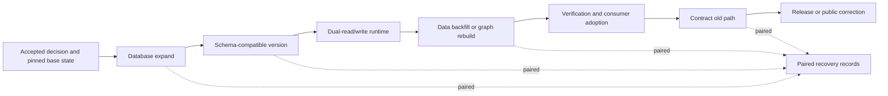

<!-- [KFM_META_BLOCK_V2]
doc_id: kfm://doc/migrations-readme
title: migrations/ — Governed State-Change, Compatibility, Adoption, Execution, and Recovery Root
type: README; directory-readme; canonical-migrations-root; change-control-index
version: v1.2
status: draft; repository-grounded; canonical-root; five-lane-documentation-confirmed; schema-validation-bounded; rollback-readiness-hold-confirmed; concrete-payloads-unestablished; runner-unestablished; applied-ledger-unestablished; recovery-coverage-unverified; non-release; non-publication
owner: NEEDS VERIFICATION — CODEOWNERS routes this path through the repository default owner @bartytime4life; accountable migration, database, schema, contract, data, graph, recovery, policy, security, application, domain, and release stewardship plus independent approval were not established
created: 2026-07-03
updated: 2026-07-24
supersedes: v1.1 documentation at the same path; no migration payload, database state, schema, contract, data, graph, recovery action, runtime behavior, release state, or publication state is superseded
prepared_under_prompt: KFM Markdown Modernization & GitHub Documentation Implementation Agent v4.0.0
policy_label: repository-facing; migrations; change-control; compatibility-aware; adoption-aware; rollback-aware; forward-fix-aware; evidence-first; fail-closed; non-publisher
current_path: migrations/README.md
owning_root: migrations/
responsibility: govern deliberate transitions in persisted structure, machine compatibility, data state, graph topology, adoption, execution evidence, and recovery posture without becoming semantic-contract, canonical-schema, policy, evidence, lifecycle-data, runtime, release, or publication authority
truth_posture: >
  CONFIRMED same-path target; Directory Rules assignment of migrations/ to database, schema, data, graph, and rollback change control;
  five merged repository-grounded v1.1 lane READMEs; current CODEOWNERS routing; configured schema-validation workflow; rollback-drill
  readiness workflow that explicitly holds rather than simulates rollback; and separation between migration recovery and release rollback /
  PROPOSED root migration classification, packet, evidence ladder, state model, deterministic identity, concurrency, compatibility, adoption,
  execution, recovery, and definition-of-done contracts / UNKNOWN exhaustive recursive migration inventory, concrete payloads, active
  database or graph engines, runner selection, target environments, applied versions, backup and restore capabilities, producer and consumer
  adoption, execution receipts, recovery outcomes, and production history / NEEDS VERIFICATION one-to-one migration-to-recovery pairing,
  same-PR enforcement, canonical ordering, machine migration register, dedicated migration validation, steward assignments, independent
  approval, branch or ruleset enforcement, rehearsal policy, and release integration
evidence_snapshot:
  repository: bartytime4life/Kansas-Frontier-Matrix
  base_ref: main
  base_commit: c4d7a1d7527687f1f11c5f95f47f52c159338af9
  target_prior_blob: 48da6b62000d145359bfbd7f8383961c9f285b2a
  directory_rules_blob: 2affb080e6f0043867c64c7f06c1ca52030fbd55
  codeowners_blob: dd2a84aa514d8ecd9208bc347f90f9a2ed37dd61
  database_readme_blob: a5d479ce410ead7fb8eb61082f22d8bddc813746
  schema_readme_blob: d4f28ff15ab5e26c101ff72fc96a1f500103dfae
  data_readme_blob: 42350e082436d84f8f2147d53044249eb7daf430
  graph_readme_blob: 92ca1b02a15557cdd970a03ee95a946ec78a0c3f
  rollback_readme_blob: 9fb60b41f9bb901b69d45cb8c4d942b8272b467f
  schema_validation_workflow_blob: e6b26337aa1eea142b96560e041419f855c44d59
  rollback_drill_workflow_blob: dc42ec4931f95023d364f2559ddcffab94ecfab5
  inspection_method: exact GitHub file reads, workflow inspection, bounded repository search, branch-name search, open-PR overlap search, and current-head verification; no recursive Git tree, live database, graph store, migration runner, backup system, deployment environment, release artifact, runtime trace, or production system was inspected
related:
  - ../docs/doctrine/directory-rules.md
  - ../docs/runbooks/ROLLBACK_RUNBOOK.md
  - ../docs/runbooks/README.md
  - ../docs/governance/SEPARATION_OF_DUTIES.md
  - ../docs/registers/DRIFT_REGISTER.md
  - ../contracts/README.md
  - ../schemas/README.md
  - ../schemas/contracts/v1/README.md
  - ../policy/README.md
  - ../fixtures/README.md
  - ../tests/README.md
  - ../tools/validators/README.md
  - ../data/README.md
  - ../release/README.md
  - ../release/rollback_cards/README.md
  - ../.github/workflows/schema-validation.yml
  - ../.github/workflows/rollback-drill.yml
  - ./database/README.md
  - ./schema/README.md
  - ./data/README.md
  - ./graph/README.md
  - ./rollback/README.md
  - ../.github/CODEOWNERS
notes:
  - "v1.2 is a same-path documentation-only modernization grounded in current repository evidence."
  - "The first twelve H2 sections follow the Directory Rules folder-README contract."
  - "All five lane READMEs are confirmed at v1.1, but concrete migration payloads, a canonical runner, applied ledger, complete recovery pairing, and production outcomes were not established."
  - "The schema-validation workflow proves bounded machine-shape checks; the rollback-drill workflow proves a deliberate readiness hold and explicitly does not simulate rollback."
  - "Static badges summarize inspected repository state only; they are not migration approval, execution, adoption, recovery, release, or publication proof."
[/KFM_META_BLOCK_V2] -->

<a id="top"></a>

# `migrations/` — Governed State-Change, Compatibility, Adoption, Execution, and Recovery Root

> **One-line purpose.** Govern deliberate changes to persisted structure and state so every database, schema, data, graph, and recovery transition is classified, pinned, reviewable, previewable, validated, auditable, and recoverable without bypassing KFM authority, lifecycle, policy, evidence, or release boundaries.

[](#status)
[](#current-bounded-topology)
[](#status)
[](#current-workflow-boundary)
[](#current-workflow-boundary)
[](#recovery-and-forward-fix-contract)
[](#authority-level)
[](#last-reviewed)

> [!IMPORTANT]
> **Safe current conclusion:** `migrations/` and all five lane READMEs are present and repository-grounded. The repository also has bounded schema-validation and rollback-readiness workflows. Current evidence does **not** establish concrete migration payloads, a canonical migration runner, active database or graph engines, an applied-version ledger, complete migration-to-recovery pairing, backup and restore capability, producer/consumer adoption, recovery rehearsals, or production execution history.

> [!CAUTION]
> A migration README, parsed script, schema check, workflow definition, green unrelated check, branch, pull request, or merged commit does not prove that a migration is safe, approved, applied, adopted, reversible, release-compatible, or reflected in a live environment. Those claims require pinned payloads and targets, observed execution evidence, post-checks, and recovery evidence.

> [!WARNING]
> `migrations/rollback/` is the engineering-recovery record lane for migrations. It is not a backup store, release rollback-card home, correction register, incident workspace, or publication authority. The current `rollback-drill` workflow is a readiness inspection that explicitly holds; it is not proof that migration rollback or release rollback was simulated.

**Quick navigation:** [Purpose](#purpose) · [Authority](#authority-level) · [Status](#status) · [Belongs](#what-belongs-here) · [Exclusions](#what-does-not-belong-here) · [Inputs](#inputs) · [Outputs](#outputs) · [Validation](#validation) · [Review](#review-burden) · [Related](#related-folders) · [ADRs](#adrs) · [Last reviewed](#last-reviewed) · [Topology](#current-bounded-topology) · [Routing](#migration-classification-and-lane-routing) · [Packet](#minimum-migration-packet) · [Evidence](#migration-evidence-ladder) · [States](#migration-work-state-model) · [Identity](#deterministic-identity-ordering-and-pairing) · [Coordination](#cross-lane-coordination) · [Compatibility](#compatibility-adoption-and-deprecation) · [Execution](#preflight-dry-run-canary-execution-and-post-checks) · [Recovery](#recovery-and-forward-fix-contract) · [Workflows](#current-workflow-boundary) · [Done](#definition-of-done) · [Open verification](#open-verification-register)

---

<a id="root-contract"></a>
<a id="migration-lifecycle"></a>
<a id="lane-contracts"></a>
<a id="inputs-and-outputs"></a>
<a id="open-verification"></a>

## Purpose

`migrations/` is KFM's canonical responsibility root for **governed state-change mechanics** affecting:

- database structure and database-managed behavior;
- machine schemas, contract-backed payload compatibility, and adoption;
- data backfills, repairs, remaps, lifecycle-safe relocations, and deterministic rebuilds;
- graph or triplet topology, identity, evidence links, and derived projections;
- rollback, reversal, disablement, restore coordination, compensation, and forward-fix planning.

The root exists because even a small migration can alter object identity, semantic interpretation, evidence closure, policy behavior, lifecycle placement, public API compatibility, map output, release safety, or recovery options.

Every consequential migration must answer:

1. What exact state changes?
2. Why is the change necessary?
3. Which authority defines the intended meaning, shape, policy, evidence, lifecycle state, or release posture?
4. Which immutable base state and target state are involved?
5. Which producers, consumers, validators, datasets, graph families, services, and releases are affected?
6. Which preconditions and invariants must hold?
7. How can the change be previewed, dry-run, rehearsed, or canaried?
8. Which evidence proves the attempted and resulting state?
9. How can the system recover safely?
10. Which residual risks, deprecations, corrections, or follow-up actions remain?
11. Who authored, reviewed, authorized, executed, and verified the transition?
12. What must remain blocked if any required evidence is absent?

The lifecycle remains:

```text
RAW -> WORK / QUARANTINE -> PROCESSED -> CATALOG / TRIPLET -> PUBLISHED
```

A migration may support a governed transition. It is not itself lifecycle promotion, policy approval, evidence of external truth, release authorization, correction approval, or publication.

## Authority level

**Canonical responsibility root for migration mechanics, coordinated adoption, execution evidence, and engineering recovery planning; subordinate to the authorities that define meaning, shape, admissibility, evidence, lifecycle state, runtime behavior, and release.**

| Question | Controlling authority | `migrations/` relationship |
|---|---|---|
| Where migration materials belong | Directory Rules and accepted placement ADRs | Owns migration mechanics under the five lanes |
| What an object means | [`contracts/`](../contracts/README.md) | References semantic authority; does not redefine it |
| What machine shape is valid | [`schemas/`](../schemas/README.md) | Coordinates shape transitions; canonical schemas remain under `schemas/` |
| What policy permits | [`policy/`](../policy/README.md) | Carries policy-impact references; does not make policy decisions |
| What source or evidence supports a remap | Source registry, `EvidenceRef`, `EvidenceBundle`, receipts, and proofs | Preserves support and records transforms; does not manufacture evidence |
| Which lifecycle phase owns a payload | [`data/`](../data/README.md) | Migrates state without replacing lifecycle ownership |
| How runtime behavior changes | Accepted application, package, runtime, and pipeline roots | Coordinates rollout; does not own runtime implementation |
| How a migration is executed | Selected runner, pinned payload, target environment, runbook, and authorization | Records execution contract and receipts |
| How engineering recovery works | [`migrations/rollback/`](./rollback/README.md) plus applicable backup/runbook evidence | Requires paired recovery posture |
| How public release rollback or correction works | [`release/`](../release/README.md), release rollback cards, correction and withdrawal records | References release actions; cannot authorize them |
| Whether a release is approved | Release authority and governed promotion records | Declares impact only |
| Whether a claim is true | Admissible evidence | Never decided by migration success |

### Anti-collapse rules

`migrations/` must not collapse:

- migration mechanics into semantic or schema authority;
- a script parse into target compatibility;
- a dry run into production execution;
- a migration receipt into release approval;
- a rollback document into a rehearsed recovery path;
- a backup reference into proof that a restore is possible;
- an identity remap into evidence that two entities are the same;
- an AI-generated crosswalk into authoritative state;
- a derived rebuild into canonical truth;
- a workflow hold into an implemented migration system;
- CODEOWNERS routing into stewardship or approval;
- a merged PR into an applied migration.

Public clients and normal UI surfaces continue to use governed APIs and released artifacts. They do not read migration packets, internal stores, or canonical state directly.

## Status

### Repository-grounded status matrix

| Surface | Current evidence | Safe conclusion |
|---|---|---|
| Root README | v1.1 exists at the same path | **CONFIRMED — documentation** |
| `database/` lane | Repository-grounded v1.1 README | **CONFIRMED — documented; engine, runner, payloads, and execution unestablished** |
| `schema/` lane | Repository-grounded v1.1 README | **CONFIRMED — documented; configured validation surface exists; migration adoption unestablished** |
| `data/` lane | Repository-grounded v1.1 README | **CONFIRMED — documented; runner, payloads, and execution unestablished** |
| `graph/` lane | Repository-grounded v1.1 README | **CONFIRMED — documented; graph store, query language, runner, and payloads unestablished** |
| `rollback/` lane | Repository-grounded v1.1 README | **CONFIRMED — documented; pairing, rehearsal, backup capability, and execution unverified** |
| Schema-validation workflow | Parses and meta-validates schemas, checks configured fixture families, and runs selected schema/contract tests | **CONFIRMED bounded machine-shape validation; not migration adoption or execution proof** |
| Rollback-drill workflow | Inspects release rollback readiness and asserts known placeholders/holds | **CONFIRMED readiness hold; no rollback simulated** |
| Concrete migration payloads | Not established in bounded search | **UNKNOWN / NEEDS VERIFICATION** |
| Canonical migration runner | Not established | **UNKNOWN** |
| Active database or graph engines | Not inspected or established | **UNKNOWN** |
| Applied migration/version ledger | Not established | **NEEDS VERIFICATION** |
| Machine-readable migration register | Not established | **NEEDS VERIFICATION** |
| One-to-one migration/recovery pairing | Required by doctrine; coverage not recursively verified | **NEEDS VERIFICATION** |
| Same-PR pairing enforcement | Not established | **NEEDS VERIFICATION** |
| Backups, snapshots, restore, or point-in-time recovery | Not inspected | **UNKNOWN** |
| Producer and consumer adoption ledger | Not established | **NEEDS VERIFICATION** |
| Dedicated migration CI | No cross-lane migration packet validator was established | **NEEDS VERIFICATION** |
| Recovery rehearsal history | Not established | **UNKNOWN** |
| Production execution and recovery history | Not inspected | **UNKNOWN** |
| GitHub routing | Default CODEOWNERS route resolves to `@bartytime4life` | **CONFIRMED routing; stewardship and approval unverified** |
| Release or publication authority | Not owned by this root | **DENIED by boundary** |

### Truth labels used here

| Label | Meaning |
|---|---|
| `CONFIRMED` | Verified from current repository content, workflows, tests, logs, or generated artifacts inspected for this update |
| `PROPOSED` | Design, packet field, state, workflow, or future contract not established as current implementation |
| `UNKNOWN` | Available evidence does not support a stronger conclusion |
| `NEEDS VERIFICATION` | A concrete check exists but is not closed strongly enough to act as fact |
| `CONFLICTED` | Two authority surfaces or implementation and doctrine disagree |

The current root is **documentation-mature relative to implementation evidence**. The five lanes now describe strong governed contracts, but that documentation must not be presented as a functioning migration platform.

## What belongs here

Use `migrations/` when the primary responsibility is a governed transformation of persisted structure, compatibility, or state.

Accepted material includes:

- root and lane README contracts;
- database, schema, data, and graph migration plans;
- SQL or engine-native migration files when an engine is selected;
- safe, reviewable scripts or query fragments;
- migration manifests that pin payload paths, digests, dependencies, base state, target state, and recovery references;
- schema/contract compatibility and adoption matrices;
- producer and consumer rollout plans;
- data backfill, repair, normalization, remap, relocation, or rebuild plans;
- graph/triplet topology, identity, relationship, evidence-link, and projection migration plans;
- preflight, dry-run, rehearsal, canary, validation, and post-check definitions;
- sanitized execution and adoption summaries;
- migration-level recovery, disablement, restore-coordination, compensation, and forward-fix records;
- cross-lane dependency and cutover coordination;
- drift, deprecation, correction, and documentation follow-up notes;
- references to release-impact review when public behavior may change.

A file belongs here only when **migration mechanics are its primary responsibility**. The normative object, schema, policy, dataset, release record, receipt, proof, or runtime implementation remains in its owning root.

## What does NOT belong here

Do not use `migrations/` as a parallel authority, lifecycle store, backup system, secrets store, incident workspace, release root, or publication surface.

The following do not belong here:

- canonical JSON Schemas, JSON-LD contexts, or other machine-shape authority;
- human semantic contract authority;
- policy bundles or admissibility decisions;
- source descriptors, source payloads, EvidenceBundles, or canonical evidence;
- RAW, WORK, QUARANTINE, PROCESSED, CATALOG, TRIPLET, PUBLISHED, or rollback data payloads;
- database or graph dumps, bulk exports, backups, snapshots, WAL archives, restore images, or point-in-time recovery media;
- release manifests, promotion decisions, release rollback cards, correction notices, withdrawal notices, or publication approvals;
- production credentials, DSNs, connection strings, tokens, private keys, certificates, kubeconfigs, service-account material, or `.env` files;
- unredacted row samples, private topology, sensitive logs, incident working material, or restricted relationship payloads;
- generated public artifacts such as PMTiles, COGs, GeoParquet, tiles, reports, exports, or API payloads;
- generated clients or runtime code whose primary home is an application or package root;
- destructive commands lacking named scope, preconditions, validation, recovery, review, target, and audit fields;
- one-off manual commands represented as authoritative migration history;
- mutable “latest” inputs without a pinned revision or digest;
- AI-generated remaps, inferred graph edges, entity merges, crosswalks, or transformations promoted without evidence and review;
- migration records that silently weaken evidence, source role, rights, sensitivity, policy, review, correction, or release requirements.

If restricted data, credentials, dumps, backups, or incident material land here, stop normal work, isolate the material, rotate or revoke access where necessary, and follow the applicable security, incident, correction, and governance process.

## Inputs

A migration packet may consume the following only when their identity and authority are explicit.

| Input | Why it is needed | Minimum pinning |
|---|---|---|
| Accepted ADR or explicit scoped decision | Establishes why the architecture or compatibility transition is permitted | ADR ID and accepted revision, or issue/decision reference |
| Semantic contract | Defines intended meaning and invariants | Path, version, commit, and digest where material |
| Machine schema | Defines intended shape | `$id`, path, version, commit, and digest |
| Policy decision or sensitivity review | Constrains handling, transformation, and exposure | Decision/reference ID and applicable scope |
| Issue, defect, validation failure, or correction request | Establishes reason and bounded scope | Stable issue or record reference |
| Source and evidence references | Grounds consequential repairs, remaps, merges, or splits | Resolvable `EvidenceRef`/`EvidenceBundle` or accepted source record |
| Current-state inventory | Defines exact objects, rows, features, fields, nodes, edges, versions, or projections that may change | Immutable state/version identifier |
| Producer and consumer inventory | Defines compatibility and adoption order | Named systems and deployed/configured revisions |
| Fixtures and invariant checks | Defines expected success, failure, denial, abstention, and edge conditions | Versioned fixture and test paths |
| Environment and runner contract | Defines where and how execution is allowed | Named environment, runner version, permissions, and configuration digest |
| Backup, snapshot, or prior artifact reference | Supports recovery where applicable | Immutable external reference; never backup bytes in Git |
| Release and public-surface context | Defines public impact and correction/rollback handoff | Candidate/release IDs and affected surfaces |
| Prior migration and recovery records | Establishes lineage and ordering | Stable migration/recovery IDs and digests |

Inputs must be commit-, version-, hash-, release-, ledger-, or environment-identified where material. “Latest,” “current database,” “all records,” “production,” or “the graph” is not sufficiently precise for a consequential migration.

## Outputs

A migration packet may produce:

- reviewed migration and coordination plans;
- pinned migration payloads and checksums;
- compatibility, dependency, and adoption matrices;
- preflight, dry-run, rehearsal, and canary reports;
- target-state, invariant, and affected-object reports;
- execution, adoption, and verification receipts;
- rollback, disablement, restore-coordination, compensation, or forward-fix records;
- deprecation, drift, correction, and documentation updates;
- references to release-impact, incident, or security review;
- residual-risk and follow-up registers.

### Output claim boundaries

| Output | What it may prove | What it does not prove |
|---|---|---|
| Migration plan | Intended change, scope, dependencies, and review surface exist | Execution occurred |
| Parsed SQL/script/query | Syntax passed a named parser or checker | Target compatibility, semantics, safety, or authorization |
| Schema/fixture tests | Selected machine-shape behavior passed | Producer/consumer adoption, semantic truth, policy approval, or release |
| Dry run | A preview completed against a named state | Production outcome |
| Rehearsal | The recovery or cutover path was exercised in a named rehearsal context | Universal recovery or production parity |
| Canary | A bounded target subset changed and passed thresholds | Full migration completion |
| Execution receipt | A named runner attempted or completed a pinned action | External truth, policy approval, release, or publication |
| Post-check report | Named invariants passed in a named environment | Universal correctness or absence of undiscovered defects |
| Adoption record | Named producers and consumers were observed at declared revisions | Every downstream consumer migrated |
| Recovery record | Recovery posture and instructions exist | Recovery was rehearsed, executed, or successful |
| Recovery receipt | A named recovery action completed and passed named checks | Release rollback or public correction unless release records also exist |
| Git commit / PR | Repository bytes changed | Migration applied, adopted, approved, released, or published |

`migrations/` never publishes KFM data by itself.

## Validation

Validation is **migration-class-, target-, and evidence-grade-specific**. A single generic green check is insufficient.

### Required packet checks

Every consequential migration should verify:

- correct lane placement and Directory Rules basis;
- stable migration and recovery identities;
- immutable base and target state;
- pinned payload paths and digests;
- affected object and environment inventory;
- controlling contract, schema, policy, evidence, lifecycle, and release references;
- dependency, concurrency, and rollout order;
- compatibility and adoption class;
- rights, sensitivity, living-person, DNA, archaeology, rare-species, infrastructure, and restricted-geometry posture where applicable;
- preconditions, failure conditions, abort thresholds, and post-checks;
- secret and restricted-content absence;
- paired rollback, disablement, restore, compensation, or forward-fix posture;
- documentation, deprecation, correction, incident, and release impact;
- review, authorization, execution, and verification records;
- residual risk and follow-up closure.

### Minimum executable evidence by lane

| Lane | Minimum executable evidence when applicable |
|---|---|
| Database | Engine-aware parse or validation, transaction/preflight behavior, lock and downtime assessment, permission review, before/after object checks |
| Schema | Valid and invalid fixtures, meta-schema checks, `$id`/reference checks, producer/consumer compatibility, crosswalk and deprecation tests |
| Data | Deterministic input selection, counts, identity/provenance checks, dry-run diff, lifecycle and sensitivity checks, no-unexpected-loss assertions |
| Graph/triplet | Node/edge/triplet counts, endpoint closure, evidence-link resolution, duplicate/orphan/cycle policy, identity lineage, projection rebuild proof |
| Recovery | Applicability, prerequisites, reversal/disablement/restore/compensation behavior, rehearsal or explicit gap, post-recovery invariants |
| Coordinated | All applicable lane checks plus dependency, cutover, compatibility-window, and failure-isolation evidence |

### Validation outcomes

Use finite outcomes rather than ambiguous prose:

| Outcome | Meaning |
|---|---|
| `PASS` | Applicable checks passed for the named target and revision |
| `FAIL` | One or more required checks failed |
| `HOLD` | Evidence, review, target, tooling, or dependency is incomplete |
| `NOT_APPLICABLE` | Check does not apply and the rationale is explicit and reviewed |
| `NOT_RUN` | Check was not executed; the migration cannot inherit a passing claim from other checks |
| `ERROR` | The validation mechanism could not determine a result |

A check marked `NOT_RUN`, `HOLD`, or `ERROR` remains visible. It must not be silently converted into `PASS`.

### Current repository boundary

The repository has bounded validation and readiness workflows, but no verified cross-lane migration packet validator, canonical runner, or applied-state ledger.

Until those surfaces exist and are verified:

- do not advertise a canonical migration command;
- do not use the schema-validation workflow as proof that schema migration adoption completed;
- do not use the rollback-drill readiness workflow as proof that any rollback was simulated;
- record lane-specific commands and versions inside each migration packet;
- mark unexecuted checks `NOT_RUN`;
- keep shared or release-relevant execution blocked when required evidence is absent;
- treat manual execution as non-authoritative unless it produces an inspectable receipt tied to the pinned packet.

## Review burden

Review scales with consequence, authority impact, sensitivity, and recoverability—not file extension.

| Change class | Minimum review burden |
|---|---|
| README-only wording with no behavior change | Documentation reviewer or migration reviewer |
| Database structure, index, constraint, view, function, role, permission, extension, or partition | Database owner + migration reviewer + security reviewer when access changes |
| Schema or semantic compatibility transition | Schema owner + contract owner + affected producer and consumer owners |
| Validator behavior or fixture polarity change | Schema/contract owner + validator/test owner + affected consumers |
| Data backfill, repair, remap, merge, split, relocation, or rebuild | Data owner + affected domain owner + evidence/policy reviewer when material |
| Graph/triplet identity, relationship, evidence-link, or topology change | Graph owner + evidence owner + affected domain owner |
| Recovery record | Affected lane owner + recovery reviewer; independent reviewer where risk is material |
| Public API, MapLibre layer, tile, export, story, search, AI, or released-artifact impact | Governed interface owner + release reviewer + affected domain owner |
| Rights, living-person, DNA/genomic, archaeology, rare-species, infrastructure, sovereignty, or restricted geometry | Policy/sensitivity reviewer + affected domain or rights-holder review |
| Credentials, grants, private endpoints, access, or incident recovery | Security reviewer + affected system owner |
| Destructive, irreversible, or forward-fix-only transition | Migration owner + every affected authority + explicit risk acceptance |
| Cross-lane or multi-environment cutover | Owners for every primary lane, environment, and public surface |
| Change to migration identity, ordering, packet schema, or root authority | ADR-class architecture and governance review |

CODEOWNERS routing is not proof that the required review occurred. For material migrations, authoring, authorization, execution, and verification should be separated when repository maturity supports it.

## Related folders

| Location | Relationship |
|---|---|
| [`database/`](./database/README.md) | Database structure, access, and engine-managed behavior |
| [`schema/`](./schema/README.md) | Machine-shape, semantic-compatibility, validation, adoption, and deprecation transitions |
| [`data/`](./data/README.md) | Data-state backfills, repairs, remaps, relocations, and deterministic rebuilds |
| [`graph/`](./graph/README.md) | Graph/triplet topology, identity, evidence links, relationship vocabulary, and projections |
| [`rollback/`](./rollback/README.md) | Migration-level reversal, disablement, restore coordination, compensation, and forward-fix records |
| [`../contracts/`](../contracts/README.md) | Semantic meaning and invariants |
| [`../schemas/`](../schemas/README.md) | Machine-checkable shape |
| [`../policy/`](../policy/README.md) | Admissibility, rights, sensitivity, access, and obligations |
| [`../fixtures/`](../fixtures/README.md) | Representative valid, invalid, edge, and denial cases |
| [`../tests/`](../tests/README.md) | Executable enforceability and regression evidence |
| [`../tools/validators/`](../tools/validators/README.md) | Reusable validator implementation |
| [`../data/`](../data/README.md) | Lifecycle payloads, receipts, proofs, catalogs, and published artifacts |
| [`../release/`](../release/README.md) | Release, correction, withdrawal, and public rollback decisions |
| [`../release/rollback_cards/`](../release/rollback_cards/README.md) | Release-facing rollback review aids; distinct from migration recovery |
| [`../docs/runbooks/`](../docs/runbooks/README.md) | Operator procedures and drills |
| [`../docs/governance/SEPARATION_OF_DUTIES.md`](../docs/governance/SEPARATION_OF_DUTIES.md) | Review and duty-separation guidance |
| [`../.github/workflows/schema-validation.yml`](../.github/workflows/schema-validation.yml) | Bounded schema/fixture/test validation |
| [`../.github/workflows/rollback-drill.yml`](../.github/workflows/rollback-drill.yml) | Readiness hold for release rollback surfaces; no rollback simulation |
| [`../.github/CODEOWNERS`](../.github/CODEOWNERS) | GitHub review routing only |

## ADRs

A migration does not always require an ADR. An ADR is required when the transition:

- adds, removes, or renames a canonical responsibility root;
- creates, retires, or redirects a parallel schema, contract, policy, source, registry, receipt, proof, release, or lifecycle authority;
- changes canonical schema-home, semantic/machine-shape split, or policy-home rules;
- changes the trust membrane or normal public access path;
- splits, merges, or redefines a lifecycle phase;
- standardizes repo-wide migration identity, ordering, state, packet, receipt, or recovery contracts;
- changes the authority of a register or applied-version ledger;
- introduces a non-reversible architectural choice whose tradeoffs must persist;
- intentionally bends a KFM invariant;
- changes the sole-renderer, governed API, publication, or correction boundary.

A migration record may implement an accepted decision. It cannot make its own proposed ADR accepted.

## Last reviewed

| Field | Value |
|---|---|
| Last reviewed | 2026-07-24 |
| Review status | Repository-grounded v1.2 documentation update |
| Current maturity | Five v1.1 documented lanes; bounded schema validation; rollback readiness hold; payloads, runner, applied ledger, pairing coverage, rehearsals, and production history unestablished |
| Next review trigger | First concrete migration payload, runner selection, machine migration register, applied ledger, verified same-PR pairing, recovery rehearsal, destructive transition, or public-impacting migration |

---

## Current bounded topology

The confirmed documentation topology is:

```text
migrations/
├── README.md
├── database/
│   └── README.md        # v1.1
├── schema/
│   └── README.md        # v1.1
├── data/
│   └── README.md        # v1.1
├── graph/
│   └── README.md        # v1.1
└── rollback/
    └── README.md        # v1.1
```

This is a **bounded named-path inventory**, not a recursive tree attestation. The presence of the five lane contracts does not prove executable payloads exist beneath them.

### Lane maturity matrix

| Lane | Confirmed documentation | Confirmed implementation evidence | Unestablished or unverified |
|---|---|---|---|
| `database/` | v1.1 repository-grounded contract | None beyond documentation in bounded inspection | Engine, version, runner, objects, payloads, targets, backups, executions |
| `schema/` | v1.1 repository-grounded contract | Configured schema-validation surface outside this lane | Concrete migration payloads, adoption ledger, generated clients, compatibility retirement, release adoption |
| `data/` | v1.1 repository-grounded contract | None beyond documentation in bounded inspection | Runner, payloads, target datasets, executions, restores |
| `graph/` | v1.1 repository-grounded contract | None beyond documentation in bounded inspection | Graph store, query language, runner, payloads, targets, executions |
| `rollback/` | v1.1 repository-grounded recovery contract | Readiness workflow exists outside this lane but does not simulate recovery | Pairing coverage, runner, backup capability, rehearsals, executions, production outcomes |

## Migration classification and lane routing

Classify by the **primary state transition**, not by file language or storage technology.

| Primary change | Primary lane | Common adjacent responsibilities |
|---|---|---|
| Table, column, index, constraint, view, function, trigger, role, grant, extension, partition, storage behavior | `database/` | Schema, app/runtime, data, security, release |
| Field, enum, requiredness, type, `$id`, `$ref`, version, validation behavior, producer/consumer compatibility | `schema/` | Contracts, validators, fixtures, generated clients, data, graph, API |
| Record values, identifiers, crosswalks, lifecycle-safe location, repair, backfill, rebuild | `data/` | Database, schema, evidence, policy, release |
| Node/edge/triplet identity, relationship vocabulary, topology, evidence link, projection, graph index | `graph/` | Data, contracts, schemas, evidence, policy, API |
| Reversal, disablement, restore coordination, compensation, forward fix | `rollback/` | Paired primary migration and relevant runbooks |
| Multiple equally primary changes | Coordinated records in each owning lane | One umbrella coordination section or issue may link the packet set |

### Routing questions

Before choosing a lane, ask:

1. Is the durable change primarily to storage structure, machine shape, data values, relationship topology, or recovery posture?
2. Which authority owns the intended meaning and shape?
3. Does the change require a second lane record rather than a larger mixed-responsibility file?
4. Can each lane be reviewed, applied, validated, and recovered independently?
5. Which sequence prevents partial adoption or authority drift?

Do not place all coordinated work into one lane merely because one tool can execute it.

## Minimum migration packet

A shared-state or release-relevant migration should have a complete packet before execution.

```yaml
migration_id: mig-<stable-id>
title: <short-purpose>
status: PROPOSED
primary_lane: database | schema | data | graph
coordination_id: null
owner: NEEDS_VERIFICATION

authority:
  decision_refs: []
  contract_refs: []
  schema_refs: []
  policy_refs: []
  evidence_refs: []
  release_refs: []

base_state:
  repository_commit: <sha>
  environment: <named-environment>
  state_id: <immutable-version-or-ledger-ref>
  observed_at: <timestamp>
  inventory_ref: <path-or-external-ref>

target_state:
  description: <bounded-intended-state>
  state_id: <planned-version-or-ledger-ref>
  invariants: []

payloads:
  - path: <migration-payload>
    sha256: <digest>
    runner: <runner-and-version>

dependencies:
  before: []
  after: []
  conflicts_with: []

affected:
  database_objects: []
  schemas: []
  contracts: []
  policies: []
  datasets: []
  graph_families: []
  producers: []
  consumers: []
  validators: []
  fixtures: []
  APIs: []
  UI_or_MapLibre_surfaces: []
  releases: []

compatibility:
  class: backward-compatible | expand-contract | staged-breaking | rebuildable-derivative | destructive | forward-fix-only
  coexistence_window: null
  adoption_requirements: []
  deprecation_requirements: []

preconditions: []
abort_conditions: []
dry_run:
  command_or_workflow: NEEDS_VERIFICATION
  target: <named-target>
  evidence_ref: null
canary:
  applicable: false
  scope: null
  thresholds: []

validation:
  pre_checks: []
  post_checks: []
  negative_checks: []
  expected_outcomes: []

sensitivity:
  impact: none | reviewed | hold
  reviewer_refs: []
release_impact: none | internal | candidate | public

recovery:
  recovery_id: rec-<stable-id>
  record_ref: migrations/rollback/<paired-id>.md
  class: reversible | disableable | restorable | compensating | forward-fix-only
  rehearsal_ref: null

execution:
  authorization_refs: []
  runner: NEEDS_VERIFICATION
  target: <named-environment>
  started_at: null
  completed_at: null
  receipt_ref: null

review:
  required_roles: []
  records: []
  independent_verifier: null

follow_up:
  documentation: []
  deprecations: []
  corrections: []
  incidents: []
  open_risks: []
```

This is a **PROPOSED documentation contract**, not a verified repository schema. Standardizing it as machine shape requires an accepted authority decision, a home under `schemas/`, valid and invalid fixtures, tests, validators, compatibility planning, and rollback.

## Migration evidence ladder

Use the highest evidence grade actually supported. Do not inherit a higher grade from an unrelated workflow.

| Evidence grade | Minimum support | Claim permitted |
|---|---|---|
| `DOCUMENTED` | Plan and packet exist | Intended migration is described |
| `STATIC_VALIDATED` | Payload parses or passes static checks | Selected static properties passed |
| `DRY_RUN` | Preview completed against a pinned target state | Expected diff was observed in that context |
| `REHEARSED` | Full procedure or recovery path exercised in a rehearsal target | Procedure worked in the named rehearsal context |
| `CANARIED` | Bounded subset executed and passed thresholds | Canary succeeded for the named subset |
| `EXECUTED` | Pinned payload ran against the named target | Execution occurred |
| `POSTCHECKED` | Required post-checks ran | Named invariants were evaluated |
| `VERIFIED` | Execution and required post-checks passed with inspectable evidence | Migration reached its verified target state |
| `ADOPTED` | Required producers and consumers were observed on compatible revisions | Named adoption scope closed |
| `RECOVERED` | Recovery action executed and post-recovery checks passed | Named safe state was restored or compensated |
| `COMPLETED` | Adoption, receipts, recovery posture, docs, deprecations, and follow-up closed | Migration packet is operationally closed |

A `DOCUMENTED` or `STATIC_VALIDATED` migration must never be described as executed. A `VERIFIED` migration must not be described as released unless release authority separately approved the affected public state.

## Migration work-state model

Keep work state separate from evidence grade, validation outcome, policy outcome, release state, and truth labels.

| Work state | Meaning |
|---|---|
| `PROPOSED` | Packet exists; execution is not authorized |
| `DRAFTING` | Scope or packet fields remain incomplete |
| `REVIEW_READY` | Applicable packet, dependencies, checks, and recovery record are complete |
| `APPROVED_FOR_TARGET` | Required review and authorization exist for one named target |
| `PRECHECKED` | Preconditions and required preflight evidence passed |
| `EXECUTING` | Runner is applying the pinned payload |
| `APPLIED` | Payload completed; post-checks and adoption may remain |
| `VERIFYING` | Post-checks are in progress |
| `VERIFIED` | Required post-checks passed for the named target |
| `ADOPTING` | Producers, consumers, aliases, or derivatives are transitioning |
| `COMPLETED` | Applicable adoption, receipts, docs, deprecations, and follow-up are closed |
| `BLOCKED` | Named prerequisite, evidence, review, target, or tool is unresolved |
| `FAILED` | Execution or verification failed |
| `RECOVERY_REQUIRED` | The migration cannot safely continue without recovery |
| `ROLLED_BACK` | Prior safe state was restored or the migration was disabled |
| `FORWARD_FIXED` | A compensating migration restored safety because reversal was unsafe |
| `SUPERSEDED` | A later governed packet replaces this packet |
| `CANCELLED` | Execution authorization was withdrawn before completion |

These states are **PROPOSED** until standardized by an accepted contract. They must not be confused with `PASS / FAIL / HOLD`, policy decisions, `ANSWER / ABSTAIN / DENY / ERROR`, release states, or `CONFIRMED / PROPOSED / UNKNOWN / NEEDS VERIFICATION`.

## Deterministic identity, ordering, and pairing

### Stable identity

A migration ID should be deterministic from stable inputs where practical, such as:

- primary lane;
- object family or bounded target;
- purpose slug;
- authored sequence or timestamp;
- immutable packet digest.

The repository has not established a canonical ID grammar. Until it does:

- use a unique, human-readable date or sequence prefix;
- keep the same identity across plan, payload, receipt, and recovery record;
- never reuse an ID for a different state transition;
- retain supersession lineage;
- record payload digests independently of filenames.

### Ordering

A migration must declare:

- strict predecessors;
- strict successors;
- compatible parallel work;
- conflicts and mutual exclusions;
- schema/data/graph/database coordination;
- application deploy or feature-flag boundaries;
- release freeze or cutover requirements.

Do not infer order solely from filenames when dependencies are materially important.

### Recovery pairing

Every consequential database, schema, data, or graph migration requires a paired recovery record under `migrations/rollback/`, even when the only acceptable posture is forward-fix-only.

Pairing should be machine-checkable in the future. Current one-to-one coverage and same-PR enforcement remain **NEEDS VERIFICATION**.

## Cross-lane coordination

A coordinated transition uses multiple lane records when more than one responsibility changes materially.

### Coordination matrix

| Concern | Owning lane/root | Coordination requirement |
|---|---|---|
| Storage structure | `migrations/database/` | Pin DDL/object changes and lock/access behavior |
| Machine shape and compatibility | `migrations/schema/` + `schemas/` | Pin old/new schemas, validators, fixtures, and adoption |
| Data values and identity | `migrations/data/` + `data/` | Pin inputs, transforms, lineage, counts, and lifecycle state |
| Graph/triplet topology | `migrations/graph/` + graph/evidence authorities | Pin relationships, evidence links, identity, and projections |
| Recovery posture | `migrations/rollback/` | Pair each primary migration and define coordinated failure handling |
| Runtime adoption | applications/packages/runtime | Pin deploy order, dual-read/write behavior, and rollback compatibility |
| Policy and sensitivity | `policy/` and governed review | Re-evaluate if fields, exposure, identity, or location change |
| Release/public state | `release/` | Hold, correct, withdraw, or release through governed records |

### Coordinated transition example


```mermaid
flowchart LR
    A[Accepted decision and pinned base state]
    B[Database expand]
    C[Schema-compatible version]
    D[Dual-read/write runtime]
    E[Data backfill or graph rebuild]
    F[Verification and consumer adoption]
    G[Contract old path]
    H[Release or public correction]
    R[Paired recovery records]

    A --> B --> C --> D --> E --> F --> G --> H
    B -. paired .-> R
    C -. paired .-> R
    E -. paired .-> R
    G -. paired .-> R
```

If a coordinated sequence partially fails, each lane must declare whether it can stop, reverse, remain compatible, or requires a forward fix.

## Compatibility, adoption, and deprecation

Migration safety often depends more on coexistence and adoption than on payload syntax.

### Compatibility classes

| Class | Requirement |
|---|---|
| `BACKWARD_COMPATIBLE` | Existing consumers continue to function with the new state |
| `FORWARD_COMPATIBLE` | New consumers can tolerate the old state during rollout |
| `EXPAND_AND_CONTRACT` | Add compatible state, migrate adoption, then retire old state |
| `STAGED_BREAKING` | Explicit compatibility window, coordinated cutover, and recovery plan |
| `REBUILDABLE_DERIVATIVE` | Canonical inputs remain and derived state can be deterministically rebuilt |
| `DESTRUCTIVE` | Data, identity, meaning, or recoverability may be lost; heightened governance required |
| `FORWARD_FIX_ONLY` | Reversal would be less safe than compensation; reason and guardrails required |
| `DOCUMENTATION_ONLY` | No payload, machine shape, data, graph, runtime, or release behavior changes |

### Adoption states

Track each material producer and consumer separately:

| Adoption state | Meaning |
|---|---|
| `NOT_ASSESSED` | Impact has not been evaluated |
| `UNAFFECTED` | Reviewed and not affected |
| `PLANNED` | Change is assigned and sequenced |
| `COMPATIBLE_OLD` | Still on old behavior but remains compatible |
| `DUAL_MODE` | Supports old and new state |
| `MIGRATED` | New behavior is deployed or configured |
| `VERIFIED` | Observed against the target state |
| `BLOCKED` | Cannot adopt due to a named dependency |
| `RETIRED` | Old consumer or producer is removed |
| `UNKNOWN` | Adoption state is not evidenced |

### Expand-and-contract sequence

```text
EXPAND -> DUAL COMPATIBILITY -> BACKFILL/REBUILD -> VERIFY -> CUT OVER -> RETIRE -> CLOSE
```

The contract step must not occur until:

- all required producers and consumers are verified;
- deprecated fields, tables, relationships, aliases, or paths have no unresolved dependents;
- recovery remains valid through the compatibility window;
- release and public caches are handled where applicable;
- deprecation and supersession records are updated.

## Preflight, dry-run, canary, execution, and post-checks

### Preflight

Before mutation, verify:

- the branch, commit, migration ID, packet digest, and payload digest;
- target environment and immutable base-state identity;
- runner and engine version;
- required permissions and least privilege;
- active locks, concurrent deployments, conflicting migrations, and maintenance windows;
- backup/snapshot applicability and external reference validity;
- producer/consumer compatibility window;
- policy, rights, sensitivity, and release holds;
- expected affected counts or object inventory;
- recovery record and abort conditions;
- logging, receipt, and redaction posture.

### Dry run

A dry run should produce:

- exact target and base-state identifiers;
- deterministic affected-object counts;
- proposed changes by class;
- identity merges, splits, remaps, or deletions;
- evidence/provenance changes;
- compatibility warnings;
- sensitivity and public-impact warnings;
- expected invariant changes;
- predicted runtime and lock/downtime risk;
- an explicit no-write assertion;
- sanitized evidence suitable for review.

### Canary

Use a canary only when:

- the subset is representative and policy-safe;
- rollback or disablement is possible for the subset;
- success and abort thresholds are explicit;
- no partial public exposure bypasses release governance;
- canary identity and results are recorded.

### Execution

Execution must use:

- the reviewed packet and exact payload digests;
- the authorized named target;
- the declared runner and configuration;
- concurrency and lock controls;
- bounded privileges;
- structured progress and failure recording;
- no hidden manual edits;
- an execution receipt.

### Post-checks

Post-checks must verify applicable:

- state/version and object counts;
- schema and contract compatibility;
- data identity, provenance, lifecycle, temporal, and spatial invariants;
- graph endpoint closure, relationship rules, evidence links, and projection rebuilds;
- runtime producer/consumer compatibility;
- policy, sensitivity, and rights posture;
- public API, MapLibre, export, search, story, and AI surface behavior;
- release, cache, alias, and correction implications;
- no unexpected loss or orphaned state;
- recovery applicability after the migration.

A migration remains `APPLIED`, not `VERIFIED`, until required post-checks pass.

## Recovery and forward-fix contract

Every consequential migration must identify one recovery class.

| Recovery class | Meaning |
|---|---|
| `REVERSIBLE` | A tested reversal can restore the prior approved state |
| `DISABLEABLE` | New behavior can be turned off while state remains |
| `RESTORABLE` | Backup, snapshot, prior artifact, or point-in-time restore is the recovery path |
| `COMPENSATING` | A governed corrective migration repairs state |
| `PARTIAL` | Only part of the transition can safely reverse; remaining state needs explicit handling |
| `FORWARD_FIX_ONLY` | Reversal is unsafe; an explicit compensating path is the approved option |
| `BLOCKED` | Recovery cannot proceed until a named dependency is satisfied |
| `NON_RECOVERABLE` | Not acceptable for shared or release-relevant state absent exceptional documented governance |

A paired recovery record should include:

- migration ID, payload digest, and coordination ID;
- recovery ID and class;
- target environment and base/safe state;
- activation conditions and decision authority;
- required backup, snapshot, prior artifact, or compensating input references;
- reversal, disablement, restore, compensation, or forward-fix steps;
- irreversible effects and expected residual state;
- database, schema, data, graph, runtime, cache, alias, and release impacts;
- pre- and post-recovery checks;
- operator, reviewer, and independent verifier requirements;
- rehearsal evidence or explicit `NOT RUN`;
- execution and verification receipts;
- correction, incident, security, or release handoffs.

### Migration recovery versus release rollback

| Concern | Migration recovery | Release rollback |
|---|---|---|
| Primary home | `migrations/rollback/` | `release/` and release rollback-card/runbook surfaces |
| Purpose | Restore or compensate internal structure/state after a migration | Withdraw, supersede, or restore governed public release state |
| Authority | Migration and affected-system governance | Release and correction governance |
| Typical target | Database, schema, data, graph, or runtime compatibility state | Released artifacts, APIs, layers, aliases, exports, stories, or AI surfaces |
| Evidence | Recovery packet, runner receipt, post-recovery checks | Release decision, rollback card, manifest, correction/withdrawal records |
| Publication effect | None by itself | May change public state when approved and executed |

A migration may require both processes. Completing one does not imply completion of the other.

## Current workflow boundary

### `schema-validation`

The current schema workflow:

- parses JSON under `schemas/`;
- meta-validates `*.schema.json`;
- requires configured v1 schemas to declare Draft 2020-12 and unique `$id` values;
- checks six configured fixture-backed validator families;
- runs the selected schema and contract tests;
- emits process output and a job summary only.

It does **not**:

- create or apply a schema migration;
- prove producer or consumer adoption;
- emit a migration receipt or adoption ledger;
- establish semantic truth, policy approval, release, or publication.

### `rollback-drill`

The current rollback workflow:

- inspects rollback-card, placeholder engine/helper, test-inventory, and published-alias readiness surfaces;
- asserts that known placeholders and holds remain explicit;
- emits inspection output and job summaries only.

It explicitly confirms that:

- rollback engine/apply helpers remain placeholders;
- the direct drill lane contains guidance rather than executable tests;
- proposed RollbackCard schemas remain permissive scaffolds;
- declared fixtures and validators are absent;
- no rollback was simulated;
- no rollback card, receipt, proof, signature, release transition, or publication authority was created.

Therefore, a passing `rollback-drill` check currently means **the readiness hold remains accurately represented**, not that rollback capability exists.

## Definition of done

A migration is complete only when every applicable item is closed:

- [ ] Stable migration identity, ordering, and supersession lineage are recorded.
- [ ] Primary lane and Directory Rules basis are correct.
- [ ] Coordinated lane records exist where responsibilities are materially distinct.
- [ ] Controlling contracts, schemas, policies, evidence, lifecycle, and release references are pinned.
- [ ] Immutable base and target states are recorded.
- [ ] Payloads, runners, versions, and digests are recorded.
- [ ] Affected database objects, schemas, contracts, datasets, graph families, producers, consumers, validators, fixtures, APIs, UI/MapLibre surfaces, and releases are inventoried.
- [ ] Compatibility, coexistence window, adoption order, and deprecation triggers are explicit.
- [ ] Rights, sensitivity, sovereignty, living-person, DNA, archaeology, rare-species, infrastructure, and public impacts are reviewed where applicable.
- [ ] Paired recovery identity, class, and record exist.
- [ ] Preconditions, abort thresholds, dry-run, rehearsal, and canary requirements are resolved.
- [ ] Required reviews and target-specific authorization are recorded.
- [ ] Execution receipt identifies target, runner, revision, payload digests, timestamps, and outcome.
- [ ] Required post-migration invariants passed.
- [ ] Required producers and consumers reached verified adoption states.
- [ ] Recovery was rehearsed where risk requires it, or the gap remains visible and blocks unsupported claims.
- [ ] Documentation, deprecation, drift, correction, incident, and release follow-up are complete.
- [ ] Rollback target or forward-fix lineage remains resolvable.
- [ ] Residual risk and unresolved verification items remain visible.
- [ ] No migration output is represented as external truth, policy approval, release approval, or publication authority.

## No-loss ledger

| Prior material | v1.2 disposition |
|---|---|
| Canonical migration-root purpose | Preserved and expanded |
| Lifecycle invariant | Preserved |
| Five migration lanes | Preserved; all five v1.1 lane contracts now confirmed |
| Rollback-entry requirement | Preserved; pairing coverage remains explicitly unverified |
| Database/schema/data/graph distinctions | Preserved and aligned with merged lane READMEs |
| Sensitive-domain fail-closed posture | Preserved and expanded |
| Inputs and outputs | Preserved with pinning and claim boundaries |
| Validation checklist | Expanded with finite outcomes and evidence grades |
| Review burden | Expanded by authority, sensitivity, recoverability, and coordination |
| Migration packet | Preserved and extended |
| Work-state model | Preserved and separated from evidence grades and validation outcomes |
| Compatibility and adoption | Preserved and expanded with adoption states |
| Recovery classes | Preserved and aligned with migration versus release separation |
| Definition of done | Preserved and expanded |
| Open verification | Preserved and updated |
| Workflow posture | Corrected: bounded schema checks and rollback readiness hold now confirmed |
| Owner placeholders | Remain replaced by verified GitHub routing plus stewardship uncertainty |
| Publication boundary | Preserved and sharpened |

## Open verification register

- [ ] Obtain a recursive tracked inventory of `migrations/`.
- [ ] Confirm whether executable migration payloads exist beyond the documented lane contracts.
- [ ] Select and document a database migration runner, or explicitly declare no database runner.
- [ ] Confirm schema, data, and graph migration executor conventions.
- [ ] Define canonical stable migration and recovery ID grammar.
- [ ] Define dependency and filename ordering rules.
- [ ] Verify one-to-one migration-to-recovery pairing across all lanes.
- [ ] Decide whether paired recovery records must land in the same pull request.
- [ ] Define a machine-readable migration packet schema if justified.
- [ ] Define the canonical migration register or applied-version ledger and its owning responsibility root.
- [ ] Define target-environment identity and state-digest rules.
- [ ] Add dedicated migration validation orchestration only after packet, runner, fixtures, and outcomes are defined.
- [ ] Define valid, invalid, hold, not-applicable, and not-run fixtures for each migration class.
- [ ] Verify backup, snapshot, restore, and retention capabilities by environment.
- [ ] Define lock, downtime, maintenance-window, and concurrency classes.
- [ ] Define expand-and-contract and staged-breaking compatibility policy.
- [ ] Define producer/consumer adoption evidence and deprecation windows.
- [ ] Populate or select authoritative object-family and deprecation registers where schema migrations depend on them.
- [ ] Define graph/triplet endpoint, identity, evidence-link, duplicate, orphan, cycle, and projection checks.
- [ ] Define data-remap identity, provenance, temporal, spatial, lifecycle, and sensitivity checks.
- [ ] Define database permission and least-privilege migration checks.
- [ ] Define structured migration execution, adoption, verification, and recovery receipt homes and schemas.
- [ ] Define recovery rehearsal requirements by migration and risk class.
- [ ] Determine whether the current rollback-drill workflow should remain release-readiness-only or gain a separate migration-recovery workflow.
- [ ] Confirm release-review triggers for public API, MapLibre, tiles, exports, search, stories, AI surfaces, and published artifacts.
- [ ] Confirm security and incident handoff for failed, destructive, or exposure-relevant migrations.
- [ ] Confirm accountable stewards and independent approval requirements.
- [ ] Verify branch protection or ruleset requirements for migration paths.
- [ ] Add drift checks preventing canonical schemas, contracts, policy, lifecycle payloads, backups, or release records from moving into `migrations/`.
- [ ] Formalize host-render validation for this README.
- [ ] Revisit this README after the first concrete migration packet, rehearsal, or applied-ledger entry is implemented.

## Changelog

### v1.2 — 2026-07-24

- Reconciled the root with all five merged repository-grounded v1.1 lane READMEs.
- Corrected workflow posture: bounded schema validation exists, while rollback-drill is an explicit readiness hold and does not simulate rollback.
- Expanded authority, status, inputs, outputs, validation, review, and related-root boundaries.
- Added finite validation outcomes and a migration evidence ladder.
- Expanded migration packet, state, deterministic identity, ordering, pairing, coordination, compatibility, adoption, execution, and recovery contracts.
- Clarified migration recovery versus release rollback.
- Updated definition of done, no-loss ledger, open verification, and evidence snapshot.
- Preserved the same path, legacy anchors, lifecycle law, five-lane model, and non-publication boundary.

### v1.1 — 2026-07-23

- Reorganized the root README to the Directory Rules folder contract.
- Grounded status in five confirmed child README lanes.
- Removed unsupported owner certainty.
- Distinguished documentation, payload, runner, applied state, and release authority.
- Added migration classification, packet, work-state, compatibility, recovery, and definition-of-done models.
- Marked executable tooling, payload depth, rollback coverage, and production history as unverified.
- Preserved legacy anchors and the v1 rollback identity.

### v1 — 2026-07-03

- Established the database, schema, data, graph, and rollback migration-root contract.
