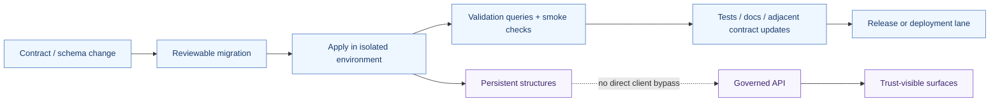

<!-- [KFM_META_BLOCK_V2]
doc_id: NEEDS-VERIFICATION
title: migrations
type: standard
version: v1
status: draft
owners: NEEDS VERIFICATION
created: YYYY-MM-DD
updated: YYYY-MM-DD
policy_label: public
related: [../README.md, ../contracts/, ../schemas/, ../configs/, ../infra/, ../scripts/]
tags: [kfm, migrations, storage-evolution]
notes: [doc_id, owners, and dates require repo-side confirmation; related links verified at repo surface]
[/KFM_META_BLOCK_V2] -->

# `migrations`

Deterministic schema and storage evolution for KFM persistent systems.

> **Status:** draft  
> **Owners:** **NEEDS VERIFICATION**  
>        
> **Quick jump:** [Scope](#scope) · [Repo fit](#repo-fit) · [Accepted inputs](#accepted-inputs) · [Exclusions](#exclusions) · [Current snapshot](#current-snapshot) · [Directory tree](#directory-tree) · [Quickstart](#quickstart) · [Migration posture](#migration-posture) · [Diagram](#diagram) · [Tables](#tables) · [Task list](#task-list--definition-of-done) · [FAQ](#faq) · [Appendix](#appendix--verification-notes)
>
> [!IMPORTANT]
> This README is **evidence-bounded**. The public repo confirms that `migrations/` exists and now includes scaffolded `notes/`, `postgres/`, and `postgis/` subdirectories, but it does **not** yet prove the active migration runner, whether those lanes are wired into CI/CD or deployment, or whether migrations are applied automatically in any environment.
>
> [!WARNING]
> `migrations/` is a **storage-evolution surface**, not a publication shortcut. It must never bypass KFM’s truth path, trust membrane, policy checks, or release discipline.

## Scope

`migrations/` is the reviewable home for changes to durable storage structures used by Kansas Frontier Matrix (KFM).

In practical terms, this directory should carry schema and storage changes in a form that is inspectable, diffable, testable, and reversible enough for governed work. For KFM, that means migrations are part of the evidence system: they should explain what changed, why it changed, what else must change with it, and how an operator can prove the result.

### Truth markers used here

| Marker | Meaning in this README |
|---|---|
| **CONFIRMED** | Supported by public repo inspection or by stable KFM doctrine already reflected in repo-facing docs |
| **PROPOSED** | Repo-native operating direction that fits KFM doctrine but is not yet proven as branch behavior |
| **UNKNOWN** | Not verified strongly enough on the current public branch |
| **NEEDS VERIFICATION** | Placeholder value, owner, path nuance, or runtime fact that must be checked before merge |

### Working posture for this directory

| Status | Statement |
|---|---|
| **CONFIRMED** | `migrations/` is a top-level repository path. |
| **CONFIRMED** | The root repo contract treats `migrations/` as a storage-evolution surface. |
| **CONFIRMED** | The current public snapshot is **scaffolded rather than README-only**: `README.md`, `notes/README.md`, `postgres/README.md`, and `postgis/README.md` are present. |
| **CONFIRMED** | Engine-scoped and note-scoped subdirectories now exist, but the current public tree does **not** yet confirm live SQL migration files on `main`. |
| **PROPOSED** | This directory should hold deterministic, reviewable migrations, with the strongest documented bias toward PostgreSQL/PostGIS SQL. |
| **PROPOSED** | Changes here should link to related contracts, schemas, tests, and docs when behavior changes. |
| **UNKNOWN** | The active migration runner on `main` and the exact execution path in CI/CD or deployment. |
| **UNKNOWN** | Whether non-SQL persistent structures share this directory or live elsewhere. |

## Repo fit

**Path:** `migrations/README.md`  
**Role in repo:** directory guide for storage evolution and migration review discipline.

### Upstream anchors

- [`../README.md`](../README.md) — root repo posture, invariants, and verification-first orientation
- [`../contracts/`](../contracts/) — typed interfaces and machine-readable contract surfaces
- [`../schemas/`](../schemas/) — validation schemas that may move with storage shape
- [`../configs/`](../configs/) — environment and deployment configuration surfaces
- [`../infra/`](../infra/) — runtime and deployment wiring
- [`../scripts/`](../scripts/) — automation that may invoke or validate migrations

### Downstream / adjacent consumers

- [`./postgres/`](./postgres/) for PostgreSQL-scoped migration material
- [`./postgis/`](./postgis/) for spatial-extension and geometry-focused migration material
- [`./notes/`](./notes/) for migration-local rationale, recovery notes, or review context
- [`../tests/`](../tests/) for migration, regression, contract, and smoke-test coverage
- [`../apps/`](../apps/) and [`../packages/`](../packages/) for code that depends on migrated structures
- [`../docs/`](../docs/) for operator runbooks, release notes, and recovery procedures when those surfaces exist

### This README is for

- defining what belongs in `migrations/`
- documenting safe review expectations
- keeping current public branch facts separate from target-state assumptions
- linking storage changes to contracts, tests, and docs
- making future migration growth consistent rather than ad hoc

### This README is not for

- authoritative API schema definitions
- generated dumps, backups, or release artifacts
- one-off analyst SQL
- ingest and ETL pipelines that are not inseparable from schema change
- policy source of truth
- credentials, DSNs, or environment secrets

## Accepted inputs

The following belong in `migrations/` when they are part of durable, reviewable storage evolution.

| Input class | Examples | Why it belongs here |
|---|---|---|
| PostgreSQL schema migrations | `postgres/0001_*.sql`, `CREATE TABLE`, `ALTER TABLE`, constraint updates, index creation/drop | These evolve persistent structure directly. |
| Spatial structure migrations | `postgis/0001_enable_extensions.sql`, geometry/geography columns, SRID corrections, spatial indexes | KFM’s strongest documented storage bias is PostgreSQL/PostGIS. |
| Bounded storage-side transforms | replayable backfill inseparable from a schema change | Sometimes structure and transform must ship together. |
| Compatibility notes | engine/version assumptions, extension requirements, ordering constraints | Reviewers need to understand storage prerequisites explicitly. |
| Rollback / restore guidance | reversal SQL, restore notes, downgrade caveats | KFM should prefer visible recovery posture over assumed reversibility. |
| Migration-local documentation | `notes/<migration-id>.md`, concise purpose/order/precondition notes | Migration history should stay auditable. |

### Minimum bar for anything added here

- It has a clear purpose and target surface.
- It is ordered in a way the chosen runner or review process can understand.
- It states preconditions or assumptions explicitly.
- It names the validation query, smoke test, or verification path.
- It calls out contract/schema/test/doc impact if behavior changes.
- It does **not** silently move policy, runtime business logic, or publication logic into storage scripts.

## Exclusions

The following do **not** belong in `migrations/`.

| Exclusion | Why it stays out | Where it goes instead |
|---|---|---|
| Ad hoc analyst SQL | Not durable migration history | scratch notebooks, issue discussion, or local analysis |
| Bulk ingest / ETL logic | Ingestion is not the same as storage evolution | [`../scripts/`](../scripts/), app/package code, or pipeline surfaces |
| Runtime business logic | Migrations shape storage, not product flow | [`../apps/`](../apps/) or [`../packages/`](../packages/) |
| Policy rules or vocabularies | Policy must remain explicit and testable | [`../policy/`](../policy/) |
| Generated backups / dumps | Artifacts are not migration source of truth | release, backup, or ops surfaces |
| Secrets / DSNs | Never commit credentials | secret manager or local environment configuration |
| Non-deterministic repair jobs | Hard to audit, replay, and review | scripted ops lane with an explicit runbook |
| Publication receipts / evidence bundles | Different contract family with different review semantics | contract, catalog, policy, or release surfaces |

## Current snapshot

The public `migrations/` directory is no longer README-only. It is still **documentation-first and lightly scaffolded**: engine-scoped and note-scoped subdirectories exist, but the current public tree does not yet prove live SQL migration files, an active runner, or automatic application semantics on `main`.

### Current verified scaffold

| Path | Current state | What that means |
|---|---|---|
| `migrations/README.md` | substantive directory README | The contract for this surface is already written and review-facing. |
| `migrations/notes/README.md` | scaffold only | Notes lane exists, but no migration-local note files are publicly confirmed yet. |
| `migrations/postgres/README.md` | scaffold only | PostgreSQL lane exists, but no concrete PostgreSQL migration files are publicly confirmed yet. |
| `migrations/postgis/README.md` | scaffold only | PostGIS lane exists, but no concrete PostGIS migration files are publicly confirmed yet. |

[Back to top](#migrations)

## Directory tree

### Current verified snapshot

```text
migrations/
├── README.md
├── notes/
│   └── README.md
├── postgis/
│   └── README.md
└── postgres/
    └── README.md
```

<details>
<summary>Likely growth inside the current scaffold (PROPOSED, not current repo fact)</summary>

```text
migrations/
├── README.md
├── notes/
│   ├── README.md
│   └── <migration-id>.md
├── postgres/
│   ├── README.md
│   ├── 0001_*.sql
│   ├── 0002_*.sql
│   └── ...
└── postgis/
    ├── README.md
    ├── 0001_enable_extensions.sql
    ├── 0002_spatial_indexes.sql
    └── ...
```

Use a shape like this only if it matches the actual runner and review pattern chosen by the repo. Do **not** add speculative file families just because the scaffold makes them look inevitable.
</details>

## Quickstart

Use a verification-first pass before documenting migration behavior as fact.

```bash
# identify the exact revision under review
git rev-parse HEAD

# inspect the migration surface
find migrations -maxdepth 3 -type f | sort
find migrations -maxdepth 3 -type d | sort

# inspect adjacent storage and validation surfaces
find contracts schemas tests configs infra scripts -maxdepth 3 -type f 2>/dev/null | sort

# search for migration runners or references
grep -RIn "migration\|migrate\|alembic\|flyway\|liquibase\|goose\|dbmate\|knex\|prisma\|postgres\|postgis" . 2>/dev/null | head -200
```

### Verify these before documenting branch behavior as fact

1. Which storage engines are actually migrated from this repo today?
2. Is execution done by raw SQL, a wrapper script, an app CLI, or CI/CD automation?
3. Are migrations applied automatically anywhere, or only manually?
4. Are rollback steps tested, documented, or only assumed?
5. Do changes here require synchronized updates to contracts, schemas, policies, tiles, search indexes, or evidence resolution?
6. Is there a clearly documented boundary between schema changes and historical backfills?

<details>
<summary>Optional local PostgreSQL/PostGIS smoke checks</summary>

Use these only if the active branch or environment really includes local PostgreSQL/PostGIS tooling.

```bash
psql -v ON_ERROR_STOP=1 -c "SELECT version();"
psql -v ON_ERROR_STOP=1 -c "CREATE EXTENSION IF NOT EXISTS postgis;"
psql -v ON_ERROR_STOP=1 -c "SELECT PostGIS_Full_Version();"
```
</details>

## Migration posture

### Core rules

| Rule | What it means here | Why it exists |
|---|---|---|
| Prefer deterministic change | A migration should describe one explicit storage transition. | Review and replay become much safer. |
| Prefer additive change first | Add columns, indexes, views, or structures before destructive reshaping when possible. | Safer rollout and easier compatibility windows. |
| Keep preconditions visible | State engine assumptions, required extensions, locking implications, and ordering dependencies. | Prevents “works on my machine” migration history. |
| Make verification part of the change | Include validation SQL, smoke checks, or linked tests. | A migration without proof is only half-reviewed. |
| Link adjacent contract work | If storage shape changes behavior, update related contracts, schemas, tests, and docs. | KFM treats docs and validation as part of the system. |
| Separate schema evolution from publication | A migration may prepare storage, but it must not silently publish data or bypass policy. | Storage change is not governed publication. |
| Keep recovery honest | Document rollback or restore posture even when the safe answer is “restore, not reverse.” | Hidden irreversibility is worse than visible irreversibility. |

### Subdirectory intent (PROPOSED, aligns with the current scaffold)

| Path | Intended role | Notes |
|---|---|---|
| `postgres/` | PostgreSQL-scoped structural change lane | Good fit for core DDL, constraints, indexes, and non-spatial storage evolution. |
| `postgis/` | PostGIS and spatial-extension lane | Good fit for extension enablement, SRID/geometry changes, spatial indexes, and geometry repair steps that must remain reviewable. |
| `notes/` | migration-local documentation lane | Good fit for restore notes, blast-radius summaries, operator caveats, and review context that should stay near the storage change. |

> [!NOTE]
> The table above reflects the current public scaffold and a repo-native interpretation of it. It is **not** a confirmed enforcement rule or runner contract on `main`.

### Practical authoring expectations

When a migration is more than trivial, reviewers should be able to answer:

- What surface is changing?
- Why is the change necessary now?
- What data or query patterns depend on it?
- What breaks if this is applied twice, partially applied, or applied out of order?
- What verifies success?
- What is the safest response if it fails midway?

### Illustrative migration header

```sql
-- id: 0001_example_change
-- target: postgres/postgis
-- purpose: explain the storage transition in one sentence
-- preconditions: list required extensions, existing tables, or ordering assumptions
-- rollback: describe reverse SQL or restore posture
-- verification: name the query or test that proves success
```

> [!NOTE]
> The header above is a review pattern, not a confirmed repo-local migration format.

## Diagram


```mermaid
flowchart LR
    A[Contract / schema change] --> B[Reviewable migration]
    B --> C[Apply in isolated environment]
    C --> D[Validation queries + smoke checks]
    D --> E[Tests / docs / adjacent contract updates]
    E --> F[Release or deployment lane]

    C --> G[Persistent structures]
    G -. no direct client bypass .-> H[Governed API]
    H --> I[Trust-visible surfaces]

    classDef review fill:#eef6ff,stroke:#4a78c2,color:#183b6b;
    classDef runtime fill:#f7f6ff,stroke:#7c52c7,color:#3e246d;

    class A,B,C,D,E,F review;
    class G,H,I runtime;
```

## Tables

### Change-class decision table

| Change class | Keep it here? | Notes |
|---|---|---|
| PostgreSQL / PostGIS schema change | **Yes** | Primary documented fit for this directory. |
| Index or materialized-view change tied to runtime query behavior | **Usually yes** | Keep validation and rollback posture explicit. |
| Extension enablement or version-aware upgrade step | **Yes** | Especially important for spatial capabilities and compatibility. |
| Historical backfill that can run independently of schema evolution | **Usually no** | Prefer a scripted/runbook lane. |
| Search / graph / tile rebuild | **Not by default** | Verify whether those are managed elsewhere. |
| Policy redaction logic | **No** | Keep in policy and governed runtime layers. |
| Direct data publication | **No** | Must remain on the truth path and governed release path. |

### Review matrix

| Review question | Why it matters |
|---|---|
| Does this change canonical storage, read-optimized storage, or both? | Prevents quiet authority drift. |
| Does it require contract or API changes? | Storage evolution can change runtime expectations. |
| Does it affect sensitive geometry or restricted fields? | Spatial systems can leak more than column names imply. |
| Is the migration safe under retry or partial failure? | Real operations fail at awkward moments. |
| Is restore posture documented if rollback is unsafe? | Honest recovery beats implied reversibility. |

## Task list / Definition of done

A migration change should not be called complete until the following are true.

- [ ] The target storage surface is named explicitly.
- [ ] Preconditions and ordering assumptions are documented.
- [ ] Forward migration is reviewable.
- [ ] Rollback or restore posture is documented.
- [ ] Validation SQL, smoke checks, or linked tests exist.
- [ ] Related contract/schema/test/doc updates are linked when behavior changes.
- [ ] Sensitive geometry, policy labels, or user-visible effects were reviewed if applicable.
- [ ] The chosen runner or execution path is documented **or** explicitly left `UNKNOWN`.
- [ ] No secrets, ad hoc repair logic, or publication artifacts were smuggled into this directory.
- [ ] The branch history stays understandable to someone who did not author the change.

## FAQ

### Why keep `migrations/` even when it is still mostly scaffolded?

Because the directory establishes a durable place for storage evolution before the repo accumulates one-off patterns that are harder to govern later. A scaffolded lane is easier to tighten than an ad hoc history spread across unrelated folders.

### Why are `postgres/` and `postgis/` present before public SQL files are confirmed?

Because the current branch has already chosen an engine-scoped scaffold. What it has **not** yet proven publicly is the runner, file naming rule, or application pathway that turns that scaffold into executed migration history.

### Why not keep all SQL here?

Because not all SQL is migration history. Analyst queries, one-off repairs, and ETL logic have different review, replay, and audit needs.

### Are migrations allowed to change user-visible behavior?

Yes, but not silently. If a migration changes runtime behavior, the adjacent contracts, tests, docs, and release notes should move with it.

### Do graph, search, or tile changes belong here?

Not by default. Keep them here only when the branch proves they are managed as migration history rather than as rebuildable projections or scripts.

### Why is the runner still `UNKNOWN`?

Because this README should stay branch-honest. It is better to document the review contract clearly than to guess the mechanism and write a convincing fiction.

## Appendix — verification notes

<details>
<summary>Open verification questions</summary>

1. What is the active migration mechanism on `main`?
2. Are migrations executed by developers, CI, deployment hooks, or a dedicated operator workflow?
3. Is PostgreSQL/PostGIS the only engine in scope for this directory, or just the strongest documented bias?
4. Are destructive changes ever permitted, and under what approval or restore requirements?
5. Where do restore drills and rollback runbooks live once the repo grows?
6. Should rebuildable projections stay out of `migrations/`, or are some currently treated as durable schema history?
</details>

<details>
<summary>Why this README is stricter than a normal directory placeholder</summary>

KFM is not just a codebase. It is a governed evidence system. That means even “small” directories like `migrations/` should help maintainers avoid quiet bypasses:

- schema drift without tests
- destructive change without restore posture
- storage changes that outpace docs
- runtime behavior changes that never update contracts
- migration history that explains *how* but not *why*

A good migrations README keeps future urgency from becoming future ambiguity.
</details>

[Back to top](#migrations)
