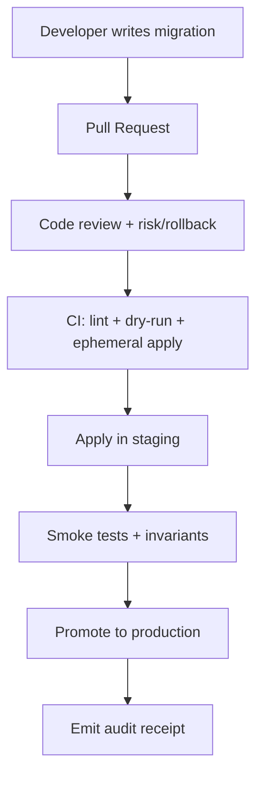

<!-- [KFM_META_BLOCK_V2]
doc_id: kfm://doc/4cb980f7-d55f-44d0-990d-e62cfd04d8d4
title: DB Migrations
type: standard
version: v1
status: draft
owners: TBD
created: 2026-02-25
updated: 2026-02-25
policy_label: restricted
related:
  - TODO: link to repo root README
  - TODO: link to database runbook / ops docs
tags: [kfm, migrations, db]
notes:
  - Treat database migrations as governed artifacts: reviewed, tested, auditable, reversible.
[/KFM_META_BLOCK_V2] -->

# DB Migrations
Evolve the application database schema **safely**, **reproducibly**, and **auditably**.


> **NOTE**
> This README is intentionally **tool-agnostic**. If your repo uses a specific migration tool (Flyway/Liquibase/Alembic/Prisma/Knex/etc.), keep the governance + safety sections, and replace the *tooling* details with the real commands/conventions.

## Quick navigation
- [Purpose](#purpose)
- [Directory contract](#directory-contract)
- [Layout](#layout)
- [Conventions](#conventions)
- [Workflow](#workflow)
- [Governance and auditability](#governance-and-auditability)
- [Definition of done for migration PRs](#definition-of-done-for-migration-prs)
- [Troubleshooting](#troubleshooting)
- [Related docs](#related-docs)

---

## Purpose

This directory contains **database migration artifacts** that change the database schema (and, when explicitly approved, data) over time.

Goals:

- **Reproducibility:** any environment (dev/CI/staging/prod) reaches the same schema from the same commit.
- **Safety:** schema changes are designed to avoid downtime and accidental data loss.
- **Auditability:** every migration is traceable to a change request and a reviewed decision.
- **Reversibility:** each change has a rollback strategy (down migration, compensating migration, or documented manual rollback).

[Back to top](#db-migrations)

---

## Directory contract

**Path:** `migrations/db/`

### Belongs here (acceptable inputs)

- Versioned migration scripts (SQL and/or tool-specific changelogs).
- Deterministic schema helpers (e.g., views, functions, triggers) **if** they are managed by migrations.
- Optional *deterministic* seed/reference data needed for schema invariants (e.g., lookup tables), **only if** it contains no sensitive data and is environment-safe.
- Documentation needed to run, validate, and troubleshoot migrations.

### Must NOT be stored here (exclusions)

- ❌ Production data dumps, backups, or any dataset containing PII/secrets.
- ❌ One-off “fix it in prod” scripts that are not part of the governed migration workflow.
- ❌ Credentials (API keys, database passwords, connection strings).
- ❌ Vendor binaries, database clients, or large generated artifacts.

> **WARNING**
> If you need to change production data in a way that’s not deterministic or cannot be safely re-run, write a **runbook** and route through governance review. Do not commit ad-hoc scripts here.

[Back to top](#db-migrations)

---

## Layout

Because the migration tool is not confirmed in-repo, treat this as an **example layout** (adapt as needed):

```text
migrations/
  db/
    README.md
    20260225_1200__add_widgets_table.up.sql
    20260225_1200__add_widgets_table.down.sql
    20260226_0930__backfill_widget_slug.sql
    meta/
      manifest.json
      checksums.txt
```

**Guidance:**

- Keep migrations **flat** until scale demands subfolders.
- If your tool enforces a structure (e.g., `migrations/<timestamp>_<name>/...`), follow the tool and document it here.

[Back to top](#db-migrations)

---

## Conventions

### 1) Naming and ordering

Pick one deterministic ordering strategy and stick to it:

- **Timestamp-based**: `YYYYMMDD_HHMM__short_description`
- **Increment-based**: `V000123__short_description`

**Rule:** filenames should be unique, monotonically ordered, and readable.

### 2) Migration metadata header

For SQL migrations, include a small header block at the top (works in most SQL dialects):

```sql
-- [KFM_MIGRATION]
-- id: 20260225_1200__add_widgets_table
-- owner: TBD
-- ticket: TBD
-- risk: low|medium|high
-- rollout: safe|requires-maintenance-window
-- rollback: down|compensating|manual
-- dialect: TBD
-- [/KFM_MIGRATION]
```

### 3) Backward/forward compatibility

Prefer **expand → migrate → contract**:

1. **Expand**: add new nullable columns/tables/indexes in a non-breaking way.
2. **Migrate**: backfill in batches; ship application code that can read both old/new.
3. **Contract**: remove old columns/indexes only after validation + rollback window.

> **TIP**
> The database is a shared contract. Design migrations so old and new application versions can coexist during rollout.

### 4) Data migrations

- Keep data migrations **idempotent** when possible.
- Avoid long-running updates that lock large tables.
- Batch backfills and record progress if you must run multi-step migrations.

### 5) Safety basics

- Default to **transactional migrations** where supported.
- If a migration cannot be transactional, document why and how it’s made safe.
- Prefer online/index-safe operations where your DB supports them.

[Back to top](#db-migrations)

---

## Workflow

### Recommended promotion path



### Recommended CI gates

Minimum gates (adjust to your stack):

- ✅ Validate migration ordering + uniqueness
- ✅ Apply to an **ephemeral database** in CI
- ✅ Run schema-level checks (constraints, migrations table state)
- ✅ Run application smoke tests against migrated schema
- ✅ Produce an **audit receipt** artifact (see next section)

[Back to top](#db-migrations)

---

## Governance and auditability

Migrations affect data integrity and system behavior. Treat them as **governed artifacts**:

### Required traceability

Each migration PR must include:

- A link to the change request (issue/ticket/ADR).
- A short *impact statement* (what changes, what might break).
- A rollback strategy.
- Any required operational steps (maintenance window, feature flag sequencing).

### Audit receipt (CI artifact)

CI/CD should emit a machine-readable receipt (store in CI artifacts, not necessarily in git), for example:

```json
{
  "migration_id": "20260225_1200__add_widgets_table",
  "git_sha": "TODO",
  "applied_at": "TODO",
  "db_target": "staging|prod",
  "tool": "TODO",
  "checksums": {"file": "TODO"},
  "result": "success|failure"
}
```

> **NOTE**
> The exact fields depend on your tooling, but the intent is invariant: **who/what/when/why + inputs/outputs + checksums**.

[Back to top](#db-migrations)

---

## Definition of done for migration PRs

Use this checklist before merging:

- [ ] Migration files follow naming/order conventions.
- [ ] Migration includes metadata header (or equivalent).
- [ ] Migration is safe under expected traffic/load (or explicitly requires a maintenance window).
- [ ] Rollback strategy is documented (down/compensating/manual).
- [ ] CI applies migration to an ephemeral DB and runs tests.
- [ ] Any required app changes are staged via expand/contract (when applicable).
- [ ] No secrets, PII, or production data is committed.
- [ ] Ops notes are included (monitoring, expected runtime, lock risks).

[Back to top](#db-migrations)

---

## Troubleshooting

### “Migration failed mid-run”
- Do **not** edit an applied migration in place.
- Identify whether the tool supports:
  - automatic rollback,
  - manual repair/marking,
  - or requires a compensating migration.
- Capture logs + the exact migration id in the incident record.

### “Checksum mismatch / drift”
Common causes:
- A migration file was modified after being applied somewhere.
- Environments were migrated from different commits.

Resolution pattern:
1. Determine **which DB** is authoritative (usually production).
2. Use the tool’s supported repair workflow (or a new migration) to converge.

### “It works on my machine”
- Ensure everyone runs migrations from the same git SHA.
- Ensure local DB is not missing prior migrations (rebuild from scratch when in doubt).

[Back to top](#db-migrations)

---

## Related docs

- `migrations/README.md` (TODO if exists)
- `docs/db/` (TODO if exists)
- `docs/runbooks/db-migrations.md` (TODO if exists)
- Architecture invariants: “clients never hit DB directly; use governed APIs” (TODO link)
