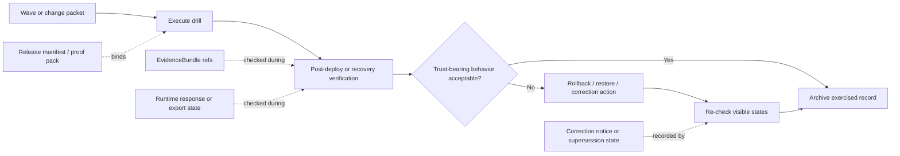

# `drills`

Exercised verification, rollback, restore, and correction records for governed KFM migration rehearsals.

> Status: experimental  
> Document lifecycle: draft  
> Authority posture: operational / supporting  
> Owners: NEEDS VERIFICATION  
> [](#) [](#) [](#) [](#) [](#)  
> Repo fit: path `migrations/drills/README.md` · parent [`../README.md`](../README.md) · sibling [`../waves/README.md`](../waves/README.md) · sibling [`../templates/README.md`](../templates/README.md)  
> Quick jump: [Scope](#scope) · [Repo fit](#repo-fit) · [Accepted inputs](#accepted-inputs) · [Exclusions](#exclusions) · [Current repo signal](#current-repo-signal) · [Directory tree](#directory-tree) · [Quickstart](#quickstart) · [Usage](#usage) · [Diagram](#diagram) · [Tables](#tables) · [Task list / definition of done](#task-list--definition-of-done) · [FAQ](#faq) · [Appendix](#appendix)

> [!IMPORTANT]
> Current public repo evidence supports this directory as a real lane, but not yet as a populated drill archive. Treat this README as the governing directory contract until exercised drill packets are surfaced on the active branch.

> [!WARNING]
> A drill is not a migration plan, not a reusable scaffold, and not a quiet ops note. In KFM it is the exercised evidence that rollback, restore, correction, and visible trust-state propagation were actually rehearsed and inspected.

> [!NOTE]
> `../waves/` is for bounded change packets and review-first migration bundles. `drills/` is for what happened when those plans were exercised.

---

## Scope

`drills/` is the exercised-evidence lane inside `migrations/`.

It exists to store records that prove a migration-bearing seam was rehearsed or executed honestly enough to inspect later. That includes technical recovery and trust-visible behavior: rollback, restore, post-deploy verification, correction visibility, and stale or superseded state propagation where relevant.

In KFM terms, `drills/` should help answer questions such as:

- Did the migration or cutover actually run?
- What release, dataset version, or proof objects did the rehearsal bind to?
- What happened on trust-bearing surfaces after the change?
- Could the team roll back placement, restore state, or issue a visible correction without breaking lineage?
- What follow-up work became mandatory after the rehearsal?

`drills/` should favor compact, reviewable records over sprawling narrative logs. The point is not to archive every console line forever. The point is to preserve enough exercised evidence that a later reviewer can reconstruct what was attempted, what was proven, what failed, and what still needs work.

[Back to top](#drills)

## Repo fit

| Aspect | Guidance |
| --- | --- |
| Path | `migrations/drills/README.md` |
| Parent surface | [`../README.md`](../README.md) |
| Sibling surfaces | [`../waves/README.md`](../waves/README.md) for packetized change waves · [`../templates/README.md`](../templates/README.md) for reusable starters |
| Adjacent trust surfaces | [`../../contracts/README.md`](../../contracts/README.md) · [`../../schemas/README.md`](../../schemas/README.md) · [`../../policy/README.md`](../../policy/README.md) · [`../../tests/README.md`](../../tests/README.md) |
| Primary audience | Maintainers, reviewers, platform engineers, data engineers, release stewards, and anyone verifying recovery or correction posture |
| Update trigger | Any change to drill classes, minimum evidence, visible-state checks, naming rules, or packet layout expectations |

### What belongs here

This directory is for exercised records that sit **after** planning and **beside** release evidence:

- post-deploy verification records
- rollback rehearsals
- restore rehearsals
- correction visibility checks
- stale / superseded / withdrawn propagation checks
- redacted screenshots, evidence pointers, and notes needed to interpret those outcomes

### What this README must do

This README should make the lane legible even when the directory is still sparse:

1. define the directory’s role
2. separate confirmed repo reality from proposed future shape
3. give maintainers a compact starter contract for first real drill packets
4. prevent drift between `waves/`, `templates/`, and `drills/`

[Back to top](#drills)

## Accepted inputs

| Input class | Examples | Why it belongs here |
| --- | --- | --- |
| Drill packet directory | `<yyyymmdd>_<slug>/` | Keeps rehearsals grouped as reviewable units |
| Packet index | `README.md` | Gives a human-readable summary of what was exercised |
| Verification note | `post-deploy-verification.md` | Records cutover checks and visible post-change behavior |
| Correction note | `correction-visibility.md` | Records whether correction-pending, corrected, withdrawn, or superseded states were actually visible |
| Rollback note | `rollback.md` | Useful when rollback is the thing being proven |
| Restore note | `restore.md` | Useful when recovery from protected artifacts is the thing being proven |
| Evidence pointers | paths to logs, traces, screenshots, dashboards, manifests, proof packs | Lets reviewers inspect the rehearsal without copying whole systems into Git |
| Redacted captures | `screenshots/`, diffs, before/after state captures | Important when the drill proves trust-visible UI or map behavior |
| Follow-up notes | issue refs, ADR refs, runbook updates | Turns rehearsal into durable learning |

### Naming rule

Use date-first naming for drill directories:

```text
<yyyymmdd>_<slug>/
```

Examples:

```text
20260324_hydrology-release-correction-drill/
20260402_postgis-upgrade-rollback-rehearsal/
20260409_focus-runtime-public-safe-restore-check/
```

### Truth markers inside drill packets

Use the repo’s evidence vocabulary inside drill records when needed:

- **CONFIRMED** = directly observed in this rehearsal
- **INFERRED** = reasonable reading of the observed evidence, but not directly surfaced
- **PROPOSED** = recommended next shape or follow-up
- **NEEDS VERIFICATION** = should be checked on the active branch, runtime, or environment before being treated as settled
- **UNKNOWN** = not proven by the packet

## Exclusions

The following do **not** belong in `drills/`:

| Exclusion | Put it here instead | Why |
| --- | --- | --- |
| Planned change packet | [`../waves/`](../waves/README.md) | Planning and exercised evidence should stay distinct |
| Reusable starter skeleton | [`../templates/`](../templates/README.md) | Templates should not be mixed with real outcomes |
| Canonical release proof pack | release / proof-pack surface | Drill packets may reference proof packs but should not become the release system |
| Workflow YAML or runner code | `../../.github/workflows/` or script/package surfaces | This directory is evidence-facing, not orchestration-facing |
| Secrets, credentials, or live tokens | never commit here | Recovery proof must never require unsafe disclosure |
| Raw backup blobs or large restore images | designated artifact / storage surfaces | Link to them; do not turn Git into a binary dump |
| Unexercised ideas about future drills | issue, ADR, or template surfaces | Keep this lane outcome-oriented |

> [!CAUTION]
> Do not quietly convert a wave packet into a drill by appending “results” at the bottom. Planning and exercised evidence should remain separately inspectable.

[Back to top](#drills)

## Current repo signal

| Signal | Status | Practical consequence |
| --- | --- | --- |
| `migrations/` is a real top-level lane with `drills/`, `waves/`, and `templates/` | **CONFIRMED** | This README should behave like a local directory contract, not a standalone essay |
| `migrations/drills/` currently exposes `README.md` only | **CONFIRMED** | Do not imply a populated drill inventory yet |
| Parent migration docs already describe a dated drill-packet pattern | **CONFIRMED documented guidance** | Align first real packet structure to parent doctrine unless branch reality proves otherwise |
| `post-deploy-verification.md` and `correction-visibility.md` are the clearest already-suggested packet files | **CONFIRMED documented guidance** | These are the safest first packet subfiles |
| `rollback.md`, `restore.md`, `evidence/`, and `screenshots/` as sub-structure | **PROPOSED** | Helpful additions, but not yet proven as mounted convention |
| Executed drill inventory, runner hooks, screenshot baselines, and automated drill gates | **UNKNOWN / NEEDS VERIFICATION** | Keep manual-vs-automated posture explicit in every packet |

## Directory tree

### Current public shape

```text
migrations/
├── README.md
├── drills/
│   └── README.md
├── templates/
│   └── README.md
└── waves/
    └── README.md
```

### Suggested first real shape

```text
migrations/
└── drills/
    └── <yyyymmdd>_<slug>/
        ├── README.md
        ├── post-deploy-verification.md
        ├── correction-visibility.md
        ├── rollback.md          # PROPOSED
        ├── restore.md           # PROPOSED
        ├── evidence/            # PROPOSED
        └── screenshots/         # PROPOSED
```

### Interpretation rule

- The **current public shape** is a repo-state snapshot.
- The **suggested first real shape** is a starter pattern.
- Only the packet directory, `README.md`, `post-deploy-verification.md`, and `correction-visibility.md` are the safest directly aligned guidance.
- Additional subfiles are intentionally marked **PROPOSED** until branch reality, fixtures, or active runbooks confirm them.

[Back to top](#drills)

## Quickstart

Use these commands to inspect the active branch before assuming any drill inventory or automation exists.

```bash
git rev-parse HEAD
git ls-files 'migrations/**' | sort
git ls-files 'migrations/drills/**' | sort
find migrations/drills -maxdepth 4 -type f | sort
```

Check adjacent migration surfaces:

```bash
sed -n '1,220p' migrations/README.md
sed -n '1,220p' migrations/waves/README.md
sed -n '1,220p' migrations/templates/README.md
```

Check whether the branch already contains migration-related automation or fixtures:

```bash
git ls-files '.github/workflows/*.yml' '.github/workflows/*.yaml' | sort
git grep -nE 'rollback|restore|correction|withdraw|supersed|stale|drill' -- . 2>/dev/null
git ls-files 'tests/**' 'fixtures/**' | sort
```

Review drift before adding a new drill packet:

```bash
git diff --name-only origin/main...HEAD | grep -E '^migrations/(drills|waves|templates)/' || true
```

> [!TIP]
> If the commands above return little or nothing, keep the packet small and brutally honest. A thin but truthful drill record is better than a rich fictional one.

## Usage

### 1. Choose the drill class

Start by stating what is being proven.

Typical classes:

- **post-deploy verification**
- **rollback**
- **restore**
- **correction visibility**
- **stale / superseded propagation**

A single packet may cover more than one class, but the lead class should be obvious from the folder name and packet summary.

### 2. Bind the drill to a concrete seam

Every drill should point to the exact seam it exercised:

- related wave
- related release
- related dataset version
- related proof pack or manifest
- affected surfaces
- environment used

If the packet cannot answer “what exactly was exercised,” it is not ready.

### 3. Record preconditions and stop rule

Before running the rehearsal, write down:

- expected visible states
- expected fail-closed behavior
- what counts as success
- what condition halts the drill
- who can approve continuation

### 4. Execute and capture evidence

Capture enough evidence to support later review:

- command outputs or dashboard pointers
- before / after surface captures
- linked logs, traces, and metrics
- proof-object references
- human observations where automation is missing

### 5. Classify the result honestly

Use an outcome field such as:

- `pass`
- `fail`
- `partial`
- `needs-follow-up`

A visually successful demo with missing lineage, missing trust cues, or unclear correction behavior should not be recorded as a clean pass.

### 6. Close with follow-up obligations

A useful drill packet ends with consequences:

- runbook updates
- schema or fixture gaps
- ADR follow-up
- missing automation
- required re-rehearsal

> [!IMPORTANT]
> KFM drill value comes from inspectable consequences, not from theatrical confidence.

[Back to top](#drills)

## Diagram



### Reading note

The packet should make all four evidence edges legible:

1. what change was exercised
2. what evidence was checked
3. what user-visible state changed
4. what follow-up happened when the answer was not clean success

## Tables

### Drill families at a glance

| Drill class | What it proves | Minimum evidence | Typical trigger |
| --- | --- | --- | --- |
| Post-deploy verification | The deployed change still behaves honestly on trust-bearing surfaces | release or revision ref, affected surface list, smoke results, visible-state check | after cutover or promotion candidate |
| Rollback | The system can return placement or derived delivery to a last known good state without lineageless undo | rollback trigger, target artifact/ref, post-rollback verification, operator notes | failed cutover, unsafe promotion, broken projection |
| Restore | Protected state can be recovered in a way that remains inspectable and joinable | restore source, timing, integrity checks, downstream reconnect notes | backup rehearsal, disaster readiness, recovery maintenance |
| Correction visibility | Corrected, withdrawn, superseded, or correction-pending states become visibly legible | before/after captures, correction ref, surface-by-surface observations | published meaning changed |
| Stale-state propagation | Partial or delayed rebuilds do not look current by accident | stale markers, freshness notes, map/export/focus checks | lagging projection or delayed derived rebuild |

### Minimum packet fields

| Field | Why it matters |
| --- | --- |
| `id` | Stable packet identity |
| `class` | States what is being proven |
| `date` / `owners` / `environment` | Gives operational accountability |
| related wave / release / dataset refs | Joins the drill to the governed path |
| affected surfaces | Keeps trust-visible inspection concrete |
| preconditions and stop rule | Prevents vague “we tried it” reporting |
| expected vs observed visible states | Separates intent from reality |
| evidence refs | Keeps the packet inspectable without duplicating whole systems |
| outcome | Forces explicit judgment |
| follow-up | Converts rehearsal into architecture maintenance |

### Surface checks worth capturing

| Surface | Ask this question |
| --- | --- |
| Map / Explorer | Did the map show stale, superseded, withdrawn, or corrected state honestly? |
| Dossier / detail | Could a reviewer still trace release and evidence context? |
| Export / download | Did export posture match visible public posture? |
| Focus / bounded synthesis | Did the runtime cite, abstain, deny, or error correctly after the change? |
| Evidence view | Could the user still drill to supporting evidence without broken lineage? |

[Back to top](#drills)

## Task list / definition of done

A drill packet is not done until the following checklist is satisfied.

- [ ] Drill class is named clearly.
- [ ] Exact commit, release, dataset version, or proof-pack refs are captured.
- [ ] Owner, environment, and date are recorded.
- [ ] Preconditions and stop rule are explicit.
- [ ] Affected surfaces are listed.
- [ ] Expected visible states were written **before** execution.
- [ ] Observed visible states were recorded **after** execution.
- [ ] Evidence refs point to logs, screenshots, dashboards, manifests, or proof objects.
- [ ] Manual versus automated checks are stated honestly.
- [ ] Outcome is classified as `pass`, `fail`, `partial`, or `needs-follow-up`.
- [ ] Follow-up issues, ADRs, runbooks, or docs changes are linked.
- [ ] No secrets, tokens, or unsafe internal-only material were committed.

### Stronger definition of done for first real KFM rehearsal

For a first serious trust-bearing drill, prefer this higher bar:

- [ ] one rollback or restore path was actually rehearsed
- [ ] one correction visibility path was actually checked
- [ ] at least one trust-bearing public-safe surface was inspected visually
- [ ] the packet can be reviewed without oral reconstruction from the original operator

## FAQ

### Is a drill the same as a wave?

No.

`waves/` is for packetized intended change. `drills/` is for exercised evidence after that change path is rehearsed or executed.

### Why keep rollback separate from correction?

Because they prove different things.

- **Rollback** proves deploy or projection recovery.
- **Correction** proves visible historical integrity under content change.

A system may be able to roll back code and still fail to communicate correction honestly.

### Can a drill be mostly manual?

Yes, especially while the repo remains documentation-first and branch automation is still incomplete or unverified.

But the packet should say so directly. Do not imply automation that does not exist.

### Should every drill include screenshots?

Not always, but trust-visible surfaces strongly benefit from them. For map, dossier, export, or Focus behavior, screenshots or equivalent captures are usually worth the space.

### What should the first serious packet prove?

Prefer one bounded, public-safe loop that exercises:

- post-deploy verification
- correction visibility
- rollback or restore posture
- evidence drill-through
- visible stale / superseded handling where relevant

[Back to top](#drills)

## Appendix

<details>
<summary><strong>Proposed packet header</strong></summary>

```yaml
id: 20260324_hydrology-release-correction-drill
class: correction-visibility
status: partial
owners:
  - NEEDS_VERIFICATION
environment: staging
related_wave: wave-0001
related_release: release-2026-03-24
related_proof_objects:
  - release_manifest:<ref>
  - release_proof_pack:<ref>
  - projection_build_receipt:<ref>
  - correction_notice:<ref>
affected_surfaces:
  - map
  - dossier
  - export
  - focus
preconditions:
  - promoted candidate available
  - public-safe fixture pack loaded
  - screenshot baseline path identified
stop_rule: halt if lineage refs cannot be joined or visible state becomes misleading
expected_visible_states:
  - correction-pending visible where applicable
  - stale-derived state visible if rebuild lags
  - runtime returns cite / abstain / deny / error honestly
observed_visible_states:
  - correction-pending visible on dossier
  - map tile remained stale-visible for 7 minutes
evidence_refs:
  - screenshots/before-map.png
  - screenshots/after-map.png
  - evidence/post-deploy-verification.txt
  - evidence/correction-trace.md
outcome: partial
follow_up:
  - issue:<ref>
  - runbook:update:<ref>
notes:
  - merge-blocking automation not yet verified on this branch
  - correction propagation to export surface needs re-test
```

</details>

<details>
<summary><strong>Suggested per-packet file set</strong></summary>

```text
<yyyymmdd>_<slug>/
├── README.md
├── post-deploy-verification.md
├── correction-visibility.md
├── rollback.md          # PROPOSED
├── restore.md           # PROPOSED
├── evidence/            # PROPOSED
└── screenshots/         # PROPOSED
```

Use the smallest set that makes the rehearsal inspectable. Do not create empty ceremony files just to make the tree look complete.

</details>

<details>
<summary><strong>Short review prompts</strong></summary>

- What did this drill prove that was previously only asserted?
- Which trust-bearing seam is still not exercised?
- Which visible states were checked, and which were assumed?
- What would a later reviewer still be unable to reconstruct?
- What must be automated next because this packet was too manual?

</details>
