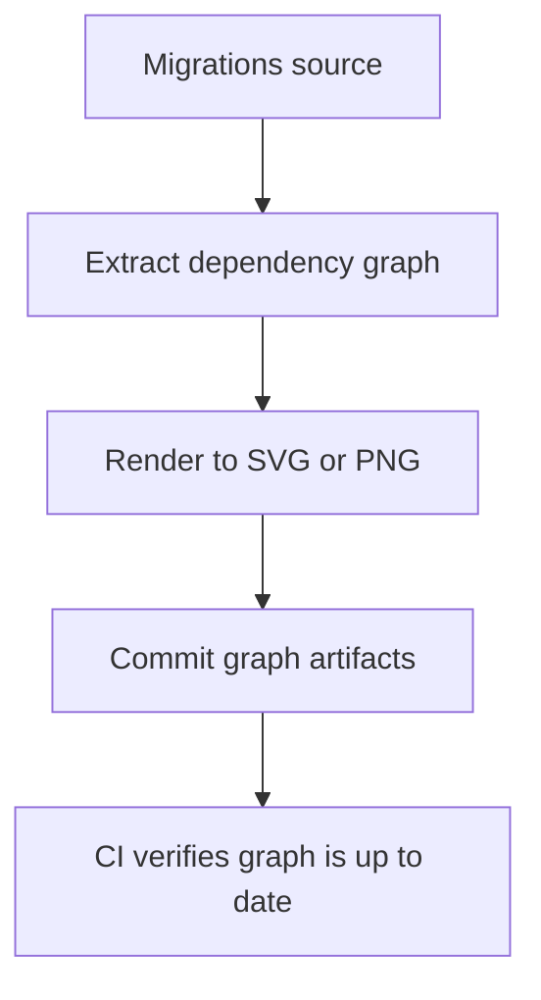

<!-- [KFM_META_BLOCK_V2]
doc_id: kfm://doc/cf86fc06-e4c2-4192-89b8-f994a214372b
title: Migration Graph Artifacts
type: standard
version: v1
status: draft
owners: TBD
created: 2026-02-25
updated: 2026-02-25
policy_label: restricted
related:
  - ../README.md
  - ../../README.md
tags: [kfm, migrations, graph]
notes:
  - This README is intentionally tool-agnostic. Replace TODOs once the repo's migration tooling is confirmed.
[/KFM_META_BLOCK_V2] -->

# Migration Graph Artifacts
Rendered dependency graphs for migrations related to the **graph** subsystem (or the migration graph itself), to support review, auditing, and CI drift detection.


---

## Quick navigation
- [Purpose](#purpose)
- [Where this fits](#where-this-fits)
- [What belongs here](#what-belongs-here)
- [What must NOT go here](#what-must-not-go-here)
- [How to update the graph](#how-to-update-the-graph)
- [CI and promotion gates](#ci-and-promotion-gates)
- [Troubleshooting](#troubleshooting)
- [Appendix: recommended artifact registry](#appendix-recommended-artifact-registry)

---

## Purpose
This directory exists to keep **human-readable and machine-verifiable** representations of migration dependencies close to the migration source.

Typical uses:
- **Review aid:** Quickly see ordering, branches, and merge points in migration history.
- **Governance:** Provide an auditable snapshot that can be referenced in PRs and release notes.
- **CI drift detection:** Confirm the checked-in graph matches the migrations currently present.

> NOTE  
> The exact migration tooling is **not confirmed** from the repo context available to this assistant. This README describes conventions and guardrails that work for common migration systems (SQL migrations, Alembic, Django, Flyway/Liquibase-style, graph DB migrations, etc.). Update the *How to update* section with the real commands once confirmed.

[Back to top](#migration-graph-artifacts)

---

## Where this fits
At a high level, the intent is:



### Repository layering expectations
- **Clients/UI** should never read migrations directly.
- **Migrations** are infrastructure artifacts and should be applied by controlled tooling in CI/CD and deploy pipelines.
- **Graph outputs** in this directory should be treated as *derived, reviewable artifacts* (not primary sources of truth).

[Back to top](#migration-graph-artifacts)

---

## What belongs here
✅ **Allowed inputs/artifacts** (store *only what supports review + verification*):
- Rendered graphs (e.g., `.svg`, `.png`) suitable for PR diffs and documentation.
- The canonical dependency representation (commonly `.dot` or `.json`) **if** it is deterministic and stable across environments.
- A small manifest describing how the graph was generated (tool + version + input hash).

### Expected directory contents
The exact filenames may differ; this is an **example** layout:

```text
migrations/
  graph/
    README.md
    graph.dot              # canonical dependency graph (optional but recommended)
    graph.svg              # rendered view for humans
    graph.json             # machine-readable edges/metadata (optional)
    manifest.yaml          # generation details + checksums (recommended)
```

> TIP  
> Prefer **SVG** for diffs and embedding in docs; prefer **DOT/JSON** for deterministic CI checks.

[Back to top](#migration-graph-artifacts)

---

## What must NOT go here
❌ **Exclusions** (do not commit these):
- Database dumps, table extracts, or anything containing production data.
- Secrets or credentials (connection strings, API keys, tokens).
- Environment-specific graphs that differ per developer machine without pinning tool versions.
- One-off screenshots or manually edited graphs (graphs must be reproducible).

> WARNING  
> Migration graphs can leak sensitive implementation details (table names, internal service boundaries). Keep `policy_label` accurate for your repo. If the repository is public, review this directory’s contents before publishing.

[Back to top](#migration-graph-artifacts)

---

## How to update the graph
Because migration toolchains vary, **choose one** of the patterns below and standardize on it.

### Pattern A: Source-of-truth DOT, render to SVG
1. Generate/refresh the canonical graph:
   - Output: `graph.dot` (or equivalent)
2. Render:
   - Output: `graph.svg`
3. Update the manifest (`manifest.yaml`) with tool versions and checksums.
4. Commit all updated artifacts together with the migration changes.

Example (Graphviz DOT → SVG):

```bash
# Replace filenames as needed
dot -Tsvg graph.dot -o graph.svg
```

### Pattern B: Source-of-truth JSON, render to SVG/PNG
1. Generate `graph.json` from the migration system.
2. Render via your preferred renderer (Graphviz, Mermaid generator, internal script).
3. Commit `graph.json`, rendered output, and the manifest.

### Pattern C: Generate at build time, but verify in CI
If you *don’t* want to commit rendered artifacts:
- Generate graphs in CI (ephemeral)
- Fail CI if the generated canonical representation differs from what is committed (or if nothing is committed, upload as CI artifact)
- **Still keep this README** as the contract for how to reproduce locally.

> NOTE  
> Determinism is the key requirement. If graph generation is not stable (ordering, timestamps, machine paths), CI will be noisy and reviewers won’t trust diffs.

[Back to top](#migration-graph-artifacts)

---

## CI and promotion gates
Treat any change under `migrations/` as **high-impact**.

### Definition of done for changes that affect this directory
- [ ] Migration changes reviewed by an owner of the data/storage layer (owner list: **TBD**).
- [ ] Graph artifacts regenerated and committed (or CI artifacts updated) in the same PR.
- [ ] A rollback path exists (down migration, compensating migration, or documented “no rollback” rationale).
- [ ] Smoke test / migration test passes in CI.
- [ ] Manifest updated (tool version + input checksum) **if used**.

### Recommended CI checks
- **Graph drift check:** regenerate canonical graph and ensure it matches `graph.dot`/`graph.json`.
- **No secrets check:** scan for accidental credentials in `.dot/.json/.svg`.
- **Determinism check:** ensure the renderer doesn’t inject timestamps or absolute paths into outputs.

[Back to top](#migration-graph-artifacts)

---

## Troubleshooting
- **Graph diffs are huge / unreadable**
  - Prefer SVG over PNG.
  - Split by subsystem (e.g., separate graphs per database/schema/domain) if the graph is too large.

- **Graph changes every run**
  - Pin tool versions (Graphviz, Python packages, migration tool).
  - Strip timestamps / environment paths at generation time.
  - Sort edges/nodes deterministically.

- **Graph shows unexpected branches**
  - Confirm whether your migration framework allows multiple heads.
  - Ensure merges are represented explicitly and consistently.

[Back to top](#migration-graph-artifacts)

---

## Appendix: recommended artifact registry
This table is a **recommended** convention to make reviews and automation easier.

| Artifact | Required | Purpose | Notes |
|---|---:|---|---|
| `graph.dot` | Optional | Canonical dependency graph | Best when deterministic and stable |
| `graph.svg` | Recommended | Human review in PRs/docs | Prefer SVG for diffs |
| `graph.json` | Optional | Machine-readable edges | Useful for custom tooling |
| `manifest.yaml` | Recommended | Provenance + checksums | Tool + version + input hash |
