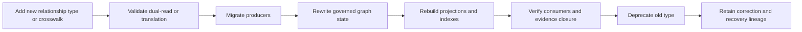

<!-- [KFM_META_BLOCK_V2]
doc_id: kfm://doc/migrations-graph-readme
title: migrations/graph/ — Governed Graph, Triplet, Relationship, Identity, and Projection Changes
type: README; per-directory-readme; nested-migration-lane; graph-change-control
version: v1.1
status: draft; repository-grounded; documented-lane; executable-payloads-unestablished; graph-store-unestablished; runner-unestablished; rollback-pairing-unverified; non-release; non-publication
owner: NEEDS VERIFICATION — CODEOWNERS routes this path through the repository default owner @bartytime4life; accountable graph, evidence, data, schema, contract, policy, domain, migration, and release stewardship assignments were not established
created: 2026-07-03
updated: 2026-07-24
supersedes: v1 documentation at the same path; no graph payload, graph state, relationship meaning, runtime behavior, release state, or publication state is superseded
prepared_under_prompt: KFM Markdown Modernization & GitHub Documentation Implementation Agent v4.0.0
policy_label: repository-facing; migrations; graph-change; evidence-aware; identity-aware; sensitivity-aware; rollback-aware; fail-closed; non-publisher
current_path: migrations/graph/README.md
owning_root: migrations/
responsibility: govern graph and triplet topology, relationship vocabulary, node and edge identity, evidence links, projections, and graph-derived indexes without becoming semantic-contract, machine-schema, canonical-evidence, policy, lifecycle-data, release, or publication authority
truth_posture: >
  CONFIRMED same-path target; canonical migrations responsibility root; documented graph and rollback lanes; Directory Rules
  assignment of graph migrations to migrations/graph/; mandatory paired recovery posture; current CODEOWNERS routing;
  and the parent migrations README's bounded conclusion that executable migration payloads and graph executors were not
  established / PROPOSED graph-migration classification, packet fields, graph invariant matrix, dry-run, compatibility,
  projection-rebuild, execution, recovery, and definition-of-done contracts / UNKNOWN active graph or triplet store,
  query language, concrete payload inventory, target environments, graph versions, applied migration history, execution
  receipts, production outcomes, and performance baselines / NEEDS VERIFICATION recursive lane inventory, one-to-one
  rollback pairing, stable migration and graph identity conventions, relationship-type registry, dedicated migration CI,
  steward assignments, sensitivity-review workflow, and release integration
evidence_snapshot:
  repository: bartytime4life/Kansas-Frontier-Matrix
  base_ref: main
  target_prior_blob: edc074080b43247e1c9b159e6416ff79b10ca09f
  parent_readme_blob: 48da6b62000d145359bfbd7f8383961c9f285b2a
  rollback_readme_blob: fdecd7e2c2308cb546706ab061730d14987bc586
  codeowners_blob: dd2a84aa514d8ecd9208bc347f90f9a2ed37dd61
  codeowners_status: repository default routing resolves this path to @bartytime4life; role-level stewardship and independent approval remain unverified
  inspection_method: exact GitHub file reads, parent and recovery-lane evidence review, bounded repository search, and open-PR overlap search; no recursive Git tree, graph store, query endpoint, migration runner, database connection, backup system, CI execution, release artifact, or runtime environment was inspected
related:
  - ../README.md
  - ../database/README.md
  - ../schema/README.md
  - ../data/README.md
  - ../rollback/README.md
  - ../../contracts/README.md
  - ../../schemas/README.md
  - ../../data/README.md
  - ../../policy/README.md
  - ../../tests/README.md
  - ../../tools/validators/README.md
  - ../../release/README.md
  - ../../docs/doctrine/directory-rules.md
  - ../../docs/runbooks/README.md
  - ../../docs/governance/SEPARATION_OF_DUTIES.md
  - ../../.github/CODEOWNERS
notes:
  - "v1.1 is a same-path documentation-only modernization grounded in current repository evidence."
  - "The first twelve H2 sections follow the Directory Rules folder-README contract."
  - "The lane is documented, but a graph store, query language, concrete migration payloads, canonical runner, applied-version ledger, relationship-type registry, and verified recovery coverage were not established."
  - "Static badges summarize inspected repository state only; they are not execution, review, recovery, release, or publication proof."
[/KFM_META_BLOCK_V2] -->

<a id="top"></a>

# `migrations/graph/` — Governed Graph, Triplet, Relationship, Identity, and Projection Changes

> **One-line purpose.** Govern deliberate changes to KFM graph and triplet state while preserving object identity, evidence closure, source-role distinctions, temporal and spatial scope, policy obligations, projection traceability, validation, and recoverability.

[](#status)
[](#authority-level)
[](#status)
[](#validation)
[](#graph-specific-invariants)
[](#recovery-and-forward-fix)
[](#authority-level)
[](#last-reviewed)

> [!IMPORTANT]
> **Safe current conclusion:** `migrations/graph/` is a documented migration lane beneath the canonical `migrations/` responsibility root. Current bounded evidence establishes its README and recovery relationship, but does **not** establish an active graph or triplet store, query language, concrete migration payloads, a selected runner, an applied-version ledger, a relationship-type registry, complete rollback pairing, execution history, or production outcomes.

> [!CAUTION]
> A graph plan, query parse, node or edge count, projection rebuild, branch, pull request, or green unrelated workflow does not prove that graph state changed safely. An execution claim requires a named store and version, exact target state, pinned payload, evidence-aware preflight, observed run evidence, post-migration invariants, and recovery evidence.

> [!WARNING]
> This directory is not a graph database, triplet store, evidence store, graph dump archive, secret store, or publication surface. Graph exports, bulk triplets, snapshots, credentials, restricted relationships, and lifecycle payloads must never be committed here.

**Quick navigation:** [Purpose](#purpose) · [Authority](#authority-level) · [Status](#status) · [Belongs](#what-belongs-here) · [Exclusions](#what-does-not-belong-here) · [Inputs](#inputs) · [Outputs](#outputs) · [Validation](#validation) · [Review](#review-burden) · [Related](#related-folders) · [ADRs](#adrs) · [Last reviewed](#last-reviewed) · [Topology](#current-bounded-topology) · [Classification](#graph-migration-classification) · [Packet](#minimum-graph-migration-packet) · [Invariants](#graph-specific-invariants) · [Execution](#preflight-dry-run-and-execution-contract) · [Compatibility](#compatibility-and-projection-rebuilds) · [Recovery](#recovery-and-forward-fix) · [Done](#definition-of-done) · [Open verification](#open-verification-register)

---

<a id="status--authority"></a>
<a id="repo-fit"></a>
<a id="graph-migration-contract"></a>
<a id="required-migration-record"></a>
<a id="open-verification"></a>

## Purpose

`migrations/graph/` owns the **mechanics and review packet** for governed changes to graph, triplet, relationship, identity, topology, projection, and graph-derived index state.

Typical graph migrations include:

- renaming, splitting, merging, deprecating, or retyping relationship classes;
- repairing node, edge, assertion, or triplet identities;
- remapping identifiers or crosswalks while preserving lineage;
- deduplicating relationships without collapsing distinct evidence support;
- repairing `EvidenceRef` or `EvidenceBundle` associations;
- correcting directionality, cardinality, temporal scope, spatial scope, confidence, provenance, review state, or policy labels;
- rebuilding graph projections, graph indexes, search indexes, or derived relationship views from governed inputs;
- realigning graph or triplet state after contract, schema, data, policy, source-role, or release changes;
- withdrawing or superseding relationships whose evidence or authority changed.

The canonical lifecycle remains:

```text
RAW -> WORK / QUARANTINE -> PROCESSED -> CATALOG / TRIPLET -> PUBLISHED
```

A graph migration may repair or rebuild a graph-bearing lifecycle surface. It does not promote evidence, approve policy, authorize release, publish a graph, or turn an inferred relationship into authoritative truth.

Use a sibling lane when another responsibility is primary:

| Primary change | Lane |
|---|---|
| Database tables, indexes, constraints, functions, roles, or storage engine | [`../database/`](../database/README.md) |
| Contract or machine-shape compatibility | [`../schema/`](../schema/README.md) |
| Record values, backfills, lifecycle placement, or data rebuilds | [`../data/`](../data/README.md) |
| Recovery, reversal, disablement, or compensating change | [`../rollback/`](../rollback/README.md) |

When graph and data, schema, or database changes are equally primary, use coordinated records rather than hiding all work in one file.

## Authority level

**Canonical nested lane for graph-migration mechanics; subordinate to the authorities that define meaning, shape, evidence, source role, policy, lifecycle state, and release.**

| Question | Controlling authority |
|---|---|
| Where graph migration material belongs | Directory Rules, accepted placement ADRs, parent `migrations/` contract, then this README |
| What a node, edge, assertion, relationship, or triplet means | [`contracts/`](../../contracts/README.md) and accepted domain contracts |
| What machine shape is valid | [`schemas/`](../../schemas/README.md) |
| Which source roles and evidence support a relationship | Source registry, `EvidenceRef`, `EvidenceBundle`, receipts, proofs, and review records |
| What policy permits or withholds | [`policy/`](../../policy/README.md) |
| Which lifecycle surface owns graph-bearing payloads | [`data/`](../../data/README.md) |
| Whether a graph is public or released | [`release/`](../../release/README.md) and applicable promotion/review records |
| How a migration is executed | Selected graph/store adapter, migration payload, target environment, runner, and runbook |
| How engineering recovery works | [`../rollback/`](../rollback/README.md) plus applicable backup, snapshot, or rebuild evidence |
| How public correction or rollback works | `release/` correction, withdrawal, rollback-card, and cache-invalidation records |

This lane may carry scripts, query fragments, identity maps, graph diffs, compatibility plans, validation summaries, and recovery references. It must not independently redefine semantic meaning, relationship authority, evidence truth, policy, or publication state.

## Status

| Surface | Current evidence | Status |
|---|---|---|
| `migrations/graph/README.md` | Present and updated in place | **CONFIRMED — documentation** |
| Parent migration root | Present with graph lane indexed | **CONFIRMED — documentation** |
| Recovery lane | Present and requires paired recovery posture | **CONFIRMED — documentation** |
| Graph migration payloads | Not established in bounded inspection | **UNKNOWN / NEEDS VERIFICATION** |
| Active graph or triplet store | Not established | **UNKNOWN** |
| Query language or adapter | Not established | **UNKNOWN** |
| Selected graph migration runner | Not established | **UNKNOWN** |
| Relationship-type registry | Not established as a controlling current surface | **NEEDS VERIFICATION** |
| Applied graph migration/version ledger | Not established | **NEEDS VERIFICATION** |
| Dedicated graph migration CI | Not established | **NEEDS VERIFICATION** |
| One-to-one recovery pairing | Required by doctrine; coverage not recursively verified | **NEEDS VERIFICATION** |
| Graph projection or index rebuild tooling | Not established | **UNKNOWN** |
| Live graph state, environment, or performance baseline | Not inspected | **UNKNOWN** |
| Production execution and recovery history | Not inspected | **UNKNOWN** |
| GitHub ownership routing | Repository default routes to `@bartytime4life` | **CONFIRMED routing; stewardship unverified** |
| Release or publication authority | Not owned by this lane | **DENIED by boundary** |

The lane is therefore **documentation-heavy and implementation-unverified**. Examples below are proposed operating contracts, not evidence that Neo4j, RDF/SPARQL, Cypher, SQL triplets, NetworkX, a document graph, or any other graph technology is active.

## What belongs here

Use `migrations/graph/` when the primary responsibility is a governed change to graph or triplet state.

Accepted material includes:

- graph migration plans and manifests;
- query or script payloads whose target store and syntax are explicitly identified;
- relationship vocabulary rename, split, merge, deprecation, or compatibility plans;
- node and edge identity maps;
- triplet rewrite rules;
- evidence-link repair plans;
- topology repair or normalization plans;
- graph projection and index rebuild plans;
- ontology or classification alignment changes that materially rewrite graph state;
- temporal, spatial, confidence, provenance, review-state, or policy-label repairs;
- duplicate, orphan, cycle, closure, and referential-integrity remediation plans;
- sanitized before/after count summaries and graph diffs;
- preflight, dry-run, canary, and post-check definitions;
- producer and consumer adoption matrices;
- execution or rebuild receipts that omit secrets and restricted payloads;
- paired recovery or forward-fix references;
- correction, supersession, withdrawal, and release-impact notes.

A migration packet may reference graph snapshots, dumps, or evidence bundles by identifier, digest, release, or secure location. It must not embed them in this directory.

## What does not belong here

Do not use `migrations/graph/` as a graph store, triplet payload root, evidence authority, ontology authority, schema home, policy home, release lane, backup system, or secret store.

The following do not belong here:

- full graph exports, RDF dumps, property-graph dumps, bulk triplet files, database snapshots, index snapshots, or restore images;
- RAW, WORK, QUARANTINE, PROCESSED, CATALOG, TRIPLET, or PUBLISHED payloads;
- canonical `EvidenceRef`, `EvidenceBundle`, source registry, proof, or receipt stores;
- canonical relationship or ontology contracts;
- JSON Schemas or other machine-shape authority;
- policy bundles, sensitivity decisions, source-rights decisions, or release approvals;
- release manifests, promotion decisions, release rollback cards, correction notices, or withdrawal notices;
- passwords, graph database credentials, API tokens, connection strings, DSNs, certificates, private keys, kubeconfigs, `.env` files, or private endpoints;
- unredacted living-person, DNA/genomic, archaeology, sacred-site, rare-species, infrastructure, private-land, or rights-uncertain relationships;
- inferred, generated, weak, disputed, or unreviewed edges presented as authoritative facts;
- one-off destructive rewrites lacking scope, base state, evidence, identity mapping, validation, recovery, review, and audit fields;
- hidden application-side graph rewrites represented as migration history;
- generated graph projections treated as canonical evidence.

When restricted data, a secret, graph dump, or sensitive relationship payload lands here, stop normal work, isolate the material, rotate or revoke access where necessary, and follow the applicable incident and correction process.

## Inputs

A graph migration packet may consume:

| Input | Why it is needed |
|---|---|
| Accepted ADR or scoped decision | Establishes why a structural or compatibility transition is allowed |
| Semantic contracts | Define node, relationship, assertion, and triplet meaning |
| Machine schemas | Define valid payload shape |
| Source and evidence references | Ground consequential relationships and identity decisions |
| Policy or sensitivity decisions | Constrain relationship handling and exposure |
| Current graph/triplet inventory | Defines the base state and affected scope |
| Relationship-type or vocabulary inventory | Defines names, directionality, cardinality, and compatibility |
| Identity and crosswalk records | Define stable nodes, aliases, merges, splits, and remaps |
| Temporal and spatial scope records | Preserve valid-time, source-time, geography, and precision constraints |
| Producer and consumer inventory | Defines application, API, map, catalog, and export adoption order |
| Projection and index manifests | Define rebuildable derived surfaces |
| Test fixtures and invariant checks | Define expected success and failure states |
| Recovery, backup, snapshot, or rebuild capability | Supports reversal, restore, or deterministic reconstruction |
| Target environment and runner contract | Defines how execution is performed safely |

Inputs must be revision-, release-, version-, digest-, environment-, or state-identified where material. “Current graph,” “all edges,” or “latest projection” is not sufficiently precise for consequential work.

## Outputs

A graph migration packet may produce:

- reviewed migration plans;
- pinned query, script, or rewrite payloads;
- identity and relationship crosswalks;
- compatibility and adoption matrices;
- preflight and dry-run graph diffs;
- node, edge, triplet, evidence-link, provenance, and projection validation reports;
- execution or rebuild receipts;
- post-migration verification reports;
- recovery, restore, disablement, or forward-fix records;
- projection and index rebuild manifests;
- drift, correction, supersession, and documentation updates;
- references to release-impact review.

These outputs remain bounded:

| Output | What it proves | What it does not prove |
|---|---|---|
| Migration plan | Intended graph change and review surface exist | Execution occurred |
| Parsed query or script | Syntax may be acceptable to a named parser | Store compatibility, evidence validity, or safety |
| Dry-run graph diff | A preview completed in a named context | Production outcome |
| Identity map | Intended remaps are explicit | All semantic or evidence implications are correct |
| Projection rebuild | A derived graph/index was regenerated | Canonical evidence changed or release was approved |
| Execution receipt | A named action was attempted or completed | Relationship truth or publication authority |
| Post-check report | Named invariants passed in a named context | Universal correctness |
| Recovery record | Recovery instructions exist | Recovery was rehearsed or will work |
| Git commit or PR | Repository bytes changed | A graph migration was applied, approved, released, or published |

`migrations/graph/` never publishes or certifies graph truth by itself.

## Validation

Validation is **graph-class-specific and evidence-aware**. A generic success exit code is insufficient.

### Required source checks

Every graph migration change should verify:

- target path and primary migration lane;
- stable migration identity and ordering;
- paired recovery reference;
- graph/store, environment, and base-state identity;
- affected node, edge, triplet, relationship, projection, and index inventory;
- semantic contract and machine-schema basis;
- source-role and evidence support;
- identity, alias, merge, split, and deprecation rules;
- directionality, cardinality, and allowed endpoint classes;
- temporal and spatial scope;
- provenance, confidence, review state, and correction lineage;
- rights, sensitivity, geoprivacy, and public-impact posture;
- producer and consumer compatibility;
- dry-run and post-check definitions;
- secret and restricted-content absence;
- release and documentation impact.

### Minimum executable evidence by migration class

| Migration class | Minimum executable or observed evidence |
|---|---|
| Additive relationship or node class | Valid and invalid fixtures; endpoint-type, directionality, cardinality, and evidence-link checks |
| Relationship rename, split, merge, or deprecation | Old-to-new crosswalk; compatibility-window test; producer/consumer adoption evidence; deprecated-path detection |
| Node or edge identity remap | One-to-one, one-to-many, or many-to-one mapping validation; collision detection; lineage preservation; unresolved mapping report |
| Evidence-link repair | `EvidenceRef` resolution checks; bundle closure; source-role preservation; unresolved links held or quarantined |
| Topology repair | Node/edge counts; endpoint closure; duplicate and orphan policy; allowed-cycle checks; component/connectivity checks where applicable |
| Temporal or spatial correction | Valid-time/source-time checks; geometry/place linkage; precision/generalization policy; stale-state and supersession checks |
| Policy or sensitivity relabel | Positive and negative policy fixtures; public-safe transform verification; denied or withheld cases |
| Projection or index rebuild | Pinned canonical inputs; deterministic build spec; content digest; parity or expected-delta report; consumer smoke check |
| Ontology or vocabulary alignment | Term crosswalk; semantic-contract review; forbidden-collapse tests; unknown term handling |
| Destructive consolidation | Loss inventory; archived lineage; exceptional review; recovery or forward-fix evidence |
| Coordinated migration | Cross-lane ordering; compatibility window; graph, data, schema, database, API/UI, and release checks |

Cycles, duplicate edges, self-relations, disconnected components, or multi-edges are not universally invalid. Their acceptance must be defined by the applicable contract rather than guessed by a generic validator.

### Current repository boundary

No repository-native graph migration command, active graph store, selected query language, dedicated graph migration workflow, applied-version register, or verified relationship registry was established in bounded inspection. Until those surfaces exist and are verified:

- do not advertise a canonical graph migration command;
- do not imply Neo4j, Cypher, SPARQL, RDF, SQL triplets, NetworkX, or another engine is active;
- record store-specific commands only in a named migration packet;
- mark unexecuted checks `NOT RUN`;
- keep shared or release-relevant execution blocked until evidence closure, compatibility, recovery, and review are adequate.

## Review burden

Review scales with semantic, evidentiary, privacy, and public consequence—not file extension.

| Change class | Minimum review burden |
|---|---|
| README-only wording with no migration behavior | Docs or migration reviewer |
| Additive low-risk projection or index rebuild | Graph owner + migration reviewer |
| Relationship rename, split, merge, deprecation, direction, or cardinality change | Graph owner + contract/schema owners + affected producer/consumer owners |
| Node or edge identity remap, merge, split, or deduplication | Graph owner + data/identity owner + affected domain owner |
| Evidence-link or provenance repair | Graph owner + evidence/catalog owner + affected domain owner |
| Temporal, spatial, confidence, review-state, or correction-lineage repair | Graph owner + affected domain owner + evidence reviewer |
| Policy, rights, geoprivacy, or sensitivity change | Policy/sensitivity reviewer + affected domain owner |
| Migration paired with data, schema, or database change | Owners for every primary lane + migration reviewer |
| Public API, map, search, export, or release impact | Governed API/UI owner + release reviewer + affected domain owner |
| Destructive topology rewrite or identity consolidation | Graph owner + affected owners + independent recovery reviewer + explicit risk acceptance |
| Forward-fix-only migration | Migration owner + graph owner + affected owners + explicit risk acceptance |
| Cross-domain or multi-environment migration | Owners for every affected responsibility and environment |

CODEOWNERS routing is not proof that required review occurred. Approval, execution, and verification should be separated for high-impact graph migrations when repository maturity supports it.

## Related folders

| Location | Relationship |
|---|---|
| [`../database/`](../database/README.md) | Database-managed graph storage and structural changes |
| [`../schema/`](../schema/README.md) | Machine-shape and semantic compatibility transitions |
| [`../data/`](../data/README.md) | Data backfills, remaps, and lifecycle-state changes |
| [`../rollback/`](../rollback/README.md) | Engineering recovery, restore, disablement, and forward-fix records |
| [`../../contracts/`](../../contracts/README.md) | Semantic meaning for nodes, relationships, assertions, and triplets |
| [`../../schemas/`](../../schemas/README.md) | Machine shape and validation |
| [`../../data/`](../../data/README.md) | Lifecycle payloads, registries, receipts, proofs, catalog/triplet and published surfaces |
| [`../../policy/`](../../policy/README.md) | Rights, sensitivity, source-role, geoprivacy, and admissibility |
| [`../../tests/`](../../tests/README.md) | Representative enforceability and regression proof |
| [`../../tools/validators/`](../../tools/validators/README.md) | Repository-wide validation tooling |
| [`../../release/`](../../release/README.md) | Release decisions, correction, withdrawal, and public rollback |
| [`../../docs/runbooks/`](../../docs/runbooks/README.md) | Operator procedures and recovery drills |
| [`../../docs/governance/SEPARATION_OF_DUTIES.md`](../../docs/governance/SEPARATION_OF_DUTIES.md) | Review and duty-separation guidance |
| [`../../.github/CODEOWNERS`](../../.github/CODEOWNERS) | GitHub review routing only |

## ADRs

A graph migration does not always require an ADR. An ADR is required when the migration:

- creates or retires a canonical graph/triplet authority;
- changes the responsibility split among contracts, schemas, data, policy, release, or migrations;
- standardizes a repository-wide graph identity, relationship, projection, or migration-state contract;
- changes public API or trust-membrane behavior materially;
- introduces or replaces a graph storage technology as an architectural commitment;
- changes source-role or evidence authority semantics;
- changes a lifecycle phase or graph/triplet publication model;
- creates a parallel source, evidence, registry, schema, contract, policy, proof, receipt, or release home;
- makes a non-reversible graph architecture decision whose tradeoffs must persist;
- intentionally bends a KFM invariant.

A migration packet can implement an accepted decision. It cannot make its own proposed ADR accepted.

## Last reviewed

| Field | Value |
|---|---|
| Last reviewed | 2026-07-24 |
| Review status | Repository-grounded v1.1 documentation update |
| Current maturity | Documented graph lane; store, language, payload inventory, runner, applied ledger, relationship registry, recovery coverage, and production history unverified |
| Next review trigger | First concrete graph migration payload, selected graph store or query language, relationship registry, migration runner, dedicated workflow, identity remap, evidence-link repair, projection rebuild, destructive topology change, or public-impacting graph migration |

---

## Current bounded topology

The confirmed documentation topology is:

```text
migrations/
├── README.md
├── database/
│   └── README.md
├── schema/
│   └── README.md
├── data/
│   └── README.md
├── graph/
│   └── README.md
└── rollback/
    └── README.md
```

This is a **bounded named-path inventory**, not a recursive tree attestation. Bounded repository inspection did not establish executable graph migration payloads beneath this lane.

## Graph migration classification

Classify the intended state transition before selecting payload syntax.

| Primary graph change | Class | Common adjacent changes |
|---|---|---|
| Add node, edge, assertion, or triplet class without breaking consumers | `ADDITIVE` | Contracts, schemas, fixtures, indexes |
| Rename or deprecate relationship/node type | `VOCABULARY_TRANSITION` | Contracts, schemas, API, UI, compatibility |
| Split or merge relationship classes | `SEMANTIC_RESHAPE` | Evidence review, data remap, consumer adoption |
| Remap, merge, split, or deduplicate node/edge identity | `IDENTITY_REMAP` | Data, source registry, evidence, correction |
| Repair evidence or provenance links | `EVIDENCE_REPAIR` | Catalog, receipts, proofs, review |
| Repair directionality, endpoint classes, cardinality, or topology | `TOPOLOGY_REPAIR` | Schemas, validators, domain logic |
| Correct temporal, spatial, confidence, review, or policy attributes | `SCOPE_OR_POSTURE_REPAIR` | Data, policy, release |
| Rebuild graph projection, index, search view, or derived triplet bundle | `REBUILDABLE_DERIVATIVE` | Data inputs, catalog, API/UI |
| Align ontology or controlled vocabulary | `ONTOLOGY_ALIGNMENT` | Contracts, source-role mapping, schemas |
| Remove or consolidate graph state with possible information loss | `DESTRUCTIVE` | Archive, correction, recovery, release |
| Reversal, disablement, restore, or compensation | `RECOVERY` | Paired primary migration |
| Multiple equally primary responsibilities | `COORDINATED` | Database, schema, data, graph, app, release |

Do not choose the class merely because a file uses Cypher, SPARQL, SQL, Python, or another syntax. Choose it by the state transition and semantic burden.

## Minimum graph migration packet

A shared-state or release-relevant graph migration should have a complete packet before execution.

```yaml
migration_id: mig-graph-<stable-id>
title: <short purpose>
status: PROPOSED
class: ADDITIVE | VOCABULARY_TRANSITION | SEMANTIC_RESHAPE | IDENTITY_REMAP | EVIDENCE_REPAIR | TOPOLOGY_REPAIR | SCOPE_OR_POSTURE_REPAIR | REBUILDABLE_DERIVATIVE | ONTOLOGY_ALIGNMENT | DESTRUCTIVE | RECOVERY | COORDINATED
owner: NEEDS VERIFICATION

authority_refs: []
reason_refs: []

target:
  environment: <named-environment>
  store_class: property-graph | rdf | relational-triplet | document-index | file-bundle | other
  engine: NEEDS VERIFICATION
  engine_version: NEEDS VERIFICATION
  query_language: NEEDS VERIFICATION
  endpoint_alias: <non-secret logical name>

base_state:
  revision: <commit-or-release>
  graph_state_id: <version-snapshot-or-ledger-ref>
  content_digest: <digest-or-NEEDS_VERIFICATION>
  node_count: <count-or-NEEDS_VERIFICATION>
  edge_or_triplet_count: <count-or-NEEDS_VERIFICATION>

target_state:
  description: <intended graph state>
  graph_state_id: <version-or-ledger-ref>

payloads:
  - path: <migration payload>
    sha256: <digest>
    language: <named-language>
    idempotence: safe | detected | blocked | NEEDS_VERIFICATION

affected:
  node_classes: []
  relationship_types: []
  triplet_families: []
  assertions: []
  identities: []
  evidence_refs: []
  evidence_bundles: []
  projections: []
  indexes: []
  producers: []
  consumers: []
  api_routes: []
  map_layers: []
  exports: []
  releases: []

identity:
  mapping_ref: null
  collision_policy: NEEDS VERIFICATION
  merge_split_rules: []
  lineage_preserved: false

evidence:
  closure_required: true
  unresolved_behavior: hold | quarantine | abstain | deny
  source_roles_preserved: false
  provenance_rules: []

relationship_contract:
  directionality: []
  endpoint_classes: []
  cardinality: []
  duplicate_policy: NEEDS VERIFICATION
  orphan_policy: NEEDS VERIFICATION
  cycle_policy: NEEDS VERIFICATION

scope:
  temporal_rules: []
  spatial_rules: []
  confidence_rules: []
  review_state_rules: []
  correction_lineage: []

policy:
  sensitivity_impact: none | reviewed | hold
  public_precision_impact: none | generalized | withheld
  decision_refs: []

preconditions: []

dry_run:
  command_or_workflow: NEEDS VERIFICATION
  graph_diff_ref: null
  sample_review_ref: null
  evidence_ref: null

validation:
  pre_checks: []
  post_checks: []
  negative_cases: []

compatibility:
  class: backward-compatible | dual-read | staged | breaking | rebuildable | destructive | forward-fix-only
  window: null
  producer_adoption: []
  consumer_adoption: []

recovery_ref: migrations/rollback/<paired-id>.md
release_impact: none | internal | candidate | public

execution:
  runner: NEEDS VERIFICATION
  receipt_ref: null

review:
  required_roles: []
  records: []
```

This is a **PROPOSED documentation contract**, not a verified repository schema. Standardizing it as machine shape requires placement under `schemas/`, tests, compatibility review, and an accepted decision where required.

## Graph-specific invariants

A graph migration should declare which invariants apply and how each is verified.

| Invariant | Required posture |
|---|---|
| Evidence closure | Consequential relationships resolve through admissible evidence or remain held, quarantined, denied, or abstained |
| No authority inflation | Generated, inferred, weak, disputed, or unreviewed relationships are not silently promoted |
| Source-role anti-collapse | Observation, interpretation, model, administrative, regulatory, derived, and contextual sources retain distinct roles |
| Deterministic identity | Stable node, edge, assertion, and triplet identifiers are preserved or remapped explicitly |
| Identity lineage | Merges, splits, aliases, deduplications, and deprecations retain forward and backward traceability |
| Endpoint integrity | Relationship endpoints exist and match allowed classes |
| Directionality and cardinality | Edge direction and multiplicity conform to the applicable contract |
| Duplicate and orphan policy | Duplicate or orphan behavior is explicit rather than guessed |
| Temporal scope | Valid time, source time, observation time, release time, and correction time remain distinct where material |
| Spatial scope | Place identity, geometry reference, scale, precision, and generalization remain supportable |
| Provenance | Transform, source, tool, actor, time, and input lineage remain inspectable |
| Confidence and review state | Confidence, interpretation status, and review state are preserved or changed deliberately |
| Sensitivity and rights | Restricted relationship exposure fails closed and public-safe transforms remain traceable |
| Projection non-sovereignty | Graph projections, indexes, embeddings, and derived triplets never replace canonical evidence |
| Rebuildability | Rebuildable derivatives name pinned canonical inputs, build spec, and output digest |
| Correction and supersession | Withdrawn or corrected relationships retain visible lineage |
| Lifecycle isolation | Public clients do not gain direct access to canonical or non-public graph stores |
| Recovery | The paired recovery record restores, disables, rebuilds, or compensates without erasing audit history |

## Preflight, dry-run, and execution contract

### Preflight

Before mutation, establish:

1. named store class, engine/version where applicable, target environment, and access boundary;
2. base graph-state identity, revision, release, snapshot, or digest;
3. migration payload and digest;
4. affected node, edge, triplet, evidence, projection, index, producer, and consumer inventory;
5. controlling contracts, schemas, policy decisions, and source/evidence support;
6. identity, vocabulary, topology, temporal, spatial, provenance, and sensitivity rules;
7. compatibility and rollout order;
8. recovery class and paired record;
9. pre-checks, post-checks, negative fixtures, and failure behavior;
10. required review records.

### Dry run or rehearsal

A safe preview should emit only sanitized, reviewable evidence such as:

- node, edge, triplet, assertion, and relationship counts by declared class;
- added, removed, renamed, merged, split, or remapped identity counts;
- unresolved identity and evidence-link counts;
- duplicate, orphan, endpoint, directionality, cardinality, temporal, spatial, and policy findings;
- projection/index expected-delta summaries;
- redacted representative samples where policy permits;
- execution-plan or query-plan summaries where supported;
- estimated batch size, duration, memory, lock, or service-impact risk;
- explicit `NOT RUN` entries for unsupported checks.

Dry-run output must not expose restricted relationship payloads, credentials, private endpoints, exact sensitive locations, or unredacted living-person data.

### Execution

Execution should:

- use the named runner and exact payload digest;
- bind to a named target environment and base state;
- use transactions, batches, resumable checkpoints, or guarded idempotence where supported;
- avoid unrestricted global rewrites unless the packet explicitly authorizes and validates them;
- stop on violated evidence, identity, topology, policy, or compatibility invariants;
- preserve audit and correction lineage;
- emit a sanitized execution receipt;
- avoid treating projection or index rebuild success as canonical truth or release approval;
- leave publication blocked until responsible release controls close.

### Post-migration verification

Post-checks should confirm:

- expected node, edge, triplet, assertion, and relationship counts;
- identity mappings, collisions, aliases, merges, splits, and deprecations;
- endpoint closure and referential integrity;
- evidence resolution and source-role preservation;
- directionality, cardinality, duplicate, orphan, and allowed-cycle rules;
- temporal, spatial, provenance, confidence, review, and policy attributes;
- projection and index parity or explained deltas;
- producer and consumer compatibility;
- public API, map, search, export, and release impact;
- recovery reference and residual risks.

## Compatibility and projection rebuilds

Graph migrations often require a staged transition rather than an immediate rewrite.

### Compatibility classes

| Class | Requirement |
|---|---|
| Backward-compatible | Old producers and consumers continue to work |
| Dual-read or translation | Old and new relationship vocabulary coexist through an explicit adapter or crosswalk |
| Staged breaking | Compatibility window, adoption evidence, cutover, and deprecation are explicit |
| Rebuildable derivative | Projection/index can be deterministically rebuilt from pinned governed inputs |
| Destructive | Relationships, identity distinctions, or lineage may be lost; heightened review and archive/recovery evidence required |
| Forward-fix-only | Reversal is less safe than compensation; reason and guardrails required |

### Relationship vocabulary transition


```mermaid
flowchart LR
    A[Add new relationship type or crosswalk] --> B[Validate dual-read or translation]
    B --> C[Migrate producers]
    C --> D[Rewrite governed graph state]
    D --> E[Rebuild projections and indexes]
    E --> F[Verify consumers and evidence closure]
    F --> G[Deprecate old type]
    G --> H[Retain correction and recovery lineage]
```

### Projection rule

A graph projection, search index, vector index, embedding index, graph analytics view, or public triplet bundle is a **derived carrier**. A projection migration must name:

- canonical governed inputs;
- build specification and version;
- input and output digests;
- expected and observed counts;
- evidence and policy filtering;
- public-safe transformations;
- consumer compatibility;
- release and rollback references.

Rebuilding a projection does not modify canonical evidence unless a separately governed migration changes the upstream records.

## Recovery and forward-fix

Every consequential graph migration must identify a recovery class.

| Recovery class | Meaning |
|---|---|
| `REVERSIBLE` | A tested inverse migration can restore the prior approved graph state |
| `DISABLEABLE` | New relationship type, projection, or consumer path can be disabled while state remains |
| `RESTORABLE` | A verified snapshot or governed rebuild restores the prior state |
| `REBUILDABLE` | A derivative projection or index can be deterministically regenerated from pinned governed inputs |
| `COMPENSATING` | A corrective graph migration repairs state while preserving audit lineage |
| `FORWARD_FIX_ONLY` | Reversal would cause more semantic or evidentiary harm than an explicit corrective migration |
| `NON_RECOVERABLE` | Not acceptable for shared or release-relevant state absent exceptional documented governance |

A paired recovery record should include:

- migration ID and payload digest;
- graph/store and target environment;
- base and target graph-state identities;
- recovery class and reason;
- identity, evidence, topology, temporal, spatial, policy, projection, API/UI, and release risks;
- snapshot, archive, or rebuild references where applicable;
- inverse, disablement, restore, rebuild, or compensation steps;
- irreversible effects and unresolved relationship cases;
- pre- and post-recovery invariants;
- operator and reviewer requirements;
- rehearsal evidence or `NOT RUN`;
- correction, withdrawal, incident, or release references where applicable.

A rollback Markdown file existing in Git is not proof that graph recovery works.

## Definition of done

A graph migration is complete only when all applicable items are closed:

- [ ] Stable migration identity and ordering are recorded.
- [ ] Primary lane and Directory Rules basis are correct.
- [ ] Store class, engine/version where applicable, environment, and base state are pinned.
- [ ] Payloads and checksums are recorded.
- [ ] Node, edge, triplet, assertion, identity, projection, and index scope is inventoried.
- [ ] Semantic contracts and machine schemas are referenced.
- [ ] Source-role and evidence support is closed or unresolved cases remain visibly held.
- [ ] Identity, merge, split, alias, deduplication, and deprecation rules are explicit.
- [ ] Directionality, cardinality, endpoint, duplicate, orphan, and cycle rules are explicit.
- [ ] Temporal, spatial, provenance, confidence, review, correction, rights, and sensitivity impacts are reviewed.
- [ ] Producers, consumers, APIs, maps, searches, exports, and releases are inventoried.
- [ ] Compatibility and rollout order are explicit.
- [ ] Recovery class and paired record exist.
- [ ] Dry run or rehearsal completed, or `NOT RUN` is justified.
- [ ] Required reviews are recorded.
- [ ] Execution receipt identifies target, runner, revision, base state, payload digest, and outcome.
- [ ] Post-migration invariants passed.
- [ ] Projections and indexes were rebuilt from pinned governed inputs where applicable.
- [ ] Recovery was rehearsed where risk requires it, or the gap remains visible.
- [ ] Documentation, deprecation, correction, supersession, and release follow-up are complete.
- [ ] No generated or inferred relationship was misrepresented as authoritative truth.
- [ ] No graph migration output was misrepresented as publication authority.

## No-loss ledger

| v1 material | v1.1 disposition |
|---|---|
| Graph/triplet migration purpose | Preserved and sharpened |
| Lifecycle invariant | Preserved |
| Graph versus database/schema/data/rollback lane split | Preserved |
| Relationship rename, split, merge, identity, projection, index, and evidence-link coverage | Preserved and expanded |
| Truth-posture and no-silent-promotion rule | Preserved and made explicit as an invariant |
| Deterministic identity and provenance | Preserved and expanded |
| Sensitive-domain fail-closed posture | Preserved |
| Dry-run and validation checklist | Expanded by graph migration class |
| Review burden | Expanded by semantic, evidentiary, privacy, and public consequence |
| Rollback-entry requirement | Preserved; coverage now explicitly unverified |
| Original migration record | Preserved through legacy anchor and expanded proposed packet |
| Owner placeholders | Replaced with verified routing plus stewardship uncertainty |
| Publication boundary | Preserved and clarified |
| Open verification questions | Preserved and extended |

## Open verification register

- [ ] Obtain a recursive tracked inventory of `migrations/graph/`.
- [ ] Confirm whether any executable graph migration payloads exist beyond this README.
- [ ] Identify the active graph, RDF, triplet, document, relational, or file-bundle storage surfaces.
- [ ] Confirm graph engine, version, query language, and migration runner conventions.
- [ ] Define canonical stable graph migration ID and filename ordering.
- [ ] Define or locate the controlling relationship-type and vocabulary registry.
- [ ] Define node, edge, assertion, triplet, alias, and projection identity rules.
- [ ] Verify one-to-one graph-migration-to-recovery pairing.
- [ ] Decide whether paired recovery records must land in the same pull request.
- [ ] Define a machine-readable graph migration packet schema if justified.
- [ ] Define an applied graph migration/version ledger and owning root.
- [ ] Add dedicated graph migration validation only after store, runner, and fixtures are selected.
- [ ] Define no-network valid and invalid fixtures for each graph migration class.
- [ ] Define endpoint, directionality, cardinality, duplicate, orphan, cycle, and closure rules by contract family.
- [ ] Define `EvidenceRef` to `EvidenceBundle` resolution checks and unresolved behavior.
- [ ] Define source-role anti-collapse tests.
- [ ] Define identity collision, merge, split, alias, deduplication, and deprecation checks.
- [ ] Define temporal and spatial support checks for relationships.
- [ ] Define sensitivity, geoprivacy, living-person, DNA, archaeology, rare-species, infrastructure, and rights review workflow.
- [ ] Define deterministic projection and index rebuild manifests.
- [ ] Define graph migration execution receipt placement and schema.
- [ ] Verify snapshot, archive, restore, rebuild, and retention capability by environment.
- [ ] Define transaction, batch, checkpoint, concurrency, maintenance-window, and downtime expectations.
- [ ] Define producer/consumer adoption evidence and deprecation windows.
- [ ] Confirm public API, map, search, export, and release-review triggers.
- [ ] Confirm security/incident handoff for failed or exposure-relevant graph migrations.
- [ ] Confirm accountable stewards and independent approval requirements.
- [ ] Verify branch protection or ruleset requirements for graph migration paths.
- [ ] Formalize host-render validation for this README.
- [ ] Revisit this README after the first concrete graph migration packet is implemented.

## Changelog

### v1.1 — 2026-07-24

- Reorganized the README to the Directory Rules folder contract.
- Grounded status in the current migration root, graph lane, rollback lane, and CODEOWNERS routing.
- Removed unsupported owner certainty.
- Distinguished documentation, graph store, query language, payload, runner, applied state, projection state, recovery, release, and publication authority.
- Added graph migration classification, packet, invariant, compatibility, projection, execution, recovery, and definition-of-done models.
- Marked graph technology, executable tooling, payload depth, relationship registry, rollback coverage, and production history as unverified.
- Preserved the lifecycle, evidence, identity, sensitivity, rollback, and legacy-anchor contracts.

### v1 — 2026-07-03

- Established the graph, triplet, relationship, topology, evidence-link, projection, validation, and rollback guidance.
