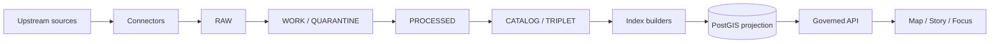

<!-- [KFM_META_BLOCK_V2]
doc_id: kfm://doc/3d9d6b88-1db1-4e57-9d8b-8f84f2c1a4a2
title: PostGIS Migrations
type: standard
version: v1
status: draft
owners: TBD
created: 2026-02-22
updated: 2026-02-22
policy_label: restricted
related:
  - migrations/README.md
  - docs/architecture/README.md
tags: [kfm, migrations, postgis, database, governance]
notes:
  - This file is intentionally tool-agnostic; wire it to your chosen migration runner.
  - Treat PostGIS as a rebuildable projection store, not canonical truth.
[/KFM_META_BLOCK_V2] -->

# PostGIS Migrations
**Purpose:** Manage schema + function changes for the **PostGIS projection store** used for spatial filtering and indexing (not canonical data).  
**Status:** `draft` • **Owners:** `TBD`


## Quick navigation
- [What belongs here](#what-belongs-here)
- [How PostGIS fits KFM](#how-postgis-fits-kfm)
- [Directory layout and naming](#directory-layout-and-naming)
- [How to run migrations](#how-to-run-migrations)
- [Writing migrations safely](#writing-migrations-safely)
- [Review gates](#review-gates)
- [Troubleshooting](#troubleshooting)

---

## What belongs here

This directory contains **database migrations** for the PostGIS-backed store that supports:

- spatial filtering (bbox, geometry predicates)
- spatial indexes (GiST/SP-GiST/etc.)
- helper SQL functions used by indexers / tile builders
- schema for **derived** tables that are rebuilt from promoted artifacts

> [!IMPORTANT]
> If you are looking for *data ingestion* or *artifact promotion*, this is the wrong place.  
> PostGIS is an **index/projection** in the KFM model—rebuildable from promoted artifacts.

---

## How PostGIS fits KFM

KFM’s pipeline produces promoted artifacts and catalogs first; indexes come after.



### Trust membrane reminder
Migrations are privileged operations. They must respect the trust membrane:

- UI/clients do **not** connect to DBs directly
- core logic should not bypass repository interfaces
- access flows through governed APIs (policy + logging)

> [!WARNING]
> Do **not** add patterns that encourage direct DB access from frontends, notebooks, or ad‑hoc scripts.
> If you must support analyst workflows, do it via governed endpoints or controlled, role-scoped tools.

### Canonical vs rebuildable
By default:
- **Canonical:** object storage + catalogs + provenance
- **Rebuildable:** PostGIS tables, search indexes, tile caches

Implication for migrations:
- you can drop and rebuild PostGIS projections **if** you can deterministically re-index from promoted artifacts
- schema changes must include a **rebuild plan** (and where possible a rollback plan)

---

## Directory layout and naming

### Current directory (this file)
```text
migrations/
└─ postgis/
   └─ README.md
```

### Proposed migration layout (tool-agnostic)
> If your repo already has a different convention, align with it and update this README.

```text
migrations/postgis/
├─ README.md
├─ 0000__bootstrap.sql
├─ 0010__schemas.sql
├─ 0020__extensions.sql
├─ 0030__tables.sql
├─ 0040__functions.sql
├─ 0050__indexes.sql
└─ down/                       # optional (only if your runner supports down migrations)
   ├─ 0050__indexes.down.sql
   └─ ...
```

### Naming rules (recommended)
- Use **lexicographically sortable** prefixes so a simple directory walk runs migrations in order.
- Keep names short and specific: `0040__add_kfm_index_functions.sql`
- One logical change per migration file.

---

## How to run migrations

> [!NOTE]
> The migration runner is **not confirmed in repo**. This section provides safe, tool-agnostic options.
> Replace with your actual runner (Flyway/Liquibase/Sqitch/Prisma/Knex/etc.) once confirmed.

### Option A: Run a single migration with `psql` (local/dev)
```bash
psql "$DATABASE_URL" -v ON_ERROR_STOP=1 -f migrations/postgis/0040__functions.sql
```

### Option B: Run all migrations in order (local/dev)
```bash
set -euo pipefail
for f in migrations/postgis/*.sql; do
  echo "==> Applying $f"
  psql "$DATABASE_URL" -v ON_ERROR_STOP=1 -f "$f"
done
```

### Production posture (required)
- Run migrations via **controlled automation** (CI/CD, GitOps job, or platform pipeline).
- Emit an **audit record / run receipt** for each migration run (who/what/when/inputs/outputs).
- Fail closed: partial migrations must not result in a partially served runtime.

> [!IMPORTANT]
> Prefer **expand → backfill → contract** changes (dual-read/dual-write where applicable) over “big bang” table rewrites.

---

## Writing migrations safely

### Baseline rules
- **Idempotent where possible**
  - Prefer: `CREATE SCHEMA IF NOT EXISTS ...`
  - Prefer: `CREATE EXTENSION IF NOT EXISTS postgis;`
- **Transactional where possible**
  - Use `BEGIN; ... COMMIT;` for DDL that is safe in a transaction.
  - If you need `CREATE INDEX CONCURRENTLY`, it cannot run inside a transaction block—split it.
- **No silent destructive changes**
  - Any `DROP`, `TRUNCATE`, or column type narrowing must include:
    - explicit migration notes
    - impact assessment (tables affected, rebuild/backfill plan)
    - rollback strategy (where feasible)

### PostGIS-specific guidance
- Always declare SRIDs intentionally.
- Add spatial indexes on geometry columns used for runtime filtering.
- If you create helper functions, namespace them (example: `kfm_*`) and document inputs/outputs.

### Minimal migration template
```sql
-- 00xx__short_description.sql
-- Purpose: <one sentence>
-- Risk: <low|medium|high>  Rollback: <none|manual|scripted>
-- Notes: <expected runtime, locks, backfill implications>

BEGIN;

-- Example: schema/extension setup
CREATE SCHEMA IF NOT EXISTS kfm_index;
CREATE EXTENSION IF NOT EXISTS postgis;

-- Example: derived projection table
CREATE TABLE IF NOT EXISTS kfm_index.feature_geom (
  dataset_version_id text NOT NULL,
  feature_id         text NOT NULL,
  geom               geometry NOT NULL,
  evidence_ref       text NOT NULL,
  updated_at         timestamptz NOT NULL DEFAULT now(),
  PRIMARY KEY (dataset_version_id, feature_id)
);

COMMIT;

-- Non-transactional section (only if needed):
-- CREATE INDEX CONCURRENTLY IF NOT EXISTS ...
```

---

## Review gates

Use this checklist in PRs that touch `migrations/postgis/`:

- [ ] Migration is ordered + named consistently.
- [ ] Idempotent constructs used (`IF NOT EXISTS`) where feasible.
- [ ] Locking impact considered (esp. large tables / index builds).
- [ ] Rebuild plan documented (how to reindex from promoted artifacts).
- [ ] If destructive: explicit rollback steps documented.
- [ ] Policy posture preserved: no new path that bypasses governed APIs.
- [ ] CI has a smoke test applying migrations to:
  - [ ] a fresh database
  - [ ] a database at N-1 schema state (if available)

> [!TIP]
> Add a “migration linter” that blocks merges if:
> - migration filenames are out of order
> - `DROP`/`TRUNCATE` appears without an explicit `-- Risk:` tag
> - no rebuild notes exist for schema changes affecting index builders

---

## Troubleshooting

### “extension postgis does not exist”
- Ensure PostGIS is installed on the Postgres server image.
- Ensure the DB role running migrations has rights to `CREATE EXTENSION`.

### “cannot run CREATE INDEX CONCURRENTLY in a transaction block”
- Split index creation into its own migration file without `BEGIN/COMMIT`.

### “permission denied for schema …”
- Confirm the migration role has required privileges in the target schema.
- In production, prefer a dedicated migrator role (least privilege).

---

## References
- KFM “trust membrane” + “canonical vs rebuildable” invariants (see KFM Design & Governance Guide)
- KFM Promotion Contract (zones + gates) (see KFM Design & Governance Guide)

<!-- Back to top -->
<p align="right"><a href="#postgis-migrations">⬆ Back to top</a></p>
