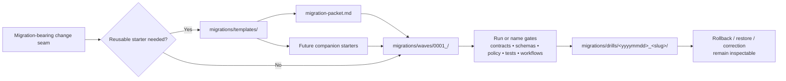

<!-- [KFM_META_BLOCK_V2]
doc_id: kfm://doc/NEEDS-VERIFICATION
title: migrations/templates
type: standard
version: v1
status: draft
owners: @bartytime4life
created: NEEDS VERIFICATION
updated: 2026-04-05
policy_label: public
related: [migrations/README.md, migrations/templates/migration-packet.md, migrations/waves/README.md, migrations/drills/README.md, docs/templates/README.md, contracts/README.md, schemas/README.md, policy/README.md, scripts/README.md, tests/README.md, .github/workflows/README.md, .github/CODEOWNERS]
tags: [kfm, migrations, templates, readme]
notes: [doc_id placeholder pending assignment, created date needs git-history verification, owner is grounded in current public /migrations/ CODEOWNERS coverage, workflow and script lanes are README-only on current public main]
[/KFM_META_BLOCK_V2] -->

# `migrations/templates`

Reusable migration-packet and review scaffold shelf for Kansas Frontier Matrix.

> **Status:** `experimental`  
> **Owners:** `@bartytime4life`  
>       
> **Repo fit:** `migrations/templates/README.md` · upstream: [`../README.md`](../README.md) · siblings: [`../waves/README.md`](../waves/README.md), [`../drills/README.md`](../drills/README.md) · local starter: [`./migration-packet.md`](./migration-packet.md) · related docs: [`../../docs/templates/README.md`](../../docs/templates/README.md), [`../../contracts/README.md`](../../contracts/README.md), [`../../schemas/README.md`](../../schemas/README.md), [`../../policy/README.md`](../../policy/README.md), [`../../scripts/README.md`](../../scripts/README.md), [`../../tests/README.md`](../../tests/README.md), [`../../.github/workflows/README.md`](../../.github/workflows/README.md), [`../../.github/CODEOWNERS`](../../.github/CODEOWNERS)  
> **Quick jumps:** [Scope](#scope) · [Repo fit](#repo-fit) · [Accepted inputs](#accepted-inputs) · [Exclusions](#exclusions) · [Directory tree](#directory-tree) · [Quickstart](#quickstart) · [Usage](#usage) · [Diagram](#diagram) · [Template registry](#template-registry) · [Task list](#task-list) · [FAQ](#faq) · [Appendix](#appendix)

> [!IMPORTANT]
> This directory is for **reusable starters**. Real change packets belong in [`../waves/README.md`](../waves/README.md); exercised rollback, restore, and correction evidence belongs in [`../drills/README.md`](../drills/README.md); canonical contract, schema, policy, and verification truth stays in its owning surface.

> [!WARNING]
> Current public `main` confirms two local files here: `README.md` and [`migration-packet.md`](./migration-packet.md). Every additional starter name below remains **PROPOSED** until it lands in-tree and review confirms it is genuinely reusable.

> [!NOTE]
> Branch reality wins. Use starter expansion patterns only when the active branch actually adopts them.

## Scope

`migrations/templates/` keeps migration documentation repeatable, reviewable, and boring in the good way.

The parent `migrations/` surface treats migration as broader than database DDL. Schema change, data repair/backfill, contract or envelope evolution, policy or registry change, release-proof change, runtime trust behavior, rollback, supersession, withdrawal, and visible correction can all be migration-bearing. This subdirectory narrows that broader posture into **reusable authoring starters**.

### Lane map

| Lane | Primary job | Keep out of this lane |
|---|---|---|
| `migrations/templates/` | Reusable packet starters and companion scaffolds | One-off packet history, exercised evidence, canonical policy/schema truth |
| `migrations/waves/` | Bounded, review-first migration packets | Generic starter material and post-execution drill records |
| `migrations/drills/` | Exercised verification, rollback, restore, and correction records | Speculative packet planning and reusable templates |

In plain terms: a migration packet starter may live here; the packet for one specific change should not.

[Back to top](#migrationstemplates)

## Repo fit

`migrations/templates/` is the reusable starter lane inside `migrations/`.

### Repo fit summary

| Aspect | Guidance |
|---|---|
| Path | `migrations/templates/README.md` |
| Role in repo | Directory README for reusable migration starters |
| Current local inventory | `README.md`, `migration-packet.md` |
| Upstream doctrine | [`../README.md`](../README.md) |
| Sibling migration lanes | [`../waves/README.md`](../waves/README.md), [`../drills/README.md`](../drills/README.md) |
| Broader verification surfaces | [`../../contracts/README.md`](../../contracts/README.md), [`../../schemas/README.md`](../../schemas/README.md), [`../../policy/README.md`](../../policy/README.md), [`../../scripts/README.md`](../../scripts/README.md), [`../../tests/README.md`](../../tests/README.md), [`../../.github/workflows/README.md`](../../.github/workflows/README.md) |
| Ownership boundary | [`../../.github/CODEOWNERS`](../../.github/CODEOWNERS) |
| Primary audience | Maintainers, reviewers, platform engineers, data engineers, release stewards |

### Current public-main signal

| Signal | Status | Practical consequence |
|---|---|---|
| `migrations/templates/` is a live directory on public `main` | **CONFIRMED** | This lane is real, not just doctrinal target state |
| `migration-packet.md` exists locally | **CONFIRMED** | One starter scaffold is already available |
| `migrations/waves/` and `migrations/drills/` exist as sibling lanes | **CONFIRMED** | Planning and exercised evidence already have separate homes |
| Additional companion starters such as `verify.md` or `rollback.md` are checked in here | **PROPOSED** | Do not imply they exist until the branch shows them |
| `.github/workflows/` is README-only on current public `main` | **CONFIRMED** | Do not present checked-in workflow YAML gates as current-tree fact |
| Public Actions history exposes removed workflow names such as `verify-docs.yml` or `release-evidence.yml` | **CONFIRMED historical signal** | Useful context, but not proof that those YAML files still exist on `main` |
| `scripts/` is README-only on current public `main` | **CONFIRMED** | Keep command examples illustrative unless the branch adds real helper entrypoints |
| `scripts/README.md` frames `scripts/` as a thin entrypoint lane, not a sovereign implementation surface | **CONFIRMED** | Templates should point to helpers without pretending a durable script inventory already exists |

### Why this lane matters

A strong template lane does three things well:

1. it keeps future packet structure consistent  
2. it points real work back to stronger surfaces instead of inventing a second truth path  
3. it makes later wave packets easier to review without pretending the review already happened

[Back to top](#migrationstemplates)

## Accepted inputs

The test for this folder is not “is it useful?”  
It is “is it **reusable across multiple wave packets** without becoming hidden source-of-truth?”

### What belongs here

| Input class | Current posture | Why it belongs here |
|---|---|---|
| [`migration-packet.md`](./migration-packet.md) | **CONFIRMED** | Current reusable starter for full migration-bearing packets |
| `verify.md`, `rollback.md`, `correction.md`, `compatibility-seam.md`, `cutover-checklist.md` | **PROPOSED** | Future companion starters if repeated reuse justifies maintenance |
| Lightweight reviewer prompts or placeholder fragments | **INFERRED / situational** | Helpful when they standardize governance checks without becoming policy law |
| Commented SQL header/footer fragments | **INFERRED / situational** | Acceptable only when clearly generic, runner-neutral, and not mistaken for live migrations |
| README-level authoring guidance | **CONFIRMED** | This directory exists to explain and constrain the starter shelf itself |

### Admission rule

A new file belongs here only if all three are true:

1. it is **reusable** across more than one migration packet  
2. it is **not itself** a live trust object, exercised record, or release artifact  
3. it does **not compete** with canonical policy, contract, schema, script, or test authority

[Back to top](#migrationstemplates)

## Exclusions

### What does not belong here

| Excluded item | Why it stays out | Put it here instead |
|---|---|---|
| One-off packet for a named change | Packet history is not reusable starter material | The owning wave packet under `../waves/` or the branch's adopted packet lane |
| Exercised verification, rollback, or correction records | Templates are not rehearsals | [`../drills/README.md`](../drills/README.md) and its packet directories once they exist |
| Executable migration SQL or engine-specific runner code | This directory is not the execution surface | The owning execution/helper surface adopted by the branch, linked from the packet |
| Policy bundles, reason/obligation registries, or `.rego` logic | Template shelves must not become policy authority | [`../../policy/README.md`](../../policy/README.md) |
| JSON Schema, OpenAPI, contract envelopes, or registry law | Avoid parallel schema universes | [`../../contracts/README.md`](../../contracts/README.md) and [`../../schemas/README.md`](../../schemas/README.md) |
| Merge gates, workflow YAML, or required-check choreography | Active automation belongs in the workflow control surface | [`../../.github/workflows/README.md`](../../.github/workflows/README.md) and checked-in YAML when present |
| Shared validator libraries or durable automation helpers | Reusable implementation deserves its own lifecycle | [`../../scripts/README.md`](../../scripts/README.md) or the branch's confirmed helper surface |
| Receipts, manifests, proof packs, backups, or exports | Runtime evidence is not starter content | The owning wave packet, drill packet, or release/recovery surface |
| Free-form brainstorming notes | They are not stable enough to be a template | Issue/PR context or a more appropriate documentation lane |
| Secrets, credentials, DSNs, or signed URLs | Never commit secrets into a reusable scaffold | Secret-manager or local operator configuration |

> [!TIP]
> A quick rule: if the file would be confusing when copied into three different migration packets, it is probably not a template.

[Back to top](#migrationstemplates)

## Directory tree

### Current public-main shape

```text
migrations/
├── README.md
├── drills/
│   └── README.md
├── templates/
│   ├── README.md
│   └── migration-packet.md
└── waves/
    └── README.md
```

### Starter expansion inside this lane

```text
migrations/templates/
├── README.md
├── migration-packet.md              # CONFIRMED
├── verify.md                        # PROPOSED
├── rollback.md                      # PROPOSED
├── correction.md                    # PROPOSED
├── compatibility-seam.md            # PROPOSED
└── cutover-checklist.md             # PROPOSED
```

### Interpretation rule

- the first tree above is **current public-main inventory**
- the second tree is **starter expansion guidance**
- only `README.md` and `migration-packet.md` should be treated as present until the branch proves more

[Back to top](#migrationstemplates)

## Quickstart

### 1) Re-read the lane boundaries before adding anything

```bash
sed -n '1,240p' migrations/README.md
sed -n '1,240p' migrations/waves/README.md
sed -n '1,240p' migrations/drills/README.md
sed -n '1,240p' docs/templates/README.md
```

### 2) Verify the active branch inventory instead of assuming it

```bash
git rev-parse HEAD
git ls-files 'migrations/**' | sort
find migrations -maxdepth 3 \( -type f -o -type d \) | sort
```

### 3) Read the control-lane boundaries before you imply automation

```bash
sed -n '1,220p' scripts/README.md
sed -n '1,220p' .github/workflows/README.md
find contracts schemas policy scripts tests .github/workflows -maxdepth 2 -type f 2>/dev/null | sort
```

### 4) Start from the confirmed starter

```bash
WAVE_ID="0001_example"
mkdir -p "migrations/waves/${WAVE_ID}"
cp migrations/templates/migration-packet.md "migrations/waves/${WAVE_ID}/README.md"
```

### 5) Add companion packet files only if the branch adopts the documented wave-packet model

```bash
mkdir -p "migrations/waves/${WAVE_ID}"/{schema,fixtures}
touch "migrations/waves/${WAVE_ID}"/{plan.md,verify.md,rollback.md,correction.md}
```

> [!NOTE]
> The companion packet files above are **illustrative** until the active branch deliberately adopts that packet shape.

### 6) Make the instantiated packet concrete

Fill the copied packet with:

- affected authoritative and derived surfaces
- linked contract, schema, policy, and test references
- named validation gates
- rollback / supersession / correction posture
- links to the proof objects or drill records the change will require

[Back to top](#migrationstemplates)

## Usage

### Current default starter

Start with [`migration-packet.md`](./migration-packet.md) unless repeated packet pressure proves a smaller companion starter is worth maintaining.

### Selection rule

Choose the **smallest starter** that preserves review clarity without creating a shadow authority surface.

| Need | Start here | Escalate when |
|---|---|---|
| One bounded migration-bearing seam needs a full review shell | `migration-packet.md` | Never smaller until repeated packet use proves a narrower companion starter |
| Verification prose keeps repeating across multiple wave packets | `verify.md` (`PROPOSED`) | Only after reuse is real, not hypothetical |
| Rollback or fail-forward sections drift across packets | `rollback.md` (`PROPOSED`) | Only when a shared rollback shape clearly improves review |
| Correction lineage language repeats | `correction.md` (`PROPOSED`) | Only when visible correction behavior is recurring |
| Compatibility-window prose repeats | `compatibility-seam.md` (`PROPOSED`) | Only when dual-read, dual-write, or adapter seams recur |
| Human cutover checklists are recurring and stable | `cutover-checklist.md` (`PROPOSED`) | Only when they remain generic enough to reuse |

### Working pattern

1. Decide whether the need is **reusable** or **one-off**.  
2. If it is reusable, update or add a starter here.  
3. Instantiate that starter into the owning wave packet or other adopted migration lane.  
4. Link the packet outward to contracts, schemas, policy, tests, workflows, and proof objects.  
5. Route exercised outcomes into `../drills/`, not back into this shelf.  
6. Retire temporary compatibility language when the seam closes.

### What “good” looks like

A good starter in this directory:

- reduces repeated authoring work
- improves review consistency
- makes rollback, correction, and proof expectations easier to see
- stays honest about what is manual, automated, or still unverified
- does not claim a runner, validator, or merge gate that the branch cannot actually show

> [!IMPORTANT]
> Current public `main` is narrower and sharper than earlier README-only assumptions:
>
> - `.github/workflows/` is a documented control lane, but it is still README-only on the inspected public tree
> - public Actions history exposes removed workflow names, which are useful reconstruction clues but not current-tree proof
> - `scripts/` is also README-only on the inspected public tree and is explicitly framed as a thin entrypoint lane
>
> Template text should name validations as **actual**, **manual**, **historical signal**, or **proposed**—never as magically automated.

[Back to top](#migrationstemplates)

## Diagram



[Back to top](#migrationstemplates)

## Template registry

| Template or pattern | Current status | Intended use | Notes |
|---|---|---|---|
| Directory README pattern | **CONFIRMED** | Establish scope, exclusions, inventory, and navigation for a lane | This file is one live instance |
| [`migration-packet.md`](./migration-packet.md) | **CONFIRMED** | Primary reusable packet starter for change intent, validation, rollback, and correction | Present in the current public tree |
| `verify.md` | **PROPOSED** | Reusable validation companion | Add only if repeated packet use justifies it |
| `rollback.md` | **PROPOSED** | Reusable rollback or fail-forward starter | Keep reversibility explicit and comparable |
| `correction.md` | **PROPOSED** | Reusable post-release correction packet | Useful when visible correction becomes a recurring pattern |
| `compatibility-seam.md` | **PROPOSED** | Temporary dual-read, dual-write, or adapter-window notes | Retire when the seam closes |
| `cutover-checklist.md` | **PROPOSED** | Human-in-the-loop cutover checklist | Keep operational checks reviewable without implying automation |

[Back to top](#migrationstemplates)

## Task list

### Definition of done for this directory

- [ ] Owners remain aligned with `.github/CODEOWNERS` or are narrowed with evidence
- [ ] Local inventory and this registry stay synchronized (`README.md` + `migration-packet.md` today)
- [ ] Any new starter is demonstrably reused across more than one wave packet before it becomes permanent
- [ ] Templates point live packet work into `../waves/` and exercised proof into `../drills/`
- [ ] Companion starters do not claim runners, gates, or scripts the branch cannot show
- [ ] Relative links resolve cleanly from this directory
- [ ] No file here becomes policy, schema, fixture, or receipt authority
- [ ] Stale starters are revised or removed instead of silently drifting

### Review checks

- Does this reduce repeated authoring work across multiple packets?
- Could a reviewer mistake it for live implementation truth or exercised proof?
- Does it fork authority away from `contracts/`, `schemas/`, `policy/`, `tests/`, or workflows?
- Does it improve rollback, correction, or proof review?
- Is the starter generic enough to survive more than one migration wave?

[Back to top](#migrationstemplates)

## FAQ

### Why not keep migration starters under `docs/templates/`?

Because migration starters are tightly coupled to the special rules of `migrations/`: bounded change packets, exercised drills, rollback posture, compatibility seams, and correction lineage. Repo-wide template doctrine still matters, but migration-specific starters belong in the migration lane.

### Why is `migration-packet.md` marked **CONFIRMED** while most other names stay **PROPOSED**?

Because the current public tree already contains `migration-packet.md`, but it does not yet show the rest of the companion starter inventory.

### Why mention workflows and scripts if those lanes are README-only on public `main`?

Because migration packets still need to link to the control and entrypoint surfaces that would own automation once the branch or future main-tree fills them in. The README names those lanes, but it now does so with sharper status labels so readers can distinguish current-tree fact from historical signal and future fill.

### Why do the sibling links point to `waves/` and `drills/` instead of `notes/`, `postgres/`, and `postgis/`?

Because current public `main` confirms `waves/` and `drills/` as the live sibling migration lanes. README links should follow the live tree, not an older or unverified directory sketch.

### Can SQL fragments live here?

Only when they are obviously **template fragments** and cannot be mistaken for executable migrations. Real migration SQL belongs in the owning execution surface, not in the starter shelf.

### Should every migration instantiate a packet?

Not necessarily. Use the burden of change as the guide. The larger the migration-bearing seam, the stronger the case for a full packet and a corresponding drill trail.

[Back to top](#migrationstemplates)

## Appendix

<details>
<summary>Put-it-here test</summary>

Use this quick test before adding any file to `migrations/templates/`:

| Question | If “yes” | If “no” |
|---|---|---|
| Could this be reused by at least three migration packets? | Keep evaluating | It probably belongs in a packet-local lane |
| Would copying it leave all change-specific facts blank or placeholdered? | Good starter candidate | Too concrete for this folder |
| Is it safe if someone mistakes it for a pattern, not proof? | Good starter candidate | Move it to the owning lane |
| Does it avoid becoming policy, schema, or fixture authority? | Good starter candidate | Move it to the authoritative sibling surface |
| Does it improve review clarity more than it adds clutter? | Worth keeping | Do not add it |

</details>

<details>
<summary>Suggested naming convention</summary>

Use lowercase, hyphenated filenames for starter artifacts:

```text
migration-packet.md
verify.md
rollback.md
correction.md
compatibility-seam.md
cutover-checklist.md
```

Avoid:

- ticket IDs in starter names
- storage-engine names unless the starter is truly engine-specific
- date-stamped names
- “final”, “new”, “latest”, or “copy”

</details>

<details>
<summary>Authoring notes</summary>

When adding a new starter:

1. state the reusable problem it solves
2. keep placeholders visible
3. keep examples short and clearly illustrative
4. link back to the authoritative sibling surfaces
5. prefer revising one starter over spawning near-duplicates

</details>

[Back to top](#migrationstemplates)
