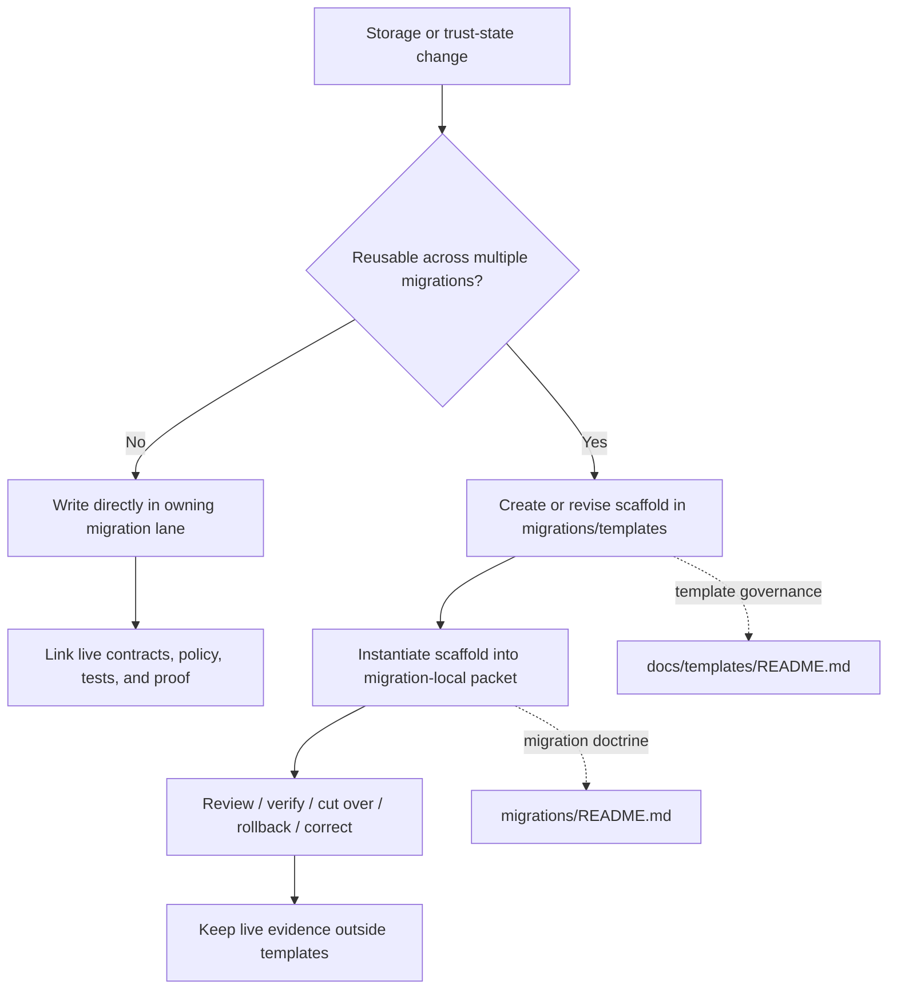

# `migrations/templates`

Reusable migration-packet and review scaffold shelf for Kansas Frontier Matrix.

> **Status:** `experimental`  
> **Owners:** `NEEDS VERIFICATION`  
>      
> **Repo fit:** `migrations/templates/README.md` · upstream: [`../README.md`](../README.md) · adjacent: [`../notes/`](../notes/), [`../postgres/`](../postgres/), [`../postgis/`](../postgis/) · related docs: [`../../docs/templates/README.md`](../../docs/templates/README.md), [`../../contracts/README.md`](../../contracts/README.md), [`../../policy/README.md`](../../policy/README.md), [`../../scripts/README.md`](../../scripts/README.md), [`../../tests/README.md`](../../tests/README.md)  
> **Quick jumps:** [Scope](#scope) · [Repo fit](#repo-fit) · [Accepted inputs](#accepted-inputs) · [Exclusions](#exclusions) · [Directory tree](#directory-tree) · [Quickstart](#quickstart) · [Usage](#usage) · [Diagram](#diagram) · [Template registry](#template-registry) · [Task list](#task-list) · [FAQ](#faq) · [Appendix](#appendix)

> [!IMPORTANT]
> This directory is for **reusable migration scaffolds**, not for live migration truth objects. Executed SQL, emitted receipts, release manifests, policy bundles, and one-off cutover notes belong in their owning migration lane or governed sibling surface, not here.

> [!WARNING]
> The public `main` branch currently shows `migrations/` with `notes/`, `postgres/`, `postgis/`, two SQL files, and a directory README. It does **not** currently show a populated `migrations/templates/` inventory. Treat every template name below other than this README as **PROPOSED** until added in-tree and reviewed.

## Scope

`migrations/templates/` exists to keep migration documentation **repeatable, reviewable, and boring in the good way**.

The `migrations/` directory already frames migration as more than “run some SQL”: it is a governed seam where storage evolution, trust-state evolution, rollback posture, correction posture, and proof obligations have to stay legible. This subdirectory narrows that rule one step further:

- use this folder for **scaffolds**
- use owning migration folders for **real work**
- use governed sibling directories for **canonical policy, contracts, tests, and receipts**

In plain terms: a migration packet template may live here; the packet for `0007_split_claim_table` should not.

[Back to top](#migrationstemplates)

## Repo fit

| Aspect | What this directory does | Where the real artifact goes instead |
|---|---|---|
| Migration packet structure | Defines a reusable packet shape for planning, review, cutover, validation, rollback, and correction | The owning migration lane under `migrations/…` |
| Verification/checklist structure | Provides repeatable reviewer prompts and definition-of-done scaffolds | `tests/`, CI logs, proof packs, and migration-local docs |
| Cutover/rollback writing pattern | Standardizes how teams describe reversible change | Migration-local packet, runbook, or ops evidence |
| Compatibility seam notes | Gives authors a common shape for dual-read / dual-write / backfill windows | The specific migration or release note |
| Correction/supersession narrative | Makes post-release correction packets easier to write consistently | The actual correction packet in the affected lane |

### Upstream dependencies

This directory should stay aligned with:

- [`../README.md`](../README.md) for migration doctrine and lane boundaries
- [`../../docs/templates/README.md`](../../docs/templates/README.md) for repo-wide template behavior
- [`../../contracts/README.md`](../../contracts/README.md) for contract authority boundaries
- [`../../policy/README.md`](../../policy/README.md) for deny-by-default and review semantics
- [`../../scripts/README.md`](../../scripts/README.md) and [`../../tests/README.md`](../../tests/README.md) for execution and validation surfaces

### Downstream consumers

Template files here are expected to be copied, instantiated, or adapted into:

- migration-local `README.md` packets
- review notes under `../notes/`
- storage-specific work under `../postgres/` or `../postgis/`
- future migration waves or drills if those lanes are added later

[Back to top](#migrationstemplates)

## Accepted inputs

The question for this folder is not “is it useful?”  
It is “is it **reusable across multiple migration packets** without becoming hidden source-of-truth?”

### What belongs here

| Input class | Belongs here? | Why |
|---|---:|---|
| `migration-packet.md` scaffold | Yes | Reusable packet shell for planning, verification, rollback, and correction |
| `verify.md` checklist scaffold | Yes | Reusable review surface for proof obligations |
| `rollback.md` scaffold | Yes | Keeps rollback planning explicit and consistent |
| `correction.md` scaffold | Yes | Helps treat correction as a first-class continuation, not an afterthought |
| `compatibility-seam.md` scaffold | Yes | Useful when migrations temporarily require dual-read / dual-write or adapter seams |
| `cutover-checklist.md` scaffold | Yes | Good fit if reused across several migration families |
| Commented SQL header/footer skeletons | Sometimes | Only if clearly generic, runner-neutral, and not mistaken for live migrations |
| Reviewer prompt fragments | Sometimes | Good when they standardize real governance checks and are reused broadly |

### Admission rule

A file belongs here only if all three are true:

1. it is **reusable**
2. it is **not itself a live trust object**
3. it does **not compete** with canonical policy, contract, or test authority

[Back to top](#migrationstemplates)

## Exclusions

### What does **not** belong here

| Excluded item | Why it is excluded | Put it here instead |
|---|---|---|
| Executable migration SQL | This folder is not an execution lane | `migrations/`, `migrations/postgres/`, or `migrations/postgis/` |
| One-off packet for a named migration | Real packet, not scaffold | The owning migration folder |
| Emitted receipts, manifests, attestations, or proof packs | These are runtime/review artifacts, not templates | Release/migration evidence location |
| Policy bundles or Rego rules | Template shelf must not become policy authority | `policy/` |
| JSON Schema / OpenAPI / contract truth | Template shelf must not become parallel schema universe | `contracts/` or `schemas/` |
| CI workflow fragments presented as active gates | Risk of trust theater | `.github/` plus validated workflow docs |
| Secrets, credentials, env samples with real values | Unsafe and not template-specific | Proper secret handling surfaces |
| Generated SQL dumps, backups, exports | Generated evidence, not reusable scaffolds | Migration-local evidence or ops storage |
| Free-form brainstorming notes | Not stable enough to be a scaffold | `../notes/` or issue/PR context |

> [!NOTE]
> A quick rule: if the file would be confusing when copied into three different migrations, it is probably not a template.

[Back to top](#migrationstemplates)

## Directory tree

### Current observed context

```text
migrations/
├── 0001_enable_extensions.sql
├── 0002_spatial_indexes.sql
├── README.md
├── notes/
├── postgis/
└── postgres/
```

### Intended shape after this README exists

```text
migrations/
├── 0001_enable_extensions.sql
├── 0002_spatial_indexes.sql
├── README.md
├── notes/
├── postgis/
├── postgres/
└── templates/
    ├── README.md
    ├── migration-packet.md          # PROPOSED
    ├── verify.md                    # PROPOSED
    ├── rollback.md                  # PROPOSED
    ├── correction.md                # PROPOSED
    ├── compatibility-seam.md        # PROPOSED
    └── cutover-checklist.md         # PROPOSED
```

### Interpretation rule

- the directory itself is established by this README
- the file names under it are **starter inventory proposals**
- none of the proposed template filenames should be treated as existing until they land in-tree

[Back to top](#migrationstemplates)

## Quickstart

### 1) Re-read the local migration doctrine

```bash
sed -n '1,240p' migrations/README.md
sed -n '1,240p' docs/templates/README.md
```

### 2) Verify the directory shape before adding a new scaffold

```bash
find migrations -maxdepth 2 -type f | sort
```

### 3) Add the smallest reusable scaffold that solves a repeated problem

```bash
mkdir -p migrations/templates
$EDITOR migrations/templates/migration-packet.md
```

### 4) Instantiate the scaffold in the owning migration lane

```bash
mkdir -p migrations/notes/0003_example_migration
cp migrations/templates/migration-packet.md migrations/notes/0003_example_migration/README.md
```

### 5) Make the instantiated packet specific

Fill in the copied packet with:

- affected storage surfaces
- related contracts and tests
- validation steps
- rollback plan
- correction/supersession notes
- links to actual proof artifacts

> [!TIP]
> Keep template files generic and packet copies concrete. If the template starts acquiring migration-specific IDs, table names, or dates, move that material into the packet instance.

[Back to top](#migrationstemplates)

## Usage

### Selection rule

Choose the **smallest template** that preserves review clarity.

| Need | Recommended move |
|---|---|
| One migration needs a complete review shell | Start from `migration-packet.md` |
| Existing packet is fine, but verification is repetitive | Add or revise `verify.md` |
| Rollback quality is inconsistent across changes | Add or revise `rollback.md` |
| Corrections are happening, but lineage prose drifts | Add or revise `correction.md` |
| Team is repeating the same compatibility-window explanation | Add or revise `compatibility-seam.md` |

### Working pattern

1. decide whether the need is **reusable** or **one-off**
2. if reusable, update or add a template here
3. instantiate the template in the owning migration lane
4. link the packet to contracts, policy, tests, and proof objects
5. retire temporary compatibility language when the seam closes

### What “good” looks like

A good template in this directory:

- reduces repeated authoring work
- improves review consistency
- does not invent process that the repo cannot support
- does not hide uncertainty
- does not become a shadow registry for policy or schema truth

[Back to top](#migrationstemplates)

## Diagram



[Back to top](#migrationstemplates)

## Template registry

| Template or pattern | Current status | Intended use | Notes |
|---|---|---|---|
| Directory README pattern | **CONFIRMED** | Establishes directory contract, scope, exclusions, and navigation | Already used widely across the repo |
| `migration-packet.md` | **PROPOSED** | Main scaffold for change intent, validation, rollback, and correction | Named in spirit by the parent `migrations/` tree sketch |
| `verify.md` | **PROPOSED** | Reviewable validation checklist | Useful when one packet shell is too large |
| `rollback.md` | **PROPOSED** | Reusable rollback shape | Keeps reversibility explicit |
| `correction.md` | **PROPOSED** | Reusable post-release correction packet | Aligns with visible correction lineage posture |
| `compatibility-seam.md` | **PROPOSED** | Temporary dual-read / dual-write / adapter window notes | Should be retired when seam closes |
| `cutover-checklist.md` | **PROPOSED** | Operational cutover review checklist | Useful for human-in-the-loop change windows |

### Minimal starter skeleton for `migration-packet.md`

```md
# `<migration-id>` — migration packet

One-line purpose.

## Change class
- schema
- data repair / backfill
- compatibility seam
- policy-coupled change
- correction / supersession

## Preconditions
- contracts reviewed
- policy implications checked
- validation plan agreed
- rollback path defined

## Affected surfaces
- storage
- contracts
- policy
- scripts
- tests
- release / proof artifacts

## Execution plan

## Validation

## Rollback

## Correction / supersession

## Linked artifacts
- contracts:
- tests:
- policy:
- scripts:
- receipts / proof:
```

> [!IMPORTANT]
> The skeleton above is a **starter pattern**, not a confirmed live file contract.

[Back to top](#migrationstemplates)

## Task list

### Definition of done for this directory

- [ ] Owners are verified from live repo governance sources
- [ ] Every file here is demonstrably reusable across more than one migration packet
- [ ] No file here pretends to be canonical policy, schema, or runtime evidence
- [ ] Relative links resolve cleanly from this directory
- [ ] The registry distinguishes **CONFIRMED** from **PROPOSED**
- [ ] Template additions do not imply unverified CI, runner, or deployment behavior
- [ ] Instantiated packets point outward to real contracts, tests, and proof objects
- [ ] Stale scaffolds are revised or removed instead of silently drifting

### Review checks

- Does this new scaffold reduce repeated authoring work?
- Could a reviewer mistake it for live implementation truth?
- Does it create a second authority surface for contracts or policy?
- Does it make rollback, correction, or proof easier to review?
- Is the name stable enough to survive multiple waves of use?

[Back to top](#migrationstemplates)

## FAQ

### Why not keep packet scaffolds under `docs/templates/`?

Because migration packets are tightly coupled to the special rules of `migrations/`: storage evolution, rollback discipline, compatibility seams, and correction lineage. Keeping migration-specific scaffolds here reduces cross-directory ambiguity while still aligning with repo-wide template doctrine.

### Why is nearly everything marked `PROPOSED`?

Because the public repo currently confirms the parent migration directory and its README doctrine, but does not yet confirm a populated migration template inventory. This README keeps that gap visible instead of pretending the inventory already exists.

### Can SQL snippets live here?

Only when they are obviously **template fragments** and cannot be mistaken for executable migrations. Real migration SQL belongs in the execution lanes.

### Should every migration instantiate a packet?

Not necessarily. Use the burden of change as the guide. The larger the trust-state seam, the stronger the case for a full packet.

[Back to top](#migrationstemplates)

## Appendix

<details>
<summary>Put-it-here test</summary>

Use this quick test before adding any file to `migrations/templates/`:

| Question | If “yes” | If “no” |
|---|---|---|
| Could this be reused by at least three migrations? | Keep evaluating | It probably belongs in a migration-local lane |
| Would copying it leave all migration-specific facts blank or placeholdered? | Good template candidate | Too concrete for this folder |
| Is it safe if someone mistakes it for a pattern, not proof? | Good template candidate | Move it to the owning lane |
| Does it avoid becoming policy/schema authority? | Good template candidate | Move it to the authoritative sibling surface |
| Does it improve review clarity more than it adds clutter? | Worth keeping | Do not add it |

</details>

<details>
<summary>Suggested naming convention</summary>

Use lowercase, hyphenated filenames for template artifacts:

```text
migration-packet.md
verify.md
rollback.md
correction.md
compatibility-seam.md
cutover-checklist.md
```

Avoid:

- ticket IDs in template names
- storage-engine names unless the template is truly engine-specific
- date-stamped names
- “final”, “new”, “latest”, or “copy”

</details>

<details>
<summary>Authoring notes</summary>

When adding a new scaffold:

1. state the reusable problem it solves
2. keep placeholders visible
3. keep examples short and clearly illustrative
4. link back to the authoritative sibling surfaces
5. prefer revising one template over spawning near-duplicates

</details>

[Back to top](#migrationstemplates)
