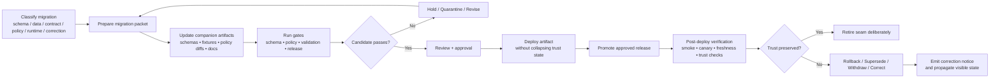

<!-- [KFM_META_BLOCK_V2]
doc_id: kfm://doc/<uuid-NEEDS_VERIFICATION>
title: Migration Packet Template
type: standard
version: v1
status: draft
owners: @bartytime4life
created: YYYY-MM-DD
updated: YYYY-MM-DD
policy_label: NEEDS_VERIFICATION
related: [../README.md, ./README.md, ../../contracts/README.md, ../../schemas/README.md, ../../policy/README.md, ../../tests/README.md, ../../.github/workflows/README.md]
tags: [kfm, migrations, template]
notes: [Template file for migration-bearing changes; fill commit-time metadata placeholders before merge if the repo adopts strict metadata enforcement.]
[/KFM_META_BLOCK_V2] -->

# Migration Packet Template
Reviewable packet for KFM migration-bearing changes across schema, data, contracts, policy, release, runtime, and visible correction.

> **Template role:** use this file when a change affects durable structure, trust-bearing objects, migration seams, or public/steward trust state.
> **Path:** `migrations/templates/migration-packet.md`
> **Upstream:** [`../README.md`](../README.md) · [`./README.md`](./README.md)
> **Adjacent verification surfaces:** [`../../contracts/README.md`](../../contracts/README.md) · [`../../schemas/README.md`](../../schemas/README.md) · [`../../policy/README.md`](../../policy/README.md) · [`../../tests/README.md`](../../tests/README.md) · [`../../.github/workflows/README.md`](../../.github/workflows/README.md)
> **Quick jumps:** [How to use](#how-to-use-this-template) · [Packet header](#packet-header) · [Repo fit](#repo-fit) · [Migration summary](#migration-summary) · [Execution plan](#execution-plan) · [Verification & proof](#verification--proof) · [Rollback / correction](#rollback--supersession--correction) · [Definition of done](#definition-of-done)

> [!IMPORTANT]
> Replace every `<fill-me>` placeholder. If a detail is unknown, write `UNKNOWN` or `NEEDS VERIFICATION`; do not silently delete the field.

> [!NOTE]
> In KFM, migration is broader than database DDL. Treat schema, data repair/backfill, contract or envelope evolution, policy or registry change, release/proof-pack change, runtime trust behavior, supersession, withdrawal, and visible correction as potentially migration-bearing work.

## How to use this template

1. Copy or adapt this packet into the same governed stream as the migration-bearing change.
2. Keep the packet attached to the code, schema, fixture, policy, documentation, and release-evidence changes it describes.
3. Do not remove sections just because the answer is inconvenient. Write `none`, `not applicable`, `UNKNOWN`, or `NEEDS VERIFICATION` where appropriate.
4. Keep public/runtime claims proportional to what is actually evidenced on the branch under review.
5. Treat promotion and public meaning changes as governance events, not as mere deployment side effects.

### Truth labels to use in this packet

| Label | Use it when |
| --- | --- |
| **CONFIRMED** | Directly supported by branch-visible files, fixtures, reports, or other evidence attached to the review. |
| **INFERRED** | Strongly implied by the change set or adjacent doctrine, but not directly proven on the branch. |
| **PROPOSED** | Planned or recommended shape that fits KFM doctrine but is not yet implemented. |
| **UNKNOWN** | Not proven strongly enough to present as fact. |
| **NEEDS VERIFICATION** | Explicit check that must be completed before merge, promotion, or publication. |

### Use this packet for

| Change class | Use this template? | Typical examples |
| --- | --- | --- |
| **Schema / storage** | Yes | DDL, indexes, constraints, partition changes, new tables or columns |
| **Data repair / backfill** | Yes | crosswalks, ID remaps, temporal repairs, authoritative field recomputation |
| **Contract / envelope** | Yes | payload changes, compatibility bridges, deprecations, object-shape migration |
| **Policy / registry** | Yes | reason codes, obligation codes, sensitivity logic, policy fixture changes |
| **Release / proof-pack** | Yes | promotion prerequisites, manifest changes, proof-object additions |
| **Runtime / trust behavior** | Yes | outward result changes, new finite outcomes, stale/generalized handling |
| **Correction-bearing follow-up** | Yes | supersession, withdrawal, visible correction propagation |
| **Purely local scratch work** | No | ad hoc analyst SQL, exploratory notebooks, one-off debugging |
| **UI-only visual polish without trust-state change** | No | styling-only edits that do not alter trust cues, release state, or runtime meaning |

[Back to top](#migration-packet-template)

## Packet header

Use this compact header to stabilize the packet before filling the detailed sections below.

```yaml
id: mig-<yyyy>-<nnn>-<slug>
class: <schema|data|contract|policy|release|runtime|correction>
status: <draft|review|ready|executing|complete|superseded|withdrawn>
purpose: <one-sentence statement>
owners:
  - @bartytime4life
linked_prs:
  - <fill-me or n/a>
linked_issues:
  - <fill-me or n/a>
linked_adrs:
  - <fill-me or n/a>
source_basis:
  - <manual / spec / receipt / issue / dataset / report>
authoritative_scope:
  - <what authoritative state changes>
derived_scope:
  - <what derived layers rebuild, warn, go stale, or stay unchanged>
affected_surfaces:
  - <api|map|detail|focus|export|catalog|worker|ops>
compatibility_window: <none | bounded window>
stop_rule: <what retires the seam>
proof_objects:
  - <schema / fixture / manifest / report / receipt / attestation>
verification:
  - <tests / reports / parity checks / operator checks>
rollback: <revert | fail-forward | supersede | withdraw>
correction_path: <how visible correction propagates>
open_unknowns:
  - <fill-me>
```

> [!TIP]
> Keep the header short and stable. Put long explanations in the sections below, not inside the header block.

## Repo fit

| Item | Value |
| --- | --- |
| **Path** | `migrations/templates/migration-packet.md` |
| **Role in repo** | Reusable template for reviewable migration packets |
| **Confirmed local neighbors** | [`./README.md`](./README.md), [`../README.md`](../README.md) |
| **Confirmed parent migration surfaces** | `../drills/`, `../templates/`, `../waves/` |
| **Confirmed broader repo surfaces** | `../../contracts/`, `../../policy/`, `../../schemas/`, `../../scripts/`, `../../tests/`, `../../.github/workflows/` |
| **Likely downstream use** | Copy or adapt into migration wave docs, PR context, or drill notes (**PROPOSED**; verify against the mounted branch before standardizing) |

## Migration summary

Fill this section first. Reviewers should be able to understand the change without reading implementation details.

| Field | Fill in |
| --- | --- |
| **Migration ID** | `<fill-me>` |
| **Primary class** | `<schema|data|contract|policy|release|runtime|correction>` |
| **Secondary classes** | `<fill-me or none>` |
| **One-line purpose** | `<fill-me>` |
| **Why now** | `<incident / roadmap / compatibility / correction / policy / performance reason>` |
| **Authoritative scope** | `<fill-me>` |
| **Derived scope** | `<fill-me>` |
| **Affected user/steward surfaces** | `<map / dossier / focus / api / export / catalog / ops / none>` |
| **Compatibility window** | `<none | bounded window>` |
| **Stop rule** | `<what retires the bridge or seam>` |
| **Trust posture** | `<what remains CONFIRMED / INFERRED / PROPOSED / UNKNOWN>` |

### Change-class matrix

| Area | In scope? | Notes |
| --- | --- | --- |
| Schema / storage evolution | `[ ]` | `<fill-me>` |
| Data repair / backfill | `[ ]` | `<fill-me>` |
| Contract / envelope evolution | `[ ]` | `<fill-me>` |
| Policy / registry change | `[ ]` | `<fill-me>` |
| Release / proof-pack consequence | `[ ]` | `<fill-me>` |
| Runtime trust behavior | `[ ]` | `<fill-me>` |
| Correction / supersession / withdrawal | `[ ]` | `<fill-me>` |

## Preconditions and invariants

State what must remain true before, during, and after cutover.

| Invariant | Required answer |
| --- | --- |
| **Canonical path preserved?** | `<how Source edge -> RAW -> WORK / QUARANTINE -> PROCESSED -> CATALOG -> PUBLISHED stays intact>` |
| **Trust membrane preserved?** | `<how public/steward clients avoid bypassing governed APIs or evidence resolution>` |
| **Authoritative vs derived split preserved?** | `<what remains authoritative and what must rebuild or warn>` |
| **Build / deploy / promote separated?** | `<how deployment does not silently become publication>` |
| **Finite outcomes preserved?** | `<what outward negative states remain visible if the cutover fails or narrows scope>` |
| **Compatibility seam explicit?** | `<dual-read, dual-write, adapter, bridge, or none>` |
| **Seam retirement explicit?** | `<date, condition, or proof that removes the temporary path>` |

## Companion artifacts and file impact

Name every trust-bearing artifact that changes with this migration.

| Surface | Paths / artifacts | Current state | Planned change | Posture |
| --- | --- | --- | --- | --- |
| Contracts / schemas | `<fill-me>` | `<fill-me>` | `<fill-me>` | `<CONFIRMED|PROPOSED|UNKNOWN>` |
| Fixtures (valid / invalid) | `<fill-me>` | `<fill-me>` | `<fill-me>` | `<...>` |
| Policy bundles / registries | `<fill-me>` | `<fill-me>` | `<fill-me>` | `<...>` |
| Data / receipts / catalogs | `<fill-me>` | `<fill-me>` | `<fill-me>` | `<...>` |
| Scripts / runners / orchestration | `<fill-me>` | `<fill-me>` | `<fill-me>` | `<...>` |
| Workflows / gates | `<fill-me>` | `<fill-me>` | `<fill-me>` | `<...>` |
| Runtime surfaces | `<fill-me>` | `<fill-me>` | `<fill-me>` | `<...>` |
| Docs / diagrams / runbooks | `<fill-me>` | `<fill-me>` | `<fill-me>` | `<...>` |
| Release / proof-pack artifacts | `<fill-me>` | `<fill-me>` | `<fill-me>` | `<...>` |

### Proof objects that must travel with this change

- [ ] `<schema file or schema_version note>`
- [ ] `<valid fixture pack>`
- [ ] `<invalid fixture pack>`
- [ ] `<validation report or parity check>`
- [ ] `<release / candidate manifest reference>`
- [ ] `<rollback note>`
- [ ] `<correction / supersession note if needed>`
- [ ] `<docs / diagram update>`

[Back to top](#migration-packet-template)

## Execution plan

### Phase 1 — pre-cutover

| Step | Owner | Evidence / command / artifact | Stop condition |
| --- | --- | --- | --- |
| `<fill-me>` | `<fill-me>` | `<fill-me>` | `<fill-me>` |
| `<fill-me>` | `<fill-me>` | `<fill-me>` | `<fill-me>` |
| `<fill-me>` | `<fill-me>` | `<fill-me>` | `<fill-me>` |

### Phase 2 — cutover / apply

| Step | Owner | Evidence / command / artifact | Stop condition |
| --- | --- | --- | --- |
| `<fill-me>` | `<fill-me>` | `<fill-me>` | `<fill-me>` |
| `<fill-me>` | `<fill-me>` | `<fill-me>` | `<fill-me>` |
| `<fill-me>` | `<fill-me>` | `<fill-me>` | `<fill-me>` |

### Phase 3 — post-cutover / retire seam

| Step | Owner | Evidence / command / artifact | Stop condition |
| --- | --- | --- | --- |
| `<fill-me>` | `<fill-me>` | `<fill-me>` | `<fill-me>` |
| `<fill-me>` | `<fill-me>` | `<fill-me>` | `<fill-me>` |
| `<fill-me>` | `<fill-me>` | `<fill-me>` | `<fill-me>` |

## Verification & proof

Record what was checked, how it was checked, and what evidence proves it.

| Gate / check | Mode | Evidence path or command | Expected result | Actual result |
| --- | --- | --- | --- | --- |
| Schema / contract validation | `<automated|manual|UNKNOWN>` | `<fill-me>` | `<fill-me>` | `<pass|fail|n/a>` |
| Policy validation | `<...>` | `<fill-me>` | `<fill-me>` | `<...>` |
| Fixture validation (valid / invalid) | `<...>` | `<fill-me>` | `<fill-me>` | `<...>` |
| Data parity / backfill verification | `<...>` | `<fill-me>` | `<fill-me>` | `<...>` |
| Release / proof-pack completeness | `<...>` | `<fill-me>` | `<fill-me>` | `<...>` |
| Post-deploy freshness / smoke / canary | `<...>` | `<fill-me>` | `<fill-me>` | `<...>` |
| Correction visibility check | `<...>` | `<fill-me>` | `<fill-me>` | `<...>` |

### What public and steward surfaces should show

| Condition | Public surface state | Steward / operator state | Required follow-up |
| --- | --- | --- | --- |
| Successful cutover | `<released / fresh / normal state>` | `<fill-me>` | `<fill-me>` |
| Partial or stale derivative rebuild | `<stale / partial / degraded but honest>` | `<fill-me>` | `<fill-me>` |
| Migration blocked pre-promotion | `<no public trust increase>` | `<hold / revise / quarantine>` | `<fill-me>` |
| Post-publication issue requiring correction | `<superseded / withdrawn / corrected / generalized>` | `<fill-me>` | `<fill-me>` |
| Cutover failure requiring rollback | `<honest negative state>` | `<rollback + incident notes>` | `<fill-me>` |

## Diagram



[Back to top](#migration-packet-template)

## Rollback / supersession / correction

### Rollback boundary

| Question | Required answer |
| --- | --- |
| What can be reverted directly? | `<fill-me>` |
| What cannot be silently undone? | `<fill-me>` |
| What is the last known good state? | `<release / manifest / dataset version / DB checkpoint>` |
| What evidence proves rollback succeeded? | `<fill-me>` |

### Supersession / withdrawal / correction path

| Path | Trigger | Artifact(s) required | Visible effect |
| --- | --- | --- | --- |
| Supersede | `<fill-me>` | `<CorrectionNotice / release note / manifest update>` | `<fill-me>` |
| Withdraw | `<fill-me>` | `<fill-me>` | `<fill-me>` |
| Correct in place with lineage | `<fill-me>` | `<fill-me>` | `<fill-me>` |
| Fail-forward | `<fill-me>` | `<fill-me>` | `<fill-me>` |

### User-visible consequences if the seam fails

- **Map / spatial surface:** `<fill-me>`
- **API / contract consumers:** `<fill-me>`
- **Focus / narrative surface:** `<fill-me>`
- **Exports / reports / catalogs:** `<fill-me>`
- **Operator / steward console or notes:** `<fill-me>`

## Review & approvals

| Role | Confirmed signal / expectation | Fill in for this packet |
| --- | --- | --- |
| Path owner | `@bartytime4life` | `<acknowledged / pending>` |
| Change author | `NEEDS VERIFICATION` | `<fill-me>` |
| Additional reviewer(s) | `NEEDS VERIFICATION` | `<fill-me>` |
| Promotion authority | `NEEDS VERIFICATION` | `<fill-me>` |
| Ops / data steward sign-off | `NEEDS VERIFICATION` | `<fill-me>` |

## Open questions / unknowns

- [ ] `<fill-me>`
- [ ] `<fill-me>`
- [ ] `<fill-me>`

## Definition of done

A migration-bearing change should not be called complete until all applicable boxes below are checked.

- [ ] Branch inventory confirms whether `migrations/` already existed or is being introduced.
- [ ] The migration class is named clearly.
- [ ] Preconditions, compatibility seams, and stop rules are documented.
- [ ] The canonical path and trust membrane remain intact.
- [ ] Build, deploy, and promote are not collapsed into one unreviewed step.
- [ ] Authoritative and derived layers remain distinct.
- [ ] Required proof objects and fixture updates are named.
- [ ] Validation gates are named and runnable, or explicitly marked manual if not yet enforced.
- [ ] Contract, schema, or policy meaning changes include corresponding fixture or validator work, or the gap is made explicit.
- [ ] Rollback, supersession, withdrawal, or correction posture is explicit.
- [ ] Relevant public-facing stale, generalized, withheld, superseded, or withdrawn states are handled honestly.
- [ ] Docs, diagrams, and runbooks changed with the behavior.

## Appendix

<details>
<summary>Optional prompts for reviewers and authors</summary>

### Review prompts

- What authoritative state changes here, if any?
- Which derived layers must rebuild, warn, or deliberately stay stale?
- What evidence proves the migration succeeded beyond “the script ran”?
- Which public or steward surface shows honest state if the cutover fails?
- Is rollback enough, or does this change require supersession, withdrawal, or visible correction?
- What temporary seam exists, and exactly what retires it?

### Copy-paste notes block

```md
## Notes
- Assumptions: <fill-me>
- Risks: <fill-me>
- Follow-up work: <fill-me>
- Deferred items: <fill-me>
```

</details>
