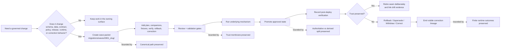

# `waves`

Packetized migration bundles for governed, review-first KFM change waves.

> **Status:** experimental  
> **Document lifecycle:** draft  
> **Authority posture:** operational / supporting  
> **Owners:** **NEEDS VERIFICATION**  
>        
> **Repo fit:** path `migrations/waves/README.md` · parent [`../README.md`](../README.md) · sibling [`../drills/`](../drills/) · sibling [`../templates/`](../templates/)  
> **Quick jump:** [Scope](#scope) · [Repo fit](#repo-fit) · [Accepted inputs](#accepted-inputs) · [Exclusions](#exclusions) · [Current repo signal](#current-repo-signal) · [Directory tree](#directory-tree) · [Quickstart](#quickstart) · [Usage](#usage) · [Diagram](#diagram) · [Tables](#tables) · [Task list / definition of done](#task-list--definition-of-done) · [FAQ](#faq) · [Appendix](#appendix)
>
> [!IMPORTANT]
> Current public `main` confirms that `migrations/waves/` exists and currently exposes `README.md` only. The parent `migrations/README.md` defines a **proposed** packet shape for future wave directories, but the repo does not yet prove a live wave inventory, runner, or merge-blocking migration gate.
>
> [!WARNING]
> A wave is **not** a shortcut around the canonical truth path, trust membrane, policy review, release proof, or correction lineage. It is the review packet that keeps those obligations visible.

## Scope

`waves/` is the packet lane for **bounded, reviewable migration change bundles**.

The parent `migrations/` guide is intentionally broad: in KFM, migration can span schema, data, contracts, policy, release, runtime trust behavior, rollback, supersession, withdrawal, and visible correction. `waves/` narrows that broader doctrine into one unit of work at a time.

Use this directory when a single bounded change seam needs its own packet, review surface, proof expectations, and correction posture. A wave is not the execution engine itself. It is the governed bundle that explains the engine-facing mechanism, the affected trust objects, the validation burden, and the visible recovery path.

### Truth posture used in this README

| Label | Meaning here |
|---|---|
| **CONFIRMED** | Supported by current public repo inspection or by KFM doctrine already reflected in adjacent repo READMEs |
| **INFERRED** | Strongly suggested by the repo and doctrine, but not proven as a mounted execution fact in this session |
| **PROPOSED** | Recommended packet structure or workflow shape consistent with KFM doctrine |
| **UNKNOWN** | Not established strongly enough in the current session to present as settled repo/runtime reality |
| **NEEDS VERIFICATION** | Placeholder value, owner, runner, gate, or repo-local fact that should be checked before merge |

### Working rule for this lane

Treat one wave as **one bounded change seam or one tightly coupled rehearsal**, not as a long-running bucket of unrelated work. If a change cannot explain its scope, stop rule, proof objects, and correction path, it is not ready to live here.

[Back to top](#waves)

## Repo fit

**Path:** `migrations/waves/README.md`  
**Role in repo:** directory README for wave packets under the broader `migrations/` surface.

### Repo fit summary

| Aspect | Guidance |
|---|---|
| **Path** | `migrations/waves/README.md` |
| **Parent contract** | [`../README.md`](../README.md) defines the broader migration posture |
| **Sibling lanes** | [`../drills/`](../drills/) for exercised verification/correction records · [`../templates/`](../templates/) for reusable packet starters |
| **Likely downstream shape** | `./0001_<slug>/` packet directories when the branch adopts the documented packet model |
| **Primary audience** | maintainers, reviewers, platform engineers, data engineers, release stewards |
| **Update trigger** | packet structure changes, naming convention hardening, definition-of-done changes, new required artifacts, or any shift in how waves relate to drills/templates |

### Upstream and downstream links

| Direction | Path | Why it matters |
|---|---|---|
| Upstream | [`../README.md`](../README.md) | Broad migration posture, packet expectations, and correction logic |
| Lateral | [`../../contracts/README.md`](../../contracts/README.md) | Trust-bearing contract families and envelope expectations |
| Lateral | [`../../schemas/README.md`](../../schemas/README.md) | Schema-home boundary and authority guardrails |
| Lateral | [`../../policy/README.md`](../../policy/README.md) | Deny-by-default policy expectations and outcome semantics |
| Lateral | [`../../tests/README.md`](../../tests/README.md) | Fixture and verification expectations |
| Lateral | [`../../.github/README.md`](../../.github/README.md) | Merge discipline, CI/CD surfaces, and review routing |
| Adjacent | [`../drills/`](../drills/) | Post-deploy verification and correction-visibility drill records |
| Adjacent | [`../templates/`](../templates/) | Reusable scaffolds for repeatable packet structure |
| Downstream | `./0001_<slug>/` | One concrete wave packet once the branch adopts the packet model |

### What this README is for

- defining what belongs in `migrations/waves/`
- keeping current public branch facts separate from target-state packet guidance
- making future wave packets structurally consistent
- linking packet design to contracts, schemas, tests, policy, release proof, and correction
- preventing `waves/` from becoming an unstructured dumping ground

### What this README is not for

- declaring a live migration runner as fact
- serving as the authoritative schema registry
- storing generated proof packs, backups, or exports
- replacing execution logs or exercised drill records
- becoming a second doctrine manual when the parent `migrations/` README already carries the broader law

[Back to top](#waves)

## Accepted inputs

The following belong in `waves/` when they are part of one **bounded, reviewable migration packet**.

| Input class | Examples | Why it belongs here |
|---|---|---|
| Packet directory | `0001_<slug>/` | Gives one change seam its own reviewable unit |
| Packet overview | `README.md` inside a wave packet | States purpose, class, scope, and affected surfaces up front |
| Change plan | `plan.md` | Explains intent, sequencing, compatibility window, and stop rule |
| Companion schema or contract material | `schema/`, linked contract diffs, registry notes | Keeps machine-checkable meaning close to the packet |
| Fixtures | `fixtures/` with valid / invalid or parity cases | Makes review and later replay concrete |
| Verification guidance | `verify.md` | Names preconditions, smoke checks, and post-cutover checks |
| Recovery and correction guidance | `rollback.md`, `correction.md` | Keeps reversal, supersession, withdrawal, and visible correction explicit |
| Narrow compatibility notes | dual-read, dual-write, adapter, crosswalk, retirement notes | Temporary seams need visible retirement conditions |

### Minimum bar for anything added here

A wave packet should make all of the following obvious:

1. what changed
2. whether the change touches authoritative truth, derived delivery, or both
3. which proof objects must change with it
4. what compatibility seam exists, if any
5. what the stop rule is for that seam
6. how rollback, supersession, withdrawal, or correction will be handled
7. what users or operators will see if the cutover fails or narrows scope

## Exclusions

The following do **not** belong in `waves/`.

| Exclusion | Why it stays out | Where it goes instead |
|---|---|---|
| Free-standing runner implementation | The mechanism is not the packet | engine-specific surfaces, scripts, or runtime code |
| Rehearsal evidence after execution | Exercised proof should not be mixed with planning packet structure | [`../drills/`](../drills/) |
| Reusable scaffolds | Template material should remain reusable and generic | [`../templates/`](../templates/) |
| Generated proof packs, dumps, exports, or backups | Source packet and emitted artifacts are different things | release / recovery artifact surfaces |
| Ad hoc SQL or analyst notes | Not durable governed packet history | issue discussion, scratch analysis, or owning surface |
| Pure UI refactor with no trust-state seam | Not every repo change is migration-bearing | app or package docs |
| Secrets, DSNs, credentials, or environment overrides | Never commit secrets into review packets | secret manager or local operator config |
| Silent overwrite utilities | KFM rejects mutation without lineage | explicit rollback or correction paths |

[Back to top](#waves)

## Current repo signal

`waves/` is real on public `main`, but it is currently a **scaffold boundary**, not a populated packet registry.

| Signal | Status | Practical consequence |
|---|---|---|
| `migrations/` now exposes `waves/`, `drills/`, `templates/`, and `README.md` | **CONFIRMED** | The broader migration surface has moved beyond README-only in the public repo |
| `migrations/waves/` currently shows `README.md` only | **CONFIRMED** | Write this README as a directory contract, not as if packet directories already exist |
| Parent `migrations/README.md` documents a future packet shape under `waves/` | **CONFIRMED** documented guidance / **PROPOSED** execution shape | This README should align with that shape unless the mounted branch proves a better one |
| Live wave packet inventory on current public `main` | **CONFIRMED absent in current directory listing** | Do not imply existing `0001_<slug>/` packets until they appear on the branch |
| Active runner, naming convention, fixture harness, and merge-blocking gate | **UNKNOWN / NEEDS VERIFICATION** | Keep implementation claims proportional and verify before merge |
| Broad repo posture still points to missing merge-blocking contract/schema enforcement | **INFERRED from adjacent repo docs** | Wave packets should identify manual versus automated gates honestly |

> [!NOTE]
> The parent `migrations/` README also keeps a strong starter bias toward a **hydrology-first** first real rehearsal. This README preserves that bias as **PROPOSED** guidance, not as a claim that a hydrology wave already exists on the branch.

[Back to top](#waves)

## Directory tree

### Current public shape

```text
migrations/
└── waves/
    └── README.md
```

### Packet shape documented by the parent guide *(PROPOSED, not current public fact)*

```text
migrations/
└── waves/
    └── 0001_<slug>/
        ├── README.md
        ├── plan.md
        ├── schema/
        ├── fixtures/
        ├── verify.md
        ├── rollback.md
        └── correction.md
```

Use the future shape above only if the active branch adopts it deliberately. The point is not to create folders for their own sake. The point is to make a bounded change packet reviewable, reproducible, and correctable.

## Quickstart

Start by verifying what the branch actually contains.

```bash
# identify the exact revision under review
git rev-parse HEAD

# inspect current wave-lane inventory
find migrations/waves -maxdepth 3 \( -type f -o -type d \) 2>/dev/null | sort

# inspect the parent migration guide and adjacent verification surfaces
sed -n '1,240p' migrations/README.md
find migrations -maxdepth 2 \( -type f -o -type d \) 2>/dev/null | sort
find contracts schemas policy tests .github/workflows -maxdepth 2 -type f 2>/dev/null | sort
```

### Illustrative scaffold for the first packet *(PROPOSED — use only if the branch adopts the packet model)*

```bash
WAVE_ID="0001_example"
mkdir -p "migrations/waves/${WAVE_ID}"/{schema,fixtures}
touch "migrations/waves/${WAVE_ID}"/{README.md,plan.md,verify.md,rollback.md,correction.md}
```

### Verify these before calling a wave “ready”

1. Is this branch actually using `waves/` as the packet lane, or is the parent README still only target-state guidance?
2. Which runner or mechanism will execute the underlying migration-bearing change?
3. Which contracts, schemas, fixtures, or policy bundles change with this packet?
4. Which proof objects or drill records must exist before promotion?
5. Which public-safe surface shows stale, superseded, withdrawn, or correction-pending state if the cutover fails?

[Back to top](#waves)

## Usage

Treat `waves/` as the **planning and review envelope** for one governed change seam.

### When a wave is warranted

Open a wave packet when at least one of the following is true:

- authoritative schema or storage shape changes
- data-preserving repair or backfill changes public or runtime meaning
- outward contracts or runtime envelopes evolve
- policy or registry changes affect allow / deny / generalize / review-required outcomes
- release, rollback, supersession, withdrawal, or correction behavior must be rehearsed explicitly

### When a wave is probably the wrong tool

Do **not** open a wave packet for:

- projection-only rebuilds with no trust-state seam
- UI-only refactors with unchanged trust behavior
- isolated script cleanup with no governed cutover
- generated artifacts that should be emitted after promotion rather than versioned as source packet material

### Recommended packet flow

1. **Name the wave.** Give the packet a bounded ID and slug.
2. **State the seam.** Declare whether the change is schema, data, contract, policy, release, runtime, or correction-bearing.
3. **Attach the companions.** Keep plan, schema/contract context, fixtures, verification, rollback, and correction nearby.
4. **Name the proof burden.** List the trust objects, checks, and visible states the packet must prove.
5. **Record the seam stop rule.** Temporary bridges need retirement conditions.
6. **Link the rehearsal.** If the packet is exercised, connect it to drill records in `../drills/` rather than hiding the outcome.

> [!TIP]
> A good wave packet should let a reviewer understand the change **without** reverse-engineering the repo from scattered comments, issue threads, and shell history.

## Diagram



Above: a wave packet is the review envelope around one governed change seam. It gathers companion artifacts before execution, keeps the cutover inspectable, and makes correction lineage explicit if the change fails or narrows scope.

[Back to top](#waves)

## Tables

### Wave packet anatomy

| Packet path | Purpose | Expected posture |
|---|---|---|
| `README.md` | packet identity, class, scope, affected surfaces, truth labels | required |
| `plan.md` | sequencing, compatibility window, stop rule, dependencies | required |
| `schema/` | schema or contract deltas, registry notes, or linked shape changes | required when machine shape changes |
| `fixtures/` | valid / invalid / parity examples tied to the packet | required when behavior or machine shape changes |
| `verify.md` | preconditions, smoke tests, post-cutover checks, visible-state checks | required |
| `rollback.md` | reversal path, fail-forward boundary, operator notes | required |
| `correction.md` | supersession, withdrawal, correction notice, visible propagation notes | required |

### Which migration lane should hold what?

| Lane | Use it for | Do not use it for |
|---|---|---|
| `migrations/waves/` | one bounded change packet with companions and review context | executed drills, reusable templates, or generated release artifacts |
| `migrations/drills/` | exercised post-deploy verification and correction-visibility records | speculative packet planning |
| `migrations/templates/` | reusable starter structures for future packets | one-off packet history |
| engine-specific surfaces elsewhere | the runnable mechanism, adapters, or orchestration | the review narrative for a wave packet |

### First serious wave expectations

| Expectation | Why it matters |
|---|---|
| Prefer a **hydrology-first** rehearsal unless branch evidence proves a stronger first slice already exists | Current KFM doctrine repeatedly uses hydrology as the safest high-value first proof lane |
| Prove the full object chain from descriptor through correction | A polished cutover without proof objects is trust theater |
| Exercise both rollback and visible correction | KFM treats recovery as part of the trust model, not as backstage cleanup |
| Keep public-safe negative states visible | The system must not bluff trust when a packet narrows scope, goes stale, or is superseded |

## Task list / definition of done

A wave packet should not be called complete until the following are true.

- [ ] The packet ID and slug are bounded and reviewable.
- [ ] The packet class is named clearly: schema, data, contract, policy, release, runtime, or correction-bearing.
- [ ] `README.md` states authoritative scope, derived impact, affected surfaces, and truth posture honestly.
- [ ] `plan.md` names dependencies, compatibility seams, and a clear stop rule.
- [ ] Required schema/contract context and fixtures are attached or explicitly called out as still missing.
- [ ] `verify.md` names preconditions, smoke checks, post-cutover checks, and visible user-state checks.
- [ ] `rollback.md` and `correction.md` are explicit enough for a non-author reviewer to follow.
- [ ] Build, deploy, and promote are not collapsed into one unreviewed step.
- [ ] The packet identifies which proof objects must change with it.
- [ ] The packet does not imply merge-blocking automation, runner choice, or fixture inventory that the branch does not actually prove.
- [ ] If the packet is exercised, corresponding drill evidence is linked from `../drills/`.

### Readiness gate before broad wave expansion

Until the repo proves stronger enforcement, broad `waves/` growth should also satisfy these conditions:

- [ ] The first-wave contract/schema validator path is identified.
- [ ] Policy bundle expectations are explicit for allow, deny, generalize, review-required, and correction-bearing outcomes.
- [ ] Candidate versus release proof-pack expectations are named.
- [ ] One packet proves the full chain from `source_descriptor` through `correction_notice`.
- [ ] The packet keeps public-safe negative states honest instead of hiding missing trust.

## FAQ

### Is a wave the migration runner?

No. A wave is the **review packet** around a migration-bearing change. The execution mechanism may live elsewhere.

### Is `waves/` only for database schema changes?

No. In the current KFM migration posture, waves may cover schema, data repair, contract or envelope evolution, policy or registry change, release behavior, runtime trust behavior, and post-publication correction.

### Does public `main` already contain live wave packets?

Not in the current public directory view used for this revision. `migrations/waves/` currently exposes `README.md` only.

### Why keep `drills/` separate from `waves/`?

Because planning and exercised evidence are different artifacts. A packet explains what should happen; a drill record shows what actually happened.

### Why keep this README cautious?

Because the public repo currently proves the directory boundary more strongly than it proves the execution model behind it. KFM documentation stays trustworthy by keeping that gap visible.

[Back to top](#waves)

## Appendix

<details>
<summary><strong>Illustrative packet header (PROPOSED)</strong></summary>

```yaml
id: 0001_example
class: schema | data | contract | policy | release | runtime | correction
purpose: <one-sentence statement>
authoritative_scope: <what authoritative state changes>
derived_scope: <what derived layers must rebuild or warn>
compatibility_window: <none | bounded window>
proof_objects:
  - <object-family>
verification:
  - <tests / reports / parity checks>
rollback: <revert | fail-forward | supersede | withdraw>
correction_path: <how visible correction propagates>
affected_surfaces:
  - <map | detail | export | focus | api>
notes:
  - <assumptions / open unknowns>
```

</details>

<details>
<summary><strong>First serious wave chain (starter expectation)</strong></summary>

```text
source_descriptor
-> ingest_receipt
-> validation_report
-> dataset_version
-> catalog_closure
-> decision_envelope / review_record
-> release_manifest or release_proof_pack
-> projection_build_receipt
-> EvidenceBundle-backed surface
-> runtime_response_envelope
-> correction_notice
```

Use this as a review expectation for the first real rehearsal, not as proof that the repo already emits every object above.

</details>
