<!-- [KFM_META_BLOCK_V2]
doc_id: kfm://doc/NEEDS_VERIFICATION_UUID
title: waves
type: standard
version: v1
status: draft
owners: @bartytime4life
created: YYYY-MM-DD
updated: 2026-04-05
policy_label: public
related: [migrations/README.md, migrations/drills/README.md, migrations/templates/README.md, migrations/templates/migration-packet.md, contracts/README.md, schemas/README.md, policy/README.md, tests/README.md, .github/README.md, .github/workflows/README.md, .github/CODEOWNERS]
tags: [kfm, migrations, waves]
notes: [doc_id and created date require verification; owners follow current public /migrations/ CODEOWNERS coverage; updated reflects this repo-grounded revision]
[/KFM_META_BLOCK_V2] -->

# `waves`

Packetized, review-first migration bundles for governed KFM change seams.

> **Status:** experimental  
> **Document lifecycle:** draft  
> **Authority posture:** operational / supporting  
> **Owners:** `@bartytime4life` (current public `/migrations/` coverage via [`../../.github/CODEOWNERS`](../../.github/CODEOWNERS))  
>        
> **Repo fit:** path `migrations/waves/README.md` · parent [`../README.md`](../README.md) · siblings [`../drills/README.md`](../drills/README.md), [`../templates/README.md`](../templates/README.md) · local starter [`../templates/migration-packet.md`](../templates/migration-packet.md)  
> **Quick jump:** [Scope](#scope) · [Repo fit](#repo-fit) · [Accepted inputs](#accepted-inputs) · [Exclusions](#exclusions) · [Current repo signal](#current-repo-signal) · [Directory tree](#directory-tree) · [Quickstart](#quickstart) · [Usage](#usage) · [Diagram](#diagram) · [Tables](#tables) · [Task list / definition of done](#task-list--definition-of-done) · [FAQ](#faq) · [Appendix](#appendix)
>
> [!IMPORTANT]
> Current public `main` confirms that `migrations/waves/` is a live lane and currently contains `README.md` only. It also confirms that the only checked-in reusable migration starter in this subtree is [`../templates/migration-packet.md`](../templates/migration-packet.md).
>
> [!WARNING]
> The parent [`../README.md`](../README.md) still carries an older illustrative `packets/` sketch. For sibling topology, starter choice, and lane naming, **branch reality wins**: the live checked-in migration lanes are `waves/`, `drills/`, and `templates/`.
>
> [!NOTE]
> A wave is **not** the runner. It is the governed review packet around one migration-bearing change seam.

* * *

## Scope

`waves/` is the packet lane for **bounded, reviewable migration change bundles** inside `migrations/`.

In KFM, migration is broader than database DDL. A migration-bearing change can affect schema, data repair or backfill, contracts, policy, release state, derived projection freshness, runtime trust behavior, rollback, supersession, withdrawal, and visible correction. `waves/` narrows that broader doctrine into one unit of work at a time.

Use this directory when one bounded change seam needs its own packet, review surface, proof burden, and correction posture. A wave is the inspectable bundle around the change, not the execution engine itself.

### Truth posture used in this README

| Label | Meaning here |
|---|---|
| **CONFIRMED** | Supported by current public repo inspection or by stronger attached KFM doctrine |
| **INFERRED** | Strongly suggested by adjacent docs or repo patterns, but not directly proven as current execution reality |
| **PROPOSED** | Recommended shape or workflow consistent with KFM doctrine, but not yet verified as checked-in law |
| **UNKNOWN** | Not established strongly enough in the current session to present as settled fact |
| **NEEDS VERIFICATION** | Placeholder value or repo/runtime fact that should be checked before merge |

### Working rule for this lane

Treat one wave as **one bounded change seam or one tightly coupled rehearsal**, not as a long-running bucket of unrelated work. If a change cannot explain its scope, stop rule, proof objects, and correction path, it is not ready to live here.

[Back to top](#waves)

## Repo fit

`migrations/waves/` is the live packet lane inside the broader `migrations/` surface.

### Repo fit summary

| Aspect | Guidance |
|---|---|
| **Path** | `migrations/waves/README.md` |
| **Role in repo** | directory README for bounded, review-first migration packets |
| **Current local inventory** | `README.md` only |
| **Checked-in starter** | [`../templates/migration-packet.md`](../templates/migration-packet.md) |
| **Sibling lanes** | [`../drills/README.md`](../drills/README.md) for exercised evidence · [`../templates/README.md`](../templates/README.md) for reusable starters |
| **Adjacent trust surfaces** | [`../../contracts/README.md`](../../contracts/README.md) · [`../../schemas/README.md`](../../schemas/README.md) · [`../../policy/README.md`](../../policy/README.md) · [`../../tests/README.md`](../../tests/README.md) · [`../../.github/README.md`](../../.github/README.md) · [`../../.github/workflows/README.md`](../../.github/workflows/README.md) |
| **Ownership signal** | current public `/.github/CODEOWNERS` assigns `/migrations/` to `@bartytime4life` |
| **Primary audience** | maintainers, reviewers, platform engineers, data engineers, release stewards |
| **Update trigger** | packet structure changes, starter-path changes, definition-of-done changes, new required artifacts, or any shift in how `waves/` relates to `drills/` and `templates/` |

### What this README is for

- defining what belongs in `migrations/waves/`
- separating **current public tree facts** from **starter guidance**
- making future wave packets structurally consistent without overclaiming existing automation
- linking packet design to contracts, schemas, policy, tests, release proof, and correction
- preventing `waves/` from becoming an unstructured dumping ground

### What this README is not for

- declaring a live migration runner as fact
- inventing a settled packet naming convention the public tree does not yet prove
- serving as the authoritative schema registry
- storing generated proof packs, backups, or exports
- replacing exercised drill records
- becoming a second doctrine manual when the broader law already lives in `../README.md` and the attached KFM corpus

[Back to top](#waves)

## Accepted inputs

The following belong in `waves/` when they are part of one **bounded, reviewable migration packet**.

| Input class | Examples | Why it belongs here |
|---|---|---|
| Packet directory | `<wave-id>_<slug>/` | Gives one change seam its own reviewable unit without pretending the naming rule is already settled |
| Packet overview | `README.md` inside a wave packet, usually seeded from [`../templates/migration-packet.md`](../templates/migration-packet.md) | States purpose, class, scope, affected surfaces, and truth posture up front |
| Change plan | `plan.md` | Explains intent, sequencing, compatibility window, and stop rule |
| Companion schema or contract context | `schema/`, linked contract diffs, registry notes | Keeps machine-checkable meaning close to the packet |
| Fixtures | `fixtures/` with valid / invalid / parity cases | Makes review and later replay concrete |
| Verification guidance | `verify.md` | Names preconditions, smoke checks, post-cutover checks, and visible-state checks |
| Recovery and correction guidance | `rollback.md`, `correction.md` | Keeps reversal, supersession, withdrawal, and visible correction explicit |
| Narrow compatibility notes | dual-read, dual-write, adapter, crosswalk, deprecation, retirement notes | Temporary seams need visible retirement conditions |

> [!NOTE]
> The only **confirmed checked-in reusable starter** today is [`../templates/migration-packet.md`](../templates/migration-packet.md). Companion names like `plan.md`, `verify.md`, or `rollback.md` are good packet-level additions, but they are not yet proven as globally templated, lane-wide starters.

### Minimum bar for anything added here

A wave packet should make all of the following obvious:

1. what changed
2. whether the change touches authoritative truth, derived delivery, or both
3. which proof objects must change with it
4. what compatibility seam exists, if any
5. what the stop rule is for that seam
6. how rollback, supersession, withdrawal, or correction will be handled
7. what users or operators will see if the cutover fails or narrows scope

## Exclusions

The following do **not** belong in `waves/`.

| Exclusion | Why it stays out | Where it goes instead |
|---|---|---|
| Free-standing runner implementation | The mechanism is not the packet | engine-specific surfaces, scripts, or runtime code |
| Rehearsal evidence after execution | Exercised proof should not be mixed with planning packet structure | [`../drills/README.md`](../drills/README.md) |
| Reusable scaffolds | Template material should remain reusable and generic | [`../templates/README.md`](../templates/README.md) |
| Generated proof packs, dumps, exports, or backups | Source packet and emitted artifacts are different things | release / recovery artifact surfaces |
| Ad hoc SQL or analyst notes | Not durable governed packet history | issue discussion, scratch analysis, or owning surface |
| Pure UI refactor with no trust-state seam | Not every repo change is migration-bearing | app or package docs |
| Secrets, DSNs, credentials, or environment overrides | Never commit secrets into review packets | secret manager or local operator config |
| Silent overwrite utilities | KFM rejects mutation without lineage | explicit rollback or correction paths |

[Back to top](#waves)

## Current repo signal

`waves/` is real on public `main`, but it is currently a **scaffold boundary**, not a populated packet registry.

| Signal | Status | Practical consequence |
|---|---|---|
| `migrations/` exposes `README.md`, `drills/`, `templates/`, and `waves/` | **CONFIRMED** | The broader migration surface is live in the public tree |
| `migrations/waves/` currently shows `README.md` only | **CONFIRMED** | Write this file as a directory contract, not as if packet directories already exist |
| `migrations/templates/migration-packet.md` exists locally | **CONFIRMED** | Seed first packet work from the checked-in starter instead of inventing a blank structure |
| Parent `migrations/README.md` still shows an older illustrative `packets/` tree | **CONFIRMED** | Treat that as older starter guidance, not as live sibling topology |
| `migrations/templates/README.md` and `migrations/drills/README.md` already point to `waves/` as the live packet lane | **CONFIRMED** | Keep cross-links anchored to the live tree |
| `.github/workflows/` currently exposes `README.md` only on public `main` | **CONFIRMED** | Do not imply checked-in merge-blocking YAML gates for wave packets |
| Active runner, fixture harness, merge-blocking gate, and release-proof emitters | **UNKNOWN / NEEDS VERIFICATION** | Keep implementation claims proportional and verify before merge |
| Wave packet naming convention | **UNKNOWN / NEEDS VERIFICATION** | Current public docs show more than one illustrative pattern; use neutral placeholders until the branch adopts a rule |
| Hydrology-first first slice | **PROPOSED guidance with doctrinal backing** | Good default for the first serious rehearsal, but not a current tree fact and not proof of an existing hydrology wave |

[Back to top](#waves)

## Directory tree

### Current public-main shape

```text
migrations/
├── README.md
├── drills/
│   └── README.md
├── templates/
│   ├── README.md
│   └── migration-packet.md
└── waves/
    └── README.md
```

### Starter packet expansion inside this lane *(PROPOSED, adopt deliberately)*

```text
migrations/
└── waves/
    └── <wave-id>_<slug>/
        ├── README.md                # usually seeded from ../templates/migration-packet.md
        ├── plan.md                  # PROPOSED companion
        ├── schema/                  # packet-local or linked deltas
        ├── fixtures/                # packet-local valid / invalid / parity cases
        ├── verify.md                # PROPOSED companion
        ├── rollback.md              # PROPOSED companion
        └── correction.md            # PROPOSED companion
```

### Interpretation rule

- the first tree above is **current public-main inventory**
- the second tree is **starter expansion guidance**
- the checked-in reusable starter is currently [`../templates/migration-packet.md`](../templates/migration-packet.md)
- the older parent `packets/` sketch is still useful as historical guidance, but it is **not** the live sibling topology
- naming remains intentionally neutral here because the current public docs do **not** yet prove one settled packet-ID convention

[Back to top](#waves)

## Quickstart

### 1) Re-read the lane boundaries before adding anything

```bash
sed -n '1,240p' migrations/README.md
sed -n '1,240p' migrations/waves/README.md
sed -n '1,240p' migrations/drills/README.md
sed -n '1,240p' migrations/templates/README.md
sed -n '1,260p' migrations/templates/migration-packet.md
sed -n '1,240p' .github/README.md
sed -n '1,240p' .github/workflows/README.md
```

### 2) Inspect the live inventory before you claim branch reality

```bash
# identify the exact revision under review
git rev-parse HEAD

# inspect current migration-lane inventory
find migrations -maxdepth 2 \( -type f -o -type d \) 2>/dev/null | sort
find migrations/waves -maxdepth 3 \( -type f -o -type d \) 2>/dev/null | sort

# inspect adjacent verification and control surfaces
find contracts schemas policy tests .github/workflows -maxdepth 2 -type f 2>/dev/null | sort
```

### 3) Start from the confirmed starter

```bash
WAVE_DIR="<wave-id>_<slug>"
mkdir -p "migrations/waves/${WAVE_DIR}"
cp migrations/templates/migration-packet.md "migrations/waves/${WAVE_DIR}/README.md"
```

### 4) Add companions deliberately

```bash
mkdir -p "migrations/waves/${WAVE_DIR}"/{schema,fixtures}
touch "migrations/waves/${WAVE_DIR}"/{plan.md,verify.md,rollback.md,correction.md}
```

### Verify these before calling a wave “ready”

1. Is this branch actually using `waves/` as the packet lane for this change?
2. Which runner or mechanism will execute the underlying migration-bearing work?
3. Which contracts, schemas, fixtures, or policy bundles change with this packet?
4. Which proof objects or drill records must exist before promotion?
5. Which public-safe surface shows stale, superseded, withdrawn, or correction-pending state if the cutover fails?
6. If this PR adopts a concrete wave-ID convention, was that rule documented and propagated consistently across sibling docs?

[Back to top](#waves)

## Usage

Treat `waves/` as the **planning and review envelope** for one governed change seam.

### When a wave is warranted

Open a wave packet when at least one of the following is true:

- authoritative schema or storage shape changes
- data-preserving repair or backfill changes public or runtime meaning
- outward contracts or runtime envelopes evolve
- policy or registry changes affect allow / deny / generalize / review-required outcomes
- release, rollback, supersession, withdrawal, or correction behavior must be rehearsed explicitly

### When a wave is probably the wrong tool

Do **not** open a wave packet for:

- projection-only rebuilds with no trust-state seam
- UI-only refactors with unchanged trust behavior
- isolated script cleanup with no governed cutover
- generated artifacts that should be emitted after promotion rather than versioned as source packet material

### Naming posture

Current public docs do **not** yet prove one settled wave-packet naming convention. This README therefore uses the neutral placeholder `<wave-id>_<slug>`.

If a branch deliberately adopts a numeric, date-first, or contract-family naming rule, document it in the packet and update neighboring lane docs in the same PR rather than letting examples drift apart.

### Recommended packet flow

1. **Name the wave.** Give the packet a bounded ID and slug.
2. **State the seam.** Declare whether the change is schema, data, contract, policy, release, runtime, or correction-bearing.
3. **Start from the checked-in starter.** Copy or adapt [`../templates/migration-packet.md`](../templates/migration-packet.md).
4. **Attach the companions.** Keep plan, schema/contract context, fixtures, verification, rollback, and correction nearby when the change warrants them.
5. **Name the proof burden.** List the trust objects, checks, and visible states the packet must prove.
6. **Record the seam stop rule.** Temporary bridges need retirement conditions.
7. **Link the rehearsal.** If the packet is exercised, connect it to drill records in [`../drills/README.md`](../drills/README.md) rather than hiding the outcome.

> [!TIP]
> A good wave packet should let a reviewer understand the change **without** reverse-engineering the repo from scattered comments, issue threads, and shell history.

[Back to top](#waves)

## Diagram

```mermaid
flowchart LR
    A[Need a governed change] --> B{Does it change<br/>schema, data, contract,<br/>policy, release, runtime,<br/>or correction behavior?}
    B -- No --> X[Keep work in the owning surface]
    B -- Yes --> C[Create wave packet<br/>migrations/waves/&lt;wave-id&gt;_slug/]
    C --> D[Seed README from<br/>migration-packet.md]
    D --> E[Add companions as needed:<br/>plan, schema, fixtures,<br/>verify, rollback, correction]
    E --> F[Review + validation gates]
    F --> G[Run underlying mechanism]
    G --> H[Promote approved state]
    H --> I[Record post-deploy verification]
    I --> J{Trust preserved?}
    J -- Yes --> K[Retire seam deliberately<br/>and link drill evidence]
    J -- No --> L[Rollback / Supersede / Withdraw / Correct]
    L --> M[Emit visible correction lineage]

    N[Canonical path preserved]
    O[Trust membrane preserved]
    P[Authoritative vs derived split preserved]
    Q[Finite runtime outcomes preserved]

    C -. bounded by .-> N
    F -. bounded by .-> O
    H -. bounded by .-> P
    M -. bounded by .-> Q
```



Above: a wave packet is the review envelope around one governed change seam. It gathers companion artifacts before execution, keeps the cutover inspectable, and makes correction lineage explicit if the change fails or narrows scope.

[Back to top](#waves)

## Tables

### Wave packet anatomy

| Packet path | Purpose | Current posture |
|---|---|---|
| `README.md` | packet identity, class, scope, affected surfaces, truth labels | **confirmed starter path** inside each future packet; seed from `migration-packet.md` |
| `plan.md` | sequencing, compatibility window, stop rule, dependencies | common packet companion; **not** yet a confirmed shared starter |
| `schema/` | schema or contract deltas, registry notes, or linked shape changes | packet-local addition when machine shape changes |
| `fixtures/` | valid / invalid / parity examples tied to the packet | packet-local addition when behavior or machine shape changes |
| `verify.md` | preconditions, smoke tests, post-cutover checks, visible-state checks | useful companion; lane-wide shared starter still **PROPOSED** |
| `rollback.md` | reversal path, fail-forward boundary, operator notes | useful companion; lane-wide shared starter still **PROPOSED** |
| `correction.md` | supersession, withdrawal, correction notice, visible propagation notes | useful companion; lane-wide shared starter still **PROPOSED** |

### Which migration lane should hold what?

| Lane | Use it for | Do not use it for |
|---|---|---|
| `migrations/waves/` | one bounded change packet with companions and review context | executed drills, reusable templates, or generated release artifacts |
| `migrations/drills/` | exercised post-deploy verification and correction-visibility records | speculative packet planning |
| `migrations/templates/` | reusable starter structures for future packets | one-off packet history |
| engine-specific surfaces elsewhere | the runnable mechanism, adapters, or orchestration | the review narrative for a wave packet |

### First serious wave expectations

| Expectation | Why it matters |
|---|---|
| Prefer a **hydrology-first** rehearsal unless branch evidence proves a stronger first slice already exists | Broader KFM doctrine repeatedly uses hydrology as the safest high-value first proof lane |
| Prove the full object chain from descriptor through correction | A polished cutover without proof objects is trust theater |
| Exercise both rollback and visible correction | KFM treats recovery as part of the trust model, not as backstage cleanup |
| Keep public-safe negative states visible | The system must not bluff trust when a packet narrows scope, goes stale, or is superseded |

[Back to top](#waves)

## Task list / definition of done

A wave packet should not be called complete until the following are true.

- [ ] The packet ID and slug are bounded and reviewable.
- [ ] The packet class is named clearly: schema, data, contract, policy, release, runtime, or correction-bearing.
- [ ] `README.md` states authoritative scope, derived impact, affected surfaces, and truth posture honestly.
- [ ] The packet starter was copied from `migration-packet.md` or intentionally replaced with explanation.
- [ ] `plan.md` names dependencies, compatibility seams, and a clear stop rule when the change warrants a separate plan.
- [ ] Required schema/contract context and fixtures are attached or explicitly called out as still missing.
- [ ] `verify.md` names preconditions, smoke checks, post-cutover checks, and visible user-state checks when verification is packet-local.
- [ ] `rollback.md` and `correction.md` are explicit enough for a non-author reviewer to follow when recovery or correction are packet-local.
- [ ] Build, deploy, and promote are not collapsed into one unreviewed step.
- [ ] The packet identifies which proof objects must change with it.
- [ ] The packet does **not** imply merge-blocking automation, runner choice, or fixture inventory that the branch does not actually prove.
- [ ] If this PR adopts a concrete naming rule, the rule is documented consistently.
- [ ] If the packet is exercised, corresponding drill evidence is linked from `../drills/`.

### Readiness gate before broad wave expansion

Until the repo proves stronger enforcement, broad `waves/` growth should also satisfy these conditions:

- [ ] The first-wave contract/schema validator path is identified.
- [ ] Policy bundle expectations are explicit for allow, deny, generalize, review-required, and correction-bearing outcomes.
- [ ] Candidate versus release proof-pack expectations are named.
- [ ] One packet proves the full chain from `source_descriptor` through `correction_notice`.
- [ ] The packet keeps public-safe negative states honest instead of hiding missing trust.
- [ ] Sibling docs stay aligned on lane names and starter paths.

## FAQ

### Is a wave the migration runner?

No. A wave is the **review packet** around a migration-bearing change. The execution mechanism may live elsewhere.

### Is `waves/` only for database schema changes?

No. In the current KFM migration posture, waves may cover schema, data repair, contract or envelope evolution, policy or registry change, release behavior, runtime trust behavior, and post-publication correction.

### Does public `main` already contain live wave packets?

Not in the current public directory view used for this revision. `migrations/waves/` currently exposes `README.md` only.

### Why does the parent guide still mention `packets/`?

Because the live migration subtree has moved faster than every illustrative example inside the broader parent README. Treat the parent `packets/` tree as older starter guidance. Treat the checked-in `waves/`, `drills/`, and `templates/` lanes as the live topology.

### Is `0001_<slug>` the naming convention?

Not yet as a confirmed public-main rule. Current public docs show more than one illustrative pattern, so this README uses `<wave-id>_<slug>` until the branch intentionally adopts a concrete convention.

### Why keep `drills/` separate from `waves/`?

Because planning and exercised evidence are different artifacts. A packet explains what should happen; a drill record shows what actually happened.

### Why keep this README cautious?

Because the public repo currently proves directory boundaries, starter files, and docs-only workflow surfaces more strongly than it proves the execution model behind them. KFM documentation stays trustworthy by keeping that gap visible.

[Back to top](#waves)

## Appendix

<details>
<summary><strong>Illustrative packet header</strong></summary>

```yaml
id: <fill-me>
class: <schema|data|contract|policy|release|runtime|correction>
status: <draft|review|ready|executing|complete|superseded|withdrawn>
purpose: <one-sentence statement>
owners:
  - @bartytime4life
linked_prs:
  - <fill-me or n/a>
linked_issues:
  - <fill-me or n/a>
linked_adrs:
  - <fill-me or n/a>
source_basis:
  - <manual / spec / receipt / issue / dataset / report>
authoritative_scope:
  - <what authoritative state changes>
derived_scope:
  - <what derived layers rebuild, warn, go stale, or stay unchanged>
affected_surfaces:
  - <api|map|detail|focus|export|catalog|worker|ops>
compatibility_window: <none | bounded window>
stop_rule: <what retires the seam>
proof_objects:
  - <schema / fixture / manifest / report / receipt / attestation>
verification:
  - <tests / reports / parity checks / operator checks>
rollback: <revert | fail-forward | supersede | withdraw>
correction_path: <how visible correction propagates>
open_unknowns:
  - <fill-me>
```

Use the checked-in [`../templates/migration-packet.md`](../templates/migration-packet.md) starter for the full packet body. Keep placeholders honest: write `UNKNOWN` or `NEEDS VERIFICATION` rather than smoothing gaps away.

</details>

<details>
<summary><strong>First serious wave chain (starter expectation)</strong></summary>

```text
source_descriptor
-> ingest_receipt
-> validation_report
-> dataset_version
-> catalog_closure
-> decision_envelope / review_record
-> release_manifest or release_proof_pack
-> projection_build_receipt
-> EvidenceBundle-backed surface
-> runtime_response_envelope
-> correction_notice
```

Use this as a review expectation for the first real rehearsal, not as proof that the repo already emits every object above.

</details>
