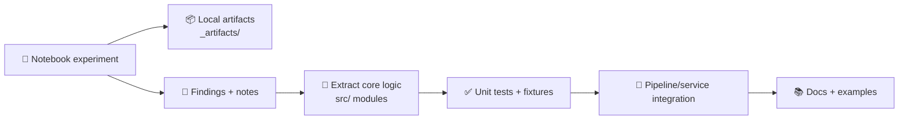

# 📓 Notebooks — Kansas Frontier Matrix System (KFM)


Welcome to the **KFM notebooks workspace** 🧭 — a practical lab for:
- 🧪 exploratory research & rapid prototyping  
- 🗺️ geospatial + remote sensing experiments  
- 📊 statistics, modeling, validation, and “don’t fool yourself” checks  
- 🤖 ML/AI baselines, agent-style decision logic, and model eval  
- 🌐 map/UI visualization spikes (Google Maps, WebGL)  
- 🧱 architecture proof-of-concepts before graduating into `src/` / services  

> ✅ **Rule of thumb:** notebooks are for exploration and learning.  
> 🏭 Anything that becomes “real” must **graduate** into pipelines/services, tests, and governed docs.

---

## 🧭 Quick navigation

- [Where this fits](#-where-this-fits-in-the-repo)
- [Folder layout](#-suggested-folder-layout)
- [Notebook tracks](#-notebook-tracks-what-to-expect)
- [Quick start](#-quick-start)
- [Conventions](#-notebook-conventions-kfm-standard)
- [Lifecycle: notebook → production](#-lifecycle-notebook--production)
- [Roadmap](#-notebook-roadmap-starter-set)
- [Data & ethics](#-data-licensing-and-ethics-notes)
- [Reference library](#-reference-library-all-project-pdfs)

---

## 🧭 Where this fits in the repo

- **Production code**: `src/` + `api/` (not here).
- **Notebooks**: sandbox + research journal with repeatable outputs.
- **Local artifacts**: export to `_artifacts/` (**gitignored**).
- **Evidence artifacts**: if an output becomes a dataset → move it to `data/processed/...` and catalog it (STAC/DCAT/PROV).

> [!IMPORTANT]
> If a notebook output influences decisions, it must become a **governed evidence artifact** (catalog + PROV), not a stray PNG in a notebook.

---

## 🗂️ Suggested folder layout

```text
📁 notebooks/
├─ 📄 README.md
├─ 📁 _templates/              🧩 notebook templates (EDA, modeling, mapping, report)
├─ 📁 _data/                   🚫 local-only datasets (gitignored)
├─ 📁 _artifacts/              📦 exported plots/tables/models (gitignored)
├─ 📁 _figures/                🖼️ committed figures used in docs
├─ 🧭 00_orientation/
├─ 🧰 01_tooling/
├─ 🗺️ 02_gis_core/
├─ 🛰️ 03_remote_sensing/
├─ 📊 04_stats/
├─ 🤖 05_ml_agents/
├─ 🧪 06_simulation_optimization/
├─ 🌐 07_web_mapping_viz/
├─ 🧬 08_language_tools/
└─ 🧠 09_human_factors/
```

---

## 🧩 Notebook Tracks (what to expect)

| Track | Folder | Focus |
|---|---|---|
| 🧭 Foundations | `00_orientation/` | KFM context, glossary, architecture |
| 🧰 Tooling | `01_tooling/` | Docker, DB, CLI workflows |
| 🗺️ GIS Core | `02_gis_core/` | vector/raster, CRS, geoprocessing |
| 🛰️ Remote Sensing | `03_remote_sensing/` | GEE pipelines, time-series, change detection |
| 📊 Statistics | `04_stats/` | EDA, regression, Bayesian, pitfalls |
| 🤖 ML + Agents | `05_ml_agents/` | baselines, eval, decision rules |
| 🧪 Simulation + Optimization | `06_simulation_optimization/` | validation, uncertainty, optimization |
| 🌐 Web Maps + Viz | `07_web_mapping_viz/` | cartography, WebGL spikes |
| 🧬 Language Tools | `08_language_tools/` | DSL sketches, parsers, ASTs |
| 🧠 Human Factors | `09_human_factors/` | ethics, autonomy, governance |

---

## 🚀 Quick start

### Option A — Local (fastest)
```bash
cd notebooks
python -m venv .venv
source .venv/bin/activate     # Windows: .venv\Scripts\activate
pip install -r requirements.txt
jupyter lab
```

### Option B — Docker (recommended) 🐳
```
docker compose up --build
```

> 🔐 Never bake secrets into images. Use `.env` + environment variables.

---

## ✅ Notebook conventions (KFM standard)

### 🏷️ Naming
Use a **two-digit prefix** + verb-first slug:
- `00_intro_kfm_context.ipynb`
- `02_vector_overlay_clip.ipynb`
- `03_gee_ndvi_timeseries.ipynb`

### 🧱 Standard notebook header (recommended)
Start every notebook with:
1) Purpose  
2) Inputs (sources + assumptions)  
3) Outputs (where artifacts go)  
4) Parameters cell (AOI, dates, EPSG, seeds)  
5) Environment cell (Python + library versions)

### 🧼 Repro checklist
- [ ] Parameters cell at top (AOI, EPSG, dates, seeds)
- [ ] Deterministic seeds recorded
- [ ] Environment recorded (`pip freeze` or lockfile)
- [ ] Outputs written to `_artifacts/` or `data/processed/...`
- [ ] Minimal output cells (save files instead)

---

## 🧬 Lifecycle: notebook → production



Graduation checklist 🏁
- [ ] Extract functions into `src/` (no notebook-only globals)
- [ ] Add tests
- [ ] Document contracts (schemas, CRS, expected columns)
- [ ] If evidence: store in `data/processed/...` + catalogs + PROV

---

## 🧪 Notebook roadmap (starter set)

- [ ] GIS basics + CRS reprojection
- [ ] GEE NDVI time-series + export
- [ ] Regression baselines + diagnostics
- [ ] Bayesian intro + uncertainty reporting
- [ ] Simulation validation + sensitivity analysis
- [ ] Web map overlay spike (MapLibre/WebGL)

---

## 🔐 Data, licensing, and ethics notes

- Don’t commit licensing-unclear PDFs or data publicly
- Treat all outputs as decision-influencing: document assumptions + uncertainty
- Redact sensitive fields and locations where required

---

## 📚 Reference library (all project PDFs)

> Recommended location: `docs/library/`  
> If paths differ, update links here.

See the full list in the root README: **[`../README.md`](../README.md)**
