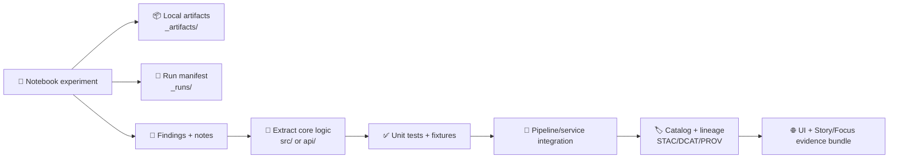

<!--
📌 Notebooks are KFM’s “lab bench”: exploration + prototypes + evidence drafts.
🗓️ Last reviewed: 2026-01-07
🔐 Reminder: outputs that influence decisions must become governed artifacts (catalog + provenance), not stray notebook outputs.
-->

# 📓 Notebooks — Kansas Frontier Matrix System (KFM)

<p align="left">
  
  
  
  
  
  
  
  
  
</p>

Welcome to the **KFM notebooks workspace** 🧭 — a practical lab for:

- 🧪 exploratory research & rapid prototyping  
- 🗺️ geospatial + remote sensing experiments  
- 📊 statistics, modeling, validation, and “don’t fool yourself” checks  
- 🤖 ML/AI baselines, agent-style decision logic, and model eval  
- 🌐 map/UI visualization spikes (responsive design, WebGL, map styling)  
- 🧱 architecture proof-of-concepts before graduating into `src/` / `api/` / pipelines  

> [!IMPORTANT]
> ✅ **Rule of thumb:** notebooks are for exploration and learning.  
> 🏭 Anything that becomes “real” must **graduate** into pipelines/services, tests, and governed docs (STAC/DCAT/PROV + classification).

---

## 🧭 Quick navigation

- [🧾 Doc metadata](#-doc-metadata)
- [Where this fits](#-where-this-fits-in-the-repo)
- [Folder layout](#-suggested-folder-layout)
- [Notebook tracks](#-notebook-tracks-what-to-expect)
- [Quick start](#-quick-start)
- [Conventions](#-notebook-conventions-kfm-standard)
- [Repro tiers](#-reproducibility-tiers-what-counts-as-real)
- [Lifecycle: notebook → production](#-lifecycle-notebook--production)
- [Testing notebooks](#-testing-notebooks-optional-but-powerful)
- [Data & ethics](#-data-licensing-and-ethics-notes)
- [Reference library](#-reference-library-all-project-files)

---

## 🧾 Doc metadata

| Field | Value |
|---|---|
| Folder | `notebooks/` |
| Role | 📓 Research + prototyping workspace (non-production) |
| Audience | analysts · researchers · maintainers · collaborators |
| Last updated | **2026-01-07** |
| Default output policy | `_artifacts/` + `_runs/` are **gitignored** |
| Evidence policy | any decision-influencing output must become **cataloged + provenance-linked** |

---

## 🧭 Where this fits in the repo

- ✅ **Production code:** `src/` and `api/` (not here).
- ✅ **Notebooks:** sandbox + research journal with repeatable outputs.
- ✅ **Local artifacts:** export to `_artifacts/` (**gitignored**).
- ✅ **Run manifests:** export to `_runs/` (**gitignored**) so you can reproduce.
- ✅ **Evidence artifacts:** if output becomes a dataset → move to `data/processed/...` and **catalog it** (STAC/DCAT/PROV).

> [!IMPORTANT]
> If a notebook output influences decisions, it must become a **governed evidence artifact** (catalog + PROV + classification), not a stray PNG saved inside a notebook cell.

---

## 🗂️ Suggested folder layout

> Keep this “boring & predictable” so collaborators can jump in fast. 🧭

```text
📁 notebooks/
├─ 📄 README.md
├─ 📁 _templates/               🧩 notebook templates (EDA, GIS, RS, modeling, sim, report)
├─ 📁 _data/                    🚫 local-only datasets (gitignored)
├─ 📁 _artifacts/               📦 exported plots/tables/models (gitignored)
├─ 📁 _runs/                    🧾 run manifests + params (gitignored)
├─ 📁 _figures/                 🖼️ committed figures used in docs (small + stable)
├─ 🧭 00_orientation/
├─ 🧰 01_tooling/
├─ 🗺️ 02_gis_core/
├─ 🛰️ 03_remote_sensing/
├─ 📊 04_stats/
├─ 🤖 05_ml_agents/
├─ 🧪 06_simulation_optimization/
├─ 🌐 07_web_mapping_viz/
├─ 🧬 08_language_tools/
└─ 🧠 09_human_factors/
```

> [!TIP]
> If a notebook starts depending on “real” infra (Postgres, graph, object store), capture it as a **run manifest** and use containers for reproducibility.

---

## 🧩 Notebook tracks (what to expect)

| Track | Folder | Focus | Typical outputs |
|---|---|---|---|
| 🧭 Foundations | `00_orientation/` | KFM context, glossary, architecture, system invariants | notes + diagrams |
| 🧰 Tooling | `01_tooling/` | env setup, Docker workflows, reproducible runs | run manifests |
| 🗺️ GIS Core | `02_gis_core/` | vector/raster ops, CRS sanity, geoprocessing | GeoJSON, GeoPackage, small COG |
| 🛰️ Remote Sensing | `03_remote_sensing/` | time-series, composites, change detection, export patterns | STAC items + quicklooks |
| 📊 Statistics | `04_stats/` | EDA, regression, Bayes, experimental design | metrics + diagnostics |
| 🤖 ML + Agents | `05_ml_agents/` | baselines, eval, decision logic (human-in-loop) | model artifacts + eval tables |
| 🧪 Simulation + Optimization | `06_simulation_optimization/` | V&V, uncertainty, sensitivity, optimization | run bundles + checks |
| 🌐 Web Maps + Viz | `07_web_mapping_viz/` | cartography, responsive UI spikes, WebGL | small assets + demos |
| 🧬 Language Tools | `08_language_tools/` | DSL sketches, parsers, ASTs, schema ideas | schemas + mini compilers |
| 🧠 Human Factors | `09_human_factors/` | ethics, autonomy, governance, policy notes | decision memos |

---

## 🚀 Quick start

### Option A — Local (fastest) ⚡
```bash
cd notebooks
python -m venv .venv
source .venv/bin/activate     # Windows: .venv\Scripts\activate
pip install -r requirements.txt
jupyter lab
```

### Option B — Docker (recommended) 🐳
```bash
docker compose up --build
```

> [!CAUTION]
> 🔐 Never bake secrets into images. Use `.env` + environment variables and keep `.env` out of git.

---

## ✅ Notebook conventions (KFM standard)

### 🏷️ Naming
Use a **two-digit prefix** + verb-first slug:

- `00_intro_kfm_context.ipynb`
- `02_vector_overlay_clip.ipynb`
- `03_gee_ndvi_timeseries.ipynb`
- `04_regression_baseline_diagnostics.ipynb`
- `06_simulation_sensitivity_sweep.ipynb`

### 🧱 Standard notebook header (required for shareable work)
Start every notebook with:

1) 🎯 **Purpose** (what question are we answering?)  
2) 📥 **Inputs** (datasets, sources, assumptions, classification)  
3) 📤 **Outputs** (where artifacts will be written)  
4) 🎛️ **Parameters cell** (AOI, dates, EPSG, seeds, thresholds)  
5) 🧰 **Environment cell** (Python + library versions; optional `pip freeze`)  

> [!TIP]
> If you can’t list inputs/assumptions, the notebook is still “scratch mode.” That’s okay — just don’t ship it.

### 🧾 Run manifest (highly recommended)
For any notebook that produces outputs worth keeping, write a run manifest to `_runs/`.

**Suggested file:** `_runs/<notebook_slug>/<timestamp>/run.manifest.json`

Minimal example:
```json
{
  "run_id": "kfm.nb.03_gee_ndvi_timeseries.2026-01-07T12:00:00Z",
  "notebook": "03_remote_sensing/03_gee_ndvi_timeseries.ipynb",
  "params": {
    "aoi": "ks_bbox",
    "start": "2020-01-01",
    "end": "2020-12-31",
    "epsg": "EPSG:4326",
    "seed": 42
  },
  "inputs": [
    { "type": "catalog", "id": "stac://kfm.sentinel2.collection", "classification": "public" }
  ],
  "outputs": [
    { "type": "plot", "path": "_artifacts/ndvi_timeseries.png" },
    { "type": "stac_item", "path": "_artifacts/stac/item.json" }
  ],
  "warnings": []
}
```

### 🧼 Repro checklist ✅
- [ ] Parameters cell at top (AOI, EPSG, dates, seeds)
- [ ] Deterministic seeds recorded
- [ ] Environment captured (lockfile or snapshot)
- [ ] Outputs written to `_artifacts/` or promoted to `data/processed/...`
- [ ] Minimal output cells (save files instead of huge inline output)
- [ ] No secrets (tokens/keys) in cells, outputs, or logs

---

## 🧭 Reproducibility tiers (what counts as “real”)

KFM notebooks move through tiers. This prevents “looks cool” from becoming “trusted.”

| Tier | Name | Allowed behavior | Not allowed |
|---|---|---|---|
| 🟠 Tier 0 | Scratch | quick exploration, messy cells | decision claims, publishing |
| 🟡 Tier 1 | Shareable | header + params + basic outputs | hidden inputs, unclear licenses |
| 🟢 Tier 2 | Evidence-ready | run manifest + stable outputs + provenance pointers | “mystery data” or unlabeled derivations |
| 🔵 Tier 3 | Productionized | logic moved to `src/`/`api/` + tests + catalogs | notebook-only business logic |

> [!IMPORTANT]
> Any Tier 2+ output should be **traceable**: inputs → transforms → outputs.

---

## 🧬 Lifecycle: notebook → production



🏁 Graduation checklist
- [ ] Extract functions into `src/` (no notebook-only globals)
- [ ] Add tests (unit + contract/integration as needed)
- [ ] Document contracts (schemas, CRS, expected columns)
- [ ] If evidence: store in `data/processed/...` + catalogs + PROV
- [ ] Confirm classification & redaction are correct

---

## 🧪 Testing notebooks (optional but powerful)

If notebooks become “semi-production” (Tier 2+), consider:

- ✅ **Smoke-run** critical notebooks automatically (parameterized)  
- ✅ Assert outputs exist and meet basic schema expectations  
- ✅ Fail fast on silent drift (CRS mismatch, missing columns, empty exports)

> [!TIP]
> Notebook tests should validate **contracts**, not pixel-perfect plots.

---

## 🔐 Data, licensing, and ethics notes

- 📜 Don’t commit licensing-unclear data or documents publicly
- 🔒 Treat outputs as decision-influencing: document assumptions + uncertainty
- 🧷 Redact sensitive fields/locations when required
- 🧠 Avoid “automation complacency”: ML outputs should be labeled as model-assisted and provenance-linked
- 🧰 Keep secrets out of notebooks (tokens, internal endpoints, credentials)

---

## 📚 Reference library (all project files)

> This section explicitly includes **every project file** and shows how each one informs notebook practice and templates.  
> Recommended canonical location for large references: `docs/library/` (paths may vary).

<details>
<summary><strong>🧭 Core system vision & roadmap</strong></summary>

- 📄 **Kansas Frontier Matrix (KFM) – Comprehensive Engineering Design.docx** — KFM invariants, pipeline order, architecture boundaries, governance-as-design  
- 📄 **Latest Ideas.docx** — near-term experiments, prototypes to prioritize, “what to try next” notebooks  
- 📄 **Data Spaces.pdf** — data interoperability, pointer-over-payload mindset, catalog-first thinking for cross-system integration  

</details>

<details>
<summary><strong>🗺️ GIS, cartography & mobile mapping</strong></summary>

- 📄 **python-geospatial-analysis-cookbook.pdf** — CRS discipline, vector/raster workflows, PostGIS-friendly patterns  
- 📄 **making-maps-a-visual-guide-to-map-design-for-gis.pdf** — map design clarity, symbology intent, “don’t mislead with ramps”  
- 📄 **Mobile Mapping_ Space, Cartography and the Digital - 9789048535217.pdf** — mobile/offline context, map meaning in constrained environments  

</details>

<details>
<summary><strong>🛰️ Remote sensing & Earth observation</strong></summary>

- 📄 **Cloud-Based Remote Sensing with Google Earth Engine-Fundamentals and Applications.pdf** — GEE-style workflows, time-series, compositing, export and reproducibility patterns  

</details>

<details>
<summary><strong>📊 Statistics, EDA, regression & Bayesian reasoning</strong></summary>

- 📄 **Understanding Statistics & Experimental Design.pdf** — experimental design discipline, assumptions, bias awareness  
- 📄 **graphical-data-analysis-with-r.pdf** — EDA plots/diagnostics, “look at your data” practice  
- 📄 **regression-analysis-with-python.pdf** — regression workflows, diagnostics, interpretation guardrails  
- 📄 **Regression analysis using Python - slides-linear-regression.pdf** — quick baselines, consistent regression reporting shape  
- 📄 **think-bayes-bayesian-statistics-in-python.pdf** — Bayesian intuition, priors/posteriors, credible intervals, uncertainty reporting  

</details>

<details>
<summary><strong>🧪 Simulation, verification & optimization</strong></summary>

- 📄 **Scientific Modeling and Simulation_ A Comprehensive NASA-Grade Guide.pdf** — V&V mindset, reproducible simulation runs, sensitivity analysis discipline  
- 📄 **Generalized Topology Optimization for Structural Design.pdf** — optimization patterns, objective/constraint clarity, artifact capture  

</details>

<details>
<summary><strong>🕸️ Graphs, networks & structure</strong></summary>

- 📄 **Spectral Geometry of Graphs.pdf** — graph metrics, structure-aware reasoning, careful interpretation of graph-derived outputs  

</details>

<details>
<summary><strong>🗄️ Data management & scalability</strong></summary>

- 📄 **PostgreSQL Notes for Professionals - PostgreSQLNotesForProfessionals.pdf** — SQL hygiene, schema discipline, repeatable queries  
- 📄 **Scalable Data Management for Future Hardware.pdf** — scalability thinking, avoid unbounded reads, incremental/streamed processing defaults  

</details>

<details>
<summary><strong>🌐 Web mapping, WebGL & media optimization</strong></summary>

- 📄 **responsive-web-design-with-html5-and-css3.pdf** — responsive mindset, performance budgets, front-end constraints that influence notebook exports  
- 📄 **webgl-programming-guide-interactive-3d-graphics-programming-with-webgl.pdf** — coordinate sanity, rendering fundamentals for WebGL spikes  
- 📄 **compressed-image-file-formats-jpeg-png-gif-xbm-bmp.pdf** — choosing image formats for quicklooks/figures and keeping repo bloat under control  

</details>

<details>
<summary><strong>🤖 ML, agents & AI governance</strong></summary>

- 📄 **Deep Learning for Coders with fastai and PyTorch - Deep.Learning.for.Coders.with.fastai.and.PyTorchpdf** — practical ML baselines, training/eval hygiene, artifact-first workflows  
- 📄 **On the path to AI Law’s prophecies and the conceptual foundations of the machine learning age.pdf** — governance and audit posture for ML outputs, labeling and accountability  

</details>

<details>
<summary><strong>🛡️ Security, adversarial thinking & concurrency</strong></summary>

- 📄 **ethical-hacking-and-countermeasures-secure-network-infrastructures.pdf** — “assume hostile inputs,” safe ops, network boundaries  
- 📄 **Gray Hat Python - Python Programming for Hackers and Reverse Engineers (2009).pdf** — defensive mindset, parsing risk awareness, avoid executing untrusted payloads  
- 📄 **concurrent-real-time-and-distributed-programming-in-java-threads-rtsj-and-rmi.pdf** — concurrency discipline, job orchestration expectations, backpressure thinking  

</details>

<details>
<summary><strong>🧠 Human factors, autonomy & digital humanism</strong></summary>

- 📄 **Introduction to Digital Humanism.pdf** — human-centered governance: privacy, sovereignty, accountability  
- 📄 **Principles of Biological Autonomy - book_9780262381833.pdf** — systems/feedback metaphors for pipelines, closure, stability in complex workflows  

</details>

<details>
<summary><strong>📚 Programming shelves (multi-language reference packs)</strong></summary>

> Use these as “just-in-time” references when notebook work crosses into DSLs, tooling, parsers, performance, or new ecosystems.

- 📄 **A programming Books.pdf**  
- 📄 **B-C programming Books.pdf**  
- 📄 **D-E programming Books.pdf**  
- 📄 **F-H programming Books.pdf**  
- 📄 **I-L programming Books.pdf**  
- 📄 **M-N programming Books.pdf**  
- 📄 **O-R programming Books.pdf**  
- 📄 **S-T programming Books.pdf**  
- 📄 **U-X programming Books.pdf**  

</details>

---

## 🧭 Final reminder

🧪 Explore fast.  
🧾 Record assumptions.  
🏷️ Promote evidence properly.  
🛡️ Keep it governed.