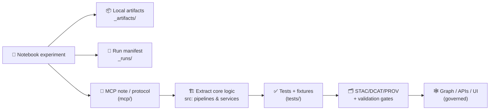

<!--
📌 Notebooks are KFM’s “lab bench”: exploration + prototypes + evidence drafts.
🗓️ Last updated: 2026-01-11
🔁 Review cycle: 90 days (or anytime staging/catalog/story workflows change)
🔐 Reminder: anything that influences decisions must become a governed artifact (catalog + provenance),
    not a stray notebook output. No catalog → no graph → no API → no UI.
-->

<div align="center">

# 📓 Notebooks — Kansas Frontier Matrix (KFM)

**Exploration with receipts. Prototypes with guardrails. Evidence with governance.** 🧾🧪🗺️🧬  
_Notebooks help us think fast — KFM helps us ship truthfully._


</div>

> [!IMPORTANT]
> ✅ Notebooks are for exploration and learning.  
> 🏛️ Anything that becomes “real” must **graduate** into canonical code + tests + governed artifacts:
>
> **ETL → STAC/DCAT/PROV → Graph → APIs → UI → Story Nodes → Focus Mode** 🧱🗂️🧬

---

<details>
<summary><b>🧭 Table of contents</b></summary>

- [🔗 Quick links](#-quick-links)
- [🧾 Doc metadata](#-doc-metadata)
- [🧭 Where notebooks fit](#-where-notebooks-fit)
- [🧨 Notebook non-negotiables](#-notebook-non-negotiables)
- [🗂️ Suggested folder layout](#️-suggested-folder-layout)
- [🧩 Notebook tracks](#-notebook-tracks)
- [🚀 Quick start](#-quick-start)
- [✅ Notebook conventions](#-notebook-conventions-kfm-standard)
- [🧾 Run manifests](#-run-manifests-highly-recommended)
- [🧬 Evidence artifacts & promotion](#-evidence-artifacts--promotion)
- [🧪 Testing notebooks](#-testing-notebooks-optional-but-powerful)
- [🔐 Data, licensing, governance & ethics](#-data-licensing-governance--ethics)
- [📌 “Make it citable” (research UX)](#-make-it-citable-research-ux)
- [📚 Reference library](#-reference-library-all-project-files)
- [🕰️ Version history](#️-version-history)

</details>

---

## 🔗 Quick links

- 🧭 Repo overview: `../README.md`
- 🧩 Executable boundary: `../src/README.md` *(if present)*
- 📦 Data + metadata boundary: `../data/README.md` *(if present)*
- 🧰 Toolchain + validators: `../tools/README.md`
- 🧰 Automation wrappers: `../scripts/README.md`
- 🧪 Tests + CI gates: `../tests/README.md`
- 📓 MCP (protocols + runs + model cards): `../mcp/README.md` *(canonical receipts)*
- 🧾 Story Nodes (governed narratives): `../docs/reports/story_nodes/` *(draft → published, if present)*

---

## 🧾 Doc metadata

| Field | Value |
|---|---|
| Folder | `notebooks/` |
| Role | 📓 lab bench (exploration, prototypes, drafts) |
| Audience | analysts · researchers · maintainers · collaborators |
| Status | Active ✅ |
| Version | **v1.3.0** |
| Last updated | **2026-01-11** |
| Default output policy | `_artifacts/` + `_runs/` + `_data/` are **gitignored** |
| Evidence policy | decision-influencing outputs must become **cataloged + provenance-linked** |
| Canonical order | **ETL → STAC/DCAT/PROV → Graph → APIs → UI → Story → Focus** |

---

## 🧭 Where notebooks fit

Think of the repo like a **scientific instrument** with a governed “output chain” 🧪➡️🧾:

- 🏗️ **Production code** → `src/` (and `src/server/` or `api/` if present)  
- 🧰 **Governed tools** → `tools/` (validators, catalog QA, provenance helpers)  
- 🧰 **Orchestration glue** → `scripts/` (thin wrappers; safe-by-default)  
- 🧪 **Tests** → `tests/` (contracts + determinism + integration)  
- 📓 **Receipts & methods** → `mcp/` (protocols, run receipts, model cards)  
- 📓 **Notebooks** → `notebooks/` (this folder): rapid exploration, drafts, spikes

> [!NOTE]
> In the v13 layout, **MCP is the canonical home for “Methods & Computational Experiments”** (runs, notebooks, model cards).  
> This `notebooks/` folder remains a practical workspace — but **anything decision-relevant should be linked into MCP** (or moved into an MCP-tracked structure) so it has durable receipts. 🧾✅

---

## 🧨 Notebook non-negotiables

These are boring on purpose. Boring = reproducible. 😌✅

1) 🔐 **No secrets** in notebooks, outputs, or logs (tokens, internal URLs, credentials).  
2) 🧾 **No evidence without receipts**: if it matters, write a run manifest and/or MCP run receipt.  
3) 🗂️ **No “published-looking” files** created outside the governed pipeline.  
4) 🧬 **If you create an evidence artifact** (model output, derived layer, OCR corpus), treat it like a dataset:
   - store properly (eventually `data/processed/**`)
   - catalog it (STAC/DCAT)
   - trace it (PROV)
5) 🧱 **Respect the ordering:** ETL → catalogs → graph → APIs → UI → story → focus  
6) 🧪 **Determinism preferred**: record seeds, stable sorts, pinned versions where feasible.  
7) 🧯 **Hostile-input mindset**: assume files can be malicious (archives, rasters, JSON, PDFs). Validate + limit.  
8) 📦 **Keep notebooks light**: avoid committing huge outputs; save artifacts to `_artifacts/`.  
9) 📜 **Licensing + attribution is not optional**: record source + license in header/manifest.  
10) 🧠 **Be honest about uncertainty**: include checks, diagnostics, and caveats in conclusions.

---

## 🗂️ Suggested folder layout

Keep this predictable so collaborators can jump in fast 🧭:

```text
📓 notebooks/
├─ 📘 README.md
├─ 🧩 _templates/                # 📄 notebook templates (EDA, GIS, RS, modeling, sim, report)
├─ 🚫 _data/                     # 🧺 local-only datasets (gitignored)
├─ 📦 _artifacts/                # 📎 exported plots/tables/models (gitignored)
├─ 🧾 _runs/                     # 🧾 run manifests + params (gitignored)
├─ 🖼️ _figures/                  # 🖼️ small committed figures used in docs (stable + tiny)
├─ 🧭 00_orientation/            # glossary, invariants, “how KFM works”
├─ 🧰 01_tooling/                # env, Docker, reproducibility helpers
├─ 🗺️ 02_gis_core/               # CRS, overlays, vector/raster workflows
├─ 🛰️ 03_remote_sensing/         # EO/GEE, composites, change detection
├─ 📊 04_stats/                  # EDA, regression, Bayes, inference checks
├─ 🤖 05_ml_agents/              # baselines, eval, decision logic (human-in-loop)
├─ 🧪 06_simulation_optimization/ # V&V, sensitivity, optimization runs
├─ 🌐 07_web_mapping_viz/         # map styles, responsive/UI spikes, WebGL demos
├─ 🧬 08_language_tools/          # schema/DSL sketches, parsing experiments
└─ 🧠 09_human_factors/           # governance, ethics, human-centered notes
```

### 🧷 Recommended `.gitignore` additions
```gitignore
# notebooks: keep the repo light 🪶
notebooks/_data/
notebooks/_artifacts/
notebooks/_runs/
notebooks/**/.ipynb_checkpoints/
```

> [!TIP]
> If a notebook depends on real infra (PostGIS/Neo4j/object storage), capture it in a run manifest and prefer containers for reproducibility. 🐳✅

---

## 🧩 Notebook tracks

| Track | Folder | Focus | Typical outputs |
|---|---|---|---|
| 🧭 Foundations | `00_orientation/` | KFM context, glossary, invariants | notes + diagrams |
| 🧰 Tooling | `01_tooling/` | env setup, Docker workflows, reproducible runs | run manifests |
| 🗺️ GIS Core | `02_gis_core/` | CRS hygiene, overlays, IO round-trips | small vectors/rasters |
| 🛰️ Remote Sensing | `03_remote_sensing/` | time-series, composites, change detection | quicklooks + draft STAC |
| 📊 Statistics | `04_stats/` | EDA, regression, Bayes, experimental design discipline | diagnostics + metrics |
| 🤖 ML + Agents | `05_ml_agents/` | baselines, eval, decision logic | eval tables + draft model cards |
| 🧪 Simulation + Optimization | `06_simulation_optimization/` | V&V, UQ, sensitivity sweeps | run bundles + checks |
| 🌐 Web Maps + Viz | `07_web_mapping_viz/` | cartography, UI spikes, WebGL | small assets + demos |
| 🧬 Language Tools | `08_language_tools/` | schema ideas, parsers, DSL sketches | schemas + mini-compilers |
| 🧠 Human Factors | `09_human_factors/` | governance, ethics, autonomy notes | decision memos |

---

## 🚀 Quick start

### Option A — Local (fastest) ⚡
```bash
cd notebooks
python -m venv .venv
source .venv/bin/activate     # Windows: .venv\Scripts\activate
pip install -r requirements.txt
jupyter lab
```

### Option B — Docker (recommended) 🐳
```bash
docker compose up --build
```

> [!CAUTION]
> 🔐 Never bake secrets into images. Use `.env` + environment variables and keep `.env` out of git.

### Option C — Repro runs (parameterized) 🧾
If you want repeatable notebook runs, prefer an execution wrapper:
- `papermill` (parameter injection + output notebook)
- `jupyter nbconvert --execute` (scriptable execution)

> If you add a notebook that becomes Tier 2+ (see below), consider adding a “runner” script under `scripts/` so CI can execute it safely. 🧰✅

---

## ✅ Notebook conventions (KFM standard)

### 🏷️ Naming (boring & sortable)
Use a **two-digit prefix** + **verb-first slug**:

- `00_intro_kfm_context.ipynb`
- `02_vector_overlay_clip.ipynb`
- `03_gee_ndvi_timeseries.ipynb`
- `04_regression_baseline_diagnostics.ipynb`
- `06_simulation_sensitivity_sweep.ipynb`

### 🧱 Standard notebook header (required for shareable work)
Start every notebook with a “contract header” (first cell, Markdown):

1) 🎯 **Purpose** — what question are we answering?  
2) 📥 **Inputs** — dataset IDs or sources, licenses, classification  
3) 📤 **Outputs** — where artifacts will be written (`_artifacts/` by default)  
4) 🎛️ **Parameters** — AOI, dates, EPSG, seeds, thresholds  
5) 🧰 **Environment** — key versions (and optional lock snapshot)

Template snippet:
```markdown
## 🧾 Notebook Contract

- **Purpose:** …
- **Primary question:** …
- **Inputs (IDs / sources):**
  - …
- **Licenses / attribution:** …
- **Classification:** public | restricted | (per repo policy)
- **Outputs:**
  - `_artifacts/...`
  - `_runs/...`
- **Parameters:**
  - AOI: …
  - Time window: …
  - EPSG: …
  - Seed: …
- **Environment:**
  - Python: …
  - Key libs: …
```

### ✂️ Keep notebooks diff-friendly (recommended)
- avoid giant embedded outputs (save files to `_artifacts/`)
- clear noisy outputs before committing (or use output-stripping tooling)
- stable ordering: sort keys, deterministic joins, fixed random seeds

> [!TIP]
> If you can’t list inputs/assumptions, the notebook is still “scratch mode.” That’s fine — just don’t ship it. 🧠✅

---

## 🧾 Run manifests (highly recommended)

For any notebook producing outputs worth keeping, write a run manifest to `_runs/`.

**Suggested path:** `_runs/<notebook_slug>/<timestamp>/run.manifest.json`

Minimal example:
```json
{
  "run_id": "kfm.nb.03_gee_ndvi_timeseries.2026-01-11T12:00:00Z",
  "notebook": "03_remote_sensing/03_gee_ndvi_timeseries.ipynb",
  "git": { "sha": "UNKNOWN", "dirty": true },
  "params": {
    "aoi": "ks_bbox",
    "start": "2020-01-01",
    "end": "2020-12-31",
    "epsg": "EPSG:4326",
    "seed": 42
  },
  "inputs": [
    { "type": "catalog", "id": "stac://<collection_or_item_id>", "license": "…", "classification": "public" }
  ],
  "outputs": [
    { "type": "plot", "path": "_artifacts/ndvi_timeseries.png" },
    { "type": "draft_stac_item", "path": "_artifacts/stac/item.json" }
  ],
  "checks": [
    { "name": "ndvi_range", "status": "pass", "details": "min=-0.12 max=0.74" }
  ],
  "warnings": []
}
```

### 🧼 Repro checklist ✅
- [ ] Parameters cell at top (AOI, EPSG, dates, seeds)
- [ ] Deterministic seeds recorded (if stochastic)
- [ ] Environment captured (requirements/lockfile or snapshot)
- [ ] Outputs written to `_artifacts/` (gitignored) **or** promoted to `data/processed/...`
- [ ] No secrets/tokens/internal endpoints in cells, outputs, or logs

---

## 🧬 Evidence artifacts & promotion

KFM treats analysis outputs (including AI-derived outputs) as **first-class evidence artifacts** when they matter. That means they must follow the same governed lifecycle as “regular” datasets 🧾🗂️:

### ✅ Promotion rule of thumb
If someone could cite your notebook output in a memo, map, story, or decision — it’s evidence.

### 🪜 Reproducibility tiers (what counts as “real”)
| Tier | Name | Allowed behavior | Not allowed |
|---|---|---|---|
| 🟠 Tier 0 | Scratch | quick exploration, messy cells | decision claims, publishing |
| 🟡 Tier 1 | Shareable | header + params + basic outputs | hidden inputs, unclear licenses |
| 🟢 Tier 2 | Evidence-ready | run manifest + stable outputs + provenance pointers | mystery data, unlabeled derivations |
| 🔵 Tier 3 | Productionized | logic moved to `src/` + tests + catalogs | notebook-only business logic |

> [!IMPORTANT]
> Any Tier 2+ output must be traceable: **inputs → transforms → outputs → catalogs → provenance** 🧾🧬

### 🧬 Lifecycle: notebook → production


🏁 Graduation checklist
- [ ] Extract functions into `src/` (no notebook-only globals)
- [ ] Add tests (unit + integration/contract as needed)
- [ ] Define/validate contracts (schemas, CRS, expected columns)
- [ ] If evidence: store in `data/processed/...` + STAC/DCAT + PROV
- [ ] Confirm classification & redaction are correct (no silent downgrade)

---

## 🧪 Testing notebooks (optional but powerful)

If notebooks become Tier 2+, consider:
- ✅ smoke-running critical notebooks automatically (parameterized)
- ✅ asserting outputs exist and meet schema expectations
- ✅ failing fast on silent drift (CRS mismatch, missing columns, empty exports)

Suggested approaches:
- `nbconvert --execute` on a tiny fixture config
- `pytest` + “notebook runner” wrappers (prefer deterministic, small IO)
- `nbval`-style testing (great for contract checks; avoid pixel-perfect expectations)

> [!TIP]
> Notebook tests should validate **contracts** and **invariants**, not pixel-perfect plots. 🧠✅

---

## 🔐 Data, licensing, governance & ethics

### 📜 Licensing & attribution
- Don’t use or publish data with unclear licensing.
- Record source + license in the header and run manifest.
- If you create a derived artifact, carry attribution forward (inputs → outputs).

### 🪶 Governance & “no downgrade”
- Outputs cannot be **less restricted** than inputs unless a reviewed redaction step exists.
- If sensitivity is unknown, default to **restricted** until reviewed.

### 🧯 Security posture (defensive)
- Treat inputs as hostile (archives, rasters, JSON, PDFs).
- Validate types, enforce size limits, avoid unsafe shell calls.
- Never log secrets; avoid embedding access tokens or internal endpoints.

### 🤖 AI involvement (label it)
If you use AI-assisted generation (summaries, labels, model output):
- label the involvement (what + where)
- record the tool/model/version/config when permissible
- treat outputs as advisory unless promoted through governed pipeline

---

## 📌 “Make it citable” (research UX)

To support academic / workshop usage (without sacrificing governance):
- add `CITATION.cff` (software citation)
- consider versioned snapshot releases + DOIs for curated datasets
- explore Binder/JupyterHub launch paths for **example notebooks** (public-safe only)

> [!NOTE]
> One-click notebook launches should only expose **public** datasets/examples and should still point back to STAC/DCAT/PROV for traceability.

---

## 📚 Reference library (all project files)

These files shape notebook templates, sanity checks, and how we reason about uncertainty, maps, systems, and governance. 🧠🧾

<details>
<summary><strong>🏛️ Core KFM design, repo discipline, and governed ordering</strong></summary>

- 📄 `Kansas Frontier Matrix (KFM) – Comprehensive Technical Documentation.docx`
- 📄 `MARKDOWN_GUIDE_v13.md.gdoc`
- 📄 `Scientific Method _ Research _ Master Coder Protocol Documentation.pdf`
- 📄 `Kansas-Frontier-Matrix Design Audit – Gaps and Enhancement Opportunities.pdf`

</details>

<details>
<summary><strong>🛰️ Remote sensing & Earth observation</strong></summary>

- 📄 `Cloud-Based Remote Sensing with Google Earth Engine-Fundamentals and Applications.pdf`

</details>

<details>
<summary><strong>🗺️ GIS, cartography, and mapping UX</strong></summary>

- 📄 `python-geospatial-analysis-cookbook.pdf`
- 📄 `making-maps-a-visual-guide-to-map-design-for-gis.pdf`
- 📄 `Mobile Mapping_ Space, Cartography and the Digital - 9789048535217.pdf`

</details>

<details>
<summary><strong>📊 Statistics, EDA, regression & Bayesian reasoning</strong></summary>

- 📄 `Understanding Statistics & Experimental Design.pdf`
- 📄 `graphical-data-analysis-with-r.pdf`
- 📄 `regression-analysis-with-python.pdf`
- 📄 `Regression analysis using Python - slides-linear-regression.pdf`
- 📄 `think-bayes-bayesian-statistics-in-python.pdf`

</details>

<details>
<summary><strong>🧪 Simulation, verification & optimization</strong></summary>

- 📄 `Scientific Modeling and Simulation_ A Comprehensive NASA-Grade Guide.pdf`
- 📄 `Generalized Topology Optimization for Structural Design.pdf`

</details>

<details>
<summary><strong>🕸️ Graphs & structure</strong></summary>

- 📄 `Spectral Geometry of Graphs.pdf`

</details>

<details>
<summary><strong>🗄️ Data systems & scaling</strong></summary>

- 📄 `PostgreSQL Notes for Professionals - PostgreSQLNotesForProfessionals.pdf`
- 📄 `Scalable Data Management for Future Hardware.pdf`
- 📄 `Data Spaces.pdf`

</details>

<details>
<summary><strong>🌐 Web, WebGL, and media correctness</strong></summary>

- 📄 `responsive-web-design-with-html5-and-css3.pdf`
- 📄 `webgl-programming-guide-interactive-3d-graphics-programming-with-webgl.pdf`
- 📄 `compressed-image-file-formats-jpeg-png-gif-xbm-bmp.pdf`

</details>

<details>
<summary><strong>🤖 ML practice & AI governance</strong></summary>

- 📄 `Deep Learning for Coders with fastai and PyTorch - Deep.Learning.for.Coders.with.fastai.and.PyTorchpdf`
- 📄 `On the path to AI Law’s prophecies and the conceptual foundations of the machine learning age.pdf`

</details>

<details>
<summary><strong>🛡️ Security, adversarial thinking & concurrency</strong></summary>

- 📄 `ethical-hacking-and-countermeasures-secure-network-infrastructures.pdf`
- 📄 `Gray Hat Python - Python Programming for Hackers and Reverse Engineers (2009).pdf`
- 📄 `concurrent-real-time-and-distributed-programming-in-java-threads-rtsj-and-rmi.pdf`

</details>

<details>
<summary><strong>🧠 Human factors & systems thinking</strong></summary>

- 📄 `Introduction to Digital Humanism.pdf`
- 📄 `Principles of Biological Autonomy - book_9780262381833.pdf`

</details>

<details>
<summary><strong>📚 Programming reference shelves</strong></summary>

- 📄 `A programming Books.pdf`
- 📄 `B-C programming Books.pdf`
- 📄 `D-E programming Books.pdf`
- 📄 `F-H programming Books.pdf`
- 📄 `I-L programming Books.pdf`
- 📄 `M-N programming Books.pdf`
- 📄 `O-R programming Books.pdf`
- 📄 `S-T programming Books.pdf`
- 📄 `U-X programming Books.pdf`

</details>

---

## 🕰️ Version history

| Version | Date | Summary | Author |
|---:|---|---|---|
| v1.3.0 | 2026-01-11 | Aligned notebooks with v13 governed layout + MCP receipts; clarified non-negotiables, promotion rules for evidence artifacts, story-node location, and “make it citable” research UX; tightened safety + hostile-input posture and added a recommended `.gitignore` snippet. | KFM Engineering |
| v1.2.0 | 2026-01-09 | Updated repo boundary links, standardized pipeline order framing, added emoji folder map, clarified run manifests + tiers + graduation checklist, and enumerated project reference files. | KFM Engineering |
| v1.1.0 | 2026-01-07 | Prior iteration: notebook lab-bench framing, track layout, run manifest pattern, graduation rules. | KFM Engineering |

---

<div align="center">

🧪 Explore fast. · 🧾 Record assumptions. · 🏷️ Promote evidence properly. · 🛡️ Keep it governed. ✅

</div>
