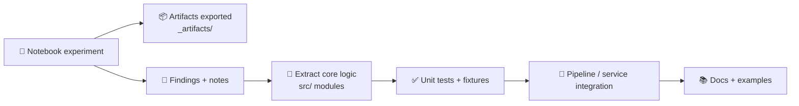

# 📓 Notebooks — Kansas Frontier Matrix System (KFM)


Welcome to the **KFM notebooks workspace** 🧭 — a practical lab for:
- 🧪 exploratory research & rapid prototyping  
- 🗺️ geospatial + remote sensing experiments  
- 📊 statistics, modeling, validation, and “don’t fool yourself” checks  
- 🤖 ML/AI baselines, agent-style decision logic, and model eval  
- 🌐 map/UI visualization spikes (Google Maps, WebGL)  
- 🧱 architecture proof-of-concepts before graduating into `src/` / services  

> ✅ **Rule of thumb:** notebooks are for *learning, exploration, and reproducible experiments*.  
> 🏭 Anything that becomes “real” must **graduate** into production modules, tests, pipelines, and docs.

---

## 🧭 Quick navigation

- [Where this fits](#-where-this-fits-in-the-repo)
- [Folder layout](#-suggested-folder-layout)
- [Notebook tracks](#-notebook-tracks-what-to-expect)
- [Quick start](#-quick-start)
- [Conventions](#-notebook-conventions-kfm-standard)
- [Lifecycle: notebook → production](#-lifecycle-notebook--production)
- [Roadmap](#-notebook-roadmap-starter-set)
- [Data & ethics](#-data-licensing-and-ethics-notes)
- [Reference library](#-reference-library-all-project-pdfs)

---

## 🧭 Where this fits in the repo

- **Production code**: lives in `src/` / services (not here).
- **Notebooks**: the *sandbox + research journal* with repeatable outputs.
- **Artifacts**: notebooks should export clean outputs into an `_artifacts/`-style folder (**gitignored**).
- **Figures for docs**: commit only “final” figures into `_figures/`.

> 🧠 If it can break prod, it doesn’t belong here.  
> 📦 If it’s valuable, repeatable, and stable → ship it to `src/`.

---

## 🗂️ Suggested folder layout

```text
📁 notebooks/
├─ 📄 README.md
├─ 📁 _templates/              🧩 notebook templates (EDA, modeling, mapping, report)
├─ 📁 _data/                   🚫 local-only datasets (gitignored)
├─ 📁 _artifacts/              📦 exported plots/tables/models (gitignored)
├─ 📁 _figures/                🖼️ committed figures used in docs
├─ 🧭 00_orientation/
├─ 🧰 01_tooling/
├─ 🗺️ 02_gis_core/
├─ 🛰️ 03_remote_sensing/
├─ 📊 04_stats/
├─ 🤖 05_ml_agents/
├─ 🧪 06_simulation_optimization/
├─ 🌐 07_web_mapping_viz/
├─ 🧬 08_language_tools/
└─ 🧠 09_human_factors/
```

<details>
<summary>🧹 Recommended <code>.gitignore</code> snippets for <code>notebooks/</code></summary>

```gitignore
# local data + outputs
notebooks/_data/
notebooks/_artifacts/

# local envs
notebooks/.venv/
notebooks/.ipynb_checkpoints/

# optional: large local caches
notebooks/**/.cache/
```
</details>

---

## 🧩 Notebook Tracks (what to expect)

| Track | Folder | Focus | Reference anchors 📚 |
|---|---|---|---|
| 🧭 Foundations | `00_orientation/` | KFM context, architecture, glossary, “how we work” | KFM Technical Docs • Clean Architecture • Digital Humanism |
| 🧰 Tooling | `01_tooling/` | CLI, Docker, DB quickstarts, runtime hygiene | Docker • Bash • Postgres/MySQL • Node.js |
| 🗺️ GIS Core | `02_gis_core/` | projections, vector/raster, geoprocessing | GIS Basics • Geoprocessing w/ Python • Python Geospatial recipes |
| 🛰️ Remote Sensing | `03_remote_sensing/` | Earth Engine workflows, time-series, change detection | Cloud-based RS w/ GEE • GEE Applications |
| 📊 Statistics | `04_stats/` | EDA, regression, Bayesian, experimental design, pitfalls | Stats/Exp Design • Regression • Bayesian Methods • Stats Done Wrong • Graphical Data Analysis (R) |
| 🤖 ML + Agents | `05_ml_agents/` | mining, agents, deep learning prerequisites, ANN baselines | Data Mining • Computational Agents • Deep Learning prereqs • ANN intro • Math/Stats for ML |
| 🧪 Simulation + Optimization | `06_simulation_optimization/` | simulation patterns, model validation, optimization, graphs | NASA-grade modeling/sim • Topology optimization • Spectral graphs • Scalable data mgmt • MATLAB |
| 🌐 Web Maps + Viz | `07_web_mapping_viz/` | cartography, UI spikes, browser rendering | Making Maps • Google Maps API • WebGL • Responsive Web Design • Java 2D/3D Graphics |
| 🧬 Language Tools | `08_language_tools/` | DSLs, parsers, compilers for domain workflows | Implementing Programming Languages |
| 🧠 Human Factors | `09_human_factors/` | autonomy, ethics, governance constraints | Biological Autonomy • Digital Humanism |

---

## 🚀 Quick start

### Option A — Local (fastest)
```bash
cd notebooks
python -m venv .venv
source .venv/bin/activate     # Windows: .venv\Scripts\activate
pip install -r requirements.txt
jupyter lab
```

### Option B — Docker (recommended for reproducibility 🐳)
If the repo includes a Docker setup, prefer running notebooks in a container to keep geospatial dependencies sane (GDAL, PROJ, GEOS, etc.).

Typical pattern:
```bash
docker compose up --build
# then open the Jupyter URL printed in the logs
```

> 🔐 Never bake secrets (tokens/keys) into images. Use `.env` + runtime environment variables.

### Option C — VS Code / Devcontainer (nice for teams)
If you use devcontainers, keep the notebook kernel inside the same container to avoid “it works on my machine” drift.

---

## ✅ Notebook conventions (KFM standard)

### 🏷️ Naming
Use a **two-digit prefix** for ordering + a short, verb-first slug:
- `00_intro_kfm_context.ipynb`
- `02_vector_overlay_clip.ipynb`
- `03_gee_ndvi_timeseries.ipynb`
- `04_regression_baselines.ipynb`

### 🧱 Standard notebook header (recommended)
Every notebook should start with these sections (use `_templates/`):
1. **Purpose** (1–3 sentences)
2. **Inputs** (data sources + assumptions)
3. **Outputs** (what goes into `_artifacts/` / `_figures/`)
4. **Parameters** cell (paths, AOI, dates, EPSG, seeds)
5. **Environment** cell (Python version + key libraries)

> 🧩 Tip: a consistent header makes notebooks searchable and reviewable.

### 🧼 Reproducibility checklist
- [ ] “Parameters” cell at the top (paths, AOI, dates, EPSG, seeds)
- [ ] deterministic random seeds (`random`, `numpy`, and ML frameworks)
- [ ] record environment info (Python version, key packages)
- [ ] write outputs to `notebooks/_artifacts/` (gitignored) or `notebooks/_figures/` (committed)
- [ ] keep notebooks readable: markdown + headings + short code cells
- [ ] avoid giant outputs; prefer saved artifacts (CSV/GeoJSON/Parquet/PNG)

### 🗺️ Geospatial hygiene
- Always store CRS metadata (EPSG) and document reprojection steps.
- Keep AOIs explicit (geometry + CRS + intended resolution).
- Prefer “analysis-ready” layers; document QA steps (cloud masking, filtering).
- Track units (meters vs degrees) — don’t mix silently 😅

### 🧾 Output rules (clean repos)
- **Never commit**: `_data/`, `_artifacts/`, massive rasters, API keys, derived cache folders  
- **Do commit**: `_figures/` only when used in docs or reports  
- If you *must* commit a notebook, keep output cells minimal (or use output stripping tools).

<details>
<summary>🧽 Optional: output stripping for cleaner diffs</summary>

- `nbstripout` (git filter)  
- `jupytext` pairing (`.ipynb` + `.py`/`.md`) for clean diffs  
- CI smoke tests using `nbconvert --execute` on selected notebooks  

(Choose the policy that matches your repo culture.)
</details>

---

## 🧬 Lifecycle: notebook → production



**Graduation checklist 🏁**
- [ ] core functions extracted into `src/` (no notebook-only globals)
- [ ] tests added (unit + small integration)
- [ ] data contracts documented (schemas, CRS, expected columns)
- [ ] deterministic outputs (or explained nondeterminism)
- [ ] clear README/docs and a “hello world” example

---

## 🧪 Notebook roadmap (starter set)

> These are **recommended** notebooks to build/maintain as the project evolves.

### 🧭 00_orientation/
- [ ] `00_project_overview_and_goals.ipynb`
- [ ] `01_architecture_walkthrough_clean_layers.ipynb`
- [ ] `02_data_dictionary_and_entities.ipynb`

### 🧰 01_tooling/
- [ ] `00_cli_basics_and_project_scripts.ipynb`
- [ ] `01_docker_dev_workflow.ipynb`
- [ ] `02_postgres_postgis_quickstart.ipynb`
- [ ] `03_node_service_spike_optional.ipynb`

### 🗺️ 02_gis_core/
- [ ] `00_gis_basics_raster_vs_vector.ipynb`
- [ ] `01_projections_reprojection_crs.ipynb`
- [ ] `02_geoprocessing_buffer_intersect_clip.ipynb`
- [ ] `03_zonal_stats_and_feature_engineering.ipynb`

### 🛰️ 03_remote_sensing/
- [ ] `00_gee_setup_and_first_map.ipynb`
- [ ] `01_gee_image_collection_filter_map_reduce.ipynb`
- [ ] `02_cloud_masking_and_composites.ipynb`
- [ ] `03_change_detection_two_date.ipynb`
- [ ] `04_timeseries_metrics_and_exports.ipynb`

### 📊 04_stats/
- [ ] `00_eda_playbook.ipynb`
- [ ] `01_regression_baselines_and_diagnostics.ipynb`
- [ ] `02_experimental_design_templates.ipynb`
- [ ] `03_bayesian_modeling_intro.ipynb`
- [ ] `04_common_stats_failures_and_fixes.ipynb`

### 🤖 05_ml_agents/
- [ ] `00_data_mining_feature_selection.ipynb`
- [ ] `01_agents_decision_rules_and_simulation_hooks.ipynb`
- [ ] `02_deep_learning_prereqs_math_checks.ipynb`
- [ ] `03_neural_networks_baseline_classifier.ipynb`

### 🧪 06_simulation_optimization/
- [ ] `00_simulation_validation_and_uncertainty.ipynb`
- [ ] `01_topology_optimization_concepts.ipynb`
- [ ] `02_spectral_graph_features_and_clustering.ipynb`
- [ ] `03_scalability_patterns_for_big_geodata.ipynb`
- [ ] `04_matlab_to_python_bridge_notes_optional.ipynb`

### 🌐 07_web_mapping_viz/
- [ ] `00_cartography_and_map_design_checklist.ipynb`
- [ ] `01_google_maps_basics_overlay_layers.ipynb`
- [ ] `02_google_maps_advanced_recipes.ipynb`
- [ ] `03_webgl_rendering_spike.ipynb`
- [ ] `04_responsive_ui_layout_notes.ipynb`

### 🧬 08_language_tools/
- [ ] `00_dsl_sketch_for_kfm_pipelines.ipynb`
- [ ] `01_parsing_and_ast_basics.ipynb`

### 🧠 09_human_factors/
- [ ] `00_digital_humanism_risks_controls_checklist.ipynb`
- [ ] `01_autonomy_systems_feedback_loops_notes.ipynb`

---

## 🔐 Data, licensing, and ethics notes

- 🧾 Many PDFs in the reference library are **copyrighted** (education/internal use).  
  Do **not** redistribute them publicly unless licensing allows it.
- 🌍 Some references are **Open Access** (e.g., Springer OA / CC licenses). Still cite properly.
- 🧠 Ethics is not a “nice-to-have.” KFM explicitly includes **human-centered** and **governance** concerns (privacy, bias, autonomy, accountability).

> 🧭 Practical rule: treat every dataset and every model output as “decision-influencing.”  
> That means: document assumptions, validate, and communicate uncertainty.

---

## 📚 Reference library (all project PDFs)

> Recommended location: `docs/library/` (or similar).  
> If your repo stores these elsewhere, update paths and links.

### 🧭 KFM Core & Architecture
- **Kansas Frontier Matrix (KFM) – Comprehensive Technical Documentation** (`Kansas Frontier Matrix (KFM) – Comprehensive Technical Documentation.pdf`)
- **Unified Knowledge Base: Future-Proof Tech Documentation** (`Unified Knowledge Base_ Future-Proof Tech Documentation.docx`)
- **Clean Architectures in Python** (`clean-architectures-in-python.pdf`)

### 🧰 Dev Workflow & Infrastructure
- **Introduction to Docker** (`Introduction-to-Docker.pdf`)
- **Command Line Kung Fu (Bash scripting & one-liners)** (`Command Line Kung Fu_ Bash Scripting Tricks, Linux Shell Programming Tips, and Bash One-liners - Command_Line_Kung_Fu_Bash_Scripting_Tricks,_Linux_Shell_Program.pdf`)
- **Node.js Notes for Professionals** (`Node.js Notes for Professionals - NodeJSNotesForProfessionals.pdf`)
- **PostgreSQL Notes for Professionals** (`PostgreSQL Notes for Professionals - PostgreSQLNotesForProfessionals.pdf`)
- **MySQL Notes for Professionals** (`MySQL Notes for Professionals - MySQLNotesForProfessionals.pdf`)
- **Scalable Data Management for Future Hardware** (`Scalable Data Management for Future Hardware.pdf`)

### 🗺️ GIS & Geoprocessing
- **Geographic Information System Basics** (`Geographic Information System Basics - geographic-information-system-basics.pdf`)
- **Geoprocessing with Python** (`geoprocessing-with-python.pdf`)
- **Python Geospatial Analysis Cookbook** (`python-geospatial-analysis-cookbook.pdf`)
- **Making Maps (visual guide to map design for GIS)** (`making-maps-a-visual-guide-to-map-design-for-gis.pdf`)

### 🛰️ Remote Sensing & Earth Engine
- **Cloud-Based Remote Sensing with Google Earth Engine (Fundamentals & Applications)** (`Cloud-Based Remote Sensing with Google Earth Engine-Fundamentals and Applications.pdf`)
- **Google Earth Engine Applications** (`Google Earth Engine Applications.pdf`)

### 🌐 Web Mapping & Visualization
- **Google Maps API Succinctly** (`Google Maps API Succinctly - google_maps_api_succinctly.pdf`)
- **Google Maps JavaScript API Cookbook** (`google-maps-javascript-api-cookbook.pdf`)
- **WebGL Programming Guide** (`webgl-programming-guide-interactive-3d-graphics-programming-with-webgl.pdf`)
- **Responsive Web Design with HTML5 and CSS3** (`responsive-web-design-with-html5-and-css3.pdf`)
- **Computer Graphics using JAVA 2D & 3D** (`Computer Graphics using JAVA 2D & 3D.pdf`)

### 📊 Statistics, Experimentation, and Analysis
- **Applied Data Science with Python and Jupyter** (`applied-data-science-with-python-and-jupyter.pdf`)
- **Understanding Statistics & Experimental Design** (`Understanding Statistics & Experimental Design.pdf`)
- **Regression Analysis with Python** (`regression-analysis-with-python.pdf`)
- **Bayesian Computational Methods** (`Bayesian computational methods.pdf`)
- **Statistics Done Wrong** (`Statistics Done Wrong - Alex_Reinhart-Statistics_Done_Wrong-EN.pdf`)
- **Graphical Data Analysis with R** (`graphical-data-analysis-with-r.pdf`)

### 🤖 AI / ML Foundations
- **Data Science & Machine Learning (Mathematical & Statistical Methods)** (`Data Science &-  Machine Learning (Mathematical & Statistical Methods).pdf`)
- **Data Mining Concepts & Applications** (`Data Mining Concepts & applictions.pdf`)
- **AI Foundations of Computational Agents (3rd Ed.)** (`AI Foundations of Computational Agents 3rd Ed.pdf`)
- **Deep Learning in Python — Prerequisites** (`deep-learning-in-python-prerequisites.pdf`)
- **Artificial Neural Networks — An Introduction** (`Artificial-neural-networks-an-introduction.pdf`)

### 🧪 Simulation, Optimization, and Modeling
- **Scientific Modeling and Simulation — NASA-Grade Guide** (`Scientific Modeling and Simulation_ A Comprehensive NASA-Grade Guide.pdf`)
- **Generalized Topology Optimization for Structural Design** (`Generalized Topology Optimization for Structural Design.pdf`)
- **Spectral Geometry of Graphs** (`Spectral Geometry of Graphs.pdf`)
- **MATLAB Programming for Engineers** (`MATLAB Programming for Engineers Stephen J. Chapman.pdf`)

### 🧬 Languages & Tooling (advanced)
- **Implementing Programming Languages (Compilers & Interpreters)** (`implementing-programming-languages-an-introduction-to-compilers-and-interpreters.pdf`)

### 🧠 Human-Centered + Ethics
- **Introduction to Digital Humanism** (`Introduction to Digital Humanism.pdf`)
- **Principles of Biological Autonomy** (`Principles of Biological Autonomy - book_9780262381833.pdf`)

---

<details>
<summary>🧷 Optional: repo-local link style (recommended for GitHub)</summary>

If your library is stored at `docs/library/`, link like:

- `docs/library/geoprocessing-with-python.pdf`
- `docs/library/Cloud-Based Remote Sensing with Google Earth Engine-Fundamentals and Applications.pdf`

This keeps links stable across environments ✅
</details>
