<!--
📌 Notebooks are KFM’s “lab bench”: exploration + prototypes + evidence drafts.
🗓️ Last updated: 2026-01-13
🔁 Review cycle: 90 days (or anytime staging/catalog/story workflows change)
🔐 Reminder: anything that influences decisions must become a governed artifact (catalog + provenance),
    not a stray notebook output. No catalog → no graph → no API → no UI.
-->

<div align="center">

# 📓 Notebooks — Kansas Frontier Matrix (KFM)

**Exploration with receipts. Prototypes with guardrails. Evidence with governance.** 🧾🧪🗺️🧬  
_Notebooks help us think fast — KFM helps us ship truthfully._


</div>

> [!IMPORTANT]
> ✅ Notebooks are for exploration and learning.  
> 🏛️ Anything that becomes “real” must **graduate** into canonical code + tests + governed artifacts:
>
> **ETL → STAC/DCAT/PROV → Graph → APIs → UI → Story Nodes → Focus Mode** 🧱🗂️🧬  
>
> 🧾 **Receipts are mandatory** for anything decision-relevant (run manifest + provenance pointers + catalog IDs).

---

<details>
<summary><b>🧭 Table of contents</b></summary>

- [🔗 Quick links](#-quick-links)
- [🧾 Doc metadata](#-doc-metadata)
- [🧭 Where notebooks fit](#-where-notebooks-fit)
- [🧨 Notebook non-negotiables](#-notebook-non-negotiables)
- [🗂️ Suggested folder layout](#️-suggested-folder-layout)
- [🧩 Notebook tracks](#-notebook-tracks)
- [📦 Template kit (recommended)](#-template-kit-recommended)
- [🚀 Quick start](#-quick-start)
- [✅ Notebook conventions](#-notebook-conventions-kfm-standard)
- [🧾 Run manifests](#-run-manifests-highly-recommended)
- [🧬 Evidence artifacts & promotion](#-evidence-artifacts--promotion)
- [🧪 Modeling, simulation & optimization playbook](#-modeling-simulation--optimization-playbook)
- [📊 Statistics & ML evidence playbook](#-statistics--ml-evidence-playbook)
- [🗺️ GIS, cartography & remote sensing playbook](#️-gis-cartography--remote-sensing-playbook)
- [🗄️ Data systems, scaling & performance playbook](#️-data-systems-scaling--performance-playbook)
- [🌐 Web mapping & media correctness playbook](#-web-mapping--media-correctness-playbook)
- [🛡️ Security & hostile-input playbook](#️-security--hostile-input-playbook)
- [🧠 Human factors, autonomy & AI governance](#-human-factors-autonomy--ai-governance)
- [🧪 Testing notebooks](#-testing-notebooks-optional-but-powerful)
- [🔐 Data, licensing, governance & ethics](#-data-licensing-governance--ethics)
- [📌 “Make it citable”](#-make-it-citable)
- [📚 Reference library](#-reference-library-all-project-files)
- [🕰️ Version history](#️-version-history)

</details>

---

## 🔗 Quick links

- 🧭 Repo overview: `../README.md`
- 🧩 Executable boundary: `../src/README.md` *(if present)*
- 📦 Data + metadata boundary: `../data/README.md` *(if present)*
- 🧰 Toolchain + validators: `../tools/README.md`
- 🧰 Automation wrappers: `../scripts/README.md`
- 🧪 Tests + CI gates: `../tests/README.md`
- 📓 MCP (protocols + runs + model cards): `../mcp/README.md` *(canonical receipts)*
- 🧾 Story Nodes (governed narratives): `../docs/reports/story_nodes/` *(draft → published, if present)*

---

## 🧾 Doc metadata

| Field | Value |
|---|---|
| Folder | `notebooks/` |
| Role | 📓 lab bench (exploration, prototypes, drafts) |
| Audience | analysts · researchers · maintainers · collaborators |
| Status | Active ✅ |
| Version | **v1.4.0** |
| Last updated | **2026-01-13** |
| Review cycle | 90 days 🔁 |
| Default output policy | `_artifacts/` + `_runs/` + `_data/` are **gitignored** |
| Evidence policy | decision-influencing outputs must become **cataloged + provenance-linked** |
| Canonical order | **ETL → STAC/DCAT/PROV → Graph → APIs → UI → Story → Focus** |
| Library alignment | all notebook tracks map to the **project PDF library** (see [Reference library](#-reference-library-all-project-files)) |

---

## 🧭 Where notebooks fit

Think of the repo like a **scientific instrument** with a governed “output chain” 🧪➡️🧾:

- 🏗️ **Production code** → `src/` (and `src/server/` or `api/` if present)  
- 🧰 **Governed tools** → `tools/` (validators, catalog QA, provenance helpers)  
- 🧰 **Orchestration glue** → `scripts/` (thin wrappers; safe-by-default)  
- 🧪 **Tests** → `tests/` (contracts + determinism + integration)  
- 📓 **Receipts & methods** → `mcp/` (protocols, run receipts, model cards)  
- 📓 **Notebooks** → `notebooks/` (this folder): rapid exploration, drafts, spikes

> [!NOTE]
> In the v13 layout, **MCP is the canonical home for “Methods & Computational Experiments”** (runs, notebooks, model cards).  
> This `notebooks/` folder remains a practical workspace — but **anything decision-relevant should be linked into MCP** (or moved into an MCP-tracked structure) so it has durable receipts. 🧾✅

---

## 🧨 Notebook non-negotiables

These are boring on purpose. Boring = reproducible. 😌✅

1) 🔐 **No secrets** in notebooks, outputs, or logs (tokens, internal URLs, credentials).  
2) 🧾 **No evidence without receipts**: if it matters, write a run manifest and/or MCP run receipt.  
3) 🗂️ **No “published-looking” files** created outside the governed pipeline.  
4) 🧬 **If you create an evidence artifact** (model output, derived layer, OCR corpus), treat it like a dataset:
   - store properly (eventually `data/processed/**`)
   - catalog it (STAC/DCAT)
   - trace it (PROV)
5) 🧱 **Respect the ordering:** ETL → catalogs → graph → APIs → UI → story → focus  
6) 🧪 **Determinism preferred**: record seeds, stable sorts, pinned versions where feasible.  
7) 🧯 **Hostile-input mindset**: assume files can be malicious (archives, rasters, JSON, PDFs). Validate + limit.  
8) 📦 **Keep notebooks light**: avoid committing huge outputs; save artifacts to `_artifacts/`.  
9) 📜 **Licensing + attribution is not optional**: record source + license in header/manifest.  
10) 🧠 **Be honest about uncertainty**: include checks, diagnostics, and caveats in conclusions.  
11) 🆔 **Stable IDs > clever IDs**: don’t encode meaning in identifiers; keep meaning in metadata.  
12) 🧭 **No “data-space drift”**: if a dataset leaves the notebook, it must re-enter the governed world via catalogs + provenance.

---

## 🗂️ Suggested folder layout

Keep this predictable so collaborators can jump in fast 🧭:

```text
📓 notebooks/
├─ 📘 README.md
├─ 🧩 _templates/                 # 📄 notebook templates (EDA, GIS, RS, modeling, sim, report)
├─ 🚫 _data/                      # 🧺 local-only datasets (gitignored)
├─ 📦 _artifacts/                 # 📎 exported plots/tables/models (gitignored)
├─ 🧾 _runs/                      # 🧾 run manifests + params (gitignored)
├─ 🖼️ _figures/                   # 🖼️ small committed figures used in docs (stable + tiny)
├─ 🧭 00_orientation/             # glossary, invariants, “how KFM works”
├─ 🧰 01_tooling/                 # env, Docker, reproducibility helpers
├─ 🗺️ 02_gis_core/                # CRS, overlays, vector/raster workflows
├─ 🛰️ 03_remote_sensing/          # EO/GEE, composites, change detection
├─ 📊 04_stats/                   # EDA, regression, Bayes, inference checks
├─ 🤖 05_ml_agents/               # baselines, eval, decision logic (human-in-loop)
├─ 🧪 06_simulation_optimization/ # V&V, sensitivity, optimization runs
├─ 🌐 07_web_mapping_viz/          # map styles, responsive/UI spikes, WebGL demos
├─ 🧬 08_language_tools/           # schema/DSL sketches, parsing experiments
└─ 🧠 09_human_factors/            # governance, ethics, human-centered notes
```

### 🧷 Recommended `.gitignore` additions
```gitignore
# notebooks: keep the repo light 🪶
notebooks/_data/
notebooks/_artifacts/
notebooks/_runs/
notebooks/**/.ipynb_checkpoints/
```

> [!TIP]
> If a notebook depends on real infra (PostGIS/Neo4j/object storage), capture it in a run manifest and prefer containers for reproducibility. 🐳✅

---

## 🧩 Notebook tracks

| Track | Folder | Focus | Typical outputs |
|---|---|---|---|
| 🧭 Foundations | `00_orientation/` | KFM context, glossary, invariants | notes + diagrams |
| 🧰 Tooling | `01_tooling/` | env setup, Docker workflows, reproducible runs | run manifests |
| 🗺️ GIS Core | `02_gis_core/` | CRS hygiene, overlays, IO round-trips | small vectors/rasters |
| 🛰️ Remote Sensing | `03_remote_sensing/` | time-series, composites, change detection | quicklooks + draft STAC |
| 📊 Statistics | `04_stats/` | EDA, regression, Bayes, experimental design discipline | diagnostics + metrics |
| 🤖 ML + Agents | `05_ml_agents/` | baselines, eval, decision logic | eval tables + draft model cards |
| 🧪 Simulation + Optimization | `06_simulation_optimization/` | V&V, UQ, sensitivity sweeps | run bundles + checks |
| 🌐 Web Maps + Viz | `07_web_mapping_viz/` | cartography, UI spikes, WebGL | small assets + demos |
| 🧬 Language Tools | `08_language_tools/` | schema ideas, parsers, DSL sketches | schemas + mini-compilers |
| 🧠 Human Factors | `09_human_factors/` | governance, ethics, autonomy notes | decision memos |

---

## 📦 Template kit (recommended)

Treat templates as **guardrails**, not bureaucracy. 🧱✨  
Put them in: `notebooks/_templates/`

### ✅ Recommended templates
| Template | Best for | Aligned references |
|---|---|---|
| `template_eda_stats.ipynb` 📊 | EDA, diagnostics, uncertainty | *Graphical Data Analysis*, *Understanding Statistics & Experimental Design*, *Think Bayes* |
| `template_regression.ipynb` 📈 | baseline regression + diagnostics | *Regression analysis with Python* (+ slides) |
| `template_gis_vector.ipynb` 🗺️ | CRS, overlays, joins, QA | *Python Geospatial Analysis Cookbook* |
| `template_remote_sensing_gee.ipynb` 🛰️ | GEE flows + quicklooks | *Cloud-Based Remote Sensing with GEE* |
| `template_map_design.ipynb` 🎨 | legends, color, projection choices | *Making Maps*, *Mobile Mapping* |
| `template_sim_vvuq.ipynb` 🧪 | V&V + UQ + sensitivity | *Scientific Modeling & Simulation (NASA-grade)* |
| `template_optimization.ipynb` 🧩 | optimization runs + constraints | *Generalized Topology Optimization* |
| `template_graph_analytics.ipynb` 🕸️ | Laplacians, spectra, clustering | *Spectral Geometry of Graphs* |
| `template_db_perf.ipynb` 🗄️ | SQL profiling + query plans | *PostgreSQL Notes*, *Database Performance at Scale* |
| `template_webgl_demo.ipynb` 🌐 | WebGL map experiments | *WebGL Programming Guide*, *Responsive Web Design* |
| `template_security_redteam.ipynb` 🛡️ | hostile-input checks | *Ethical Hacking…*, *Gray Hat Python* *(defensive use only)* |
| `template_dsl_parser.ipynb` 🧬 | grammar / parsers / DSL spikes | *Implementing Programming Languages* |

> [!TIP]
> Templates should bake in: **contract header**, **parameters cell**, **run manifest stub**, **export policy**, and **checks/invariants** sections.

---

## 🚀 Quick start

### Option A — Local (fastest) ⚡
```bash
cd notebooks
python -m venv .venv
source .venv/bin/activate     # Windows: .venv\Scripts\activate
pip install -r requirements.txt
jupyter lab
```

### Option B — Docker (recommended) 🐳
```bash
docker compose up --build
```

> [!CAUTION]
> 🔐 Never bake secrets into images. Use `.env` + environment variables and keep `.env` out of git.

### Option C — Repro runs (parameterized) 🧾
If you want repeatable notebook runs, prefer an execution wrapper:
- `papermill` (parameter injection + output notebook)
- `jupyter nbconvert --execute` (scriptable execution)

> If you add a notebook that becomes Tier 2+ (see below), consider adding a “runner” script under `scripts/` so CI can execute it safely. 🧰✅

---

## ✅ Notebook conventions (KFM standard)

### 🏷️ Naming (boring & sortable)
Use a **two-digit prefix** + **verb-first slug**:

- `00_intro_kfm_context.ipynb`
- `02_vector_overlay_clip.ipynb`
- `03_gee_ndvi_timeseries.ipynb`
- `04_regression_baseline_diagnostics.ipynb`
- `06_simulation_sensitivity_sweep.ipynb`

### 🧱 Standard notebook header (required for shareable work)
Start every notebook with a “contract header” (first cell, Markdown):

1) 🎯 **Purpose** — what question are we answering?  
2) 📥 **Inputs** — dataset IDs or sources, licenses, classification  
3) 📤 **Outputs** — where artifacts will be written (`_artifacts/` by default)  
4) 🎛️ **Parameters** — AOI, dates, EPSG, seeds, thresholds  
5) 🧰 **Environment** — key versions (and optional lock snapshot)  
6) ✅ **Checks** — what invariants must hold for results to be meaningful?

Template snippet:
```markdown
## 🧾 Notebook Contract

- **Purpose:** …
- **Primary question:** …
- **Inputs (IDs / sources):**
  - …
- **Licenses / attribution:** …
- **Classification:** public | restricted | (per repo policy)
- **Outputs:**
  - `_artifacts/...`
  - `_runs/...`
- **Parameters:**
  - AOI: …
  - Time window: …
  - EPSG: …
  - Seed: …
- **Checks / invariants:**
  - CRS must be: …
  - No empty exports: …
  - Value ranges: …
- **Environment:**
  - Python: …
  - Key libs: …
```

### 🏷️ Parameters cell (for reproducible execution)
If using papermill/nbconvert, add a top code cell tagged `parameters`:

```python
# parameters
AOI_ID = "ks_bbox"
START = "2020-01-01"
END = "2020-12-31"
EPSG = 4326
SEED = 42
```

### ✂️ Keep notebooks diff-friendly (recommended)
- avoid giant embedded outputs (save files to `_artifacts/`)
- clear noisy outputs before committing (or use output-stripping tooling)
- stable ordering: sort keys, deterministic joins, fixed random seeds

> [!TIP]
> If you can’t list inputs/assumptions, the notebook is still “scratch mode.” That’s fine — just don’t ship it. 🧠✅

---

## 🧾 Run manifests (highly recommended)

For any notebook producing outputs worth keeping, write a run manifest to `_runs/`.

**Suggested path:** `_runs/<notebook_slug>/<timestamp>/run.manifest.json`

Minimal example:
```json
{
  "run_id": "kfm.nb.03_gee_ndvi_timeseries.2026-01-13T12:00:00Z",
  "notebook": "03_remote_sensing/03_gee_ndvi_timeseries.ipynb",
  "git": { "sha": "UNKNOWN", "dirty": true },
  "params": {
    "aoi": "ks_bbox",
    "start": "2020-01-01",
    "end": "2020-12-31",
    "epsg": "EPSG:4326",
    "seed": 42
  },
  "inputs": [
    { "type": "catalog", "id": "stac://<collection_or_item_id>", "license": "…", "classification": "public" }
  ],
  "outputs": [
    { "type": "plot", "path": "_artifacts/ndvi_timeseries.png" },
    { "type": "draft_stac_item", "path": "_artifacts/stac/item.json" }
  ],
  "checks": [
    { "name": "ndvi_range", "status": "pass", "details": "min=-0.12 max=0.74" }
  ],
  "warnings": []
}
```

### 🔗 Link notebooks to MCP (durable receipts)
If a run is Tier 2+, add a tiny MCP stub (or link) that points to:
- notebook path
- run manifest path
- catalog IDs produced
- provenance bundle IDs

Example MCP note header (markdown):
```markdown
# MCP — Run: kfm.nb.03_gee_ndvi_timeseries.2026-01-13T12:00:00Z

- Notebook: notebooks/03_remote_sensing/03_gee_ndvi_timeseries.ipynb
- Run manifest: notebooks/_runs/03_gee_ndvi_timeseries/2026-01-13T12-00-00Z/run.manifest.json
- Outputs:
  - STAC Item: stac://...
  - PROV Bundle: prov://...
- Summary: ...
```

### 🧼 Repro checklist ✅
- [ ] Parameters cell at top (AOI, EPSG, dates, seeds)
- [ ] Deterministic seeds recorded (if stochastic)
- [ ] Environment captured (requirements/lockfile or snapshot)
- [ ] Outputs written to `_artifacts/` (gitignored) **or** promoted to `data/processed/...`
- [ ] No secrets/tokens/internal endpoints in cells, outputs, or logs
- [ ] Evidence outputs referenced by **catalog IDs**, not raw file paths

---

## 🧬 Evidence artifacts & promotion

KFM treats analysis outputs (including AI-derived outputs) as **first-class evidence artifacts** when they matter. That means they must follow the same governed lifecycle as “regular” datasets 🧾🗂️.

### ✅ Promotion rule of thumb
If someone could cite your notebook output in a memo, map, story, or decision — it’s evidence.

### 🪜 Reproducibility tiers (what counts as “real”)
| Tier | Name | Allowed behavior | Not allowed |
|---|---|---|---|
| 🟠 Tier 0 | Scratch | quick exploration, messy cells | decision claims, publishing |
| 🟡 Tier 1 | Shareable | header + params + basic outputs | hidden inputs, unclear licenses |
| 🟢 Tier 2 | Evidence-ready | run manifest + stable outputs + provenance pointers | mystery data, unlabeled derivations |
| 🔵 Tier 3 | Productionized | logic moved to `src/` + tests + catalogs | notebook-only business logic |

> [!IMPORTANT]
> Any Tier 2+ output must be traceable: **inputs → transforms → outputs → catalogs → provenance** 🧾🧬

### 🧬 Lifecycle: notebook → production

```mermaid
flowchart LR
  A["🧪 Notebook experiment"] --> B["📦 Local artifacts\n_artifacts/"]
  A --> R["🧾 Run manifest\n_runs/"]
  A --> C["📓 MCP note / protocol\n(mcp/)"]
  C --> D["🏗️ Extract core logic\nsrc: pipelines & services"]
  D --> E["✅ Tests + fixtures\n(tests/)"]
  E --> F["🗂️ STAC/DCAT/PROV\n+ validation gates"]
  F --> G["🕸️ Graph / APIs / UI\n(governed)"]
  G --> H["🧾 Story Nodes + Focus\n(citable narratives)"]
```


🏁 Graduation checklist
- [ ] Extract functions into `src/` (no notebook-only globals)
- [ ] Add tests (unit + integration/contract as needed)
- [ ] Define/validate contracts (schemas, CRS, expected columns)
- [ ] If evidence: store in `data/processed/...` + STAC/DCAT + PROV
- [ ] Confirm classification & redaction are correct (no silent downgrade)

---

## 🧪 Modeling, simulation & optimization playbook

This section is informed by the project simulation/optimization library (NASA-grade modeling & simulation, topology optimization) and exists to keep “cool experiments” from turning into **uncalibrated mythology**. 🧪🧯

### ✅ Always separate these three
1) **Verification** — did we solve the equations right? (code/solver correctness)  
2) **Validation** — are we solving the right equations? (model vs reality)  
3) **Uncertainty quantification** — how wrong could we be? (ranges, sensitivity)

### 📌 Simulation notebook must include
- **Model statement** (what physics/assumptions are included/excluded) 🧠
- **Discretization details** (mesh, timestep, resolution, tolerances) 🧩
- **Convergence / stability checks** (refinement sweeps) ✅
- **Sensitivity analysis** (inputs that dominate outputs) 🎚️
- **Calibration notes** (if tuned, say how + against what data) 🎯
- **Optimization constraints** (what is allowed to change, what is fixed) 🧱

### 🧾 Run manifest extras for simulation
Add solver + hardware info to avoid irreproducible “it worked on my laptop” outcomes:
```json
{
  "solver": { "name": "…", "version": "…", "tolerances": { "abs": 1e-8, "rel": 1e-6 } },
  "discretization": { "mesh": "…", "dt": 0.1, "steps": 1000 },
  "hardware": { "cpu": "…", "ram_gb": 64, "gpu": "…" }
}
```

> [!TIP]
> If optimization is involved, always export the **objective**, **constraints**, and **stopping criteria** in machine-readable form (JSON/YAML) so production code can reproduce it.

---

## 📊 Statistics & ML evidence playbook

This section aligns notebook practice with the project’s stats/EDA/regression/Bayes/ML theory references so results are **defensible**, not just pretty. 📈🧾

### ✅ Statistical “truthfulness” checklist (minimum)
- [ ] What is the **unit of analysis**? (pixel? parcel? county? household?) 🧍🗺️
- [ ] What is the **sampling mechanism**? (and what’s missing?) 🧲
- [ ] Are observations **independent**? If not, model the correlation (space/time). 🌪️
- [ ] Are you mixing **training** and **evaluation**? (no leakage) 🚫
- [ ] Do plots show **uncertainty** (intervals, bands, distributions) not just means? 🎛️
- [ ] Are assumptions checked (residuals, heteroskedasticity, outliers)? ✅
- [ ] Are multiple comparisons / p-hacking risks addressed? 🧯

### 📈 Regression notebooks should always include
- baseline model (simple, explainable) 🪵
- diagnostics (residual plots, leverage/influence, collinearity) 🔍
- robustness checks (different splits, transformations, alternate specs) 🧱
- error reporting (MAE/RMSE + distribution + subgroup errors) 📊

### 🧠 Bayesian notebooks should always include
- prior justification (even weakly informative) 🧾
- posterior predictive checks (PPC) 🎯
- sensitivity to priors (if it changes everything, say so) 🧨

### 🤖 ML notebooks (Tier 2+) should add
- a **model card draft** (task, data, limitations, intended use) 🪪
- an **evaluation card** (metrics, slices, failure modes) 🧪
- a **deployment boundary note** (what must move to `src/` before “real use”) 🧱

> [!IMPORTANT]
> “Accuracy” without **dataset lineage + evaluation design** is not evidence in KFM. It’s a demo. 🎭

---

## 🗺️ GIS, cartography & remote sensing playbook

This section aligns GIS/RS notebook practice with the project mapping + EO library, so map outputs are **correct**, not just persuasive. 🗺️🧾

### 🧭 CRS hygiene (non-negotiable)
- record the CRS on import and export
- do spatial operations in an appropriate projected CRS (not always EPSG:4326)
- validate areas/lengths after reprojection (unit sanity check)

### 🛰️ Remote sensing notebooks should include
- sensor/product identifiers (collection ID, band names, scaling) 🛰️
- masking strategy (clouds, shadows, QA bands) ☁️
- compositing logic (median? mosaic? timeframe?) 🧪
- change detection caveats (seasonality, illumination, phenology) 🍂

### 🎨 Cartography rules (minimum)
- projection choice explained (distortion tradeoff) 🌍
- legend that matches data semantics (no misleading bins) 🧾
- color ramps that are interpretable + accessible (colorblind-safe if possible) 🎨
- scale + north + attribution when exporting “presentation maps” 🧭

### 🧊 3D / volumetric GIS (when used)
If your notebook touches 3D scenes/volumes (e.g., archaeology, subsurface, point clouds):
- state vertical datum / units
- document simplification/decimation choices
- export metadata alongside geometry (not just meshes)

> [!TIP]
> “Looks right” is not a GIS QA method. Add numeric checks (bounds, area totals, overlaps, CRS, nodata). ✅

---

## 🗄️ Data systems, scaling & performance playbook

Notebooks are great at exploration, terrible at becoming accidental production systems. This playbook keeps us honest while aligning with the project’s database + scaling references. 🗄️⚡

### ✅ When to use a notebook vs pipeline
- Notebook ✅: profile a query, test an index idea, validate a schema, prototype transforms
- Pipeline ✅: scheduled loads, heavy transforms, repeated jobs, production APIs
- Notebook 🚫: long-running ingestion daemons, “forever dashboards”, fragile cron logic

### 📌 Minimum DB hygiene in notebooks
- explicitly set `LIMIT` during exploration (remove only when needed) 🧯
- use EXPLAIN/ANALYZE for slow queries and capture it in artifacts 🧾
- don’t run destructive ops without a safety flag (`DRY_RUN=True`) 🚫
- document workload type (read-heavy, write-heavy, mixed) 🧪

### 🧊 Scaling notes (especially for EO + rasters)
- prefer chunked formats and lazy loading (xarray/dask patterns) 🧩
- avoid reading full-resolution rasters into memory if you only need stats 🧠
- record downsampling / resampling methods (nearest/bilinear/cubic) 🎚️
- make hardware constraints explicit in run manifests 🧾

### 🔗 “Data spaces” mindset
If you’re bridging datasets across domains/teams:
- treat metadata + access policy as first-class
- keep stable identifiers and compatibility layers
- use catalogs (STAC/DCAT/PROV) as the “interop handshake” 🤝

---

## 🌐 Web mapping & media correctness playbook

These rules align notebook → web experiments with the project’s WebGL/web design/media references so we don’t ship broken visuals. 🌐🧭

### ✅ Web mapping notebook scope
- prototype layer styling
- test tile math / coordinate transforms
- benchmark WebGL rendering paths
- validate export formats and size budgets

### 🖼️ Media correctness (maps/imagery)
- document export format choices (PNG/JPEG) and why 🧾
- don’t re-encode evidence imagery without noting compression artifacts 🧯
- store “presentation derivatives” separately from “evidence derivatives” 📦

### 📱 Responsive UI expectations (even in demos)
- mobile-friendly layout
- readable legends + tap targets
- accessibility basics (contrast, alt text where possible)

> [!TIP]
> If a notebook exports assets used in docs/UI, keep them **small + stable** in `_figures/` and treat them like source-controlled documentation assets. 🖼️✅

---

## 🛡️ Security & hostile-input playbook

Notebooks touch files. Files can bite. 🐍🧨  
This playbook aligns with the project security references and is **defensive by default**.

### 🚫 Forbidden in notebooks (Tier 1+)
- hardcoded tokens/keys/credentials
- unreviewed `eval()` / `exec()` on data inputs
- running unknown binaries from archives
- “download and execute” patterns

### ✅ Minimum hostile-input posture
- treat archives (zip/tar) as untrusted: limit file counts/sizes; avoid path traversal 🧯
- validate file types (magic bytes) not just extensions 🧾
- cap raster sizes and memory usage (avoid decompression bombs) 💣
- prefer safe parsers; avoid shelling out with untrusted strings 🛑
- log **redacted** metadata only (never secrets) 🔐

### 🧪 Security checks worth automating
- dependency audit in CI (where possible)
- notebook output stripping
- “secrets scan” pre-commit hooks
- containerized execution for Tier 2+ notebooks 🐳

> [!CAUTION]
> Security books in the library exist to improve our defenses. Do **not** use this repo to publish offensive tradecraft. 🛡️✅

---

## 🧠 Human factors, autonomy & AI governance

KFM is not just data plumbing. It’s a **human system**. 🧑‍🤝‍🧑  
This section aligns notebook practice with the project’s humanism/autonomy/AI governance references.

### 🤖 AI assistance rules (label it)
If you use AI for:
- summarization
- labeling
- classification
- extraction
- drafting narratives

…then in the notebook header and/or run manifest, record:
- tool/model (when permissible)
- what was generated
- what was verified by a human
- what remains uncertain 🧾

### 🧭 “Autonomy boundary”
- AI is **advisory** in KFM
- decisions must remain human-owned
- outputs must remain source-linked and contestable ✅

### ⚖️ Legal / policy sensitivity
If notebook outputs might influence policy, land rights, health, or regulated decisions:
- raise the evidence bar (Tier 2+ expectations)
- include limitations and known failure modes
- avoid overstating causal claims 🧯

---

## 🧪 Testing notebooks (optional but powerful)

If notebooks become Tier 2+, consider:
- ✅ smoke-running critical notebooks automatically (parameterized)
- ✅ asserting outputs exist and meet schema expectations
- ✅ failing fast on silent drift (CRS mismatch, missing columns, empty exports)

Suggested approaches:
- `nbconvert --execute` on a tiny fixture config
- `pytest` + “notebook runner” wrappers (prefer deterministic, small IO)
- `nbval`-style testing (great for contract checks; avoid pixel-perfect expectations)

> [!TIP]
> Notebook tests should validate **contracts** and **invariants**, not pixel-perfect plots. 🧠✅

---

## 🔐 Data, licensing, governance & ethics

### 📜 Licensing & attribution
- Don’t use or publish data with unclear licensing.
- Record source + license in the header and run manifest.
- If you create a derived artifact, carry attribution forward (inputs → outputs).

### 🪶 Governance & “no downgrade”
- Outputs cannot be **less restricted** than inputs unless a reviewed redaction step exists.
- If sensitivity is unknown, default to **restricted** until reviewed.

### 🧯 Security posture (defensive)
- Treat inputs as hostile (archives, rasters, JSON, PDFs).
- Validate types, enforce size limits, avoid unsafe shell calls.
- Never log secrets; avoid embedding access tokens or internal endpoints.

---

## 📌 “Make it citable”

To support academic / workshop usage (without sacrificing governance):
- add `CITATION.cff` (software citation)
- consider versioned snapshot releases + DOIs for curated datasets
- keep “example notebooks” public-safe (tiny fixtures, no restricted data)

> [!NOTE]
> One-click notebook launches should only expose **public** datasets/examples and should still point back to STAC/DCAT/PROV for traceability.

---

## 📚 Reference library (all project files)

These files shape notebook templates, sanity checks, and how we reason about uncertainty, maps, systems, scaling, and governance. 🧠🧾

<details>
<summary><strong>🏛️ Core KFM design, repo discipline, and governed ordering</strong></summary>

- 📄 `Kansas Frontier Matrix (KFM) – Comprehensive Technical Documentation.pdf`

</details>

<details>
<summary><strong>🛰️ Remote sensing & Earth observation</strong></summary>

- 📄 `Cloud-Based Remote Sensing with Google Earth Engine-Fundamentals and Applications.pdf`

</details>

<details>
<summary><strong>🗺️ GIS, cartography, mobile & 3D</strong></summary>

- 📄 `python-geospatial-analysis-cookbook.pdf`
- 📄 `making-maps-a-visual-guide-to-map-design-for-gis.pdf`
- 📄 `Mobile Mapping_ Space, Cartography and the Digital - 9789048535217.pdf`
- 📄 `Archaeological 3D GIS_26_01_12_17_53_09.pdf`

</details>

<details>
<summary><strong>📊 Statistics, EDA, regression & Bayesian reasoning</strong></summary>

- 📄 `Understanding Statistics & Experimental Design.pdf`
- 📄 `graphical-data-analysis-with-r.pdf`
- 📄 `regression-analysis-with-python.pdf`
- 📄 `Regression analysis using Python - slides-linear-regression.pdf`
- 📄 `think-bayes-bayesian-statistics-in-python.pdf`

</details>

<details>
<summary><strong>🧪 Simulation, verification/validation & optimization</strong></summary>

- 📄 `Scientific Modeling and Simulation_ A Comprehensive NASA-Grade Guide.pdf`
- 📄 `Generalized Topology Optimization for Structural Design.pdf`

</details>

<details>
<summary><strong>🕸️ Graphs & structure</strong></summary>

- 📄 `Spectral Geometry of Graphs.pdf`

</details>

<details>
<summary><strong>🗄️ Data systems, scaling & performance</strong></summary>

- 📄 `PostgreSQL Notes for Professionals - PostgreSQLNotesForProfessionals.pdf`
- 📄 `Database Performance at Scale.pdf`
- 📄 `Scalable Data Management for Future Hardware.pdf`
- 📄 `Data Spaces.pdf`

</details>

<details>
<summary><strong>🌐 Web, WebGL, responsive UX & media correctness</strong></summary>

- 📄 `responsive-web-design-with-html5-and-css3.pdf`
- 📄 `webgl-programming-guide-interactive-3d-graphics-programming-with-webgl.pdf`
- 📄 `compressed-image-file-formats-jpeg-png-gif-xbm-bmp.pdf`

</details>

<details>
<summary><strong>🤖 ML practice & AI governance</strong></summary>

- 📄 `Deep Learning for Coders with fastai and PyTorch - Deep.Learning.for.Coders.with.fastai.and.PyTorchpdf`
- 📄 `On the path to AI Law’s prophecies and the conceptual foundations of the machine learning age.pdf`

</details>

<details>
<summary><strong>🛡️ Security, adversarial thinking & concurrency</strong></summary>

- 📄 `ethical-hacking-and-countermeasures-secure-network-infrastructures.pdf`
- 📄 `Gray Hat Python - Python Programming for Hackers and Reverse Engineers (2009).pdf`
- 📄 `concurrent-real-time-and-distributed-programming-in-java-threads-rtsj-and-rmi.pdf`

</details>

<details>
<summary><strong>🧠 Human factors & systems thinking</strong></summary>

- 📄 `Introduction to Digital Humanism.pdf`
- 📄 `Principles of Biological Autonomy - book_9780262381833.pdf`

</details>

<details>
<summary><strong>📚 Programming reference shelves (mega-packs)</strong></summary>

These are “many-books-in-one” references for quick lookups and language context during prototyping. ✅

- 📄 `A programming Books.pdf`
- 📄 `B-C programming Books.pdf`
- 📄 `D-E programming Books.pdf`
- 📄 `F-H programming Books.pdf`
- 📄 `I-L programming Books.pdf`
- 📄 `M-N programming Books.pdf`
- 📄 `O-R programming Books.pdf`
- 📄 `S-T programming Books.pdf`
- 📄 `U-X programming Books.pdf`

</details>

---

## 🕰️ Version history

| Version | Date | Summary | Author |
|---:|---|---|---|
| v1.4.0 | 2026-01-13 | Expanded notebook governance into playbooks (simulation V&V/UQ, stats/ML evidence, GIS/RS QA, data systems performance, web/media correctness, security/hostile-input posture, human factors/AI governance). Added template kit guidance mapped to the full project PDF library; added `Database Performance at Scale` and made stable-IDs + data-space interop explicit. | KFM Engineering |
| v1.3.0 | 2026-01-11 | Aligned notebooks with v13 governed layout + MCP receipts; clarified non-negotiables, promotion rules for evidence artifacts, story-node location, and “make it citable” research UX; tightened safety + hostile-input posture and added a recommended `.gitignore` snippet. | KFM Engineering |
| v1.2.0 | 2026-01-09 | Updated repo boundary links, standardized pipeline order framing, added emoji folder map, clarified run manifests + tiers + graduation checklist, and enumerated project reference files. | KFM Engineering |
| v1.1.0 | 2026-01-07 | Prior iteration: notebook lab-bench framing, track layout, run manifest pattern, graduation rules. | KFM Engineering |

---

<div align="center">

🧪 Explore fast. · 🧾 Record assumptions. · 🏷️ Promote evidence properly. · 🛡️ Keep it governed. ✅

</div>