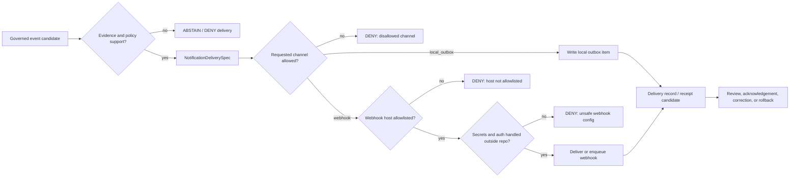

<!-- [KFM_META_BLOCK_V2]
doc_id: kfm://doc/NEEDS-VERIFICATION
title: notification/
type: standard
version: v1
status: draft
owners: @bartytime4life
created: NEEDS_VERIFICATION_YYYY-MM-DD
updated: 2026-05-02
policy_label: public
related: [../README.md, ../.github/CODEOWNERS, ../data/README.md, ../contracts/README.md, ../schemas/README.md, ../policy/README.md, ../tests/README.md, ../tools/README.md, ../pipelines/README.md, ../release/]
tags: [kfm, notification, delivery, local-outbox, webhook, policy, receipts, governance]
notes: [doc_id and created date require document-registry verification; owner is broad fallback ownership from CODEOWNERS and needs active-branch verification; public-main README was empty at inspection; runtime wiring, schemas, tests, delivery execution, and emitted notification receipts remain UNKNOWN until the active checkout is inspected.]
[/KFM_META_BLOCK_V2] -->

<a id="top"></a>

# `notification/`

Governed notification-delivery configuration examples for KFM events that require review-visible delivery without becoming publication authority.

> [!IMPORTANT]
> **Status:** experimental  
> **Owners:** `@bartytime4life` — broad fallback owner; narrower notification ownership is **NEEDS VERIFICATION**  
> **Path:** `notification/README.md`  
> **Evidence posture:** **CONFIRMED** public-main directory snapshot · **DOCTRINE-CONFIRMED** KFM trust path · **PROPOSED** lane contract · **UNKNOWN** active-branch runtime wiring  
> **Current public snapshot:** `notification/` contains this README target plus three JSON examples: `notification_delivery_policy_default.json`, `notification_delivery_spec_example.json`, and `webhook_config_example.json`.  
>
> 
> 
> 
> 
> 
> 
>   
>
> **Quick jumps:** [Scope](#scope) · [Repo fit](#repo-fit) · [Accepted inputs](#accepted-inputs) · [Exclusions](#exclusions) · [Directory tree](#directory-tree) · [Operating contract](#operating-contract) · [Current JSON examples](#current-json-examples) · [Flow](#flow) · [Validation](#validation) · [Definition of done](#definition-of-done) · [Rollback](#rollback) · [FAQ](#faq) · [Appendix](#appendix)

> [!CAUTION]
> `notification/` is **not** an emergency alerting system, publication gate, secret store, policy authority, source registry, evidence store, or direct public webhook runtime. It is a small configuration-and-example surface that must stay subordinate to KFM evidence, policy, review, release, receipt, and rollback controls.

---

## Scope

`notification/` is the repo-facing home for notification-delivery examples and default delivery posture.

Its job is to help maintainers describe **how a KFM event may be delivered** after the upstream event is already admissible, scoped, policy-checked, and review-visible.

This directory may describe delivery choices such as:

- default delivery channels
- allowed delivery channels
- local outbox behavior
- webhook allowlists
- acknowledgement deadlines
- recipient-safety posture
- delivery export preferences
- delivery examples for tests, docs, and future validators

It must not decide whether the underlying claim, dataset, source, release, policy decision, or public artifact is valid.

### One-screen rule

A notification may announce or record a governed event. It must not create the governed event.

[Back to top](#top)

---

## Repo fit

`notification/` sits beside KFM’s trust system. It should point to the surfaces that own meaning instead of duplicating them.

| Relation | Surface | Role | Status in this README |
|---|---|---|---|
| Parent orientation | [`../README.md`](../README.md) | Project identity, trust path, map/AI boundaries, validation, rollback | **NEEDS ACTIVE-BRANCH VERIFICATION** |
| Ownership | [`../.github/CODEOWNERS`](../.github/CODEOWNERS) | Broad fallback owner and future path-specific ownership routing | **CONFIRMED public-main fallback / VERIFY active branch** |
| Data lifecycle | [`../data/README.md`](../data/README.md) | RAW → WORK/QUARANTINE → PROCESSED → CATALOG/TRIPLET → PUBLISHED posture | **DOCTRINE-CONFIRMED / VERIFY active branch** |
| Contracts | [`../contracts/README.md`](../contracts/README.md) | Human-readable object meaning and compatibility expectations | **VERIFY before claiming notification contract home** |
| Schemas | [`../schemas/README.md`](../schemas/README.md) | Machine-readable validation home where adopted | **VERIFY before claiming schema authority** |
| Policy | [`../policy/README.md`](../policy/README.md) | Allow, deny, abstain, obligations, sensitivity, and release rules | **VERIFY before claiming policy enforcement** |
| Tests | [`../tests/README.md`](../tests/README.md) | Fixture and negative-path verification | **VERIFY before claiming coverage** |
| Tools | [`../tools/README.md`](../tools/README.md) | Validators, probes, CI helpers, diff/proof/receipt support | **VERIFY before claiming executable support** |
| Pipelines | [`../pipelines/README.md`](../pipelines/README.md) | Event-producing and delivery-handoff processes | **UNKNOWN until inspected** |
| Release | [`../release/`](../release/) | Release-adjacent manifests, handoff, and rollback references where adopted | **UNKNOWN until inspected** |

### Boundary summary

| Question | Answer |
|---|---|
| What does this directory own? | Notification delivery defaults and examples. |
| What does it not own? | Source truth, evidence resolution, policy law, release approval, webhook secrets, runtime delivery execution, or emergency alerting. |
| What should public-facing delivery depend on? | Evidence support, source role, policy posture, review state, release state, recipient safety, delivery receipt, and rollback/shutoff path. |
| What remains unknown? | Whether these JSON examples are currently validated, called by runtime code, covered by CI, or linked to emitted delivery receipts. |

[Back to top](#top)

---

## Accepted inputs

Use `notification/` for small, public-safe, reviewable notification-delivery configuration examples.

| Input | Belongs here when… | Required posture |
|---|---|---|
| `NotificationDeliveryPolicy.v1` examples | They declare allowed channels, default channel, and channel constraints. | Must not override `policy/`; must be validated or marked **NEEDS VERIFICATION**. |
| `NotificationDeliverySpec.v1` examples | They describe delivery behavior for a dataset, release, review event, or future runtime event. | Must keep recipient identifiers safe and event support traceable. |
| `NotificationWebhookConfig.v1` examples | They demonstrate webhook endpoint allowlists and local/private delivery posture. | Must not contain secrets, production tokens, or unverified public endpoints. |
| Local outbox examples | They support dry-run, review, testing, or staged notification behavior. | Preferred default until external delivery is explicitly governed. |
| Public-safe fixtures | They exercise positive and negative delivery cases. | Must avoid real recipients, secrets, sensitive claims, private endpoints, and exact sensitive locations. |
| Delivery documentation | It explains how notification delivery is gated, recorded, tested, and rolled back. | Must distinguish example configuration from active runtime enforcement. |

### Healthy notification claims

A notification lane may safely say:

- “this delivery policy allows `local_outbox` and `webhook`”
- “this example uses `local_outbox` as the default channel”
- “this webhook example is local-host allowlisted”
- “plaintext recipient identifiers are disabled in the example spec”
- “delivery must remain downstream of evidence, policy, review, and release state”

It should not say:

- “this claim is true”
- “this release is approved”
- “this webhook has delivered successfully”
- “this recipient is authorized”
- “this public endpoint is safe”
- “this notification is an emergency alert”
- “this channel bypasses policy because it is only a message”

[Back to top](#top)

---

## Exclusions

Do **not** put these in `notification/`.

| Excluded item | Why it does not belong here | Better home |
|---|---|---|
| Source data, RAW captures, or WORK artifacts | Delivery config is not lifecycle storage. | `../data/raw/`, `../data/work/`, or approved lifecycle homes after verification. |
| Quarantined evidence or unresolved source material | Notification must not normalize unresolved material into public attention. | `../data/quarantine/` with reason and review path. |
| Canonical policy law | Notification examples may reflect policy-shaped constraints but do not define policy. | `../policy/`. |
| Machine schema authority | Example JSON does not settle the schema-home question. | `../schemas/` or the repo-approved schema home after ADR verification. |
| Human-readable object contracts | README text may summarize; it should not replace contract docs. | `../contracts/`. |
| Webhook secrets, bearer tokens, signing keys, or private credentials | Secrets must never enter docs, fixtures, examples, or source-controlled configs. | Secret manager, environment settings, or approved ops surfaces. |
| Real recipient identifiers | Recipient privacy and delivery authorization are policy-sensitive. | Restricted runtime/config system; use opaque or hashed test IDs in fixtures. |
| Production external webhook endpoints | Public delivery posture requires security, policy, and operator review. | Runtime config outside public repo, with allowlist and rollback controls. |
| Emergency warning instructions | KFM notifications are not life-safety alerting. | Official alerting and emergency-management sources. |
| Release approval, correction, withdrawal, or rollback decisions | Notification can report these but cannot decide them. | `../release/`, `../data/proofs/`, `../data/receipts/`, `../docs/runbooks/`, or approved release/correction homes. |

[Back to top](#top)

---

## Directory tree

Current public-main snapshot:

```text
notification/
├── README.md
├── notification_delivery_policy_default.json
├── notification_delivery_spec_example.json
└── webhook_config_example.json
```

> [!NOTE]
> Treat the tree above as a **public-main snapshot**, not proof of active-branch wiring. Runtime imports, schema validation, CI coverage, emitted receipts, and platform delivery settings remain **UNKNOWN** until inspected.

[Back to top](#top)

---

## Operating contract

### Delivery state rules

| Rule | Meaning | Default |
|---|---|---|
| Delivery follows trust | Notifications must come after evidence, policy, review, and release checks appropriate to the event. | Required |
| `local_outbox` first | Local reviewable output is the safest default until external delivery controls are verified. | Preferred |
| Webhook is gated | Webhook delivery requires an allowlisted host, no secrets in repo, policy approval, and rollback/shutoff path. | Restricted |
| Recipient safety is explicit | Plaintext recipient IDs should be disabled unless a reviewed policy allows them. | Disabled in current example |
| Delivery is recorded | Delivery attempts should produce reviewable process memory. | PROPOSED |
| Notification is not promotion | Sending or queuing a notification must not mark an artifact as published. | Required |
| Fail closed | Unknown channel, unknown host, unresolved recipient posture, missing support, or missing policy should deny delivery. | Required |

### Channel posture

| Channel | Current example status | Intended role | Release/public posture |
|---|---|---|---|
| `local_outbox` | Present as default in examples | Dry-run, review queue, local audit, safe staged delivery | Allowed by default where event support is valid |
| `webhook` | Present in default policy; local-host example config only | Controlled integration with a trusted receiver | **DENY** unless allowlist, secrets handling, auth, policy, and receipt behavior are verified |
| Email / SMS / chat / push | Not present in current examples | Not adopted in this lane | **DENY / PROPOSED only after contract, policy, and tests** |

[Back to top](#top)

---

## Current JSON examples

### `notification_delivery_policy_default.json`

| Field | Current example value | Review meaning |
|---|---|---|
| `schema` | `NotificationDeliveryPolicy.v1` | Names the intended policy-example shape. |
| `policy_id` | `soilgrids-notification-delivery-default` | Example policy identifier; does not prove active runtime use. |
| `allowed_channels` | `local_outbox`, `webhook` | Webhook appears as an allowed channel in the example policy. |
| `default_channel` | `local_outbox` | Local delivery is the safest default. |

### `notification_delivery_spec_example.json`

| Field | Current example value | Review meaning |
|---|---|---|
| `schema` | `NotificationDeliverySpec.v1` | Names the intended spec-example shape. |
| `notification_delivery_id` | `nd_example` | Example identifier only. |
| `dataset_id` | `soilgrids.v1` | Example dataset linkage; support and runtime use remain **UNKNOWN**. |
| `delivery.default_channel` | `local_outbox` | Keeps delivery local by default. |
| `delivery.allowed_channels` | `local_outbox` | Narrows this example to local outbox only. |
| `delivery.ack_deadline_hours` | `72` | Defines an acknowledgement expectation for the example. |
| `recipients.allow_plaintext_recipient_ids` | `false` | Recipient identifiers should not be exposed in plaintext. |
| `exports.write_cloudevents` | `true` | Example export preference; export implementation remains **UNKNOWN**. |

### `webhook_config_example.json`

| Field | Current example value | Review meaning |
|---|---|---|
| `schema` | `NotificationWebhookConfig.v1` | Names the intended webhook config shape. |
| `allowlisted_hosts` | `localhost`, `127.0.0.1` | Keeps webhook examples local/private by default. |
| `endpoints.default` | `https://localhost/hooks/notify` | Example endpoint only; no production endpoint is authorized here. |

[Back to top](#top)

---

## Flow



### Negative states

| State | Use when… | Required result |
|---|---|---|
| `ABSTAIN` | Evidence support, recipient posture, or event support is insufficient. | Do not deliver; record reason. |
| `DENY` | Channel, endpoint, sensitivity, rights, or policy posture is unsafe. | Block delivery; preserve reason and rollback/shutoff note. |
| `ERROR` | Validation, runtime, serialization, or transport fails. | Do not hide failure; preserve error evidence for review. |

[Back to top](#top)

---

## Validation

### Checks to run after active checkout verification

- [ ] Confirm `notification/README.md` is the intended README target and no stronger local version exists.
- [ ] Confirm owners through active-branch `CODEOWNERS` and branch/ruleset settings.
- [ ] Confirm whether `NotificationDeliveryPolicy.v1`, `NotificationDeliverySpec.v1`, and `NotificationWebhookConfig.v1` schemas exist.
- [ ] Confirm whether the JSON examples are validated in CI or by tools.
- [ ] Confirm whether any pipeline, runtime, release, or review surface imports these JSON files.
- [ ] Confirm whether notification delivery emits receipts, delivery records, or audit records.
- [ ] Confirm whether local outbox output has a documented location.
- [ ] Confirm webhook allowlist validation denies non-local or non-allowlisted hosts.
- [ ] Confirm plaintext recipient IDs are denied or explicitly justified by policy.
- [ ] Confirm no secret, token, private recipient, or production endpoint appears in repo examples.
- [ ] Confirm notification behavior cannot mark an artifact as published.
- [ ] Confirm notification delivery can be disabled or rolled back quickly.

### Example-only local JSON sanity check

> [!NOTE]
> This command is illustrative and must be adapted to the active repository’s verified toolchain.

```bash
python -m json.tool notification/notification_delivery_policy_default.json >/dev/null
python -m json.tool notification/notification_delivery_spec_example.json >/dev/null
python -m json.tool notification/webhook_config_example.json >/dev/null
```

[Back to top](#top)

---

## Definition of done

This directory is not done until it can pass these review questions.

- [ ] The README states what `notification/` owns and what it must not own.
- [ ] The active branch confirms owner, path, and related surfaces.
- [ ] All JSON examples are valid JSON.
- [ ] Schema authority for notification objects is either verified or explicitly marked **NEEDS VERIFICATION**.
- [ ] Allowed channels are finite and reviewed.
- [ ] `local_outbox` remains the default safe posture unless a reviewed policy says otherwise.
- [ ] Webhook delivery requires an allowlist and has no repo-stored secrets.
- [ ] Plaintext recipient IDs are disabled or explicitly policy-reviewed.
- [ ] Disallowed channels and unallowlisted hosts fail closed.
- [ ] Delivery has reviewable process memory or a receipt plan.
- [ ] Notification delivery cannot promote, publish, correct, withdraw, or roll back by itself.
- [ ] Runtime and CI wiring are not claimed until verified.
- [ ] Rollback/shutoff behavior is documented for any external delivery channel.

[Back to top](#top)

---

## Rollback

Rollback is required if notification behavior:

- sends to an unapproved channel
- sends to an unallowlisted host
- exposes secrets, recipient IDs, or sensitive details
- notifies on unsupported or unreviewed claims
- implies publication approval
- bypasses policy, review, release state, or EvidenceBundle closure
- cannot produce an auditable delivery reason or failure state

Rollback target: `ROLLBACK_TARGET_TBD_AFTER_ACTIVE_REPO_INSPECTION`

Minimum safe rollback actions:

1. Remove or disable external webhook configs.
2. Revert to `local_outbox` only.
3. Preserve failed delivery record or error context for review.
4. Notify maintainers through the repo-approved incident or correction path.
5. Re-run validation after rollback.

[Back to top](#top)

---

## FAQ

### Is `notification/` a runtime service?

**UNKNOWN.** Public-main evidence shows JSON examples, not runtime execution. Treat runtime wiring as **NEEDS VERIFICATION**.

### Can webhook endpoints be production endpoints?

Not by default. Current examples use local hosts only. A production endpoint would need policy review, authentication, secret handling outside the repo, host allowlisting, delivery receipts, and rollback/shutoff controls.

### Can a notification make something published?

No. Publication is a governed state transition. Notification delivery may report a reviewed state but must not create release state.

### Can notification examples include real recipients?

No, not in public examples. Use non-sensitive fixtures or opaque identifiers only, and keep plaintext recipient identifiers disabled unless a reviewed policy explicitly allows them.

### Is this an emergency alerting lane?

No. KFM notifications are governed delivery/configuration examples for review-visible project events, not life-safety alerting or official emergency messaging.

[Back to top](#top)

---

## Appendix

### Evidence boundary

| Claim | Status |
|---|---|
| `notification/` exists on public `main`. | **CONFIRMED public-main snapshot** |
| `notification/README.md` existed as an empty raw file during inspection. | **CONFIRMED public-main snapshot** |
| Three JSON example files exist in `notification/`. | **CONFIRMED public-main snapshot** |
| Notification schemas are implemented. | **UNKNOWN** |
| Notification examples are validated by CI. | **UNKNOWN** |
| Notification runtime delivery exists. | **UNKNOWN** |
| Webhook delivery is active. | **UNKNOWN** |
| Emitted notification receipts exist. | **UNKNOWN** |
| Active branch matches public `main`. | **NEEDS VERIFICATION** |
| Owner beyond broad fallback `@bartytime4life`. | **NEEDS VERIFICATION** |

### Placeholder register

| Placeholder | Why it remains |
|---|---|
| `kfm://doc/NEEDS-VERIFICATION` | No repo document registry entry was verified. |
| `NEEDS_VERIFICATION_YYYY-MM-DD` | File creation date requires git-history or document-register verification. |
| `ROLLBACK_TARGET_TBD_AFTER_ACTIVE_REPO_INSPECTION` | No active runtime, release, or rollback artifact was inspected. |
| `NEEDS ACTIVE-BRANCH VERIFICATION` | Public `main` evidence may not match the branch being changed. |

[Back to top](#top)
