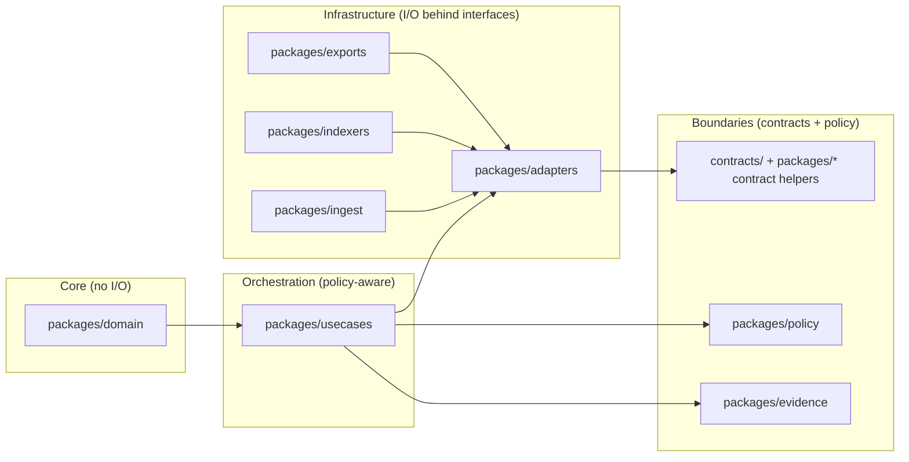

<!-- [KFM_META_BLOCK_V2]
doc_id: kfm://doc/795bfcc7-71af-4d02-a69b-19a97007d799
title: packages/README — Versioned, testable modules
type: standard
version: v2
status: draft
owners: KFM Maintainers (set via CODEOWNERS)
created: 2026-02-25
updated: 2026-02-28
policy_label: public
related:
  - ../README.md
  - ../docs/
  - ../apps/
  - ../contracts/
  - ../configs/
  - ../policy/
tags:
  - kfm
  - monorepo
  - packages
  - layering
  - trust-membrane
  - promotion-contract
  - evidence-first
notes:
  - Directory-level contract for packages/ aligned to KFM invariants (truth path, trust membrane, evidence-first UX, cite-or-abstain).
  - Adds registry pattern (packages/registry) to reduce guessing and improve CI enforcement.
  - Does not assume a specific language/toolchain; commands and manifests are patterns unless confirmed in-repo.
[/KFM_META_BLOCK_V2] -->

<a id="top"></a>

# packages/
Versioned, testable modules for the Kansas Frontier Matrix (KFM) monorepo.

**Purpose:** Keep core system logic **reusable**, **reviewable**, and **governed** by enforcing clear module boundaries.  
**Status:** draft • **Owners:** set via `CODEOWNERS` • **Policy:** public (docs)  
**Posture:** default-deny • fail-closed • evidence-first • cite-or-abstain • reproducible by digest


---

## Navigation
- [Directory contract](#directory-contract)
- [Repo reality check](#repo-reality-check)
- [How packages map to KFM architecture](#how-packages-map-to-kfm-architecture)
- [Canonical package taxonomy](#canonical-package-taxonomy)
- [Directory layout](#directory-layout)
- [Packages registry](#packages-registry)
- [Package manifest contract](#package-manifest-contract)
- [Dependency rules](#dependency-rules)
- [Testing, builds, and CI expectations](#testing-builds-and-ci-expectations)
- [Security and compliance](#security-and-compliance)
- [Adding a new package](#adding-a-new-package)
- [Definition of Done](#definition-of-done)
- [Glossary](#glossary)

---

## Directory contract

### Where this fits in the repo
`packages/` is the **module layer** between:
- **apps/** (runnable user/operator surfaces), and
- **infra/** / runtime substrates, and
- **data/** / truth-path artifacts and catalogs, and
- **policy/** / policy-as-code bundles.

Packages are where we keep the reusable building blocks so apps and services do not copy/paste logic.

### What belongs here
✅ Independently testable modules with:
- a clear **public API** (what other code imports)
- an owner and lifecycle status
- tests (unit minimum; integration if it does I/O)
- explicit dependency boundaries (domain/usecase/adapters/etc.)
- policy-safe behavior where relevant (deny/abstain on uncertainty)

Examples of acceptable package categories:
- **Domain**: types, invariants, ID rules, canonical hashing helpers (no I/O)
- **Use cases**: orchestration workflows (policy-aware; no direct storage)
- **Adapters**: repository implementations for storage/indexing behind interfaces
- **Contracts**: schema/profile validators and DTO types
- **Policy**: policy decision client types + obligation handling (display + enforcement boundaries)
- **Evidence**: EvidenceRef/EvidenceBundle types + resolver client contract
- **Geo**: geospatial utilities (projection, bounds, tiling math)
- **Observability**: logging/tracing helpers (policy-safe by default)
- **UI components**: shared evidence drawer/receipt viewer components (if your repo shares UI as packages)

### What must NOT go in `packages/`
❌ Raw datasets, processed artifacts, catalogs, or audit ledgers (those belong under `data/` truth-path zones)  
❌ Secrets, tokens, `.env` files, kubeconfigs, private keys  
❌ Build artifacts (`dist/`, `build/`, `target/`, coverage outputs)  
❌ “Misc” scripts without tests and ownership (put in `tools/` or `scripts/`)  
❌ Direct-to-storage patterns from UI clients (trust membrane violation)

> [!WARNING]
> If a package enables bypassing the governed API/policy boundary (e.g., ships DB/object-store clients for browser code), treat it as a **security and governance defect**.

[Back to top](#top)

---

## Repo reality check

This README describes a **target posture**. Before treating any statement as “Confirmed (repo)”, verify in-repo:

- [ ] The actual list of packages under `packages/`
- [ ] The workspace/toolchain boundary (pnpm/yarn/npm/bazel/poetry/uv/go workspaces/etc.)
- [ ] Which packages are published (if any) vs internal-only
- [ ] Which packages are policy-bearing and require steward review

Suggested verification steps:

```bash
# Inspect package top-level directories
find packages -maxdepth 2 -type d -print

# Optional: identify workspace boundaries/tooling
ls -la pnpm-workspace.yaml yarn.lock package-lock.json turbo.json nx.json Cargo.toml go.work pyproject.toml 2>/dev/null || true

# Optional: list package manifests (language-dependent)
find packages -maxdepth 3 -name 'package.json' -o -name 'pyproject.toml' -o -name 'go.mod' -o -name 'Cargo.toml'
```

> [!NOTE]
> If your repo is multi-language, keep package ownership and dependency rules explicit—otherwise the trust membrane becomes “best effort.”

[Back to top](#top)

---

## How packages map to KFM architecture

Packages should reflect KFM’s layered model so governance is enforceable.



**Rule of thumb:**
- Dependency direction flows **inward** (toward domain).
- I/O and vendor SDKs live **only** behind adapters.
- Apps and external clients consume **governed APIs**, not storage clients.

[Back to top](#top)

---

## Canonical package taxonomy

KFM’s repo layout (design intent) typically includes these package groups:

- `packages/domain/` — canonical IDs, spec hashing, core types
- `packages/usecases/` — orchestration workflows (promotion, evidence resolution, story flows)
- `packages/adapters/` — repository implementations (storage/indexing), behind interfaces
- `packages/ingest/` — connectors and acquisition helpers (never “ship” without rights/sensitivity metadata)
- `packages/indexers/` — rebuildable projections (search/graph/tiles)
- `packages/exports/` — governed export packaging (policy + rights enforcement)
- `packages/stories/` — Story Node schema/helpers/renderers
- `packages/focus/` — Focus Mode planner/eval harness hooks (cite-or-abstain)
- `packages/evidence/` — EvidenceRef/EvidenceBundle types + resolver client
- `packages/catalog/` — DCAT/STAC/PROV builders + validators + linkcheck helpers
- `packages/policy/` — policy client types + obligation models + enforcement helpers
- `packages/geo/` — geo math + bounds + safe generalization utilities
- `packages/observability/` — logs/metrics/tracing helpers, policy-safe
- `packages/ui-components/` — shared UI components (EvidenceDrawer, ReceiptViewer), if used
- `packages/shared/` — small shared utilities (keep it small; avoid “god package”)

> [!IMPORTANT]
> This taxonomy is a **boundary strategy**. If your repo uses different names, map them explicitly and enforce the same dependency rules.

[Back to top](#top)

---

## Directory layout

Recommended structure that matches the “registry + fixtures” pattern used elsewhere:

```text
packages/
├─ README.md
│
├─ registry/                                      # Machine-readable registry + schemas + fixtures (small)
│  ├─ packages.v1.json                            # Canonical packages registry (paths, layers, owners, constraints)
│  ├─ schemas/
│  │  └─ packages_registry.v1.schema.json         # Schema for packages.v1.json (optional but recommended)
│  └─ fixtures/
│     ├─ valid/
│     └─ invalid/
│
├─ domain/
│  ├─ README.md
│  ├─ kfm.package.json                            # Optional: repo-standard manifest (recommended)
│  ├─ src/
│  ├─ test/
│  └─ fixtures/                                   # Optional: deterministic fixtures (safe-by-default)
│
├─ usecases/
│  ├─ README.md
│  ├─ kfm.package.json
│  ├─ src/
│  ├─ test/
│  └─ fixtures/
│
├─ adapters/
│  ├─ README.md
│  ├─ kfm.package.json
│  ├─ src/
│  ├─ test/
│  └─ fixtures/
│
├─ ingest/
│  ├─ README.md
│  ├─ kfm.package.json
│  ├─ src/
│  ├─ test/
│  └─ fixtures/
│
├─ indexers/
│  ├─ README.md
│  ├─ kfm.package.json
│  ├─ src/
│  ├─ test/
│  └─ fixtures/
│
├─ exports/
│  ├─ README.md
│  ├─ kfm.package.json
│  ├─ src/
│  ├─ test/
│  └─ fixtures/
│
├─ stories/
│  ├─ README.md
│  ├─ kfm.package.json
│  ├─ src/
│  ├─ test/
│  └─ fixtures/
│
├─ focus/
│  ├─ README.md
│  ├─ kfm.package.json
│  ├─ src/
│  ├─ test/
│  └─ fixtures/
│
├─ evidence/
│  ├─ README.md
│  ├─ kfm.package.json
│  ├─ src/
│  ├─ test/
│  └─ fixtures/
│
├─ catalog/
│  ├─ README.md
│  ├─ kfm.package.json
│  ├─ src/
│  ├─ test/
│  └─ fixtures/
│
├─ policy/
│  ├─ README.md
│  ├─ kfm.package.json
│  ├─ src/
│  ├─ test/
│  └─ fixtures/
│
├─ geo/
│  ├─ README.md
│  ├─ kfm.package.json
│  ├─ src/
│  ├─ test/
│  └─ fixtures/
│
├─ observability/
│  ├─ README.md
│  ├─ kfm.package.json
│  ├─ src/
│  └─ test/
│
├─ ui-components/                                 # Optional (only if shared UI lives in packages)
│  ├─ README.md
│  ├─ kfm.package.json
│  ├─ src/
│  └─ test/
│
└─ shared/
   ├─ README.md
   ├─ kfm.package.json
   ├─ src/
   └─ test/
```

> [!TIP]
> If a package has no tests and no owner, it’s not a package—it’s a liability. Keep the tree disciplined.

[Back to top](#top)

---

## Packages registry

A package is not “real” until it is registered (so CI can enforce boundaries without guessing).

### `packages/registry/packages.v1.json` (recommended shape)

This file enables:
- owner routing and enforcement
- dependency boundary checks
- policy label and data-access audits
- build/test graph generation

Example (illustrative):

```json
{
  "registry_version": "v1",
  "packages": [
    {
      "path": "domain",
      "package_id": "kfm.domain",
      "layer": "domain",
      "owners": ["kfm-engineering"],
      "policy_label": "public",
      "data_access": "none",
      "depends_on": [],
      "ci": {
        "required": ["lint", "test", "typecheck"],
        "optional": []
      }
    },
    {
      "path": "adapters",
      "package_id": "kfm.adapters",
      "layer": "adapters",
      "owners": ["kfm-platform"],
      "policy_label": "restricted",
      "data_access": "io-behind-interfaces",
      "depends_on": ["kfm.domain", "kfm.usecases", "kfm.contracts"],
      "ci": {
        "required": ["lint", "test", "integration"],
        "optional": ["contract-tests"]
      }
    }
  ]
}
```

> [!IMPORTANT]
> The registry should be treated as **governance-bearing**. Changes that alter `data_access`, `policy_label`, or dependency rules require stricter review.

[Back to top](#top)

---

## Package manifest contract

To avoid language/tooling lock-in, KFM can use a **repo-standard** manifest file that sits alongside the language-native manifest (`package.json`, `pyproject.toml`, `go.mod`, etc.).

### Proposed `kfm.package.json` (optional but recommended)

```json
{
  "package_id": "kfm.catalog",
  "name": "KFM Catalog Helpers",
  "layer": "catalog",
  "policy_label": "public",
  "owners": ["kfm-engineering", "kfm-governance"],
  "public_api": {
    "entry_points": ["src/index.*"],
    "contracts_used": [
      "contracts/catalogs/dcat.profile.md",
      "contracts/catalogs/stac.profile.md",
      "contracts/catalogs/prov.profile.md"
    ]
  },
  "data_access": "none",
  "constraints": {
    "forbid_direct_storage_clients": true,
    "require_fixtures_for_contract_changes": true
  }
}
```

Minimum rules (recommended):
- `package_id`, `layer`, `owners`, and `policy_label` are required.
- packages that touch contract surfaces must declare `contracts_used`.
- packages that do I/O must declare `data_access` as `io-behind-interfaces` and must be owned by platform/engineering (as appropriate).

[Back to top](#top)

---

## Dependency rules

These rules are part of KFM’s **trust membrane** and must be enforceable in CI.

### Allowed directions (summary)
- `domain` → (no downward deps)
- `usecases` → `domain`
- `policy`, `evidence`, `catalog`, `stories`, `focus`, `geo`, `observability` → `domain` (+ sometimes `usecases` depending on repo design)
- `adapters`, `ingest`, `indexers`, `exports` → `domain` + `usecases` + contracts (implements I/O behind interfaces)
- `ui-components` → contracts/types only (never DB/storage clients)

### Forbidden dependencies (examples)
- ❌ `domain` importing adapters/infra clients
- ❌ `usecases` importing DB/object-store/index clients directly (must use repositories/adapters)
- ❌ `ui-components` importing server-only or privileged adapters
- ❌ “shared” becoming a dumping ground (if it grows, split it)

### Enforcement approaches (choose what fits your toolchain)
- dependency boundary checks (workspace graph rules)
- lint rules + allow/deny lists for imports
- CI grep checks for known bypass libraries (use sparingly; tune to reduce false positives)
- build tags / compilation boundaries (for multi-language repos)

> [!WARNING]
> If a package boundary is “social only” (not enforced), it will be violated under deadline pressure. Make it machine-enforced.

[Back to top](#top)

---

## Testing, builds, and CI expectations

Packages are only safe if they are continuously validated.

### Minimum expectations (recommended baseline)
- **Fast checks (required):**
  - formatting
  - lint
  - unit tests
  - typecheck (if applicable)
- **Contract checks (required when relevant):**
  - schema/profile validation (DCAT/STAC/PROV, EvidenceBundle, receipts)
  - linkcheck (EvidenceRefs resolvable under allowed policy)
- **Policy checks (required when relevant):**
  - policy fixtures parity (CI semantics match runtime semantics)
- **Security checks (required):**
  - secret scanning
  - dependency scanning (where supported)
  - license allow/deny checks (especially for export/ingest tooling)

### Promotion Contract awareness (A–F)
Packages often implement gate logic even if gates run elsewhere:

| Gate | Typical package responsibilities |
|---|---|
| A: Identity/versioning | dataset ID rules, deterministic `spec_hash` helpers (`domain`, `catalog`) |
| B: Rights/licensing | SPDX handling, attribution wiring (`catalog`, `exports`, `policy`) |
| C: Sensitivity/redaction | generalization helpers, obligation models (`policy`, `geo`, `exports`) |
| D: Catalog triplet | profile validators/builders (`catalog`, `contracts` helpers) |
| E: Receipts/checksums | receipt writers/readers, digest utilities (`evidence`, `catalog`) |
| F: Policy/contract tests | fixtures + contract test harnesses (`policy`, `evidence`, `catalog`) |

> [!NOTE]
> Apps “display” trust. Packages often “compute” trust. Both must be consistent and fail closed.

[Back to top](#top)

---

## Security and compliance

- **No secrets in source control.** Treat violations as merge-blocking.
- **No policy bypass utilities.** Anything that enables bypassing governed APIs is a security issue.
- **Rights-aware exports.** Any export tooling must enforce:
  - rights metadata presence
  - attribution generation
  - policy label restrictions
- **Policy-safe errors.** Avoid “existence inference” leaks (e.g., distinguishable 403 vs 404) unless policy explicitly allows.

[Back to top](#top)

---

## Adding a new package

### Step-by-step
1. Choose the layer (`domain`, `usecases`, `adapters`, etc.).
2. Create the directory with:
   - `README.md`
   - language-native manifest (repo standard)
   - tests (`test/`)
   - optional `kfm.package.json`
3. Add the package to:
   - `packages/registry/packages.v1.json`
4. Add/verify boundary enforcement:
   - ensure dependencies follow [Dependency rules](#dependency-rules)
5. Add CI coverage:
   - at minimum: lint + unit tests
   - add contract/policy tests if the package touches contract surfaces

### Package README minimum
Each package README should state:
- purpose (one sentence)
- layer and boundaries (what it must not depend on)
- public API surface
- how to test locally
- ownership and escalation path
- policy and sensitivity posture (if relevant)

[Back to top](#top)

---

## Definition of Done

A package is “done” when:

- [ ] It appears in `packages/registry/packages.v1.json` with owner + layer + policy_label.
- [ ] It has a `README.md` with purpose, boundaries, and test instructions.
- [ ] It has tests (unit minimum; integration if it does I/O).
- [ ] It follows dependency rules and passes boundary checks in CI.
- [ ] If it affects promotion/serving behavior, it includes fixtures and contract/policy tests.
- [ ] It contains no secrets and does not enable trust membrane bypass.

[Back to top](#top)

---

## Glossary
- **Trust membrane:** enforced boundary where policy + provenance controls access; clients never access storage directly.
- **Truth path:** lifecycle of governed data: RAW → WORK/QUARANTINE → PROCESSED → CATALOG/TRIPLET → runtime surfaces.
- **Promotion Contract:** fail-closed gate set (A–F) that controls what becomes runtime-visible.
- **Contract surface:** schema/spec/profile that is versioned and machine-validated (OpenAPI, JSON Schema, DCAT/STAC/PROV).
- **Evidence-first:** every claim/layer/answer can open into rights, provenance, and validation evidence.
- **Cite-or-abstain:** if citations cannot be verified and policy-allowed, abstain or reduce scope.

---

<p align="right"><a href="#top">Back to top ↑</a></p>
