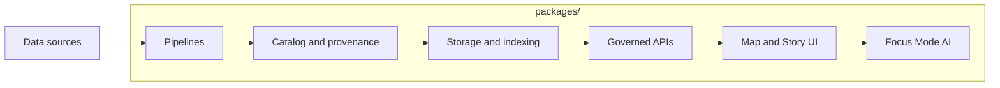

<!-- [KFM_META_BLOCK_V2]
doc_id: kfm://doc/795bfcc7-71af-4d02-a69b-19a97007d799
title: packages/
type: standard
version: v1
status: draft
owners: KFM Maintainers (TODO)
created: 2026-02-25
updated: 2026-02-25
policy_label: public (TODO)
related:
  - ../README.md (TODO)
tags: [kfm, monorepo, packages]
notes:
  - Directory-level documentation scaffold; replace TODOs once repo conventions are confirmed.
[/KFM_META_BLOCK_V2] -->

# packages/
Versioned, testable modules for the Kansas‑Matrix‑System monorepo.

**Status:** draft · **Owners:** KFM Maintainers (TODO) · **Policy:** public (TODO)


---

## Navigation
- [What belongs in `packages/`](#what-belongs-in-packages)
- [What must NOT go in `packages/`](#what-must-not-go-in-packages)
- [How packages map to the KFM architecture](#how-packages-map-to-the-kfm-architecture)
- [Packages registry](#packages-registry)
- [Adding a new package](#adding-a-new-package)
- [Dependency rules](#dependency-rules)
- [Testing, builds, and CI expectations](#testing-builds-and-ci-expectations)
- [Security and compliance](#security-and-compliance)
- [Appendix: package template](#appendix-package-template)

---

## What belongs in `packages/`

This folder holds **independently buildable** (or at least independently testable), **versioned**
modules that make up the Kansas‑Matrix‑System:

- **Domain packages**: core concepts, types, invariants (no I/O).
- **Use‑case packages**: orchestration and business workflows (policy-aware).
- **Interface packages**: API contracts, DTOs, policy boundary adapters.
- **Infrastructure packages**: storage, indexing, queueing, external integrations (behind interfaces).
- **Shared tooling packages**: linting, test helpers, codegen, internal CLIs.

A “package” here should have a **clear public surface area** (API), tests, and a README that
makes it safe to depend on.

> NOTE  
> This README is a scaffold. Replace all **TODO** markers after confirming the repo’s actual tooling
> (pnpm/yarn/npm, build system, release process, etc.).

[Back to top](#packages)

---

## What must NOT go in `packages/`

Keep `packages/` production-minded and reviewable. Do **not** put the following here:

- ❌ Raw or published datasets (use the governed data lifecycle zones instead)
- ❌ Secrets (keys, tokens, `.env` files, kubeconfigs)
- ❌ One-off scripts / “misc” utilities without tests and ownership
- ❌ Build artifacts (`dist/`, `build/`, `target/`, coverage outputs)
- ❌ Personal notebooks or ad-hoc experiments (unless they are promoted into a maintained package)

If it can’t be tested, reviewed, and reverted cheaply, it doesn’t belong here.

[Back to top](#packages)

---

## How packages map to the KFM architecture

The system is intentionally layered so every user-facing claim stays traceable to evidence and policy.
Packages should reflect that layering.



**Rule of thumb:** dependency direction flows **toward** the core (domain), while runtime calls flow
outward (infra) behind interfaces.

[Back to top](#packages)

---

## Packages registry

> WARNING  
> The registry below is intentionally **incomplete** until the real package list is confirmed.
> Treat it as the required shape for governance, not as an inventory.

| Package | Layer | Responsibility | Public API | Data access | Owner | Status |
|---|---|---|---|---|---|---|
| `@kfm/domain-*` (TODO) | Domain | Core types + invariants | Type exports | None | TODO | TODO |
| `@kfm/usecase-*` (TODO) | Use cases | Orchestration + policy-aware workflows | Functions/services | Via repositories only | TODO | TODO |
| `@kfm/api-*` (TODO) | Interfaces | Governed API contracts + adapters | OpenAPI/GraphQL (TODO) | No direct DB | TODO | TODO |
| `@kfm/infra-*` (TODO) | Infra | Storage/index/queues/integrations | Providers | Yes (behind adapters) | TODO | TODO |
| `@kfm/tooling-*` (TODO) | Tooling | Lint/test/codegen helpers | CLI/Lib | None | TODO | TODO |

**Registry rule:** if a package exists, it must be listed here with an owner and status.

[Back to top](#packages)

---

## Adding a new package

### 1) Choose the correct layer
Use this decision tree:

- If it contains **business meaning / invariants** → **Domain**
- If it coordinates workflows and applies policy → **Use cases**
- If it defines or adapts external boundaries (HTTP, queue messages) → **Interfaces**
- If it talks to databases, object stores, indexes, or vendors → **Infrastructure**
- If it helps developers (lint, codegen, test helpers) → **Tooling**

### 2) Create the smallest package that can be owned
A new package must include:

- [ ] A clear **name** and **owner**
- [ ] A `README.md` describing purpose, inputs/outputs, and non-goals
- [ ] A **public API surface** (what other packages can import)
- [ ] Automated tests (unit at minimum; integration if it does I/O)
- [ ] License and policy labeling (inherit repo defaults unless specified)

### 3) Wire it into the repo
Because workspace tooling is not yet confirmed, treat the commands below as examples:

```bash
# TODO: replace with the repo's actual workspace manager commands
# e.g., pnpm -r test   /   yarn workspaces foreach -pt run test
<workspace-cli> install
<workspace-cli> test --filter <package>
```

### 4) Add it to the registry
Update the [Packages registry](#packages-registry) row(s) with:

- package name
- layer
- owner
- maturity/status (draft/review/published)
- whether it has direct data access (and through what adapter)

[Back to top](#packages)

---

## Dependency rules

These rules are part of the “trust membrane” and should be enforceable in CI.

### Allowed dependency directions

- ✅ Domain → (nothing “below” it)
- ✅ Use cases → Domain
- ✅ Interfaces → Use cases and Domain (contracts + orchestration)
- ✅ Infrastructure → Interfaces, Use cases, Domain (implements adapters)
- ✅ UI/apps → Governed API clients + Interface contracts (never DB)

### Forbidden dependencies (examples)

- ❌ Domain importing Infrastructure (no DB clients in domain)
- ❌ UI importing database drivers
- ❌ Use cases bypassing repositories to call storage directly
- ❌ Cross-cutting “god” packages that become dependency magnets

> TIP  
> Prefer **additive glue** (adapters, contracts, small utilities) over “big rewrites”.
> Keep increments buildable and reversible.

[Back to top](#packages)

---

## Testing, builds, and CI expectations

Every package should be safe to change in isolation.

Minimum expectations:

- **Fast checks** (always on): formatting, lint, typecheck, unit tests
- **Gated checks** (merge/publish): integration tests, contract tests, security scans
- **Receipts** (for governed outputs): version, inputs, transforms, checksums, policy decisions

Suggested package-level scripts (tooling TBD):

- `lint`
- `test`
- `typecheck`
- `build`
- `check:deps` (enforce dependency rules)
- `check:licenses` (license allow/deny)

[Back to top](#packages)

---

## Security and compliance

- No secrets in source control (ever).
- Treat any package that touches **data promotion** as governed:
  - require metadata, validation results, provenance links, and audit records
- Prefer dependency minimization; pin versions where appropriate.
- Any package that exposes an API must document:
  - authentication and authorization expectations
  - rate limits (if applicable)
  - error model and logging/audit requirements

[Back to top](#packages)

---

## Appendix: package template

<details>
<summary><strong>Minimal package skeleton (example)</strong></summary>

```text
packages/
  <package-name>/
    README.md
    src/
    test/
    package.json (or pyproject.toml / go.mod)  # TODO: match repo language/tooling
    CHANGELOG.md (optional but recommended)
    LICENSE (optional if inherited from repo)
```

</details>

<details>
<summary><strong>Package README checklist</strong></summary>

- Purpose (one sentence)
- Where it sits in the architecture (Domain / Use case / Interface / Infra)
- Public API (imports, exported symbols, contract files)
- Inputs/outputs (including data sensitivity classification if relevant)
- Non-goals and exclusions
- How to test locally
- Ownership + escalation path

</details>

---

### TODOs for maintainers
- [ ] Replace workspace commands with the repo standard (pnpm/yarn/npm/bazel/etc.)
- [ ] Replace the registry placeholders with the actual package list
- [ ] Add CI badge links once pipeline names are confirmed
- [ ] Add automated dependency-boundary checks in CI

[Back to top](#packages)
