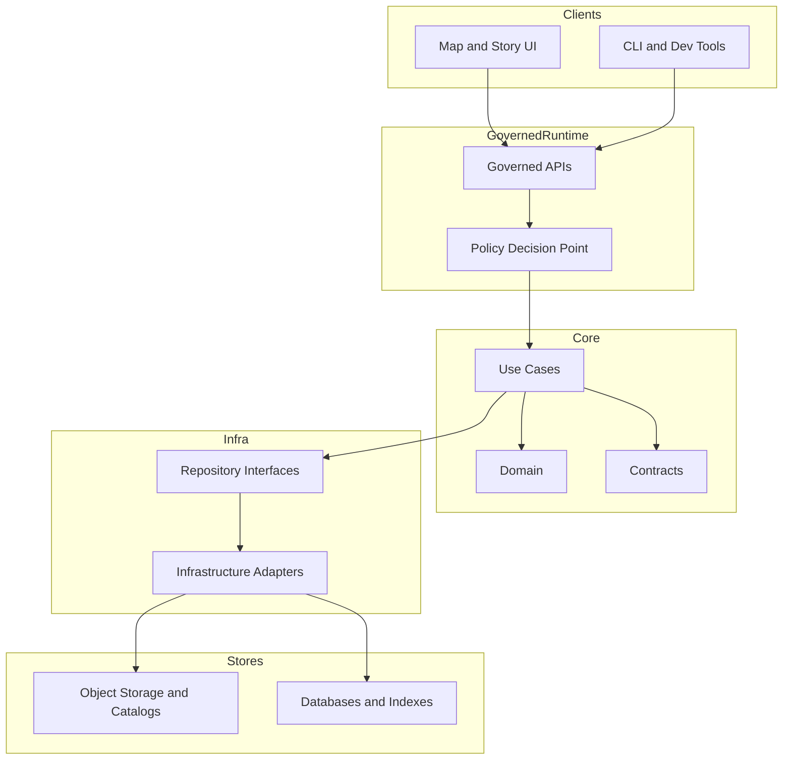

# packages/
Shared, versioned, governed building blocks used across Kansas Frontier Matrix (KFM).

Status: **Draft** • Owners: **TBD** • Policy: **public**


---

## Navigate
- [Purpose](#purpose)
- [What belongs here](#what-belongs-here)
- [Non-negotiable boundaries](#non-negotiable-boundaries)
- [Package taxonomy](#package-taxonomy)
- [Architecture reference](#architecture-reference)
- [Create a new package](#create-a-new-package)
- [Definition of done](#definition-of-done)
- [Illustrative layout](#illustrative-layout)

---

## Purpose
`/packages` is where we put **reusable code and contracts** that are shared across KFM.

Examples of what “shared” usually means:
- Used by more than one service, pipeline, UI surface, or tool.
- Encodes “one way” of doing something that must stay consistent (IDs, schemas, policy decisions, evidence bindings).
- Represents a governed contract (schemas, API DTOs, provenance formats, policy labels, redaction rules).

> **NOTE**
> This folder is not the “misc” drawer. If something is local to a single app/service, keep it in that app/service.

[Back to top](#packages)

---

## What belongs here
Common good fits:

- **Contracts**
  - JSON Schemas, OpenAPI fragments, GraphQL SDL, policy label enums, obligation libraries, error models.
- **Governance and policy helpers**
  - Policy evaluation utilities, redaction/generalization helpers, audit-log event shapes.
- **Core domain and use-case logic**
  - Pure code (no network / no filesystem / no DB calls) that is testable and deterministic.
- **Shared UI primitives**
  - Evidence drawer components, map layer metadata renderers, time controls (only if truly shared).
- **Pipeline building blocks**
  - Normalization helpers, validation runners, provenance/run-receipt writers.
- **Developer tooling**
  - Linters, generators, validators, fixtures that enforce contracts and prevent drift.

[Back to top](#packages)

---

## Non-negotiable boundaries
These are “fail closed” rules for anything inside `/packages`.

### Do not break the trust membrane
- Frontend/external clients must not access databases or object storage directly.
- Core logic must not bypass repository interfaces to talk directly to storage.
- All access should flow through governed APIs that apply policy, redaction, and logging consistently.

> **WARNING**
> If a package encourages direct storage access or bypasses the policy boundary, it is a security and governance defect.

### Do not ship secrets
- No credentials, tokens, private keys, or real production connection strings.
- No sensitive raw datasets. Packages are code + contracts + safe test fixtures.

### Do not embed “unverifiable truth”
If a package influences user-facing claims (maps/stories), it must be able to:
- reference evidence (stable identifiers),
- produce a reproducible audit record (run receipt),
- preserve provenance (inputs → transforms → outputs).

[Back to top](#packages)

---

## Package taxonomy
Use this taxonomy to keep layers clean and to keep testing easy.

| Package type | What it contains | What it must not contain | Typical tests |
|---|---|---|---|
| **Domain** | Entities, value objects, invariants, parsing/formatting of core types | I/O, HTTP, DB drivers, cloud SDKs | Pure unit tests |
| **Use cases** | Application services, orchestration logic, authorization/policy *decisions* | UI components, storage implementations | Unit + contract tests |
| **Contracts** | Schemas, DTOs, ID formats, error models, policy labels | Business logic, I/O | Schema validation tests |
| **Policy** | Policy rules, obligation evaluation, redaction/generalization helpers | DB calls, UI state | Unit + golden tests |
| **Adapters** | Integrations behind interfaces (storage adapters, external APIs) | Domain rules, UI | Integration tests (mocked upstream) |
| **UI shared** | Reusable components used by multiple UI routes/apps | API secrets, direct DB/object access | Component/unit tests |
| **Tooling** | Code generators, linters, validators, CI helpers | Production runtime logic | CLI tests |

> **TIP**
> If you’re unsure where something belongs, start by deciding what it **depends on**.  
> “Depends on storage” usually means “adapter,” not “domain.”

[Back to top](#packages)

---

## Architecture reference
This is the default dependency shape we want across packages and services.



Key idea: packages under `/packages` should mainly live in **Core** (Domain/UseCases/Contracts/Policy) and **Tooling**. Adapters can exist here *only* when they are shared across multiple runtimes and still obey the boundary.

[Back to top](#packages)

---

## Create a new package
### Step 1 — Choose the package type
Pick **one primary type** from the taxonomy above. If you need two, you probably need **two packages**.

### Step 2 — Add documentation metadata
Use a KFM MetaBlock (no YAML frontmatter). Put it at the top of:
- the package README, and
- any contract/spec docs that affect governed behavior.

### Step 3 — Define public surface area
A package should make its intended API obvious:
- Export only what is meant to be used.
- Keep internals internal.
- Document stability expectations.

### Step 4 — Add tests that enforce invariants
At minimum, have one of:
- unit tests for deterministic logic,
- schema tests for contracts,
- golden tests for policy/redaction behavior,
- compatibility tests if you’re changing a shared interface.

### Step 5 — Prove governance compatibility
If the package touches evidence/provenance/policy:
- it must produce stable identifiers (or accept them as inputs),
- it must not create “mystery state” that cannot be audited.

[Back to top](#packages)

---

## Definition of done
Use this checklist before considering a package “ready to depend on.”

- [ ] **Clear purpose** (one paragraph) and explicit non-goals
- [ ] **Package type** selected from the taxonomy and documented
- [ ] **KFM MetaBlock** included with owners + policy label
- [ ] **Public API documented** (what is stable vs internal)
- [ ] **Tests added** appropriate to the package type
- [ ] **No secrets** and no production data checked in
- [ ] **Trust membrane respected**
- [ ] **Contracts validated** (schemas compile/validate; examples included)
- [ ] **Change safety**: breaking changes are either avoided or versioned explicitly

[Back to top](#packages)

---

## Illustrative layout
This is an example of what a healthy `/packages` directory can look like. Adjust to match the repo’s actual build system.

```text
packages/
  README.md

  <package-name>/
    README.md
    package.json (or equivalent)
    src/
    test/
    contracts/ (optional)
```

### Optional: package index table
If you keep an index here, only include packages that actually exist (no placeholders).

| Package | Type | Owner | Notes |
|---|---|---|---|
| *(add real packages here)* |  |  |  |

[Back to top](#packages)

---

<details>
  <summary><strong>Appendix: MetaBlock starter snippet</strong></summary>

Paste and fill for new package docs (example shape only):

```text
[KFM_META_BLOCK_V2]
doc_id: kfm://doc/<stable-id>
title: packages/<package-name>/README.md
type: guide
version: v1
status: draft
owners: <team or names>
created: YYYY-MM-DD
updated: YYYY-MM-DD
policy_label: public|restricted|...
tags:
  - kfm
  - packages
notes:
  - <short notes>
[/KFM_META_BLOCK_V2]
```

</details>
