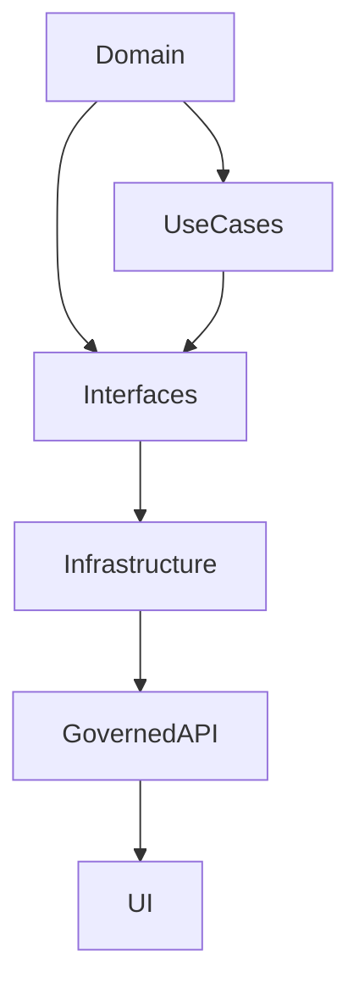
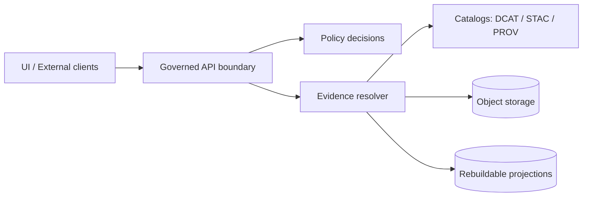

<!-- [KFM_META_BLOCK_V2]
doc_id: kfm://doc/5d4a9d9c-2b42-4e3b-b4da-60e1fd5ce03b
title: packages/ — Monorepo package registry
type: standard
version: v1
status: draft
owners: TBD
created: 2026-02-22
updated: 2026-02-22
policy_label: public
related:
  - ../README.md
  - ../docs/architecture/
tags: [kfm, monorepo, packages]
notes:
  - This is a repository-facing guide for what belongs in /packages and how to keep boundaries enforceable.
  - Update placeholders once workspace tooling and the concrete package list are confirmed.
[/KFM_META_BLOCK_V2] -->

# `packages/` — KFM Packages
Buildable, reusable code units for Kansas Frontier Matrix (KFM): libraries, services, jobs, and UI modules.


## Quick navigation
- [Purpose](#purpose)
- [What belongs here](#what-belongs-here)
- [Directory layout](#directory-layout)
- [Dependency rules](#dependency-rules)
- [Trust membrane rules](#trust-membrane-rules)
- [Package quality gates](#package-quality-gates)
- [Add a new package](#add-a-new-package)
- [Proposed baseline package set](#proposed-baseline-package-set)
- [Fill-in repo specifics](#fill-in-repo-specifics)

---

## Purpose
`/packages` is where **reusable, testable units** live.

A “package” is any module we expect to:
- reuse from multiple places, **or**
- deploy/build independently, **or**
- treat as a contract surface (schemas, OpenAPI, policy adapters, etc.).

> **NOTE**
> Packages are part of the *trust membrane*: if a package bypasses policy enforcement, repository interfaces, or provenance, it weakens the entire system. See [Trust membrane rules](#trust-membrane-rules).

---

## What belongs here
Typical package types (mix-and-match based on the repo’s actual language/tooling):

### 1) Libraries
- domain models (entities, invariants)
- schema registries (DTOs, JSON Schema, STAC/DCAT/PROV profiles)
- shared utilities (logging, hashing, time utilities, geo utilities)

### 2) Services
- governed API service(s)
- evidence resolver service/library
- policy engine adapter + fixtures
- catalog validator/generator

### 3) Jobs & pipelines
- ingestion connectors, snapshotters
- validators and QA reporters
- index builders (search, graph, tile bundles)

### 4) UI modules and SDKs
- UI components used across surfaces (Map / Story / Focus)
- client SDKs generated from API contracts (when used)

---

## Directory layout
Minimum recommended structure (adjust to match repo reality):

```text
packages/
├─ <package-name>/
│  ├─ README.md
│  ├─ src/
│  ├─ test/                # or tests/
│  ├─ contracts/           # OPTIONAL: OpenAPI / GraphQL / JSON Schema / profiles
│  ├─ fixtures/            # OPTIONAL: policy fixtures, golden files
│  └─ CHANGELOG.md         # OPTIONAL
└─ README.md               # you are here
```

### Package README expectations
Each package README should answer:
- **What** it does (1–2 sentences)
- **Where** it sits in the architecture (Domain / Use Cases / Interfaces / Infra)
- **Contracts** it owns (schemas, endpoints)
- **How** to test it locally
- **How** it is used (imports and/or runtime integration)

---

## Dependency rules
We use a layered architecture to keep packages composable and auditable.

### Allowed dependency direction
- **Domain** → depends on nothing (pure models + rules)
- **Use cases** → may depend on Domain
- **Interfaces** → may depend on Domain + Use cases (contracts, repositories, adapters)
- **Infrastructure** → may depend on everything (DB, storage, network clients)



### Practical rules of thumb
- Domain packages **must not** import DB clients, HTTP clients, filesystem, or cloud SDKs.
- Infrastructure packages **must not** be imported by Domain packages.
- Contracts (OpenAPI/JSON schemas/etc.) belong close to Interfaces (or in a dedicated `contracts/` package).

> **WARNING**
> If a package makes it “easy” to access storage directly from UI or client code, it is probably breaking the trust membrane.

---

## Trust membrane rules
Packages must preserve the trust membrane boundary:



**Non-negotiables (apply across packages):**
- UI and external clients must not talk to databases or object storage directly.
- Core logic should not bypass repository interfaces to talk directly to storage.
- Access should flow through governed APIs that apply policy decisions, redactions, and audit logging consistently.

---

## Package quality gates
“Quality gates” here are the *minimum checks* a package must pass before it can be depended on by runtime surfaces.

### Required for all packages
- ✅ Deterministic build (same input → same output)
- ✅ Unit tests for core behavior
- ✅ Lint/format (whatever the repo standard is)
- ✅ Clear public API boundary (what is “exported” vs internal)
- ✅ Minimal docs (package README)

### Additional gates for governance-critical packages
If a package impacts **policy**, **evidence resolution**, **catalogs/lineage**, or **runtime serving**, it must also include:
- ✅ Contract tests (OpenAPI/DTO/schema validation, backward compatible changes)
- ✅ Policy fixtures + tests (fail-closed behavior)
- ✅ Audit event / run-receipt emission (where applicable)
- ✅ Redaction/generalization obligations captured at the interface boundary

> **NOTE**
> If your package produces artifacts that may be promoted into runtime surfaces, it must respect the data lifecycle zones (RAW → WORK/QUARANTINE → PROCESSED → CATALOG/TRIPLET → PUBLISHED) and must fail closed when required artifacts/metadata are missing.

---

## Add a new package
1) **Create the folder**
- `packages/<package-name>/`

2) **Add minimal structure**
- `README.md`
- `src/`
- `test/` (or `tests/`)
- optional: `contracts/`, `fixtures/`

3) **Pick the layer**
- Domain / Use cases / Interfaces / Infrastructure  
…and write it at the top of the package README.

4) **Define the public surface**
- Export a small, intentional API from a single entrypoint (e.g., `src/index.*`).

5) **Add tests**
- Unit tests for behavior
- If it’s an interface boundary: contract tests
- If it’s governance-critical: policy fixtures + fail-closed tests

6) **Wire it into the repo build**
- Add the package to the repo workspace configuration (tooling-specific).
- Ensure CI runs its tests.

---

## Proposed baseline package set
This is a *suggested* decomposition based on the vNext build plan. Adjust names and grouping based on what actually exists in-repo.

| Package slot | Role | Layer bias |
|---|---|---|
| `api` | Governed API endpoints (dataset discovery, queries, tile/feature serving) | Infrastructure |
| `policy` | Policy engine adapter + fixtures | Interfaces / Infrastructure |
| `evidence` | Evidence resolver: EvidenceRef → EvidenceBundle (+ redaction) | Interfaces / Infrastructure |
| `catalog` | Catalog parsers, validators, triplet generation | Interfaces |
| `ingest` | Connectors + runner (RAW/WORK production) | Infrastructure |
| `indexers` | Rebuildable projections (search/graph/tiles) | Infrastructure |
| `ui` | Map/Story/Focus surfaces (client modules) | UI |

---

## Fill-in repo specifics
Replace the placeholders below once confirmed:

- Workspace tool: **TBD** (pnpm / yarn / npm / poetry / uv / …)
- Package naming convention: **TBD**
- Standard test command: **TBD**
- Standard lint command: **TBD**
- Where contracts live: **TBD** (`packages/contracts`, per-package `contracts/`, or `docs/contracts/`)
- Where policy fixtures live: **TBD** (`packages/policy/fixtures`, etc.)

---

<details>
<summary>Appendix: Suggested package README template</summary>

```markdown
# <package-name>

**Layer:** Domain | Use cases | Interfaces | Infrastructure  
**Owners:** TBD  
**Policy label:** public | restricted | ...

## What this does
One paragraph.

## Public API
- `foo()`: …
- `bar`: …

## Contracts (if any)
- OpenAPI: `contracts/openapi.yaml`
- Schemas: `contracts/*.schema.json`

## How to test
- `...`

## Notes
- Trust membrane considerations
- Promotion / provenance considerations
```
</details>

---

[Back to top](#packages--kfm-packages)
