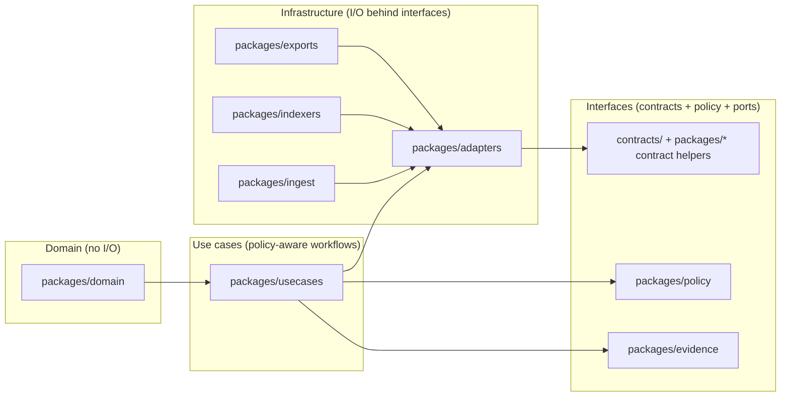

<!-- [KFM_META_BLOCK_V2]
doc_id: kfm://doc/795bfcc7-71af-4d02-a69b-19a97007d799
title: packages/README — Versioned, testable modules
type: standard
version: v2
status: draft
owners: KFM Maintainers (set via CODEOWNERS)
created: 2026-02-25
updated: 2026-02-28
policy_label: public
related:
  - ../README.md
  - ../docs/
  - ../apps/
  - ../contracts/
  - ../configs/
  - ../policy/
tags:
  - kfm
  - monorepo
  - packages
  - layering
  - trust-membrane
  - promotion-contract
  - evidence-first
notes:
  - Directory-level contract for packages/ aligned to KFM invariants (truth path, trust membrane, evidence-first UX, cite-or-abstain).
  - Adds registry pattern (packages/registry) to reduce guessing and improve CI enforcement.
  - Does not assume a specific language/toolchain; commands and manifests are patterns unless confirmed in-repo.
[/KFM_META_BLOCK_V2] -->

<a id="top"></a>

# packages/
Versioned, testable modules for the Kansas Frontier Matrix (KFM) monorepo.

**Purpose:** Keep core system logic **reusable**, **reviewable**, and **governed** by enforcing clear module boundaries.  
**Status:** draft • **Owners:** set via `CODEOWNERS` • **Policy:** public (docs)  
**Posture:** default-deny • fail-closed • evidence-first • cite-or-abstain • reproducible by digest


---

## Navigation
- [Stance and labeling](#stance-and-labeling)
- [Directory contract](#directory-contract)
- [Repo reality check](#repo-reality-check)
- [How packages map to KFM architecture](#how-packages-map-to-kfm-architecture)
- [Canonical package taxonomy](#canonical-package-taxonomy)
- [Directory layout](#directory-layout)
- [Packages registry](#packages-registry)
- [Package manifest contract](#package-manifest-contract)
- [Dependency rules](#dependency-rules)
- [Testing, builds, and CI expectations](#testing-builds-and-ci-expectations)
- [Security and compliance](#security-and-compliance)
- [Adding a new package](#adding-a-new-package)
- [Definition of Done](#definition-of-done)
- [Glossary](#glossary)

---

## Stance and labeling

To preserve the trust membrane and avoid “doc hallucinations,” this README uses three labels:

- **CONFIRMED**: invariants/contracts KFM must enforce (safe to treat as requirements).
- **PROPOSED**: recommended defaults/patterns (adopt, adapt, or replace—document your mapping).
- **UNKNOWN**: anything about current repo state, deployments, or existing modules until verified.

> [!NOTE]
> This README contains **CONFIRMED posture** plus **PROPOSED structure**. Do not treat any specific directory tree below as “present in repo” unless verified via the [Repo reality check](#repo-reality-check).

[Back to top](#top)

---

## Directory contract

### Where this fits in the repo
`packages/` is the **module layer** between:
- **apps/** (runnable user/operator surfaces), and
- **infra/** / runtime substrates, and
- **data/** / truth-path artifacts and catalogs, and
- **policy/** / policy-as-code bundles.

Packages are where we keep the reusable building blocks so apps and services do not copy/paste logic.

### What belongs here
✅ Independently testable modules with:
- a clear **public API** (what other code imports)
- an owner and lifecycle status
- tests (unit minimum; integration if it does I/O)
- explicit dependency boundaries (domain/usecase/adapters/etc.)
- policy-safe behavior where relevant (deny/abstain on uncertainty)

Examples of acceptable package categories:
- **Domain**: types, invariants, ID rules, canonical hashing helpers (no I/O)
- **Use cases**: orchestration workflows (policy-aware; no direct storage)
- **Adapters**: repository implementations for storage/indexing behind interfaces
- **Contracts**: schema/profile validators and DTO types
- **Policy**: policy decision client types + obligation handling (display + enforcement boundaries)
- **Evidence**: EvidenceRef/EvidenceBundle types + resolver client contract
- **Geo**: geospatial utilities (projection, bounds, tiling math)
- **Observability**: logging/tracing helpers (policy-safe by default)
- **UI components**: shared evidence drawer/receipt viewer components (if your repo shares UI as packages)

### What must NOT go in `packages/`
❌ Raw datasets, processed artifacts, catalogs, or audit ledgers (those belong under `data/` truth-path zones: **RAW → WORK/QUARANTINE → PROCESSED → CATALOG/TRIPLET → PUBLISHED**)  
❌ Secrets, tokens, `.env` files, kubeconfigs, private keys  
❌ Build artifacts (`dist/`, `build/`, `target/`, coverage outputs)  
❌ “Misc” scripts without tests and ownership (put in `tools/` or `scripts/`)  
❌ Direct-to-storage patterns from UI clients (trust membrane violation)

> [!WARNING]
> If a package enables bypassing the governed API/policy boundary (e.g., ships DB/object-store clients for browser code), treat it as a **security and governance defect**.

[Back to top](#top)

---

## Repo reality check

This README describes a **target posture** (**CONFIRMED**) plus **recommended patterns** (**PROPOSED**). Before treating any statement as “repo-present,” verify in-repo.

Minimum checks (recommended):

- [ ] Capture repo commit hash + root directory tree (`git rev-parse HEAD` and `tree -L 3`).
- [ ] Confirm the actual list of packages under `packages/`.
- [ ] Confirm the workspace/toolchain boundary (pnpm/yarn/npm/bazel/poetry/uv/go workspaces/etc.).
- [ ] Extract CI gate list from `.github/workflows` and document which checks are merge-blocking.
- [ ] Confirm which policy-bearing packages require steward review (policy/evidence/catalog/export surfaces).

Suggested commands:

```bash
# Capture repo identity + tree snapshot (recommended baseline)
git rev-parse HEAD
tree -L 3

# Inspect package top-level directories
find packages -maxdepth 2 -type d -print

# Optional: identify workspace boundaries/tooling
ls -la pnpm-workspace.yaml yarn.lock package-lock.json turbo.json nx.json Cargo.toml go.work pyproject.toml 2>/dev/null || true

# Optional: list package manifests (language-dependent)
find packages -maxdepth 3 -name 'package.json' -o -name 'pyproject.toml' -o -name 'go.mod' -o -name 'Cargo.toml'
```

> [!NOTE]
> If your repo is multi-language, keep package ownership and dependency rules explicit—otherwise the trust membrane becomes “best effort.”

[Back to top](#top)

---

## How packages map to KFM architecture

Packages should reflect KFM’s layered model so governance is enforceable.



**Rule of thumb (CONFIRMED posture):**
- Dependency direction flows **inward** (toward domain).
- I/O and vendor SDKs live **only** behind adapters.
- Apps and external clients consume **governed APIs**, not storage clients.
- Domain logic does not talk directly to infrastructure—only through interfaces.

[Back to top](#top)

---

## Canonical package taxonomy

> [!NOTE]
> The taxonomy below is **PROPOSED** as a boundary strategy. If your repo uses different names, map them explicitly and enforce the same dependency rules.

KFM’s repo layout (design intent) typically includes these package groups:

- `packages/domain/` — canonical IDs, spec hashing, core types
- `packages/usecases/` — orchestration workflows (promotion, evidence resolution, story flows)
- `packages/adapters/` — repository implementations (storage/indexing), behind interfaces
- `packages/ingest/` — connectors and acquisition helpers (never “ship” without rights/sensitivity metadata)
- `packages/indexers/` — rebuildable projections (search/graph/tiles)
- `packages/exports/` — governed export packaging (policy + rights enforcement)
- `packages/stories/` — Story Node schema/helpers/renderers
- `packages/focus/` — Focus Mode planner/eval harness hooks (cite-or-abstain)
- `packages/evidence/` — EvidenceRef/EvidenceBundle types + resolver client
- `packages/catalog/` — DCAT/STAC/PROV builders + validators + linkcheck helpers
- `packages/policy/` — policy client types + obligation models + enforcement helpers
- `packages/geo/` — geo math + bounds + safe generalization utilities
- `packages/observability/` — logs/metrics/tracing helpers, policy-safe
- `packages/ui-components/` — shared UI components (EvidenceDrawer, ReceiptViewer), if used
- `packages/shared/` — small shared utilities (keep it small; avoid “god package”)

> [!IMPORTANT]
> Taxonomy is about enforceable boundaries. If boundaries are “social only” (not machine-enforced), they will be violated under deadline pressure.

[Back to top](#top)

---

## Directory layout

> [!NOTE]
> This structure is **PROPOSED**. Use it as a template; confirm/adjust based on repo reality.

Recommended structure that matches the “registry + fixtures” pattern used elsewhere:

```text
```text id="packages-registry-tidy"
packages/                                                      | # Versioned, testable modules (clean layering) + package registry
├─ README.md                                                   | # Packages directory contract + navigation
│
├─ registry/                                                   | # Machine-readable registry + schemas + fixtures (small, CI-friendly)
│  ├─ README.md                                                | # How the registry works + validation rules (fail-closed)
│  ├─ packages.v1.json                                         | # Canonical packages registry (paths, layers, owners, constraints)
│  ├─ schemas/                                                 | # Schemas that validate registry + per-package manifests
│  │  ├─ packages_registry.v1.schema.json                      | # Schema for packages.v1.json
│  │  ├─ kfm_package_manifest.v1.schema.json                   | # Schema for per-package kfm.package.json (recommended)
│  │  └─ dependency_rules.v1.schema.json                       | # Schema for boundary/dependency rules (optional)
│  └─ fixtures/                                                | # Registry fixtures for CI (valid/invalid; synthetic)
│     ├─ valid/                                                | # Valid examples that should pass schema + rules
│     │  ├─ packages.v1.min.json                               | # Small valid registry fixture
│     │  ├─ packages.v1.full.json                              | # Full valid registry fixture (covers all fields)
│     │  └─ kfm.package.valid.json                             | # Valid per-package manifest fixture
│     └─ invalid/                                              | # Invalid examples that MUST fail (prove gates)
│        ├─ packages.v1.missing_owner.json                     | # Invalid: no owners
│        ├─ packages.v1.bad_layer.json                         | # Invalid: unknown layer
│        ├─ packages.v1.cycle.json                             | # Invalid: dependency cycle
│        └─ kfm.package.invalid.json                           | # Invalid: bad policy_label / missing required fields
│
├─ domain/                                                     | # Core concepts + invariants (NO I/O)
│  ├─ README.md                                                | # Package overview + invariants + usage
│  ├─ kfm.package.json                                         | # Package manifest (policy_label, owners, deps, contracts)
│  ├─ CHANGELOG.md                                             | # Optional but recommended (governed changes log)
│  ├─ src/                                                     | # Implementation (pure domain)
│  │  ├─ index.*                                               | # Public exports (language-specific)
│  │  ├─ ids/                                                  | # Deterministic identifiers
│  │  │  ├─ dataset_id.*                                       | # DatasetId type + parsing/formatting
│  │  │  ├─ dataset_version_id.*                               | # DatasetVersionId type + parsing/formatting
│  │  │  ├─ source_id.*                                        | # SourceId type + parsing/formatting
│  │  │  ├─ run_id.*                                           | # RunId type + parsing/formatting
│  │  │  └─ audit_ref.*                                        | # AuditRef type + parsing/formatting
│  │  ├─ hashing/                                              | # Canonicalization + digest utilities
│  │  │  ├─ canonical_json.*                                   | # Canonical JSON rules (stable ordering)
│  │  │  ├─ digest.*                                           | # Digest helpers (sha256, etc.)
│  │  │  └─ spec_hash.*                                        | # Deterministic spec_hash implementation
│  │  ├─ policy/                                               | # Policy label + obligations primitives
│  │  │  ├─ policy_label.*                                     | # PolicyLabel model + validation
│  │  │  ├─ obligations.*                                      | # Obligation models
│  │  │  └─ policy_safe_error.*                                | # Policy-safe error envelope primitives
│  │  ├─ rights/                                               | # Rights + licensing primitives
│  │  │  ├─ license.*                                          | # License model + parsing/validation
│  │  │  ├─ spdx.*                                             | # SPDX helpers
│  │  │  └─ attribution.*                                     | # Attribution model + rendering hints
│  │  ├─ time/                                                 | # Time primitives (valid/transaction semantics)
│  │  │  ├─ time_bounds.*                                      | # Time bounds + normalization helpers
│  │  │  ├─ temporal_extent.*                                  | # Temporal extent model
│  │  │  └─ time_normalization.*                               | # Canonical time normalization rules
│  │  ├─ geo/                                                  | # Geometry primitives (types/levels only; no IO)
│  │  │  ├─ bbox.*                                             | # Bounding box model + validation
│  │  │  ├─ geometry_types.*                                   | # Allowed geometry types
│  │  │  └─ generalization_levels.*                            | # Generalization levels taxonomy
│  │  ├─ provenance/                                           | # Provenance primitives (types/envelopes)
│  │  │  ├─ provenance_types.*                                 | # PROV-ish type models
│  │  │  └─ receipt_types.*                                    | # Receipt/envelope type models
│  │  └─ errors/                                               | # Error taxonomy + envelopes (policy-safe)
│  │     ├─ error_codes.*                                      | # Stable error codes
│  │     └─ error_envelopes.*                                  | # Error envelope shapes
│  ├─ test/                                                    | # Tests for domain invariants
│  │  ├─ unit/                                                 | # Unit tests (fast)
│  │  ├─ property/                                             | # Optional: fuzz/property tests for hashing/IDs
│  │  └─ fixtures_smoke/                                       | # Fixture smoke tests (tiny, deterministic)
│  └─ fixtures/                                                | # Small fixtures used by tests (safe + deterministic)
│     ├─ ids/                                                  | # ID fixtures
│     ├─ canonical_json/                                       | # Canonical JSON fixtures
│     ├─ policy_labels/                                        | # Policy label fixtures
│     └─ rights/                                               | # Rights/licensing fixtures
│
├─ usecases/                                                   | # Orchestration (policy-aware; uses ports/repositories)
│  ├─ README.md                                                | # Package overview + boundaries + patterns
│  ├─ kfm.package.json                                         | # Package manifest
│  ├─ CHANGELOG.md                                             | # Changes to orchestration behavior (governed)
│  ├─ src/                                                     | # Usecase implementation
│  │  ├─ index.*                                               | # Public exports
│  │  ├─ ports/                                                | # Interfaces used by usecases (implemented by adapters)
│  │  │  ├─ repositories.*                                     | # Repo interfaces (datasets/bundles/stories/etc.)
│  │  │  ├─ policy_client.*                                    | # Policy decision interface (PDP)
│  │  │  ├─ evidence_resolver.*                                | # Evidence resolver interface
│  │  │  └─ clock.*                                            | # Clock/time source interface
│  │  ├─ promotion/                                            | # Promotion orchestration (gates + manifests)
│  │  │  ├─ gates_a_g.*                                        | # A–G gates (illustrative names; keep deterministic)
│  │  │  ├─ promotion_plan.*                                   | # Promotion plan orchestration
│  │  │  └─ promotion_manifest_builder.*                       | # Promotion manifest builder
│  │  ├─ catalog/                                              | # Catalog triplet orchestration
│  │  │  ├─ build_triplet.*                                    | # Build DCAT/STAC/PROV triplet
│  │  │  ├─ linkcheck.*                                        | # Cross-link checking orchestration
│  │  │  └─ profile_validation.*                               | # Profile validation orchestration
│  │  ├─ evidence/                                             | # Evidence orchestration
│  │  │  ├─ resolve_evidence_refs.*                            | # Resolve EvidenceRef -> bundle(s)
│  │  │  └─ build_evidence_bundles.*                           | # Materialize EvidenceBundle(s)
│  │  ├─ exports/                                              | # Exports orchestration (rights + policy)
│  │  │  ├─ export_request.*                                   | # Export request orchestration
│  │  │  └─ enforce_rights_and_policy.*                        | # Rights/policy enforcement orchestration
│  │  ├─ stories/                                              | # Story orchestration
│  │  │  ├─ story_node_publish.*                               | # Publish story node flow
│  │  │  └─ story_claim_validation.*                           | # Claim validation + citation gating
│  │  └─ audits/                                               | # Audit/receipt orchestration
│  │     ├─ emit_run_receipt.*                                 | # Emit run receipts
│  │     └─ emit_audit_events.*                                | # Emit audit events
│  ├─ test/                                                    | # Usecase tests
│  │  ├─ unit/                                                 | # Unit tests (mock ports)
│  │  ├─ integration/                                          | # Integration tests (stub adapters + fixtures)
│  │  └─ contract/                                             | # Optional: contract tests for ports/DTOs
│  └─ fixtures/                                                | # Fixtures for usecase tests
│     ├─ policy/                                               | # Policy cases (allow/deny/obligations)
│     ├─ promotion/                                            | # Promotion scenarios
│     └─ evidence/                                             | # Evidence scenarios
│
├─ adapters/                                                   | # I/O implementations behind ports (storage/index/policy clients)
│  ├─ README.md                                                | # Adapter overview + supported backends
│  ├─ kfm.package.json                                         | # Package manifest
│  ├─ CHANGELOG.md                                             | # Governed adapter changes (IO behavior)
│  ├─ src/                                                     | # Adapter implementation
│  │  ├─ index.*                                               | # Public exports
│  │  ├─ object_store/                                         | # Object store adapters + truth path helpers
│  │  │  ├─ truth_path_layout.*                                | # Helpers for RAW/WORK/PROCESSED/CATALOG paths
│  │  │  ├─ reader.*                                           | # Read adapter
│  │  │  ├─ writer.*                                           | # Write adapter
│  │  │  └─ signing_and_digests.*                              | # Optional signing/digest addressing hooks
│  │  ├─ catalogs/                                             | # Catalog storage adapters
│  │  │  ├─ dcat_store.*                                       | # DCAT store adapter
│  │  │  ├─ stac_store.*                                       | # STAC store adapter
│  │  │  └─ prov_store.*                                       | # PROV store adapter
│  │  ├─ db/                                                   | # Database adapters
│  │  │  ├─ postgis_repository.*                               | # PostGIS repository adapter
│  │  │  └─ migrations_client.*                                | # Migrations client adapter
│  │  ├─ search/                                               | # Search adapters
│  │  │  ├─ search_index_client.*                              | # Index client adapter
│  │  │  └─ query_adapter.*                                    | # Query adapter
│  │  ├─ graph/                                                | # Graph adapters
│  │  │  ├─ graph_client.*                                     | # Graph client adapter
│  │  │  └─ cypher_runner.*                                    | # Cypher runner (if used)
│  │  ├─ policy/                                               | # Policy adapters (PDP client + caching)
│  │  │  ├─ opa_client.*                                       | # OPA client adapter
│  │  │  └─ decision_cache.*                                   | # Decision cache adapter
│  │  ├─ evidence/                                             | # Evidence adapters (resolver client + caching)
│  │  │  ├─ resolver_client.*                                  | # Resolver client adapter
│  │  │  └─ bundle_cache.*                                     | # Bundle cache adapter
│  │  └─ telemetry/                                            | # Telemetry sinks
│  │     ├─ logging_sink.*                                     | # Logging sink adapter
│  │     ├─ metrics_sink.*                                     | # Metrics sink adapter
│  │     └─ tracing_sink.*                                     | # Tracing sink adapter
│  ├─ test/                                                    | # Adapter tests
│  │  ├─ unit/                                                 | # Unit tests
│  │  ├─ integration/                                          | # Optional: localstack/minio/testcontainers/etc (repo-specific)
│  │  └─ contract/                                             | # Contract tests against ports
│  └─ fixtures/                                                | # Adapter fixtures (safe + deterministic)
│     ├─ object_store/                                         | # Object store fixtures
│     ├─ catalogs/                                             | # Catalog fixtures
│     ├─ policy/                                               | # Policy fixtures
│     └─ evidence/                                             | # Evidence fixtures
│
├─ ingest/                                                     | # Acquisition + normalization helpers (rights/sensitivity-aware)
│  ├─ README.md                                                | # Package overview + safety constraints
│  ├─ kfm.package.json                                         | # Package manifest
│  ├─ CHANGELOG.md                                             | # Governed ingest changes
│  ├─ src/                                                     | # Ingest implementation
│  │  ├─ index.*                                               | # Public exports
│  │  ├─ connectors/                                           | # Acquisition connectors (governed)
│  │  │  ├─ http_api.*                                         | # HTTP API connector
│  │  │  ├─ bulk_download.*                                    | # Bulk download connector
│  │  │  ├─ portal_manual.*                                    | # Human-in-the-loop descriptors (no secrets)
│  │  │  └─ scrape_rules.*                                     | # If used: governed + legally reviewed
│  │  ├─ acquisition/                                          | # Acquisition manifests + capture writers
│  │  │  ├─ acquisition_manifest.*                             | # Manifest model
│  │  │  ├─ terms_snapshot.*                                   | # Terms snapshot capture
│  │  │  └─ raw_capture_writer.*                               | # Raw capture writer (truth path)
│  │  ├─ normalization/                                        | # Parsing + normalization (schema/geo/time)
│  │  │  ├─ parse.*                                            | # Parsers
│  │  │  ├─ normalize_schema.*                                 | # Schema normalization
│  │  │  └─ normalize_geo_time.*                               | # Geo/time normalization
│  │  ├─ qa/                                                   | # QA validators + reports + thresholds
│  │  │  ├─ validators.*                                       | # QA validators
│  │  │  ├─ reports.*                                          | # QA reports
│  │  │  └─ thresholds.*                                       | # Threshold policies
│  │  ├─ quarantine/                                           | # Quarantine reasons + remediation planning
│  │  │  ├─ quarantine_reason.*                                | # Quarantine reason model
│  │  │  └─ remediation_plan.*                                 | # Remediation plan model
│  │  └─ redaction_candidates/                                 | # Candidate detection (policy-aware)
│  │     ├─ detectors.*                                        | # Detectors
│  │     └─ reports.*                                          | # Detector reports
│  ├─ test/                                                    | # Ingest tests
│  │  ├─ unit/                                                 | # Unit tests
│  │  ├─ integration/                                          | # Integration tests (harnessed)
│  │  └─ fixtures_smoke/                                       | # Smoke tests for fixtures
│  └─ fixtures/                                                | # Ingest fixtures (safe + synthetic)
│     ├─ manifests/                                            | # Acquisition manifests
│     ├─ terms/                                                | # Terms snapshots
│     ├─ qa/                                                   | # QA cases
│     └─ synthetic_inputs/                                     | # Synthetic raw inputs
│
├─ indexers/                                                   | # Rebuildable projections (search/graph/tiles); never canonical truth
│  ├─ README.md                                                | # Package overview + rebuild posture
│  ├─ kfm.package.json                                         | # Package manifest
│  ├─ CHANGELOG.md                                             | # Indexer changes log
│  ├─ src/                                                     | # Indexer implementation
│  │  ├─ index.*                                               | # Public exports
│  │  ├─ search/                                               | # Search projection builders
│  │  │  ├─ build_index.*                                      | # Build index job
│  │  │  ├─ mappings.*                                         | # Search mappings
│  │  │  └─ reindex_job.*                                      | # Reindex orchestration
│  │  ├─ graph/                                                | # Graph projection builders
│  │  │  ├─ build_edges.*                                      | # Edge builder
│  │  │  ├─ constraints.*                                      | # Graph constraints
│  │  │  └─ rebuild_job.*                                      | # Rebuild orchestration
│  │  ├─ tiles/                                                | # Tile projection builders
│  │  │  ├─ tile_manifest.*                                    | # Tile manifest
│  │  │  ├─ tile_builder.*                                     | # Tile builder
│  │  │  └─ cache_invalidation.*                               | # Cache invalidation hooks
│  │  ├─ schedulers/                                           | # Schedulers/backfills (if used)
│  │  │  ├─ cron_specs.*                                       | # Cron spec definitions
│  │  │  └─ backfill_plans.*                                   | # Backfill plans
│  │  └─ invariants/                                           | # Projection parity + drift detection (policy-safe)
│  │     ├─ projection_parity_checks.*                         | # Projection ↔ canonical checks
│  │     └─ drift_detection.*                                  | # Drift detection logic
│  ├─ test/                                                    | # Indexer tests
│  │  ├─ unit/                                                 | # Unit tests
│  │  ├─ integration/                                          | # Integration tests
│  │  └─ e2e/                                                  | # End-to-end projection tests (optional)
│  └─ fixtures/                                                | # Indexer fixtures
│     ├─ mappings/                                             | # Mapping fixtures
│     ├─ projection_inputs/                                    | # Canonical inputs to build projections
│     └─ golden/                                               | # Golden expected outputs
│
├─ exports/                                                    | # Governed exports packaging (rights + policy enforced)
│  ├─ README.md                                                | # Package overview + export rules
│  ├─ kfm.package.json                                         | # Package manifest
│  ├─ CHANGELOG.md                                             | # Export behavior changes log
│  ├─ src/                                                     | # Export implementation
│  │  ├─ index.*                                               | # Public exports
│  │  ├─ formats/                                              | # Export formats
│  │  │  ├─ csv_export.*                                       | # CSV export
│  │  │  ├─ geojson_export.*                                   | # GeoJSON export
│  │  │  ├─ geoparquet_export.*                                | # GeoParquet export
│  │  │  ├─ pmtiles_export.*                                   | # PMTiles export
│  │  │  └─ bundle_export.*                                    | # Bundle export (EvidenceBundle / dataset bundle)
│  │  ├─ rights/                                               | # Rights enforcement helpers
│  │  │  ├─ attribution_writer.*                               | # Attribution writer
│  │  │  └─ license_inclusion.*                                | # License inclusion rules
│  │  ├─ policy/                                               | # Policy enforcement for exports
│  │  │  ├─ enforce_export_obligations.*                       | # Apply export obligations
│  │  │  └─ suppress_or_generalize.*                           | # Suppress/generalize sensitive fields
│  │  ├─ packaging/                                            | # Packaging manifests + checksums
│  │  │  ├─ manifest_builder.*                                 | # Manifest builder
│  │  │  └─ checksums_writer.*                                 | # Checksums writer
│  │  └─ watermarking/                                         | # Optional watermarking/notices
│  │     └─ notices.*                                          | # “generalized due to policy” notices
│  ├─ test/                                                    | # Export tests
│  │  ├─ unit/                                                 | # Unit tests
│  │  ├─ integration/                                          | # Integration tests
│  │  └─ contract/                                             | # Contract tests for export DTOs/manifests
│  └─ fixtures/                                                | # Export fixtures
│     ├─ inputs/                                               | # Input fixtures
│     ├─ expected_outputs/                                     | # Expected output fixtures
│     └─ rights_and_policy_cases/                              | # Rights/policy scenario fixtures
│
├─ stories/                                                    | # Story Node schema/helpers/renderers (evidence-first)
│  ├─ README.md                                                | # Package overview + story invariants
│  ├─ kfm.package.json                                         | # Package manifest
│  ├─ CHANGELOG.md                                             | # Story behavior changes log
│  ├─ src/                                                     | # Story implementation
│  │  ├─ index.*                                               | # Public exports
│  │  ├─ story_node/                                           | # Story node core
│  │  │  ├─ schema.*                                           | # Schema helpers
│  │  │  ├─ validator.*                                        | # Validator
│  │  │  └─ normalizer.*                                       | # Normalizer/canonicalizer
│  │  ├─ citations/                                            | # Citations helpers
│  │  │  ├─ evidence_ref_parser.*                              | # EvidenceRef parsing
│  │  │  └─ cite_or_abstain_rules.*                            | # Cite-or-abstain rules
│  │  ├─ view_state/                                           | # View state versions + compatibility
│  │  │  ├─ schema_versions.*                                  | # Schema versions
│  │  │  ├─ compatibility.*                                    | # Compatibility rules
│  │  │  └─ canonicalizer.*                                    | # Canonicalizer
│  │  ├─ choreography/                                         | # Story choreography (map/time steps)
│  │  │  ├─ map_steps.*                                        | # Map steps
│  │  │  └─ time_steps.*                                       | # Time steps
│  │  └─ rendering/                                            | # Rendering (safe mode)
│  │     ├─ markdown_renderer.*                                | # Markdown renderer
│  │     └─ safe_html_rules.*                                  | # Safe HTML rules
│  ├─ test/                                                    | # Story tests
│  │  ├─ unit/                                                 | # Unit tests
│  │  ├─ integration/                                          | # Integration tests
│  │  └─ fixtures_smoke/                                       | # Fixture smoke tests
│  └─ fixtures/                                                | # Story fixtures
│     ├─ story_nodes_valid/                                    | # Valid story nodes
│     ├─ story_nodes_invalid/                                  | # Invalid story nodes
│     └─ view_state/                                           | # View state fixtures
│
├─ focus/                                                      | # Focus Mode planner/retrieval/cite-verify + eval hooks
│  ├─ README.md                                                | # Package overview + safety posture
│  ├─ kfm.package.json                                         | # Package manifest
│  ├─ CHANGELOG.md                                             | # Focus behavior changes log
│  ├─ src/                                                     | # Focus implementation
│  │  ├─ index.*                                               | # Public exports
│  │  ├─ dto/                                                  | # Request/response + citation models
│  │  │  ├─ focus_request.*                                    | # Focus request DTO
│  │  │  ├─ focus_response.*                                   | # Focus response DTO
│  │  │  └─ citation_models.*                                  | # Citation models
│  │  ├─ policy_precheck/                                      | # Precheck gate (allow/deny/abstain)
│  │  │  └─ allow_deny_abstain.*                               | # Precheck logic
│  │  ├─ planning/                                             | # Retrieval planning
│  │  │  ├─ retrieval_plan.*                                   | # Plan structure
│  │  │  └─ tool_allowlist.*                                   | # Tool allowlist
│  │  ├─ retrieval/                                            | # Retrieval mechanics
│  │  │  ├─ query_builder.*                                    | # Query building
│  │  │  ├─ evidence_selection.*                               | # Evidence selection
│  │  │  └─ ranking.*                                          | # Ranking
│  │  ├─ cite_verify/                                          | # Resolve + verify citations (hard gate)
│  │  │  ├─ resolve_and_verify.*                               | # Resolve and verify
│  │  │  └─ hard_gate.*                                        | # Hard gate (fail-closed)
│  │  ├─ abstention/                                           | # Abstention logic + safe alternatives
│  │  │  ├─ abstain_reasons.*                                  | # Abstain reasons
│  │  │  └─ safe_alternatives.*                                | # Safe alternatives
│  │  └─ eval/                                                 | # Eval harness hooks (coverage/leakage)
│  │     ├─ golden_queries.*                                   | # Golden queries
│  │     ├─ leakage_tests.*                                    | # Leakage tests
│  │     └─ citation_coverage.*                                | # Citation coverage scoring
│  ├─ test/                                                    | # Focus tests
│  │  ├─ unit/                                                 | # Unit tests
│  │  ├─ integration/                                          | # Integration tests
│  │  └─ eval/                                                 | # Eval tests
│  └─ fixtures/                                                | # Focus fixtures
│     ├─ golden_queries/                                       | # Golden queries fixtures
│     ├─ policy_cases/                                         | # Policy precheck cases
│     └─ expected_citations/                                   | # Expected citation fixtures
│
├─ evidence/                                                   | # EvidenceRef/EvidenceBundle contracts + resolver helpers (client-side)
│  ├─ README.md                                                | # Package overview + evidence invariants
│  ├─ kfm.package.json                                         | # Package manifest
│  ├─ CHANGELOG.md                                             | # Evidence behavior changes log
│  ├─ src/                                                     | # Evidence implementation
│  │  ├─ index.*                                               | # Public exports
│  │  ├─ refs/                                                 | # EvidenceRef parsing/formatting + schemes
│  │  │  ├─ evidence_ref.*                                     | # EvidenceRef model
│  │  │  ├─ schemes.*                                          | # Supported schemes
│  │  │  └─ parsing_and_formatting.*                           | # Parsing/formatting helpers
│  │  ├─ bundles/                                              | # EvidenceBundle models + validation
│  │  │  ├─ evidence_bundle.*                                  | # EvidenceBundle model
│  │  │  ├─ bundle_validation.*                                | # Bundle validation
│  │  │  └─ safe_render_fields.*                               | # Safe rendering whitelist
│  │  ├─ receipts/                                             | # Receipt/manifests models
│  │  │  ├─ run_receipt.*                                      | # Run receipt model
│  │  │  └─ promotion_manifest.*                               | # Promotion manifest model
│  │  ├─ resolver/                                             | # Resolver client shapes + errors
│  │  │  ├─ resolver_client.*                                  | # Resolver client interface/models
│  │  │  └─ resolver_errors.*                                  | # Resolver error mapping
│  │  └─ verification/                                         | # Verification hooks (digests/attestations)
│  │     ├─ digest_checks.*                                    | # Digest checks
│  │     └─ attestation_hooks.*                                | # Optional: signatures/attestations hooks
│  ├─ test/                                                    | # Evidence tests
│  │  ├─ unit/                                                 | # Unit tests
│  │  ├─ contract/                                             | # Contract tests for schemas/DTOs
│  │  └─ integration/                                          | # Integration tests
│  └─ fixtures/                                                | # Evidence fixtures
│     ├─ bundles_valid/                                        | # Valid bundles
│     ├─ bundles_invalid/                                      | # Invalid bundles
│     ├─ refs_valid/                                           | # Valid refs
│     └─ receipts/                                             | # Receipt fixtures
│
├─ catalog/                                                    | # DCAT/STAC/PROV builders + validators + linkcheck
│  ├─ README.md                                                | # Package overview + profiles + link invariants
│  ├─ kfm.package.json                                         | # Package manifest
│  ├─ CHANGELOG.md                                             | # Catalog behavior changes log
│  ├─ src/                                                     | # Catalog implementation
│  │  ├─ index.*                                               | # Public exports
│  │  ├─ dcat/                                                 | # DCAT builder/validator/distributions
│  │  │  ├─ builder.*                                          | # DCAT builder
│  │  │  ├─ validator.*                                        | # DCAT validator
│  │  │  └─ distributions.*                                    | # DCAT distributions helpers
│  │  ├─ stac/                                                 | # STAC builders + validator
│  │  │  ├─ collection_builder.*                               | # STAC Collection builder
│  │  │  ├─ item_builder.*                                     | # STAC Item builder
│  │  │  └─ validator.*                                        | # STAC validator
│  │  ├─ prov/                                                 | # PROV builder + validator
│  │  │  ├─ prov_builder.*                                     | # PROV builder
│  │  │  └─ validator.*                                        | # PROV validator
│  │  ├─ profiles/                                             | # Profile selection/resolution
│  │  │  ├─ active_profiles.*                                  | # Active profiles list
│  │  │  └─ profile_resolution.*                               | # Profile resolution logic
│  │  ├─ linkcheck/                                            | # Link checks (cross-links + evidence ref resolvability)
│  │  │  ├─ cross_links.*                                      | # Cross-link checks
│  │  │  └─ evidence_ref_resolvability.*                       | # EvidenceRef resolvability checks
│  │  └─ diff/                                                 | # Diffing (policy-safe)
│  │     ├─ what_changed.*                                     | # What changed computation
│  │     └─ policy_safe_diff.*                                 | # Policy-safe diff formatting
│  ├─ test/                                                    | # Catalog tests
│  │  ├─ unit/                                                 | # Unit tests
│  │  ├─ contract/                                             | # Contract tests
│  │  └─ integration/                                          | # Integration tests
│  └─ fixtures/                                                | # Catalog fixtures
│     ├─ dcat_valid/                                           | # Valid DCAT fixtures
│     ├─ stac_valid/                                           | # Valid STAC fixtures
│     ├─ prov_valid/                                           | # Valid PROV fixtures
│     ├─ cross_links_valid/                                    | # Valid cross-link fixtures
│     └─ cross_links_invalid/                                  | # Invalid cross-link fixtures
│
├─ policy/                                                     | # Policy models + fixtures harness + obligation semantics
│  ├─ README.md                                                | # Package overview + policy semantics (not engine)
│  ├─ kfm.package.json                                         | # Package manifest
│  ├─ CHANGELOG.md                                             | # Policy semantics changes log
│  ├─ src/                                                     | # Policy semantics implementation
│  │  ├─ index.*                                               | # Public exports
│  │  ├─ labels/                                               | # Policy label models + validation
│  │  │  ├─ label_models.*                                     | # Label models
│  │  │  └─ label_validation.*                                 | # Label validation rules
│  │  ├─ obligations/                                          | # Obligation models + validation + application semantics
│  │  │  ├─ obligation_models.*                                | # Obligation models
│  │  │  ├─ obligation_validation.*                            | # Obligation validation
│  │  │  └─ obligation_application_rules.*                     | # Semantics (not the engine)
│  │  ├─ decisions/                                            | # Decision models + policy-safe errors
│  │  │  ├─ decision_models.*                                  | # Decision models
│  │  │  └─ policy_safe_errors.*                               | # Policy-safe error shapes
│  │  ├─ fixtures/                                             | # Fixtures loader + parity harness hooks
│  │  │  ├─ fixtures_loader.*                                  | # Fixture loader
│  │  │  └─ parity_runner.*                                    | # CI/runtime parity harness hook
│  │  ├─ rights/                                               | # Rights checks + redistribution rules
│  │  │  ├─ rights_checks.*                                    | # Rights checks
│  │  │  └─ redistribution_rules.*                             | # Redistribution rules
│  │  └─ sensitive_locations/                                  | # Sensitive location semantics + leakage tests
│  │     ├─ generalization_rules.*                             | # Generalization rules
│  │     └─ leakage_tests.*                                    | # Leakage tests
│  ├─ test/                                                    | # Policy semantics tests
│  │  ├─ unit/                                                 | # Unit tests
│  │  ├─ contract/                                             | # Contract tests
│  │  └─ integration/                                          | # Integration tests
│  └─ fixtures/                                                | # Policy fixtures
│     ├─ allow_deny_cases/                                     | # Allow/deny cases
│     ├─ obligation_cases/                                     | # Obligation cases
│     └─ rights_cases/                                         | # Rights cases
│
├─ geo/                                                        | # Geo math + validation + safe generalization utilities
│  ├─ README.md                                                | # Package overview + safety posture
│  ├─ kfm.package.json                                         | # Package manifest
│  ├─ CHANGELOG.md                                             | # Geo behavior changes log
│  ├─ src/                                                     | # Geo implementation
│  │  ├─ index.*                                               | # Public exports
│  │  ├─ bounds/                                               | # Bounds operations
│  │  │  ├─ bbox_ops.*                                         | # BBox operations
│  │  │  └─ extent_union.*                                     | # Extent union helpers
│  │  ├─ geometry/                                             | # Geometry parsing + validation
│  │  │  ├─ parsers.*                                          | # Parsers
│  │  │  └─ validators.*                                       | # Validators
│  │  ├─ generalize/                                           | # Generalization algorithms
│  │  │  ├─ grid_snap.*                                        | # Grid snapping
│  │  │  ├─ simplify.*                                         | # Simplification
│  │  │  └─ coarsen_to_admin.*                                 | # Coarsen to admin boundaries
│  │  ├─ tiling/                                               | # Tile math + bounds
│  │  │  ├─ tile_math.*                                        | # Tile math
│  │  │  └─ tile_bounds.*                                      | # Tile bounds
│  │  └─ safety/                                               | # Safety checks (sensitive bbox/field scans)
│  │     ├─ sensitive_bbox_checks.*                            | # Sensitive bbox checks
│  │     └─ coordinate_field_scans.*                           | # Coordinate field scans
│  ├─ test/                                                    | # Geo tests
│  │  ├─ unit/                                                 | # Unit tests
│  │  ├─ property/                                             | # Property tests
│  │  └─ integration/                                          | # Integration tests
│  └─ fixtures/                                                | # Geo fixtures
│     ├─ geometries_valid/                                     | # Valid geometry fixtures
│     ├─ geometries_invalid/                                   | # Invalid geometry fixtures
│     └─ generalization_cases/                                 | # Generalization cases
│
├─ observability/                                              | # Logging/metrics/tracing helpers (policy-safe defaults)
│  ├─ README.md                                                | # Package overview + conventions
│  ├─ kfm.package.json                                         | # Package manifest
│  ├─ CHANGELOG.md                                             | # Observability behavior changes log
│  ├─ src/                                                     | # Observability implementation
│  │  ├─ index.*                                               | # Public exports
│  │  ├─ logging/                                              | # Logging helpers
│  │  │  ├─ logger.*                                           | # Logger
│  │  │  ├─ structured_fields.*                                | # Structured fields (run_id, audit_ref, dataset_version_id, etc.)
│  │  │  └─ redaction.*                                        | # Redaction (remove secrets/PII)
│  │  ├─ metrics/                                              | # Metrics helpers
│  │  │  ├─ counters.*                                         | # Counters
│  │  │  ├─ histograms.*                                       | # Histograms
│  │  │  └─ policy_safe_dimensions.*                           | # Policy-safe dimensions
│  │  ├─ tracing/                                              | # Tracing helpers
│  │  │  ├─ tracer.*                                           | # Tracer
│  │  │  └─ propagation.*                                      | # Context propagation
│  │  └─ audit/                                                | # Audit helpers
│  │     ├─ audit_events.*                                     | # Audit event models
│  │     └─ audit_emitters.*                                   | # Audit emitters
│  └─ test/                                                    | # Observability tests
│     ├─ unit/                                                 | # Unit tests
│     └─ integration/                                          | # Integration tests
│
├─ ui-components/                                              | # Optional: shared UI building blocks (if shared UI lives in packages)
│  ├─ README.md                                                | # Package overview + rendering rules
│  ├─ kfm.package.json                                         | # Package manifest
│  ├─ CHANGELOG.md                                             | # UI components changes log
│  ├─ src/                                                     | # UI components implementation
│  │  ├─ index.*                                               | # Public exports
│  │  ├─ components/                                           | # Components
│  │  │  ├─ EvidenceDrawer/                                    | # Evidence Drawer component set
│  │  │  ├─ ReceiptViewer/                                     | # Receipt viewer component set
│  │  │  ├─ PolicyBadge/                                       | # Policy badge component set
│  │  │  ├─ ProvenancePanel/                                   | # Provenance panel component set
│  │  │  └─ WhatChangedPanel/                                  | # Diff/what-changed panel component set
│  │  ├─ hooks/                                                | # Shared hooks
│  │  ├─ state/                                                | # UI state helpers
│  │  └─ safe_rendering/                                       | # Sanitizers/guardrails for rendering evidence fields
│  └─ test/                                                    | # UI component tests
│     ├─ unit/                                                 | # Unit tests
│     └─ e2e/                                                  | # Optional: component-level E2E tests
│
└─ shared/                                                     | # Small shared utilities (keep small; avoid "god package")
   ├─ README.md                                                | # Package overview + constraints (what belongs here)
   ├─ kfm.package.json                                         | # Package manifest
   ├─ CHANGELOG.md                                             | # Shared utilities changes log
   ├─ src/                                                     | # Shared implementation
   │  ├─ index.*                                               | # Public exports
   │  ├─ config/                                               | # Config loading + schema
   │  │  ├─ config_loader.*                                    | # Config loader
   │  │  └─ config_schema.*                                    | # Config schema helpers
   │  ├─ http/                                                 | # HTTP helpers
   │  │  ├─ client.*                                           | # HTTP client
   │  │  └─ retries_timeouts.*                                 | # Retry/timeout policy helpers
   │  ├─ io/                                                   | # File/path IO helpers
   │  │  ├─ file_ops.*                                         | # File operations
   │  │  └─ path_utils.*                                       | # Path utilities
   │  ├─ crypto/                                               | # Crypto helpers
   │  │  ├─ sha256.*                                           | # SHA-256 helpers
   │  │  └─ signatures_hooks.*                                 | # Signature hooks (optional)
   │  ├─ schema/                                               | # Schema validation + error formatting
   │  │  ├─ json_schema_validate.*                             | # JSON schema validation helper
   │  │  └─ error_formatting.*                                 | # Error formatting helpers
   │  └─ text/                                                 | # Text normalization helpers
   │     ├─ normalize.*                                        | # Normalize helpers
   │     └─ slugify.*                                          | # Slugify helpers
   └─ test/                                                    | # Shared utilities tests
      ├─ unit/                                                 | # Unit tests
      └─ integration/                                          | # Integration tests
```

```

> [!TIP]
> If a package has no tests and no owner, it’s not a package—it’s a liability. Keep the tree disciplined.

[Back to top](#top)

---

## Packages registry

A package is not “real” until it is registered (so CI can enforce boundaries without guessing).

### `packages/registry/packages.v1.json` (recommended shape)

This file enables:
- owner routing and enforcement
- dependency boundary checks
- policy label and data-access audits
- build/test graph generation

Example (illustrative):

```json
{
  "registry_version": "v1",
  "packages": [
    {
      "path": "domain",
      "package_id": "kfm.domain",
      "layer": "domain",
      "owners": ["kfm-engineering"],
      "policy_label": "public",
      "data_access": "none",
      "depends_on": [],
      "ci": {
        "required": ["lint", "test", "typecheck"],
        "optional": []
      }
    },
    {
      "path": "adapters",
      "package_id": "kfm.adapters",
      "layer": "adapters",
      "owners": ["kfm-platform"],
      "policy_label": "restricted",
      "data_access": "io-behind-interfaces",
      "depends_on": ["kfm.domain", "kfm.usecases", "kfm.contracts"],
      "ci": {
        "required": ["lint", "test", "integration"],
        "optional": ["contract-tests"]
      }
    }
  ]
}
```

> [!IMPORTANT]
> The registry should be treated as **governance-bearing**. Changes that alter `data_access`, `policy_label`, or dependency rules require stricter review.

> [!TIP]
> Optional hardening (PROPOSED): add a `registry_digest` (canonical JSON → sha256) and/or a `signature_ref` so CI can detect unauthorized drift in governance-bearing registries.

[Back to top](#top)

---

## Package manifest contract

To avoid language/tooling lock-in, KFM can use a **repo-standard** manifest file that sits alongside the language-native manifest (`package.json`, `pyproject.toml`, `go.mod`, etc.).

### Proposed `kfm.package.json` (optional but recommended)

```json
{
  "package_id": "kfm.catalog",
  "name": "KFM Catalog Helpers",
  "layer": "catalog",
  "policy_label": "public",
  "owners": ["kfm-engineering", "kfm-governance"],
  "public_api": {
    "entry_points": ["src/index.*"],
    "contracts_used": [
      "contracts/catalogs/dcat.profile.md",
      "contracts/catalogs/stac.profile.md",
      "contracts/catalogs/prov.profile.md"
    ]
  },
  "data_access": "none",
  "constraints": {
    "forbid_direct_storage_clients": true,
    "require_fixtures_for_contract_changes": true
  }
}
```

Minimum rules (recommended):
- `package_id`, `layer`, `owners`, and `policy_label` are required.
- packages that touch contract surfaces must declare `contracts_used`.
- packages that do I/O must declare `data_access` as `io-behind-interfaces` and must be owned by platform/engineering (as appropriate).

[Back to top](#top)

---

## Dependency rules

These rules are part of KFM’s **trust membrane** and must be enforceable in CI.

### Allowed directions (summary)
- `domain` → (no downward deps)
- `usecases` → `domain`
- `policy`, `evidence`, `catalog`, `stories`, `focus`, `geo`, `observability` → `domain` (+ sometimes `usecases` depending on repo design)
- `adapters`, `ingest`, `indexers`, `exports` → `domain` + `usecases` + contracts (implements I/O behind interfaces)
- `ui-components` → contracts/types only (never DB/storage clients)

### Forbidden dependencies (examples)
- ❌ `domain` importing adapters/infra clients
- ❌ `usecases` importing DB/object-store/index clients directly (must use repositories/adapters)
- ❌ `ui-components` importing server-only or privileged adapters
- ❌ “shared” becoming a dumping ground (if it grows, split it)

### Enforcement approaches (choose what fits your toolchain)
- dependency boundary checks (workspace graph rules)
- lint rules + allow/deny lists for imports
- CI grep checks for known bypass libraries (use sparingly; tune to reduce false positives)
- build tags / compilation boundaries (for multi-language repos)

> [!WARNING]
> If a package boundary is “social only” (not enforced), it will be violated under deadline pressure. Make it machine-enforced.

[Back to top](#top)

---

## Testing, builds, and CI expectations

Packages are only safe if they are continuously validated.

### Minimum expectations (recommended baseline)
- **Fast checks (required):**
  - formatting
  - lint
  - unit tests
  - typecheck (if applicable)
- **Contract checks (required when relevant):**
  - schema/profile validation (DCAT/STAC/PROV, EvidenceBundle, receipts)
  - linkcheck (EvidenceRefs resolvable under allowed policy)
- **Policy checks (required when relevant):**
  - policy fixtures parity (CI semantics match runtime semantics)
- **Security checks (required):**
  - secret scanning
  - dependency scanning (where supported)
  - license allow/deny checks (especially for export/ingest tooling)

### Evidence resolution & citation gates (CONFIRMED posture)
- In KFM, a “citation” is not a pasted URL; it is an **EvidenceRef** that must resolve into an **EvidenceBundle** via the evidence resolver.
- **Hard gate:** Story publishing and Focus Mode must **fail closed**: if citations cannot be verified and are not policy-allowed, the system must abstain or reduce scope.
- CI should include:
  - citation linting/linkcheck for any package that publishes Story Nodes or answers Focus queries
  - fixtures + golden tests for resolver behaviors and policy outcomes

### Promotion Contract awareness (A–G)
Packages often implement gate logic even if gates run elsewhere:

| Gate | Typical package responsibilities |
|---|---|
| A: Identity/versioning | dataset ID rules, deterministic `spec_hash` helpers (`domain`, `catalog`) |
| B: Rights/licensing | SPDX handling, attribution wiring (`catalog`, `exports`, `policy`) |
| C: Sensitivity/redaction | generalization helpers, obligation models (`policy`, `geo`, `exports`) |
| D: Catalog triplet | profile validators/builders (`catalog`, `contracts` helpers) |
| E: QA/thresholds | dataset QA validators + reports + threshold evaluation (`ingest`, `usecases`) |
| F: Receipts/audit | receipt writers/readers, digest utilities (`evidence`, `catalog`, `observability`) |
| G: Release manifest | promotion manifest builders/validators; integrity cross-checks (`usecases`, `catalog`, `evidence`) |

> [!NOTE]
> Apps “display” trust. Packages often “compute” trust. Both must be consistent and fail closed.

[Back to top](#top)

---

## Security and compliance

- **No secrets in source control.** Treat violations as merge-blocking.
- **No policy bypass utilities.** Anything that enables bypassing governed APIs is a security issue.
- **Rights-aware exports.** Any export tooling must enforce:
  - rights metadata presence
  - attribution generation
  - policy label restrictions
- **Policy-safe errors.** Avoid “existence inference” leaks (e.g., distinguishable 403 vs 404) unless policy explicitly allows.

[Back to top](#top)

---

## Adding a new package

### Step-by-step
1. Choose the layer (`domain`, `usecases`, `adapters`, etc.).
2. Create the directory with:
   - `README.md`
   - language-native manifest (repo standard)
   - tests (`test/`)
   - optional `kfm.package.json`
3. Add the package to:
   - `packages/registry/packages.v1.json`
4. Add/verify boundary enforcement:
   - ensure dependencies follow [Dependency rules](#dependency-rules)
5. Add CI coverage:
   - at minimum: lint + unit tests
   - add contract/policy tests if the package touches contract surfaces

### Package README minimum
Each package README should state:
- purpose (one sentence)
- layer and boundaries (what it must not depend on)
- public API surface
- how to test locally
- ownership and escalation path
- policy and sensitivity posture (if relevant)

[Back to top](#top)

---

## Definition of Done

A package is “done” when:

- [ ] It appears in `packages/registry/packages.v1.json` with owner + layer + policy_label.
- [ ] It has a `README.md` with purpose, boundaries, and test instructions.
- [ ] It has tests (unit minimum; integration if it does I/O).
- [ ] It follows dependency rules and passes boundary checks in CI.
- [ ] If it affects promotion/serving behavior, it includes fixtures and contract/policy tests.
- [ ] It contains no secrets and does not enable trust membrane bypass.

[Back to top](#top)

---

## Glossary
- **Trust membrane:** enforced boundary where policy + provenance controls access; clients never access storage directly.
- **Truth path:** lifecycle of governed data: **RAW → WORK/QUARANTINE → PROCESSED → CATALOG/TRIPLET → PUBLISHED**.
- **Promotion Contract:** fail-closed gate set (A–G) that controls what becomes runtime-visible.
- **Contract surface:** schema/spec/profile that is versioned and machine-validated (OpenAPI, JSON Schema, DCAT/STAC/PROV).
- **Evidence-first:** every claim/layer/answer can open into rights, provenance, and validation evidence.
- **Cite-or-abstain:** if citations cannot be verified and policy-allowed, abstain or reduce scope.

---

<p align="right"><a href="#top">Back to top ↑</a></p>
