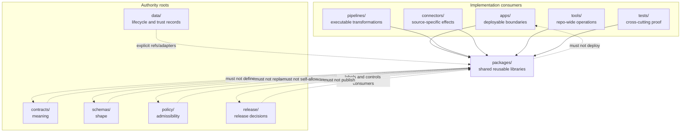

<!-- [KFM_META_BLOCK_V2]
doc_id: kfm://doc/packages-readme
title: packages/ — Governed Shared Implementation Package Root
type: readme; root-readme; canonical-packages-root; shared-library-boundary; mixed-language-workspace; package-maturity-index; drift-index
version: v0.3
status: draft; repository-grounded; canonical-root-confirmed; placeholder-heavy; mixed-language; mixed-maturity; package-wide-test-lane-unestablished; distribution-unverified; non-authoritative
owners: OWNER_TBD — Package steward · Architecture steward · Consumer owners · Contract/schema/policy stewards · Security and supply-chain reviewer · Validation/CI steward · Docs steward
created: 2026-06-15
updated: 2026-07-23
supersedes: v0.2 packages root contract
prepared_under_prompt: KFM Markdown Engineering, Modernization & GitHub Documentation Implementation Agent v5.0.0
policy_label: "public-doctrine; packages-root; shared-reusable-code; non-deployable; no-truth-authority; no-schema-authority; no-policy-authority; no-lifecycle-authority; no-release-authority; governed-interface-only; mixed-language; placeholder-heavy; distribution-unverified; correction-aware; rollback-aware"
current_path: packages/README.md
truth_posture: >
  CONFIRMED existing packages responsibility root and v0.2 target; Directory Rules v1.4
  packages/shared-library placement and mandatory root-README section order; root JavaScript
  workspace declaration for apps/* and packages/*; root Hatchling Python project limited to
  src/kfm; root package lint/test/build TODO markers; Makefile package-wide test absence;
  dependency-scan Python root audit and Node lockfile hold; ui-build Explorer Web readiness
  hold; CODEOWNERS /packages routing; bounded current index of at least twenty-one direct
  package README lanes; README-only api, evidence, and taxonomy boundaries at checked paths;
  private 0.0.0 MapLibre and UI npm scaffolds with placeholder exports; sampled 0.0.0 Python
  scaffolds with comment-only core modules; apps/packages dormant drift guard; and current
  absence at checked paths of packages/cesium and packages/maplibre-runtime /
  PROPOSED package admission, maturity, dependency-direction, package-contract, test,
  compatibility, deprecation, correction, distribution, and rollback requirements /
  CONFLICTED packages/maplibre versus proposed packages/maplibre-runtime; packages/evidence
  overlap with evidence-resolver, identity, hashing, and citation; apps/packages workspace
  anomaly; package-local versus cross-cutting test and fixture homes; and package names that
  resemble authority roots without owning their authority /
  UNKNOWN exhaustive recursive package inventory, all manifests and exports, complete
  dependency graph, import consumers, package-specific tests, package-wide CI, lockfile and
  package-manager decision, build reproducibility, registry distribution, deployment use,
  operational health, production behavior, and public effects /
  NEEDS VERIFICATION named owners, accepted package-boundary ADRs, complete consumer map,
  language/runtime support matrices, lockfile strategy, package APIs, dependency and
  supply-chain admission, test-home decision, compatibility windows, distribution policy,
  deprecation records, correction propagation, and rollback drills
evidence_snapshot:
  repository: bartytime4life/Kansas-Frontier-Matrix
  repository_id: "1059091169"
  visibility: public
  base_ref: main
  base_commit: 005aa64f6d42aa5961646e733289a2b857292357
  prior_blob: fc18fb3334fefe992a551fe12aa98c812232cd17
  directory_rules_blob: 2affb080e6f0043867c64c7f06c1ca52030fbd55
  root_package_manifest_blob: 62f45306aef7376a2d68042b0c9e7f556edf0e78
  root_python_manifest_blob: 3bba45d49de489c221734ee2446b21083f84fb28
  makefile_blob: 51537af34ee065c2de571134688415042b83b22a
  dependency_scan_workflow_blob: 96f207536ed5e26bf03c712cd12ceabba599165a
  ui_build_workflow_blob: a4fec64dc445b060d334c2ae56886cc814cb0e61
  codeowners_blob: dd2a84aa514d8ecd9208bc347f90f9a2ed37dd61
  apps_packages_drift_guard_blob: 5a9f5b2b7019cca476631cad3533bbdc2dbc9199
  packages_api_blob: 975956a8fac3e075409728fbf54307bd9eb2babc
  packages_domains_blob: 91ddf52a59932456b74b82d2710987f307bd0d80
  packages_evidence_blob: 74273775436287f35089c41e1e0c9f7c33f00645
  packages_evidence_resolver_blob: 9c616c83091977709a50c5cf02d8fbe37bfd4329
  packages_maplibre_blob: 3ba48e7d61b013a659ed51b9336eee788d06b8f2
  packages_release_blob: 749daf1f2cddbaa6b308584a630ac3f3d6707573
  packages_source_registry_blob: 6df77a248c72a17ddaeb5d701baf6e4d9db38eab
  packages_taxonomy_blob: 49492b00256211fc7344a2e434d0a5705080d33c
  bounded_direct_readme_lanes: "at least 21"
  inventory_method: exact GitHub file reads and probes plus current-commit repository index queries; counts and absence findings are bounded and do not establish a full recursive, all-branch, generated-file, or runtime-consumer inventory
related:
  - ../README.md
  - ../package.json
  - ../pyproject.toml
  - ../Makefile
  - ../docs/doctrine/directory-rules.md
  - ../docs/doctrine/trust-membrane.md
  - ../docs/doctrine/lifecycle-law.md
  - ../docs/architecture/contract-schema-policy-split.md
  - ../docs/adr/ADR-0001-schema-home--schemas-contracts-v1-is-canonical.md
  - ../docs/adr/ADR-0004-apps-governed-api-is-the-trust-membrane.md
  - ../docs/adr/ADR-0006-maplibre-boundary--only-maplibreadapter-imports-maplibre.md
  - "../docs/adr/ADR-0007 — MapLibre GL JS Is the Sole Browser-Side Renderer.md"
  - ../apps/README.md
  - ../apps/packages/README.md
  - ../apps/governed-api/README.md
  - ../connectors/README.md
  - ../pipelines/README.md
  - ../pipeline_specs/README.md
  - ../tools/README.md
  - ../tests/README.md
  - ../fixtures/README.md
  - ../contracts/README.md
  - ../schemas/README.md
  - ../policy/README.md
  - ../data/README.md
  - ../release/README.md
  - ../runtime/README.md
  - ../.github/CODEOWNERS
  - ../.github/workflows/dependency-scan.yml
  - ../.github/workflows/ui-build.yml
  - api/README.md
  - catalog/README.md
  - citation/README.md
  - connectors-core/README.md
  - domains/README.md
  - envelopes/README.md
  - evidence/README.md
  - evidence-resolver/README.md
  - geo/README.md
  - hashing/README.md
  - identity/README.md
  - maplibre/README.md
  - pipelines-core/README.md
  - policy-runtime/README.md
  - redaction/README.md
  - release/README.md
  - schema-registry/README.md
  - source-registry/README.md
  - taxonomy/README.md
  - temporal/README.md
  - ui/README.md
tags: [kfm, packages, shared-libraries, implementation, mixed-language, workspaces, package-boundary, trust-membrane, placeholders, dependency-direction, tests, distribution, compatibility, correction, rollback]
notes:
  - "v0.3 is a same-path repository-grounded modernization; it changes the packages root README and its generated provenance receipt only."
  - "The first twelve H2 sections now follow Directory Rules section 15 exactly."
  - "The bounded package registry is an orientation index, not a recursive manifest or implementation-attestation surface."
  - "No package code, manifest, export, dependency, lockfile, test, fixture, workflow, consumer, source activation, lifecycle record, release object, deployment, runtime, or public artifact is created or changed."
  - "The v0.2 document remains recoverable through the recorded prior blob and the v0.2-to-v0.3 no-loss ledger."
[/KFM_META_BLOCK_V2] -->

<a id="top"></a>
<a id="packages"></a>

# `packages/` — Governed Shared Implementation Package Root

> **One-line purpose.** Own reusable, non-deployable implementation libraries shared across KFM applications, pipelines, tools, workers, tests, and governed interfaces—without becoming a second authority for truth, contracts, schemas, policy, lifecycle state, release, or publication.

<p>
  <a href="#status"></a>
  <a href="#authority-level"></a>
  <a href="#current-bounded-package-inventory"></a>
  <a href="#status"></a>
  <a href="#workspace-build-and-distribution-boundaries"></a>
  <a href="#workspace-build-and-distribution-boundaries"></a>
  <a href="#trust-membrane-and-public-paths"></a>
</p>

> [!IMPORTANT]
> **A package name, README, manifest, source tree, `0.0.0` version, workspace match, or successful import does not prove a supported package capability.** Current evidence is placeholder-heavy: sampled trust-bearing Python cores contain comments only, while the sampled MapLibre and UI TypeScript entry points export placeholder values.

> [!CAUTION]
> **Top-level `packages/` is the shared-library authority.** [`apps/packages/`](../apps/packages/README.md) is a frozen drift-guard boundary, not another package root. Do not add package metadata, source code, tests, or authority beneath that anomalous path.

> [!WARNING]
> **Software distribution is not KFM publication.** Publishing a Python wheel, private workspace package, tarball, image, or registry artifact does not validate evidence, allow policy, promote lifecycle state, approve a data or claim release, or make anything `PUBLISHED`.

<a id="quick-jump"></a>

**Quick navigation**

| Root contract | Repository evidence | Change and operation |
|---|---|---|
| [Purpose](#purpose) · [Authority](#authority-level) · [Status](#status) · [Belongs](#what-belongs-here) · [Exclusions](#what-does-not-belong-here) | [Inputs](#inputs) · [Outputs](#outputs) · [Validation](#validation) · [Inventory](#current-bounded-package-inventory) · [Maturity](#package-maturity-model) · [Workspace](#workspace-build-and-distribution-boundaries) | [Review](#review-burden) · [Related](#related-folders) · [ADRs](#adrs) · [Conflicts](#compatibility-overlap-and-drift-register) · [Admission](#package-admission-and-graduation) · [Rollback](#compatibility-versioning-correction-and-rollback) |

---

<a id="1-purpose"></a>

## Purpose

`packages/` is the canonical KFM responsibility root for shared reusable implementation libraries.

A package earns this location when its primary responsibility is **reusable implementation behavior** rather than deployment, source acquisition, pipeline execution, repository-wide operation, semantic authority, machine-shape authority, policy, lifecycle storage, or release control.

```text
packages/       = reusable non-deployable implementation libraries
apps/           = deployable application boundaries
connectors/     = source-specific acquisition and admission edges
pipelines/      = executable lifecycle transformations and orchestration
tools/          = repository-wide validators, generators, builders, and operator tooling
contracts/      = object-family meaning
schemas/        = machine-checkable shape
policy/         = allow, deny, restrict, hold, and abstain decisions
data/           = lifecycle records, receipts, proofs, catalogs, and released artifacts
release/        = release, correction, withdrawal, and rollback decisions
```

Packages may help implement governed flows. They do not acquire authority by being imported into those flows.

### Design objective

A well-formed package should:

1. reduce duplicated implementation across verified consumers;
2. expose an intention-revealing and bounded interface;
3. accept explicit inputs instead of performing hidden source, network, policy, or lifecycle access;
4. preserve contract, schema, policy, evidence, temporal, release, and correction semantics;
5. remain independently testable with deterministic and public-safe fixtures;
6. document compatibility and rollback before consumer migration;
7. stay non-deployable and non-publishing.

This README does not activate a package, approve an API, accept a dependency, establish a test pass rate, authorize distribution, or publish a KFM claim or artifact.

[Back to top](#top)

---

<a id="2-placement-and-authority"></a>

## Authority level

**Canonical shared-implementation responsibility root; non-authoritative for truth, object meaning, machine shape, policy, lifecycle state, evidence closure, release, deployment, and publication.**

| Question | Root answer | Evidence posture |
|---|---|---:|
| Why does this root exist? | To hold reusable libraries used by more than one governed implementation surface or by a clearly shared bounded context. | **CONFIRMED** placement doctrine |
| Does a package define what an object means? | No. Semantic contracts remain under [`contracts/`](../contracts/README.md). | **CONFIRMED** responsibility split |
| Does a package own machine schema? | No. Canonical shape remains under [`schemas/`](../schemas/README.md). Generated types or adapters remain derived. | **CONFIRMED** responsibility split |
| May a package evaluate policy? | A policy-runtime helper may execute an explicitly supplied policy contract, but policy authority and rules remain under [`policy/`](../policy/README.md). | **PROPOSED / package-specific verification required** |
| May a package read lifecycle stores? | Internal helpers may receive explicit governed references or injected adapters. Packages must not normalize direct public-client access to internal stores. | **PROPOSED root contract** |
| May a package become an application or worker? | No. Deployable boundaries belong under [`apps/`](../apps/README.md). | **CONFIRMED** Directory Rules |
| May a package publish software? | Only after a separately accepted software-distribution contract. Software distribution does not grant KFM release or publication authority. | **UNKNOWN / NEEDS VERIFICATION** |
| May a package approve KFM release? | No. Release decisions remain under [`release/`](../release/README.md). | **CONFIRMED** authority boundary |

### Dependency-direction rule

Allowed direction is generally toward reusable implementation and away from deployable authority:

```text
apps / pipelines / connectors / tools / tests
                    |
                    v
                 packages
                    |
          explicit references only
                    v
contracts / schemas / policy / governed data and release interfaces
```

A package should not import an application, pipeline runner, connector executable, repository operator command, release decision store, or public UI shell. Package-to-package dependencies require an explicit, acyclic, reviewed graph.

[Back to top](#top)

---

## Status

### Evidence snapshot

| Surface | Current-session finding | Safe conclusion |
|---|---|---|
| Root path and target | `packages/README.md` exists at `main@005aa64f6d42aa5961646e733289a2b857292357`; prior blob `fc18fb3334fefe992a551fe12aa98c812232cd17`. | The canonical root README is being updated in place. |
| Root JavaScript workspace | [`package.json`](../package.json) selects `apps/*` and `packages/*`; generic `lint`, `test`, and `build` scripts are TODO echoes. | Workspace enrollment exists; package-wide build, lint, and test execution are not established. |
| Root Python build | [`pyproject.toml`](../pyproject.toml) uses Hatchling and builds only `src/kfm`; child package manifests are separate. | The root Python distribution does not establish a child-package workspace or build. |
| Repository Makefile | [`Makefile`](../Makefile) runs schema/contract validation and selected app/boundary checks, not a package-wide suite. | A root package test command is not established. |
| Direct package README lanes | Bounded current-commit reads and index results establish at least twenty-one immediate package README lanes. | The root has a substantial documented package surface; the count is not an exhaustive recursive manifest. |
| Sampled Python packages | Evidence resolver, policy runtime, schema/source registries, hashing, and identity have `0.0.0`-style scaffolds and comment-only `core.py` bodies; additional package READMEs describe similar scaffold maturity. | Package metadata and source paths exist, but sampled capability bodies are placeholders. |
| Sampled Node packages | `packages/maplibre` and `packages/ui` are private `0.0.0` packages whose inspected entry points export placeholder values. | Workspace package scaffolds exist; supported APIs, dependencies, builds, and consumers are not established. |
| README-only lanes | Exact checked paths leave `packages/api`, `packages/evidence`, and `packages/taxonomy` as documentation-only boundaries. | Do not treat these lanes as executable packages. |
| Package tests | `tests/packages/README.md` was not found at the checked path; package-specific READMEs report uneven or absent package-local tests. | No package-wide test home, collection contract, pass rate, or coverage is established. |
| Dependency audit | [`dependency-scan`](../.github/workflows/dependency-scan.yml) audits the root Python resolution; Node audit is an explicit hold because no root lockfile is committed. | Dependency scanning is partial and not reproducible for the full mixed-language package graph. |
| UI workflow | [`ui-build`](../.github/workflows/ui-build.yml) is an Explorer Web readiness check and currently requires a real script, exact pnpm pin, and lockfile. | It is not a package-root build or test suite. |
| Review routing | [CODEOWNERS](../.github/CODEOWNERS) routes `/packages/` to `@bartytime4life`. | Review routing exists; it is not independent approval or proof that review occurred. |
| Distribution and consumers | No complete registry publication, wheel/npm release, import-consumer graph, deployment binding, or production health evidence was established. | Distribution, adoption, and operational maturity remain **UNKNOWN**. |

### Current bounded conclusions

**CONFIRMED**

- `packages/` is the canonical shared-library root.
- The repository has both Node workspace metadata and Python package metadata.
- The root package landscape is placeholder-heavy and mixed-maturity.
- Several package-specific READMEs carry stronger evidence than this root index and remain the authority for their own bounded findings.
- `apps/packages/` is an anomaly and drift guard, not a package authority.
- `packages/maplibre/` exists; `packages/maplibre-runtime/` and `packages/cesium/` were not found at their checked paths.

**PROPOSED**

- The package maturity model, dependency-direction contract, admission sequence, and graduation gates below.
- A dedicated package inventory/test command and machine-readable package register.
- An accepted software-distribution and deprecation process.

**UNKNOWN / NEEDS VERIFICATION**

- Exhaustive package tree, complete dependency graph, exports, consumers, package-specific tests, package-manager choice, lockfile policy, CI coverage, distribution, deployment, and operational health.
- Accepted owners and reviewer separation.
- Final disposition of the MapLibre package name and the Evidence package overlap.

### Truth labels used here

| Label | Meaning |
|---|---|
| `CONFIRMED` | Verified from current-session repository files, exact path checks, or current-commit index results. |
| `PROPOSED` | A root contract, process, vocabulary, or future capability not yet established in implementation. |
| `UNKNOWN` | Not established strongly enough by the inspected repository evidence. |
| `NEEDS VERIFICATION` | A concrete check or decision is required before relying on the claim. |
| `CONFLICTED` | Current repository surfaces or governing documents point to competing responsibilities or names. |

[Back to top](#top)

---

<a id="3-root-contract"></a>
<a id="9-package-responsibilities"></a>

## What belongs here

Only reusable implementation material whose primary responsibility is shared-library behavior belongs under `packages/`.

| Admitted family | Examples | Required boundary |
|---|---|---|
| Pure and deterministic helpers | canonicalization, hashing candidates, identity formatting, temporal calculations, geometry operations | Explicit inputs; stable results; no hidden source, policy, or lifecycle writes |
| Contract/schema adapters | parsers, typed projections, generated carriers, compatibility mappers | Generated or hand-written behavior remains subordinate to pinned contract/schema versions |
| Governed runtime helpers | finite-outcome builders, evidence-resolution candidates, policy-evaluation adapters | Helpers cannot create truth, evidence closure, policy authority, or public permission |
| Shared domain helpers | identity mappers, parsers, crosswalks, public-safe transforms | Domain meaning remains in docs/contracts/schemas/policy; executable orchestration remains in pipelines |
| Shared UI components | trust badges, evidence-state components, bounded display helpers | Consume governed props; no direct canonical/internal-store access |
| Reusable validation support | local predicates, serializers, fixture builders, deterministic comparison utilities | Repository-wide validators and commands remain under `tools/`; tests remain under accepted test homes |
| Package-local metadata | manifests, source roots, export maps, build config, package README, changelog | Must describe actual implementation and supported consumers |
| Package-local tests | unit and contract-agreement tests tightly coupled to package code | Cross-cutting fixtures and integration proof remain under root `tests/` / `fixtures/` when shared |

### Root contract

Every active child package must make these facts inspectable:

- stable package identity and purpose;
- owning role or visible `OWNER_TBD`;
- language/runtime and supported version range;
- package manifest and build backend;
- source root and deliberate public exports;
- accepted inputs and finite output/error behavior;
- explicit non-ownership and prohibited side effects;
- contract, schema, policy, evidence, release, and temporal bindings;
- dependency direction and supply-chain posture;
- consumers and compatibility promises;
- package-local and cross-cutting tests;
- network, filesystem, telemetry, and secret-handling posture;
- versioning, deprecation, correction, and rollback path;
- current maturity with evidence—not aspirational prose.

> [!NOTE]
> A README may define a future boundary while implementation remains absent. In that case it must say `README-only`, `scaffold`, `PROPOSED`, or an equivalent bounded state; it must not describe a supported API, build, test pass, consumer, distribution, or production behavior.

[Back to top](#top)

---

<a id="6-exclusions"></a>

## What does NOT belong here

| Do not place or authorize under `packages/` | Correct responsibility or action |
|---|---|
| Deployable services, web shells, workers, CLIs, or admin applications | [`apps/`](../apps/README.md) |
| Source-specific fetchers, credentials, admission jobs, or live endpoint logic | [`connectors/`](../connectors/README.md) plus governed source registry |
| Executable lifecycle orchestration or one-off transformation runs | [`pipelines/`](../pipelines/README.md) or `tools/` as appropriate |
| Declarative pipeline intent | [`pipeline_specs/`](../pipeline_specs/README.md) |
| Repository-wide validators, generators, release builders, and operator commands | [`tools/`](../tools/README.md) |
| Human doctrine, architecture, package plans, or source authority prose | [`docs/`](../docs/README.md) or the package README only for local boundary documentation |
| Semantic contracts | [`contracts/`](../contracts/README.md) |
| Canonical schemas or a private competing schema registry | [`schemas/`](../schemas/README.md) |
| Policy rules, permissions, consent, sensitivity, rights, or release decisions | [`policy/`](../policy/README.md) |
| RAW, WORK, QUARANTINE, PROCESSED, catalog, triplet, receipt, proof, or published data | [`data/`](../data/README.md) |
| Release manifests, promotion decisions, corrections, withdrawals, or rollback cards | [`release/`](../release/README.md) |
| Secrets, private endpoints, protected coordinates, sensitive source payloads, or production credentials | Approved secret/configuration systems; never a public package source or fixture |
| Raw model output, generated prose, rendered map state, or package results presented as truth | Governed evidence, policy, review, and release flow |
| A task used by one workflow with no reusable package API | `tools/` or `pipelines/`; do not create a convenience package |
| A second package root under `apps/` | Keep [`apps/packages/`](../apps/packages/README.md) frozen as a drift guard pending disposition |

Names such as `release`, `policy-runtime`, `schema-registry`, `source-registry`, `evidence`, or `api` describe helper contexts. They do **not** transfer the authority of `release/`, `policy/`, `schemas/`, `data/registry/`, evidence/proof homes, or `apps/governed-api/` into a package.

[Back to top](#top)

---

<a id="5-inputs"></a>

## Inputs

Package APIs should use explicit, bounded, caller-supplied inputs.

| Input family | Examples | Admission requirement |
|---|---|---|
| Primitive and value inputs | IDs, timestamps, coordinates, strings, enumerations | Validated shape and explicit semantics |
| Contract-shaped objects | envelopes, descriptors, manifests, references | Pinned semantic contract and compatible schema |
| Governed references | `EvidenceRef`, source descriptor ref, release ref, policy decision ref | Resolve through the owning service or registry; do not fabricate closure |
| Released/public-safe payloads | governed API responses, layer descriptors, public-safe features | Release and policy posture already carried with the payload |
| Internal candidate objects | normalized records, candidate transforms, validation inputs | Explicit lifecycle phase; never public by package default |
| Synthetic fixtures | valid, invalid, denied, abstain, stale, sensitive, rollback cases | Clearly synthetic, deterministic, and public-safe |
| Configuration | injected limits, accepted profiles, local registry snapshots | Non-secret, validated, versioned where material |
| Dependency adapters | storage, network, policy, evidence, clock, filesystem interfaces | Injected and bounded; hidden I/O is prohibited |

### Input rules

- Package functions should not discover production stores, credentials, endpoints, model providers, policy bundles, or source systems implicitly.
- A reference passed to a package is not proof that the referenced object exists, is allowed, or is released.
- Sensitive-domain inputs must be minimized and public-safe before entering ordinary package fixtures or logs.
- Network access, filesystem writes, subprocess execution, nondeterminism, and telemetry must be explicit effects behind tested interfaces.
- A package may return a candidate or validation result. It may not silently promote that result into evidence, policy, lifecycle, or release state.

[Back to top](#top)

---

## Outputs

Allowed package outputs remain implementation values, candidates, or software artifacts.

| Output family | Examples | Authority limit |
|---|---|---|
| Pure return values | normalized value objects, hashes, temporal intervals, geometry candidates | Result is local implementation output, not truth or release |
| Typed adapters | DTOs, generated types, contract/schema projections | Derived from pinned inputs; cannot redefine source authority |
| Finite helper results | success/failure candidate, reason codes, validation details | Must not collide with or replace official runtime/policy/release enums |
| Candidate records | proposed EvidenceRef resolution, catalog row, redaction transform, release-candidate input | Requires external validation, policy, review, and persistence |
| UI components and props | trust-visible display components, state renderers | Render only governed data; no hidden public access |
| Test support | deterministic builders, snapshots, synthetic payloads | Test evidence only; not a production record |
| Software build artifacts | wheel, JavaScript bundle, type declaration, source map | Distribution event only; not KFM publication |
| Package diagnostics | structured errors, bounded metrics, debug summaries | No secrets, raw evidence, prompts, protected coordinates, or sensitive payloads |

Packages must not write authoritative records directly to `data/catalog/`, `data/published/`, `release/`, policy stores, source authority registers, proof stores, or public APIs. An owning application, pipeline, tool, or reviewed workflow performs those state changes under its own controls.

[Back to top](#top)

---

<a id="11-inspection-path"></a>
<a id="12-validation-expectations"></a>

## Validation

### Current repository validation posture

| Surface | What it currently does | What it does not prove |
|---|---|---|
| Root `npm run lint/test/build` | Prints TODO markers. | No package lint, test, build, export, or workspace health. |
| `make validate` | Runs aggregate schema validators and schema/contract tests. | No package API, import, consumer, build, or compatibility proof. |
| `dependency-scan` Python job | Audits dependencies resolved from the root Python project. | Child-package dependency closure, a locked resolution, or vulnerability absence. |
| `dependency-scan` Node job | Explicitly holds because no root lockfile is committed. | Node dependency safety or reproducible workspace installation. |
| `ui-build` | Fails closed until Explorer Web has real scripts, an exact pnpm pin, and a lockfile. | Package-root build/test readiness or package consumer compatibility. |
| Package-specific READMEs | Record bounded package findings and proposed validation. | Execution unless a current test or run is cited. |
| CODEOWNERS | Routes `/packages/` review requests. | Test success, approval, independent review, release, or publication. |

### Minimum validation for an implementation-bearing package

1. **Manifest:** parse the package manifest; verify name, version, build backend, runtime support, dependencies, and distribution posture.
2. **Source:** reject comment-only or placeholder-only public modules when the package is described as implementation-bearing.
3. **Exports:** verify the declared public API, import path, generated files, and absence of accidental internal exports.
4. **Unit tests:** exercise deterministic positive, invalid, denied, abstain, stale, sensitive, failure, and rollback-adjacent cases as applicable.
5. **Contract/schema agreement:** compare package types and adapters with pinned contracts and schemas.
6. **Effect boundaries:** test no hidden network, filesystem, source, model, policy, lifecycle, or release access.
7. **Consumer agreement:** run representative consumers against the exact package revision.
8. **Dependency boundaries:** detect cycles, imports from deployable/application roots, forbidden renderer/model imports, and unreviewed package-to-package coupling.
9. **Supply chain:** use the accepted package manager, committed lock or equivalent deterministic resolution, license review, vulnerability scan, and provenance/attestation policy.
10. **Compatibility:** test supported versions, migration adapters, deprecated exports, and rollback.
11. **Documentation:** ensure package README, examples, changelog, and generated API references match implemented behavior.
12. **CI:** give package checks stable names and fail closed on zero collection, placeholder scripts, or missing build prerequisites.

### Inspection commands—not supported build claims

The following commands help inventory a mounted checkout. They are not a declaration that package build/test commands currently exist.

```bash
# Direct package lanes and local README contracts.
find packages -mindepth 1 -maxdepth 1 -type d -print | sort
find packages -mindepth 2 -maxdepth 3 -name README.md -print | sort

# Manifests, source roots, and common build metadata.
find packages -mindepth 2 -maxdepth 4 \
  \( -name package.json -o -name pyproject.toml -o -name Cargo.toml \
     -o -name go.mod -o -name tsconfig.json -o -name setup.cfg \) \
  -print | sort

# Placeholder and export signals for review; inspect results manually.
git grep -nE 'greenfield placeholder|placeholder = true|TODO:.*(build|test|lint)' -- packages package.json Makefile

# Candidate package tests and consumers.
find tests fixtures -type f 2>/dev/null | grep -E '(^|/)packages(/|_)' | sort
git grep -nE '(@kfm/|from (evidence_resolver|policy_runtime|schema_registry|source_registry|hashing|identity)\b)' -- apps packages pipelines tools tests
```

### Validation outcome for this README change

This change is documentation and provenance only. It does not modify package code, manifests, dependencies, exports, tests, fixtures, workflows, consumers, distributions, lifecycle state, releases, deployments, or runtime behavior. Package-native execution is therefore not claimed by this update.

[Back to top](#top)

---

## Review burden

[CODEOWNERS](../.github/CODEOWNERS) currently routes `/packages/` to `@bartytime4life`. That routing is **CONFIRMED**, but it is not a stewardship assignment, independent approval, branch-protection guarantee, PolicyDecision, software-distribution approval, KFM release decision, or proof that review occurred.

| Change class | Minimum review focus |
|---|---|
| README or metadata clarification | Package boundary, evidence labels, links, compatibility, and consumer accuracy |
| New package lane | Directory Rules placement, existing equivalent packages, reusable consumer case, name/authority collision, owners, tests, rollback |
| Public export or API change | Package owner, representative consumers, contract/schema agreement, compatibility and migration |
| Dependency or build change | Package/build steward, supply-chain/security review, lockfile strategy, licensing, deterministic build |
| Evidence, policy, source, identity, hashing, redaction, release, or temporal helper | Relevant trust-object stewards plus negative fixtures and authority-boundary review |
| Renderer/UI package | Explorer Web, MapLibre boundary, accessibility, performance, privacy, plugin/protocol, and consumer review |
| Sensitive-domain package | Domain steward, rights/sensitivity/security review, public-safe fixtures, no-log and no-reconstruction controls |
| Distribution or deprecation | Package owner, consumers, security, release/distribution steward, compatibility window, correction and rollback |

The author of generated package code or documentation must not treat a generated receipt, passing test, merge, software package release, or workspace build as human review or KFM publication approval.

[Back to top](#top)

---

## Related folders

| Surface | Relationship to `packages/` |
|---|---|
| [`apps/`](../apps/README.md) | Deployable consumers; public clients enter through governed applications, not packages directly. |
| [`apps/packages/`](../apps/packages/README.md) | Frozen anomaly and drift guard; not a shared-package root. |
| [`apps/governed-api/`](../apps/governed-api/README.md) | Executable trust membrane; package helpers remain subordinate to its server-side controls. |
| [`connectors/`](../connectors/README.md) | Source acquisition/admission; may consume shared helpers but owns source-specific effects. |
| [`pipelines/`](../pipelines/README.md) | Executable lifecycle transformations; may consume packages but owns orchestration. |
| [`pipeline_specs/`](../pipeline_specs/README.md) | Declarative intent; does not become a package configuration authority. |
| [`tools/`](../tools/README.md) | Repository-wide validators, builders, and operator commands; one-off or trust-bearing commands do not hide inside packages. |
| [`tests/`](../tests/README.md) and [`fixtures/`](../fixtures/README.md) | Cross-cutting enforceability and public-safe test inputs. |
| [`contracts/`](../contracts/README.md) | Semantic meaning that package APIs must preserve. |
| [`schemas/`](../schemas/README.md) | Machine shape that package types/adapters must match. |
| [`policy/`](../policy/README.md) | Admissibility and obligations; packages may execute injected policy helpers but do not own policy. |
| [`data/`](../data/README.md) | Lifecycle state and trust artifacts; packages do not become public or authoritative storage paths. |
| [`release/`](../release/README.md) | Release, correction, withdrawal, and rollback authority; distinct from `packages/release/`. |
| [`runtime/`](../runtime/README.md) | Local/provider adapters and harnesses; packages remain reusable libraries rather than runtime surfaces. |
| [`package.json`](../package.json) | Root Node workspace selector; generic scripts remain placeholders and lockfile policy is unresolved. |
| [`pyproject.toml`](../pyproject.toml) | Root Python distribution; currently builds `src/kfm`, not all child package projects. |
| [`Makefile`](../Makefile) | Repository orchestration; currently has no package-wide validation target. |

[Back to top](#top)

---

## ADRs

The following repository-present ADRs affect package boundaries. Their current decision status remains proposed or draft; this README does not accept them.

| ADR | Package relevance | Current posture |
|---|---|---:|
| [ADR-0001 — schema home](../docs/adr/ADR-0001-schema-home--schemas-contracts-v1-is-canonical.md) | Generated types and schema-registry helpers remain subordinate to `schemas/contracts/v1/`. | `proposed` |
| [ADR-0004 — governed API trust membrane](../docs/adr/ADR-0004-apps-governed-api-is-the-trust-membrane.md) | `packages/api/` is not the public API server; package consumers must preserve the governed boundary. | draft document / proposed decision |
| [ADR-0006 — MapLibre import boundary](../docs/adr/ADR-0006-maplibre-boundary--only-maplibreadapter-imports-maplibre.md) | Would constrain renderer imports to an adapter package and application seam. | draft document / proposed decision |
| [ADR-0007 — MapLibre sole browser-side renderer](../docs/adr/ADR-0007%20%E2%80%94%20MapLibre%20GL%20JS%20Is%20the%20Sole%20Browser-Side%20Renderer.md) | Drives the proposed `packages/maplibre-runtime/` name and the unresolved transition from `packages/maplibre/`. | `PROPOSED` |

An accepted ADR or migration record is required before changing the canonical package root, promoting `apps/packages/`, creating parallel authority, or performing the MapLibre package rename/retirement.

[Back to top](#top)

---

## Last reviewed

| Field | Value |
|---|---|
| Review date | 2026-07-23 |
| Evidence base | `main@005aa64f6d42aa5961646e733289a2b857292357` |
| Target before revision | blob `fc18fb3334fefe992a551fe12aa98c812232cd17` |
| Review depth | Complete target read; Directory Rules and relevant ADRs; root JavaScript/Python/Makefile/workflow/CODEOWNERS surfaces; bounded package README inventory; representative package manifests and source bodies; exact drift-path checks |
| Runtime/package execution | Not performed for this documentation-only update |
| Next scheduled review | On package-root structural change, accepted package-boundary ADR, package-manager/lockfile decision, package-wide CI introduction, first supported package distribution, or no later than 2027-01-23 |

> [!NOTE]
> A date in this README records the documentation evidence pass. It is not a human approval, package certification, supported-version promise, distribution approval, release decision, or publication state.

[Back to top](#top)

---

<a id="8-diagram"></a>

## Operating model and dependency direction


```mermaid
flowchart TB
    subgraph Consumers["Implementation consumers"]
        APPS["apps/<br/>deployable boundaries"]
        PIPELINES["pipelines/<br/>executable transformations"]
        CONNECTORS["connectors/<br/>source-specific effects"]
        TOOLS["tools/<br/>repo-wide operations"]
        TESTS["tests/<br/>cross-cutting proof"]
    end

    PACKAGES["packages/<br/>shared reusable libraries"]

    subgraph Authorities["Authority roots"]
        CONTRACTS["contracts/<br/>meaning"]
        SCHEMAS["schemas/<br/>shape"]
        POLICY["policy/<br/>admissibility"]
        DATA["data/<br/>lifecycle and trust records"]
        RELEASE["release/<br/>release decisions"]
    end

    APPS --> PACKAGES
    PIPELINES --> PACKAGES
    CONNECTORS --> PACKAGES
    TOOLS --> PACKAGES
    TESTS --> PACKAGES

    CONTRACTS -. "constrains" .-> PACKAGES
    SCHEMAS -. "validates" .-> PACKAGES
    POLICY -. "gates external use" .-> PACKAGES
    DATA -. "explicit refs/adapters" .-> PACKAGES
    RELEASE -. "labels and controls consumers" .-> PACKAGES

    PACKAGES -. "must not deploy" .-> APPS
    PACKAGES -. "must not define" .-> CONTRACTS
    PACKAGES -. "must not replace" .-> SCHEMAS
    PACKAGES -. "must not self-allow" .-> POLICY
    PACKAGES -. "must not publish" .-> RELEASE
```

### Package dependency constraints

- **Consumer-to-package:** allowed when the package API is deliberate, tested, and compatible.
- **Package-to-package:** allowed only through declared dependencies with clear ownership and no cycles.
- **Package-to-app/pipeline/tool executable:** denied; reverse the dependency or extract a narrower shared interface.
- **Package-to-authority store:** use explicit interfaces or immutable inputs; do not mutate canonical stores.
- **Domain-to-cross-cutting package:** allowed when domain meaning is preserved.
- **Cross-domain package coupling:** requires an explicit context map; one domain package must not silently become another domain's authority.
- **Generated code:** generated package files must retain generator, schema/contract version, source hash, and regeneration/rollback instructions.

[Back to top](#top)

---

<a id="7-package-map"></a>

## Current bounded package inventory

This is a **bounded orientation index**, not an exhaustive recursive manifest. It records at least twenty-one immediate README lanes established through current-session exact reads or current-commit index results. Follow the child README for package-specific evidence.

| Lane | Bounded current evidence | Root-level maturity conclusion |
|---|---|---|
| [`api/`](api/README.md) | README exists; package manifest/source/tests were not observed at checked paths. | Documentation-only boundary |
| [`catalog/`](catalog/README.md) | Shared catalog-helper contract is documented; current functional API was not re-proven here. | Documented package lane; implementation needs package-specific verification |
| [`citation/`](citation/README.md) | Citation/EvidenceRef helper boundary is documented; concrete behavior remains bounded by its README. | Documented package lane; implementation needs package-specific verification |
| [`connectors-core/`](connectors-core/README.md) | Current README records `0.0.0` Python scaffold, empty initializer, and comment-only core. | Python scaffold / placeholder |
| [`domains/`](domains/README.md) | Umbrella README exists with numerous domain sublanes; exhaustive child maturity was not established. | Mixed-maturity umbrella |
| [`envelopes/`](envelopes/README.md) | Current README records a Python scaffold and unresolved contract/schema vocabulary. | Python scaffold / non-authoritative |
| [`evidence/`](evidence/README.md) | README-only at checked package paths; responsibility overlaps sibling evidence packages. | Documentation-only / purpose conflicted |
| [`evidence-resolver/`](evidence-resolver/README.md) | `0.0.0` Python metadata and comment-only core sampled; resolver/API/consumer unverified. | Python scaffold / placeholder |
| [`geo/`](geo/README.md) | Package README reports a repository-grounded Python scaffold; current capability requires child evidence. | Scaffold / package-specific verification |
| [`hashing/`](hashing/README.md) | Comment-only core sampled; canonicalization/profile/API unresolved. | Python scaffold / placeholder |
| [`identity/`](identity/README.md) | Comment-only core sampled; identity grammar and consumer adoption unresolved. | Python scaffold / placeholder |
| [`maplibre/`](maplibre/README.md) | Private `@kfm/maplibre` `0.0.0` manifest and placeholder TypeScript export; no supported adapter API or consumer established. | Node workspace scaffold / naming conflicted |
| [`pipelines-core/`](pipelines-core/README.md) | Current README identifies a Python package scaffold; executable pipelines remain under `pipelines/`. | Python scaffold / non-orchestrating |
| [`policy-runtime/`](policy-runtime/README.md) | Comment-only core sampled; policy rules remain under `policy/`. | Python scaffold / placeholder |
| [`redaction/`](redaction/README.md) | Current README identifies a Python package scaffold; authoritative sensitivity policy remains external. | Python scaffold / package-specific verification |
| [`release/`](release/README.md) | `0.0.0` Python scaffold and comment-only core; release authority remains root `release/`. | Python scaffold / candidate support only |
| [`schema-registry/`](schema-registry/README.md) | Comment-only core sampled; canonical schemas remain under `schemas/`. | Python scaffold / helper only |
| [`source-registry/`](source-registry/README.md) | `0.0.0` Python scaffold and comment-only core; source authority and schema paths remain conflicted. | Python scaffold / placeholder |
| [`taxonomy/`](taxonomy/README.md) | README-only at checked paths; accepted shared taxonomy authority and API unresolved. | Documentation-only / authority unresolved |
| [`temporal/`](temporal/README.md) | Package README exists; supported temporal API and test depth require package-specific evidence. | Documented/scaffold lane |
| [`ui/`](ui/README.md) | Private `@kfm/ui` `0.0.0` manifest and placeholder TypeScript export sampled. | Node workspace scaffold / placeholder |

### Inventory rules

- A row means the lane is repository-visible in bounded evidence; it does not prove every nested file, export, test, consumer, or branch.
- Child README evidence may be newer and more specific than this root summary.
- When a lane's implementation changes materially, update the child README and then reconcile this root index.
- A package omitted from this bounded table is not thereby absent. Add it only after exact current-revision verification.
- Do not count `apps/packages/` as a package lane.
- Do not create `packages/maplibre-runtime/` or remove/rename `packages/maplibre/` through documentation alone.

[Back to top](#top)

---

## Package maturity model

The following vocabulary is **PROPOSED** for consistent package reporting. It is not a claim that any package has graduated.

| State | Minimum evidence | Must not be inferred from |
|---|---|---|
| `README_ONLY` | Package boundary README; no supported implementation claimed | Folder or title alone |
| `SCAFFOLD` | Manifest/source layout exists; implementation may be placeholder | `0.0.0`, empty initializer, comment-only core, placeholder export |
| `CANDIDATE` | Non-placeholder API plus local tests and explicit dependencies | Successful import alone |
| `IMPLEMENTATION_BEARING` | Supported exports, deterministic tests, contract/schema agreement, effect boundaries | README promises or build metadata alone |
| `CONSUMER_VERIFIED` | Representative pinned consumers pass agreement tests | Search result or intended consumer list |
| `DISTRIBUTION_READY` | Reproducible locked build, provenance, license/security review, version/compatibility policy | Private manifest or artifact creation |
| `DEPRECATED` | Replacement, consumer migration, sunset, correction, and rollback records exist | Silent abandonment |
| `RETIRED` | Consumers removed or migrated; compatibility window closed; lineage preserved | Directory deletion |

### Graduation evidence

A package does not graduate because:

- its README is polished;
- its manifest parses;
- its version is nonzero;
- a placeholder test passes;
- a workspace glob includes it;
- a dependency audit is green;
- a build artifact exists;
- a PR merges;
- a software package publishes.

Graduation requires the evidence named for the state and a reviewed update to the package boundary.

[Back to top](#top)

---

## Workspace, build, and distribution boundaries

### Current mixed-language posture

| Concern | Confirmed repository surface | Consequence |
|---|---|---|
| JavaScript workspace selection | Root `package.json` selects immediate `apps/*` and `packages/*` children. | An immediate package with `package.json` can enter workspace tooling; placement and manifest review are required. |
| JavaScript manager/lock | No root package-manager pin or common lockfile was established by the inspected workflows. | Deterministic workspace install and Node dependency audit remain held. |
| JavaScript root scripts | Generic `lint`, `test`, and `build` are TODO echoes. | Do not cite them as executable package commands. |
| Python root distribution | Hatchling builds only `src/kfm`. | Child `packages/*/pyproject.toml` projects are not automatically built or tested by the root project. |
| Python child scaffolds | Several child packages declare separate `0.0.0` project metadata. | Each needs an explicit build backend, discovery, runtime support, dependencies, tests, and consumer contract. |
| Repository Makefile | No aggregate package target exists. | Root validation does not imply package validation. |
| Dependency scan | Root Python audit is point-in-time; Node audit is an explicit no-lockfile hold. | Supply-chain closure remains partial. |

### Distribution is a separate control plane

Before a package is distributed internally or externally, verify:

- package identity and owner;
- intended consumers and registry;
- supported runtime and platforms;
- dependency and lockfile policy;
- license, notices, and third-party review;
- build reproducibility and provenance;
- signatures or attestations where required;
- public export and compatibility policy;
- vulnerability response and correction path;
- deprecation, withdrawal, and rollback;
- distinction between software distribution and KFM data/claim release.

`private: true` blocks ordinary npm publication intent; it is not a security boundary or a complete distribution policy. A Python `pyproject.toml` does not authorize registry upload. No package distribution is approved by this README.

[Back to top](#top)

---

<a id="4-trust-membrane-rule"></a>

## Trust membrane and public paths

Shared packages must preserve the public trust path rather than creating convenient bypasses.

```text
released artifacts / governed records
        -> apps/governed-api or another accepted governed interface
        -> package adapters and UI components
        -> public or review client

not:

public client -> package -> RAW / WORK / QUARANTINE / internal store / model runtime
```

| Package behavior | Posture |
|---|---:|
| Parse a caller-supplied governed envelope | Allowed after contract/schema agreement |
| Render already-governed props | Allowed |
| Resolve an explicitly supplied local registry snapshot | Candidate; package-specific policy and tests required |
| Fetch a source, model, policy bundle, or internal store implicitly | Denied by default |
| Read RAW/WORK/QUARANTINE from browser or public client code | Denied |
| Create an `EvidenceBundle` by assembling unchecked references | Denied |
| Treat a citation, hash, map feature, model score, or package result as truth | Denied |
| Evaluate policy without carrying policy identity, version, inputs, outcome, and obligations | Denied |
| Write catalog, proof, release, correction, rollback, or published records directly | Denied unless the owning governed workflow explicitly invokes a bounded package primitive and retains authority |
| Log secrets, raw evidence, prompts, DNA/living-person data, exact rare-species/archaeology locations, or infrastructure vulnerabilities | Denied |

Package APIs should prefer:

- explicit effect adapters;
- immutable inputs;
- deterministic pure functions;
- finite, typed results;
- bounded errors and reason codes;
- no-network unit tests;
- public-safe fixtures;
- caller-owned persistence and authority decisions.

[Back to top](#top)

---

<a id="10-child-package-expectations"></a>

## Child package contract

Every implementation-bearing child package should document and prove the following.

### Identity and boundary

- package path, import/distribution name, version, and owner;
- one-sentence purpose and non-goals;
- bounded context and ubiquitous terminology;
- consumers and dependency direction;
- why reuse belongs in `packages/` rather than an app, connector, pipeline, tool, or runtime lane.

### Manifest and source

- accepted package manager/build backend and deterministic resolution;
- supported language/runtime versions;
- source root, public export map, internal modules, generated files;
- explicit dependencies, peer/runtime relationships, licenses, and supply-chain references;
- no placeholder scripts or comment-only exported modules once implementation-bearing.

### Trust and effects

- accepted input profiles and output/result vocabulary;
- contract/schema/policy/evidence/release references;
- network, filesystem, subprocess, clock, randomness, telemetry, cache, and secret behavior;
- sensitivity, public-safe transformation, logging, and failure defaults;
- no direct publication or source activation.

### Tests and consumers

- package-local unit tests;
- valid, invalid, denied, abstain, stale, sensitive, correction, migration, and rollback fixtures where applicable;
- contract/schema agreement tests;
- dependency and import-boundary tests;
- representative consumer tests;
- CI commands, stable check names, coverage posture, and zero-collection failure.

### Lifecycle and maintenance

- semantic version and compatibility policy;
- migration and deprecation window;
- correction and vulnerability-response route;
- consumer rollback and last-known-good reference;
- distribution withdrawal procedure;
- generated provenance receipt for material AI-authored changes.

[Back to top](#top)

---

## Compatibility, overlap, and drift register

| Item | Current status | Safe posture |
|---|---:|---|
| `packages/maplibre/` versus proposed `packages/maplibre-runtime/` | **CONFLICTED** | Keep current path stable. Do not create a second renderer package or rename until the proposed ADR and migration are accepted and consumers are inventoried. |
| `packages/evidence/` versus evidence-resolver/identity/hashing/citation | **CONFLICTED** | Freeze broad implementation under `evidence/` until responsibilities are partitioned by accepted decision; do not duplicate APIs. |
| `apps/packages/` | **CONFIRMED anomaly / disposition open** | Keep frozen as a drift guard. Prefer verified removal or an ADR-backed temporary exception; never treat it as shared-package authority. |
| `packages/api/` versus `apps/governed-api/` | **Boundary documented; implementation absent at checked paths** | `packages/api/` may hold reusable client/contract helpers only; server routing and policy remain in the app. |
| `packages/release/` versus `release/` | **Name collision by topic, not authority** | Package may provide deterministic candidate helpers; root `release/` retains decisions, manifests, correction, and rollback authority. |
| `packages/schema-registry/` versus `schemas/` | **Potential authority confusion** | Package resolves caller-supplied canonical schemas; it never becomes schema source authority. |
| `packages/source-registry/` versus `data/registry/` | **Potential authority confusion plus schema conflict** | Package parses/cross-checks explicit records; registry and source-admission authority remain external. |
| Package-local tests versus root `tests/`/`fixtures/` | **NEEDS VERIFICATION** | Document a non-competing split before adding duplicate fixture or test homes. |
| Root Node workspace without lockfile or manager pin | **CONFIRMED readiness hold** | Do not perform nondeterministic package installs/audits or claim reproducible builds. |
| Placeholder packages named as capabilities | **CONFIRMED widespread risk** | Use maturity labels and reject implementation claims until non-placeholder code, exports, tests, and consumers exist. |

Do not resolve these items by prose alone. Use the drift register, verification backlog, ADR, package-boundary decision, or migration record appropriate to the authority change.

[Back to top](#top)

---

<a id="13-safe-change-pattern"></a>

## Package admission and graduation

### New package admission sequence

1. **Prove responsibility.** The proposed code is reusable library behavior, not a deployable, connector, pipeline, tool, runtime harness, authority object, or convenience bucket.
2. **Search for an existing owner.** Inspect current packages, apps, tools, pipelines, contracts, schemas, policy, registries, and ADRs for overlapping responsibility.
3. **Name the bounded context.** Avoid names that imply authority the package does not own.
4. **Identify consumers.** Establish at least two credible consumers or one clearly cross-cutting governed context; do not invent consumers.
5. **Define explicit effects.** Network, storage, policy, evidence, model, clock, randomness, and telemetry interfaces must be injected and bounded.
6. **Add the smallest complete skeleton.** README, manifest, source root, deliberate exports, test location, and one non-placeholder implementation slice.
7. **Prove negative behavior.** Add invalid/denied/abstain/sensitive/error cases, not only a happy path.
8. **Run consumer agreement.** Verify representative consumers at the pinned package revision.
9. **Record compatibility and rollback.** Version, migration, deprecation, and last-known-good target must be visible.
10. **Update this index.** Add the lane only after current-revision verification.

### Graduation gates

A package moves beyond `SCAFFOLD` only when:

- the manifest is complete and deterministic;
- public exports are deliberate;
- implementation is non-placeholder;
- tests are collected and passing;
- contracts/schemas/policies are pinned where relevant;
- side effects are explicit and fail safely;
- representative consumers are verified;
- dependency/security/license review is complete;
- documentation matches behavior;
- compatibility and rollback are actionable;
- review is independent where trust significance requires it.

### Safe change pattern for an existing package

1. Read the package README, manifest, source, tests, consumers, ADRs, and recent history.
2. Preserve the package's authority boundary.
3. Prefer additive compatible changes; version breaking semantics deliberately.
4. Update generated types/adapters from pinned sources, never by manual divergence.
5. Run package-local and consumer agreement tests.
6. Record security, dependency, performance, and sensitivity effects.
7. Update docs, changelog, migration/deprecation notes, and provenance.
8. Keep rollback possible without deleting history.

[Back to top](#top)

---

## Compatibility, versioning, correction, and rollback

### Compatibility

- Do not reuse a version for changed semantics.
- Package version, contract version, schema version, policy version, data release, and KFM publication state are separate.
- Generated adapters must record their source contract/schema versions and generator.
- Compatibility shims must have owners, consumers, expiry, tests, and removal criteria.
- A package rename or move requires consumer inventory, import compatibility, migration, deprecation, and rollback—not a documentation alias alone.

### Correction and security response

A package defect may invalidate:

- consumer outputs;
- generated types or adapters;
- pipeline candidates;
- receipts and validation reports;
- evidence-resolution candidates;
- catalog or release candidates;
- public derivatives produced by affected consumers.

The owning incident/correction flow must identify affected versions and consumers, stop unsafe use, preserve evidence, issue correction or withdrawal records where required, rebuild derivatives, and verify cache invalidation. A package README cannot perform that state transition.

### Rollback

For material package changes, record:

- last-known-good commit and package version;
- affected exports and consumers;
- data/release derivatives that may need invalidation;
- dependency/lockfile state;
- migration and reverse-migration steps;
- compatibility adapter or feature flag;
- verification commands and expected results;
- owner/reviewer state.

Documentation rollback for this README is ordinary Git rollback. It changes no package runtime, software distribution, KFM lifecycle state, or public release.

[Back to top](#top)

---

<a id="14-definition-of-done"></a>

## Definition of done

### Root README

- [x] Same canonical path and document identity retained.
- [x] Directory Rules root-README section order applied.
- [x] v0.2 authority, trust-membrane, input/output, validation, package-map, safe-change, done, and open-item substance preserved or strengthened.
- [x] Mixed Python/Node workspace posture documented without inventing a package manager or supported build.
- [x] Bounded current package inventory replaces the four-lane v0.2 sample.
- [x] Placeholder implementation is separated from package-path presence.
- [x] `apps/packages/`, MapLibre naming, Evidence overlap, test-home, and distribution conflicts remain visible.
- [x] Public interfaces, evidence, policy, lifecycle, release, correction, and rollback boundaries are explicit.
- [ ] Named accountable owners confirmed.
- [ ] Exhaustive recursive package inventory generated from a pinned tree.
- [ ] Machine-readable package registry accepted and populated.
- [ ] Package-wide build, test, import, consumer, and dependency checks accepted and wired.
- [ ] Package manager, lockfile, distribution, compatibility, and deprecation policies accepted.

### Implementation-bearing child package

- [ ] Purpose, authority, owners, consumers, and non-goals are current.
- [ ] Manifest, source root, build backend, runtime support, dependencies, license, and exports are explicit.
- [ ] Public implementation is non-placeholder.
- [ ] Inputs, effects, errors, and result vocabulary are bounded.
- [ ] Contract/schema/policy/evidence/release references are versioned.
- [ ] Unit, negative, contract-agreement, import-boundary, and consumer tests pass.
- [ ] Package distribution is reproducible and separately approved where used.
- [ ] Compatibility, correction, deprecation, withdrawal, and rollback are actionable.
- [ ] Generated provenance and human review remain distinct.

[Back to top](#top)

---

<a id="15-open-verification-items"></a>

## Open verification register

| Item | State | Verification or decision required |
|---|---:|---|
| Exhaustive direct and recursive package inventory | `NEEDS VERIFICATION` | Generate a pinned `git ls-tree`/checkout inventory and compare with this index. |
| Named package owners and reviewer separation | `NEEDS VERIFICATION` | Confirm stewardship assignments; do not infer them from CODEOWNERS. |
| Node package manager and lockfile | `NOT ESTABLISHED` | Accept one manager/version, commit authoritative lockfile, update workflows, and test deterministic install. |
| Python child-package workspace/build model | `UNKNOWN` | Decide independent builds versus a workspace tool; verify backends, discovery, versions, dependencies, and lock strategy. |
| Package-wide tests and CI | `NOT ESTABLISHED` | Establish collection, zero-test failure, package/consumer matrix, stable checks, and artifacts. |
| Complete import and consumer graph | `UNKNOWN` | Analyze static imports, generated code, runtime loading, and external consumers at a pinned ref. |
| Supported package APIs and exports | `UNKNOWN / mixed` | Verify per manifest/source and align package-specific READMEs. |
| Package dependency cycles and forbidden directions | `UNKNOWN` | Add graph/lint checks and explicit exceptions. |
| MapLibre package name and sole-adapter decision | `CONFLICTED` | Resolve ADR-0006/0007 status, current consumers, migration, compatibility, and rollback. |
| Evidence package responsibility | `CONFLICTED` | Partition or retire overlap with resolver, identity, hashing, and citation before implementation. |
| `apps/packages/` disposition | `NEEDS VERIFICATION` | Inventory references, decide removal or time-bounded exception, and preserve rollback. |
| Test and fixture home split | `NEEDS VERIFICATION` | Define package-local versus root cross-cutting responsibilities without duplicate authority. |
| Software distribution policy | `UNKNOWN` | Define internal/external registry, provenance, signatures, versioning, license, vulnerability response, withdrawal, and rollback. |
| Package-specific supply-chain coverage | `UNKNOWN` | Extend deterministic audits beyond the root Python project and Node hold. |
| Package correction and downstream invalidation | `UNKNOWN` | Define dependency-to-artifact impact tracking and drills. |
| Production/deployment use and health | `UNKNOWN` | Verify runtime consumers, deployed versions, telemetry, incidents, and support state. |

[Back to top](#top)

---

## Evidence ledger

| Evidence | Current-session observation | Status |
|---|---|---:|
| This README before revision | v0.2 root contract, blob `fc18fb3334fefe992a551fe12aa98c812232cd17`. | `CONFIRMED` |
| [`directory-rules.md`](../docs/doctrine/directory-rules.md) | `packages/` is canonical shared-library root; root README order and authority split defined. | `CONFIRMED doctrine` |
| [`package.json`](../package.json) | Private root workspace selects `apps/*` and `packages/*`; generic scripts are TODO echoes. | `CONFIRMED` |
| [`pyproject.toml`](../pyproject.toml) | Root Hatchling distribution builds `src/kfm`, not the child package tree. | `CONFIRMED` |
| [`Makefile`](../Makefile) | No package-wide build/test/validation target; implemented checks are bounded elsewhere. | `CONFIRMED` |
| [`dependency-scan.yml`](../.github/workflows/dependency-scan.yml) | Root Python audit plus explicit Node no-lockfile hold. | `CONFIRMED workflow definition` |
| [`ui-build.yml`](../.github/workflows/ui-build.yml) | Explorer Web readiness gate; not package-root CI. | `CONFIRMED workflow definition` |
| [CODEOWNERS](../.github/CODEOWNERS) | `/packages/` routes to `@bartytime4life`; enforcement/independence unverified. | `CONFIRMED routing` |
| [`apps/packages/`](../apps/packages/README.md) | README-only in bounded evidence and frozen as a dormant workspace-risk drift guard. | `CONFIRMED bounded finding` |
| Direct package README index | At least twenty-one immediate package lanes surfaced at the current commit. | `CONFIRMED bounded result` |
| Sampled Python cores | Evidence resolver, policy runtime, schema/source registries, hashing, and identity are comment-only placeholders. | `CONFIRMED sampled result` |
| Sampled Node package entries | MapLibre and UI are private `0.0.0` scaffolds with placeholder exports. | `CONFIRMED sampled result` |
| Exact path checks | `packages/cesium/README.md`, `packages/cesium/package.json`, and `packages/maplibre-runtime/README.md` were not found. | `CONFIRMED checked-path absence` |
| Package-specific READMEs | Carry deeper, package-local evidence and unresolved conflicts. | `CONFIRMED documents / behavior package-specific` |
| Package-wide tests, consumers, distribution, deployment | Not established by inspected evidence. | `UNKNOWN` |

### Evidence limits

Repository search and exact probes do not replace a recursive tree, local build, full import graph, package registry, CI history, deployment inventory, runtime logs, or consumer telemetry. Checked absence is not a permanent or all-branch claim. A package-specific README may be newer or more precise than this root index and should be reconciled rather than silently overridden.

[Back to top](#top)

---

## v0.2 to v0.3 no-loss ledger

| v0.2 element | v0.3 disposition |
|---|---|
| Shared reusable package purpose | Preserved and made the first Directory Rules section. |
| Placement and authority table | Preserved and strengthened under **Authority level**. |
| Root contract and child README expectations | Preserved under **What belongs here** and **Child package contract**. |
| Trust membrane rule | Preserved in a dedicated section with explicit allowed/denied behaviors. |
| Input table | Preserved and expanded with effect and sensitivity rules. |
| Exclusions table | Preserved and expanded, including `apps/packages/`. |
| Four-lane package map | Replaced by a bounded twenty-one-lane current inventory; old package roles retained. |
| Mermaid relationship diagram | Preserved and expanded with dependency direction and authority roots. |
| Package responsibilities | Preserved in admission families and authority limits. |
| Inspection commands | Preserved as explicitly non-authoritative inspection commands. |
| Validation expectations | Preserved and reconciled with current workflows and missing package-wide CI. |
| Safe change pattern | Preserved and expanded into admission, graduation, and existing-package change sequences. |
| Definition of done | Preserved and split into root and child-package criteria. |
| Open verification items | Preserved and expanded into a status register. |
| No-loss appendix and status summary | Preserved through this ledger, change history, and final status summary. |
| Stable v0.2 fragments | Explicit anchors retained for `1-purpose` through `15-open-verification-items`, `quick-jump`, and `status-summary`. |

[Back to top](#top)

---

## Change history

### v0.3 — 2026-07-23

- reconciled the root README with current package, workspace, workflow, CODEOWNERS, and drift evidence;
- reordered the first twelve H2 sections to the Directory Rules root contract;
- replaced the four-package sample with a bounded twenty-one-lane inventory;
- separated README, scaffold, candidate, consumer, distribution, and operational maturity;
- recorded mixed Python/Node build and lockfile limitations;
- surfaced MapLibre naming, Evidence overlap, `apps/packages/`, test-home, and authority-name conflicts;
- added package admission, graduation, dependency-direction, distribution, correction, and rollback contracts;
- preserved legacy anchors and v0.2 substance;
- changed documentation and generated provenance only.

### v0.2 — 2026-06-15

- replaced the short packages root stub with a governed root contract;
- added purpose, authority, trust-membrane, inputs, exclusions, package map, diagram, validation, definition of done, and open items.

[Back to top](#top)

---

<a id="status-summary"></a>

## Status summary

`packages/` is the canonical root for reusable, non-deployable implementation libraries.

Current repository evidence establishes a substantial but placeholder-heavy and mixed-maturity package surface. It does **not** establish a package-wide build/test system, supported APIs across the tree, complete consumers, reproducible mixed-language dependency closure, approved software distribution, deployment use, operational health, KFM release authority, or publication state.

The safe next step is not to activate every scaffold. It is to select one bounded package with a real consumer, complete its manifest and public API, replace placeholder code, add negative and consumer-agreement tests, verify dependency/supply-chain posture, and preserve compatibility and rollback—without weakening the trust membrane.

<p align="right"><a href="#top">Back to top</a></p>
