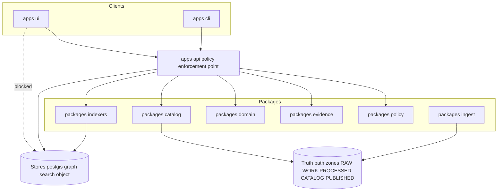

<!-- [KFM_META_BLOCK_V2]
doc_id: kfm://doc/7a1bff64-0e7c-4d7a-9c9b-5a6b2b6d3f7a
title: packages
type: standard
version: v1
status: draft
owners: kfm-core-maintainers-TBD
created: 2026-03-03
updated: 2026-03-03
policy_label: public
related:
  - ../README.md
  - ../apps/README.md
  - ../contracts/README.md
  - ../policy/README.md
  - ../data/README.md
tags: [kfm, monorepo, packages]
notes:
  - Defines what belongs in packages/ and the dependency rules that preserve the policy boundary.
[/KFM_META_BLOCK_V2] -->

# packages
Shared libraries and core modules for Kansas Frontier Matrix (KFM).

> **Purpose:** Keep reusable logic **governed and composable** so `apps/` can ship features **without bypassing policy, evidence, or lifecycle gates**.

---

## IMPACT
**Status:** draft (docs surface; ready for repo wiring)  
**Owners:** `kfm-core-maintainers-TBD` (**UNKNOWN**; see verification steps)


**Quick links:**  
[Scope](#scope) ·
[Where it fits](#where-it-fits) ·
[Inputs](#inputs) ·
[Exclusions](#exclusions) ·
[Directory tree](#directory-tree) ·
[Quickstart](#quickstart) ·
[Usage](#usage) ·
[Architecture invariants](#architecture-invariants) ·
[Dependency rules](#dependency-rules) ·
[Package taxonomy](#package-taxonomy) ·
[DoD and gates](#definition-of-done-and-gates) ·
[Unknowns](#unknowns-and-verification-steps)

---

## Conventions
This repo’s docs are evidence-disciplined.

### Claim labels
Every meaningful statement is tagged:

- **CONFIRMED** — backed by KFM source-of-truth docs (or repo evidence explicitly cited in those docs).
- **PROPOSED** — recommended convention / target architecture; not verified in current checkout.
- **UNKNOWN** — not verified; includes *minimal steps* to make it CONFIRMED.

### Normative words
- **MUST / MUST NOT**: invariant required for governance + safety.
- **SHOULD / SHOULD NOT**: strong default; deviation requires justification (ADR or doc note).
- **MAY**: optional.

[Back to top](#packages)

---

## Scope
- **CONFIRMED:** `packages/` is for **shared libraries and core modules** reused by `apps/`.
- **CONFIRMED:** `packages/` exists to reduce duplication while preserving the **policy boundary** and **cite-or-abstain** behavior.
- **PROPOSED:** `packages/` is where we put “governed primitives” (identity, evidence references, policy checks, deterministic transforms) that are safe to reuse across services.

[Back to top](#packages)

---

## Where it fits
- **CONFIRMED:** `apps/` contains runnable services (API/PEP, UI, workers, CLI).
- **PROPOSED:** `contracts/` is the canonical home for shared schemas/contract surfaces (OpenAPI, JSON Schema, controlled vocabularies).
- **CONFIRMED:** `policy/` contains policy code + tests (OPA/Rego or equivalent).
- **CONFIRMED:** `data/` holds the truth-path lifecycle zones and the publishable catalog surfaces.

**PROPOSED flow:** `apps/*` depend on `packages/*` (never the reverse); apps expose governed APIs; packages provide reusable logic, validators, and adapters.

[Back to top](#packages)

---

## Inputs
Acceptable contents inside `packages/` (what belongs here):

- **PROPOSED:** **Domain models** (dataset identity, versioning, EvidenceRef/EvidenceBundle, StoryNode).
- **PROPOSED:** **Deterministic transforms** and validators used by pipelines and API (pure functions where possible).
- **PROPOSED:** **Evidence resolution helpers** (EvidenceRef → EvidenceBundle), including redaction/generalization *contracts* (not hard-coded “policy decisions”).
- **PROPOSED:** **Policy integration libraries** (policy client, obligation data structures, evaluation result types).
- **PROPOSED:** **Catalog builders/validators** for DCAT/STAC/PROV surfaces (behind contracts).
- **PROPOSED:** **Indexer builders** (tile/search index build helpers) behind adapter interfaces.
- **PROPOSED:** Shared utilities that do **not** create an IO/policy bypass.

[Back to top](#packages)

---

## Exclusions
What must **not** go in `packages/`:

- **CONFIRMED:** UI-only code (belongs in `apps/ui/`).
- **CONFIRMED:** Any client-facing code path that reaches storage directly (must cross governed API / policy boundary).
- **CONFIRMED:** Secrets, tokens, credentials (never commit secrets).
- **PROPOSED:** Environment-specific deployment artifacts (belongs in `infra/` and `configs/`).
- **PROPOSED:** Published artifacts (tiles, catalogs, processed outputs) except as test fixtures (belongs in `data/` zones).

[Back to top](#packages)

---

## Directory tree
**UNKNOWN:** Actual `packages/` tree in the current checkout (must be verified).

**PROPOSED target tree (illustrative):**
```text
packages/
├─ domain/
│  ├─ README.md
│  ├─ src/
│  └─ tests/
├─ ingest/
│  ├─ README.md
│  ├─ src/
│  └─ tests/
├─ catalog/
│  ├─ README.md
│  ├─ src/
│  └─ tests/
├─ indexers/
│  ├─ README.md
│  ├─ src/
│  └─ tests/
├─ evidence/
│  ├─ README.md
│  ├─ src/
│  └─ tests/
└─ policy/
   ├─ README.md
   ├─ src/
   └─ tests/
```

[Back to top](#packages)

---

## Quickstart
**UNKNOWN:** Exact monorepo toolchain (pnpm/yarn/npm, nx/turborepo/bazel, python/uv/poetry, etc.).

**PROPOSED minimal checks you should be able to run once the toolchain is confirmed:**
```bash
# list packages (exact command depends on tooling)
ls -la packages/

# run unit tests (replace with repo’s actual runner)
# e.g., pnpm -w test
# e.g., pytest -q
# e.g., nx test
echo "TODO: wire to repo test runner"
```

[Back to top](#packages)

---

## Usage
### How apps should consume packages
- **PROPOSED:** `apps/*` import package public APIs only (no deep imports into private paths).
- **PROPOSED:** Apps use packages to:
  - validate inputs (schemas + invariants),
  - plan retrieval and transforms deterministically,
  - resolve evidence bundles,
  - enforce obligations returned by policy evaluation,
  - build catalogs / index artifacts as part of pipelines (not UI runtime).

### How packages should expose APIs
- **PROPOSED:** Each package exports a small, stable “public surface” (index file / module exports).
- **PROPOSED:** Each package README declares:
  - what the package does,
  - allowed inputs,
  - exclusions,
  - external dependencies,
  - any policy/evidence obligations it expects.

[Back to top](#packages)

---

## Architecture invariants
KFM’s “truth path” + “trust membrane” posture drives package boundaries.

### Invariants (enforced posture)
- **CONFIRMED:** Clients/UI **MUST NOT** access storage directly; all access crosses a governed API/policy boundary (PEP).
- **CONFIRMED:** KFM’s lifecycle is a strict promotion path: **Upstream → RAW → WORK → PROCESSED → CATALOG → PUBLISHED**.
- **CONFIRMED:** The **catalog triplet** (DCAT + STAC + PROV) is treated as a contract surface for published data.
- **PROPOSED:** Core logic **MUST NOT** bypass the repository/adapter boundary to reach storage (encode this as tests/lint rules).

### Trust membrane diagram (conceptual)

```mermaid
flowchart TB
  subgraph Clients
    UI[apps ui]
    CLI[apps cli]
  end

  PEP[apps api policy enforcement point]

  subgraph Packages
    Domain[packages domain]
    Evidence[packages evidence]
    Policy[packages policy]
    Catalog[packages catalog]
    Indexers[packages indexers]
    Ingest[packages ingest]
  end

  Zones[(Truth path zones RAW WORK PROCESSED CATALOG PUBLISHED)]
  Stores[(Stores postgis graph search object)]

  UI --> PEP
  CLI --> PEP

  PEP --> Policy
  PEP --> Evidence
  PEP --> Domain
  PEP --> Catalog
  PEP --> Indexers

  Ingest --> Zones
  Catalog --> Zones
  Indexers --> Stores
  PEP --> Stores

  UI -. blocked .-> Stores
```

[Back to top](#packages)

---

## Dependency rules
These rules prevent policy bypass and keep packages composable.

### Hard rules
- **PROPOSED:** `apps/*` **MAY** depend on `packages/*`.
- **PROPOSED:** `packages/*` **MUST NOT** depend on `apps/*`.
- **PROPOSED:** `packages/*` **MAY** depend on `contracts/*` (canonical schemas/contracts).
- **PROPOSED:** `packages/*` **MUST NOT** vendor-copy canonical schemas when a contract exists.
- **PROPOSED:** Any IO boundary **MUST** sit behind an adapter interface so policy, logging, and tests can gate it.
- **CONFIRMED:** Anything user-visible **MUST** preserve resolvable evidence IDs to enable cite-or-abstain.

### How to enforce (CI-amenable)
- **PROPOSED:** Add import boundary lint rules (TS eslint restricted imports, Python import-linter, etc.).
- **PROPOSED:** Add contract tests proving apps cannot bypass PEP by calling storage adapters directly.
- **PROPOSED:** Fail closed: violations block PRs.

[Back to top](#packages)

---

## Package taxonomy
Use a consistent “kind” model so dependency rules are clear.

| Package kind | What it contains | IO allowed? | May depend on | Must not depend on |
|---|---|---:|---|---|
| `domain` | entities, value objects, invariants, IDs, hashing | No | `contracts` | storage, network |
| `evidence` | EvidenceRef resolution, bundle building, redaction *contracts* | Limited (via adapters) | `domain`, `contracts`, `policy` (types) | direct DB clients |
| `policy` | policy client, evaluation result types, obligation modeling | Limited (policy engine adapter) | `contracts` | UI / storage |
| `catalog` | DCAT/STAC/PROV builders + validators | Limited (write artifacts via adapters) | `domain`, `contracts` | UI |
| `indexers` | tile/search index build helpers (behind adapters) | Yes (via adapters) | `domain`, `contracts` | UI |
| `ingest` | connectors + normalization + receipts (deterministic where possible) | Yes (via adapters) | `domain`, `contracts` | UI |

> **PROPOSED:** When you’re unsure where something belongs, default to `domain` (pure) or `contracts` (schema) and add adapters only when required.

[Back to top](#packages)

---

## Standard package layout
Use as default unless language tooling requires different structure.

```text
packages/<package-name>/
├─ README.md
├─ src/                         # library code
├─ tests/                       # unit tests + fixtures
├─ adapters/                    # IO boundaries behind interfaces (optional)
├─ contracts/                   # package-specific schemas ONLY if canonical here (optional)
└─ <tooling files>              # package.json, pyproject.toml, Cargo.toml, etc.
```

- **PROPOSED:** Every package README documents: purpose, inputs, exclusions, public API surface, and “what this package must never do”.
- **PROPOSED:** Tests must cover invariants and failure modes (fail-closed where applicable).

[Back to top](#packages)

---

## Creating a new package
### Minimal checklist (PR-ready)
- [ ] **PROPOSED:** Create `packages/<name>/README.md` (this doc format, claim labels, scope).
- [ ] **PROPOSED:** Define a small exported surface; avoid deep imports.
- [ ] **PROPOSED:** Add unit tests and fixtures for edge cases.
- [ ] **PROPOSED:** If the package touches policy/evidence/lifecycle, add contract tests proving no bypass is possible.
- [ ] **UNKNOWN:** Update package registry/index if one exists (verify).

### Naming and ownership
- **PROPOSED:** Prefer names that reflect responsibility (`evidence`, `catalog`, `indexers`) over tech (`utils`, `common`).
- **UNKNOWN:** How CODEOWNERS is configured for packages (verify).

[Back to top](#packages)

---

## Definition of Done and gates
Packages are a reuse boundary; “done” means safe to import from multiple apps.

### Engineering baseline
- [ ] **PROPOSED:** Formatting/lint/typecheck passes.
- [ ] **PROPOSED:** Unit tests pass.
- [ ] **PROPOSED:** Contract tests pass (schema + policy where applicable).
- [ ] **CONFIRMED:** No secrets added.
- [ ] **PROPOSED:** Docs updated if behavior changes affect other layers.

### Governance baseline (when relevant)
- [ ] **PROPOSED:** Inputs/outputs are traceable (evidence IDs preserved).
- [ ] **PROPOSED:** Any artifact-producing code emits checksums + run receipt structures.
- [ ] **PROPOSED:** Any policy-touching code fails closed on missing policy decision/obligations.

[Back to top](#packages)

---

## FAQ
### “Can packages talk to PostGIS/Neo4j/object storage?”
- **PROPOSED:** Only through **adapters** and only when invoked from governed contexts (pipelines or API service).
- **CONFIRMED posture:** UI/clients never connect directly.

### “Where do schemas go?”
- **PROPOSED:** Put canonical schemas in `contracts/`. Packages can include package-local schemas only when they are the canonical source.

### “Where do we enforce ‘no bypass’?”
- **PROPOSED:** In CI: import boundary lint + integration tests that exercise the PEP boundary and fail if direct storage calls occur.

[Back to top](#packages)

---

## Unknowns and verification steps
Some details cannot be asserted without inspecting the live repository checkout.

### Unknowns
- **UNKNOWN:** Which `packages/*` directories exist right now.
- **UNKNOWN:** Monorepo toolchain (workspace manager, build system, test runner).
- **UNKNOWN:** Which dependency rules are already enforced by CI (boundary lint, policy tests).
- **UNKNOWN:** Release/versioning strategy for packages (if any).

### Smallest steps to make these CONFIRMED
- [ ] Run `git rev-parse HEAD` and record commit hash in a PR note.
- [ ] Run `ls -la packages/` (or `tree -L 2 packages/`) and paste into the PR description.
- [ ] Identify workspace + test runner from root config files (`package.json`, `pnpm-workspace.yaml`, `nx.json`, `pyproject.toml`, etc.).
- [ ] Locate CI rules enforcing boundaries (search workflows for lint/import rules; search for policy/contract tests).
- [ ] Add/confirm an automated boundary test (fail-closed) for “apps cannot access storage except via PEP”.

[Back to top](#packages)

---

<details>
<summary>Appendix: Adapter boundary pattern (PROPOSED)</summary>

### Goal
Keep IO replaceable and policy-testable.

### Pattern
- Define an interface in a package (e.g., `packages/indexers/src/ports/SearchIndexPort`).
- Implement it in an adapter module (e.g., `packages/indexers/adapters/opensearch`).
- Allow apps/pipelines to inject the adapter, but keep the package core dependent only on the interface.

### Why
- Enables hermetic tests for domain logic.
- Makes it possible to prove “no bypass” by constraining where adapters are instantiated.
</details>
