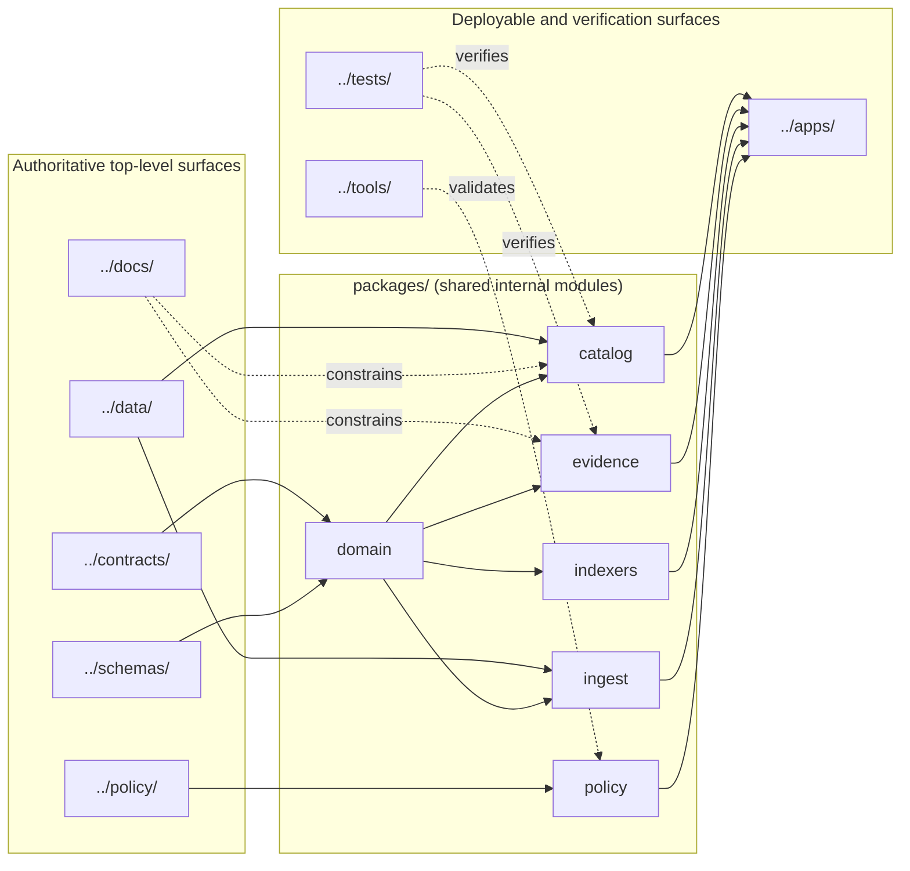

<!-- [KFM_META_BLOCK_V2]
doc_id: kfm://doc/TODO-packages-readme-uuid
title: packages/
type: standard
version: v1
status: review
owners: @bartytime4life
created: YYYY-MM-DD
updated: YYYY-MM-DD
policy_label: public
related: [../README.md, ../.github/README.md, ../.github/workflows/README.md, ../apps/, ../contracts/, ../schemas/, ../policy/, ../data/, ../data/registry/README.md, ../docs/, ../infra/, ../tests/, ../tools/, ../scripts/, ./catalog/, ./domain/, ./evidence/, ./indexers/, ./ingest/, ./policy/]
tags: [kfm, packages, readme]
notes: [doc_id and repo-side dates need verification, owner verified against ../.github/CODEOWNERS on public main, public main confirms packages/ plus catalog/, domain/, evidence/, indexers/, ingest/, and policy/ child README surfaces, child package directories remain README-only in public view even though several child READMEs now carry boundary-contract prose]
[/KFM_META_BLOCK_V2] -->

# `packages/`

Shared internal packages and reusable module boundaries for KFM’s governed truth path, evidence resolution, catalog work, policy support, domain modeling, and rebuildable runtime projections.


| Field | Value |
|---|---|
| Status | `active` directory · `review` README revision |
| Owners | `@bartytime4life` *(verified in [`../.github/CODEOWNERS`](../.github/CODEOWNERS))* |
| Path | [`packages/README.md`](./README.md) |
| Audited public tree | `bartytime4life/Kansas-Frontier-Matrix@main` |
| Default branch | `main` |
| Repo fit | Shared internal module boundary between top-level authority surfaces and deployable [`../apps/`](../apps/) |
| Current repo evidence | `packages/` exists on public `main`; `catalog/`, `domain/`, `evidence/`, `indexers/`, `ingest/`, and `policy/` each resolve and currently present README-only package surfaces |
| Truth posture | `CONFIRMED` current public path and fallback owner · `CONFIRMED` neighboring repo docs and child package README surfaces · `NEEDS VERIFICATION` deeper package-local code, manifests, tests, fixtures, and imports |
| Quick jump | [Scope](#scope) · [Repo fit](#repo-fit) · [Accepted inputs](#accepted-inputs) · [Exclusions](#exclusions) · [Current package surface](#current-package-surface) · [Directory tree](#directory-tree) · [Quickstart](#quickstart) · [Usage](#usage) · [Diagram](#diagram) · [Package map](#package-map) · [Boundary rules](#boundary-rules) · [Task list](#task-list) · [FAQ](#faq) |

---

> [!IMPORTANT]
> `packages/` is a **governed boundary**, not a general dumping ground.
> Shared internal logic may live here. Sovereign truth, public release state, and deployable entrypoints should not.

> [!WARNING]
> `packages/` must not become a side door around the trust membrane.
> No package should create a hidden client-to-store path, a second policy path, or a shadow truth source.

> [!NOTE]
> Current public `main` proves the **directory surface** and the child README surfaces.
> It does **not** prove package-local code, manifests, tests, fixtures, or runtime wiring beneath those directories.
> Several child READMEs now carry directory-contract prose, but the package family is still **README-first** in public view.

## Scope

`packages/` holds shared internal libraries and core modules used by KFM services, workers, and other governed runtime surfaces.

Its job is to keep reusable logic bounded, inspectable, and reviewable without smearing domain rules across deployable apps or quietly relocating authority away from top-level contracts, schemas, policy bundles, governed data artifacts, and trust-visible runtime seams.

In KFM terms, packages should help preserve:

- the governed truth path
- the trust membrane
- authoritative-versus-derived separation
- evidence-linked behavior
- fail-closed defaults where policy matters
- rebuildable derived layers that do not pretend to be canonical truth

### Evidence posture used in this README

| Label | Meaning here |
|---|---|
| **CONFIRMED** | Directly supported by the current public repo files inspected for this revision |
| **INFERRED** | Strongly suggested by neighboring repo docs and current directory contracts, but not re-proven from deeper mounted code in this task |
| **PROPOSED** | Recommended package-boundary guidance consistent with KFM doctrine |
| **UNKNOWN / NEEDS VERIFICATION** | Not established strongly enough from the inspected public tree to present as current implementation reality |

## Repo fit

**Path:** [`packages/README.md`](./README.md)

### Upstream authority surfaces

- [`../README.md`](../README.md) — repo-wide operating frame and verification-first posture
- [`../.github/README.md`](../.github/README.md) — repo-wide review, CI/CD, and gatehouse posture
- [`../contracts/`](../contracts/) — machine-readable contract backbone
- [`../schemas/`](../schemas/) — canonical schema surfaces
- [`../policy/`](../policy/) — governed executable policy surface
- [`../data/`](../data/) — governed registries, lifecycle zones, catalogs, receipts, and published artifacts
- [`../docs/`](../docs/) — doctrine, ADRs, runbooks, and longer architecture records

### Adjacent engineering surfaces

- [`../.github/workflows/README.md`](../.github/workflows/README.md) — current public workflow lane doc and merge-gate context
- [`../data/registry/README.md`](../data/registry/README.md) — governed source-registration handoff relevant to shared intake helpers
- [`../tests/README.md`](../tests/README.md) — verification and fixture posture
- [`../tools/README.md`](../tools/README.md) — validators and utility tooling
- [`../scripts/README.md`](../scripts/README.md) — supporting automation and non-authoritative helper entrypoints
- [`../infra/`](../infra/) — environment wiring, deployment, and operational mechanics

### Child package surfaces

- [`./catalog/`](./catalog/)
- [`./domain/`](./domain/)
- [`./evidence/`](./evidence/)
- [`./indexers/`](./indexers/)
- [`./ingest/`](./ingest/)
- [`./policy/`](./policy/)

### How this directory fits the repo

`packages/` sits between KFM’s top-level authority surfaces and its deployable apps. Logic belongs here when it is:

1. shared across more than one deployable surface
2. non-deployable on its own
3. easier to review as a stable internal boundary than as app-local glue
4. subordinate to stronger top-level contract, policy, and data authority

## Accepted inputs

Content belongs in `packages/` when it is a **shared internal module** such as:

- pure domain models, invariants, and type-safe vocabulary
- reusable ingestion helpers, connector logic, normalizers, and validators
- catalog / triplet build and validation logic
- `EvidenceRef` → `EvidenceBundle` resolution helpers
- shared policy adapters, obligation helpers, or policy-support logic
- rebuildable projection or indexing logic for search, map, or runtime acceleration
- package-local tests, fixtures, and examples that prove a package’s own contract

## Exclusions

The following do **not** belong in `packages/`:

| Does **not** belong in `packages/` | Put it here instead |
|---|---|
| Deployable HTTP services, workers, CLIs, or web apps | [`../apps/`](../apps/) |
| Canonical OpenAPI definitions, JSON Schemas, or shared vocabularies | [`../contracts/`](../contracts/), [`../schemas/`](../schemas/) |
| Repo-authoritative policy bundles, policy fixtures, or gate definitions | [`../policy/`](../policy/) |
| Governed dataset artifacts, registries, catalogs, receipts, and release-bearing outward metadata | [`../data/`](../data/) |
| Environment-specific deployment config, IaC, overlays, dashboards | [`../infra/`](../infra/) |
| Architecture doctrine, ADRs, runbooks, contributor policy | [`../docs/`](../docs/) |
| Secrets, credentials, local machine state | nowhere in the repo |

## Current package surface

| Path | Present on `main` | Current visible state | Reading rule |
|---|---|---|---|
| [`./catalog/`](./catalog/) | Yes | README-only public surface; child boundary README present | Use the child README plus this parent contract until deeper files exist |
| [`./domain/`](./domain/) | Yes | README-only public surface; child boundary README present | Same |
| [`./evidence/`](./evidence/) | Yes | README-only public surface; child boundary README present | Same |
| [`./indexers/`](./indexers/) | Yes | README-only public surface; child boundary README present | Same |
| [`./ingest/`](./ingest/) | Yes | README-only public surface; child boundary README present | Same |
| [`./policy/`](./policy/) | Yes | README-only public surface; child boundary README present | Same |

> [!TIP]
> Right now, the **root** `packages/README.md` still carries the family-level contract.
> Child READMEs already carry package-local boundary prose, but the public tree still does not prove package-local code, manifests, tests, or fixtures beneath those directories.

## Directory tree

**Current repo-visible package surface**

```text
packages/
├── README.md
├── catalog/
│   └── README.md        # README-only in public view
├── domain/
│   └── README.md        # README-only in public view
├── evidence/
│   └── README.md        # README-only in public view
├── indexers/
│   └── README.md        # README-only in public view
├── ingest/
│   └── README.md        # README-only in public view
└── policy/
    └── README.md        # README-only in public view
```

> [!NOTE]
> This tree is intentionally conservative.
> It proves directory presence and README surfaces on public `main`; it does **not** prove package manifests, `src/` trees, tests, or runtime adoption inside each child package.

## Quickstart

### 1) Inventory the package surface

```bash
find packages -maxdepth 2 -type d | sort
find packages -maxdepth 2 -name README.md | sort
find packages -maxdepth 4 -type f | sort
```

### 2) Recheck adjacent authority surfaces

```bash
sed -n '1,220p' packages/README.md
sed -n '1,160p' .github/CODEOWNERS
sed -n '1,220p' README.md
sed -n '1,240p' .github/README.md
sed -n '1,220p' .github/workflows/README.md
sed -n '1,220p' contracts/README.md
sed -n '1,220p' schemas/README.md
sed -n '1,220p' policy/README.md
sed -n '1,240p' data/README.md
sed -n '1,220p' data/registry/README.md
```

### 3) Read the child package docs before claiming local ownership

```bash
for d in catalog domain evidence indexers ingest policy; do
  echo "---- $d ----"
  test -f "packages/$d/README.md" && sed -n '1,160p' "packages/$d/README.md"
done
```

### 4) Look for deeper package-local implementation before upgrading claims

```bash
find packages -maxdepth 4 \
  \( -name package.json -o -name pyproject.toml -o -name Cargo.toml -o -name go.mod -o -name tsconfig.json \) \
  | sort
```

### 5) Sanity-check package-boundary vocabulary

```bash
grep -RIn \
  "EvidenceRef\|EvidenceBundle\|CatalogClosure\|RuntimeResponseEnvelope\|DecisionEnvelope\|CorrectionNotice" \
  packages contracts policy docs tests 2>/dev/null || true
```

### 6) Before creating a new package, answer this

```text
Is this shared logic?
Is it non-deployable on its own?
Does it preserve the trust membrane?
Does it avoid replacing top-level contract, policy, or data authority?
Would more than one app or worker depend on it?
```

If the answer is mostly “no,” it probably should not become a new package.

## Usage

### Treat this README as the root directory contract

Use `packages/README.md` to decide **whether logic belongs in `packages/` at all**. Then confirm the relevant child package README and live files before documenting narrower ownership.

### Treat child READMEs as boundary docs, not implementation proof

The current public tree proves that each child package has a README surface, and several now carry package-specific directory-contract language. It still does **not** prove deeper package-local code maturity. Avoid package-local prose that outruns visible files.

### Prefer named package homes over `common/` or `utils/` sprawl

If something belongs here, it should have a crisp home. Catch-all buckets erase architecture.

### Keep imports directional

Packages should depend inward toward stable semantics, not outward toward volatile runtime shells or environment-specific glue.

### Keep deployable concerns out

Package code may support apps, but it should not quietly become an app by accumulating startup behavior, route handlers, auth entrypoints, or environment ownership.

### Update both layers when boundaries change

If a package is added, renamed, split, or materially repurposed, update the child package README **and** this root `packages/README.md` in the same governed change.

### Re-run the inventory when package depth changes

Once a child package grows beyond a README-only public surface, refresh the current-state table and tree so the directory contract stays truthful.

## Diagram


```mermaid
flowchart LR
    subgraph Canonical["Authoritative top-level surfaces"]
        C1["../contracts/"]
        C2["../schemas/"]
        C3["../policy/"]
        C4["../data/"]
        C5["../docs/"]
    end

    subgraph Packages["packages/ (shared internal modules)"]
        P1["catalog"]
        P2["domain"]
        P3["evidence"]
        P4["indexers"]
        P5["ingest"]
        P6["policy"]
    end

    subgraph Consumers["Deployable and verification surfaces"]
        A1["../apps/"]
        A2["../tests/"]
        A3["../tools/"]
    end

    C1 --> P2
    C2 --> P2
    C3 --> P6
    C4 --> P1
    C4 --> P5
    C5 -. constrains .-> P1
    C5 -. constrains .-> P3

    P2 --> P1
    P2 --> P3
    P2 --> P4
    P2 --> P5

    P1 --> A1
    P3 --> A1
    P4 --> A1
    P5 --> A1
    P6 --> A1

    A2 -. verifies .-> P1
    A2 -. verifies .-> P3
    A3 -. validates .-> P6
```

> [!NOTE]
> The arrows show intended **boundary direction**, not a current import graph scraped from the live checkout.

## Package map

| Package | Root-contract reading | Current visible state | Must never do |
|---|---|---|---|
| [`./catalog/`](./catalog/) | catalog / triplet construction and validation logic | README-only public surface | become an ad hoc runtime API surface |
| [`./domain/`](./domain/) | stable domain vocabulary, invariants, and semantic core | README-only public surface | own deployable side effects or outer-layer IO |
| [`./evidence/`](./evidence/) | `EvidenceRef` → `EvidenceBundle` resolution and policy-safe presentation helpers | README-only public surface | emit uncited or policy-unchecked evidence surfaces |
| [`./indexers/`](./indexers/) | rebuildable search / map / runtime projection builders | README-only public surface | become authoritative truth or source-of-record |
| [`./ingest/`](./ingest/) | source intake, normalization, validation, and receipt helpers | README-only public surface | serve clients directly or bypass lifecycle gates |
| [`./policy/`](./policy/) | shared internal policy-support logic and adapters | README-only public surface | replace repo-authoritative [`../policy/`](../policy/) |

### Package-adjacent governed objects

> [!NOTE]
> The table below is **doctrine-led placement guidance**, not proof that the live repo already contains every listed schema or artifact family.

| Object family | Stronger home | Typical package relationship |
|---|---|---|
| `SourceDescriptor`, `ValidationReport` | [`../contracts/`](../contracts/), [`../schemas/`](../schemas/) | `ingest/` and validation helpers consume or emit them |
| `DatasetVersion`, `CatalogClosure` | [`../contracts/`](../contracts/), [`../data/`](../data/) | `catalog/` and `ingest/` build, validate, and cross-link them |
| `EvidenceBundle`, `RuntimeResponseEnvelope` | contract / schema + governed API surfaces | `evidence/` and runtime helpers resolve or emit them |
| `DecisionEnvelope`, review / release / correction objects | top-level contract, policy, and data surfaces | packages may interpret or enforce them, but should not quietly fork them |

## Boundary rules

### What makes a good package

A good package usually has:

- one crisp responsibility
- stable dependency direction
- a README that states what it owns and what it refuses to own
- tests or fixtures near the logic they prove
- no silent authority claims beyond its layer

### What should stay at top level

Even when package code supports these surfaces, the **authoritative** versions stay outside `packages/`:

- API contracts
- shared schemas
- policy bundles and gate fixtures
- governed data artifacts and catalog outputs
- deployment and environment definitions
- release-bearing manifests, receipts, and proof objects

### Policy overlap rule

There is both a top-level [`../policy/`](../policy/) surface and a package-local [`./policy/`](./policy/) surface.

Treat them differently:

- top-level `policy/` = repo-authoritative executable policy surface
- `packages/policy/` = shared internal support logic for policy behavior

If a change alters governing policy behavior, it should not live **only** inside `packages/policy/`.

### README-first rule

When a child package is still README-first in public view, upgrade the child README and local file structure **before** writing documentation that implies mature code ownership, manifests, tests, or runtime use.

### Package creation decision table

| Create a new package when… | Prefer an existing package or another location when… |
|---|---|
| The logic is reused across multiple apps or workers | It serves only one deployable app |
| The boundary can be named clearly in one sentence | The name would be vague (`common`, `misc`, `utils`) |
| It owns a coherent semantic layer, helper family, or integration seam | It is mainly environment wiring, startup code, or route glue |
| It can carry its own README, tests, and failure rules | It would only forward imports or hide coupling |
| It preserves authoritative-versus-derived boundaries | It starts acting like a second source of truth |

## Task list

### Definition of done for changes under `packages/`

- [ ] The touched package README still matches what the package actually owns
- [ ] No new deployable entrypoint was added under `packages/`
- [ ] No package-local contract, schema, or policy silently replaced a stronger top-level authority surface
- [ ] Links to adjacent docs still resolve
- [ ] Tests or fixtures were added or updated when behavior changed
- [ ] Current-state tables and the directory tree were refreshed if package directories changed
- [ ] Child package docs were promoted beyond README-first boundary prose once they began to own real code or tests

### Review gates worth applying

- [ ] Can a reviewer tell whether this change belongs in `packages/` instead of `apps/`, `contracts/`, `policy/`, or `data/`?
- [ ] Does the change preserve the trust membrane?
- [ ] Is the difference between **current visible state** and **intended role** still obvious?
- [ ] If rights, sensitivity, release, or correction behavior changed, were top-level contract / policy / doc surfaces updated too?
- [ ] Would removing this package break more than one surface for a good reason?

## FAQ

### When should something go in `packages/` instead of `apps/`?

Put it in `packages/` when it is reusable internal logic with no standalone deployment role. If it is an HTTP service, UI surface, worker runtime, or CLI entrypoint, it belongs in `apps/`.

### Can a package own authoritative contracts or data artifacts?

No. Packages may support, validate, or consume them, but the stronger authority should remain in top-level contract, schema, policy, and data surfaces.

### Why does this root README still carry so much of the package-family contract?

Because the current public tree is still README-first. Child package READMEs now do more than placeholder pointing, but public `main` still does not prove package-local code, manifests, tests, or runtime adoption beneath those directories.

### Why is this README intentionally conservative about implementation depth?

Because KFM’s trust posture is harmed by persuasive overclaiming. This file documents what the current public repo visibly proves and keeps deeper package-local implementation clearly bounded until reinspection.

### Why is there both top-level and package-local policy?

Because KFM separates **authoritative policy assets** from **shared internal policy-support code**. Keeping both visible prevents policy from becoming either scattered app glue or a silent package-local rewrite of top-level governance.

## Appendix

<details>
<summary><strong>Boundary checklist for a new package</strong></summary>

### A new package should usually have

- a narrowly stated purpose
- one README with clear scope and exclusions
- tests or fixtures close to the contract it claims
- no direct user-facing runtime entrypoint
- no undocumented dependency on local environment state
- no shadow copy of canonical contracts, policy bundles, or governed data artifacts

### A package should be reconsidered if it starts to absorb

- route handlers
- direct database ownership
- UI shell composition
- environment-specific wiring
- release orchestration
- ad hoc shared helpers with no stable boundary

</details>

<details>
<summary><strong>Current child package README footprints</strong></summary>

| Path | Current README footprint |
|---|---|
| `packages/catalog/README.md` | README-only public surface; child README frames STAC/DCAT/PROV catalog-closure role |
| `packages/domain/README.md` | README-only public surface; child README frames semantic-core role |
| `packages/evidence/README.md` | README-only public surface; child README frames `EvidenceRef` → `EvidenceBundle` role |
| `packages/indexers/README.md` | README-only public surface; child README frames rebuildable derived-projection role |
| `packages/ingest/README.md` | README-only public surface; child README frames source-intake / receipt role |
| `packages/policy/README.md` | README-only public surface; child README frames internal policy-support role |

</details>

[Back to top](#packages)
