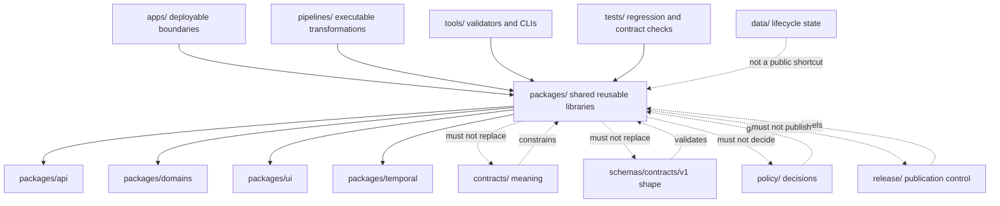

<!-- [KFM_META_BLOCK_V2]
doc_id: kfm://doc/packages-readme
title: Packages README
type: readme
version: v0.2
status: draft
owners: OWNER_TBD — Package steward · Architecture steward · Docs steward
created: 2026-06-15
updated: 2026-06-15
policy_label: public
related:
  - ../README.md
  - ../docs/doctrine/directory-rules.md
  - ../docs/doctrine/trust-membrane.md
  - ../docs/doctrine/lifecycle-law.md
  - ../docs/architecture/contract-schema-policy-split.md
  - ../apps/README.md
  - ../tools/README.md
  - ../tests/README.md
  - api/README.md
  - domains/README.md
  - ui/README.md
  - temporal/README.md
tags: [kfm, packages, shared-libraries, implementation-packages, trust-boundary, governance]
notes:
  - "v0.2 replaces the short packages root stub with a governed README-like root contract."
  - "packages/ is the responsibility root for shared reusable implementation packages used by apps, workers, pipelines, and tools."
  - "Implementation depth is UNKNOWN for child packages until package metadata, exports, tests, workflows, and consuming imports are inspected."
[/KFM_META_BLOCK_V2] -->

<a id="top"></a>

<div align="center">

# Packages Root

`packages/`

**Shared reusable implementation packages for KFM apps, workers, pipelines, tools, tests, and governed UI surfaces.**


[Purpose](#1-purpose) · [Placement](#2-placement-and-authority) · [Inputs](#5-inputs) · [Exclusions](#6-exclusions) · [Package map](#7-package-map) · [Diagram](#8-diagram) · [Definition of done](#14-definition-of-done)

</div>

---

> [!IMPORTANT]
> **Status:** draft / `NEEDS VERIFICATION`  
> **Owners:** `OWNER_TBD` — Package steward · Architecture steward · Docs steward  
> **Path:** `packages/README.md`  
> **Responsibility root:** `packages/` — shared reusable implementation packages  
> **Truth posture:** CONFIRMED file path / CONFIRMED neighboring package READMEs where linked / UNKNOWN full implementation depth

> [!NOTE]
> This README describes the package-root boundary. It does not prove that every child package, export, test, fixture, package manager, CI workflow, or consuming import path already exists.

---

## Quick jump

- [1. Purpose](#1-purpose)
- [2. Placement and authority](#2-placement-and-authority)
- [3. Root contract](#3-root-contract)
- [4. Trust membrane rule](#4-trust-membrane-rule)
- [5. Inputs](#5-inputs)
- [6. Exclusions](#6-exclusions)
- [7. Package map](#7-package-map)
- [8. Diagram](#8-diagram)
- [9. Package responsibilities](#9-package-responsibilities)
- [10. Child package expectations](#10-child-package-expectations)
- [11. Inspection path](#11-inspection-path)
- [12. Validation expectations](#12-validation-expectations)
- [13. Safe change pattern](#13-safe-change-pattern)
- [14. Definition of done](#14-definition-of-done)
- [15. Open verification items](#15-open-verification-items)

---

## 1. Purpose

`packages/` is the KFM home for shared reusable implementation packages.

Packages may support apps, workers, pipelines, validation tools, test fixtures, documentation checks, governed UI surfaces, and adapters. They should reduce duplication without becoming a second authority for truth, policy, contracts, schemas, release decisions, lifecycle data, or public publication state.

Short rule:

```text
packages/ = shared reusable implementation code
apps/     = deployable application boundaries
contracts/ = object meaning
schemas/   = machine-readable shape
policy/    = admissibility and exposure decisions
release/   = publication, correction, and rollback control
data/      = lifecycle state, receipts, proofs, catalog/triplets, and artifacts
```

[Back to top](#top)

---

## 2. Placement and authority

| Question | Answer | Status |
|---|---|---|
| Why does this root exist? | To hold shared reusable implementation libraries used by multiple KFM surfaces. | CONFIRMED from existing root README intent |
| Does `packages/` define truth? | No. Packages support governed flows; they do not replace EvidenceBundles, contracts, schemas, policy, review, or release state. | PROPOSED root contract aligned to KFM doctrine |
| Can packages be imported by apps? | Yes, when imports preserve governed boundaries and do not bypass public interfaces. | PROPOSED / NEEDS VERIFICATION per package |
| Can packages read lifecycle data directly? | Not as a normal public path. Any internal helper must remain constrained, reviewed, and out of public UI shortcuts. | PROPOSED / NEEDS VERIFICATION |
| Can a package become a deployable service? | No. Deployable application boundaries belong under `apps/` unless an ADR changes placement. | PROPOSED root contract |

## 3. Root contract

Every child package should make its boundary inspectable.

Minimum package README expectations:

- purpose and scope
- ownership or `OWNER_TBD` placeholder
- repo fit and neighboring roots
- accepted inputs
- exclusions and correct homes
- public-boundary statement
- tests or validation expectations
- rollback or safe-change notes when behavior affects trust-bearing surfaces
- open verification items when implementation depth is not fully confirmed

> [!WARNING]
> A package README must not imply implementation maturity, public availability, policy coverage, release readiness, CI enforcement, or data access that has not been verified from current repo evidence.

## 4. Trust membrane rule

Shared packages must not normalize direct public access to KFM internals.

Public clients and normal UI surfaces should receive governed payloads through reviewed interfaces and released artifacts. They should not read directly from:

```text
data/raw/
data/work/
data/quarantine/
data/processed/
unpublished candidates
canonical/internal stores
direct model runtime output
```

Packages may provide helper code for governed flows, but they must not become an unreviewed shortcut around source role, rights, sensitivity, validation, EvidenceBundle resolution, policy decision, review state, release state, correction lineage, or rollback control.

[Back to top](#top)

---

## 5. Inputs

Accepted inputs depend on each child package, but root-level package inputs should normally be already-governed or implementation-local.

| Input family | Examples | Required posture |
|---|---|---|
| Contract-shaped payloads | DTOs, envelopes, typed objects | Schema- and contract-aligned |
| Governed API payloads | finite-outcome responses, evidence summaries, release labels | Public-safe before UI rendering |
| Synthetic fixtures | test objects, story fixtures, validation examples | Clearly synthetic and non-authoritative |
| Pipeline helper values | normalized records, parsed observations, adapters | Lifecycle-appropriate and not public by default |
| UI props | evidence state, policy state, release state, correction state | Already governed by an app/API boundary |
| Temporal helpers | valid-time, transaction-time, release-time labels | Explicit time-kind semantics |

## 6. Exclusions

| Does not belong in `packages/` | Correct home |
|---|---|
| Deployable application shells and services | `apps/` |
| Source connectors and acquisition jobs | `connectors/` or verified ingestion home |
| Executable domain pipelines | `pipelines/` or verified pipeline home |
| Human-facing doctrine and architecture docs | `docs/` |
| Contract meaning | `contracts/` |
| Machine-readable schema authority | `schemas/contracts/v1/` |
| Policy rules and exposure decisions | `policy/` |
| Release manifests, approvals, rollback, and correction authority | `release/` |
| Lifecycle data and artifacts | `data/` |
| Repository-wide scripts and CLIs | `tools/` unless packaged for reuse by design |
| Tests as primary home | `tests/` |
| Raw AI output as authority | governed AI runtime/service with evidence-subordinate outputs |

## 7. Package map

This map lists package lanes already visible from current repository evidence or recently updated package README work. Child implementation maturity remains package-specific.

| Package | Role | Status | Notes |
|---|---|---|---|
| [`api/`](api/README.md) | Shared API support library for client types, finite outcomes, envelope helpers, fixtures, and adapters | CONFIRMED README exists | Must remain subordinate to `apps/governed-api/` |
| [`domains/`](domains/README.md) | Reusable per-domain helper code such as mappers, normalizers, parsers, adapters, and validators | CONFIRMED README exists | Not domain doctrine, truth, policy, or release authority |
| [`ui/`](ui/README.md) | Shared trust-visible UI components and design-system support | CONFIRMED README exists | Renders governed props; not deployable app shell |
| [`ui/src/`](ui/src/README.md) | Importable UI source tree | CONFIRMED README exists | Source-tree boundary for components and helpers |
| [`temporal/`](temporal/README.md) | Temporal model and acceptance-check support | CONFIRMED README exists | Root README is currently thin; deeper module docs may carry more detail |
| Other child packages | Additional reusable packages | NEEDS VERIFICATION | Inventory required before claiming status |

## 8. Diagram


```mermaid
flowchart TB
    apps["apps/ deployable boundaries"] --> packages["packages/ shared reusable libraries"]
    pipelines["pipelines/ executable transformations"] --> packages
    tools["tools/ validators and CLIs"] --> packages
    tests["tests/ regression and contract checks"] --> packages

    packages --> api["packages/api"]
    packages --> domains["packages/domains"]
    packages --> ui["packages/ui"]
    packages --> temporal["packages/temporal"]

    contracts["contracts/ meaning"] -. "constrains" .-> packages
    schemas["schemas/contracts/v1 shape"] -. "validates" .-> packages
    policy["policy/ decisions"] -. "gates" .-> packages
    release["release/ publication control"] -. "labels" .-> packages
    data["data/ lifecycle state"] -. "not a public shortcut" .-> packages

    packages -. "must not replace" .-> contracts
    packages -. "must not replace" .-> schemas
    packages -. "must not decide" .-> policy
    packages -. "must not publish" .-> release
```

## 9. Package responsibilities

Packages may provide implementation support for:

- typed helpers and reusable adapters
- pure utility functions
- contract/schema-aligned DTO helpers
- validation support code
- synthetic fixtures and test builders
- UI components that render governed props
- temporal and identity helpers
- domain-specific helper modules that remain subordinate to domain contracts, schemas, policy, and pipelines

Packages must preserve separation between:

| Boundary | Must remain separate from packages |
|---|---|
| Meaning | `contracts/` |
| Machine shape | `schemas/contracts/v1/` |
| Admissibility and exposure | `policy/` |
| Lifecycle state | `data/` |
| Publication and rollback | `release/` |
| Executable app boundary | `apps/` |

## 10. Child package expectations

Each child package should answer these questions in its README:

- What reusable code belongs here?
- What authority does this package not have?
- Which apps, tools, tests, or pipelines may consume it?
- What contracts or schemas constrain it?
- What policy or release boundaries must it preserve?
- What fixtures or tests prove safe behavior?
- What public-path bypasses are forbidden?
- How can a breaking package change be rolled back?

## 11. Inspection path

Package manager, test runner, CI enforcement, and export conventions are `NEEDS VERIFICATION`. Use these local inspection commands before treating package state as implemented.

```bash
# From the repository root, list package README files.
find packages -maxdepth 3 -name README.md | sort

# Inspect package manifests without assuming a language runtime.
find packages -maxdepth 3 \( -name package.json -o -name pyproject.toml -o -name Cargo.toml -o -name go.mod -o -name tsconfig.json \) -print | sort

# Inspect likely package tests and fixtures.
find tests fixtures -maxdepth 4 -type f 2>/dev/null | grep 'packages/' | sort
```

## 12. Validation expectations

Useful validation for this root includes:

- every child package has a README or intentional omission note
- child package READMEs state accepted inputs and exclusions
- public UI/client packages do not document direct lifecycle-store reads
- package helpers reference contracts and schemas without replacing them
- package changes have tests or fixtures when they affect trust-bearing behavior
- package examples use synthetic data unless explicitly approved
- package changes keep rollback possible

## 13. Safe change pattern

1. Confirm the package belongs under `packages/` rather than `apps/`, `tools/`, `pipelines/`, `connectors/`, `contracts/`, `schemas/`, `policy/`, `data/`, or `release/`.
2. Add or update the child README boundary before expanding implementation.
3. Add fixtures and tests for trust-bearing behavior.
4. Wire consuming apps, tools, or pipelines only after package behavior is stable.
5. Keep public paths governed; do not allow direct reads around the trust membrane.
6. Document breaking changes and rollback targets.
7. Update this root README when a child package becomes active, deprecated, or materially changes scope.

## 14. Definition of done

- [ ] `OWNER_TBD` is replaced with confirmed owners.
- [ ] Child packages are inventoried from current repo state.
- [ ] Each active child package has a README with purpose, repo fit, inputs, exclusions, validation, and rollback notes.
- [ ] Package manager and test runner are verified.
- [ ] Package examples are synthetic or source-cleared.
- [ ] Public-facing package helpers preserve governed API / released-artifact boundaries.
- [ ] No package claims contract, schema, policy, lifecycle, or release authority unless an ADR explicitly grants it.
- [ ] Validation commands are documented after toolchain verification.
- [ ] Rollback target is clear for trust-bearing package changes.

## 15. Open verification items

| Item | Why it matters |
|---|---|
| Confirm package owners | Required before moving from draft to active |
| Inventory all child package directories | Prevents incomplete root documentation |
| Confirm actual language runtimes and package managers | Prevents wrong quickstart commands |
| Confirm tests and fixtures under `tests/` / `fixtures/` | Makes validation enforceable |
| Confirm CI workflows that touch packages | Avoids claiming automation that does not exist |
| Confirm whether any child packages are deprecated or compatibility-only | Prevents accidental authority for legacy roots |
| Confirm package export conventions | Protects consuming apps and tools |
| Confirm ADRs governing package/app/API boundaries | Prevents parallel authority drift |

<details>
<summary>Appendix A — no-loss preservation note</summary>

The prior `packages/README.md` stub established these points:

- `packages/` contains shared libraries used by apps, workers, pipelines, and tools.
- The root has a canonical placement role.
- The trust membrane and lifecycle invariant must not be violated.
- Validation should relate to tests and validators.
- Maintainer or steward review is required for trust-bearing changes.
- The status was `PROPOSED`.

This v0.2 update preserves that substance and expands it into a richer, GitHub-readable package root contract with explicit inputs, exclusions, package map, diagram, validation expectations, definition of done, and open verification items.

</details>

## Status summary

`packages/` is the shared reusable implementation root.

It should help KFM code stay modular and reusable without becoming a parallel authority for truth, source evidence, contracts, schemas, policy, lifecycle data, release decisions, publication state, or public access paths.

<p align="right"><a href="#top">Back to top</a></p>
