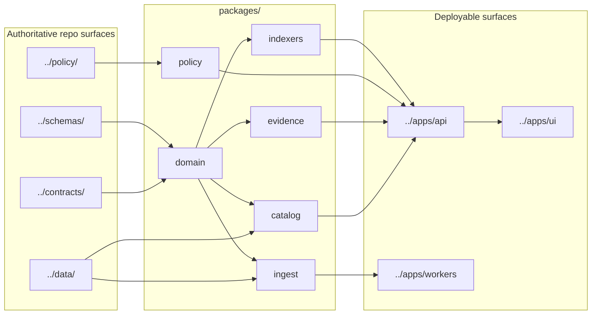

<!-- [KFM_META_BLOCK_V2]
doc_id: kfm://doc/TODO-packages-readme-uuid
title: packages/
type: standard
version: v1
status: review
owners: @bartytime4life
created: YYYY-MM-DD
updated: 2026-03-18
policy_label: public
related: [../README.md, ../.github/README.md, ../contracts/, ../schemas/, ../policy/, ../data/, ./catalog/, ./domain/, ./evidence/, ./indexers/, ./ingest/, ./policy/]
tags: [kfm, packages, readme]
notes: [doc_id and created date need repo-side verification; owner is confirmed from ../.github/CODEOWNERS on main]
[/KFM_META_BLOCK_V2] -->

# `packages/`

Shared internal packages for KFM’s governed truth path, evidence resolution, policy enforcement, catalog validation, domain modeling, and rebuildable runtime projections.

| Field | Value |
|---|---|
| Status | `active` |
| Owners | `@bartytime4life` — current fallback owner in [`../.github/CODEOWNERS`](../.github/CODEOWNERS) |
| Path | [`packages/README.md`](./README.md) |
| Truth posture | `CONFIRMED` current `packages/` surface on `main` · `UNKNOWN` deeper implementation beneath the current child package scaffolds |
| Current repo evidence | `packages/` is present on `main` with `catalog/`, `domain/`, `evidence/`, `indexers/`, `ingest/`, and `policy/` |
| Repo fit | Directory index for shared internal modules under [`./`](./) |
| Badges |     |
| Quick jump | [Scope](#scope) · [Repo fit](#repo-fit) · [Accepted inputs](#accepted-inputs) · [Exclusions](#exclusions) · [Directory tree](#directory-tree) · [Quickstart](#quickstart) · [Usage](#usage) · [Diagram](#diagram) · [Package map](#package-map) · [Boundary rules](#boundary-rules) · [Task list](#task-list) · [FAQ](#faq) |

---

> [!IMPORTANT]
> `packages/` is **not** a general dumping ground and **not** a deployable surface.  
> Deployable entrypoints belong in [`../apps/`](../apps/). Authoritative contracts, schemas, policy bundles, and governed data artifacts belong in [`../contracts/`](../contracts/), [`../schemas/`](../schemas/), [`../policy/`](../policy/), and [`../data/`](../data/). Packages may support those surfaces, but must not quietly replace them.

> [!NOTE]
> The `packages/` directories are repo-visible on `main`, but each child package currently exposes a minimal README scaffold rather than a deeper repo-visible module inventory. Treat this file as the **root directory contract and review map** for shared modules, not as blanket proof that every package already contains mature implementation behind its README.

## Scope

`packages/` holds **shared internal libraries and core modules** used by KFM services, workers, and UI surfaces. This directory exists to keep reusable logic stable, inspectable, and reviewable without smearing domain rules across deployable apps.

In KFM terms, packages should help preserve:

- the governed truth path
- the trust membrane
- authoritative-versus-derived separation
- evidence-linked behavior
- fail-closed defaults where policy matters

This directory may be sparse at times. It is still structurally important.

## Repo fit

**Path:** [`packages/README.md`](./README.md)

**Upstream context**

- [`../README.md`](../README.md) — repository-level operating frame
- [`../.github/README.md`](../.github/README.md) — contribution and review posture
- [`../contracts/`](../contracts/) — authoritative API and schema contract surfaces
- [`../schemas/`](../schemas/) — canonical schema surfaces
- [`../policy/`](../policy/) — executable policy bundles and tests
- [`../data/`](../data/) — governed registry, artifacts, catalogs, and receipts

**Downstream / adjacent package surfaces**

- [`./catalog/`](./catalog/)
- [`./domain/`](./domain/)
- [`./evidence/`](./evidence/)
- [`./indexers/`](./indexers/)
- [`./ingest/`](./ingest/)
- [`./policy/`](./policy/)

**How this directory fits the repo**

`packages/` sits between KFM’s doctrine/contracts/data surfaces and its deployable apps. It is where reusable implementation logic should live **when that logic is shared, bounded, and non-deployable on its own**.

## Accepted inputs

Content belongs in `packages/` when it is a **shared internal module** such as:

- pure domain models, invariants, and type-safe vocabulary
- reusable ingestion helpers, normalizers, validators, or connector logic
- catalog/triplet validation and cross-link logic
- `EvidenceRef` / `EvidenceBundle` resolution helpers
- shared policy adapters, fixture helpers, or obligation enforcement utilities
- projection or index build logic for rebuildable runtime layers
- package-local tests, fixtures, and examples that support the package’s contract

## Exclusions

The following do **not** belong here:

| Does **not** belong in `packages/` | Put it here instead |
|---|---|
| Deployable HTTP services, workers, CLIs, web apps | [`../apps/`](../apps/) |
| Canonical OpenAPI specs, shared JSON Schemas, controlled vocabularies | [`../contracts/`](../contracts/), [`../schemas/`](../schemas/) |
| Repo-wide policy bundles, policy fixtures, gate definitions | [`../policy/`](../policy/) |
| Governed dataset artifacts, catalogs, receipts, manifests | [`../data/`](../data/) |
| Environment-specific deployment config, Terraform, K8s, dashboards | [`../infra/`](../infra/) |
| Architecture doctrine, ADRs, runbooks, contributor policy | [`../docs/`](../docs/) |
| Secrets, credentials, local machine state | nowhere in the repo |

> [!WARNING]
> A package must not become a side door around the trust membrane.  
> No package should create a hidden client-to-store path, a second policy path, or a shadow truth source.

## Directory tree

Currently visible package surfaces on `main`:

```text
packages/
├── README.md
├── catalog/
│   └── README.md
├── domain/
│   └── README.md
├── evidence/
│   └── README.md
├── indexers/
│   └── README.md
├── ingest/
│   └── README.md
└── policy/
    └── README.md
```

> [!NOTE]
> This tree is intentionally conservative. It reflects the package directories and README surfaces currently visible on `main`, not a blanket claim about deeper implementation depth inside each package.

## Quickstart

### 1) Inspect the current package surface

```bash
find packages -maxdepth 2 -type d | sort
find packages -maxdepth 2 -name README.md | sort
find packages -maxdepth 3 -type f | sort
```

### 2) Read the root contract, then check which child packages are still scaffold-only

```bash
sed -n '1,240p' packages/README.md

for d in catalog domain evidence indexers ingest policy; do
  echo "---- $d ----"
  sed -n '1,120p' "packages/$d/README.md"
done
```

### 3) Sanity-check boundary language

```bash
grep -RIn "EvidenceRef\|EvidenceBundle\|policy_label\|spec_hash\|DCAT\|STAC\|PROV" packages
```

### 4) Before adding a new package, answer this

```text
Is this shared logic?
Is it non-deployable on its own?
Does it preserve the trust membrane?
Does it avoid replacing authoritative top-level contracts/policy/data surfaces?
Would more than one app or worker depend on it?
```

If the answer is mostly “no,” it probably should not be a new package.

## Usage

### Treat this README as the root directory contract

Use `packages/README.md` to decide **whether logic belongs in `packages/` at all**. Then confirm the relevant child package README and live files before documenting narrower ownership.

### Prefer package-local clarity over “shared utils” sprawl

If something belongs here, it should have a clear home. Avoid catch-all buckets that erase architectural boundaries.

### Keep imports directional

A package should depend inward toward stable semantics, not outward toward volatile runtime surfaces.

### Keep deployable concerns out

Package code can support deployable apps, but it should not become a stealth app by accumulating startup behavior, routing, auth entrypoints, or environment ownership.

### Update both layers when boundaries change

If a package is added, renamed, or repurposed, update the child package README **and** this root `packages/README.md` in the same change so the directory contract stays truthful.

### Treat scaffolded child READMEs as placeholders, not proof

Where a child package still exposes only a minimal scaffold README, use the package map and boundary rules in this file as the currently documented contract until that child README hardens.

## Diagram


```mermaid
flowchart LR
    subgraph Canonical["Authoritative repo surfaces"]
        C1["../contracts/"]
        C2["../schemas/"]
        C3["../policy/"]
        C4["../data/"]
    end

    subgraph Packages["packages/"]
        P1["domain"]
        P2["ingest"]
        P3["catalog"]
        P4["evidence"]
        P5["policy"]
        P6["indexers"]
    end

    subgraph Deployable["Deployable surfaces"]
        A1["../apps/api"]
        A2["../apps/ui"]
        A3["../apps/workers"]
    end

    C1 --> P1
    C2 --> P1
    C3 --> P5
    C4 --> P2
    C4 --> P3

    P1 --> P2
    P1 --> P3
    P1 --> P4
    P1 --> P6

    P2 --> A3
    P3 --> A1
    P4 --> A1
    P5 --> A1
    P6 --> A1
    A1 --> A2
```

## Package map

| Package | Documented role | KFM posture | Must never do |
|---|---|---|---|
| [`./domain/`](./domain/) | Pure domain vocabulary, invariants, and stable model semantics | canonical semantic core | Import outer-layer IO or perform runtime side effects |
| [`./ingest/`](./ingest/) | Ingestion runners, connectors, normalization, validation, receipts | truth-path critical | Serve clients directly or bypass lifecycle gates |
| [`./catalog/`](./catalog/) | DCAT/STAC/PROV build and validation logic | catalog/triplet critical | Become an ad hoc runtime API surface |
| [`./evidence/`](./evidence/) | Resolve `EvidenceRef` → `EvidenceBundle`, apply redaction and policy-safe presentation | trust-surface critical | Return evidence without policy or restrictions handling |
| [`./policy/`](./policy/) | Shared policy integration helpers and package-local logic | policy-supporting | Drift away from authoritative repo policy surfaces |
| [`./indexers/`](./indexers/) | Build rebuildable projections such as search or map indexes from promoted artifacts | derived/rebuildable | Become authoritative truth or source-of-record |

## Boundary rules

### What makes a good package

A good package usually has:

- one crisp responsibility
- stable import boundaries
- a README that states what it owns and what it refuses to own
- tests and fixtures near the logic they prove
- no silent authority claims beyond its layer

### What should stay at top level

Even when package code supports these surfaces, the **authoritative** repo-level versions stay outside `packages/`:

- API contracts
- shared schemas
- policy bundles and gate fixtures
- governed data artifacts and catalog outputs
- deployment and environment definitions

### Policy overlap rule

There is both a top-level [`../policy/`](../policy/) surface and a package-local [`./policy/`](./policy/) surface. Treat them differently:

- top-level `policy/` = authoritative executable policy surface for the repo/runtime
- `packages/policy/` = shared internal module support for policy behavior

If a change alters the repo’s governing policy behavior, it should not live only inside `packages/policy/`.

## Package creation decision table

| Create a new package when… | Prefer an existing package or another location when… |
|---|---|
| The logic is reused across multiple apps or workers | It serves only one deployable app |
| The boundary can be named clearly in one sentence | The module name would be vague (`common`, `misc`, `utils`) |
| It owns a coherent contract, helper family, or semantic layer | It is mainly environment wiring, startup code, or route glue |
| It can have its own README, tests, and failure rules | It would just forward imports or hide coupling |
| It preserves authoritative-versus-derived boundaries | It starts acting like a second source of truth |

## Task list

### Definition of done for changes under `packages/`

- [ ] The touched package README still matches what the package actually owns
- [ ] No new deployable entrypoint was added under `packages/`
- [ ] No package-local contract silently replaced a top-level authoritative surface
- [ ] Links to adjacent docs still resolve
- [ ] Tests or fixtures were added or updated when behavior changed
- [ ] Boundary language stays explicit: canonical vs derived, governed vs rebuildable, internal vs public
- [ ] The root `packages/README.md` is updated if a package is added, removed, renamed, or repurposed

### Review gates worth applying

- [ ] Can a reviewer tell whether the package is canonical, supporting, or rebuildable?
- [ ] Can a new contributor find the right upstream and downstream docs in under a minute?
- [ ] Would removing this package break more than one surface for a good reason?
- [ ] Does the change preserve the trust membrane?

## FAQ

### When should something go in `packages/` instead of `apps/`?

Put it in `packages/` when it is reusable internal logic with no standalone deployment role. If it is an HTTP service, UI surface, worker runtime, or CLI entrypoint, it belongs in `apps/`.

### Can a package own authoritative data artifacts?

No. Governed artifacts, receipts, registries, and catalogs belong in top-level data surfaces, even if package code builds or validates them.

### Why document this directory even if it is small?

Because `packages/` is a boundary surface. In KFM, weak boundary docs quickly become weak trust behavior.

### Why is the README conservative about the tree?

Because the project’s truth posture matters. This file indexes what is currently visible at the package surface and avoids implying deeper implementation state than the evidence supports.

### Why are several child package READMEs still thin?

Because the current repo view still shows child package READMEs as scaffolds. Until those directories harden with more package-local files and tests, this root README carries most of the shared boundary contract.

## Appendix

<details>
<summary><strong>Boundary checklist for a new package</strong></summary>

### A new package should usually have

- a narrowly stated purpose
- one README with clear scope and exclusions
- tests or fixtures close to the contract it claims
- no direct user-facing runtime entrypoint
- no undocumented dependency on local environment state
- no shadow copy of canonical contracts, policy, or governed data artifacts

### A package should be reconsidered if it starts to absorb

- route handlers
- direct database ownership
- UI shell composition
- environment-specific wiring
- release orchestration
- ad hoc shared helpers with no stable boundary

</details>

<details>
<summary><strong>Observed current package roles at a glance</strong></summary>

| Package | One-line reading |
|---|---|
| `domain` | Stable semantic center |
| `ingest` | Truth-path intake and normalization |
| `catalog` | Catalog-triplet construction and validation |
| `evidence` | Citation and evidence resolution under policy |
| `policy` | Shared policy-support logic |
| `indexers` | Rebuildable runtime projections |

</details>

[Back to top](#packages)
