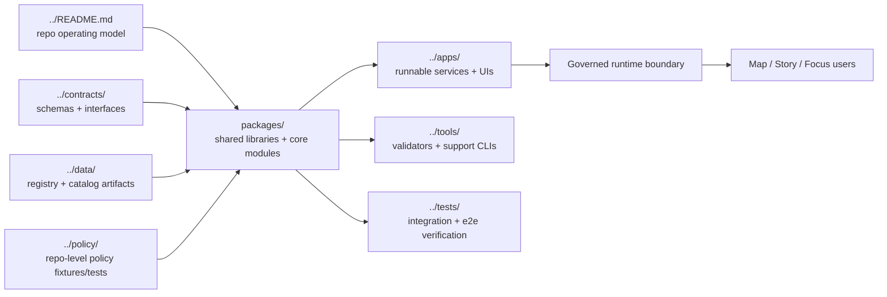

<!-- [KFM_META_BLOCK_V2]
doc_id: kfm://doc/2d0d5a5d-c2af-4cfe-8101-f899594c605d
title: packages
type: standard
version: v1
status: draft
owners: TBD
created: 2026-03-07
updated: 2026-03-07
policy_label: public
related: ["../README.md","../apps/","../contracts/","../data/registry/README.md","../data/catalog/stac/README.md","./ingest/README.md","./catalog/README.md","./evidence/README.md","./policy/README.md","./domain/README.md","./indexers/README.md"]
tags: [kfm, monorepo, packages, architecture, governance]
notes: ["Directory README for shared libraries and internal core modules.","Keeps repo-fit, inputs, exclusions, and package-family map explicit."]
[/KFM_META_BLOCK_V2] -->

# packages
Shared libraries and internal core modules for Kansas Frontier Matrix.

> **Status:** draft  
> **Owners:** TBD (`verify CODEOWNERS`)  
> 
> 
> 
> 
>   
> **Quick links:** [Scope](#scope) · [Repo fit](#repo-fit) · [Accepted inputs](#accepted-inputs) · [Exclusions](#exclusions) · [Reality check](#reality-check) · [Package map](#package-map) · [Quickstart](#quickstart) · [How to add a package](#how-to-add-a-package) · [Diagram](#diagram) · [Definition of Done](#definition-of-done) · [FAQ](#faq)

## Scope
`packages/` is the monorepo home for reusable code that is shared across applications, tools, pipelines, and governed runtime surfaces.

This directory exists to keep shared logic explicit and versioned instead of letting it drift into:
- app-specific code in [`../apps/`](../apps/)
- one-off scripts in [`../scripts/`](../scripts/)
- policy-only material in [`../policy/`](../policy/)
- data and catalog artifacts in [`../data/`](../data/)

KFM packages are not a public runtime boundary by themselves. Public-facing requests must still cross governed services and policy checks before reaching storage or evidence surfaces.

[Back to top](#packages)

## Repo fit

### Path
`packages/`

### Upstream
- [`../README.md`](../README.md) — repo-wide operating model and monorepo posture
- [`../contracts/`](../contracts/) — contracts, schemas, and interface surfaces
- [`../data/registry/README.md`](../data/registry/README.md) — dataset onboarding contract
- [`../data/catalog/stac/README.md`](../data/catalog/stac/README.md) — STAC discovery layer
- [`../policy/`](../policy/) — top-level policy fixtures and tests, when not package-scoped

### Downstream
- [`../apps/`](../apps/) — runnable services and user-facing applications
- [`../tools/`](../tools/) — validators, support CLIs, and repo utilities
- [`../tests/`](../tests/) — unit, integration, policy, and end-to-end verification
- [`../docs/`](../docs/) — ADRs, standards, runbooks, and long-form design

### Architectural role
`packages/` should be read as the shared implementation layer that helps KFM keep:
- domain language stable
- catalog and evidence rules reusable
- policy evaluation consistent
- indexing and ingestion modular
- app boundaries clean

It should not become a dumping ground for random helpers.

[Back to top](#packages)

## Accepted inputs
What belongs here:

- Package directories with a clear single responsibility
- Reusable TypeScript, Python, or other language modules shared by more than one app or workflow
- Package-level `README.md` files that define purpose, boundaries, and invariants
- Shared domain models, validation helpers, policy adapters, evidence utilities, catalog validators, and index builders
- Deterministic tests, fixtures, and small sample data required to verify the package contract
- Package-local schemas or profile definitions when they are integral to that package’s contract

## Exclusions
What does not belong here:

- Runnable product surfaces or deployable services; those belong in [`../apps/`](../apps/)
- Raw, work, processed, or published datasets; those belong under [`../data/`](../data/)
- Infrastructure, Terraform, Kubernetes, or GitOps definitions; those belong in [`../infra/`](../infra/)
- Database migration files; those belong in [`../migrations/`](../migrations/)
- Repo-wide one-off automation; that belongs in [`../scripts/`](../scripts/) or [`../tools/`](../tools/)
- Secrets, credentials, signed URLs, or embedded tokens
- Scratch notebooks or throwaway experiments without a stable package contract

[Back to top](#packages)

## Reality check

| Label | Meaning here |
|---|---|
| **CONFIRMED** | The public repo currently has a top-level `packages/` directory, and package-level docs are present for several package families. |
| **UNKNOWN** | Exact owners, package-manager commands, branch-local CI wiring, and whether additional package folders exist beyond the observed set. |
| **PROPOSED** | The package template, directory checklist, and Definition of Done below. Adopt or refine them with the same PR that changes repo structure. |

## Package map

The following package families are currently the known, documented package surfaces in this tree:

| Package | Purpose | Upstream dependencies | Typical downstream consumers |
|---|---|---|---|
| [`./ingest/`](./ingest/) | Turns upstream inputs into promotable, policy-consistent artifacts plus receipts | source connectors, dataset specs, schemas, policy labels | pipelines, promotion flows, catalog generation |
| [`./catalog/`](./catalog/) | Validates and cross-links the KFM catalog triplet (DCAT + STAC + PROV) | processed artifacts, catalog files, EvidenceRef rules | CI, governed API, discovery surfaces |
| [`./evidence/`](./evidence/) | Resolves `EvidenceRef` values into governed `EvidenceBundle` outputs | catalog links, policy decisions, digests, receipts | API, Evidence Drawer, Focus Mode |
| [`./policy/`](./policy/) | Holds package-scoped policy bundle logic and fixtures | controlled vocabularies, Rego/OPA policies, decision contracts | CI gates, API enforcement, evidence resolution |
| [`./domain/`](./domain/) | Defines pure, IO-free domain models and invariants | canonical vocabulary, time and identity rules | ingest, catalog, API, UI mapping layers |
| [`./indexers/`](./indexers/) | Rebuilds runtime projections from promoted artifacts and validated catalogs | processed artifacts, catalog triplet, policy outputs | PostGIS/search/graph/tile build jobs |

### Directory tree
Observed package-level surface:

```text
packages/
├── README.md
├── catalog/
├── domain/
├── evidence/
├── indexers/
├── ingest/
└── policy/
```

> **Note:** Treat this as the currently observed package README surface, not a guarantee that no other package directories exist on a branch.

[Back to top](#packages)

## Package boundary rules

### 1) One package, one reason to change
A package should have a crisp reason to exist. If a change routinely lands in three unrelated places inside one package, the boundary is probably wrong.

### 2) Shared means actually shared
Do not move code into `packages/` just because it feels “important.” Put code here when it is:
- reused across multiple apps or workflows, or
- the authoritative place for a shared contract or invariant

### 3) No trust-membrane bypass
Packages must not create a backdoor that lets UI or external clients read stores directly. Shared code may help apps enforce the trust membrane; it must not break it.

### 4) Fail closed on uncertainty
If a package participates in catalog validation, evidence resolution, or policy evaluation, unknown or malformed input must fail closed rather than “best effort” its way into runtime.

### 5) Keep package contracts documented
Every substantive package should carry its own `README.md` with:
- purpose
- repo fit
- accepted inputs
- exclusions
- invariants
- tests / gates
- how to extend safely

[Back to top](#packages)

## Quickstart

The safest quickstart for this directory is verification-first.

### 1. Verify the revision you are looking at
```bash
git rev-parse HEAD
```

### 2. Inspect the package surface
```bash
ls -1 packages
find packages -maxdepth 2 -type f -name README.md | sort
```

### 3. Read the directory contract first
```bash
sed -n '1,220p' packages/README.md
```

### 4. Read package-level contracts before changing shared code
```bash
for f in packages/*/README.md; do
  echo "===== $f ====="
  sed -n '1,160p' "$f"
done
```

### 5. Confirm boundaries before moving code
Ask:
1. Is this code actually shared?
2. Does it belong in an existing package?
3. Is the package contract still true after this change?
4. Do downstream apps stay behind governed boundaries?

### 6. Run repo validation
Use the repo’s actual branch-local test and lint commands. Do not invent commands in docs; prefer:
```bash
# verify workspace tooling first
find . -maxdepth 2 \( -name "package.json" -o -name "pnpm-workspace.yaml" -o -name "turbo.json" -o -name "nx.json" -o -name "pyproject.toml" \)
```

[Back to top](#packages)

## How to add a package

1. Create a new folder under `packages/` only when the code has a stable shared responsibility.
2. Add a package-local `README.md` before or with the first meaningful implementation.
3. Document:
   - purpose
   - accepted inputs
   - exclusions
   - invariants
   - public exports
   - tests and gates
4. Keep the public API of the package small and explicit.
5. Add tests and fixtures that prove the package contract.
6. Update this file’s package map if the new package is meant to be a standing part of the monorepo.
7. Update any affected docs in [`../docs/`](../docs/) and contract files in [`../contracts/`](../contracts/) if behavior changed.

### Suggested package template
```text
packages/<name>/
├── README.md
├── src/
├── test/            # or tests/
├── fixtures/        # optional
├── schemas/         # optional, if package-specific
└── package manifest # verify actual workspace/tooling
```

[Back to top](#packages)

## Diagram


```mermaid
flowchart LR
  Root["../README.md<br/>repo operating model"] --> P["packages/<br/>shared libraries + core modules"]
  Contracts["../contracts/<br/>schemas + interfaces"] --> P
  Data["../data/<br/>registry + catalog artifacts"] --> P
  PolicyTop["../policy/<br/>repo-level policy fixtures/tests"] --> P

  P --> Apps["../apps/<br/>runnable services + UIs"]
  P --> Tools["../tools/<br/>validators + support CLIs"]
  P --> Tests["../tests/<br/>integration + e2e verification"]

  Apps --> Runtime["Governed runtime boundary"]
  Runtime --> Users["Map / Story / Focus users"]
```

## Definition of Done

A change in `packages/` is not done until all applicable checks below are true:

- [ ] The package responsibility is still explicit and cohesive.
- [ ] A package-level README exists and matches reality.
- [ ] Public exports are deliberate; internal helpers are not accidentally exposed.
- [ ] No new direct dependency from shared code to UI-only or app-only internals was introduced.
- [ ] No package enables direct client access to storage, search, graph, or tile stores.
- [ ] Tests cover the package’s contract and fail deterministically.
- [ ] Fixtures and examples are policy-safe and free of secrets.
- [ ] If the package affects policy, evidence, or catalog behavior, corresponding contract tests were updated.
- [ ] If the package affects runtime behavior, downstream docs and runbooks were updated in the same PR.
- [ ] The change is additive or clearly documented as a breaking change.

[Back to top](#packages)

## FAQ

### Why keep `packages/` separate from `apps/`?
Because shared contracts and invariants should not be reimplemented inside each runnable service.

### Can a package talk directly to databases or object storage?
Sometimes, but only when that package is clearly infrastructure-oriented and still respects the trust membrane. Shared packages must never become a public bypass route.

### Should every package be independently publishable?
Not necessarily. Some packages are internal-only monorepo modules. What matters is a clear boundary and a stable contract.

### What is the smallest useful package?
One that has a crisp responsibility, a small public surface, and at least one real downstream consumer.

[Back to top](#packages)

<details>
<summary>Appendix: boundary heuristics</summary>

### Put code in `packages/` when:
- more than one app or workflow genuinely depends on it
- it encodes shared invariants or typed contracts
- it should be versioned and tested independently from a single app

### Keep code out of `packages/` when:
- it is only wiring for one app
- it is mostly deployment configuration
- it is an ad hoc migration or emergency script
- the only reason to move it is “maybe we’ll reuse it later”

### Good package names
Prefer names that describe responsibility, not implementation details:
- `domain`
- `catalog`
- `evidence`
- `policy`
- `indexers`
- `ingest`

Avoid vague names like:
- `common`
- `utils`
- `misc`
- `helpers`

[Back to top](#packages)
</details>