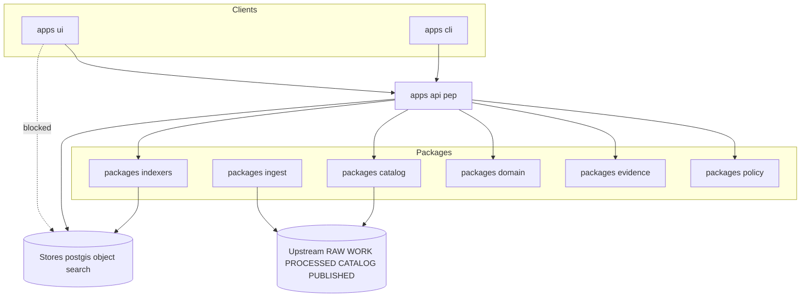

<!-- [KFM_META_BLOCK_V2]
doc_id: kfm://doc/7a1bff64-0e7c-4d7a-9c9b-5a6b2b6d3f7a
title: packages
type: standard
version: v1
status: draft
owners: kfm-core-maintainers-TBD
created: 2026-03-03
updated: 2026-03-03
policy_label: public
related:
  - ../README.md
  - ../apps/README.md
  - ../contracts/README.md
  - ../policy/README.md
  - ../data/README.md
tags: [kfm, monorepo, packages]
notes:
  - Defines what belongs in packages/ and the dependency rules that preserve the policy boundary.
[/KFM_META_BLOCK_V2] -->

# packages
Shared libraries and core modules for Kansas Frontier Matrix. [Confirmed]

**Status:** draft [Proposed]  
**Owners:** `kfm-core-maintainers-TBD` [Unknown]

  
  
  


## Navigation
- [Purpose](#purpose)
- [Where this fits](#where-this-fits)
- [What belongs here](#what-belongs-here)
- [What must not go here](#what-must-not-go-here)
- [Architecture invariants](#architecture-invariants)
- [Dependency rules](#dependency-rules)
- [Reference package map](#reference-package-map)
- [Standard package layout](#standard-package-layout)
- [Creating a new package](#creating-a-new-package)
- [Testing and release](#testing-and-release)
- [Unknowns and verification steps](#unknowns-and-verification-steps)

---

## Claim tags
This repo’s documentation is evidence-disciplined. [Proposed]

- **[Confirmed]** backed by the referenced KFM architecture/governance docs. [Proposed]
- **[Proposed]** a recommended convention or target design, not yet verified in repo state. [Proposed]
- **[Unknown]** not verified; includes the *minimum steps* required to confirm. [Proposed]

---

## Purpose
- `packages/` contains **core modules and shared libraries** (domain logic, use cases). [Confirmed]
- The goal is to make **reusable, governed behavior** available to `apps/` without letting apps bypass policy or evidence requirements. [Proposed]

[Back to top](#packages)

---

## Where this fits
- `apps/` contains runnable services (API, UI, workers, CLI). [Confirmed]
- `packages/` contains shared libraries and core modules used by `apps/`. [Confirmed]
- `contracts/` holds API contracts and schemas consumed by both apps and packages. [Confirmed]
- `policy/` holds policy code and tests (e.g., OPA/Rego). [Confirmed]
- `data/` contains registry entries, lifecycle zones, and catalogs (RAW/WORK/PROCESSED/CATALOG/PUBLISHED). [Confirmed]

[Back to top](#packages)

---

## What belongs here
Acceptable inputs for `packages/` include: [Proposed]

- Domain entities/value objects and invariants (e.g., dataset identity, evidence references). [Proposed]
- Deterministic transforms and validators used by pipelines and the API. [Proposed]
- Evidence resolution helpers (EvidenceRef → EvidenceBundle). [Proposed]
- Policy integration helpers (policy checks, obligation handling, redaction contracts). [Proposed]
- Catalog builders and validators for DCAT/STAC/PROV outputs. [Proposed]
- Indexer builders (tile generation helpers, search indexing helpers) behind adapter interfaces. [Proposed]
- Shared utilities that do not violate the policy boundary. [Proposed]

[Back to top](#packages)

---

## What must not go here
Exclusions for `packages/` include: [Proposed]

- Direct UI code and UI-only state management (belongs in `apps/ui/`). [Proposed]
- Direct database/storage access from client-facing code paths (must cross the governed API / PEP). [Confirmed]
- Secrets, tokens, or credentials (secrets must never enter the repo). [Confirmed]
- Long-lived environment-specific deployment artifacts (belongs in `infra/` and `configs/`). [Proposed]
- Published artifacts (tiles, catalogs, processed outputs) except as test fixtures (belongs in `data/` zones). [Proposed]

[Back to top](#packages)

---

## Architecture invariants
KFM’s architecture is governed by a strict truth path and trust membrane. [Confirmed]

### Truth path and trust membrane diagram

```mermaid
flowchart TB
  subgraph Clients
    UI[apps ui]
    CLI[apps cli]
  end

  API[apps api pep]

  subgraph Packages
    Domain[packages domain]
    Ingest[packages ingest]
    Catalog[packages catalog]
    Evidence[packages evidence]
    Policy[packages policy]
    Indexers[packages indexers]
  end

  Zones[(Upstream RAW WORK PROCESSED CATALOG PUBLISHED)]
  Stores[(Stores postgis object search)]

  UI --> API
  CLI --> API

  API --> Policy
  API --> Evidence
  API --> Domain
  API --> Catalog
  API --> Indexers

  Ingest --> Zones
  Catalog --> Zones
  Indexers --> Stores
  API --> Stores

  UI -. blocked .-> Stores
```

- Clients and UI **must not** access storage directly; access is policy-evaluated at the PEP (governed API). [Confirmed]
- Lifecycle zones exist as a real promotion path (Upstream → RAW → WORK → PROCESSED → CATALOG → PUBLISHED). [Confirmed]
- The catalog triplet (DCAT + STAC + PROV) is treated as a contract surface. [Confirmed]

[Back to top](#packages)

---

## Dependency rules
These rules exist to prevent policy bypass and to keep packages composable. [Proposed]

- `apps/*` **may depend on** `packages/*`. [Proposed]
- `packages/*` **must not depend on** `apps/*`. [Proposed]
- `packages/*` **may depend on** `contracts/*` for schemas, OpenAPI, and controlled vocabularies. [Proposed]
- `packages/*` **must not embed** authoritative schemas as ad-hoc copies when a canonical contract exists. [Proposed]
- Any IO boundary must be behind an adapter interface so policy, logging, and testing can gate it. [Proposed]
- Anything exposed to end users must enable cite-or-abstain behavior by preserving resolvable evidence IDs. [Confirmed]

[Back to top](#packages)

---

## Reference package map
The modules below are the **documented target modules** for KFM. [Confirmed]  
Their *presence in the current repo checkout* is **not guaranteed** without verification. [Confirmed]

| Package | Intended responsibility | Repo presence |
|---|---|---|
| `packages/domain` | Core domain models (e.g., Dataset, EvidenceBundle, StoryNode). [Confirmed] | [Unknown] |
| `packages/ingest` | Ingestion pipelines and connectors (fetch, normalize, validate, emit receipts). [Confirmed] | [Unknown] |
| `packages/catalog` | Build and validate DCAT/STAC/PROV catalogs from processed artifacts. [Confirmed] | [Unknown] |
| `packages/indexers` | Rebuild indexes/tiles/search artifacts (e.g., spatial indexes, vector tiles). [Confirmed] | [Unknown] |
| `packages/evidence` | Evidence resolver (EvidenceRefs → EvidenceBundles) + redaction/generalization support. [Confirmed] | [Unknown] |
| `packages/policy` | Policy engine integration (OPA/Rego), obligation enforcement, context extraction. [Confirmed] | [Unknown] |

[Back to top](#packages)

---

## Standard package layout
Use this as the default skeleton unless a package’s language/tooling requires a different layout. [Proposed]

```text
packages/<package-name>/
├─ README.md
├─ src/                          # library code
├─ tests/                        # unit tests (and fixtures if needed)
├─ contracts/                    # optional: package-specific contracts (if canonical)
├─ adapters/                     # optional: IO boundaries behind interfaces
└─ package-config-TODO           # e.g., package.json, pyproject.toml, Cargo.toml
```

- Every package must have a README describing purpose, allowed inputs, exclusions, and public API surface. [Proposed]
- Tests must cover invariants and failure modes (fail-closed behavior where applicable). [Proposed]

[Back to top](#packages)

---

## Creating a new package
### Minimal checklist
- [ ] Create `packages/<name>/README.md` with claim tags and clear scope. [Proposed]
- [ ] Define exported API surface and keep it small. [Proposed]
- [ ] Add unit tests and fixtures for edge cases. [Proposed]
- [ ] If the package touches policy or evidence, add contract tests that prove no bypass is possible. [Proposed]
- [ ] Update any registry/index of packages if one exists. [Unknown]

### Definition of done
- [ ] Lint/typecheck passes. [Proposed]
- [ ] Unit tests pass. [Proposed]
- [ ] Contract tests pass (schemas/policy where applicable). [Proposed]
- [ ] No secrets added. [Confirmed]
- [ ] Documentation updated if behavior changes affect other layers. [Proposed]

[Back to top](#packages)

---

## Testing and release
- Treat packages as the unit of reuse: tests should run fast and deterministically. [Proposed]
- If the repo uses CI promotion gates, package changes that affect promotion, policy, or evidence must be gated (fail-closed). [Confirmed]
- Versioning and publishing strategy depends on monorepo tooling (workspace manager, language mix). [Unknown]

[Back to top](#packages)

---

## Unknowns and verification steps
Some details cannot be asserted without inspecting the live repository checkout. [Confirmed]

Minimum steps to upgrade “Unknown” → “Confirmed”: [Proposed]

- [ ] Capture commit hash and root tree (e.g., `git rev-parse HEAD` and a shallow `tree` of `packages/`). [Confirmed]
- [ ] Confirm which `packages/*` directories exist and whether they match the documented target modules. [Confirmed]
- [ ] Confirm the monorepo toolchain (workspace manager, build system, test runner). [Unknown]
- [ ] Identify which dependency rules are enforced by CI today (imports, lint rules, policy tests). [Confirmed]

[Back to top](#packages)
