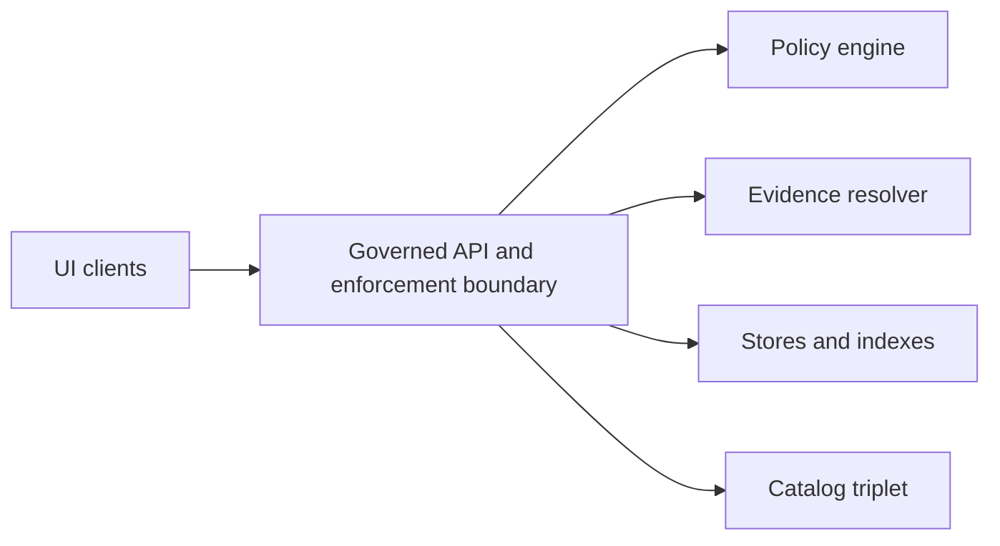
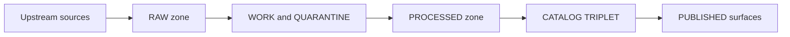
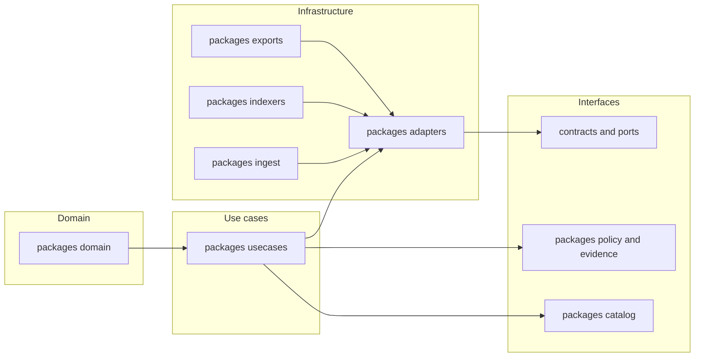

<!-- [KFM_META_BLOCK_V2]
doc_id: kfm://doc/795bfcc7-71af-4d02-a69b-19a97007d799
title: packages/README — Versioned, governed modules
type: standard
version: v4
status: draft
owners: KFM Maintainers (set via CODEOWNERS)
created: 2026-02-25
updated: 2026-03-02
policy_label: public
related:
  - ../README.md
  - ../docs/
  - ../apps/
  - ../contracts/
  - ../configs/
  - ../policy/
tags:
  - kfm
  - monorepo
  - packages
  - layering
  - trust-membrane
  - promotion-contract
  - evidence-first
notes:
  - Directory-level contract for packages/ aligned to KFM vNext governance: truth path, Promotion Contract, trust membrane, evidence resolver, policy-as-code parity (CI/runtime).
  - Treats catalogs and evidence as contract surfaces; citations are EvidenceRefs, not pasted URLs.
  - Keeps toolchain-agnostic patterns; does not claim specific subpackages exist until verified in-repo.
[/KFM_META_BLOCK_V2] -->

<a id="top"></a>

# packages/
Versioned, testable, **governed** modules for the Kansas Frontier Matrix monorepo.

**Purpose:** Keep core system logic **reusable**, **reviewable**, and **enforceable** by policy + tests.  
**Status:** draft • **Owners:** set via `CODEOWNERS` • **Policy:** public (docs)  
**Posture:** default-deny • fail-closed • evidence-first • cite-or-abstain • reproducible by digest


---

## Navigation
- [Stance and labeling](#stance-and-labeling)
- [Non-negotiables](#non-negotiables)
- [Directory contract](#directory-contract)
- [Repo reality check](#repo-reality-check)
- [Trust membrane and truth path](#trust-membrane-and-truth-path)
- [How packages map to KFM architecture](#how-packages-map-to-kfm-architecture)
- [Canonical package taxonomy](#canonical-package-taxonomy)
- [Directory layout template](#directory-layout-template)
- [Packages registry](#packages-registry)
- [Package manifest contract](#package-manifest-contract)
- [Controlled vocabularies](#controlled-vocabularies)
- [Dependency rules](#dependency-rules)
- [Testing, builds, and CI expectations](#testing-builds-and-ci-expectations)
- [Security and compliance](#security-and-compliance)
- [Adding a new package](#adding-a-new-package)
- [Definition of Done](#definition-of-done)
- [Glossary](#glossary)

---

## Stance and labeling

This README is written so it can be used as a **governance-bearing directory contract** without “doc hallucinations.”

We use three labels:

- **CONFIRMED**: a requirement that matches KFM’s documented governance posture and must be enforceable.
- **PROPOSED**: a recommended default pattern that improves enforcement or maintainability.
- **UNKNOWN**: anything about *current repo state* until verified in-repo.

> [!IMPORTANT]
> **No repo claims without verification.**
> Directory names and package lists below are *templates/patterns* unless confirmed by the checks in [Repo reality check](#repo-reality-check).

[Back to top](#top)

---

## Non-negotiables

These are **CONFIRMED** posture-level invariants that packages must uphold:

1. **Trust membrane is real**: clients never access storage directly; access is policy-evaluated at the enforcement boundary.
2. **Truth path is real**: data promotion uses explicit zones and merge-blocking gates; promotion is not “best effort.”
3. **Catalog triplet is a contract surface**: DCAT + STAC + PROV must cross-link so evidence is resolvable without guessing.
4. **Policy parity**: CI and runtime must share policy semantics (or at minimum the same fixtures and outcomes).
5. **Citations are EvidenceRefs**: a “citation” is a resolvable reference that produces an inspectable EvidenceBundle; if it cannot be verified or is not allowed, the system must abstain or reduce scope.

> [!WARNING]
> If a package makes it easy to bypass the trust membrane (for example: browser-facing DB clients, storage SDKs, or privileged keys), treat it as a **security and governance defect**.

[Back to top](#top)

---

## Directory contract

### Where this fits in the repo
`packages/` is the **module layer** between:
- **apps/**: runnable entry points and user/operator surfaces
- **contracts/**: contract-first schemas and controlled vocabularies
- **policy/**: policy-as-code bundles + fixtures + tests
- **data/**: truth-path zones and catalog artifacts
- **infra/** and platform substrates

Packages are where we keep reusable building blocks so apps and services do not copy/paste governance logic.

### Acceptable inputs
✅ Independently testable modules with:
- a clear **public API**
- ownership (`CODEOWNERS` or manifest)
- tests (unit minimum; integration if it does I/O)
- explicit dependency boundaries
- fail-closed behavior where relevant

Common categories (examples; names are PROPOSED):
- **Domain**: canonical IDs, hashing helpers, invariants (no I/O)
- **Use cases**: policy-aware orchestration workflows (no direct storage)
- **Interfaces**: ports, DTOs, contract helpers
- **Adapters**: I/O implementations behind interfaces
- **Evidence**: EvidenceRef/EvidenceBundle types + resolver client contract
- **Catalog**: DCAT/STAC/PROV builders + validators + linkcheck helpers
- **Policy**: obligation models + policy client helpers + fixtures harness glue
- **Geo**: safe geo utilities including generalization helpers
- **Observability**: logging/tracing helpers with policy-safe defaults
- **UI components**: shared evidence drawer/receipt viewer components (only if your repo shares UI as packages)

### Exclusions
❌ Raw datasets, processed artifacts, catalogs, or audit ledgers (belong in `data/` zones)  
❌ Secrets, tokens, `.env`, kubeconfigs, private keys  
❌ Build artifacts (`dist/`, `build/`, `target/`, coverage)  
❌ “Misc” scripts without tests and ownership (use `tools/` or `scripts/`)  
❌ Direct-to-storage patterns from UI clients (trust membrane violation)

[Back to top](#top)

---

## Repo reality check

This README defines **requirements + patterns**. Before treating anything as “repo-present,” verify in-repo.

Minimum checks:

- [ ] Capture repo commit hash + root directory tree (`git rev-parse HEAD` and `tree -L 3`).
- [ ] Confirm the actual list of packages under `packages/`.
- [ ] Confirm the workspace/toolchain boundary (pnpm/yarn/npm/bazel/poetry/uv/go workspaces/etc.).
- [ ] Extract CI gate list from `.github/workflows` and document which checks are merge-blocking.
- [ ] Confirm policy pack location and fixture parity between CI and runtime.
- [ ] Confirm an evidence resolver surface exists and that it is merge-blocking for Story/Focus citations.

Suggested commands:

```bash
git rev-parse HEAD
tree -L 3

find packages -maxdepth 2 -type d -print

# Workspace detection (optional)
ls -la pnpm-workspace.yaml yarn.lock package-lock.json turbo.json nx.json Cargo.toml go.work pyproject.toml 2>/dev/null || true

# Manifest inventory (language-dependent)
find packages -maxdepth 3 \
  \( -name 'package.json' -o -name 'pyproject.toml' -o -name 'go.mod' -o -name 'Cargo.toml' \) -print
```

> [!NOTE]
> If the repo is multi-language, keep ownership and dependency rules explicit; otherwise boundary enforcement becomes “best effort.”

[Back to top](#top)

---

## Trust membrane and truth path

### Trust membrane
**CONFIRMED** invariant: *clients do not access storage directly.* All access goes through a governed enforcement boundary.


```mermaid
flowchart LR
  UI[UI clients] --> PEP[Governed API and enforcement boundary]
  PEP --> PDP[Policy engine]
  PEP --> ER[Evidence resolver]
  PEP --> STO[Stores and indexes]
  PEP --> CAT[Catalog triplet]
```

### Truth path lifecycle
**CONFIRMED** lifecycle zones (conceptual flow):


```mermaid
flowchart LR
  U[Upstream sources] --> R[RAW zone]
  R --> W[WORK and QUARANTINE]
  W --> P[PROCESSED zone]
  P --> C[CATALOG TRIPLET]
  C --> PUB[PUBLISHED surfaces]
```

**Interpretation rules:**
- RAW is immutable and append-only.
- QUARANTINE is not promotable.
- PUBLISHED is only served through governed surfaces and includes receipts.

[Back to top](#top)

---

## How packages map to KFM architecture

Packages should reflect the layered model so governance is enforceable.


```mermaid
flowchart LR
  subgraph D[Domain]
    D1[packages domain]
  end

  subgraph U[Use cases]
    U1[packages usecases]
  end

  subgraph I[Interfaces]
    I1[contracts and ports]
    I2[packages policy and evidence]
    I3[packages catalog]
  end

  subgraph X[Infrastructure]
    X1[packages adapters]
    X2[packages ingest]
    X3[packages indexers]
    X4[packages exports]
  end

  D1 --> U1
  U1 --> I2
  U1 --> I3
  U1 --> X1
  X1 --> I1
  X2 --> X1
  X3 --> X1
  X4 --> X1
```

**Dependency direction rule of thumb:**
- Dependencies flow inward toward **Domain**.
- Vendor SDKs and I/O live behind **Adapters**.
- UI code must consume **governed APIs**, not storage clients.

### Policy as code
**CONFIRMED** policy architecture intent:
- PDP: policy decision point (OPA/Rego or equivalent)
- PEP: enforcement points at CI, runtime API, and evidence resolver
- UI shows policy badges and notices, but **does not decide policy**

[Back to top](#top)

---

## Canonical package taxonomy

> [!NOTE]
> This taxonomy is **PROPOSED** as a boundary strategy. If your repo uses different names, map them explicitly and enforce the same dependency rules.

Common groups:
- `packages/domain/` — canonical IDs, spec hashing, core types
- `packages/usecases/` — orchestration workflows (promotion, evidence resolution, story flows)
- `packages/adapters/` — repository implementations behind interfaces
- `packages/ingest/` — connectors and acquisition helpers
- `packages/indexers/` — rebuildable projections (search, graph, tiles)
- `packages/exports/` — governed export packaging
- `packages/stories/` — Story Node helpers and schema glue
- `packages/focus/` — Focus Mode planner and evaluation hooks
- `packages/evidence/` — EvidenceRef and EvidenceBundle contracts
- `packages/catalog/` — DCAT/STAC/PROV builders, validators, linkcheck
- `packages/policy/` — policy decision models and obligation semantics
- `packages/geo/` — geo validation and safe generalization utilities
- `packages/observability/` — logging, metrics, tracing helpers
- `packages/ui-components/` — shared evidence UI components, if used
- `packages/shared/` — keep minimal; split if it grows

> [!IMPORTANT]
> Taxonomy is only useful if it is machine-enforced. Social boundaries will be violated under deadline pressure.

[Back to top](#top)

---

## Directory layout template

> [!NOTE]
> This is a **PROPOSED** structure. Use it as a template and adjust based on repo reality.

```text
packages/                                                # Versioned, testable modules: clean-architecture libraries powering KFM (domain → usecases → adapters) + shared governance primitives
├─ README.md                                             # Package philosophy, layering rules, dependency direction, and how packages map to apps/contracts/policy/tests
├─ registry/                                             # Machine-readable package registry (recommended): ownership, stability, and dependency constraints
│  ├─ README.md                                          # Registry contract: required fields (owner, policy_label, stability), how CI validates, and how to add/rename packages
│  ├─ packages.v1.json                                   # Canonical package registry (package IDs, paths, owners, public APIs, deps, maturity, test expectations)
│  ├─ schemas/                                           # Schemas for the registry + package metadata (or pointers to contracts/schemas)
│  └─ fixtures/                                          # Registry fixtures for CI (valid/invalid), ensuring fail-closed validation stays deterministic
├─ domain/                                               # Core types + invariants (time model, IDs/spec_hash, geometry contracts, label/obligation primitives) — NO I/O
├─ usecases/                                             # Application logic orchestration (ingest/promote/publish/search) — pure-ish; depends on domain + ports
├─ adapters/                                             # Integrations implementing ports (DB, object store, OPA/PDP, queues, GIS libs, external APIs) — all I/O lives here
├─ ingest/                                               # Ingestion connectors + normalization utilities (pull/snapshot/parse; emits receipts + raw artifacts)
├─ indexers/                                             # Index builders (catalog indexes, search/vector indexes) with deterministic run receipts + rebuild rules
├─ exports/                                              # Governed export builders (tiles, vector dumps, APIs feeds) applying policy labels + obligations at release time
├─ stories/                                              # Story node model + tooling (claims→citations, sidecar schema helpers, publish workflows, validation)
├─ focus/                                                # Focus Mode engine components (retrieval, synthesis constraints, cite-or-abstain guards, evaluation hooks)
├─ evidence/                                             # Evidence primitives + resolvers (EvidenceRef/Bundles, citation formats, provenance links, receipt integration)
├─ catalog/                                              # Catalog generation/validation (DCAT/STAC/PROV emitters, cross-linking, linkcheck, catalog query helpers)
├─ policy/                                               # Policy integration helpers (PEP middleware, obligation handling, decision caching, policy evaluation client)
├─ geo/                                                  # Geospatial primitives/utilities (CRS handling, tiling, geometry validation, spatial indexing helpers)
├─ observability/                                        # Logging/metrics/tracing helpers (redaction-aware, audit-friendly, low-cardinality conventions)
├─ ui-components/                                        # Reusable UI components for trust surfaces (evidence drawer, policy badges, denial UX, receipt viewers)
└─ shared/                                               # Cross-cutting utilities (config loaders, canonical JSON, error types, file helpers, test utilities)
```

> [!TIP]
> If a package has no owner and no tests, it is not a package — it is a liability.

[Back to top](#top)

---

## Packages registry

**PROPOSED**: a package is not “real” until it is registered so CI can enforce boundaries without guessing.

### `packages/registry/packages.v1.json`
Recommended responsibilities:
- owner routing and enforcement
- dependency boundary checks
- policy label and data-access audits
- build/test graph generation

Example shape (illustrative):

```json
{
  "registry_version": "v1",
  "packages": [
    {
      "path": "domain",
      "package_id": "kfm.domain",
      "layer": "domain",
      "owners": ["kfm-engineering"],
      "policy_label": "public",
      "data_access": "none",
      "depends_on": [],
      "ci": { "required": ["lint", "test", "typecheck"], "optional": [] }
    }
  ]
}
```

> [!WARNING]
> Changes to governance-bearing fields (`policy_label`, data access, dependency rules) should trigger stricter review.

[Back to top](#top)

---

## Package manifest contract

**PROPOSED**: add a repo-standard manifest alongside language-native ones.

### `kfm.package.json`
```json
{
  "package_id": "kfm.catalog",
  "name": "KFM Catalog Helpers",
  "layer": "catalog",
  "policy_label": "public",
  "owners": ["kfm-engineering", "kfm-governance"],

  "public_api": {
    "entry_points": ["src/index.*"],
    "contracts_used": [
      "contracts/catalogs/dcat.profile.md",
      "contracts/catalogs/stac.profile.md",
      "contracts/catalogs/prov.profile.md"
    ]
  },

  "data_access": "none",

  "constraints": {
    "forbid_direct_storage_clients": true,
    "require_policy_fixture_updates_for_obligation_changes": true
  }
}
```

Minimum rules:
- required: `package_id`, `layer`, `owners`, `policy_label`
- any package touching contract surfaces must declare `contracts_used`
- any I/O package must declare `data_access` and must not be importable from browser bundles

[Back to top](#top)

---

## Controlled vocabularies

**CONFIRMED starter lists** must be versioned so CI and policy can fail closed without guessing.

### policy_label
Starter set:
- `public`
- `public_generalized`
- `restricted`
- `restricted_sensitive_location`
- `internal`
- `embargoed`
- `quarantine`

### artifact.zone
Starter set:
- `raw`
- `work`
- `processed`
- `catalog`
- `published`

> [!NOTE]
> QUARANTINE is modeled as a zone in the lifecycle, but the starter `artifact.zone` list stays small.
> **PROPOSED**: represent quarantine via `artifact.zone=work` plus `artifact.status=quarantined` if your schemas support it.

### citation.kind
Starter set:
- `dcat`
- `stac`
- `prov`
- `doc`
- `graph`
- `url` (discouraged)

### geometry.generalization_method
Starter set:
- `centroid_only`
- `grid_aggregation_<resolution>`
- `random_offset_<meters>`
- `dissolve_to_admin_unit`
- `bounding_box_only`
- `none`

[Back to top](#top)

---

## Dependency rules

These rules are part of the **trust membrane** and must be machine-enforced.

### Allowed directions
| Layer | May depend on | Must not depend on |
|---|---|---|
| domain | nothing outward | adapters, ingest, indexers, exports, UI |
| usecases | domain, interfaces | direct storage clients, privileged SDKs |
| catalog, policy, evidence | domain, contracts | direct storage, UI-only libs |
| adapters, ingest, indexers, exports | domain, usecases, contracts | UI bundles, browser targets |
| ui-components | domain types, contracts DTOs | storage SDKs, server-only adapters |

### Forbidden patterns
- domain importing adapters or infra clients
- usecases importing DB or object-store clients directly
- ui-components importing privileged adapters
- shared becoming a dumping ground

### Enforcement approaches
Choose what fits your toolchain:
- workspace graph rules
- lint rules or import allowlists
- CI checks for known bypass libraries
- build tags or compilation boundaries

> [!WARNING]
> If a boundary is “social only,” it will be violated. Make it testable.

[Back to top](#top)

---

## Testing, builds, and CI expectations

Packages are safe only if continuously validated.

### Minimum checks
- formatting and lint
- unit tests
- typecheck where applicable
- secret scanning and dependency scanning
- license allowlist checks for packaging and exports

### Evidence resolution and citation gates
**CONFIRMED posture:**
- a “citation” is an **EvidenceRef**, not a pasted URL
- Story publishing and Focus Mode must **fail closed**
- if citations cannot be verified or are not allowed, the system must abstain or reduce scope

### Promotion Contract v1 mapping
**CONFIRMED minimum gates** for promotion exist and are designed to be automated.

| Gate | What must be present |
|---|---|
| A | stable identity and deterministic spec hashing |
| B | licensing and rights metadata |
| C | sensitivity classification and redaction plan |
| D | catalog triplet validates and cross-links |
| E | run receipts and checksums for inputs and outputs |
| F | policy tests and contract tests pass in CI |
| G | optional but recommended production hardening |

> [!NOTE]
> Some plans treat QA thresholds and release manifests as explicit merge-blocking gates too.
> That is compatible with this mapping: you can model them as sub-gates or required checks for your domain.

[Back to top](#top)

---

## Security and compliance

- no secrets in source control
- no trust membrane bypass utilities
- do not leak restricted metadata through distinguishable error responses unless explicitly allowed
- sensitive location protection:
  - store precise geometry only in restricted datasets
  - publish public_generalized derivatives when allowed
  - record generalization transforms in provenance

[Back to top](#top)

---

## Adding a new package

1. Choose the layer and boundaries.
2. Create directory:
   - README with purpose, boundaries, test instructions
   - language-native manifest
   - tests
   - optional `kfm.package.json`
3. Register the package:
   - add entry to the packages registry if present
4. Enforce boundaries:
   - add or update dependency checks
5. Add CI coverage:
   - lint + unit tests minimum
   - add policy/contract/linkcheck if the package touches those surfaces

[Back to top](#top)

---

## Definition of Done

A package is done when:

- [ ] It has an owner and appears in the package registry if used.
- [ ] It has a README with boundaries and test instructions.
- [ ] It has tests (unit minimum; integration if I/O).
- [ ] It follows dependency rules and passes boundary checks.
- [ ] It includes fixtures and contract/policy tests if it affects promotion or serving behavior.
- [ ] It contains no secrets and cannot be used to bypass the trust membrane.

[Back to top](#top)

---

## Glossary
- **Trust membrane**: enforced boundary preventing clients from bypassing policy enforcement and provenance.
- **Truth path**: lifecycle zones from upstream acquisition to governed runtime publication.
- **Promotion Contract**: merge-blocking gate set controlling what becomes runtime-visible.
- **Catalog triplet**: DCAT + STAC + PROV as interoperable evidence and lineage surfaces.
- **EvidenceRef**: resolvable citation reference.
- **EvidenceBundle**: resolved, policy-filtered evidence view returned by evidence resolver.
- **PDP**: policy decision point.
- **PEP**: policy enforcement point.

<p align="right"><a href="#top">Back to top ↑</a></p>
