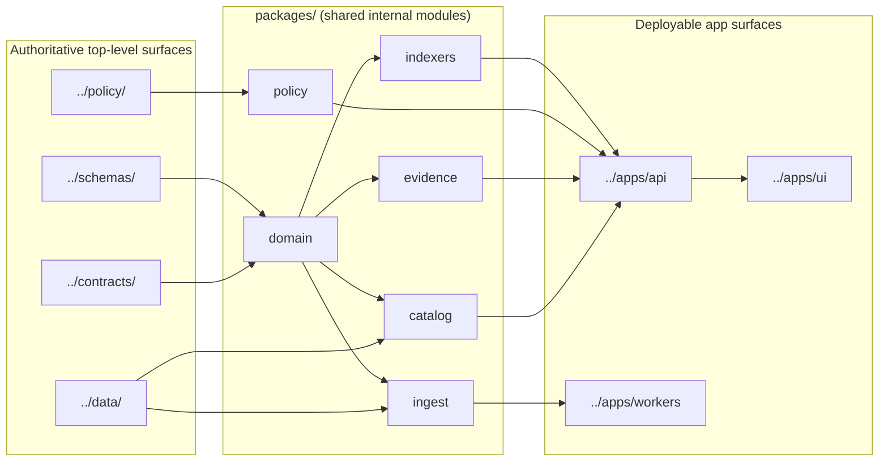

<!-- [KFM_META_BLOCK_V2]
doc_id: kfm://doc/TODO-packages-readme-uuid
title: packages/
type: standard
version: v1
status: review
owners: @bartytime4life
created: YYYY-MM-DD
updated: 2026-03-21
policy_label: public
related: [../README.md, ../.github/README.md, ../apps/, ../contracts/, ../schemas/, ../policy/, ../data/, ../infra/, ../docs/, ./catalog/, ./domain/, ./evidence/, ./indexers/, ./ingest/, ./policy/]
tags: [kfm, packages, readme]
notes: [doc_id and created date still need repo-side verification; owner verified against ../.github/CODEOWNERS on main; live GitHub tree confirms packages/ plus catalog/, domain/, evidence/, indexers/, ingest/, policy/, and child README surfaces; deeper mounted-checkout implementation evidence still needs direct repo verification]
[/KFM_META_BLOCK_V2] -->

# `packages/`

Shared internal packages for KFM’s governed truth path, evidence resolution, policy support, catalog work, domain modeling, and rebuildable runtime projections.


| Field | Value |
|---|---|
| Status | `active` |
| Owners | `@bartytime4life` *(verified in [`../.github/CODEOWNERS`](../.github/CODEOWNERS))* |
| Path | [`packages/README.md`](./README.md) |
| Audited repo | `bartytime4life/Kansas-Frontier-Matrix` |
| Default branch | `main` |
| Repo fit | Shared internal module boundary between top-level authority surfaces and deployable [`../apps/`](../apps/) |
| Current repo evidence | `packages/` is present on `main` with `catalog/`, `domain/`, `evidence/`, `indexers/`, `ingest/`, `policy/`, and child `README.md` surfaces |
| Truth posture | `CONFIRMED` live GitHub tree for directory shape and owner fallback · `CONFIRMED` March 2026 KFM doctrine for package-boundary law · `UNKNOWN` deeper mounted-checkout implementation depth beyond repo-visible README surfaces |
| Quick jump | [Scope](#scope) · [Repo fit](#repo-fit) · [Accepted inputs](#accepted-inputs) · [Exclusions](#exclusions) · [Directory tree](#directory-tree) · [Quickstart](#quickstart) · [Usage](#usage) · [Diagram](#diagram) · [Package map](#package-map) · [Boundary rules](#boundary-rules) · [Task list](#task-list) · [FAQ](#faq) |

---

> [!IMPORTANT]
> `packages/` is a **governed boundary**, not a general dumping ground.  
> Shared logic may live here. Sovereign truth, public release state, and deployable entrypoints should not.

> [!WARNING]
> `packages/` must not become a side door around the trust membrane.  
> No package should create a hidden client-to-store path, a second policy path, or a shadow truth source.

> [!NOTE]
> This revision is grounded in two evidence layers: the live public GitHub tree on `main` for the current directory shape and owner fallback, and the March 2026 KFM manuals for package-boundary doctrine. It does **not** claim a mounted local checkout, a complete manifest inventory, or mature implementation depth inside every child package.

## Scope

`packages/` holds shared internal libraries and core modules used by KFM services, workers, and governed runtime surfaces.

Its job is to keep reusable logic bounded, inspectable, and reviewable without smearing domain rules across deployable apps or silently relocating authority away from top-level contracts, schemas, policy bundles, and governed data artifacts.

In KFM terms, packages should help preserve:

- the canonical governed path
- the trust membrane
- authoritative-versus-derived separation
- evidence-linked behavior
- fail-closed defaults where policy matters
- digest-first and proof-bearing release discipline where packaging becomes release-bearing

This directory can be sparse and still be important. In KFM, boundary quality matters even before package volume does.

## Repo fit

**Path:** [`packages/README.md`](./README.md)

### Upstream context

- [`../README.md`](../README.md) — repo-level operating frame
- [`../.github/README.md`](../.github/README.md) — contribution and review posture
- [`../contracts/`](../contracts/) — authoritative contract surfaces
- [`../schemas/`](../schemas/) — canonical schema surfaces
- [`../policy/`](../policy/) — repo-authoritative policy bundles and tests
- [`../data/`](../data/) — governed registries, artifacts, catalogs, and receipts

### Downstream / adjacent package surfaces

- [`./catalog/`](./catalog/)
- [`./domain/`](./domain/)
- [`./evidence/`](./evidence/)
- [`./indexers/`](./indexers/)
- [`./ingest/`](./ingest/)
- [`./policy/`](./policy/)

### How this directory fits the repo

`packages/` sits between KFM’s authority-bearing top-level surfaces and its deployable apps. It is the place for reusable internal modules when the logic is:

1. shared across more than one deployable surface
2. non-deployable on its own
3. better expressed as a stable internal boundary than as app-local glue

## Accepted inputs

Content belongs in `packages/` when it is a shared internal module such as:

- pure domain models, invariants, and type-safe vocabulary
- reusable ingestion helpers, connector logic, normalizers, and validators
- catalog/triplet build and validation logic
- `EvidenceRef` → `EvidenceBundle` resolution helpers
- shared policy adapters, obligation helpers, or policy-support logic
- rebuildable projection or indexing logic for search/map/runtime acceleration
- package-local tests, fixtures, and examples that prove the package’s own contract

## Exclusions

The following do **not** belong here:

| Does **not** belong in `packages/` | Put it here instead |
|---|---|
| Deployable HTTP services, workers, CLIs, or web apps | [`../apps/`](../apps/) |
| Canonical OpenAPI definitions, JSON Schemas, controlled vocabularies | [`../contracts/`](../contracts/), [`../schemas/`](../schemas/) |
| Repo-authoritative policy bundles, policy fixtures, or gate definitions | [`../policy/`](../policy/) |
| Governed dataset artifacts, registries, catalogs, receipts, release manifests | [`../data/`](../data/) |
| Environment-specific deployment config, IaC, cluster overlays, dashboards | [`../infra/`](../infra/) |
| Architecture doctrine, ADRs, runbooks, contributor policy | [`../docs/`](../docs/) |
| Secrets, credentials, machine-local state | nowhere in the repo |

## Directory tree

**Current repo-visible package surfaces on `main`**

```text
packages/
├── README.md
├── catalog/
│   └── README.md
├── domain/
│   └── README.md
├── evidence/
│   └── README.md
├── indexers/
│   └── README.md
├── ingest/
│   └── README.md
└── policy/
    └── README.md
```

> [!NOTE]
> This tree is **confirmed repo-visible** on `main`. It proves directory presence and child `README.md` surfaces, not deeper implementation maturity inside each package.

## Quickstart

### 1) Inspect the current package surface

```bash
find packages -maxdepth 2 -type d | sort
find packages -maxdepth 2 -name README.md | sort
find packages -maxdepth 3 -type f | sort
```

### 2) Recheck ownership and adjacent authority surfaces

```bash
sed -n '1,160p' .github/CODEOWNERS
sed -n '1,220p' README.md
sed -n '1,220p' .github/README.md
```

### 3) Read the root contract, then the child package surfaces

```bash
sed -n '1,240p' packages/README.md

for d in catalog domain evidence indexers ingest policy; do
  echo "---- $d ----"
  test -f "packages/$d/README.md" && sed -n '1,160p' "packages/$d/README.md"
done

find packages -maxdepth 3 \( -name package.json -o -name pyproject.toml -o -name Cargo.toml -o -name go.mod \) | sort
```

### 4) Sanity-check package-boundary terms

```bash
grep -RIn "EvidenceBundle\|RuntimeResponseEnvelope\|release_manifest\|policy_label\|CatalogClosure\|DatasetVersion" packages
```

### 5) Before creating a new package, answer this

```text
Is this shared logic?
Is it non-deployable on its own?
Does it preserve the trust membrane?
Does it avoid replacing top-level contracts/policy/data authority?
Would more than one app or worker depend on it?
```

If the answer is mostly “no,” it probably should not become a new package.

## Usage

### Treat this README as the root directory contract

Use `packages/README.md` to decide whether logic belongs in `packages/` at all. Then confirm the relevant child package README and live files before documenting narrower ownership.

### Treat README-first child packages honestly

Some child package surfaces on `main` are currently README-first. That is useful and legitimate, but it is not evidence of mature implementation depth by itself. Keep boundary docs truthful to the live files.

### Prefer clear package homes over “shared utils” sprawl

If something belongs here, it should have a crisp home. Avoid catch-all buckets that erase architectural boundaries.

### Keep imports directional

Packages should depend inward toward stable semantics, not outward toward volatile runtime shells.

### Keep deployable concerns out

Package code may support apps, but it should not accumulate startup behavior, route handlers, auth entrypoints, or environment ownership until it quietly behaves like an app.

### Update both layers when boundaries change

If a package is added, renamed, split, or repurposed, update the child package README **and** this root `packages/README.md` in the same change.

### Do not let package-local convenience outrank stronger authority

When a type, schema, policy, or artifact family is authoritative at the repo top level, a package may implement against it, validate it, or emit it—but should not silently redefine it.

## Diagram


```mermaid
flowchart LR
    subgraph Canonical["Authoritative top-level surfaces"]
        C1["../contracts/"]
        C2["../schemas/"]
        C3["../policy/"]
        C4["../data/"]
    end

    subgraph Packages["packages/ (shared internal modules)"]
        P1["domain"]
        P2["ingest"]
        P3["catalog"]
        P4["evidence"]
        P5["policy"]
        P6["indexers"]
    end

    subgraph Deployable["Deployable app surfaces"]
        A1["../apps/api"]
        A2["../apps/ui"]
        A3["../apps/workers"]
    end

    C1 --> P1
    C2 --> P1
    C3 --> P5
    C4 --> P2
    C4 --> P3

    P1 --> P2
    P1 --> P3
    P1 --> P4
    P1 --> P6

    P2 --> A3
    P3 --> A1
    P4 --> A1
    P5 --> A1
    P6 --> A1
    A1 --> A2
```

> [!NOTE]
> The arrows show intended architectural dependency direction and boundary intent. They are not a direct current-session import graph.

## Package map

| Package | Documented role | KFM posture | Must never do |
|---|---|---|---|
| [`./domain/`](./domain/) | Stable domain vocabulary, invariants, and semantic core | canonical semantic support | Import outer-layer IO or own deployable side effects |
| [`./ingest/`](./ingest/) | Intake helpers, connectors, normalization, validation, receipts | truth-path critical | Serve clients directly or bypass lifecycle gates |
| [`./catalog/`](./catalog/) | Catalog/triplet build and validation logic | outward-release critical | Become an ad hoc runtime API surface |
| [`./evidence/`](./evidence/) | Evidence resolution and policy-safe support handling | trust-surface critical | Return evidence without restriction or release handling |
| [`./policy/`](./policy/) | Shared policy-support logic, adapters, obligations | policy-supporting | Drift away from repo-authoritative policy surfaces |
| [`./indexers/`](./indexers/) | Rebuildable search/map/runtime projections | derived/rebuildable | Behave like source-of-record truth |

## Package-adjacent governed objects

These objects are central to package behavior, but the **stronger authority for their machine-readable shape** should remain at top-level contract, schema, policy, or data surfaces.

| Object family | Stronger home | Typical package relationship |
|---|---|---|
| `SourceDescriptor`, `ValidationReport` | [`../contracts/`](../contracts/), [`../schemas/`](../schemas/) | `ingest/` and validators consume and emit them |
| `DatasetVersion`, `CatalogClosure` | [`../data/`](../data/), contract/schema surfaces | `catalog/` and `ingest/` build, validate, and link them |
| `EvidenceBundle`, `RuntimeResponseEnvelope` | contract/schema + governed API surfaces | `evidence/` and runtime helpers resolve or emit them |
| `ReleaseManifest`, proof objects, correction objects | delivery/tooling/package release surfaces | packages reference them; they should not quietly fork them |

## Boundary rules

### What makes a good package

A good package usually has:

- one crisp responsibility
- stable dependency direction
- a README that states what it owns and what it refuses to own
- tests and fixtures near the logic they prove
- no silent authority claims beyond its layer

### What should stay at top level

Even when package code supports these surfaces, the **authoritative** versions stay outside `packages/`:

- API contracts
- shared schemas
- policy bundles and gate fixtures
- governed data artifacts and catalog outputs
- deployment and environment definitions
- release proof packs and operational controls

### Policy overlap rule

There is both a top-level [`../policy/`](../policy/) surface and a package-local [`./policy/`](./policy/) surface. Treat them differently:

- top-level `policy/` = repo-authoritative executable policy surface
- `packages/policy/` = shared internal policy-support module

If a change alters governing policy behavior, it should not live only inside `packages/policy/`.

## Package creation decision table

| Create a new package when… | Prefer an existing package or another location when… |
|---|---|
| The logic is reused across multiple apps or workers | It serves only one deployable app |
| The boundary can be named clearly in one sentence | The name would be vague (`common`, `misc`, `utils`) |
| It owns a coherent semantic layer, helper family, or integration seam | It is mainly environment wiring, startup code, or route glue |
| It can carry its own README, tests, and failure rules | It would only forward imports or hide coupling |
| It preserves authoritative-versus-derived boundaries | It starts acting like a second source of truth |

## Task list

### Definition of done for changes under `packages/`

- [ ] The touched package README still matches what the package actually owns
- [ ] No new deployable entrypoint was added under `packages/`
- [ ] No package-local type, schema, or policy silently replaced a stronger top-level authoritative surface
- [ ] Links to adjacent docs still resolve
- [ ] Tests or fixtures were added or updated when behavior changed
- [ ] Boundary language stays explicit: canonical vs derived, governed vs rebuildable, internal vs public
- [ ] The root `packages/README.md` is updated if a package is added, removed, renamed, or materially repurposed

### Review gates worth applying

- [ ] Can a reviewer tell whether the package is canonical-supporting, policy-supporting, or rebuildable?
- [ ] Can a contributor find the right upstream and downstream docs in under a minute?
- [ ] Would removing this package break more than one surface for a good reason?
- [ ] Does the change preserve the trust membrane?
- [ ] Are package-adjacent proof objects, release linkages, and correction paths still reconstructable?

## FAQ

### When should something go in `packages/` instead of `apps/`?

Put it in `packages/` when it is reusable internal logic with no standalone deployment role. If it is an HTTP service, UI surface, worker runtime, or CLI entrypoint, it belongs in `apps/`.

### Can a package own authoritative data artifacts?

No. Governed artifacts, receipts, registries, catalogs, and release-bearing outward metadata belong in top-level authority surfaces, even if package code builds or validates them.

### Why document this directory even if it is small?

Because `packages/` is a boundary surface. In KFM, weak boundary docs quickly become weak trust behavior.

### Why is this README still conservative about implementation depth?

Because the public GitHub tree is enough to confirm directory shape and owner fallback, but not enough to prove mounted-checkout manifests, test depth, or implementation maturity inside each child package.

### Why distinguish package-local logic from contract/schema/data surfaces so strongly?

Because KFM treats package boundaries as governance boundaries. Reusable code may live here; sovereign contract, policy, and release truth should not drift here by convenience.

## Appendix

<details>
<summary><strong>Boundary checklist for a new package</strong></summary>

### A new package should usually have

- a narrowly stated purpose
- one README with clear scope and exclusions
- tests or fixtures close to the contract it claims
- no direct user-facing runtime entrypoint
- no undocumented dependency on local environment state
- no shadow copy of canonical contracts, policy bundles, or governed data artifacts

### A package should be reconsidered if it starts to absorb

- route handlers
- direct database ownership
- UI shell composition
- environment-specific wiring
- release orchestration
- ad hoc shared helpers with no stable boundary

</details>

<details>
<summary><strong>Package-adjacent proof objects at a glance</strong></summary>

| Object | Why it matters |
|---|---|
| `run_manifest` / `run_receipt` | Makes execution and promotion evidence-bearing |
| `validation_report` | Makes pass/fail gates inspectable |
| `dataset_version` / `catalog_closure` | Keeps authoritative scope and outward release linked |
| `EvidenceBundle` | Makes evidence drill-through concrete |
| `RuntimeResponseEnvelope` | Makes runtime outcomes accountable |
| `release_manifest` + proof objects | Makes release trust reconstructable |
| `correction_notice` | Prevents silent overwrite after publication |

</details>

<details>
<summary><strong>Documented package roles at a glance</strong></summary>

| Package | One-line reading |
|---|---|
| `domain` | Stable semantic center |
| `ingest` | Truth-path intake and normalization |
| `catalog` | Catalog/triplet construction and validation |
| `evidence` | Citation and evidence resolution under policy |
| `policy` | Shared policy-support logic |
| `indexers` | Rebuildable runtime projections |

</details>

[Back to top](#packages)
