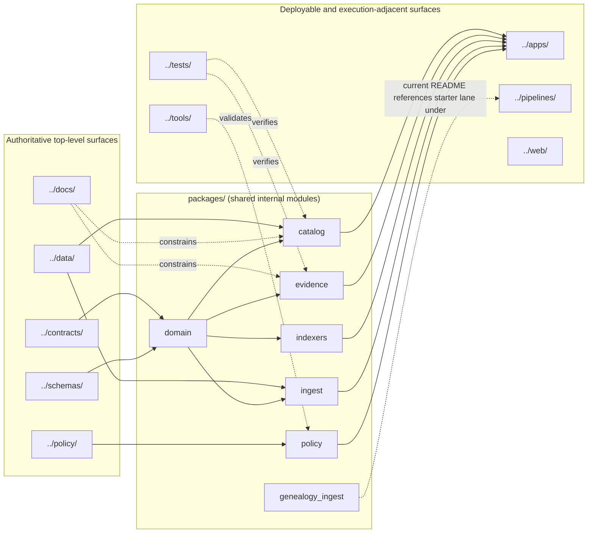

<!-- [KFM_META_BLOCK_V2]
doc_id: kfm://doc/TODO-packages-readme-uuid
title: packages/
type: standard
version: v1
status: review
owners: @bartytime4life
created: YYYY-MM-DD
updated: YYYY-MM-DD
policy_label: public
related: [../README.md, ../.github/README.md, ../.github/workflows/README.md, ../pipelines/README.md, ../apps/, ../web/, ../contracts/, ../schemas/, ../policy/, ../data/, ../data/registry/README.md, ../docs/, ../infra/, ../tests/, ../tools/, ../scripts/, ./catalog/, ./domain/, ./evidence/, ./genealogy_ingest/, ./indexers/, ./ingest/, ./policy/]
tags: [kfm, packages, readme]
notes: [doc_id and repo-side created/updated dates need verification, owner verified against ../.github/CODEOWNERS on current public main, current public main confirms packages/ plus catalog/, domain/, evidence/, genealogy_ingest/, indexers/, ingest/, and policy/ child package surfaces, current public main also confirms ../web/ as a downstream presentation-facing surface relevant to package placement, public-main child package directories are still README-only, genealogy_ingest README currently references starter files under pipelines/genealogy_ingest while the public pipelines/ index does not currently expose that lane, so path alignment needs verification]
[/KFM_META_BLOCK_V2] -->

# `packages/`

Shared internal package boundaries for KFM’s governed truth path, evidence resolution, catalog work, policy support, domain modeling, and rebuildable runtime projections.


| Field | Value |
|---|---|
| Status | `active` directory · `review` README revision |
| Owners | `@bartytime4life` *(verified in [`../.github/CODEOWNERS`](../.github/CODEOWNERS))* |
| Path | [`packages/README.md`](./README.md) |
| Audited public tree | `bartytime4life/Kansas-Frontier-Matrix@main` |
| Default branch | `main` |
| Repo fit | Shared internal module boundary between top-level authority surfaces and downstream deployable [`../apps/`](../apps/), presentation-facing [`../web/`](../web/), and lane-oriented [`../pipelines/README.md`](../pipelines/README.md) execution surfaces |
| Current repo evidence | `packages/` exists on public `main`; visible child package surfaces now include `catalog/`, `domain/`, `evidence/`, `genealogy_ingest/`, `indexers/`, `ingest/`, and `policy/`; those child directories are README-only on current public `main`, with `genealogy_ingest/README.md` explicitly documenting a starter lane under `pipelines/genealogy_ingest/` |
| Truth posture | `CONFIRMED` current public path, visible child package surfaces, README-only public child directories, and fallback owner · `CONFIRMED` neighboring repo docs and child README surfaces where checked · `UNKNOWN / NEEDS VERIFICATION` deeper package-local code, manifests, tests, fixtures, imports, and runtime wiring beneath most child paths |
| Quick jump | [Scope](#scope) · [Repo fit](#repo-fit) · [Accepted inputs](#accepted-inputs) · [Exclusions](#exclusions) · [Current package surface](#current-package-surface) · [Directory tree](#directory-tree) · [Quickstart](#quickstart) · [Usage](#usage) · [Diagram](#diagram) · [Package map](#package-map) · [Boundary rules](#boundary-rules) · [Task list](#task-list) · [FAQ](#faq) |

---

> [!IMPORTANT]
> `packages/` is a **governed boundary**, not a general dumping ground.  
> Shared internal logic may live here. Sovereign truth, public release state, deployable entrypoints, and policy-significant publication decisions should not.

> [!WARNING]
> `packages/` must not become a side door around the trust membrane.  
> No package should create a hidden client-to-store path, a second policy path, or a shadow truth source.

> [!NOTE]
> The public package family is no longer perfectly uniform, and it is still mostly README-only on public `main`.  
> The current tree visibly includes a seventh child surface, [`./genealogy_ingest/`](./genealogy_ingest/), and that child README currently frames a starter ingest lane against `pipelines/genealogy_ingest/`. Keep **current path**, **documented target path**, and **actual checked-in implementation** visibly separate until the branch proves they align.

## Scope

`packages/` holds shared internal libraries and reusable module boundaries used by KFM services, workers, validators, governed runtime surfaces, and downstream client-facing layers that still remain subordinate to stronger contract, policy, and evidence authority.

Its job is to keep reusable logic bounded, inspectable, and reviewable without smearing domain rules across deployable apps, web shells, or lane-local execution work, and without quietly relocating authority away from top-level contracts, schemas, policy bundles, governed data artifacts, and trust-visible runtime seams.

In KFM terms, packages should help preserve:

- the governed truth path
- the trust membrane
- authoritative-versus-derived separation
- evidence-linked behavior
- fail-closed defaults where policy matters
- rebuildable derived layers that do not pretend to be canonical truth

### Evidence posture used in this README

| Label | Meaning here |
|---|---|
| **CONFIRMED** | Directly supported by the current public repo files or current child/package docs inspected for this revision |
| **INFERRED** | Strongly suggested by neighboring repo docs and current directory contracts, but not re-proven from deeper mounted code in this task |
| **PROPOSED** | Recommended package-boundary guidance consistent with KFM doctrine |
| **UNKNOWN / NEEDS VERIFICATION** | Not established strongly enough from the inspected public tree to present as current implementation reality |

## Repo fit

**Path:** [`packages/README.md`](./README.md)

### Upstream authority surfaces

- [`../README.md`](../README.md) — repo-wide operating frame and verification-first posture
- [`../.github/README.md`](../.github/README.md) — repo-wide review, CI/CD, and gatehouse posture
- [`../contracts/`](../contracts/) — machine-readable contract backbone
- [`../schemas/`](../schemas/) — canonical schema surfaces
- [`../policy/`](../policy/) — governed executable policy surface
- [`../data/`](../data/) — governed registries, lifecycle zones, catalogs, receipts, and published artifacts
- [`../docs/`](../docs/) — doctrine, ADRs, runbooks, and longer architecture records

### Adjacent engineering surfaces

- [`../.github/workflows/README.md`](../.github/workflows/README.md) — current public workflow lane doc and merge-gate context
- [`../pipelines/README.md`](../pipelines/README.md) — lane-specific execution surface for fetch / normalize / validate / emit work
- [`../web/`](../web/) — web-delivered client or presentation surface that should stay downstream of governed contracts, policy, and evidence
- [`../data/registry/README.md`](../data/registry/README.md) — governed source-registration handoff relevant to shared intake helpers
- [`../tests/README.md`](../tests/README.md) — verification and fixture posture
- [`../tools/README.md`](../tools/README.md) — validators and utility tooling
- [`../scripts/README.md`](../scripts/README.md) — supporting automation and non-authoritative helper entrypoints
- [`../infra/`](../infra/) — environment wiring, deployment, and operational mechanics

### Child package surfaces

- [`./catalog/`](./catalog/)
- [`./domain/`](./domain/)
- [`./evidence/`](./evidence/)
- [`./genealogy_ingest/`](./genealogy_ingest/)
- [`./indexers/`](./indexers/)
- [`./ingest/`](./ingest/)
- [`./policy/`](./policy/)

### Current public delta carried into this revision

| Delta | Why it matters now | Status |
|---|---|---|
| `packages/` now visibly includes `genealogy_ingest/` | The parent README must no longer describe the package family as only six child surfaces | **CONFIRMED** |
| `genealogy_ingest/README.md` is a substantive child README, not a placeholder pointer | The family is no longer a flat cluster of nearly identical child docs | **CONFIRMED** |
| `genealogy_ingest/README.md` frames itself against `pipelines/genealogy_ingest/` | Package-path versus pipeline-path ownership needs to stay explicit until the branch actually aligns them | **CONFIRMED** |
| The current public [`../pipelines/README.md`](../pipelines/README.md) index only exposes `soils/gssurgo-ks/` and `wbd-huc12-watcher/` | Parent-package docs must not silently rewrite a documented tension into a settled path fact | **CONFIRMED** |
| Current public child package directories remain README-only on `main` | Parent-package docs should keep implementation-depth claims bounded until deeper child files are directly visible | **CONFIRMED** |
| The current public root README also documents [`../web/`](../web/) as a core repo surface | Package-placement guidance should not imply every downstream runtime or presentation consumer lives only under `apps/` and `pipelines/` | **CONFIRMED** |

### How this directory fits the repo

`packages/` sits between KFM’s top-level authority surfaces and its deployable, presentation-facing, or lane-specific execution surfaces. Logic belongs here when it is:

1. shared across more than one deployable surface, worker, validator, lane, or presentation-facing client surface
2. non-deployable on its own
3. easier to review as a stable internal boundary than as app-local or shell-local glue
4. subordinate to stronger top-level contract, policy, data, and review authority

## Accepted inputs

Content belongs in `packages/` when it is a **shared internal module** such as:

- pure domain models, invariants, and type-safe vocabulary
- reusable ingestion helpers, connector logic, normalizers, and validators
- catalog / triplet build and validation logic
- `EvidenceRef` → `EvidenceBundle` resolution helpers
- shared policy adapters, obligation helpers, or policy-support logic
- rebuildable projection or indexing logic for search, map, or runtime acceleration
- shared receipt, diff, or validation helpers that support more than one lane or runtime
- package-local tests, fixtures, and examples that prove a package’s own contract

## Exclusions

The following do **not** belong in `packages/`:

| Does **not** belong in `packages/` | Put it here instead |
|---|---|
| Deployable HTTP services, workers, CLIs, web apps, or web-delivered presentation shells | [`../apps/`](../apps/) or [`../web/`](../web/) |
| Lane-specific execution shells, fetch recipes, or watcher entrypoints whose main job is to run a single pipeline | [`../pipelines/README.md`](../pipelines/README.md), lane-local directories, or [`../scripts/`](../scripts/) |
| Canonical OpenAPI definitions, JSON Schemas, or shared vocabularies | [`../contracts/`](../contracts/), [`../schemas/`](../schemas/) |
| Repo-authoritative policy bundles, policy fixtures, or gate definitions | [`../policy/`](../policy/) |
| Governed dataset artifacts, registries, catalogs, receipts, and release-bearing outward metadata | [`../data/`](../data/) |
| Environment-specific deployment config, IaC, overlays, dashboards | [`../infra/`](../infra/) |
| Architecture doctrine, ADRs, runbooks, contributor policy | [`../docs/`](../docs/) |
| Secrets, credentials, local machine state | nowhere in the repo |

## Current package surface

| Path | Present on `main` | Current visible state | Reading rule |
|---|---|---|---|
| [`./catalog/`](./catalog/) | Yes | README-only child boundary surface visible on public `main` | Use the child README plus this parent contract; deeper implementation still needs branch inspection |
| [`./domain/`](./domain/) | Yes | README-only child boundary surface visible on public `main` | Same |
| [`./evidence/`](./evidence/) | Yes | README-only child boundary surface visible on public `main` | Same |
| [`./genealogy_ingest/`](./genealogy_ingest/) | Yes | README-only child directory visible on public `main`; its README documents a starter lane under `pipelines/genealogy_ingest/` | Keep package-path versus pipeline-path alignment explicit; do not claim settled package-local code ownership until the active branch proves it |
| [`./indexers/`](./indexers/) | Yes | README-only child boundary surface visible on public `main` | Same |
| [`./ingest/`](./ingest/) | Yes | README-only child boundary surface visible on public `main` | Same |
| [`./policy/`](./policy/) | Yes | README-only child boundary surface visible on public `main` | Same |

> [!TIP]
> Read the child package family as **README-driven**, and currently almost entirely **README-only on public `main`**.  
> Several child READMEs now carry stronger package-local boundary prose, and `genealogy_ingest/` introduces an explicit path-alignment tension that should stay visible until verified.

## Directory tree

**Current public package-family surface**

```text
packages/
├── README.md
├── catalog/
│   └── README.md            # README-only public surface visible
├── domain/
│   └── README.md            # README-only public surface visible
├── evidence/
│   └── README.md            # README-only public surface visible
├── genealogy_ingest/
│   └── README.md            # README-only public surface; child README points at pipelines/genealogy_ingest starter path
├── indexers/
│   └── README.md            # README-only public surface visible
├── ingest/
│   └── README.md            # README-only public surface visible
└── policy/
    └── README.md            # README-only public surface visible
```

> [!NOTE]
> This tree is intentionally conservative.  
> It proves the current public child surfaces that are visible now. It does **not** prove package manifests, `src/` trees, tests, or runtime adoption beneath most child paths.

## Quickstart

### 1) Inventory the package surface

```bash
find packages -maxdepth 2 -type d | sort
find packages -maxdepth 2 -name README.md | sort
find packages -maxdepth 4 -type f | sort
```

### 2) Recheck adjacent authority and downstream surfaces

```bash
sed -n '1,240p' packages/README.md
sed -n '1,160p' .github/CODEOWNERS
sed -n '1,260p' README.md
sed -n '1,260p' .github/README.md
sed -n '1,220p' .github/workflows/README.md
sed -n '1,220p' pipelines/README.md
sed -n '1,220p' contracts/README.md
sed -n '1,220p' schemas/README.md
sed -n '1,220p' policy/README.md
sed -n '1,240p' data/README.md
sed -n '1,220p' data/registry/README.md
ls -la apps web 2>/dev/null || true
```

### 3) Read every visible child package doc before claiming narrower ownership

```bash
for d in catalog domain evidence genealogy_ingest indexers ingest policy; do
  echo "---- $d ----"
  test -f "packages/$d/README.md" && sed -n '1,180p' "packages/$d/README.md"
done
```

### 4) Look for deeper package-local implementation before upgrading claims

```bash
find packages -maxdepth 4 \
  \( -name package.json -o -name pyproject.toml -o -name Cargo.toml -o -name go.mod -o -name tsconfig.json \) \
  | sort
```

### 5) Sanity-check shared package vocabulary

```bash
grep -RIn \
  "EvidenceRef\|EvidenceBundle\|CatalogClosure\|RuntimeResponseEnvelope\|DecisionEnvelope\|CorrectionNotice" \
  packages contracts policy docs tests 2>/dev/null || true
```

### 6) Inspect the package/pipeline boundary before normalizing it in docs

```bash
sed -n '1,220p' packages/genealogy_ingest/README.md
find packages/genealogy_ingest -maxdepth 4 -type f | sort
find pipelines -maxdepth 3 -path '*/genealogy_ingest*' -print | sort
```

### 7) Before creating a new package, answer this

```text
Is this shared logic?
Is it non-deployable on its own?
Does it preserve the trust membrane?
Does it avoid replacing top-level contract, policy, or data authority?
Would more than one app, worker, lane, or downstream client surface depend on it?
```

If the answer is mostly “no,” it probably should not become a new package.

## Usage

### Treat this README as the root directory contract

Use `packages/README.md` to decide **whether logic belongs in `packages/` at all**. Then confirm the relevant child package README and live files before documenting narrower ownership.

### Treat child READMEs as boundary docs first

Some child READMEs now carry meaningful package-local or starter-lane prose. That is useful, but it is still not the same thing as a proven package-local implementation tree. Keep child README language and checked-in file depth distinct.

### Keep mixed child state visible

The package family now includes both:

- narrow, mostly README-only boundary surfaces that mainly define package seams, and
- at least one child README that documents a more concrete starter lane against another repo path

Do not flatten those into one narrative.

### Prefer named package homes over `common/` or `utils/` sprawl

If something belongs here, it should have a crisp home. Catch-all buckets erase architecture.

### Keep imports directional

Packages should depend inward toward stable semantics, not outward toward volatile runtime shells, lane orchestration, or environment-specific glue.

### Keep deployable concerns out

Package code may support apps, pipelines, and web-delivered client surfaces, but it should not quietly become an app, lane, or presentation shell by accumulating startup behavior, route handlers, auth entrypoints, scheduler ownership, or environment ownership.

### Keep package and pipeline boundaries explicit

A package may support a lane. A lane may document or consume a package. Those are not the same thing. If a child README names a pipeline path as its starter home, document that relationship directly instead of silently rewriting the current path or pretending both are already aligned.

### Update both layers when boundaries change

If a package is added, renamed, split, or materially repurposed, update the child package README **and** this root `packages/README.md` in the same governed change.

### Re-run the inventory when package depth changes

Once a child package grows beyond a README surface, refresh the current-state table and directory tree so the directory contract stays truthful.

## Diagram


```mermaid
flowchart LR
    subgraph Canonical["Authoritative top-level surfaces"]
        C1["../contracts/"]
        C2["../schemas/"]
        C3["../policy/"]
        C4["../data/"]
        C5["../docs/"]
    end

    subgraph Packages["packages/ (shared internal modules)"]
        P1["catalog"]
        P2["domain"]
        P3["evidence"]
        P4["genealogy_ingest"]
        P5["indexers"]
        P6["ingest"]
        P7["policy"]
    end

    subgraph Execution["Deployable and execution-adjacent surfaces"]
        A1["../apps/"]
        A2["../pipelines/"]
        A3["../tests/"]
        A4["../tools/"]
        A5["../web/"]
    end

    C1 --> P2
    C2 --> P2
    C3 --> P7
    C4 --> P1
    C4 --> P6
    C5 -. constrains .-> P1
    C5 -. constrains .-> P3

    P2 --> P1
    P2 --> P3
    P2 --> P5
    P2 --> P6

    P1 --> A1
    P3 --> A1
    P5 --> A1
    P6 --> A1
    P7 --> A1

    P4 -. current README references starter lane under .-> A2

    A3 -. verifies .-> P1
    A3 -. verifies .-> P3
    A4 -. validates .-> P7
```

> [!NOTE]
> The arrows show intended **boundary direction** and one current documentation tension. The `../web/` node is included because the current public root README exposes it as a repo surface, but this diagram still avoids claiming a verified package import graph into that client layer.

## Package map

| Package | Root-contract reading | Current visible state | Must never do |
|---|---|---|---|
| [`./catalog/`](./catalog/) | catalog / triplet construction and validation logic | README-only child boundary surface visible on public `main` | become an ad hoc runtime API surface |
| [`./domain/`](./domain/) | stable domain vocabulary, invariants, and semantic core | README-only child boundary surface visible on public `main` | own deployable side effects or outer-layer IO |
| [`./evidence/`](./evidence/) | `EvidenceRef` → `EvidenceBundle` resolution and policy-safe presentation helpers | README-only child boundary surface visible on public `main` | emit uncited or policy-unchecked evidence surfaces |
| [`./genealogy_ingest/`](./genealogy_ingest/) | genealogy-shaped ingest seam with starter-lane prose | README-only child directory visible on public `main`; current doc path and target starter path are not yet aligned | quietly blur package boundary and lane-specific runtime ownership |
| [`./indexers/`](./indexers/) | rebuildable search / map / runtime projection builders | README-only child boundary surface visible on public `main` | become authoritative truth or source-of-record |
| [`./ingest/`](./ingest/) | source intake, normalization, validation, and receipt helpers | README-only child boundary surface visible on public `main` | serve clients directly or bypass lifecycle gates |
| [`./policy/`](./policy/) | shared internal policy-support logic and adapters | README-only child boundary surface visible on public `main` | replace repo-authoritative [`../policy/`](../policy/) |

### Package-adjacent governed objects

> [!NOTE]
> The table below is **doctrine-led placement guidance**, not proof that the live repo already contains every listed schema or artifact family in package-local code.

| Object family | Stronger home | Typical package relationship |
|---|---|---|
| `SourceDescriptor`, `ValidationReport` | [`../contracts/`](../contracts/), [`../schemas/`](../schemas/) | `ingest/` and validation helpers consume or emit them |
| `DatasetVersion`, `CatalogClosure` | [`../contracts/`](../contracts/), [`../data/`](../data/) | `catalog/` and `ingest/` build, validate, and cross-link them |
| `EvidenceBundle`, `RuntimeResponseEnvelope` | contract / schema + governed API surfaces | `evidence/` and runtime helpers resolve or emit them |
| `DecisionEnvelope`, review / release / correction objects | top-level contract, policy, and data surfaces | packages may interpret or enforce them, but should not quietly fork them |
| lane-local fetch recipes, watcher configs, and single-lane operational entrypoints | [`../pipelines/README.md`](../pipelines/README.md), lane-local directories, or [`../scripts/`](../scripts/) | packages may support them, but should not silently become them |

## Boundary rules

### What makes a good package

A good package usually has:

- one crisp responsibility
- stable dependency direction
- a README that states what it owns and what it refuses to own
- tests or fixtures near the logic they prove
- no silent authority claims beyond its layer

### What should stay at top level

Even when package code supports these surfaces, the **authoritative** versions stay outside `packages/`:

- API contracts
- shared schemas
- policy bundles and gate fixtures
- governed data artifacts and catalog outputs
- deployment and environment definitions
- release-bearing manifests, receipts, and proof objects

### Policy overlap rule

There is both a top-level [`../policy/`](../policy/) surface and a package-local [`./policy/`](./policy/) surface.

Treat them differently:

- top-level `policy/` = repo-authoritative executable policy surface
- `packages/policy/` = shared internal support logic for policy behavior

If a change alters governing policy behavior, it should not live **only** inside `packages/policy/`.

### README-first rule

When a child package is still README-driven in public view, upgrade the child README and local file structure **before** writing documentation that implies mature code ownership, manifests, tests, or runtime use.

### Path-alignment rule

When a child package README names another repo path as its concrete starter home:

1. keep the **current checked-in path** explicit
2. keep the **referenced target path** explicit
3. mark the relationship `NEEDS VERIFICATION` until the branch proves the paths align
4. do not silently normalize a package seam into a pipeline seam, or vice versa

### Package creation decision table

| Create a new package when… | Prefer an existing package or another location when… |
|---|---|
| The logic is reused across multiple apps, workers, lanes, or downstream client surfaces | It serves only one deployable app, one web-facing shell, or one lane-local runtime |
| The boundary can be named clearly in one sentence | The name would be vague (`common`, `misc`, `utils`) |
| It owns a coherent semantic layer, helper family, or integration seam | It is mainly environment wiring, startup code, route glue, or client-shell composition |
| It can carry its own README, tests, and failure rules | It would only forward imports or hide coupling |
| It preserves authoritative-versus-derived boundaries | It starts acting like a second source of truth |

## Task list

### Definition of done for changes under `packages/`

- [ ] The touched package README still matches what the package actually owns
- [ ] No new deployable entrypoint or web-delivered shell concern was added under `packages/`
- [ ] No package-local contract, schema, or policy silently replaced a stronger top-level authority surface
- [ ] Links to adjacent docs still resolve
- [ ] Tests or fixtures were added or updated when behavior changed
- [ ] Current-state tables and the directory tree were refreshed if child package directories changed
- [ ] Cross-path references were reconciled or explicitly marked `NEEDS VERIFICATION` when a child README points at a different lane
- [ ] Child package docs were promoted beyond boundary-only prose once they began to own real code or tests

### Review gates worth applying

- [ ] Can a reviewer tell whether this change belongs in `packages/` instead of `apps/`, `web/`, `pipelines/`, `contracts/`, `policy/`, or `data/`?
- [ ] Does the change preserve the trust membrane?
- [ ] Is the difference between **current visible state**, **documented target path**, and **intended role** still obvious?
- [ ] If rights, sensitivity, release, or correction behavior changed, were top-level contract / policy / doc surfaces updated too?
- [ ] Would removing this package break more than one surface for a good reason?

## FAQ

### When should something go in `packages/` instead of `apps/`?

Put it in `packages/` when it is reusable internal logic with no standalone deployment role. If it is an HTTP service, UI surface, worker runtime, CLI entrypoint, or web-delivered presentation shell, it belongs in `apps/` or `web/`, not here.

### When should something go in `packages/` instead of `pipelines/`?

Put it in `packages/` when it is a reusable internal helper seam. Put it in `pipelines/` when it is primarily lane-specific execution work: fetch, normalize, validate, emit, diff, or watcher behavior for one concrete lane.

### Can a package own authoritative contracts or data artifacts?

No. Packages may support, validate, or consume them, but the stronger authority should remain in top-level contract, schema, policy, and data surfaces.

### Why does this root README still carry so much of the package-family contract?

Because the parent package doc is the clearest live family-level boundary surface on public `main`. Child READMEs now do more than placeholder pointing, but the family still needs one root contract that explains what `packages/` is for at all.

### Why is `genealogy_ingest/` called out separately?

Because the current public tree proves `packages/genealogy_ingest/` exists, and its checked-in README currently frames starter files under `pipelines/genealogy_ingest/`. That makes it the clearest current example of why this parent README must keep **path**, **role**, and **implementation depth** separate.

### Why is this README intentionally conservative about implementation depth?

Because KFM’s trust posture is harmed by persuasive overclaiming. This file documents what the current public repo visibly proves and keeps deeper package-local implementation clearly bounded until reinspection.

### Why is there both top-level and package-local policy?

Because KFM separates **authoritative policy assets** from **shared internal policy-support code**. Keeping both visible prevents policy from becoming either scattered app glue or a silent package-local rewrite of top-level governance.

## Appendix

<details>
<summary><strong>Boundary checklist for a new package</strong></summary>

### A new package should usually have

- a narrowly stated purpose
- one README with clear scope and exclusions
- tests or fixtures close to the contract it claims
- no direct user-facing runtime entrypoint
- no undocumented dependency on local environment state
- no shadow copy of canonical contracts, policy bundles, or governed data artifacts

### A package should be reconsidered if it starts to absorb

- route handlers
- direct database ownership
- UI shell composition
- environment-specific wiring
- release orchestration
- lane-specific runtime ownership disguised as “shared helpers”
- ad hoc shared helpers with no stable boundary

</details>

<details>
<summary><strong>Current child package README footprints</strong></summary>

| Path | Current README footprint |
|---|---|
| `packages/catalog/README.md` | substantive child README focused on catalog closure and outward `STAC / DCAT / PROV` consequences; child directory is README-only on public `main` |
| `packages/domain/README.md` | substantive child README focused on stable semantic core and invariant placement; child directory is README-only on public `main` |
| `packages/evidence/README.md` | substantive child README focused on `EvidenceRef` → `EvidenceBundle` resolution and evidence-as-interface reuse; child directory is README-only on public `main` |
| `packages/genealogy_ingest/README.md` | substantive child README focused on genealogy ingest starter behavior, but currently framed against `pipelines/genealogy_ingest/`; child directory is README-only on public `main` |
| `packages/indexers/README.md` | substantive child README focused on rebuildable search, tile, and related runtime projections; child directory is README-only on public `main` |
| `packages/ingest/README.md` | substantive child README focused on governed intake, normalization, validation, and receipt helpers; child directory is README-only on public `main` |
| `packages/policy/README.md` | substantive child README focused on shared internal policy-support behavior and its separation from top-level policy authority; child directory is README-only on public `main` |

</details>

[Back to top](#packages)
