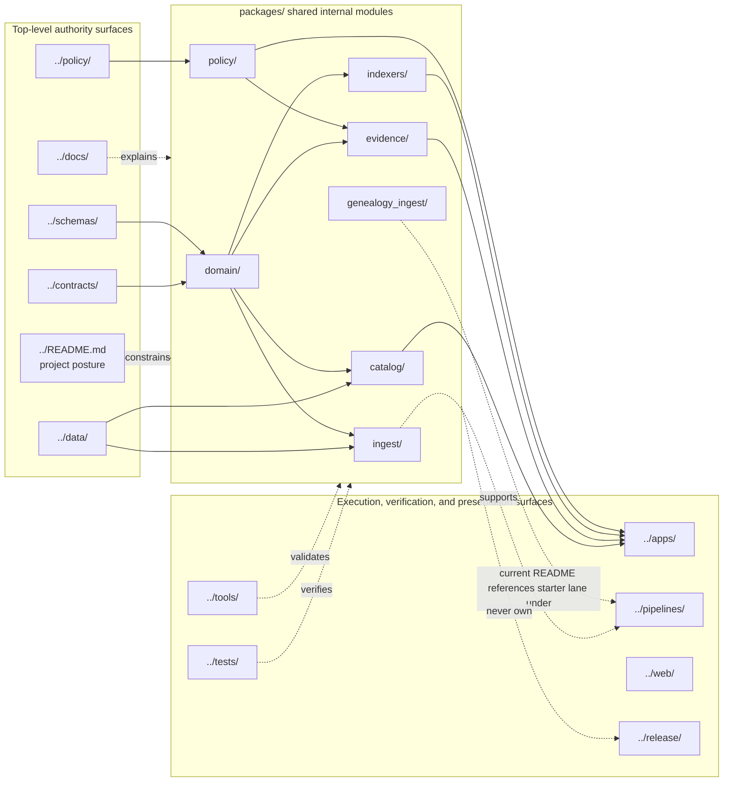

<!-- [KFM_META_BLOCK_V2]
doc_id: kfm://doc/NEEDS-VERIFICATION-packages-readme
title: packages/
type: standard
version: v1
status: review
owners: @bartytime4life
created: NEEDS-VERIFICATION
updated: 2026-04-22
policy_label: public
related: [../README.md, ../.github/CODEOWNERS, ../.github/README.md, ../contracts/README.md, ../schemas/README.md, ../policy/README.md, ../data/README.md, ../data/registry/README.md, ../docs/README.md, ../tests/README.md, ../tools/README.md, ../pipelines/README.md, ./catalog/README.md, ./domain/README.md, ./evidence/README.md, ./genealogy_ingest/README.md, ./indexers/README.md, ./ingest/README.md, ./policy/README.md]
tags: [kfm, packages, implementation, evidence, governance, trust-membrane]
notes: [doc_id and created date need repository metadata confirmation, policy_label is provisional for a public repository README, this revision replaces a zero-line package README with a governed directory contract]
[/KFM_META_BLOCK_V2] -->

<a id="top"></a>

# `packages/`

Shared internal package boundaries for reusable KFM logic that must stay subordinate to evidence, contracts, policy, release state, and governed APIs.

> [!IMPORTANT]
> **Status:** `active` directory · `review` README revision  
> **Owners:** `@bartytime4life` via broad `/packages/` CODEOWNERS fallback  
> **Path:** `packages/README.md`  
> **Authority class:** implementation-bearing package boundary; not doctrine, not policy law, not canonical data, and not release evidence  
> **Truth posture:** `CONFIRMED` public package path and child README surfaces · `PROPOSED` parent directory contract · `UNKNOWN / NEEDS VERIFICATION` package-local code, manifests, tests, imports, and runtime wiring  
>
> 
> 
> 
> 
> 
> 
>
> **Quick jumps:** [Scope](#scope) · [Repo fit](#repo-fit) · [Accepted inputs](#accepted-inputs) · [Exclusions](#exclusions) · [Current package surface](#current-package-surface) · [Directory tree](#directory-tree) · [Quickstart](#quickstart) · [Usage](#usage) · [Diagram](#diagram) · [Package map](#package-map) · [Boundary rules](#boundary-rules) · [Definition of done](#definition-of-done) · [FAQ](#faq) · [Appendix](#appendix)

> [!WARNING]
> `packages/` must not become a side door around the KFM trust membrane. Package code may support governed APIs, pipelines, UI, catalog work, Evidence Drawer payloads, Focus Mode, and release tooling, but it must not create a hidden public path to RAW, WORK, QUARANTINE, canonical stores, model runtimes, unpublished candidates, or policy-unchecked outputs.

---

## Scope

`packages/` is the shared internal module lane for reusable KFM implementation logic.

It sits between top-level authority surfaces and deployable or execution-facing surfaces. Its job is to keep shared logic bounded, testable, and reviewable without relocating authority away from `contracts/`, `schemas/`, `policy/`, governed `data/` artifacts, release evidence, or trust-visible runtime seams.

A healthy package in this directory should preserve:

- the governed truth path
- the trust membrane
- authoritative-versus-derived separation
- evidence-linked behavior
- fail-closed defaults where rights, sensitivity, policy, or evidence are uncertain
- rebuildable derived layers that do not pretend to be canonical truth

### Evidence posture used here

| Label | Meaning in this README |
| --- | --- |
| `CONFIRMED` | Directly supported by public repo-visible paths, child README surfaces, CODEOWNERS coverage, or checked adjacent docs. |
| `INFERRED` | Strongly suggested by child README wording or adjacent KFM docs, but not proven as executable implementation. |
| `PROPOSED` | Recommended package-boundary guidance consistent with KFM doctrine. |
| `UNKNOWN` | Not established strongly enough from inspected files or current workspace evidence. |
| `NEEDS VERIFICATION` | A concrete repo, code, CI, owner, fixture, runtime, or platform check is required before stronger claims are safe. |

[Back to top](#top)

---

## Repo fit

`packages/` is implementation-bearing. It is useful only when it stays downstream of stronger governance and upstream of deployable reuse.

| Relationship | Path | Role for `packages/` | Current posture |
| --- | --- | --- | --- |
| Root orientation | [`../README.md`](../README.md) | Project identity, truth posture, and repo-wide guardrails. | `CONFIRMED` public path |
| Ownership routing | [`../.github/CODEOWNERS`](../.github/CODEOWNERS) | Broad `/packages/` owner fallback. | `CONFIRMED` broad fallback |
| GitHub gatehouse | [`../.github/README.md`](../.github/README.md) | Review, CI/CD, and repository-control posture. | `CONFIRMED` adjacent surface |
| Contracts | [`../contracts/README.md`](../contracts/README.md) | Object meaning, interface commitments, contract families. | `CONFIRMED` adjacent surface |
| Schemas | [`../schemas/README.md`](../schemas/README.md) | Machine-checkable validation surface. | `CONFIRMED` adjacent surface |
| Policy | [`../policy/README.md`](../policy/README.md) | Rights, sensitivity, obligations, denials, release admissibility. | `CONFIRMED` adjacent surface |
| Data lifecycle | [`../data/README.md`](../data/README.md) | Registries, lifecycle zones, catalogs, receipts, proofs, published artifacts. | `CONFIRMED` adjacent surface |
| Source registry | [`../data/registry/README.md`](../data/registry/README.md) | SourceDescriptor and registry handoff for shared intake helpers. | `CONFIRMED` adjacent surface |
| Pipelines | [`../pipelines/README.md`](../pipelines/README.md) | Lane-specific fetch / normalize / validate / emit execution. | `CONFIRMED` adjacent surface |
| Apps / runtime | [`../apps/`](../apps/) | Deployable services and governed API consumers. | `CONFIRMED` root path; imports `UNKNOWN` |
| Web / presentation | [`../web/`](../web/) | Browser-delivered presentation surface downstream of governed contracts. | `CONFIRMED` root path; imports `UNKNOWN` |
| Tests | [`../tests/README.md`](../tests/README.md) | Verification posture and fixtures. | `CONFIRMED` adjacent surface |
| Tools | [`../tools/README.md`](../tools/README.md) | Validators, probes, CLIs, link checks, and utility tooling. | `CONFIRMED` adjacent surface |
| Infra | [`../infra/`](../infra/) | Deployment and environment wiring. | `CONFIRMED` root path; details `NEEDS VERIFICATION` |

### Placement rule

Put logic in `packages/` only when it is:

1. shared across more than one app, worker, validator, pipeline, package, or presentation-facing surface
2. non-deployable on its own
3. easier to review as a stable internal boundary than as app-local or pipeline-local glue
4. subordinate to stronger top-level contract, schema, policy, data, and review authority

[Back to top](#top)

---

## Accepted inputs

Content belongs in `packages/` when it is shared internal logic, not a public artifact, deployable entrypoint, or top-level authority source.

| Accepted input | Belongs here when… | Must stay linked to… |
| --- | --- | --- |
| Domain vocabulary and invariant helpers | They preserve stable KFM meaning across packages and runtime surfaces. | `contracts/`, `schemas/`, `docs/`, tests |
| Source intake helpers | They are reusable connector, normalization, validation, checksum, or receipt helpers. | `data/registry/`, `pipelines/`, `policy/` |
| Catalog closure helpers | They compile or validate DCAT / STAC / PROV closure without becoming the outward catalog. | `data/catalog/`, `release/`, governed API |
| Evidence helpers | They support `EvidenceRef` → `EvidenceBundle` resolution or evidence-safe presentation. | `contracts/`, `schemas/`, `apps/`, Evidence Drawer |
| Policy-support adapters | They normalize policy outcomes, reason codes, obligations, or fail-closed errors without owning policy truth. | `policy/`, `tests/policy/`, governed API |
| Rebuildable indexers | They build search, tile, graph, vector, or runtime projections that are derived and release-linked. | `data/`, `release/`, `tests/`, cache invalidation notes |
| Package-local tests and fixtures | They prove package behavior without replacing repo-level tests or policy fixtures. | `tests/`, child README, CI |
| Export maps and package docs | They make package boundaries explicit and reviewable. | parent README, child README, CODEOWNERS |

[Back to top](#top)

---

## Exclusions

`packages/` is not a catch-all. When in doubt, keep authority visible at the top-level lane that owns the meaning.

| Do not put this in `packages/` | Put it here instead | Why |
| --- | --- | --- |
| Deployable HTTP services, route handlers, workers, CLIs, or app entrypoints | [`../apps/`](../apps/), [`../web/`](../web/), or lane-specific runtime homes | Packages are reusable internals, not deployment units. |
| Lane-local fetch recipes, watcher schedules, or one-off pipeline runners | [`../pipelines/README.md`](../pipelines/README.md), [`../scripts/README.md`](../scripts/README.md) | Execution belongs with the lane or automation surface. |
| Canonical OpenAPI definitions, JSON Schemas, shared vocabularies, or object law | [`../contracts/`](../contracts/), [`../schemas/`](../schemas/) | Prevents parallel contract universes. |
| Repo-authoritative policy bundles, Rego, fixtures, or gate definitions | [`../policy/`](../policy/) and policy tests | Package helpers may consume policy; they do not define it. |
| RAW, WORK, QUARANTINE, PROCESSED, CATALOG/TRIPLET, or PUBLISHED artifacts | [`../data/`](../data/) lifecycle lanes and [`../release/`](../release/) | Preserves KFM lifecycle boundaries. |
| Receipts, proofs, manifests, catalogs, or release bundles as primary records | `data/receipts/`, `data/proofs/`, `data/manifests/`, `data/catalog/`, `release/` as repo conventions confirm | Packages may emit or validate these objects; they do not own release memory. |
| Secrets, credentials, local machine state, tokens, private service URLs, model endpoints | Secret manager, deployment environment, or non-repo operational config | Prevents accidental exposure. |
| Architecture doctrine, ADRs, runbooks, and contributor policy | [`../docs/`](../docs/) | Maintains a visible documentation control plane. |
| Direct model-client traffic or free-form AI behavior | Governed API + evidence resolver + runtime envelope | AI remains downstream of evidence, policy, release state, and citation validation. |
| Public UI trust cues stripped of evidence context | Governed API, Evidence Drawer, layer manifests, Focus envelope | Public surfaces must preserve trust cues and correction state. |

[Back to top](#top)

---

## Current package surface

`CONFIRMED`: the package family currently has child README surfaces. `UNKNOWN`: package-local code depth, manifests, tests, exports, runtime imports, and branch-enforced CI.

| Package | Root-contract reading | Current visible state | Must never do |
| --- | --- | --- | --- |
| [`./catalog/`](./catalog/) | Shared internal catalog-closure compiler / validator seam. | README-only child boundary surface visible on public `main`. | Become an ad hoc runtime API surface or release authority. |
| [`./domain/`](./domain/) | Stable semantic core for KFM vocabulary, invariants, and cross-package meaning. | README-only child boundary surface visible on public `main`. | Own deployable side effects, transport, filesystem, database, or policy authority. |
| [`./evidence/`](./evidence/) | Governed `EvidenceRef` → `EvidenceBundle` resolution and evidence-safe presentation helpers. | README-only child boundary surface visible on public `main`. | Emit uncited or policy-unchecked evidence surfaces. |
| [`./genealogy_ingest/`](./genealogy_ingest/) | Genealogy-shaped ingest seam; child README currently frames a starter ingest lane against `pipelines/genealogy_ingest/`. | README-only child surface with path-alignment tension. | Blur package boundary, lane execution, living-person privacy, DNA sensitivity, or consent review. |
| [`./indexers/`](./indexers/) | Rebuildable search, tile, and runtime projection builders. | README-only child boundary surface visible on public `main`. | Become authoritative truth or source-of-record. |
| [`./ingest/`](./ingest/) | Source intake, normalization, validation, and receipt helpers. | README-only child boundary surface visible on public `main`. | Serve clients directly or bypass lifecycle gates. |
| [`./policy/`](./policy/) | Shared internal policy-support logic and adapters. | README-only child boundary surface visible on public `main`. | Replace repo-authoritative [`../policy/`](../policy/). |

> [!NOTE]
> This package family is not perfectly uniform. Most child surfaces are README-first package seams; `genealogy_ingest/` is more lane-shaped and currently names a pipeline-oriented starter path. Keep package path, pipeline path, and actual checked-in implementation visibly separate until the active branch proves they align.

[Back to top](#top)

---

## Directory tree

### Current public package-family snapshot

```text
packages/
├── README.md
├── catalog/
│   └── README.md
├── domain/
│   └── README.md
├── evidence/
│   └── README.md
├── genealogy_ingest/
│   └── README.md
├── indexers/
│   └── README.md
├── ingest/
│   └── README.md
└── policy/
    └── README.md
```

### Doctrine-aligned growth shape

`PROPOSED`, not current implementation evidence:

```text
packages/<package-name>/
├── README.md
├── package manifest             # package.json / pyproject.toml / go.mod / Cargo.toml as repo convention requires
├── src/                         # reusable internal implementation only
├── tests/                       # package-local tests proving the local contract
├── fixtures/                    # package-local valid/invalid examples, when useful
└── examples/                    # non-production examples, clearly labeled
```

> [!TIP]
> Replace the current snapshot only with inventory generated from the active checkout. Do not infer package manifests, `src/` trees, import graphs, or runnable commands from README prose.

[Back to top](#top)

---

## Quickstart

Use read-only inspection before making package claims stronger.

```bash
# Confirm repository state.
git status --short
git branch --show-current
git rev-parse --show-toplevel

# Inventory the package family.
find packages -maxdepth 2 -type d | sort
find packages -maxdepth 2 -name README.md | sort
find packages -maxdepth 4 -type f | sort

# Check whether package-local implementation exists.
find packages -maxdepth 4 \
  \( -name package.json -o -name pyproject.toml -o -name Cargo.toml -o -name go.mod -o -name tsconfig.json -o -name Makefile \) \
  | sort

# Read the parent and child package boundary docs.
sed -n '1,260p' packages/README.md
for d in catalog domain evidence genealogy_ingest indexers ingest policy; do
  echo "---- packages/$d ----"
  test -f "packages/$d/README.md" && sed -n '1,180p' "packages/$d/README.md"
done

# Recheck adjacent authority and downstream surfaces.
sed -n '1,220p' ../README.md 2>/dev/null || sed -n '1,220p' README.md
sed -n '1,160p' .github/CODEOWNERS
sed -n '1,220p' contracts/README.md
sed -n '1,220p' schemas/README.md
sed -n '1,220p' policy/README.md
sed -n '1,240p' data/README.md
sed -n '1,220p' data/registry/README.md
sed -n '1,220p' pipelines/README.md
sed -n '1,220p' tests/README.md
sed -n '1,220p' tools/README.md

# Look for KFM trust-surface vocabulary in implementation-bearing paths.
grep -RInE \
  'EvidenceRef|EvidenceBundle|DecisionEnvelope|RuntimeResponseEnvelope|SourceDescriptor|ReleaseManifest|CatalogMatrix|run_receipt|ai_receipt|spec_hash|ABSTAIN|DENY|ERROR|ANSWER|trust membrane|RAW|WORK|QUARANTINE|PUBLISHED' \
  packages contracts schemas policy data tests tools apps pipelines docs 2>/dev/null || true
```

> [!CAUTION]
> These commands prove only the current checkout they inspect. They do not prove package publication, package-manager selection, build success, import graphs, deployed behavior, branch protection, workflow enforcement, or runtime adoption.

[Back to top](#top)

---

## Usage

### Treat this README as the parent package contract

Use `packages/README.md` to decide whether logic belongs in `packages/` at all. Then confirm the child package README and live files before documenting narrower ownership.

### Keep child READMEs as boundary docs first

Child READMEs can carry useful package-local intent, but a README is not executable proof. Do not claim source files, tests, import graphs, build commands, or runtime consumers until the active branch exposes them.

### Prefer named packages over `common/` sprawl

A reusable package should have a crisp responsibility. Catch-all buckets such as `common/`, `shared/`, or `utils/` erase architecture and make review harder.

### Keep imports directional

Packages should depend inward toward stable semantics and top-level contracts. They should not depend outward on volatile runtime shells, app-local glue, environment-specific deployment code, or lane orchestration.

### Keep deployable concerns out

Package code may support apps, pipelines, and web-delivered surfaces, but it should not quietly become an app, lane, or presentation shell by accumulating startup behavior, route handlers, schedulers, auth entrypoints, or environment ownership.

### Update both layers when boundaries change

When a package is added, renamed, split, removed, or materially repurposed, update:

1. the child package README
2. this parent README
3. related CODEOWNERS entries
4. affected tests, fixtures, contracts, schemas, policy docs, or runbooks
5. rollback and migration notes where downstream imports may be affected

[Back to top](#top)

---

## Diagram


```mermaid
flowchart LR
    subgraph Authority["Top-level authority surfaces"]
        ROOT["../README.md<br/>project posture"]
        CONTRACTS["../contracts/"]
        SCHEMAS["../schemas/"]
        POLICY["../policy/"]
        DATA["../data/"]
        DOCS["../docs/"]
    end

    subgraph Packages["packages/ shared internal modules"]
        CATALOG["catalog/"]
        DOMAIN["domain/"]
        EVIDENCE["evidence/"]
        GENEALOGY["genealogy_ingest/"]
        INDEXERS["indexers/"]
        INGEST["ingest/"]
        PPOLICY["policy/"]
    end

    subgraph Execution["Execution, verification, and presentation surfaces"]
        APPS["../apps/"]
        PIPELINES["../pipelines/"]
        WEB["../web/"]
        TESTS["../tests/"]
        TOOLS["../tools/"]
        RELEASE["../release/"]
    end

    ROOT -. constrains .-> Packages
    DOCS -. explains .-> Packages
    CONTRACTS --> DOMAIN
    SCHEMAS --> DOMAIN
    POLICY --> PPOLICY
    DATA --> CATALOG
    DATA --> INGEST

    DOMAIN --> CATALOG
    DOMAIN --> EVIDENCE
    DOMAIN --> INDEXERS
    DOMAIN --> INGEST
    PPOLICY --> EVIDENCE

    INGEST -. supports .-> PIPELINES
    GENEALOGY -. current README references starter lane under .-> PIPELINES
    CATALOG --> APPS
    EVIDENCE --> APPS
    INDEXERS --> APPS
    PPOLICY --> APPS

    TESTS -. verifies .-> Packages
    TOOLS -. validates .-> Packages
    Packages -. never own .-> RELEASE
```

The boundary is intentional: package code may implement reusable internal mechanics, but KFM truth remains anchored in evidence, policy, contracts, lifecycle artifacts, review state, release manifests, and correction lineage outside the package directory.

[Back to top](#top)

---

## Package map

### Child package roles

| Package | Primary role | Stronger authority it must respect | First maturity check |
| --- | --- | --- | --- |
| [`catalog/`](./catalog/) | Compile / validate linked catalog closure. | `data/catalog/`, release state, contracts, policy. | Does it validate identifier parity across DCAT, STAC, PROV, release refs, and EvidenceBundle routes? |
| [`domain/`](./domain/) | Stable semantic vocabulary and invariant helpers. | Contracts, schemas, docs, policy. | Does it stay side-effect-free and reusable across multiple packages? |
| [`evidence/`](./evidence/) | Resolve evidence handles into policy-safe support packages. | EvidenceBundle contract, policy, governed API. | Can it return bounded negative states instead of unsupported evidence? |
| [`genealogy_ingest/`](./genealogy_ingest/) | Starter genealogy-shaped ingest seam. | People/DNA/land policy, privacy, consent, pipeline ownership. | Is package-vs-pipeline placement explicitly resolved before implementation claims grow? |
| [`indexers/`](./indexers/) | Build derived search, tile, or runtime projections. | Release state, source lineage, freshness, correction propagation. | Are outputs rebuildable, release-linked, and clearly non-authoritative? |
| [`ingest/`](./ingest/) | Shared source intake, normalization, validation, and receipt helpers. | SourceDescriptor, data lifecycle, policy, quarantine rules. | Does it emit or support receipts without bypassing RAW → WORK / QUARANTINE? |
| [`policy/`](./policy/) | Shared internal policy-support adapters. | Top-level `policy/`, policy tests, contracts, schemas. | Does it consume policy outputs without redefining policy truth? |

### Package-adjacent governed objects

| Object family | Stronger home | Typical package relationship |
| --- | --- | --- |
| `SourceDescriptor` | `contracts/`, `schemas/`, `data/registry/` | `ingest/` consumes source identity and activation posture. |
| `IngestReceipt`, `ValidationReport` | `contracts/`, `schemas/`, `data/receipts/`, `data/proofs/` | `ingest/` may emit or validate process memory. |
| `DatasetVersion` | `contracts/`, `schemas/`, `data/processed/` | `catalog/` and `indexers/` consume stable processed state. |
| `EvidenceRef`, `EvidenceBundle` | `contracts/`, `schemas/`, governed API, Evidence Drawer | `evidence/` resolves and packages support for runtime surfaces. |
| `DecisionEnvelope`, `PolicyDecision` | `policy/`, `contracts/`, `schemas/` | `policy/` package helpers may normalize outcomes and obligations. |
| `ReleaseManifest`, `CatalogMatrix`, `LayerManifest` | `release/`, `data/catalog/`, `contracts/`, `schemas/` | `catalog/` and `indexers/` may build or validate release-linked derivatives. |
| `RuntimeResponseEnvelope`, `AIReceipt` | governed API / runtime contract surfaces | Packages may support structured emission; they must not publish model output directly. |
| `CorrectionNotice`, `RollbackReference` | release, correction, and docs/runbook surfaces | Packages should carry references forward, not erase correction memory. |

[Back to top](#top)

---

## Boundary rules

### What makes a good package

A good KFM package usually has:

- one crisp responsibility
- stable dependency direction
- README-local accepted inputs and exclusions
- tests or fixtures near the logic they prove
- explicit dependency on top-level contracts, schemas, and policy where relevant
- bounded negative outcomes for unsupported or policy-blocked behavior
- no silent authority claims beyond its layer

### What should stay at the top level

Even when package code supports these surfaces, the authoritative versions stay outside `packages/`:

- API contracts
- shared schemas
- policy bundles and policy fixtures
- governed data artifacts
- catalog outputs
- release-bearing manifests, receipts, and proof objects
- deployment and environment definitions
- documentation doctrine, ADRs, and runbooks

### Policy overlap rule

`packages/policy/` may help runtime and pipeline code carry policy outcomes consistently. It must not become a shadow `policy/` directory. If the same rule exists both as package code and top-level policy, the package is the adapter and the top-level policy surface is the authority.

### Evidence overlap rule

`packages/evidence/` may resolve, shape, validate, or summarize support packages. It must not become a hidden evidence store or a browser-accessible bypass around the governed API.

### Indexer overlap rule

`packages/indexers/` produces rebuildable projections. Search indexes, tiles, embeddings, graph projections, PMTiles, COG derivatives, cached descriptors, and summaries are not sovereign truth.

### Ingest overlap rule

`packages/ingest/` supports source intake. It must not publish, promote, or serve outputs. Failed, sensitive, rights-unclear, or malformed inputs must remain visible through quarantine, receipts, validation reports, or denial states.

[Back to top](#top)

---

## Definition of done

A `packages/` change is done enough to support stronger claims only when the checked items below are true in the active repository.

- [ ] KFM meta block has a real `doc_id`, verified created date, verified policy label, and valid related links.
- [ ] CODEOWNERS coverage is confirmed for changed package paths.
- [ ] Parent `packages/README.md` and affected child README are updated together.
- [ ] Package purpose, accepted inputs, exclusions, and stronger authority surfaces are explicit.
- [ ] Package manifest and test runner are directly inspected before install/build/test commands are documented.
- [ ] Package-local tests or fixtures exist when implementation code exists.
- [ ] Package does not define canonical schemas, policy law, release records, data lifecycle artifacts, or public routes by accident.
- [ ] Package does not create a normal public path to RAW, WORK, QUARANTINE, canonical stores, model runtimes, vector indexes, or unpublished candidates.
- [ ] Package handles `ABSTAIN`, `DENY`, `ERROR`, stale, restricted, generalized, and unavailable states where its boundary can encounter them.
- [ ] Any emitted receipt, proof, manifest, catalog closure, or layer descriptor stays in its owning lifecycle or release lane.
- [ ] Changes that affect downstream imports include migration notes and rollback steps.
- [ ] Documentation avoids upgrading README presence into implementation maturity.

[Back to top](#top)

---

## FAQ

### Is `packages/` where KFM truth lives?

No. `packages/` can implement reusable logic, but KFM truth remains governed through source identity, evidence, policy, lifecycle state, catalog closure, release manifests, review records, and correction lineage.

### Can package code call RAW or canonical stores?

Only through approved internal paths that preserve lifecycle and policy boundaries. Package code must not create a normal public or UI path to RAW, WORK, QUARANTINE, canonical stores, unpublished candidates, or model runtimes.

### Can a package publish a result if its tests pass?

No. Passing package tests is evidence, not publication authority. Publication requires validation, policy checks, review state where required, provenance, proof objects, release manifest, correction/rollback context, and governed promotion.

### Can `packages/policy/` define policy?

No. It may normalize or adapt policy outputs for shared package use. The repo-authoritative policy surface remains `../policy/` and its linked fixtures and tests.

### Why are most implementation claims still `UNKNOWN`?

Because README-visible package directories do not prove manifests, source files, tests, import graphs, CI gates, runtime behavior, package publishing, or deployment. Those require direct checkout, file, test, workflow, or runtime evidence.

[Back to top](#top)

---

## Appendix

<details>
<summary>Verification backlog</summary>

| Item | Why it matters | Suggested evidence |
| --- | --- | --- |
| Parent README replacement | Confirms this file is no longer a zero-line placeholder. | Direct `git show HEAD:packages/README.md` or PR diff. |
| Child package inventory | Prevents stale package map. | `find packages -maxdepth 2 -type d | sort`. |
| Package-local code depth | Prevents README-only surfaces from being described as implemented packages. | `find packages/<name> -maxdepth 4 -type f | sort`. |
| Package manager | Needed before documenting install/build commands. | Lockfiles, package manifests, CI workflows. |
| Test runner | Needed before claiming validation. | Local test config and passing test output. |
| Import graph | Needed before claiming downstream consumers. | Static imports, package exports, tests, runtime docs. |
| Schema home | Prevents `contracts/` vs `schemas/` drift. | ADR, object map, validation fixtures. |
| Policy toolchain | Needed before claiming OPA/Rego/Conftest or equivalent enforcement. | Policy tests, tool versions, workflow logs. |
| Release artifact storage | Needed before saying packages emit release evidence. | Generated receipts, proofs, manifests, catalogs, release dry-run logs. |
| Local exposure posture | Package helpers may touch runtime-adjacent boundaries. | Deployment docs, reverse proxy/VPN config, CORS/auth/secrets evidence. |

</details>

<details>
<summary>Glossary</summary>

| Term | Meaning in this README |
| --- | --- |
| Package boundary | A reusable internal module seam under `packages/`, not a deployable product surface. |
| Trust membrane | KFM boundary preventing public clients, UI surfaces, and model runtimes from bypassing governed evidence and policy flow. |
| EvidenceRef | Stable reference to support material that must resolve to an EvidenceBundle before consequential claims. |
| EvidenceBundle | Inspectable support package carrying source, scope, lineage, rights, review, freshness, release, and correction context. |
| Finite outcome | A bounded result such as `ANSWER`, `ABSTAIN`, `DENY`, or `ERROR`. |
| Rebuildable projection | Derived search, tile, graph, vector, cache, or summary output that can be regenerated from governed release inputs. |
| Shadow authority | Duplicate policy, schema, data, release, or evidence meaning hidden inside package code. |
| Promotion | Governed state transition into public-safe release, not a file move or package test success. |

</details>

[Back to top](#top)
